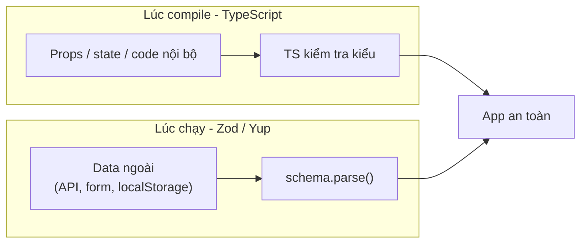
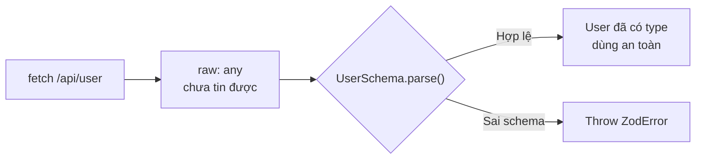

# Types và Validation

Trong React, **Types** (kiểu dữ liệu) giúp bạn khai báo rõ ràng props và state nhận giá trị gì, thường dùng cùng TypeScript để bắt lỗi ngay khi viết code. **Validation** (kiểm tra dữ liệu hợp lệ) đảm bảo dữ liệu truyền vào component đúng định dạng mong đợi, tránh lỗi khi chạy. Bài này giới thiệu cách dùng TypeScript cho component và kiểm tra dữ liệu lúc chạy (runtime).

[](pathname:///img/react/types-validation.webp)

---

:::note[Ghi nhớ nhanh]

- ⭐ **Hai lớp bảo vệ khác thời điểm** — TypeScript bắt lỗi lúc compile (props, state, code nội bộ); Zod/Yup kiểm tra lúc runtime cho mọi dữ liệu từ ngoài (API, form, `localStorage`).
- ⭐ **`z.infer<typeof Schema>` cho một schema = một type + N điểm validation** — không phải khai báo type và luật kiểm tra hai lần; đây là productivity boost lớn nhất khi TS gặp Zod.
- **TypeScript là default 2026, `PropTypes` đã bỏ khỏi React core từ v19** — đừng dùng PropTypes trong code mới (chỉ check runtime, verbose).
- **Định kiểu component**: dùng `interface Props`, `ReactNode` cho children, extend `React.ButtonHTMLAttributes`; **tránh `React.FC`** (ngầm thêm `children`, khó generic).
- **Zod phổ biến nhất (#1)** — TypeScript-first, hệ sinh thái rộng (RHF, tRPC, Drizzle); **Valibot** nhẹ hơn (~3KB, tree-shakeable) khi cần tối ưu bundle. Dùng `parse` ở server (để error bubble), `safeParse` ở form (hiện lỗi đẹp).

:::

---

## Mục lục

- [Vì sao cần types & validation?](#vì-sao-cần-types--validation)
- [TypeScript với React](#typescript-với-react)
- [PropTypes (legacy)](#proptypes-legacy)
- [Type cho component](#type-cho-component)
- [Validation runtime](#validation-runtime)
- [Zod vs Yup vs Valibot](#zod-vs-yup-vs-valibot)
- [Câu hỏi phỏng vấn](#câu-hỏi-phỏng-vấn)

---

## Vì sao cần types & validation?

**Vấn đề:**

```tsx
// 1. Truyền sai props mà không ai báo lúc viết code
function Greeting({ name, age }) {
  return <p>Hi {name}, {age + 1}</p>;
}

<Greeting name="An" />;        // quên age → age là undefined
<Greeting name="An" age="20" />; // sai kiểu → "201" thay vì 21
// Không lỗi compile, chỉ crash/sai khi chạy → rất khó truy vết

// 2. Dữ liệu từ API/form là "không tin được"
const user = await fetch("/api/user").then(r => r.json());
user.profile.avatar; // thiếu field → crash; sai kiểu → bug ngầm
```

**Giải pháp:**

```tsx
// (1) Compile-time: TypeScript định kiểu props (thay PropTypes runtime cũ)
interface GreetingProps {
  name: string;
  age: number;
}

function Greeting({ name, age }: GreetingProps) {
  return <p>Hi {name}, {age + 1}</p>;
}

<Greeting name="An" />;          // ❌ IDE báo ngay: thiếu 'age'
<Greeting name="An" age="20" />; // ❌ IDE báo ngay: 'age' phải là number
// → bắt lỗi khi viết + autocomplete

// (2) Runtime: Zod parse dữ liệu ngoài tại boundary, đồng thời suy ra type
import { z } from "zod";

const UserSchema = z.object({
  name: z.string(),
  age: z.number(),
});
type User = z.infer<typeof UserSchema>; // type suy ra từ schema

async function fetchUser(): Promise<User> {
  const raw = await fetch("/api/user").then(r => r.json());
  return UserSchema.parse(raw); // báo lỗi rõ nếu thiếu field/sai kiểu
}
```

**Hai lớp bảo vệ:** TypeScript bắt lỗi lúc compile (props, code nội bộ), Zod/Yup kiểm tra lúc runtime cho mọi dữ liệu đến từ bên ngoài.

Có thể hình dung hai lớp bảo vệ này hoạt động ở hai thời điểm khác nhau:



:::tip[Dùng thực tế]

- **Định kiểu props component**: TypeScript báo ngay khi quên prop hoặc truyền sai kiểu, kèm autocomplete.
- **Validate form**: Zod parse dữ liệu nhập trước khi submit, hiển thị lỗi rõ ràng cho người dùng.
- **Parse response API**: gọi `UserSchema.parse(...)` ngay sau `fetch`, chặn dữ liệu rác trước khi nó lan vào app.
- **Suy type từ schema**: `z.infer<typeof Schema>` cho ra type duy nhất — không phải khai báo type và validation hai lần.

:::

---

## TypeScript với React

TypeScript là **default 2026** cho mọi project React mới. Lợi ích:

- Autocomplete props, hook.
- Catch bug compile-time (typo, undefined, sai type).
- Refactor an toàn.
- Documentation từ type.

(Tham khảo [TypeScript roadmap](/docs/typescript/01-gioi-thieu/1_typescript-la-gi)
cho cơ bản.)

---

## PropTypes (legacy)

Trước TS, React có **PropTypes** để runtime check props:

```jsx
import PropTypes from "prop-types";

function Greeting({ name, age }) {
  return <p>Hi {name}, {age}</p>;
}

Greeting.propTypes = {
  name: PropTypes.string.isRequired,
  age: PropTypes.number,
};
```

:::warning[Cần lưu ý]

**PropTypes đã được tách khỏi React core từ v19**:

- Check **runtime only** — đến lúc chạy mới biết sai.
- Verbose hơn TS interface.
- TS bắt lỗi **compile-time** — sớm hơn nhiều.

Năm 2026, **đừng dùng PropTypes** trong code mới. Migrate sang TypeScript.

:::

---

## Type cho component

**Functional component**:

```tsx
interface ButtonProps {
  label: string;
  onClick: () => void;
  variant?: "primary" | "secondary";
  disabled?: boolean;
}

function Button({ label, onClick, variant = "primary", disabled }: ButtonProps) {
  return <button onClick={onClick} disabled={disabled}>{label}</button>;
}
```

**Children type**:

```tsx
import { ReactNode } from "react";

interface CardProps {
  children: ReactNode;
}

function Card({ children }: CardProps) {
  return <div>{children}</div>;
}
```

**Event handler**:

```tsx
function Form() {
  const handleSubmit = (e: React.FormEvent<HTMLFormElement>) => {
    e.preventDefault();
  };

  const handleChange = (e: React.ChangeEvent<HTMLInputElement>) => {
    console.log(e.target.value);
  };

  return (
    <form onSubmit={handleSubmit}>
      <input onChange={handleChange} />
    </form>
  );
}
```

**Extend HTML attribute**:

```tsx
interface ButtonProps extends React.ButtonHTMLAttributes<HTMLButtonElement> {
  variant?: "primary" | "secondary";
}

function Button({ variant = "primary", ...rest }: ButtonProps) {
  return <button data-variant={variant} {...rest} />;
}

// Nhận mọi prop của <button>: type, disabled, aria-*, data-*, etc.
<Button type="submit" aria-label="Save">Save</Button>
```

:::info[Phân tích]

**Tránh `React.FC`**:

```tsx
// Không khuyến nghị
const Button: React.FC<ButtonProps> = ({ label }) => <button>{label}</button>;

// Khuyến nghị
function Button({ label }: ButtonProps) {
  return <button>{label}</button>;
}
```

Lý do:

- `React.FC` ngầm thêm `children?: ReactNode` → component không nhận
  children vẫn pass type-check.
- Generic component khó hơn.
- React docs đã bỏ khỏi example.

:::

**Generic component**:

```tsx
interface SelectProps<T> {
  options: T[];
  value: T;
  onChange: (value: T) => void;
  renderOption: (option: T) => string;
}

function Select<T>({ options, value, onChange, renderOption }: SelectProps<T>) {
  return (
    <select value={JSON.stringify(value)} onChange={(e) => onChange(JSON.parse(e.target.value))}>
      {options.map((opt, i) => (
        <option key={i} value={JSON.stringify(opt)}>{renderOption(opt)}</option>
      ))}
    </select>
  );
}

// Dùng
<Select<User>
  options={users}
  value={selectedUser}
  onChange={setSelectedUser}
  renderOption={u => u.name}
/>
```

---

## Validation runtime

TypeScript chỉ check **compile-time**. Data từ ngoài (API, user, localStorage)
**không type-safe runtime**:

```tsx
const user = await fetch("/api/user").then(r => r.json());
// user có type 'any' — TS không biết đúng hay sai

user.name; // TS không complain, runtime có thể crash
```

→ Cần **runtime validation** tại boundary:

```tsx
import { z } from "zod";

const UserSchema = z.object({
  id: z.number(),
  name: z.string(),
  email: z.string().email(),
});

type User = z.infer<typeof UserSchema>;

async function fetchUser() {
  const raw = await fetch("/api/user").then(r => r.json());
  return UserSchema.parse(raw); // throw nếu sai schema
  // Trả về User (typed)
}
```

Luồng dữ liệu ngoài đi qua cửa kiểm tra schema trước khi vào app:



---

## Zod vs Yup vs Valibot

[**Zod**](https://zod.dev) — phổ biến nhất, TypeScript-first:

```tsx
const schema = z.object({
  email: z.string().email(),
  age: z.number().int().min(18),
});

type Input = z.infer<typeof schema>;

const result = schema.safeParse(input);
if (!result.success) {
  console.log(result.error.flatten());
}
```

[**Valibot**](https://valibot.dev) — alternative gọn hơn, tree-shakeable:

```tsx
import * as v from "valibot";

const schema = v.object({
  email: v.pipe(v.string(), v.email()),
  age: v.pipe(v.number(), v.integer(), v.minValue(18)),
});

const result = v.safeParse(schema, input);
```

[**Yup**](https://github.com/jquense/yup) — cũ, vẫn maintain:

```tsx
import * as yup from "yup";

const schema = yup.object({
  email: yup.string().email().required(),
  age: yup.number().integer().min(18).required(),
});

await schema.validate(input);
```

[**Joi**](https://joi.dev) — Node.js focused, ít dùng frontend.

:::info[Phân tích]

**So sánh nhanh:**

| | Zod | Valibot | Yup |
|--|-----|---------|-----|
| Bundle size | ~14KB | **~3KB** | ~12KB |
| Tree-shakeable | Khá | **Tốt** | Khá |
| TypeScript infer | **Xuất sắc** | Xuất sắc | Tốt |
| Adoption | **#1** | Tăng | Giảm |
| Ecosystem (resolver, plugins) | **Phong phú** | Đang xây | Có |

**Quy tắc:**

- Default project mới → **Zod**.
- Quan tâm bundle size critical → **Valibot**.
- Legacy đã dùng Yup → giữ, migrate nếu cần.

Stack tích hợp Zod:

- **RHF**: `@hookform/resolvers/zod`.
- **tRPC**: input schema.
- **Drizzle ORM**: type inference.
- **Next.js Server Actions**: input parse.

Có thể nói Zod là **lingua franca** của TypeScript ecosystem 2026.

:::

:::tip[Mẹo]

**Pattern "schema everywhere":**

```ts
// schemas/user.ts
import { z } from "zod";

export const userSchema = z.object({
  id: z.string().uuid(),
  name: z.string().min(1).max(100),
  email: z.string().email(),
});

export type User = z.infer<typeof userSchema>;
```

Dùng schema này khắp nơi:

```ts
// API client
const user = userSchema.parse(await fetch("/api/user").then(r => r.json()));

// Form validation
const form = useForm<User>({ resolver: zodResolver(userSchema) });

// Local storage
const stored = userSchema.parse(JSON.parse(localStorage.getItem("user")));

// Server route
export async function POST(req: Request) {
  const data = userSchema.parse(await req.json());
}
```

**1 schema = 1 type + N validation point**. Đây là productivity boost
lớn nhất khi TS gặp Zod.

:::

:::warning[Cần lưu ý]

**`parse` vs `safeParse`:**

```ts
// parse — throw nếu sai
const user = userSchema.parse(input); // crash app nếu input sai

// safeParse — trả result object
const result = userSchema.safeParse(input);
if (result.success) {
  console.log(result.data); // typed
} else {
  console.log(result.error); // ZodError
}
```

Trong API/server: dùng `parse`, để error bubble lên error handler.
Trong form: dùng `safeParse` để hiển thị error đẹp.

:::

---

## Câu hỏi phỏng vấn

Những câu thường gặp về chủ đề này. Tự trả lời trước, rồi bấm **Xem đáp án** để đối chiếu.

**1. TypeScript và Zod bảo vệ ứng dụng ở hai thời điểm khác nhau. Giải thích sự khác biệt đó.**

<details className="qa">
<summary>Xem đáp án</summary>

Đây là **hai lớp bảo vệ** hoạt động ở hai thời điểm:

| | TypeScript | Zod / Yup / Valibot |
|---|---|---|
| Thời điểm | Compile-time (lúc viết/build) | Runtime (lúc chạy) |
| Phạm vi | Props, state, code nội bộ | Dữ liệu từ bên ngoài: API, form, `localStorage` |
| Kết quả khi sai | IDE/`tsc` báo lỗi, không build được | Throw `ZodError` hoặc trả `result.success === false` |
| Còn lại sau build | Không — type bị xoá sạch | Có — schema là code JS thật, vẫn chạy |

TypeScript chỉ là một hợp đồng giữa các đoạn code do bạn viết. Nó không thể kiểm tra thứ mà nó chưa từng thấy lúc compile. Zod ngược lại: schema tồn tại lúc runtime nên kiểm tra được dữ liệu thực tế đi vào app.

Trong thực tế hai lớp này bổ sung cho nhau: TS lo phần trong biên giới app, Zod đứng gác ở **boundary** — mỗi chỗ dữ liệu lạ bước vào.

</details>

**2. Vì sao chỉ có TypeScript là chưa đủ khi nhận dữ liệu từ API, form hay `localStorage`?**

<details className="qa">
<summary>Xem đáp án</summary>

Vì type của TypeScript **bị xoá hoàn toàn sau khi build** — không còn dòng kiểm tra nào lúc chạy. Với dữ liệu ngoài, TS chỉ biết những gì bạn *khai báo*, chứ không biết những gì server *thực sự trả về*:

```tsx
const user = await fetch("/api/user").then(r => r.json());
// user có type 'any' — TS không biết đúng hay sai
user.name; // TS không complain, runtime có thể crash
```

Tệ hơn là khi bạn tự ép kiểu: `const user = (await res.json()) as User;`. Lúc này TS *tin* bạn và cho autocomplete đầy đủ, nhưng nếu API trả thiếu field hoặc sai kiểu thì bug chỉ lộ ra ở chỗ khác, rất khó truy vết.

Giải pháp là validate ngay tại boundary: `UserSchema.parse(raw)` — sai schema thì throw ngay tại điểm nhận, kèm thông tin field nào sai, thay vì để dữ liệu rác lan khắp app.

</details>

**3. `z.infer<typeof Schema>` mang lại lợi ích gì? Vì sao gọi đây là 'single source of truth'?**

<details className="qa">
<summary>Xem đáp án</summary>

`z.infer` suy ra type TypeScript **trực tiếp từ schema**, nên bạn chỉ khai báo hình dạng dữ liệu một lần:

```ts
export const userSchema = z.object({
  id: z.string().uuid(),
  name: z.string().min(1).max(100),
  email: z.string().email(),
});

export type User = z.infer<typeof userSchema>;
```

Nếu viết tay cả `interface User` lẫn schema, hai thứ sẽ **lệch nhau** theo thời gian — thêm field vào interface mà quên schema (hoặc ngược lại) là lỗi rất hay gặp, và trình biên dịch không giúp được gì.

Với `z.infer`, sửa schema là type tự đổi theo, mọi chỗ dùng sai sẽ đỏ ngay. Đó là lý do gọi là **single source of truth**: một schema dùng được cho API client, form (`zodResolver`), `localStorage`, server route — **1 schema = 1 type + N validation point**.

</details>

**4. Phân biệt `parse` và `safeParse`. Dùng cái nào ở tầng API server, cái nào ở form? Vì sao?**

<details className="qa">
<summary>Xem đáp án</summary>

```ts
// parse — throw ZodError nếu sai
const user = userSchema.parse(input);

// safeParse — không throw, trả về result object
const result = userSchema.safeParse(input);
if (result.success) {
  console.log(result.data);  // đã typed
} else {
  console.log(result.error); // ZodError
}
```

- **`parse`** hợp với **API/server**: ở đó dữ liệu sai là tình huống bất thường, nên để error **bubble** lên error handler chung, trả 400 và ghi log ở một chỗ. Không phải viết `if/else` lặp lại ở từng route.
- **`safeParse`** hợp với **form**: người dùng nhập sai là chuyện bình thường, không nên throw. Bạn cần giữ luồng chạy để đọc `result.error` và hiển thị lỗi cạnh từng ô nhập.

Ngoài ra còn cặp bất đồng bộ `parseAsync` / `safeParseAsync` khi schema có luật kiểm tra async (ví dụ gọi API kiểm tra email trùng).

</details>

**5. Vì sao `PropTypes` bị loại khỏi React core từ v19? Nó có hạn chế gì so với TypeScript?**

<details className="qa">
<summary>Xem đáp án</summary>

Vì TypeScript đã trở thành mặc định của hệ sinh thái React, giữ `PropTypes` trong core chỉ làm nặng bundle mà gần như không ai dùng. Từ v19 nó bị tách ra khỏi React (vẫn còn package `prop-types` riêng nếu cần cho code cũ).

Hạn chế so với TypeScript:

- **Chỉ check runtime** — phải chạy tới đúng nhánh code đó mới biết sai, trong khi TS báo ngay khi đang gõ.
- **Chỉ cảnh báo trong dev**, bản production bị strip đi, nên không bảo vệ gì cho người dùng cuối.
- **Không có autocomplete, không refactor an toàn** — IDE không suy ra được gì từ `PropTypes.shape(...)`.
- **Verbose** hơn hẳn một `interface` vài dòng, và chỉ mô tả được props chứ không mô tả được state, return value, hook, generic.

Kết luận: code mới đừng dùng PropTypes, hãy migrate sang TypeScript.

</details>

**6. Vì sao nên tránh `React.FC` khi khai báo component? Nêu ít nhất hai lý do.**

<details className="qa">
<summary>Xem đáp án</summary>

```tsx
// Không khuyến nghị
const Button: React.FC<ButtonProps> = ({ label }) => <button>{label}</button>;

// Khuyến nghị
function Button({ label }: ButtonProps) {
  return <button>{label}</button>;
}
```

Lý do:

- **Ngầm thêm `children?: ReactNode`** (ở các bản type cũ): một component vốn không nhận children vẫn pass type-check khi ai đó truyền children vào — mất đúng cái an toàn mà ta mong đợi.
- **Khó viết generic component**: cú pháp `React.FC` gắn với một object type cố định, muốn có tham số kiểu `<T>` thì phải lách rất xấu, trong khi khai báo bằng `function` thì chỉ cần `function Select<T>(props: SelectProps<T>)`.
- **React docs đã bỏ khỏi example**, cộng đồng chuyển sang khai báo props trực tiếp; viết bằng `function` còn được hoisting và stack trace rõ tên component.

</details>

**7. So sánh `type` và `interface` khi định nghĩa props. Khi nào bắt buộc phải dùng một trong hai?**

<details className="qa">
<summary>Xem đáp án</summary>

| | `interface` | `type` |
|---|---|---|
| Mở rộng | `extends` — hợp với việc extend `React.ButtonHTMLAttributes` | Giao bằng `&` |
| Declaration merging | Có (khai báo trùng tên sẽ gộp) | Không |
| Union / tuple / mapped type | Không biểu diễn được | Được |
| Thông báo lỗi | Thường ngắn gọn hơn | Có thể bị "bung" ra dài |

Hầu hết trường hợp props thì hai cái tương đương, chọn theo quy ước của team.

**Bắt buộc dùng `type`** khi props là **union** (đặc biệt là discriminated union), hoặc khi cần các phép biến đổi kiểu: `Omit<...>`, `Pick<...>`, conditional type, mapped type, template literal type.

**Nên dùng `interface`** khi muốn người khác augment type của bạn (thư viện public), hoặc khi kế thừa nhiều tầng HTML attributes cho design system.

</details>

**8. Phân biệt `ReactNode`, `ReactElement` và `JSX.Element`. Kiểu nào phù hợp cho `children`?**

<details className="qa">
<summary>Xem đáp án</summary>

| Kiểu | Bao gồm những gì |
|---|---|
| `ReactNode` | Rộng nhất: element, string, number, array, fragment, `null`, `undefined`, `boolean` |
| `ReactElement` | Chỉ một element do JSX/`createElement` tạo ra (có `type`, `props`, `key`) |
| `JSX.Element` | Gần như là `ReactElement<any, any>` — kiểu mà biểu thức JSX trả về |

Cho `children` thì dùng **`ReactNode`**, vì children thực tế có thể là chuỗi, số, mảng hoặc `null`:

```tsx
import { ReactNode } from "react";

interface CardProps {
  children: ReactNode;
}

function Card({ children }: CardProps) {
  return <div>{children}</div>;
}
```

Chỉ dùng `ReactElement` khi bạn **cố ý** bắt buộc đúng một element — ví dụ prop `icon` mà bạn sẽ `cloneElement` để chèn thêm className, lúc đó truyền chuỗi vào là sai.

</details>

**9. Vì sao nên extend `React.ButtonHTMLAttributes` khi làm component `Button` tái sử dụng?**

<details className="qa">
<summary>Xem đáp án</summary>

Vì component tái sử dụng cần nhận **mọi thuộc tính hợp lệ của thẻ `button`** mà không phải liệt kê tay từng cái:

```tsx
interface ButtonProps extends React.ButtonHTMLAttributes<HTMLButtonElement> {
  variant?: "primary" | "secondary";
}

function Button({ variant = "primary", ...rest }: ButtonProps) {
  return <button data-variant={variant} {...rest} />;
}

<Button type="submit" aria-label="Save">Save</Button>
```

Lợi ích:

- **Đủ prop mà không phải bảo trì**: `type`, `disabled`, `form`, `onClick`, toàn bộ `aria-*` và `data-*` đều có sẵn và đúng kiểu.
- **Accessibility không bị chặn**: không extend thì người dùng component không truyền được `aria-label`, `aria-pressed`.
- **Autocomplete chuẩn** trong IDE, và sai kiểu (`onClick` nhận sai signature) bị bắt ngay.

Tương tự có `InputHTMLAttributes`, `AnchorHTMLAttributes`, hoặc `ComponentPropsWithoutRef<"button">`. Nếu component cần forward ref thì dùng `ComponentPropsWithRef`.

</details>

**10. Cách khai báo một generic component trong React + TypeScript? Cho ví dụ với component `List`.**

<details className="qa">
<summary>Xem đáp án</summary>

Khai báo tham số kiểu ngay trên `function` — đây cũng là một lý do nên tránh `React.FC`:

```tsx
interface ListProps<T> {
  items: T[];
  renderItem: (item: T) => React.ReactNode;
  keyOf: (item: T) => string | number;
}

function List<T>({ items, renderItem, keyOf }: ListProps<T>) {
  return <ul>{items.map(item => <li key={keyOf(item)}>{renderItem(item)}</li>)}</ul>;
}

// Dùng — T tự suy ra là User
<List items={users} keyOf={u => u.id} renderItem={u => u.name} />
```

Điểm mạnh: `renderItem` biết chính xác `item` là `User`, không cần `any`. Muốn chỉ định rõ thì viết `<List<User> ... />`.

Có thể ràng buộc thêm bằng `extends`, ví dụ `function List<T extends { id: string }>(...)` để buộc mọi item đều có `id`. Lưu ý trong file `.tsx`, arrow function generic phải viết `<T,>` để trình biên dịch không nhầm thành JSX.

</details>

**11. So sánh `unknown` và `any`. Vì sao `unknown` an toàn hơn khi nhận dữ liệu bên ngoài?**

<details className="qa">
<summary>Xem đáp án</summary>

`any` **tắt hoàn toàn** việc kiểm tra kiểu: làm gì với nó cũng được, và nó còn "lây" sang các biến khác. `unknown` là phiên bản an toàn — nhận được mọi giá trị, nhưng **không cho dùng gì cho tới khi bạn thu hẹp kiểu**:

```ts
const a: any = JSON.parse(text);
a.user.name.toUpperCase(); // TS im lặng → crash lúc chạy

const u: unknown = JSON.parse(text);
u.user;                       // ❌ TS chặn ngay
const user = userSchema.parse(u); // ✅ thu hẹp bằng validation
```

Vì `json()` trả về `any`, dữ liệu ngoài dễ dàng lọt vào app mà không ai chặn. Khai báo `unknown` buộc bạn phải đi qua một bước thu hẹp: type guard, `typeof`, hoặc tốt nhất là `schema.parse()`.

Nói cách khác: `any` là "tôi hứa nó đúng", còn `unknown` là "tôi chưa biết, phải kiểm tra đã" — đúng tinh thần **không tin dữ liệu bên ngoài**.

</details>

**12. Discriminated union giúp mô hình hoá các bộ props loại trừ lẫn nhau như thế nào?**

<details className="qa">
<summary>Xem đáp án</summary>

Dùng một field chung mang literal type làm "cờ phân biệt" (discriminant), TS sẽ tự thu hẹp kiểu theo field đó:

```tsx
type AlertProps =
  | { variant: "error"; error: Error }
  | { variant: "success"; message: string };

function Alert(props: AlertProps) {
  if (props.variant === "error") {
    return <p>{props.error.message}</p>; // TS biết chắc có 'error'
  }
  return <p>{props.message}</p>;
}

<Alert variant="error" message="oops" />; // ❌ TS báo lỗi ngay
```

Nếu gộp thành một interface với `error?` và `message?` thì mọi tổ hợp vô nghĩa đều hợp lệ — truyền cả hai, hoặc không truyền cái nào, và code phải tự `if` phòng thủ.

Discriminated union biến **luật nghiệp vụ thành luật kiểu**: các bộ props loại trừ lẫn nhau được biểu diễn đúng như bản chất, và trong thân hàm bạn được narrowing miễn phí. Đây là trường hợp bắt buộc dùng `type` chứ không dùng được `interface`.

</details>

**13. Xử lý `ZodError` ra sao để hiển thị lỗi theo từng field? `error.flatten()` hay `error.issues` phù hợp hơn?**

<details className="qa">
<summary>Xem đáp án</summary>

```ts
const result = userSchema.safeParse(input);
if (!result.success) {
  const { formErrors, fieldErrors } = result.error.flatten();
  // fieldErrors: { email: ["Invalid email"], name: ["Required"] }
}
```

- **`flatten()`** gom lỗi thành hai nhóm: `fieldErrors` theo tên field ở **tầng đầu tiên**, và `formErrors` cho lỗi ở mức toàn form (ví dụ lỗi từ `.refine()` không gắn path). Đây là dạng khớp thẳng với UI form, nên dùng khi form phẳng.
- **`issues`** là mảng lỗi thô, mỗi phần tử có `path` (mảng, ví dụ `["address", "city"]`), `code`, `message`. Dùng khi schema **lồng nhau hoặc có mảng**, vì lúc đó `flatten()` không diễn tả được đường dẫn sâu.

Nguyên tắc: form đơn giản thì `flatten()`; form lồng nhiều tầng thì duyệt `issues` và tự map theo `path.join(".")`. Nếu dùng React Hook Form với `zodResolver` thì resolver đã làm sẵn việc map này.

</details>

**14. `.refine()` và `.superRefine()` khác nhau ở đâu? Khi nào bắt buộc dùng `.superRefine()`?**

<details className="qa">
<summary>Xem đáp án</summary>

`.refine()` nhận một hàm trả `boolean`, sai thì sinh **đúng một lỗi** với message cố định:

```ts
const schema = z.object({ password: z.string(), confirm: z.string() })
  .refine(d => d.password === d.confirm, {
    message: "Mật khẩu nhập lại không khớp",
    path: ["confirm"],
  });
```

`.superRefine()` nhận thêm `ctx` và bạn tự gọi `ctx.addIssue(...)` bao nhiêu lần tuỳ ý:

```ts
z.string().superRefine((val, ctx) => {
  if (val.length < 8) ctx.addIssue({ code: "custom", message: "Quá ngắn" });
  if (!/[0-9]/.test(val)) ctx.addIssue({ code: "custom", message: "Cần có số" });
});
```

Bắt buộc dùng `.superRefine()` khi: cần báo **nhiều lỗi cùng lúc**, cần message/`path` khác nhau tuỳ tình huống, hoặc cần dừng sớm không chạy tiếp các luật sau. Ngoài ra, khi cần *biến đổi* giá trị chứ không chỉ kiểm tra thì dùng `.transform()`.

</details>

**15. `z.coerce` giải quyết vấn đề gì khi dữ liệu form luôn về dưới dạng chuỗi?**

<details className="qa">
<summary>Xem đáp án</summary>

Input HTML và `FormData` **luôn trả về chuỗi**, kể cả `<input type="number">`. Nên schema khai báo `z.number()` sẽ fail ngay với `"25"`:

```ts
z.number().parse("25");        // ❌ Expected number, received string
z.coerce.number().parse("25"); // ✅ 25
```

`z.coerce.X()` chèn một bước ép kiểu (tương đương `Number(...)`, `String(...)`, `Boolean(...)`, `new Date(...)`) **trước khi** chạy các luật kiểm tra, nên viết được:

```ts
const schema = z.object({
  age: z.coerce.number().int().min(18),
  bornAt: z.coerce.date(),
});
```

Nhờ vậy không phải tự `Number(form.age)` rải rác trong handler, và các luật `min`/`int` vẫn áp dụng lên giá trị đã ép.

Cần lưu ý cách ép của JS: `z.coerce.number()` biến `""` thành `0`, còn `z.coerce.boolean()` chỉ theo tính truthy nên chuỗi `"false"` cho ra `true`. Với checkbox nên so sánh literal thay vì coerce.

</details>

**16. So sánh Zod, Yup và Valibot theo tiêu chí type inference, hệ sinh thái và bundle size.**

<details className="qa">
<summary>Xem đáp án</summary>

| | Zod | Valibot | Yup |
|--|-----|---------|-----|
| Bundle size | ~14KB | **~3KB** | ~12KB |
| Tree-shakeable | Khá | **Tốt** | Khá |
| TypeScript infer | **Xuất sắc** | Xuất sắc | Tốt |
| Adoption | **#1** | Tăng | Giảm |
| Ecosystem (resolver, plugins) | **Phong phú** | Đang xây | Có |

- **Zod**: TypeScript-first, `z.infer` rất chuẩn, tích hợp sẵn ở khắp nơi — React Hook Form (`@hookform/resolvers/zod`), tRPC, Drizzle ORM, Next.js Server Actions. Có thể coi là **lingua franca** của hệ sinh thái TypeScript 2026.
- **Valibot**: API tách thành nhiều hàm nhỏ nên tree-shake rất tốt, phù hợp khi bundle size là tiêu chí sống còn; hệ sinh thái còn đang xây.
- **Yup**: ra đời trước TypeScript nên infer kém hơn, độ phổ biến đang giảm.

Quy tắc chọn: project mới → Zod; cực kỳ quan tâm bundle → Valibot; đã lỡ dùng Yup → giữ, chỉ migrate khi có lý do.

</details>

**17. Vì sao Valibot nhẹ hơn Zod đáng kể? Giải thích khái niệm tree-shakeable trong ngữ cảnh này.**

<details className="qa">
<summary>Xem đáp án</summary>

Khác biệt nằm ở **thiết kế API**. Zod dùng chuỗi method trên object schema (`z.string().email().min(5)`), nên khi bundler nhìn vào, cả class schema với toàn bộ method đều bị coi là "có thể dùng tới" và kéo theo vào bundle. Valibot tách mọi luật thành **hàm rời**, ghép lại bằng `pipe`:

```ts
import * as v from "valibot";

const schema = v.object({
  email: v.pipe(v.string(), v.email()),
  age: v.pipe(v.number(), v.integer(), v.minValue(18)),
});
```

**Tree-shaking** là việc bundler (Rollup, esbuild, Vite...) phân tích ES module để loại bỏ những export **không được import tới**. Vì `v.email` và `v.minValue` là các hàm độc lập, không dùng luật nào thì luật đó bị cắt khỏi bundle — ứng dụng chỉ trả giá cho đúng phần mình dùng.

Đổi lại, cú pháp `pipe` dài dòng hơn chuỗi method. Thực tế chỉ nên đổi sang Valibot khi bundle size thật sự là ràng buộc.

</details>

**18. Validate biến môi trường bằng Zod ngay lúc khởi động ứng dụng mang lại lợi ích gì?**

<details className="qa">
<summary>Xem đáp án</summary>

Biến môi trường cũng là **dữ liệu từ bên ngoài**: luôn là chuỗi hoặc `undefined`, và TypeScript không biết gì về chúng.

```ts
const envSchema = z.object({
  DATABASE_URL: z.string().url(),
  PORT: z.coerce.number().int().default(3000),
  NODE_ENV: z.enum(["development", "production", "test"]),
});

export const env = envSchema.parse(process.env);
```

Lợi ích:

- **Fail fast**: thiếu hoặc sai một biến thì app chết ngay khi khởi động, kèm thông báo rõ biến nào sai — thay vì chạy được nửa ngày rồi crash ở một request ngẫu nhiên vì `undefined`.
- **Type-safe khi dùng**: `env.PORT` là `number` chứ không phải `string | undefined`, có autocomplete, không phải rải `!` hay `?? "..."` khắp nơi.
- **Ép kiểu và giá trị mặc định** gọn trong một chỗ nhờ `z.coerce` và `.default()`.
- **Schema chính là tài liệu** về những biến mà hệ thống cần.

</details>

**19. Một API đổi schema mà không báo trước. Việc validate runtime giúp bạn phát hiện và xử lý sự cố này thế nào?**

<details className="qa">
<summary>Xem đáp án</summary>

Không validate thì lỗi sẽ nổ ở **rất xa nơi phát sinh**: backend đổi `name` thành `fullName`, code chạy tiếp với `undefined`, rồi vài component sau mới crash với thông báo kiểu "cannot read property of undefined" — mất hàng giờ truy vết.

Có validate tại boundary thì:

```ts
const result = UserSchema.safeParse(raw);
if (!result.success) {
  logger.error("API schema mismatch", result.error.issues);
  // issues chỉ đúng path + code + message của field bị đổi
}
```

- **Phát hiện đúng chỗ, đúng lúc**: lỗi xảy ra ngay tại hàm `fetchUser`, và `issues` nói rõ field nào thiếu hoặc sai kiểu.
- **Xử lý có kiểm soát**: fallback về cache, hiện thông báo lịch sự, đẩy log/alert về hệ thống monitoring để team biết ngay.
- **Chặn lan truyền**: dữ liệu rác không đi sâu vào state và không ghi vào `localStorage`.

Mẹo thực dụng: chỉ bắt buộc những field app thật sự cần, để field phụ là optional, tránh app chết vì một thay đổi vô hại.

</details>

**20. Type assertion (`as`) và validate bằng Zod đều 'ép' được kiểu. Vì sao `as` là con dao hai lưỡi?**

<details className="qa">
<summary>Xem đáp án</summary>

`as` **không kiểm tra gì cả** — nó chỉ là lời hứa của bạn với trình biên dịch, và bị xoá sạch sau build:

```ts
const user = (await res.json()) as User; // không kiểm tra gì
user.name.toUpperCase();                 // crash nếu API trả thiếu name

const user2 = UserSchema.parse(await res.json()); // kiểm tra thật, sai thì throw ngay
```

Nguy hiểm ở chỗ: sau khi `as`, IDE cho autocomplete đầy đủ và code *trông* rất an toàn, nên không ai nghi ngờ. Lỗi chỉ lộ ra lúc runtime, ở chỗ khác, dưới dạng `undefined`.

`as` chỉ nên dùng khi bạn thật sự biết nhiều hơn trình biên dịch và không thể chứng minh bằng kiểu — ví dụ `document.getElementById("x") as HTMLInputElement`, hoặc `as const` (một chuyện khác hẳn, dùng để thu hẹp về literal type).

Với mọi dữ liệu đến từ bên ngoài, hãy khai báo `unknown` rồi cho đi qua `schema.parse()` — kiểu lúc đó được *chứng minh*, chứ không phải được *khẳng định*.

</details>
