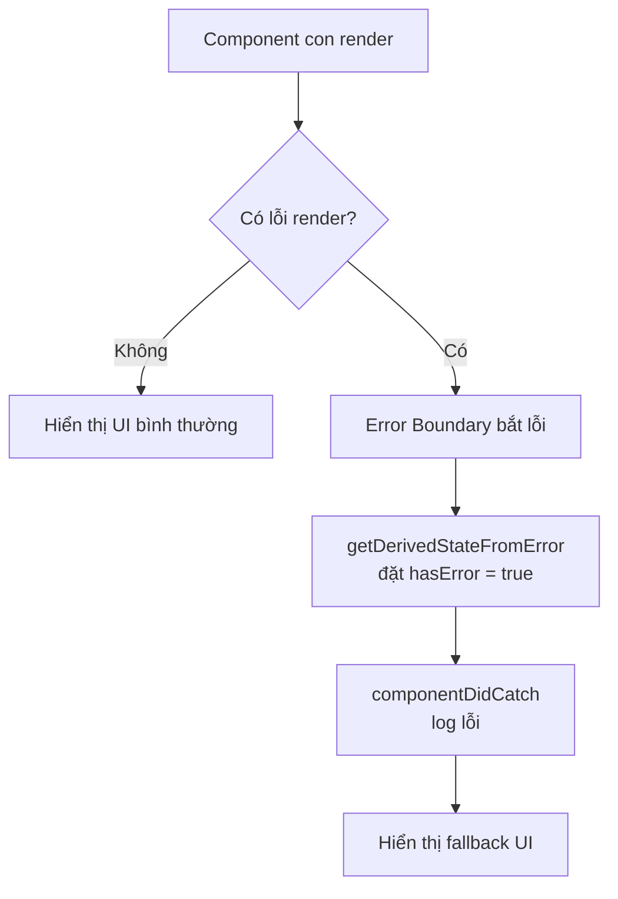
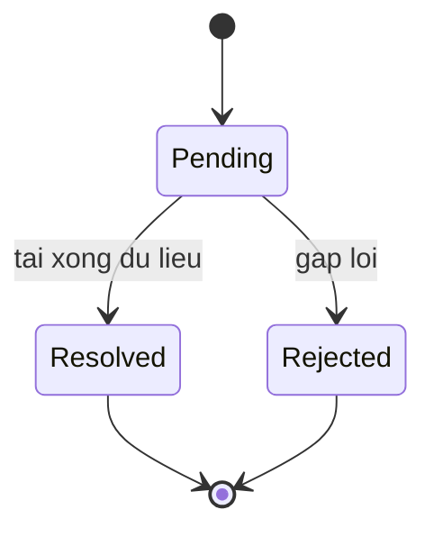

# Error Boundaries và Suspense

**Error Boundary** (ranh giới bắt lỗi) là một component đặc biệt giúp "bắt" lỗi xảy ra trong các component con, hiển thị giao diện dự phòng thay vì làm sập toàn bộ ứng dụng. **Suspense** (cơ chế chờ tải) cho phép bạn hiển thị nội dung tạm (ví dụ vòng quay loading) trong lúc chờ tải component hoặc dữ liệu. Hai kỹ thuật này giúp ứng dụng React xử lý lỗi và trạng thái chờ một cách mượt mà hơn.

[](pathname:///img/react/error-boundaries-suspense.webp)

---

:::note[Ghi nhớ nhanh]

- ⭐ **Error Boundary bắt lỗi render của cây con** — hiện fallback thay vì sập trắng cả app; hiện phải dùng class component với `getDerivedStateFromError` và `componentDidCatch`.
- ⭐ **`Suspense` khai báo fallback khi đang chờ** — dùng cho `React.lazy` (code splitting) và data fetching, tự hiện loading rồi swap nội dung khi xong.
- **Error Boundary KHÔNG bắt được** lỗi trong event handler, async (Promise/setTimeout), SSR và lỗi của chính nó.
- **Thư viện `react-error-boundary`** gói class thành component dễ dùng, kèm hook `useErrorBoundary` để trigger lỗi từ event handler/async.
- **`createPortal` render ra DOM khác** (ví dụ `document.body`) nhưng vẫn theo React tree cho context và event bubbling.

:::

---

## Mục lục

- [Vì sao có Error Boundary & Suspense?](#vì-sao-có-error-boundary--suspense)
- [Error Boundary](#error-boundary)
- [react-error-boundary library](#react-error-boundary-library)
- [Suspense cho code splitting](#suspense-cho-code-splitting)
- [Suspense cho data fetching](#suspense-cho-data-fetching)
- [Portals](#portals)
- [Câu hỏi phỏng vấn](#câu-hỏi-phỏng-vấn)

---

## Vì sao có Error Boundary & Suspense?

**Vấn đề:**

```jsx
// 1. Một lỗi JS khi render ở MỘT component làm sập trắng cả app
function Profile({ user }) {
  return <h1>{user.name}</h1>; // user = null → crash → màn hình trắng
}
// Không có chỗ "bắt" lỗi UI gọn gàng → người dùng thấy trang trắng

// 2. Mỗi nơi tự quản loading state rải rác khi chờ tải data/code
function Page() {
  const [loading, setLoading] = useState(true);
  const [data, setData] = useState(null);
  // ... lặp đi lặp lại loading/error ở mọi component → rối
}
```

**Giải pháp:**

```jsx
// Error Boundary: component (class) BẮT lỗi render của cây con,
// hiện UI dự phòng (fallback) thay vì sập toàn bộ app
<ErrorBoundary fallback={<p>Đã có lỗi, vui lòng thử lại</p>}>
  <Profile user={user} />
</ErrorBoundary>

// Suspense: khai báo fallback cho phần đang tải (React.lazy, data fetching)
// → React tự hiện loading trong khi chờ
<Suspense fallback={<Spinner />}>
  <UserCard id={1} />
</Suspense>
```

:::tip[Dùng thực tế]

- **Bọc khu vực rủi ro** bằng Error Boundary + nút "Thử lại" để người dùng phục hồi mà không reload trang.
- **Lazy load route/component** với `React.lazy` và `<Suspense fallback={...}>` → bundle nhỏ, load nhanh.
- **Skeleton khi chờ data** — dùng `<Suspense>` cho fetch dữ liệu, hiện khung tạm thay vì màn hình trống.
- **Cô lập lỗi widget** — mỗi widget (chart, feed) một Error Boundary riêng, lỗi một chỗ không kéo sập cả trang.

:::

---

## Error Boundary

**Error Boundary** = component bắt lỗi của subtree, hiển thị fallback UI
thay vì crash app.

Sơ đồ dưới đây mô tả luồng render và cách Error Boundary chen vào khi có lỗi:



React **chưa có hook** equivalent — phải dùng class component:

```tsx
import { Component, ReactNode } from "react";

class ErrorBoundary extends Component<
  { children: ReactNode; fallback: ReactNode },
  { hasError: boolean }
> {
  state = { hasError: false };

  static getDerivedStateFromError() {
    return { hasError: true };
  }

  componentDidCatch(error: Error, info: React.ErrorInfo) {
    logErrorToService(error, info);
  }

  render() {
    if (this.state.hasError) {
      return this.props.fallback;
    }
    return this.props.children;
  }
}

// Dùng
<ErrorBoundary fallback={<p>Đã có lỗi</p>}>
  <MyComponent />
</ErrorBoundary>
```

Error Boundary **không bắt được:**

- Lỗi trong **event handler** (cần try/catch).
- Lỗi **async** (Promise, setTimeout).
- Lỗi của **chính Error Boundary**.
- Lỗi **server-side rendering**.

:::warning[Cần lưu ý]

**Mỗi Error Boundary có "phạm vi" subtree** — không bắt được lỗi của
parent:

```jsx
<App>
  <ErrorBoundary>
    <Section1 />
    <Section2 />
  </ErrorBoundary>
</App>

// Lỗi trong Section1 → fallback render, App vẫn OK
// Lỗi trong App → không boundary nào bắt → crash toàn app
```

Strategy: **nested error boundary** ở các cấp:

```jsx
<ErrorBoundary fallback={<FullPageError />}>   {/* outer */}
  <Header />
  <ErrorBoundary fallback={<SectionError />}>  {/* inner */}
    <DangerousFeature />
  </ErrorBoundary>
  <Footer />
</ErrorBoundary>
```

Lỗi trong `DangerousFeature` chỉ ảnh hưởng section đó, Header/Footer
vẫn render.

:::

---

## react-error-boundary library

Thư viện wrap class boundary thành component dễ dùng:

```bash
npm install react-error-boundary
```

```jsx
import { ErrorBoundary } from "react-error-boundary";

function FallbackRender({ error, resetErrorBoundary }) {
  return (
    <div>
      <p>Lỗi: {error.message}</p>
      <button onClick={resetErrorBoundary}>Thử lại</button>
    </div>
  );
}

<ErrorBoundary
  FallbackComponent={FallbackRender}
  onError={(error, info) => logErrorToService(error, info)}
  onReset={() => resetState()}
>
  <MyComponent />
</ErrorBoundary>
```

Có hook `useErrorBoundary` — trigger error boundary từ event handler/async:

```jsx
import { useErrorBoundary } from "react-error-boundary";

function Form() {
  const { showBoundary } = useErrorBoundary();

  const handleSubmit = async (data) => {
    try {
      await api.send(data);
    } catch (error) {
      showBoundary(error); // throw lên boundary gần nhất
    }
  };
}
```

---

## Suspense cho code splitting

**`React.lazy`** + **`<Suspense>`** — chia bundle thành chunk, load lazy:

```jsx
import { lazy, Suspense } from "react";

const HeavyChart = lazy(() => import("./HeavyChart"));

function Dashboard() {
  return (
    <Suspense fallback={<Spinner />}>
      <HeavyChart />
    </Suspense>
  );
}
```

`HeavyChart` chỉ load khi component được render — bundle initial nhỏ hơn.

Code splitting theo route:

```jsx
const Home = lazy(() => import("./pages/Home"));
const About = lazy(() => import("./pages/About"));

<Suspense fallback={<PageLoading />}>
  <Routes>
    <Route path="/" element={<Home />} />
    <Route path="/about" element={<About />} />
  </Routes>
</Suspense>
```

---

## Suspense cho data fetching

React 19 + Server Components — Suspense dùng cho data:

```jsx
async function UserCard({ id }) {  // async server component
  const user = await fetchUser(id);
  return <div>{user.name}</div>;
}

function Page() {
  return (
    <Suspense fallback={<Skeleton />}>
      <UserCard id={1} />
    </Suspense>
  );
}
```

`<Suspense>` show fallback khi data đang load, swap nội dung khi resolve.

Vòng đời trạng thái của một vùng bọc `<Suspense>` có thể tóm tắt như sau:



Khi `Pending`, React hiện `fallback` (Spinner/Skeleton); khi `Resolved` thì
swap nội dung thật; nếu `Rejected` (lỗi) thì Error Boundary gần nhất tiếp quản.

**Streaming** — nhiều `<Suspense>` để render dần:

```jsx
function Page() {
  return (
    <>
      <Header />
      <Suspense fallback={<Skeleton />}>
        <UserCard />  {/* load song song */}
      </Suspense>
      <Suspense fallback={<Skeleton />}>
        <OrderList />  {/* load song song */}
      </Suspense>
    </>
  );
}
```

Header render ngay. UserCard và OrderList stream vào khi sẵn sàng — UX
faster perceived.

:::info[Phân tích]

**Suspense + TanStack Query**:

```jsx
import { useSuspenseQuery } from "@tanstack/react-query";

function UserCard({ id }) {
  // suspend cho đến khi resolve
  const { data: user } = useSuspenseQuery({
    queryKey: ["user", id],
    queryFn: () => fetchUser(id),
  });

  return <div>{user.name}</div>;
}

function Page() {
  return (
    <Suspense fallback={<Spinner />}>
      <UserCard id={1} />
    </Suspense>
  );
}
```

`useSuspenseQuery` (v5+) tích hợp Suspense — không cần check `isLoading`,
chỉ render khi data sẵn sàng.

Pattern này gọn hơn nhiều so với manual loading state:

```jsx
// Cũ
const { data, isLoading, error } = useQuery(...);
if (isLoading) return <Spinner />;
if (error) return <Error />;
return <div>{data.name}</div>;

// Mới
const { data } = useSuspenseQuery(...);
return <div>{data.name}</div>; // Suspense ở ngoài lo loading
```

:::

---

## Portals

Render component vào **DOM khác** với vị trí trong tree:

```jsx
import { createPortal } from "react-dom";

function Modal({ children, isOpen }) {
  if (!isOpen) return null;

  return createPortal(
    <div className="modal-overlay">
      <div className="modal-content">{children}</div>
    </div>,
    document.body  // render vào body, không phải nơi gọi
  );
}

// Dùng
function Page() {
  return (
    <div className="container">
      <h1>Page</h1>
      <Modal isOpen={open}>Modal content</Modal>
      {/* Modal hiển thị overlay phủ toàn trang dù lồng trong .container */}
    </div>
  );
}
```

Use case:

- **Modal, dialog** — tránh bị `overflow:hidden` của parent cắt.
- **Tooltip, popover** — z-index không bị parent ảnh hưởng.
- **Toast** — render ngoài layout.

:::tip[Mẹo]

**Portal vẫn theo React tree** cho event và context:

```jsx
const ThemeContext = createContext();

function App() {
  return (
    <ThemeContext.Provider value="dark">
      <Modal>
        <ThemedButton /> {/* vẫn truy cập theme = "dark" */}
      </Modal>
    </ThemeContext.Provider>
  );
}
```

Dù Modal render ngoài DOM tree, React context và event bubbling vẫn theo
JSX tree. Đây là điểm khác biệt với portal của framework khác.

:::

:::warning[Cần lưu ý]

**SSR portal cần cẩn thận** — `document` không tồn tại server-side:

```jsx
// Lỗi SSR
return createPortal(<Modal />, document.body);

// Fix: chỉ render client-side
const [mounted, setMounted] = useState(false);
useEffect(() => setMounted(true), []);

if (!mounted) return null;
return createPortal(<Modal />, document.body);
```

Hoặc dùng `<Modal />` trong Server Component nhưng wrap portal logic
trong Client Component child.

:::

---

## Câu hỏi phỏng vấn

Những câu thường gặp về chủ đề này. Tự trả lời trước, rồi bấm **Xem đáp án** để đối chiếu.

**1. Error Boundary là gì và nó giải quyết vấn đề gì mà `try/catch` thông thường không làm được?**

<details className="qa">
<summary>Xem đáp án</summary>

**Error Boundary** là component (class) bắt lỗi xảy ra **khi render** của cả cây con bên dưới nó, rồi hiển thị fallback UI thay vì để React unmount toàn bộ app thành màn hình trắng.

`try/catch` không thay thế được vì:

- Render trong React là **khai báo**. Bạn viết `<Profile user={user} />`, chứ không gọi trực tiếp hàm render của nó — không có chỗ nào để đặt `try/catch` bao quanh việc React dựng cây con.
- `try/catch` chỉ bao được một đoạn code **đồng bộ trong cùng một hàm**, còn lỗi ở đây có thể nằm ở bất kỳ component nào sâu vài chục tầng.
- Ngay cả khi bắt được, `try/catch` cũng không biết phải **thay thế phần UI nào**; Error Boundary thì có state riêng nên biết đúng vùng nào cần chuyển sang fallback.

Từ React 16, lỗi render không được bắt sẽ làm React unmount cả cây — vì vậy Error Boundary gần như là bắt buộc trong app production.

</details>

**2. Vì sao đến nay Error Boundary vẫn phải viết bằng class component? `getDerivedStateFromError` và `componentDidCatch` khác nhau ra sao về vai trò?**

<details className="qa">
<summary>Xem đáp án</summary>

Vì React **chưa cung cấp hook tương đương**: cơ chế bắt lỗi dựa vào hai lifecycle chỉ tồn tại ở class. Trong function component không có chỗ nào để React "chen vào" giữa lúc con throw và lúc cha render lại. Thực tế thì hầu như không ai tự viết nữa — dùng `react-error-boundary` là xong.

| | `getDerivedStateFromError` | `componentDidCatch` |
|---|---|---|
| Kiểu | `static`, thuần khiết | method của instance |
| Giai đoạn | Render phase | Commit phase (sau khi đã render fallback) |
| Việc làm | Trả về state mới, ví dụ `{ hasError: true }` để chuyển sang fallback | Chạy side effect: log lỗi về server/monitoring |
| Side effect | Không được phép | Được phép |

```tsx
static getDerivedStateFromError() {
  return { hasError: true };
}

componentDidCatch(error: Error, info: React.ErrorInfo) {
  logErrorToService(error, info);
}
```

Chia đôi như vậy vì render phase có thể bị React chạy lại nhiều lần, nên phải thuần khiết; việc gửi log chỉ được làm một lần ở commit phase.

</details>

**3. Liệt kê các loại lỗi mà Error Boundary không bắt được và giải thích vì sao lại có giới hạn đó.**

<details className="qa">
<summary>Xem đáp án</summary>

Error Boundary **không bắt được**:

- **Lỗi trong event handler** (`onClick`, `onSubmit`...) — handler chạy *sau* khi render xong, ngoài luồng render mà React theo dõi. Dùng `try/catch` hoặc `showBoundary`.
- **Lỗi async**: callback của `setTimeout`, `.then()`, promise bị reject — cũng chạy ngoài call stack của render.
- **Lỗi của chính Error Boundary** (trong `render` hoặc trong fallback của nó) — nó không tự bắt mình được, lỗi sẽ nổi lên boundary cha.
- **Lỗi khi server-side rendering** — trên server không có cơ chế mount fallback theo kiểu client; SSR phải xử lý theo cách riêng của framework.

Lý do chung: cơ chế này gắn với **render phase của React trên client**. Mọi thứ nằm ngoài giai đoạn đó, React không quan sát được, nên không thể chuyển sang fallback.

</details>

**4. Lỗi ném ra trong event handler `onClick` xử lý thế nào? Nêu hai cách đưa lỗi đó vào Error Boundary.**

<details className="qa">
<summary>Xem đáp án</summary>

Trước hết phải tự `try/catch` trong handler, vì Error Boundary không thấy lỗi này. Sau đó, nếu muốn hiển thị fallback, có hai cách:

**Cách 1 — dùng `useErrorBoundary` của `react-error-boundary`:**

```jsx
const { showBoundary } = useErrorBoundary();

const handleSubmit = async (data) => {
  try {
    await api.send(data);
  } catch (error) {
    showBoundary(error); // đẩy lên boundary gần nhất
  }
};
```

**Cách 2 — đưa lỗi vào state rồi throw trong lúc render:**

```jsx
const [error, setError] = useState(null);
if (error) throw error; // lúc này đang ở render phase → boundary bắt được

const handleClick = () => {
  try { risky(); } catch (e) { setError(e); }
};
```

Bản chất cách 2 chính là thứ `showBoundary` làm bên trong. Lưu ý không phải lỗi nào cũng nên đẩy lên boundary — lỗi nghiệp vụ (sai mật khẩu, validate thất bại) nên hiển thị tại chỗ, chỉ lỗi thật sự bất thường mới dùng fallback.

</details>

**5. Nên đặt Error Boundary ở đâu trong cây component? So sánh chiến lược một boundary ở gốc với nhiều boundary theo từng vùng UI.**

<details className="qa">
<summary>Xem đáp án</summary>

| | Một boundary ở gốc | Nhiều boundary theo vùng |
|---|---|---|
| Phạm vi ảnh hưởng khi lỗi | Cả trang chuyển sang fallback | Chỉ vùng đó hỏng, phần còn lại vẫn dùng được |
| Công sức | Ít, đặt một lần | Phải nghĩ vùng nào rủi ro |
| Phục hồi | Thường phải reload trang | Nút "Thử lại" cho riêng widget |
| Vai trò | Lưới an toàn cuối cùng | Cô lập lỗi |

Thực tế nên **kết hợp cả hai** — boundary lồng nhau:

```jsx
<ErrorBoundary fallback={<FullPageError />}>   {/* outer */}
  <Header />
  <ErrorBoundary fallback={<SectionError />}>  {/* inner */}
    <DangerousFeature />
  </ErrorBoundary>
  <Footer />
</ErrorBoundary>
```

Lỗi trong `DangerousFeature` chỉ ảnh hưởng section đó, Header/Footer vẫn render. Boundary ngoài cùng lo những gì lọt lưới.

Ưu tiên đặt boundary quanh: mỗi route, mỗi widget độc lập (chart, feed, quảng cáo), và phần render dữ liệu từ bên thứ ba. Lưu ý boundary không bắt được lỗi của **chính parent** nó.

</details>

**6. Khi một Error Boundary bắt lỗi, React làm gì với cây con bên dưới? State của cây con còn giữ được không?**

<details className="qa">
<summary>Xem đáp án</summary>

React **unmount toàn bộ cây con** của boundary rồi render fallback vào chỗ đó. Vì vậy:

- **State của cây con mất sạch** — mọi `useState`, `useReducer`, ref, và cả state của thư viện nằm trong đó.
- `useEffect` cleanup được chạy, subscription/timer được huỷ.
- Khi bạn reset boundary, cây con được **mount lại từ đầu**, effect chạy lại, dữ liệu phải fetch lại (trừ phần nằm trong cache ở ngoài boundary).

React chọn cách "thà xoá còn hơn giữ" vì một cây UI đã lỗi giữa chừng thì trạng thái của nó không còn đáng tin — hiển thị tiếp có thể dẫn tới hành vi sai hoặc rò rỉ dữ liệu.

Hệ quả thực dụng: state nào cần sống sót qua lỗi thì phải đặt **ngoài** boundary — ở context cha, ở store (Zustand, Redux), ở cache của TanStack Query, hoặc ở URL.

</details>

**7. Trong môi trường development, vì sao lỗi vẫn hiện overlay đỏ dù đã có Error Boundary bao ngoài?**

<details className="qa">
<summary>Xem đáp án</summary>

Vì đó **không phải React**, mà là **overlay của dev server/bundler** (Vite, Next.js, webpack dev server). Ở chế độ development, React cố tình ném lại lỗi ra ngoài để nó tới được `window.onerror`, nhờ vậy DevTools, source map và overlay đều nhìn thấy được lỗi gốc kèm stack trace đẹp. Overlay bắt sự kiện đó và vẽ màn hình đỏ đè lên app.

Điều đó **không có nghĩa là Error Boundary không chạy**: fallback vẫn đã được render bên dưới — bấm Esc hoặc đóng overlay là thấy. Ngoài ra, ở dev React còn in thêm log lỗi kèm component stack ra console.

Trên **production build**, overlay không tồn tại, người dùng chỉ thấy fallback UI. Vì vậy muốn kiểm tra trải nghiệm lỗi thật thì nên chạy bản production (`npm run build` rồi `preview`/`serve`), đừng kết luận từ màn hình đỏ ở dev.

</details>

**8. Thư viện `react-error-boundary` bổ sung những gì so với tự viết class? `resetErrorBoundary` và `resetKeys` hoạt động thế nào?**

<details className="qa">
<summary>Xem đáp án</summary>

Nó gói sẵn class boundary và thêm những thứ mà tự viết sẽ phải làm lại từ đầu:

- Ba cách khai báo fallback: `fallback`, `fallbackRender`, `FallbackComponent` (nhận `error` và `resetErrorBoundary`).
- Callback `onError` (log tập trung) và `onReset`.
- Hook `useErrorBoundary` để đẩy lỗi từ event handler/async lên boundary.
- Hàm bao `withErrorBoundary` cho HOC.

```jsx
<ErrorBoundary
  FallbackComponent={FallbackRender}
  onError={(error, info) => logErrorToService(error, info)}
  onReset={() => resetState()}
  resetKeys={[userId]}
>
  <MyComponent />
</ErrorBoundary>
```

- **`resetErrorBoundary()`**: hàm truyền vào fallback, gọi khi người dùng bấm "Thử lại" — boundary xoá state lỗi và mount lại cây con, đồng thời chạy `onReset`.
- **`resetKeys`**: mảng giá trị được theo dõi; chỉ cần một phần tử đổi là boundary **tự** reset. Rất hợp cho trường hợp "đổi `userId` thì thử lại", để người dùng không phải bấm gì cả.

Nhớ rằng reset đồng nghĩa mount lại — nếu nguyên nhân lỗi chưa được xử lý thì nó sẽ lỗi lại ngay.

</details>

**9. Hook `useErrorBoundary` dùng để làm gì? Nó lấp khoảng trống nào của Error Boundary truyền thống?**

<details className="qa">
<summary>Xem đáp án</summary>

Nó lấp đúng hai lỗ hổng lớn nhất: **event handler** và **code async** — hai nơi Error Boundary không với tới được vì chúng chạy ngoài render phase.

```jsx
import { useErrorBoundary } from "react-error-boundary";

function Form() {
  const { showBoundary } = useErrorBoundary();

  const handleSubmit = async (data) => {
    try {
      await api.send(data);
    } catch (error) {
      showBoundary(error); // throw lên boundary gần nhất
    }
  };
}
```

`showBoundary(error)` lưu lỗi vào state rồi throw lại **trong lúc render**, nhờ vậy boundary gần nhất bắt được và hiển thị fallback như với lỗi render bình thường. Hook còn trả về `resetBoundary()` để tự reset từ trong component.

Khoảng trống được lấp: giờ toàn bộ lỗi — render, sự kiện, promise — đều có thể đi về **một chỗ xử lý thống nhất**, thay vì mỗi nơi một kiểu hiển thị.

</details>

**10. `Suspense` hoạt động dựa trên cơ chế nào? Mô tả việc một component 'throw' ra Promise và React phản ứng ra sao.**

<details className="qa">
<summary>Xem đáp án</summary>

Cơ chế cốt lõi: khi render, nếu component chưa có dữ liệu, nó **throw ra một Promise** thay vì throw Error. React coi đây là tín hiệu "tôi chưa sẵn sàng" chứ không phải lỗi.

Các bước:

1. React đang render cây con, gặp một component throw Promise.
2. React **dừng** việc render nhánh đó, đi ngược lên tìm `Suspense` gần nhất và render `fallback` của nó.
3. React **subscribe** vào Promise đó.
4. Khi Promise resolve, React **render lại** nhánh đó; lần này dữ liệu đã có trong cache nên component trả về UI thật, và fallback được thay bằng nội dung.
5. Nếu Promise **reject**, nó trở thành lỗi và **Error Boundary** gần nhất tiếp quản.

Ở React 19, cách viết được chuẩn hoá bằng hook `use(promise)` và bởi Server Components — bạn không tự throw Promise nữa, nhưng bên dưới vẫn là cơ chế này. Điểm mấu chốt là Promise phải đến từ **cache ổn định**, nếu không mỗi lần render lại tạo Promise mới sẽ gây vòng lặp vô tận.

</details>

**11. `React.lazy` kết hợp `Suspense` giúp code splitting thế nào? Điều gì xảy ra nếu quên bọc `Suspense`?**

<details className="qa">
<summary>Xem đáp án</summary>

`lazy(() => import("./HeavyChart"))` khiến bundler tách `HeavyChart` thành một **chunk riêng**. Chunk chỉ được tải khi component thật sự được render, nên bundle khởi động nhỏ đi và trang mở nhanh hơn:

```jsx
const HeavyChart = lazy(() => import("./HeavyChart"));

<Suspense fallback={<Spinner />}>
  <HeavyChart />
</Suspense>
```

Trong lúc chunk đang tải, component lazy suspend và `Suspense` hiện fallback; tải xong thì swap sang nội dung thật.

**Quên bọc `Suspense`** thì React không tìm được ranh giới nào để hiện fallback, và ném lỗi đại ý "A component suspended while responding to synchronous input..." / yêu cầu phải có `Suspense` bao ngoài. Trong nhiều setup, lỗi này sẽ rơi lên Error Boundary hoặc làm sập vùng đó.

Áp dụng phổ biến nhất là chia theo **route**: mỗi trang một chunk, bọc chung một `Suspense` với màn hình loading của trang.

</details>

**12. Lồng nhiều `Suspense` ở nhiều cấp mang lại lợi ích gì so với một `Suspense` duy nhất ở gốc?**

<details className="qa">
<summary>Xem đáp án</summary>

Một `Suspense` ở gốc nghĩa là **phần chậm nhất quyết định tất cả**: chỉ cần một widget chưa xong, cả trang vẫn là spinner.

Nhiều `Suspense` cho phép **streaming** — từng mảnh hiện ra ngay khi sẵn sàng:

```jsx
<>
  <Header />
  <Suspense fallback={<Skeleton />}>
    <UserCard />
  </Suspense>
  <Suspense fallback={<Skeleton />}>
    <OrderList />
  </Suspense>
</>
```

Header hiện ngay lập tức; `UserCard` và `OrderList` tải song song và đổ vào độc lập.

Lợi ích:

- **Perceived performance tốt hơn nhiều** — người dùng thấy nội dung sớm thay vì màn hình trắng.
- **Skeleton sát với layout thật** ở từng vùng, hạn chế nhảy layout.
- **Cô lập vùng chậm**: một API chậm không giữ toàn bộ trang làm con tin.

Đánh đổi: quá nhiều ranh giới nhỏ sẽ khiến trang "nhấp nháy" nhiều chỗ. Nên chia theo khối nội dung có nghĩa, không chia theo từng component lẻ.

</details>

**13. Nếu chunk của `React.lazy` tải thất bại (mất mạng, vừa deploy bản mới) thì chuyện gì xảy ra? Xử lý ra sao?**

<details className="qa">
<summary>Xem đáp án</summary>

`import()` trả về Promise bị **reject**, và với Suspense thì promise reject trở thành lỗi → **Error Boundary** gần nhất bắt và hiện fallback. Không có boundary thì vùng đó (hoặc cả app) sập.

Trường hợp hay gặp trong thực tế là **vừa deploy bản mới**: trình duyệt người dùng vẫn giữ HTML/JS cũ, nhưng file chunk cũ trên CDN đã bị thay tên hash → tải 404.

Cách xử lý:

- **Luôn bọc Error Boundary** quanh vùng lazy, fallback có nút "Tải lại".
- **Retry rồi reload**: bọc `import()` trong hàm thử lại vài lần; nếu vẫn hỏng và nghi là phiên bản cũ thì `window.location.reload()` để lấy bản mới.

```js
const retry = (fn, n = 2) =>
  fn().catch((e) => (n > 0 ? retry(fn, n - 1) : Promise.reject(e)));

const Home = lazy(() => retry(() => import("./pages/Home")));
```

- Về phía hạ tầng: **giữ lại chunk của bản cũ** trên CDN một thời gian sau deploy để người đang mở tab cũ không bị 404.

</details>

**14. Kết hợp Error Boundary và `Suspense`: thứ tự lồng nào là đúng và vì sao thứ tự đó quan trọng?**

<details className="qa">
<summary>Xem đáp án</summary>

Thứ tự tiêu chuẩn là **Error Boundary ở ngoài, `Suspense` ở trong**:

```jsx
<ErrorBoundary FallbackComponent={ErrorView}>
  <Suspense fallback={<Skeleton />}>
    <UserCard id={1} />
  </Suspense>
</ErrorBoundary>
```

Lý do:

- Hai thứ này lo **hai trạng thái khác nhau**: `Suspense` lo *pending*, Error Boundary lo *rejected*. Khi promise reject, lỗi ném ra từ cây con phải đi ngược lên tới boundary.
- Đặt boundary ở ngoài thì khi lỗi xảy ra, **cả vùng loading lẫn nội dung** được thay bằng giao diện lỗi — người dùng không bị kẹt ở spinner quay mãi.
- Nếu đảo ngược (`Suspense` ngoài, boundary trong), giao diện lỗi sẽ nằm lọt bên trong vùng đang chờ, dễ dẫn tới trạng thái lẫn lộn "vừa loading vừa lỗi", và fallback lỗi không thay thế được skeleton bao quanh.

Với boundary lồng nhiều tầng, quy tắc vẫn vậy ở mỗi tầng: boundary bao ngoài `Suspense` của tầng đó, để mỗi vùng tự lo đủ ba trạng thái loading / lỗi / thành công.

</details>

**15. Vì sao không thể gọi `fetch` trực tiếp trong component rồi kỳ vọng `Suspense` tự chờ? Data fetching cần điều kiện gì để 'suspend' được?**

<details className="qa">
<summary>Xem đáp án</summary>

Vì `Suspense` không hề "theo dõi mạng". Nó chỉ phản ứng khi có thứ gì đó **throw ra Promise trong lúc render**. Gọi `fetch(...)` trong thân component chỉ tạo ra một promise rồi bỏ đấy — React không biết gì, vẫn render tiếp và bạn nhận `undefined`.

Điều kiện để suspend được:

- Nguồn dữ liệu phải **tích hợp với Suspense**: `use(promise)` của React 19, Server Components, hoặc thư viện như `useSuspenseQuery` của TanStack Query.
- Promise phải đến từ **cache ổn định theo key**. Nếu mỗi lần render lại tạo promise mới thì React suspend → render lại → tạo promise mới → suspend... thành vòng lặp vô tận. Đây chính là lý do phải có lớp cache ở giữa.
- Kết quả phải đọc được **đồng bộ** ở lần render sau (đã có trong cache).

```jsx
// Sai: promise mới mỗi lần render
const user = use(fetchUser(id));

// Đúng: cache theo key trả về cùng một promise
const { data } = useSuspenseQuery({ queryKey: ["user", id], queryFn: () => fetchUser(id) });
```

</details>

**16. So sánh dùng `Suspense` fallback với tự quản `isLoading` bằng `useState`. Ưu và nhược của từng cách?**

<details className="qa">
<summary>Xem đáp án</summary>

| | `Suspense` | Tự quản `isLoading` |
|---|---|---|
| Nơi khai báo loading | Ở component cha, một chỗ | Trong từng component |
| Code trong component | Chỉ lo happy path | Rải `if (isLoading)`, `if (error)` |
| Nhiều nguồn dữ liệu | Một fallback chung cho cả vùng | Phải tự gộp nhiều cờ loading |
| Waterfall | Dễ tải song song, streaming SSR | Dễ vô tình tuần tự |
| Điều kiện dùng | Cần nguồn dữ liệu hỗ trợ Suspense | Chạy với mọi cách fetch |
| Kiểm soát chi tiết | Ít hơn (all-or-nothing trong vùng) | Toàn quyền, ví dụ hiện dữ liệu cũ mờ đi |

```jsx
// Cũ
const { data, isLoading, error } = useQuery(...);
if (isLoading) return <Spinner />;
if (error) return <Error />;
return <div>{data.name}</div>;

// Mới
const { data } = useSuspenseQuery(...);
return <div>{data.name}</div>; // Suspense ở ngoài lo loading
```

Thực tế thường trộn: `Suspense` cho lần tải đầu của một vùng, còn cờ trạng thái thủ công (hoặc `isFetching`) cho các lần refetch nhỏ để tránh nhấp nháy.

</details>

**17. `useTransition` ảnh hưởng thế nào tới việc `Suspense` có hiện fallback hay không khi cập nhật dữ liệu đã hiển thị?**

<details className="qa">
<summary>Xem đáp án</summary>

Cập nhật được đánh dấu là **transition** sẽ **không bắt `Suspense` hiện lại fallback** cho nội dung đã hiển thị. React giữ nguyên UI cũ trên màn hình, chuẩn bị UI mới ở chế độ nền, và chỉ swap khi đã sẵn sàng.

```jsx
const [isPending, startTransition] = useTransition();

const onTabChange = (tab) => {
  startTransition(() => setTab(tab)); // giữ nội dung cũ, không nháy skeleton
};

<button disabled={isPending}>{isPending ? "Đang tải..." : "Đổi tab"}</button>
```

Không có transition, một `setState` khiến cây con suspend sẽ làm cả vùng rơi về `fallback` — đang có nội dung đẹp bỗng nhảy về skeleton, cảm giác giật và mất ngữ cảnh (mất cả vị trí cuộn).

Cách dùng đúng: `isPending` để làm mờ nội dung cũ hoặc khoá nút, báo cho người dùng biết đang cập nhật. Lưu ý điều này chỉ áp dụng khi nội dung **đã từng hiển thị**; lần mount đầu tiên vẫn hiện fallback bình thường.

</details>

**18. `createPortal` render node ra ngoài DOM cha — vậy event bubbling và context đi theo DOM tree hay React tree? Giải thích vì sao.**

<details className="qa">
<summary>Xem đáp án</summary>

Cả hai đều đi theo **React tree** (cây JSX), không theo DOM tree:

```jsx
<ThemeContext.Provider value="dark">
  <Modal>              {/* render vào document.body */}
    <ThemedButton />   {/* vẫn đọc được theme = "dark" */}
  </Modal>
</ThemeContext.Provider>
```

Vì sao:

- **Context** được truyền dọc theo cây component mà React tự quản lý. `createPortal` chỉ đổi *đích DOM* của node, còn vị trí của nó trong cây React thì không đổi — nên provider cha vẫn phủ tới.
- **Event**: React dùng hệ thống sự kiện tổng hợp, gắn listener ở gốc rồi tự cho sự kiện "nổi bọt" theo cây React. Nên `onClick` đặt ở component cha vẫn bắt được click phát ra từ nội dung của portal, dù node nằm trong `document.body`.

Nhờ đặc điểm này, modal/tooltip thoát được `overflow: hidden` và các rắc rối z-index của parent nhưng vẫn dùng chung context và handler như một component bình thường. Cần nhớ khi đặt handler chung: click trong portal có thể vô tình kích hoạt "click ra ngoài" tính theo DOM.

</details>

**19. Portal kết hợp SSR thường gặp lỗi gì? Cách xử lý phổ biến là gì?**

<details className="qa">
<summary>Xem đáp án</summary>

Trên server **không có `document`**, nên gọi `createPortal(<Modal />, document.body)` khi render phía server sẽ ném lỗi kiểu `document is not defined`. Ngay cả khi vượt qua được, việc HTML server không có node còn client lại có dễ gây **hydration mismatch**.

Cách xử lý phổ biến là chỉ render portal sau khi đã mount ở client:

```jsx
const [mounted, setMounted] = useState(false);
useEffect(() => setMounted(true), []);

if (!mounted) return null;
return createPortal(<Modal />, document.body);
```

`useEffect` không chạy trên server, nên lần render đầu (cả server lẫn hydration) đều trả `null` — khớp nhau, sau đó portal mới xuất hiện.

Các cách khác: dùng `typeof document !== "undefined"` để kiểm tra, dùng `dynamic import` với `ssr: false` (Next.js), hoặc gói phần logic portal vào một Client Component riêng. Với nội dung cần SEO thì đừng đặt trong portal client-only, vì nó không có trong HTML ban đầu.

</details>

**20. Trong production, làm sao gửi lỗi mà Error Boundary bắt được về hệ thống monitoring (Sentry, Datadog)? `componentDidCatch` cung cấp những thông tin gì?**

<details className="qa">
<summary>Xem đáp án</summary>

`componentDidCatch(error, info)` cho bạn:

- **`error`** — đối tượng lỗi: `message`, `name`, `stack` (cần source map để đọc được trên bản đã minify).
- **`info.componentStack`** — chuỗi mô tả đường đi qua các component tới chỗ lỗi. Đây là thông tin quý nhất, vì stack trace JS đã minify thường vô nghĩa còn component stack thì chỉ thẳng ra component nào hỏng.

```jsx
componentDidCatch(error, info) {
  Sentry.captureException(error, {
    contexts: { react: { componentStack: info.componentStack } },
  });
}
```

Với `react-error-boundary` thì dùng prop `onError={(error, info) => ...}` cho gọn. Sentry còn có sẵn `Sentry.ErrorBoundary` bọc luôn việc này.

Vài lưu ý khi triển khai: **upload source map** lên monitoring để đọc được stack; **gắn thêm ngữ cảnh** (user id, route, release version) để lần ra nguyên nhân; và **đừng log dữ liệu nhạy cảm** trong props. Nhớ rằng lỗi event handler/async không đi qua đây, nên vẫn cần bắt lỗi toàn cục riêng.

</details>
