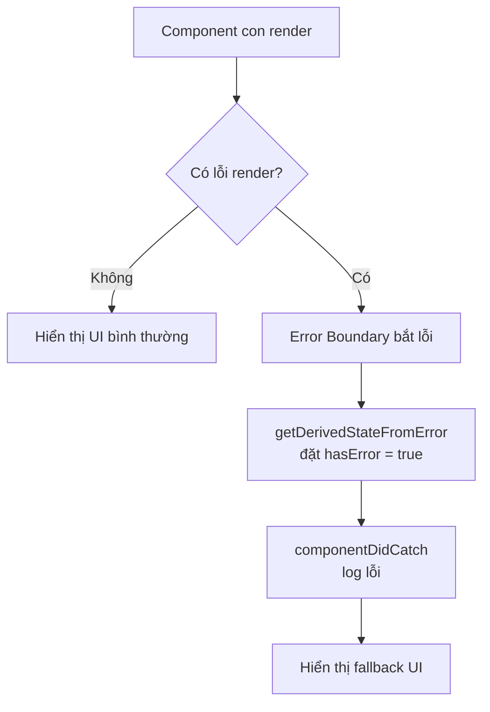
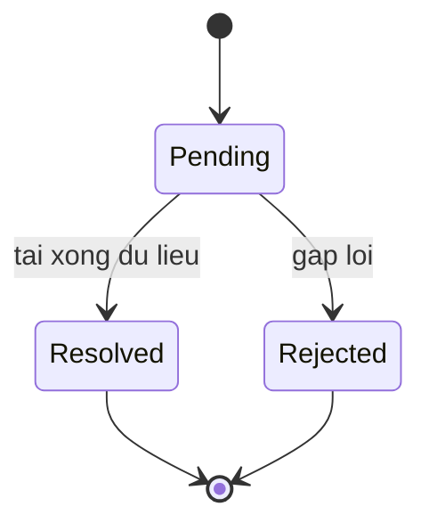

# Error Boundaries và Suspense

**Error Boundary** (ranh giới bắt lỗi) là một component đặc biệt giúp "bắt" lỗi xảy ra trong các component con, hiển thị giao diện dự phòng thay vì làm sập toàn bộ ứng dụng. **Suspense** (cơ chế chờ tải) cho phép bạn hiển thị nội dung tạm (ví dụ vòng quay loading) trong lúc chờ tải component hoặc dữ liệu. Hai kỹ thuật này giúp ứng dụng React xử lý lỗi và trạng thái chờ một cách mượt mà hơn.

---

:::note[Ghi nhớ nhanh]

- ⭐ **Error Boundary bắt lỗi render của cây con** — hiện fallback thay vì sập trắng cả app; hiện phải dùng class component với `getDerivedStateFromError` và `componentDidCatch`.
- ⭐ **`Suspense` khai báo fallback khi đang chờ** — dùng cho `React.lazy` (code splitting) và data fetching, tự hiện loading rồi swap nội dung khi xong.
- **Error Boundary KHÔNG bắt được** lỗi trong event handler, async (Promise/setTimeout), SSR và lỗi của chính nó.
- **Thư viện `react-error-boundary`** gói class thành component dễ dùng, kèm hook `useErrorBoundary` để trigger lỗi từ event handler/async.
- **`createPortal` render ra DOM khác** (ví dụ `document.body`) nhưng vẫn theo React tree cho context và event bubbling.

:::

---

## Mục lục

- [Vì sao có Error Boundary & Suspense?](#vì-sao-có-error-boundary--suspense)
- [Error Boundary](#error-boundary)
- [react-error-boundary library](#react-error-boundary-library)
- [Suspense cho code splitting](#suspense-cho-code-splitting)
- [Suspense cho data fetching](#suspense-cho-data-fetching)
- [Portals](#portals)
- [Câu hỏi phỏng vấn](#câu-hỏi-phỏng-vấn)

---

## Vì sao có Error Boundary & Suspense?

**Vấn đề:**

```jsx
// 1. Một lỗi JS khi render ở MỘT component làm sập trắng cả app
function Profile({ user }) {
  return <h1>{user.name}</h1>; // user = null → crash → màn hình trắng
}
// Không có chỗ "bắt" lỗi UI gọn gàng → người dùng thấy trang trắng

// 2. Mỗi nơi tự quản loading state rải rác khi chờ tải data/code
function Page() {
  const [loading, setLoading] = useState(true);
  const [data, setData] = useState(null);
  // ... lặp đi lặp lại loading/error ở mọi component → rối
}
```

**Giải pháp:**

```jsx
// Error Boundary: component (class) BẮT lỗi render của cây con,
// hiện UI dự phòng (fallback) thay vì sập toàn bộ app
<ErrorBoundary fallback={<p>Đã có lỗi, vui lòng thử lại</p>}>
  <Profile user={user} />
</ErrorBoundary>

// Suspense: khai báo fallback cho phần đang tải (React.lazy, data fetching)
// → React tự hiện loading trong khi chờ
<Suspense fallback={<Spinner />}>
  <UserCard id={1} />
</Suspense>
```

:::tip[Dùng thực tế]

- **Bọc khu vực rủi ro** bằng Error Boundary + nút "Thử lại" để người dùng phục hồi mà không reload trang.
- **Lazy load route/component** với `React.lazy` và `<Suspense fallback={...}>` → bundle nhỏ, load nhanh.
- **Skeleton khi chờ data** — dùng `<Suspense>` cho fetch dữ liệu, hiện khung tạm thay vì màn hình trống.
- **Cô lập lỗi widget** — mỗi widget (chart, feed) một Error Boundary riêng, lỗi một chỗ không kéo sập cả trang.

:::

---

## Error Boundary

**Error Boundary** = component bắt lỗi của subtree, hiển thị fallback UI
thay vì crash app.

Sơ đồ dưới đây mô tả luồng render và cách Error Boundary chen vào khi có lỗi:



React **chưa có hook** equivalent — phải dùng class component:

```tsx
import { Component, ReactNode } from "react";

class ErrorBoundary extends Component<
  { children: ReactNode; fallback: ReactNode },
  { hasError: boolean }
> {
  state = { hasError: false };

  static getDerivedStateFromError() {
    return { hasError: true };
  }

  componentDidCatch(error: Error, info: React.ErrorInfo) {
    logErrorToService(error, info);
  }

  render() {
    if (this.state.hasError) {
      return this.props.fallback;
    }
    return this.props.children;
  }
}

// Dùng
<ErrorBoundary fallback={<p>Đã có lỗi</p>}>
  <MyComponent />
</ErrorBoundary>
```

Error Boundary **không bắt được:**

- Lỗi trong **event handler** (cần try/catch).
- Lỗi **async** (Promise, setTimeout).
- Lỗi của **chính Error Boundary**.
- Lỗi **server-side rendering**.

:::warning[Cần lưu ý]

**Mỗi Error Boundary có "phạm vi" subtree** — không bắt được lỗi của
parent:

```jsx
<App>
  <ErrorBoundary>
    <Section1 />
    <Section2 />
  </ErrorBoundary>
</App>

// Lỗi trong Section1 → fallback render, App vẫn OK
// Lỗi trong App → không boundary nào bắt → crash toàn app
```

Strategy: **nested error boundary** ở các cấp:

```jsx
<ErrorBoundary fallback={<FullPageError />}>   {/* outer */}
  <Header />
  <ErrorBoundary fallback={<SectionError />}>  {/* inner */}
    <DangerousFeature />
  </ErrorBoundary>
  <Footer />
</ErrorBoundary>
```

Lỗi trong `DangerousFeature` chỉ ảnh hưởng section đó, Header/Footer
vẫn render.

:::

---

## react-error-boundary library

Thư viện wrap class boundary thành component dễ dùng:

```bash
npm install react-error-boundary
```

```jsx
import { ErrorBoundary } from "react-error-boundary";

function FallbackRender({ error, resetErrorBoundary }) {
  return (
    <div>
      <p>Lỗi: {error.message}</p>
      <button onClick={resetErrorBoundary}>Thử lại</button>
    </div>
  );
}

<ErrorBoundary
  FallbackComponent={FallbackRender}
  onError={(error, info) => logErrorToService(error, info)}
  onReset={() => resetState()}
>
  <MyComponent />
</ErrorBoundary>
```

Có hook `useErrorBoundary` — trigger error boundary từ event handler/async:

```jsx
import { useErrorBoundary } from "react-error-boundary";

function Form() {
  const { showBoundary } = useErrorBoundary();

  const handleSubmit = async (data) => {
    try {
      await api.send(data);
    } catch (error) {
      showBoundary(error); // throw lên boundary gần nhất
    }
  };
}
```

---

## Suspense cho code splitting

**`React.lazy`** + **`<Suspense>`** — chia bundle thành chunk, load lazy:

```jsx
import { lazy, Suspense } from "react";

const HeavyChart = lazy(() => import("./HeavyChart"));

function Dashboard() {
  return (
    <Suspense fallback={<Spinner />}>
      <HeavyChart />
    </Suspense>
  );
}
```

`HeavyChart` chỉ load khi component được render — bundle initial nhỏ hơn.

Code splitting theo route:

```jsx
const Home = lazy(() => import("./pages/Home"));
const About = lazy(() => import("./pages/About"));

<Suspense fallback={<PageLoading />}>
  <Routes>
    <Route path="/" element={<Home />} />
    <Route path="/about" element={<About />} />
  </Routes>
</Suspense>
```

---

## Suspense cho data fetching

React 19 + Server Components — Suspense dùng cho data:

```jsx
async function UserCard({ id }) {  // async server component
  const user = await fetchUser(id);
  return <div>{user.name}</div>;
}

function Page() {
  return (
    <Suspense fallback={<Skeleton />}>
      <UserCard id={1} />
    </Suspense>
  );
}
```

`<Suspense>` show fallback khi data đang load, swap nội dung khi resolve.

Vòng đời trạng thái của một vùng bọc `<Suspense>` có thể tóm tắt như sau:



Khi `Pending`, React hiện `fallback` (Spinner/Skeleton); khi `Resolved` thì
swap nội dung thật; nếu `Rejected` (lỗi) thì Error Boundary gần nhất tiếp quản.

**Streaming** — nhiều `<Suspense>` để render dần:

```jsx
function Page() {
  return (
    <>
      <Header />
      <Suspense fallback={<Skeleton />}>
        <UserCard />  {/* load song song */}
      </Suspense>
      <Suspense fallback={<Skeleton />}>
        <OrderList />  {/* load song song */}
      </Suspense>
    </>
  );
}
```

Header render ngay. UserCard và OrderList stream vào khi sẵn sàng — UX
faster perceived.

:::info[Phân tích]

**Suspense + TanStack Query**:

```jsx
import { useSuspenseQuery } from "@tanstack/react-query";

function UserCard({ id }) {
  // suspend cho đến khi resolve
  const { data: user } = useSuspenseQuery({
    queryKey: ["user", id],
    queryFn: () => fetchUser(id),
  });

  return <div>{user.name}</div>;
}

function Page() {
  return (
    <Suspense fallback={<Spinner />}>
      <UserCard id={1} />
    </Suspense>
  );
}
```

`useSuspenseQuery` (v5+) tích hợp Suspense — không cần check `isLoading`,
chỉ render khi data sẵn sàng.

Pattern này gọn hơn nhiều so với manual loading state:

```jsx
// Cũ
const { data, isLoading, error } = useQuery(...);
if (isLoading) return <Spinner />;
if (error) return <Error />;
return <div>{data.name}</div>;

// Mới
const { data } = useSuspenseQuery(...);
return <div>{data.name}</div>; // Suspense ở ngoài lo loading
```

:::

---

## Portals

Render component vào **DOM khác** với vị trí trong tree:

```jsx
import { createPortal } from "react-dom";

function Modal({ children, isOpen }) {
  if (!isOpen) return null;

  return createPortal(
    <div className="modal-overlay">
      <div className="modal-content">{children}</div>
    </div>,
    document.body  // render vào body, không phải nơi gọi
  );
}

// Dùng
function Page() {
  return (
    <div className="container">
      <h1>Page</h1>
      <Modal isOpen={open}>Modal content</Modal>
      {/* Modal hiển thị overlay phủ toàn trang dù lồng trong .container */}
    </div>
  );
}
```

Use case:

- **Modal, dialog** — tránh bị `overflow:hidden` của parent cắt.
- **Tooltip, popover** — z-index không bị parent ảnh hưởng.
- **Toast** — render ngoài layout.

:::tip[Mẹo]

**Portal vẫn theo React tree** cho event và context:

```jsx
const ThemeContext = createContext();

function App() {
  return (
    <ThemeContext.Provider value="dark">
      <Modal>
        <ThemedButton /> {/* vẫn truy cập theme = "dark" */}
      </Modal>
    </ThemeContext.Provider>
  );
}
```

Dù Modal render ngoài DOM tree, React context và event bubbling vẫn theo
JSX tree. Đây là điểm khác biệt với portal của framework khác.

:::

:::warning[Cần lưu ý]

**SSR portal cần cẩn thận** — `document` không tồn tại server-side:

```jsx
// Lỗi SSR
return createPortal(<Modal />, document.body);

// Fix: chỉ render client-side
const [mounted, setMounted] = useState(false);
useEffect(() => setMounted(true), []);

if (!mounted) return null;
return createPortal(<Modal />, document.body);
```

Hoặc dùng `<Modal />` trong Server Component nhưng wrap portal logic
trong Client Component child.

:::

---

## Câu hỏi phỏng vấn

Những câu thường gặp về chủ đề này. Tự trả lời trước, rồi đối chiếu lại với nội dung phía trên.

1. Error Boundary là gì và nó giải quyết vấn đề gì mà `try/catch` thông thường không làm được?
2. Vì sao đến nay Error Boundary vẫn phải viết bằng class component? `getDerivedStateFromError` và `componentDidCatch` khác nhau ra sao về vai trò?
3. Liệt kê các loại lỗi mà Error Boundary **không** bắt được và giải thích vì sao lại có giới hạn đó.
4. Lỗi ném ra trong event handler `onClick` xử lý thế nào? Nêu hai cách đưa lỗi đó vào Error Boundary.
5. Nên đặt Error Boundary ở đâu trong cây component? So sánh chiến lược một boundary ở gốc với nhiều boundary theo từng vùng UI.
6. Khi một Error Boundary bắt lỗi, React làm gì với cây con bên dưới? State của cây con còn giữ được không?
7. Trong môi trường development, vì sao lỗi vẫn hiện overlay đỏ dù đã có Error Boundary bao ngoài?
8. Thư viện `react-error-boundary` bổ sung những gì so với tự viết class? `resetErrorBoundary` và `resetKeys` hoạt động thế nào?
9. Hook `useErrorBoundary` dùng để làm gì? Nó lấp khoảng trống nào của Error Boundary truyền thống?
10. `Suspense` hoạt động dựa trên cơ chế nào? Mô tả việc một component 'throw' ra Promise và React phản ứng ra sao.
11. `React.lazy` kết hợp `Suspense` giúp code splitting thế nào? Điều gì xảy ra nếu quên bọc `Suspense`?
12. Lồng nhiều `Suspense` ở nhiều cấp mang lại lợi ích gì so với một `Suspense` duy nhất ở gốc?
13. Nếu chunk của `React.lazy` tải thất bại (mất mạng, vừa deploy bản mới) thì chuyện gì xảy ra? Xử lý ra sao?
14. Kết hợp Error Boundary và `Suspense`: thứ tự lồng nào là đúng và vì sao thứ tự đó quan trọng?
15. Vì sao không thể gọi `fetch` trực tiếp trong component rồi kỳ vọng `Suspense` tự chờ? Data fetching cần điều kiện gì để 'suspend' được?
16. So sánh dùng `Suspense` fallback với tự quản `isLoading` bằng `useState`. Ưu và nhược của từng cách?
17. `useTransition` ảnh hưởng thế nào tới việc `Suspense` có hiện fallback hay không khi cập nhật dữ liệu đã hiển thị?
18. `createPortal` render node ra ngoài DOM cha — vậy event bubbling và context đi theo DOM tree hay React tree? Giải thích vì sao.
19. Portal kết hợp SSR thường gặp lỗi gì? Cách xử lý phổ biến là gì?
20. Trong production, làm sao gửi lỗi mà Error Boundary bắt được về hệ thống monitoring (Sentry, Datadog)? `componentDidCatch` cung cấp những thông tin gì?
