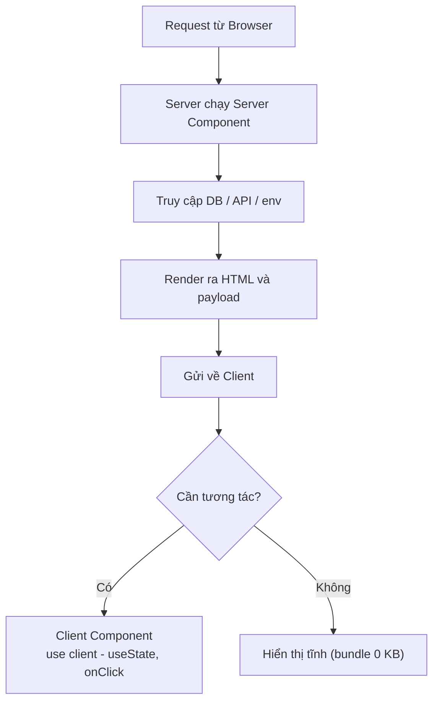
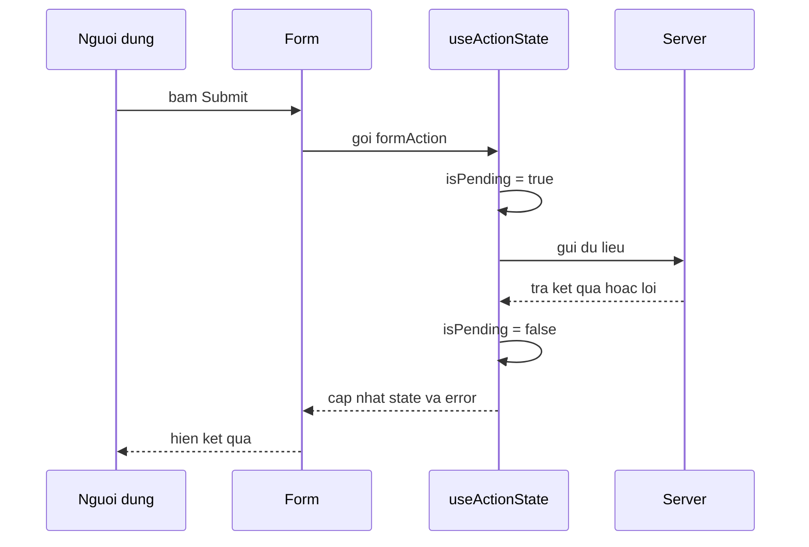

# React 19 Features

React 19 là phiên bản mới mang đến nhiều tính năng giúp viết ứng dụng gọn và mạnh hơn, như **Server Components** (component chạy trên máy chủ), hook `use` để đọc dữ liệu bất đồng bộ, cùng **Actions** (cơ chế xử lý hành động như gửi form). Bài này giới thiệu các tính năng nổi bật của React 19 dành cho người mới làm quen. Bạn chưa cần nhớ hết, chỉ cần hiểu mỗi tính năng giải quyết vấn đề gì.

---

:::note[Ghi nhớ nhanh]

- ⭐ **Server Components chạy trên server** — bundle 0 KB, truy cập DB/env trực tiếp, giữ secret an toàn; Client Component (có state/onClick) phải đánh dấu `"use client"`.
- ⭐ **Actions + `useActionState` gói sẵn pending/error** — form submit không còn `useState` rải rác; kèm `useFormStatus` cho nút con biết form đang gửi.
- **`use()` đọc Promise hoặc Context** — được phép gọi trong nhánh `if`, khác `useContext`.
- **`useOptimistic` cập nhật UI ngay** khi bấm và tự rollback nếu server lỗi.
- **Tiện ích khác**: tự hoist `<title>`/`<meta>` vào head, `ref` là prop thường (bỏ `forwardRef`), React Compiler tự memoize thay `useMemo`/`useCallback`.

:::

---

## Mục lục

- [Vì sao React 19 thêm các tính năng này?](#vì-sao-react-19-thêm-các-tính-năng-này)
- [Server Components](#server-components)
- [use hook](#use-hook)
- [Actions và useActionState](#actions-và-useactionstate)
- [useOptimistic](#useoptimistic)
- [Document Metadata](#document-metadata)
- [React Compiler](#react-compiler)
- [Câu hỏi phỏng vấn](#câu-hỏi-phỏng-vấn)

---

## Vì sao React 19 thêm các tính năng này?

**Vấn đề:**

```jsx
// React 18: xử lý form/mutation phải tự quản nhiều state thủ công
function LoginForm() {
  const [isPending, setIsPending] = useState(false);
  const [error, setError] = useState(null);

  async function handleSubmit(e) {
    e.preventDefault();
    setIsPending(true);
    setError(null);
    try {
      await login(e.target.email.value);
    } catch (err) {
      setError(err.message); // tự set lỗi
    } finally {
      setIsPending(false); // tự reset pending — lặp ở mọi form
    }
  }
  // ...
}

// Truyền ref qua component con phải bọc forwardRef rườm rà
const Input = forwardRef((props, ref) => <input ref={ref} {...props} />);

// Đọc Promise/Context bị giới hạn — không gọi được trong if
function Comp({ shouldLoad }) {
  if (shouldLoad) {
    const ctx = useContext(MyContext); // ❌ vi phạm rules of hooks
  }
}
```

**Giải pháp:**

```jsx
// React 19: Actions + useActionState gói sẵn pending/error/submit
function LoginForm() {
  const [state, formAction, isPending] = useActionState(loginAction, {});
  return (
    <form action={formAction}>
      <input name="email" />
      {state.error && <p>{state.error}</p>}
      <button disabled={isPending}>{isPending ? "..." : "Login"}</button>
    </form>
  );
}

// useOptimistic: cập nhật lạc quan dễ dàng, tự rollback nếu fail
const [optimistic, addOptimistic] = useOptimistic(todos, (s, t) => [...s, t]);

// use(): đọc Promise/Context linh hoạt, được phép trong if
function Comp({ shouldLoad }) {
  if (shouldLoad) {
    const data = use(dataPromise); // ✅ OK
    return <div>{data}</div>;
  }
}

// ref là prop thường — bỏ forwardRef
function Input({ ref, ...props }) {
  return <input ref={ref} {...props} />;
}
```

:::tip[Dùng thực tế]

- **Form submit (login, đăng ký)**: `useActionState` tự lo trạng thái `pending` và thông báo lỗi — không còn `useState` rải rác, code gọn và đồng nhất.
- **Optimistic UI khi like/comment/thêm todo**: `useOptimistic` hiển thị thay đổi ngay khi bấm, mượt UX; nếu server lỗi React tự rollback về state thật.
- **Đọc dữ liệu bất đồng bộ**: `use()` đọc Promise kết hợp `<Suspense>` để hiện spinner, gọi được cả trong nhánh điều kiện.
- **Truyền ref gọn gàng**: nhận `ref` như prop bình thường để focus input hay đo kích thước, không phải bọc `forwardRef`.

:::

---

## Server Components

**React Server Components (RSC)** — component chạy **trên server**, gửi
HTML/data về client. Hoạt động trong Next.js App Router (production-ready
2024+).

```tsx
// app/users/page.tsx — Server Component (default)
async function UsersPage() {
  const users = await db.user.findMany(); // truy cập DB trực tiếp
  return (
    <ul>
      {users.map(u => <li key={u.id}>{u.name}</li>)}
    </ul>
  );
}
```

**Client Component** — phải đánh dấu `"use client"`:

```tsx
// app/components/Counter.tsx
"use client";

import { useState } from "react";

export function Counter() {
  const [count, setCount] = useState(0);
  return <button onClick={() => setCount(c => c + 1)}>{count}</button>;
}
```

| | Server Component | Client Component |
|--|-----------------|------------------|
| Chạy ở | Server | Browser |
| Bundle size | **0** (không vào client) | Có |
| Hook (useState, useEffect) | **Không** | Có |
| Access DB, fs, env | **Có** | Không |
| Interactive | Không | **Có** |
| Đánh dấu | Mặc định | `"use client"` đầu file |

:::info[Phân tích]

**Lợi ích RSC**:

1. **Bundle nhỏ hơn** — code data fetching không vào client.
2. **Truy cập DB trực tiếp** — không cần API route.
3. **Secret an toàn** — API key, DB connection chỉ ở server.
4. **Streaming** — render dần từng phần.
5. **Composition** — Server Component có thể wrap Client Component:

```tsx
// page.tsx (Server)
import { Counter } from "./Counter"; // Client component

async function Page() {
  const data = await fetchData(); // server
  return (
    <div>
      <h1>{data.title}</h1>
      <Counter initial={data.count} /> {/* Client island */}
    </div>
  );
}
```

Pattern: **Server Component cho dữ liệu, Client Component cho interaction**.

Luồng request khi kết hợp Server Component và Client Component:



Trade-off:

- Học curve cao — phải nghĩ "boundary".
- Caching layer phức tạp.
- Một số lib chưa compat (Styled Components cần wrapper).

:::

---

## use hook

Đọc Promise hoặc Context, **được phép trong condition**:

```jsx
import { use } from "react";

function UserDetail({ promise }: { promise: Promise<User> }) {
  const user = use(promise); // suspend nếu chưa resolve
  return <div>{user.name}</div>;
}

function Page() {
  const userPromise = fetchUser(1);
  return (
    <Suspense fallback={<Spinner />}>
      <UserDetail promise={userPromise} />
    </Suspense>
  );
}
```

Khác `useContext` — `use` được dùng trong `if`:

```jsx
function Component({ shouldLoad }) {
  if (shouldLoad) {
    const data = use(dataPromise); // OK
    return <div>{data}</div>;
  }
  return null;
}
```

---

## Actions và useActionState

**Server Action** (Next.js App Router):

```tsx
"use server";

async function createUser(formData: FormData) {
  await db.user.create({
    data: { name: formData.get("name") as string },
  });
  revalidatePath("/users");
}
```

```tsx
"use client";

<form action={createUser}>
  <input name="name" />
  <button>Create</button>
</form>
```

**`useActionState`** — manage state + pending + error:

```tsx
"use client";
import { useActionState } from "react";

async function loginAction(prevState, formData) {
  const email = formData.get("email");
  try {
    await login(email);
    return { success: true };
  } catch (err) {
    return { error: err.message };
  }
}

function LoginForm() {
  const [state, formAction, isPending] = useActionState(loginAction, {});

  return (
    <form action={formAction}>
      <input name="email" />
      {state.error && <p>{state.error}</p>}
      <button disabled={isPending}>
        {isPending ? "..." : "Login"}
      </button>
    </form>
  );
}
```

Trình tự khi submit một form dùng `useActionState` (trạng thái pending/error
được gói sẵn):



**`useFormStatus`** — child component biết form đang pending:

```tsx
"use client";
import { useFormStatus } from "react-dom";

function SubmitButton() {
  const { pending } = useFormStatus();
  return <button disabled={pending}>{pending ? "..." : "Save"}</button>;
}
```

---

## useOptimistic

Update UI **ngay lập tức** với optimistic value, rollback nếu fail:

```tsx
"use client";
import { useOptimistic } from "react";

function TodoList({ todos, addTodo }) {
  const [optimisticTodos, addOptimistic] = useOptimistic(
    todos,
    (state, newTodo) => [...state, { ...newTodo, pending: true }]
  );

  async function formAction(formData) {
    const text = formData.get("text");
    addOptimistic({ id: Math.random(), text }); // UI update ngay
    await addTodo(text); // server action
  }

  return (
    <>
      <ul>
        {optimisticTodos.map(t => (
          <li key={t.id} className={t.pending ? "opacity-50" : ""}>
            {t.text}
          </li>
        ))}
      </ul>
      <form action={formAction}>
        <input name="text" />
        <button>Add</button>
      </form>
    </>
  );
}
```

UX: user thấy item xuất hiện ngay khi click, không phải đợi server response.
Nếu server fail → React tự rollback về state thật.

---

## Document Metadata

React 19 tự **hoist `<title>`, `<meta>`, `<link>`** vào `<head>`:

```jsx
function BlogPost({ post }) {
  return (
    <article>
      <title>{post.title} - Blog</title>
      <meta name="description" content={post.summary} />
      <h1>{post.title}</h1>
      <p>{post.body}</p>
    </article>
  );
}
```

Trước đây phải dùng `react-helmet` hoặc Next.js `<Head>`. Giờ vanilla
React 19 đã support.

---

## React Compiler

[React Compiler](https://react.dev/learn/react-compiler) — auto-memoize
component và value. Khi production-ready:

- **Không cần** `useCallback`, `useMemo`, `React.memo` thủ công.
- Compiler analyze code, insert memoization tự động.
- Backwards compatible.

```jsx
// Hôm nay
function Page() {
  const value = useMemo(() => compute(props), [props]);
  const handler = useCallback(() => doSomething(value), [value]);
  return <Child handler={handler} />;
}

// Với React Compiler
function Page() {
  const value = compute(props); // tự memo
  const handler = () => doSomething(value); // tự memo
  return <Child handler={handler} />;
}
```

:::info[Phân tích]

**React Compiler tình trạng 2026:**

- **Stage**: production-ready cho Meta apps, opt-in cho cộng đồng.
- **Cài đặt**: babel-plugin, hoặc SWC transform.
- **Tích hợp**: Next.js có flag, Vite có plugin.

Khi compiler stable:

- Code đơn giản hơn — không phải nghĩ về memoization.
- Performance đồng đều — không bỏ sót useMemo cần thiết.
- Junior dev viết code performant hơn mặc nhiên.

Hiện tại (2026), **bật khi có cơ hội** — kiểm tra compatibility với
codebase trước. ESLint plugin `eslint-plugin-react-compiler` cảnh báo
code không compatible (mutation, side effect trong render).

:::

:::tip[Mẹo]

**Migration sang React 19**:

1. **Update dependencies** — React 19 + dependency cần compat.
2. **Remove `forwardRef`** — codemod `react-codemod forward-refs-to-refs`.
3. **Remove `PropTypes`** — TS thay thế.
4. **Test với Strict Mode** — bắt bug effect, cleanup.
5. **Cân nhắc Compiler** — opt-in dần.

Một số breaking change minor — đa số app upgrade từ 18 không gặp issue lớn.

:::

:::warning[Cần lưu ý]

**React 19 Server Components chỉ hoạt động trong framework hỗ trợ:**

- **Next.js App Router** — đầy đủ nhất.
- **TanStack Start** — đang implement.
- **Remix v2+** — limited support.
- **Vite SPA** — **không** có RSC.

Project Vite không thể dùng `"use server"` actions. Vẫn dùng được hooks
mới (`use`, `useActionState`, `useOptimistic`) trong client.

:::

---

## Câu hỏi phỏng vấn

Những câu thường gặp về chủ đề này. Tự trả lời trước, rồi đối chiếu lại với nội dung phía trên.

1. Server Component khác Client Component ở những điểm nào? Nêu ít nhất bốn khác biệt.
2. Vì sao nói Server Component có bundle '0 KB' phía client? Cái gì thực sự được gửi xuống trình duyệt?
3. Khi nào bắt buộc phải thêm `"use client"`? Đánh dấu ở một file có ảnh hưởng gì tới các module nó import?
4. Server Component dùng được `useState`, `useEffect`, `onClick` không? Giải thích lý do kỹ thuật.
5. Có thể truyền những loại props nào từ Server Component xuống Client Component? Ràng buộc serialize là gì?
6. Phân biệt directive `"use client"` và `"use server"` — hai cái này rất hay bị nhầm, khác nhau ở đâu?
7. Hook `use()` khác `useContext` và `useEffect` ở chỗ nào? Vì sao `use()` được phép gọi trong `if` hoặc trong vòng lặp?
8. Dùng `use()` với một Promise tạo ngay trong thân Client Component có vấn đề gì? Promise nên được tạo ở đâu?
9. Actions là gì? Cơ chế này thay đổi cách xử lý form so với `onSubmit` truyền thống ra sao?
10. `useActionState` trả về những gì? Giải thích vai trò của từng phần tử trong mảng kết quả.
11. `useFormStatus` lấy trạng thái từ đâu? Vì sao nó chỉ hoạt động ở component **con** của `form`?
12. So sánh `useActionState` và `useFormStatus` — tình huống nào dùng cái nào?
13. `useOptimistic` hoạt động thế nào? React rollback giá trị optimistic tại thời điểm nào?
14. Optimistic update thất bại vì server trả lỗi — ngoài rollback, UX nên xử lý thêm gì?
15. React 19 bỏ `forwardRef` — `ref` giờ hoạt động ra sao? Code cũ dùng `forwardRef` có vỡ không?
16. Cơ chế tự hoist `title` và `meta` trong React 19 giải quyết vấn đề gì? Nó có thay thế hoàn toàn thư viện quản lý head/SEO không?
17. React Compiler làm gì? Có nó rồi thì `useMemo`/`useCallback` còn cần không, và compiler dựa vào giả định nào để memo hoá an toàn?
18. React 19 thay đổi gì với `ref` callback cleanup và với việc dùng Context trực tiếp làm provider?
19. Vì sao Server Components chỉ chạy trong framework hỗ trợ (Next.js App Router...) còn Vite SPA thuần thì không?
20. Migrate một dự án React 18 lên React 19 cần rà soát những breaking change nào?
