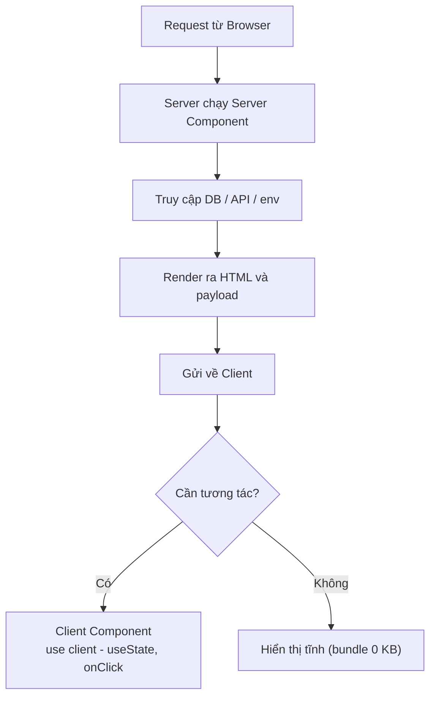
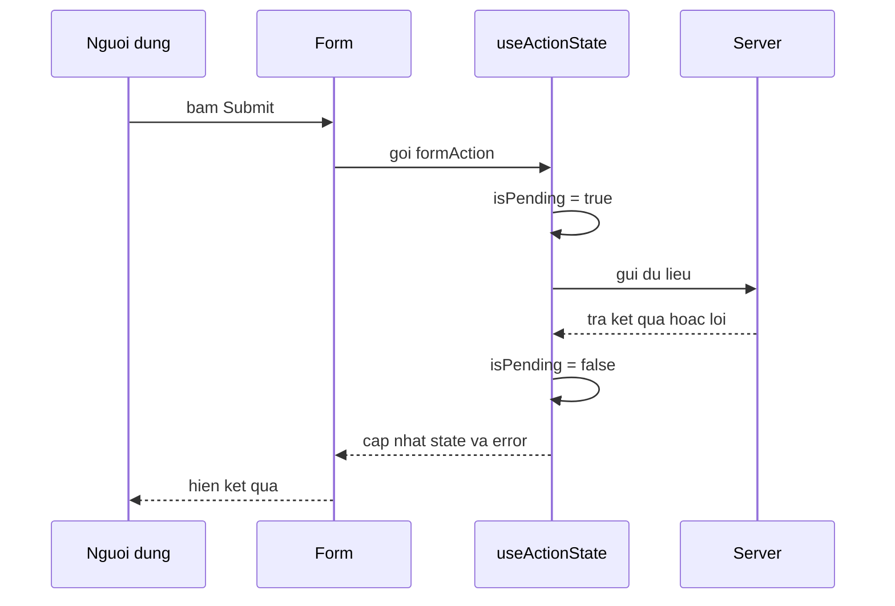

# React 19 Features

React 19 là phiên bản mới mang đến nhiều tính năng giúp viết ứng dụng gọn và mạnh hơn, như **Server Components** (component chạy trên máy chủ), hook `use` để đọc dữ liệu bất đồng bộ, cùng **Actions** (cơ chế xử lý hành động như gửi form). Bài này giới thiệu các tính năng nổi bật của React 19 dành cho người mới làm quen. Bạn chưa cần nhớ hết, chỉ cần hiểu mỗi tính năng giải quyết vấn đề gì.

[](pathname:///img/react/react-19-features.webp)

---

:::note[Ghi nhớ nhanh]

- ⭐ **Server Components chạy trên server** — bundle 0 KB, truy cập DB/env trực tiếp, giữ secret an toàn; Client Component (có state/onClick) phải đánh dấu `"use client"`.
- ⭐ **Actions + `useActionState` gói sẵn pending/error** — form submit không còn `useState` rải rác; kèm `useFormStatus` cho nút con biết form đang gửi.
- **`use()` đọc Promise hoặc Context** — được phép gọi trong nhánh `if`, khác `useContext`.
- **`useOptimistic` cập nhật UI ngay** khi bấm và tự rollback nếu server lỗi.
- **Tiện ích khác**: tự hoist `<title>`/`<meta>` vào head, `ref` là prop thường (bỏ `forwardRef`), React Compiler tự memoize thay `useMemo`/`useCallback`.

:::

---

## Mục lục

- [Vì sao React 19 thêm các tính năng này?](#vì-sao-react-19-thêm-các-tính-năng-này)
- [Server Components](#server-components)
- [use hook](#use-hook)
- [Actions và useActionState](#actions-và-useactionstate)
- [useOptimistic](#useoptimistic)
- [Document Metadata](#document-metadata)
- [React Compiler](#react-compiler)
- [Câu hỏi phỏng vấn](#câu-hỏi-phỏng-vấn)

---

## Vì sao React 19 thêm các tính năng này?

**Vấn đề:**

```jsx
// React 18: xử lý form/mutation phải tự quản nhiều state thủ công
function LoginForm() {
  const [isPending, setIsPending] = useState(false);
  const [error, setError] = useState(null);

  async function handleSubmit(e) {
    e.preventDefault();
    setIsPending(true);
    setError(null);
    try {
      await login(e.target.email.value);
    } catch (err) {
      setError(err.message); // tự set lỗi
    } finally {
      setIsPending(false); // tự reset pending — lặp ở mọi form
    }
  }
  // ...
}

// Truyền ref qua component con phải bọc forwardRef rườm rà
const Input = forwardRef((props, ref) => <input ref={ref} {...props} />);

// Đọc Promise/Context bị giới hạn — không gọi được trong if
function Comp({ shouldLoad }) {
  if (shouldLoad) {
    const ctx = useContext(MyContext); // ❌ vi phạm rules of hooks
  }
}
```

**Giải pháp:**

```jsx
// React 19: Actions + useActionState gói sẵn pending/error/submit
function LoginForm() {
  const [state, formAction, isPending] = useActionState(loginAction, {});
  return (
    <form action={formAction}>
      <input name="email" />
      {state.error && <p>{state.error}</p>}
      <button disabled={isPending}>{isPending ? "..." : "Login"}</button>
    </form>
  );
}

// useOptimistic: cập nhật lạc quan dễ dàng, tự rollback nếu fail
const [optimistic, addOptimistic] = useOptimistic(todos, (s, t) => [...s, t]);

// use(): đọc Promise/Context linh hoạt, được phép trong if
function Comp({ shouldLoad }) {
  if (shouldLoad) {
    const data = use(dataPromise); // ✅ OK
    return <div>{data}</div>;
  }
}

// ref là prop thường — bỏ forwardRef
function Input({ ref, ...props }) {
  return <input ref={ref} {...props} />;
}
```

:::tip[Dùng thực tế]

- **Form submit (login, đăng ký)**: `useActionState` tự lo trạng thái `pending` và thông báo lỗi — không còn `useState` rải rác, code gọn và đồng nhất.
- **Optimistic UI khi like/comment/thêm todo**: `useOptimistic` hiển thị thay đổi ngay khi bấm, mượt UX; nếu server lỗi React tự rollback về state thật.
- **Đọc dữ liệu bất đồng bộ**: `use()` đọc Promise kết hợp `<Suspense>` để hiện spinner, gọi được cả trong nhánh điều kiện.
- **Truyền ref gọn gàng**: nhận `ref` như prop bình thường để focus input hay đo kích thước, không phải bọc `forwardRef`.

:::

---

## Server Components

**React Server Components (RSC)** — component chạy **trên server**, gửi
HTML/data về client. Hoạt động trong Next.js App Router (production-ready
2024+).

```tsx
// app/users/page.tsx — Server Component (default)
async function UsersPage() {
  const users = await db.user.findMany(); // truy cập DB trực tiếp
  return (
    <ul>
      {users.map(u => <li key={u.id}>{u.name}</li>)}
    </ul>
  );
}
```

**Client Component** — phải đánh dấu `"use client"`:

```tsx
// app/components/Counter.tsx
"use client";

import { useState } from "react";

export function Counter() {
  const [count, setCount] = useState(0);
  return <button onClick={() => setCount(c => c + 1)}>{count}</button>;
}
```

| | Server Component | Client Component |
|--|-----------------|------------------|
| Chạy ở | Server | Browser |
| Bundle size | **0** (không vào client) | Có |
| Hook (useState, useEffect) | **Không** | Có |
| Access DB, fs, env | **Có** | Không |
| Interactive | Không | **Có** |
| Đánh dấu | Mặc định | `"use client"` đầu file |

:::info[Phân tích]

**Lợi ích RSC**:

1. **Bundle nhỏ hơn** — code data fetching không vào client.
2. **Truy cập DB trực tiếp** — không cần API route.
3. **Secret an toàn** — API key, DB connection chỉ ở server.
4. **Streaming** — render dần từng phần.
5. **Composition** — Server Component có thể wrap Client Component:

```tsx
// page.tsx (Server)
import { Counter } from "./Counter"; // Client component

async function Page() {
  const data = await fetchData(); // server
  return (
    <div>
      <h1>{data.title}</h1>
      <Counter initial={data.count} /> {/* Client island */}
    </div>
  );
}
```

Pattern: **Server Component cho dữ liệu, Client Component cho interaction**.

Luồng request khi kết hợp Server Component và Client Component:



Trade-off:

- Học curve cao — phải nghĩ "boundary".
- Caching layer phức tạp.
- Một số lib chưa compat (Styled Components cần wrapper).

:::

---

## use hook

Đọc Promise hoặc Context, **được phép trong condition**:

```jsx
import { use } from "react";

function UserDetail({ promise }: { promise: Promise<User> }) {
  const user = use(promise); // suspend nếu chưa resolve
  return <div>{user.name}</div>;
}

function Page() {
  const userPromise = fetchUser(1);
  return (
    <Suspense fallback={<Spinner />}>
      <UserDetail promise={userPromise} />
    </Suspense>
  );
}
```

Khác `useContext` — `use` được dùng trong `if`:

```jsx
function Component({ shouldLoad }) {
  if (shouldLoad) {
    const data = use(dataPromise); // OK
    return <div>{data}</div>;
  }
  return null;
}
```

---

## Actions và useActionState

**Server Action** (Next.js App Router):

```tsx
"use server";

async function createUser(formData: FormData) {
  await db.user.create({
    data: { name: formData.get("name") as string },
  });
  revalidatePath("/users");
}
```

```tsx
"use client";

<form action={createUser}>
  <input name="name" />
  <button>Create</button>
</form>
```

**`useActionState`** — manage state + pending + error:

```tsx
"use client";
import { useActionState } from "react";

async function loginAction(prevState, formData) {
  const email = formData.get("email");
  try {
    await login(email);
    return { success: true };
  } catch (err) {
    return { error: err.message };
  }
}

function LoginForm() {
  const [state, formAction, isPending] = useActionState(loginAction, {});

  return (
    <form action={formAction}>
      <input name="email" />
      {state.error && <p>{state.error}</p>}
      <button disabled={isPending}>
        {isPending ? "..." : "Login"}
      </button>
    </form>
  );
}
```

Trình tự khi submit một form dùng `useActionState` (trạng thái pending/error
được gói sẵn):



**`useFormStatus`** — child component biết form đang pending:

```tsx
"use client";
import { useFormStatus } from "react-dom";

function SubmitButton() {
  const { pending } = useFormStatus();
  return <button disabled={pending}>{pending ? "..." : "Save"}</button>;
}
```

---

## useOptimistic

Update UI **ngay lập tức** với optimistic value, rollback nếu fail:

```tsx
"use client";
import { useOptimistic } from "react";

function TodoList({ todos, addTodo }) {
  const [optimisticTodos, addOptimistic] = useOptimistic(
    todos,
    (state, newTodo) => [...state, { ...newTodo, pending: true }]
  );

  async function formAction(formData) {
    const text = formData.get("text");
    addOptimistic({ id: Math.random(), text }); // UI update ngay
    await addTodo(text); // server action
  }

  return (
    <>
      <ul>
        {optimisticTodos.map(t => (
          <li key={t.id} className={t.pending ? "opacity-50" : ""}>
            {t.text}
          </li>
        ))}
      </ul>
      <form action={formAction}>
        <input name="text" />
        <button>Add</button>
      </form>
    </>
  );
}
```

UX: user thấy item xuất hiện ngay khi click, không phải đợi server response.
Nếu server fail → React tự rollback về state thật.

---

## Document Metadata

React 19 tự **hoist `<title>`, `<meta>`, `<link>`** vào `<head>`:

```jsx
function BlogPost({ post }) {
  return (
    <article>
      <title>{post.title} - Blog</title>
      <meta name="description" content={post.summary} />
      <h1>{post.title}</h1>
      <p>{post.body}</p>
    </article>
  );
}
```

Trước đây phải dùng `react-helmet` hoặc Next.js `<Head>`. Giờ vanilla
React 19 đã support.

---

## React Compiler

[React Compiler](https://react.dev/learn/react-compiler) — auto-memoize
component và value. Khi production-ready:

- **Không cần** `useCallback`, `useMemo`, `React.memo` thủ công.
- Compiler analyze code, insert memoization tự động.
- Backwards compatible.

```jsx
// Hôm nay
function Page() {
  const value = useMemo(() => compute(props), [props]);
  const handler = useCallback(() => doSomething(value), [value]);
  return <Child handler={handler} />;
}

// Với React Compiler
function Page() {
  const value = compute(props); // tự memo
  const handler = () => doSomething(value); // tự memo
  return <Child handler={handler} />;
}
```

:::info[Phân tích]

**React Compiler tình trạng 2026:**

- **Stage**: production-ready cho Meta apps, opt-in cho cộng đồng.
- **Cài đặt**: babel-plugin, hoặc SWC transform.
- **Tích hợp**: Next.js có flag, Vite có plugin.

Khi compiler stable:

- Code đơn giản hơn — không phải nghĩ về memoization.
- Performance đồng đều — không bỏ sót useMemo cần thiết.
- Junior dev viết code performant hơn mặc nhiên.

Hiện tại (2026), **bật khi có cơ hội** — kiểm tra compatibility với
codebase trước. ESLint plugin `eslint-plugin-react-compiler` cảnh báo
code không compatible (mutation, side effect trong render).

:::

:::tip[Mẹo]

**Migration sang React 19**:

1. **Update dependencies** — React 19 + dependency cần compat.
2. **Remove `forwardRef`** — codemod `react-codemod forward-refs-to-refs`.
3. **Remove `PropTypes`** — TS thay thế.
4. **Test với Strict Mode** — bắt bug effect, cleanup.
5. **Cân nhắc Compiler** — opt-in dần.

Một số breaking change minor — đa số app upgrade từ 18 không gặp issue lớn.

:::

:::warning[Cần lưu ý]

**React 19 Server Components chỉ hoạt động trong framework hỗ trợ:**

- **Next.js App Router** — đầy đủ nhất.
- **TanStack Start** — đang implement.
- **Remix v2+** — limited support.
- **Vite SPA** — **không** có RSC.

Project Vite không thể dùng `"use server"` actions. Vẫn dùng được hooks
mới (`use`, `useActionState`, `useOptimistic`) trong client.

:::

---

## Câu hỏi phỏng vấn

Những câu thường gặp về chủ đề này. Tự trả lời trước, rồi bấm **Xem đáp án** để đối chiếu.

**1. Server Component khác Client Component ở những điểm nào? Nêu ít nhất bốn khác biệt.**

<details className="qa">
<summary>Xem đáp án</summary>

| | Server Component | Client Component |
|--|-----------------|------------------|
| Chạy ở | Server | Browser |
| Bundle size | **0** (không vào client) | Có |
| Hook (`useState`, `useEffect`) | **Không** | Có |
| Truy cập DB, `fs`, env | **Có** | Không |
| Tương tác (`onClick`) | Không | **Có** |
| Đánh dấu | Mặc định | `"use client"` đầu file |

```tsx
// Server Component (mặc định)
async function UsersPage() {
  const users = await db.user.findMany(); // truy cập DB trực tiếp
  return <ul>{users.map(u => <li key={u.id}>{u.name}</li>)}</ul>;
}
```

Pattern chuẩn: **Server Component lo dữ liệu, Client Component lo tương tác**. Server Component được phép bọc Client Component và truyền dữ liệu xuống như props, nhưng chiều ngược lại thì không — Client Component chỉ nhận Server Component qua `children`.

</details>

**2. Vì sao nói Server Component có bundle '0 KB' phía client? Cái gì thực sự được gửi xuống trình duyệt?**

<details className="qa">
<summary>Xem đáp án</summary>

Vì **mã nguồn** của Server Component không bao giờ được đóng gói vào bundle client. Nó chạy xong trên server và bị "bốc hơi" — mọi thư viện mà nó import (ORM, SDK, thư viện markdown nặng vài trăm KB) cũng không theo xuống trình duyệt.

Thứ được gửi xuống là **kết quả render**:

- **HTML** cho lần tải đầu, để hiện nội dung ngay.
- **RSC payload** — mô tả đã được serialize của cây React sau khi render: các node, text, props, và các "chỗ trống" trỏ tới Client Component cần hydrate.
- **JS của các Client Component** được tham chiếu trong payload.

Nhờ payload là mô tả cây React chứ không phải HTML thô, React có thể ghép nó với cây hiện có khi điều hướng mà không mất state của client — điều mà trả HTML thuần không làm được.

Hệ quả thực tế: thêm logic vào Server Component gần như không làm tăng bundle; ngược lại, mỗi lần đẩy một component xuống client là phải trả giá bằng KB.

</details>

**3. Khi nào bắt buộc phải thêm `"use client"`? Đánh dấu ở một file có ảnh hưởng gì tới các module nó import?**

<details className="qa">
<summary>Xem đáp án</summary>

Bắt buộc khi component cần thứ chỉ tồn tại ở trình duyệt:

- State và lifecycle: `useState`, `useReducer`, `useEffect`, `useRef`.
- Event handler: `onClick`, `onChange`, `onSubmit`.
- Web API: `window`, `document`, `localStorage`, `IntersectionObserver`.
- Custom hook hoặc thư viện dùng những thứ trên (nhiều thư viện UI).

Quan trọng: `"use client"` không đánh dấu một component, mà đánh dấu **một ranh giới (boundary)**. Từ file đó trở đi, **mọi module nó import cũng bị kéo vào bundle client** và trở thành code client. Đó là lý do đặt `"use client"` ở ngay `layout` gốc sẽ vô hiệu hoá gần như toàn bộ lợi ích của RSC.

Nguyên tắc thực hành: **đẩy ranh giới xuống càng sâu càng tốt**. Thay vì đánh dấu cả trang, chỉ tách riêng cái nút hoặc cái form cần tương tác thành một Client Component nhỏ, phần còn lại giữ nguyên ở server.

</details>

**4. Server Component dùng được `useState`, `useEffect`, `onClick` không? Giải thích lý do kỹ thuật.**

<details className="qa">
<summary>Xem đáp án</summary>

Không. Lý do nằm ở vòng đời: Server Component **chỉ render một lần trên server** rồi kết thúc. Nó không tồn tại trong trình duyệt, không có instance nào sống tiếp để mà cập nhật.

- **`useState`** vô nghĩa vì không có lần render thứ hai: không có gì trên client giữ giá trị state, cũng không có cơ chế re-render.
- **`useEffect`** là API chạy sau khi commit vào DOM — trên server không có DOM và không có bước commit.
- **`onClick`** là một **hàm**, mà hàm thì không serialize được để gửi qua mạng. Đưa `onClick` xuống Client Component sẽ bị báo lỗi ngay. Ngoại lệ duy nhất là Server Action (`"use server"`), vì React thay nó bằng một tham chiếu chứ không gửi code.

Cách xử lý: giữ phần lấy dữ liệu ở Server Component, tách riêng phần tương tác thành Client Component nhỏ (`"use client"`) rồi truyền dữ liệu xuống làm props.

</details>

**5. Có thể truyền những loại props nào từ Server Component xuống Client Component? Ràng buộc serialize là gì?**

<details className="qa">
<summary>Xem đáp án</summary>

Ranh giới server–client đi qua mạng, nên mọi props phải **serialize được**.

Truyền được:

- Kiểu nguyên thuỷ: `string`, `number`, `boolean`, `null`, `undefined`, `BigInt`.
- Object thuần và mảng chứa các giá trị serialize được.
- `Date`, `Map`, `Set`, `TypedArray`.
- **JSX/React element** — rất quan trọng, đây là cách truyền Server Component vào trong Client Component qua `children`.
- **Promise** (cho `use()`), và **Server Action** đã đánh dấu `"use server"`.

Không truyền được: **hàm thường**, class và instance của class, đối tượng có method, `Symbol` không đăng ký, và các object đặc thù runtime server (connection, stream).

```tsx
<Counter initial={data.count} />        {/* OK */}
<Counter onDone={() => save()} />       {/* ❌ không serialize được hàm */}
```

Một mẹo quan trọng: Client Component **không import được** Server Component, nhưng **nhận được** qua `children` — nhờ vậy vẫn đặt được nội dung server bên trong một khung client.

</details>

**6. Phân biệt directive `"use client"` và `"use server"` — hai cái này rất hay bị nhầm, khác nhau ở đâu?**

<details className="qa">
<summary>Xem đáp án</summary>

Hai directive **không đối xứng** như tên gọi khiến người ta tưởng:

| | `"use client"` | `"use server"` |
|---|---|---|
| Đánh dấu cái gì | Ranh giới bắt đầu code **client** | Các **hàm** chỉ chạy trên server, được phép gọi từ client |
| Tác dụng | Module và mọi thứ nó import vào bundle client | Tạo endpoint ẩn; client gọi hàm qua network |
| Vị trí | Đầu file component | Đầu file, hoặc đầu thân một hàm async |
| Mặc định | Không có directive = Server Component | Không liên quan đến việc là Server Component |

Nhầm lẫn phổ biến nhất: nghĩ rằng phải viết `"use server"` để tạo Server Component. Sai — Server Component là **mặc định**, không cần directive gì cả. `"use server"` dành riêng cho **Server Function / Server Action**, ví dụ hàm xử lý form.

```tsx
"use server";
async function createUser(formData: FormData) {
  await db.user.create({ data: { name: formData.get("name") as string } });
}
```

Vì Server Action là endpoint thật sự truy cập được từ ngoài, luôn phải **tự kiểm tra quyền và validate input** ngay trong hàm.

</details>

**7. Hook `use()` khác `useContext` và `useEffect` ở chỗ nào? Vì sao `use()` được phép gọi trong `if` hoặc trong vòng lặp?**

<details className="qa">
<summary>Xem đáp án</summary>

`use()` không phải hook thông thường mà là một **API đặc biệt** của React, đọc được cả Promise lẫn Context:

```jsx
function Component({ shouldLoad }) {
  if (shouldLoad) {
    const data = use(dataPromise); // ✅ hợp lệ
    return <div>{data}</div>;
  }
  return null;
}
```

Khác biệt:

- **So với `useContext`**: cùng đọc được context, nhưng `useContext` phải gọi ở cấp cao nhất, còn `use` gọi có điều kiện được.
- **So với `useEffect`**: `useEffect` chạy *sau* render và không trả dữ liệu; `use` chạy *trong* render và **suspend** component cho tới khi Promise resolve — nên phải có `Suspense` bao ngoài, và Error Boundary cho trường hợp reject.

Sở dĩ gọi có điều kiện được là vì `use` **không dựa vào thứ tự hook** để tìm lại state như `useState`/`useEffect`. Nó chỉ đọc giá trị từ chính đối tượng được truyền vào. Dù vậy `use` vẫn phải được gọi **trong lúc render** — không dùng trong event handler hay callback.

</details>

**8. Dùng `use()` với một Promise tạo ngay trong thân Client Component có vấn đề gì? Promise nên được tạo ở đâu?**

<details className="qa">
<summary>Xem đáp án</summary>

Vấn đề là **vòng lặp vô tận**: mỗi lần render tạo ra một Promise **mới**, `use` thấy nó chưa resolve nên suspend; khi resolve xong React render lại, thân hàm lại tạo Promise mới, lại suspend... Ngoài ra API bị gọi lặp không kiểm soát.

```jsx
// Sai
function UserDetail({ id }) {
  const user = use(fetchUser(id)); // promise mới mỗi lần render
}
```

Promise nên được tạo ở nơi **ổn định giữa các lần render**:

- **Trong Server Component**, rồi truyền xuống làm prop — cách khuyến nghị:

```jsx
function Page() {
  const userPromise = fetchUser(1); // tạo ở cha
  return (
    <Suspense fallback={<Spinner />}>
      <UserDetail promise={userPromise} />
    </Suspense>
  );
}
```

- Hoặc từ một **cache theo key** (thư viện data fetching như TanStack Query), để cùng một key luôn trả về cùng một Promise.

Nói cách khác: `use` chỉ *đọc*, việc quản lý vòng đời Promise phải do lớp khác lo.

</details>

**9. Actions là gì? Cơ chế này thay đổi cách xử lý form so với `onSubmit` truyền thống ra sao?**

<details className="qa">
<summary>Xem đáp án</summary>

**Action** là một hàm (thường async) truyền thẳng vào thuộc tính `action` của `form`. React tự gọi nó khi submit, tự gom dữ liệu thành `FormData`, và tự quản trạng thái pending trong một transition.

```jsx
<form action={formAction}>
  <input name="email" />
  <button disabled={isPending}>{isPending ? "..." : "Login"}</button>
</form>
```

So với `onSubmit` truyền thống:

- **Không phải `e.preventDefault()`**, không phải tự đọc từng ô input.
- **Không còn `useState` rải rác** cho `isPending` và `error` — trước đây mỗi form phải tự viết `setIsPending(true)` / `finally { setIsPending(false) }`.
- **Form tự reset** sau khi action thành công (với action truyền trực tiếp).
- **Tiến gần lại nền tảng web**: form hoạt động theo mô hình gửi dữ liệu quen thuộc, và với Server Action thì còn chạy được cả trước khi JS hydrate xong.
- **Ghép được với `useOptimistic` và `useFormStatus`** vì cả hệ thống cùng biết "đang có một action chạy".

</details>

**10. `useActionState` trả về những gì? Giải thích vai trò của từng phần tử trong mảng kết quả.**

<details className="qa">
<summary>Xem đáp án</summary>

```tsx
const [state, formAction, isPending] = useActionState(loginAction, {});
```

- **`state`** — giá trị **trả về từ lần chạy action gần nhất**, khởi đầu bằng initial state truyền ở tham số thứ hai. Đây là chỗ để action trả về kết quả hoặc thông báo lỗi, ví dụ `{ error: "Sai mật khẩu" }`.
- **`formAction`** — hàm để gắn vào `action` của form (hoặc `formAction` của nút). Gọi nó sẽ chạy action của bạn và cập nhật `state`.
- **`isPending`** — `true` trong lúc action đang chạy, dùng để khoá nút và hiện chữ "Đang gửi...".

Điểm cần nhớ là chữ ký của action: React gọi nó với **`(prevState, formData)`** — tham số đầu là state trước đó chứ không phải form data:

```tsx
async function loginAction(prevState, formData) {
  try {
    await login(formData.get("email"));
    return { success: true };
  } catch (err) {
    return { error: err.message };
  }
}
```

Nên **trả về** lỗi thay vì throw, để lỗi hiện ngay trong form thay vì rơi lên Error Boundary.

</details>

**11. `useFormStatus` lấy trạng thái từ đâu? Vì sao nó chỉ hoạt động ở component con của `form`?**

<details className="qa">
<summary>Xem đáp án</summary>

`useFormStatus` (import từ `react-dom`) đọc trạng thái của **`form` cha gần nhất** thông qua context mà React tự gắn vào form khi nó đang submit:

```tsx
function SubmitButton() {
  const { pending } = useFormStatus();
  return <button disabled={pending}>{pending ? "..." : "Save"}</button>;
}
```

Nó trả về `pending`, cùng `data` (FormData đang gửi), `method` và `action`.

Chỉ hoạt động ở component **con** vì nó đọc context đi lên trên. Nếu gọi trong chính component đang render thẻ `form`, component đó nằm **ngang hàng hoặc bên trên** provider nên luôn nhận `pending === false`. Đây là lỗi hay gặp nhất khi mới dùng.

Lợi ích của thiết kế này: nút submit tự biết trạng thái mà **không cần truyền prop** qua nhiều tầng — rất hợp với design system, nơi `SubmitButton` là component dùng chung cho mọi form.

</details>

**12. So sánh `useActionState` và `useFormStatus` — tình huống nào dùng cái nào?**

<details className="qa">
<summary>Xem đáp án</summary>

| | `useActionState` | `useFormStatus` |
|---|---|---|
| Import từ | `react` | `react-dom` |
| Gọi ở đâu | Component **chứa** form | Component **con** của form |
| Cho gì | `state` (kết quả/lỗi), `formAction`, `isPending` | `pending`, `data`, `method`, `action` |
| Có bọc action không | Có — nó tạo ra `formAction` | Không — chỉ đọc trạng thái |

- Dùng **`useActionState`** khi cần **kết quả** của action: thông báo lỗi validate, dữ liệu trả về, giữ lại giá trị người dùng đã nhập khi submit thất bại.
- Dùng **`useFormStatus`** khi chỉ cần biết "form có đang gửi không" ở một component con dùng chung, ví dụ `SubmitButton`, thanh tiến trình, hay lớp phủ vô hiệu hoá form.

Hai cái thường đi cùng nhau: cha dùng `useActionState` để hiện lỗi, còn nút submit dùng `useFormStatus` để tự khoá — không phải truyền `isPending` xuống qua props.

</details>

**13. `useOptimistic` hoạt động thế nào? React rollback giá trị optimistic tại thời điểm nào?**

<details className="qa">
<summary>Xem đáp án</summary>

`useOptimistic` nhận state thật cùng một hàm reducer, và trả về một state "tạm" để hiển thị trong lúc action đang chạy:

```tsx
const [optimisticTodos, addOptimistic] = useOptimistic(
  todos,
  (state, newTodo) => [...state, { ...newTodo, pending: true }]
);

async function formAction(formData) {
  addOptimistic({ id: Math.random(), text: formData.get("text") }); // UI đổi ngay
  await addTodo(formData.get("text")); // gọi server
}
```

Gọi `addOptimistic` xong, UI hiển thị ngay giá trị mới — người dùng không phải chờ server.

**Thời điểm rollback:** khi **transition/action kết thúc**, React vứt bỏ giá trị optimistic và quay về đúng giá trị của state thật (`todos`) tại thời điểm đó.

- Nếu server thành công và dữ liệu đã được revalidate, state thật đã chứa item mới → người dùng không thấy gì thay đổi.
- Nếu server lỗi, state thật vẫn như cũ → item biến mất, tức là **tự rollback**.

Vì vậy nên gắn cờ như `pending: true` để làm mờ item tạm, cho người dùng biết nó chưa được xác nhận.

</details>

**14. Optimistic update thất bại vì server trả lỗi — ngoài rollback, UX nên xử lý thêm gì?**

<details className="qa">
<summary>Xem đáp án</summary>

Rollback trần trụi là trải nghiệm tệ: item vừa hiện ra bỗng biến mất mà người dùng không hiểu vì sao, và mất luôn nội dung vừa gõ.

Nên bổ sung:

- **Báo lỗi rõ ràng** — toast hoặc dòng chữ ngay cạnh chỗ thao tác, nói được chuyện gì đã xảy ra ("Mất kết nối", "Bạn không có quyền").
- **Giữ lại dữ liệu người dùng nhập** để họ không phải gõ lại; với `useActionState` thì trả lại giá trị đã nhập trong `state`.
- **Nút "Thử lại"** ngay tại chỗ, tốt hơn là buộc làm lại từ đầu.
- **Phân biệt loại lỗi**: lỗi mạng thì retry được; lỗi nghiệp vụ (validate, hết quyền) thì retry vô ích, phải sửa dữ liệu.
- **Chống nhân đôi** khi retry: gửi kèm một khoá idempotency để server không tạo hai bản ghi.
- **Chỉ optimistic khi khả năng thành công cao**. Với thao tác nguy hiểm hoặc khó hoàn tác (thanh toán, xoá vĩnh viễn), hãy chờ server xác nhận.

</details>

**15. React 19 bỏ `forwardRef` — `ref` giờ hoạt động ra sao? Code cũ dùng `forwardRef` có vỡ không?**

<details className="qa">
<summary>Xem đáp án</summary>

Từ React 19, **`ref` là một prop bình thường** của function component. Không cần bọc gì nữa:

```jsx
// React 18
const Input = forwardRef((props, ref) => <input ref={ref} {...props} />);

// React 19
function Input({ ref, ...props }) {
  return <input ref={ref} {...props} />;
}
```

Nhờ vậy `ref` được destructure, đặt tên lại, truyền tiếp xuống như mọi prop khác, và định kiểu trong TypeScript cũng đơn giản hơn nhiều.

**Code cũ không vỡ**: `forwardRef` vẫn chạy bình thường trong React 19, chỉ bị đánh dấu là sẽ gỡ ở phiên bản sau. React cung cấp codemod (`react-codemod`) để chuyển hàng loạt, nên có thể migrate dần.

Lưu ý thêm: cách viết mới chỉ áp dụng cho **function component** — class component vẫn nhận `ref` trỏ tới instance như trước. Và khi bung props bằng `{...props}`, giờ `ref` cũng nằm trong đó, cần để ý để không vô tình truyền nhầm.

</details>

**16. Cơ chế tự hoist `title` và `meta` trong React 19 giải quyết vấn đề gì? Nó có thay thế hoàn toàn thư viện quản lý head/SEO không?**

<details className="qa">
<summary>Xem đáp án</summary>

Trước đây, thẻ `title`/`meta`/`link` chỉ hợp lệ trong `head`, mà component thì render ở giữa cây — nên phải dùng `react-helmet` hoặc API riêng của framework. React 19 cho phép render các thẻ này **ở bất kỳ đâu** và tự nâng chúng lên `head`:

```jsx
function BlogPost({ post }) {
  return (
    <article>
      <title>{post.title} - Blog</title>
      <meta name="description" content={post.summary} />
      <h1>{post.title}</h1>
    </article>
  );
}
```

Lợi ích: metadata nằm **ngay cạnh** component sở hữu dữ liệu, không phải đồng bộ hai chỗ; bớt được một dependency.

**Không thay thế hoàn toàn.** Các framework vẫn có lý do tồn tại:

- **Dedup và thứ tự ưu tiên** khi nhiều tầng layout cùng khai báo — React không giải quyết trọn vẹn việc gộp/ghi đè.
- **Metadata cho SSR/SSG** cần có sẵn trong HTML trước khi stream tới phần thân; Next.js dùng `metadata` export chính vì thế.
- Các tiện ích như template tiêu đề, sinh ảnh Open Graph, canonical URL, `robots`.

Trong Next.js App Router, vẫn nên ưu tiên API `metadata` của framework; dùng thẻ trực tiếp cho các trường hợp thật sự động.

</details>

**17. React Compiler làm gì? Có nó rồi thì `useMemo`/`useCallback` còn cần không, và compiler dựa vào giả định nào để memo hoá an toàn?**

<details className="qa">
<summary>Xem đáp án</summary>

React Compiler là một bước biên dịch (babel plugin hoặc SWC transform) **tự chèn memo hoá** vào code của bạn. Nó phân tích xem giá trị nào phụ thuộc vào cái gì, rồi tự cache lại các giá trị và hàm giữa các lần render:

```jsx
// Bạn viết
const value = compute(props);
const handler = () => doSomething(value);

// Compiler tự sinh phần ghi nhớ tương đương useMemo/useCallback
```

Khi compiler bật, **phần lớn `useMemo`/`useCallback`/`React.memo` viết tay là thừa** — thậm chí nên gỡ đi cho code sạch. Vẫn còn vài trường hợp phải làm thủ công: giữ một tham chiếu ổn định vì lý do ngoài React (ví dụ làm key cho cache bên ngoài), hoặc chỗ compiler cố tình bỏ qua.

**Giả định nền tảng: code phải tuân thủ Rules of React** — render là hàm thuần, không mutate props/state hay giá trị đã dùng để render, không side effect trong thân component, hook gọi đúng quy tắc. Nếu vi phạm, memo hoá có thể khiến UI không cập nhật.

Vì vậy hãy bật `eslint-plugin-react-compiler` trước: nó chỉ ra chỗ nào không tương thích, và compiler cũng tự bỏ qua những component mà nó không chắc.

</details>

**18. React 19 thay đổi gì với `ref` callback cleanup và với việc dùng Context trực tiếp làm provider?**

<details className="qa">
<summary>Xem đáp án</summary>

**Ref callback trả về hàm dọn dẹp.** Trước đây React gọi callback với `null` lúc unmount, nên phải viết kiểu `if (node) { ... } else { ... }`. React 19 cho phép trả về một hàm cleanup, chạy khi node bị gỡ:

```jsx
<input ref={(node) => {
  const observer = new ResizeObserver(onResize);
  observer.observe(node);
  return () => observer.disconnect(); // cleanup
}} />
```

Gọn và đối xứng như `useEffect`. Lưu ý kèm theo: ref callback **không được trả về giá trị khác** hàm cleanup, nên arrow function một dòng kiểu `ref={(node) => (ref.current = node)}` phải thêm ngoặc nhọn.

**Context dùng trực tiếp làm provider.** React 19 cho viết `<ThemeContext value="dark">` thay cho `<ThemeContext.Provider value="dark">`:

```jsx
const ThemeContext = createContext("light");

<ThemeContext value="dark">
  <App />
</ThemeContext>
```

Bớt một tầng chữ nghĩa, dễ đọc hơn. Cách viết `.Provider` cũ vẫn chạy nhưng sẽ bị gỡ ở phiên bản sau (đã có codemod). Cùng đợt này, `Context.Consumer` cũng bị coi là lỗi thời — hãy dùng `useContext` hoặc `use`.

</details>

**19. Vì sao Server Components chỉ chạy trong framework hỗ trợ (Next.js App Router...) còn Vite SPA thuần thì không?**

<details className="qa">
<summary>Xem đáp án</summary>

Vì RSC không phải một tính năng dùng được một mình — nó là **giao thức giữa bundler, server runtime và router**. Để chạy được, cần có:

- **Bundler hiểu ranh giới**: nhận diện `"use client"` / `"use server"`, tách thành hai đồ thị module, sinh bảng ánh xạ "module reference" để client biết tải chunk nào.
- **Một server runtime** để thực sự render Server Component theo từng request và sinh ra RSC payload.
- **Router tích hợp**: khi điều hướng, phải gọi về server lấy payload cho nhánh mới rồi ghép vào cây hiện tại — không phải chỉ đổi component ở client.
- **Cơ chế cho Server Action**: tạo endpoint ẩn, serialize tham số, xử lý revalidate.

React chỉ cung cấp phần nhân, còn việc lắp ráp bốn thứ trên là của framework.

**Vite SPA thuần** không có bước server render theo request, nên không dùng được RSC hay `"use server"`. Nhưng vẫn dùng bình thường được các hook mới ở client: `use`, `useActionState`, `useOptimistic`, `useFormStatus`, `ref` là prop.

</details>

**20. Migrate một dự án React 18 lên React 19 cần rà soát những breaking change nào?**

<details className="qa">
<summary>Xem đáp án</summary>

Các điểm chính cần rà:

- **API render cũ bị gỡ**: `ReactDOM.render` và `ReactDOM.hydrate` phải đổi sang `createRoot`/`hydrateRoot`; `unmountComponentAtNode` đổi thành `root.unmount()`.
- **`ReactDOM.findDOMNode`** bị gỡ — thay bằng `ref`.
- **String ref** (`ref="input"`) và **legacy context** (`contextTypes`) bị gỡ.
- **`propTypes` và `defaultProps` của function component** không còn tác dụng — chuyển sang TypeScript và tham số mặc định.
- **`forwardRef`** tuy còn chạy nhưng nên chạy codemod để chuyển `ref` thành prop.
- **Cách xử lý lỗi ở gốc thay đổi**: lỗi không còn bị ném lại thành uncaught error như trước; dùng tuỳ chọn `onUncaughtError` / `onCaughtError` khi tạo root nếu đang bắt lỗi toàn cục.
- **Dependency phải tương thích**: kiểm tra các thư viện lớn (router, UI, state) đã hỗ trợ React 19 chưa, và `@types/react` phải lên bản mới.
- **Chạy thử với Strict Mode** để lộ các effect thiếu cleanup.

Thực tế đa số app React 18 nâng cấp khá êm — phần tốn công nhất thường là chờ thư viện bên thứ ba.

</details>
