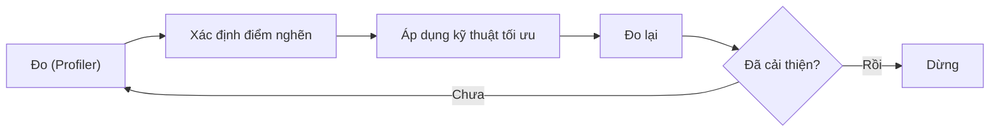
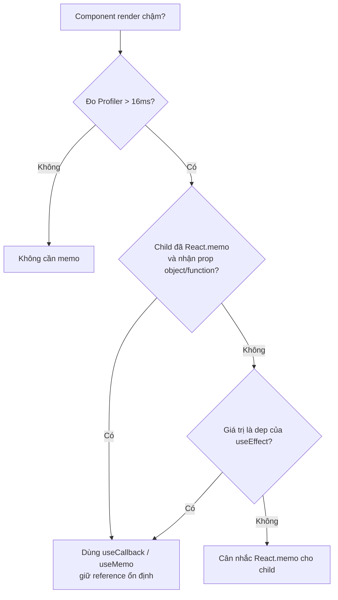

# Performance Optimization

**Performance Optimization** (tối ưu hiệu năng) là việc làm cho ứng dụng React chạy nhanh và mượt hơn, giảm số lần render lại không cần thiết và tải trang gọn hơn. Nguyên tắc quan trọng là "đo trước, tối ưu sau", tức là tìm đúng chỗ chậm rồi mới sửa, tránh tối ưu vội vàng. Bài này giới thiệu các kỹ thuật phổ biến như chia nhỏ mã (code splitting), ghi nhớ kết quả (memo) và hiển thị danh sách lớn hiệu quả (virtualization).

---

:::note[Ghi nhớ nhanh]

- ⭐ **"Đo trước, tối ưu sau"** — dùng React DevTools Profiler tìm đúng điểm nghẽn rồi mới sửa, tránh tối ưu sớm (premature optimization).
- ⭐ **`React.memo` bỏ re-render khi props không đổi**; `useMemo` nhớ giá trị tính toán, `useCallback` nhớ hàm — chỉ dùng khi thật sự cần (đo được > 16ms).
- **Code splitting** bằng `lazy` + `Suspense` (theo route hoặc component nặng) giúp giảm bundle ban đầu.
- **Virtualization** (TanStack Virtual, react-window) chỉ render item đang thấy cho danh sách hàng nghìn dòng.
- **Concurrent**: `useTransition`/`useDeferredValue` giữ UI mượt khi update nặng; theo dõi Web Vitals LCP < 2.5s, INP < 200ms, CLS < 0.1.

:::

---

## Mục lục

- [Vì sao cần tối ưu hiệu năng?](#vì-sao-cần-tối-ưu-hiệu-năng)
- [Đo trước, tối ưu sau](#đo-trước-tối-ưu-sau)
- [Code Splitting](#code-splitting)
- [React.memo, useMemo, useCallback](#reactmemo-usememo-usecallback)
- [Virtualization](#virtualization)
- [Concurrent Features](#concurrent-features)
- [Web Vitals](#web-vitals)

---

## Vì sao cần tối ưu hiệu năng?

**Vấn đề:** App lớn dần thì bắt đầu thấy lag — component con render lại dù props không đổi, tính toán nặng chạy lại mỗi lần render, danh sách hàng nghìn dòng render hết gây giật, bundle to làm tải trang chậm.

```jsx
function Parent() {
  const [count, setCount] = useState(0);

  // Hàm tạo mới mỗi render → con luôn render lại
  const handleClick = () => doSomething();

  // Tính toán nặng chạy lại mỗi render, dù data không đổi
  const sorted = bigList.sort((a, b) => a.value - b.value);

  return (
    <>
      <button onClick={() => setCount(c => c + 1)}>{count}</button>
      <Child onClick={handleClick} /> {/* render thừa mỗi lần bấm nút */}

      {/* 10000 dòng render hết → cuộn giật */}
      {sorted.map(item => <Row key={item.id} item={item} />)}
    </>
  );
}
```

**Giải pháp:** Dùng đúng kỹ thuật cho đúng điểm nghẽn — `React.memo` bỏ re-render khi props không đổi, `useMemo`/`useCallback` nhớ lại giá trị và hàm, code splitting + `lazy` giảm bundle, virtualization chỉ render phần thấy được. React 19 còn có Compiler tự memo giúp bớt phải viết tay.

```jsx
const Row = React.memo(function Row({ item }) {
  return <div>{item.name}</div>;
});

function Parent() {
  const [count, setCount] = useState(0);

  // Nhớ hàm → con không render thừa
  const handleClick = useCallback(() => doSomething(), []);

  // Nhớ kết quả → chỉ tính lại khi bigList đổi
  const sorted = useMemo(
    () => [...bigList].sort((a, b) => a.value - b.value),
    [bigList]
  );

  // Chỉ render ~20 dòng visible thay vì 10000 (xem mục Virtualization)
  return <VirtualList items={sorted} renderRow={Row} />;
}
```

:::tip[Dùng thực tế]

- **Component danh sách render thừa**: bọc `React.memo` quanh item của list/bảng để con không render lại khi cha cập nhật state không liên quan.
- **Bảng/danh sách lớn**: virtualize bảng hàng nghìn dòng (TanStack Virtual, react-window) để chỉ vẽ phần đang thấy.
- **Route nặng**: `lazy` + `Suspense` để tách màn hình ít dùng (dashboard, settings) ra khỏi bundle ban đầu.
- **Tìm điểm nghẽn**: bật React DevTools Profiler đo component nào render lâu rồi mới tối ưu — chỉ tối ưu khi **đo được** vấn đề, tránh tối ưu sớm.

:::

---

## Đo trước, tối ưu sau

**"Premature optimization is the root of all evil"** — Donald Knuth.

Quy trình đúng:

1. **Đo** — React DevTools Profiler, Performance tab.
2. **Identify** — component nào render lâu, render thừa.
3. **Fix** — áp dụng technique phù hợp.
4. **Đo lại** — confirm improvement.

Vòng lặp tối ưu nên đi theo chu trình khép kín, luôn quay lại bước đo:



Đừng:

- Memoize blanket mọi component.
- Code splitting không cần thiết.
- Optimization "phòng hờ" mà không có data.

---

## Code Splitting

Chia bundle thành chunk, load theo demand.

**Route-based** (phổ biến nhất):

```jsx
import { lazy, Suspense } from "react";

const Home = lazy(() => import("./pages/Home"));
const Dashboard = lazy(() => import("./pages/Dashboard"));
const Settings = lazy(() => import("./pages/Settings"));

<Suspense fallback={<PageLoading />}>
  <Routes>
    <Route path="/" element={<Home />} />
    <Route path="/dashboard" element={<Dashboard />} />
    <Route path="/settings" element={<Settings />} />
  </Routes>
</Suspense>
```

**Component-based** — split component nặng:

```jsx
const HeavyChart = lazy(() => import("./HeavyChart"));

function Dashboard() {
  const [showChart, setShowChart] = useState(false);
  return (
    <>
      <button onClick={() => setShowChart(true)}>Show chart</button>
      {showChart && (
        <Suspense fallback={<Spinner />}>
          <HeavyChart />
        </Suspense>
      )}
    </>
  );
}
```

**Preload** — load trước khi user click:

```jsx
const SettingsModule = import("./Settings");

function NavLink() {
  return (
    <Link
      to="/settings"
      onMouseEnter={() => SettingsModule} // preload khi hover
    >
      Settings
    </Link>
  );
}
```

---

## React.memo, useMemo, useCallback

**`React.memo`** — skip re-render nếu props không đổi (shallow compare):

```jsx
const ExpensiveChild = React.memo(function ExpensiveChild({ data }) {
  // render chỉ khi data đổi
  return <div>{data}</div>;
});

function Parent() {
  const [count, setCount] = useState(0);
  return (
    <>
      <button onClick={() => setCount(c => c + 1)}>+</button>
      <ExpensiveChild data="static" /> {/* không re-render */}
    </>
  );
}
```

**`useMemo`** — cache giá trị tính toán:

```jsx
const filtered = useMemo(() => {
  return items.filter(i => i.includes(query));
}, [items, query]);
```

**`useCallback`** — cache function:

```jsx
const handleClick = useCallback(() => {
  doSomething(id);
}, [id]);
```

:::warning[Cần lưu ý]

**Đừng memoize mặc định**:

- Mỗi memo có **cost** (track deps, compare).
- Object/array literal làm prop → memo child cũng re-render vì reference mới.
- Nhiều memo thừa khó đọc code.

**Khi cần memoize**:

1. Component render **chậm > 16ms** (đo Profiler).
2. Child component **đã được memo** + receive object/function prop.
3. Function/value là **dep của useEffect** khác.

**React Compiler** sẽ tự xử lý — khi production-ready, không cần viết
tay nữa.

Sơ đồ quyết định khi nào nên memoize (tránh memo mặc định):



:::

---

## Virtualization

Render danh sách dài → chỉ render item **visible** + buffer:

```bash
npm install @tanstack/react-virtual
```

```jsx
import { useVirtualizer } from "@tanstack/react-virtual";

function BigList({ items }) {
  const parentRef = useRef(null);

  const rowVirtualizer = useVirtualizer({
    count: items.length,
    getScrollElement: () => parentRef.current,
    estimateSize: () => 50, // ước lượng height mỗi row
  });

  return (
    <div ref={parentRef} style={{ height: 400, overflow: "auto" }}>
      <div style={{ height: rowVirtualizer.getTotalSize() }}>
        {rowVirtualizer.getVirtualItems().map(virtualRow => (
          <div
            key={virtualRow.index}
            style={{
              position: "absolute",
              top: virtualRow.start,
              height: virtualRow.size,
            }}
          >
            {items[virtualRow.index].name}
          </div>
        ))}
      </div>
    </div>
  );
}
```

10000 item nhưng chỉ render ~20 (visible + buffer) → smooth scroll.

Library khác: **react-window**, **react-virtualized** (cũ).

---

## Concurrent Features

**`useTransition`** — đánh dấu state update là non-urgent:

```jsx
import { useTransition, useState } from "react";

function Search() {
  const [isPending, startTransition] = useTransition();
  const [filter, setFilter] = useState("");

  const handleChange = (e) => {
    const value = e.target.value;
    startTransition(() => {
      setFilter(value); // non-urgent, có thể bị interrupt
    });
  };

  return (
    <>
      <input onChange={handleChange} />
      {isPending && <Spinner />}
      <HeavyList filter={filter} />
    </>
  );
}
```

Khi gõ liên tục, React **interrupt** render cũ — luôn responsive.

**`useDeferredValue`** — defer value cho rendering:

```jsx
function Search({ value }) {
  const deferredValue = useDeferredValue(value);
  // deferredValue lag sau value 1 chút khi busy
  return <HeavyList filter={deferredValue} />;
}
```

Phù hợp khi computation expensive nhưng không control state setter.

---

## Web Vitals

3 metric quan trọng:

- **LCP (Largest Contentful Paint)**: < 2.5s — load nhanh.
- **FID/INP (Interaction to Next Paint)**: < 200ms — phản hồi nhanh.
- **CLS (Cumulative Layout Shift)**: < 0.1 — không nhảy layout.

Cải thiện:

| Metric | Tactics |
|--------|---------|
| LCP | Image optimization, font preload, server-side render |
| INP | Code splitting, useTransition, virtualization, defer non-critical |
| CLS | Width/height cho image, skeleton placeholder, font-display |

:::info[Phân tích]

**React và Web Vitals**:

- **Next.js Image** — tự lazy load, sizes, blur placeholder → giảm LCP và CLS.
- **Next.js Font** — preload, no layout shift → giảm CLS.
- **Server Components** — bundle JS nhỏ hơn → giảm INP.
- **Suspense + streaming** — TTFB tốt hơn, perceived LCP tốt hơn.

Tool đo:

- **Lighthouse** (Chrome DevTools) — báo cáo tổng quan.
- **PageSpeed Insights** — đo Field Data thật từ user.
- **web-vitals library** — gửi metric vào analytics.

```jsx
import { onCLS, onINP, onLCP } from "web-vitals";

onCLS((metric) => sendToAnalytics(metric));
onINP((metric) => sendToAnalytics(metric));
onLCP((metric) => sendToAnalytics(metric));
```

Theo dõi Web Vitals **real users** (Field Data) — quan trọng hơn lab
test (Lighthouse), vì user thật chạy trên thiết bị, mạng đa dạng.

:::

:::tip[Mẹo]

**Checklist tối ưu performance React 2026:**

- [ ] Next.js Image / Font cho asset.
- [ ] Code split route + heavy component.
- [ ] Server Component cho data-fetching (Next.js App Router).
- [ ] Suspense + streaming.
- [ ] Skeleton loading thay vì spinner.
- [ ] Virtualize list > 100 items.
- [ ] useTransition cho filter/search non-urgent.
- [ ] Preload critical resource (`<link rel="preload">`).
- [ ] Defer non-critical JS (analytics, ads).
- [ ] CDN cho static asset.
- [ ] HTTP/2 hoặc HTTP/3.
- [ ] Bundle analysis (`vite-bundle-visualizer`).
- [ ] Monitor Web Vitals trong production.

Đo trước, áp dụng theo nhu cầu thực — không cần làm hết list ngay từ ngày 1.

:::
