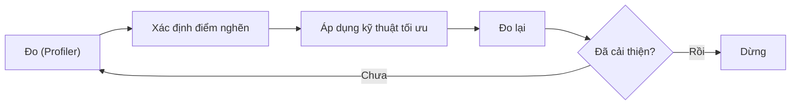
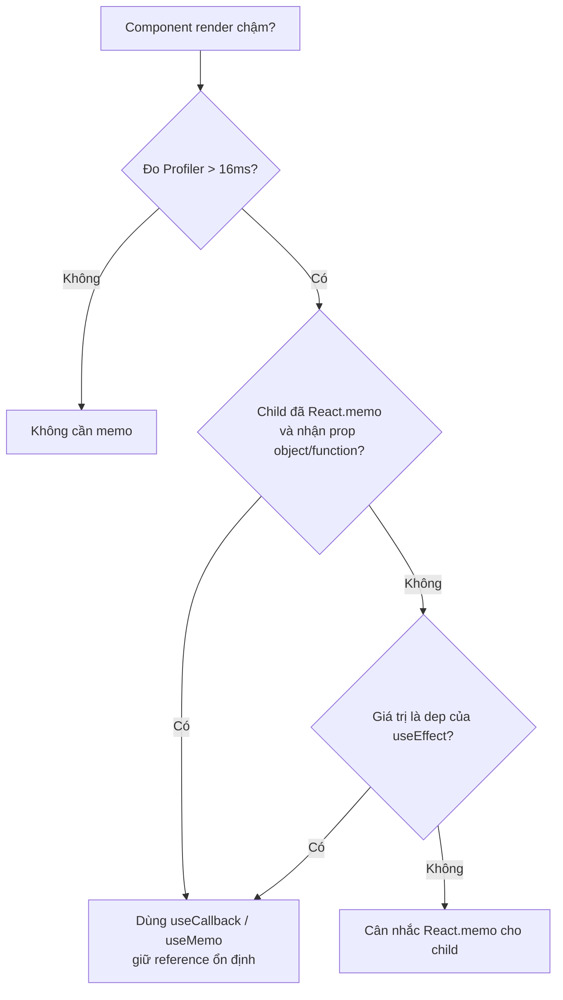

# Performance Optimization

**Performance Optimization** (tối ưu hiệu năng) là việc làm cho ứng dụng React chạy nhanh và mượt hơn, giảm số lần render lại không cần thiết và tải trang gọn hơn. Nguyên tắc quan trọng là "đo trước, tối ưu sau", tức là tìm đúng chỗ chậm rồi mới sửa, tránh tối ưu vội vàng. Bài này giới thiệu các kỹ thuật phổ biến như chia nhỏ mã (code splitting), ghi nhớ kết quả (memo) và hiển thị danh sách lớn hiệu quả (virtualization).

[](pathname:///img/react/performance.webp)

---

:::note[Ghi nhớ nhanh]

- ⭐ **"Đo trước, tối ưu sau"** — dùng React DevTools Profiler tìm đúng điểm nghẽn rồi mới sửa, tránh tối ưu sớm (premature optimization).
- ⭐ **`React.memo` bỏ re-render khi props không đổi**; `useMemo` nhớ giá trị tính toán, `useCallback` nhớ hàm — chỉ dùng khi thật sự cần (đo được > 16ms).
- **Code splitting** bằng `lazy` + `Suspense` (theo route hoặc component nặng) giúp giảm bundle ban đầu.
- **Virtualization** (TanStack Virtual, react-window) chỉ render item đang thấy cho danh sách hàng nghìn dòng.
- **Concurrent**: `useTransition`/`useDeferredValue` giữ UI mượt khi update nặng; theo dõi Web Vitals LCP < 2.5s, INP < 200ms, CLS < 0.1.

:::

---

## Mục lục

- [Vì sao cần tối ưu hiệu năng?](#vì-sao-cần-tối-ưu-hiệu-năng)
- [Đo trước, tối ưu sau](#đo-trước-tối-ưu-sau)
- [Code Splitting](#code-splitting)
- [React.memo, useMemo, useCallback](#reactmemo-usememo-usecallback)
- [Virtualization](#virtualization)
- [Concurrent Features](#concurrent-features)
- [Web Vitals](#web-vitals)
- [Câu hỏi phỏng vấn](#câu-hỏi-phỏng-vấn)

---

## Vì sao cần tối ưu hiệu năng?

**Vấn đề:** App lớn dần thì bắt đầu thấy lag — component con render lại dù props không đổi, tính toán nặng chạy lại mỗi lần render, danh sách hàng nghìn dòng render hết gây giật, bundle to làm tải trang chậm.

```jsx
function Parent() {
  const [count, setCount] = useState(0);

  // Hàm tạo mới mỗi render → con luôn render lại
  const handleClick = () => doSomething();

  // Tính toán nặng chạy lại mỗi render, dù data không đổi
  const sorted = bigList.sort((a, b) => a.value - b.value);

  return (
    <>
      <button onClick={() => setCount(c => c + 1)}>{count}</button>
      <Child onClick={handleClick} /> {/* render thừa mỗi lần bấm nút */}

      {/* 10000 dòng render hết → cuộn giật */}
      {sorted.map(item => <Row key={item.id} item={item} />)}
    </>
  );
}
```

**Giải pháp:** Dùng đúng kỹ thuật cho đúng điểm nghẽn — `React.memo` bỏ re-render khi props không đổi, `useMemo`/`useCallback` nhớ lại giá trị và hàm, code splitting + `lazy` giảm bundle, virtualization chỉ render phần thấy được. React 19 còn có Compiler tự memo giúp bớt phải viết tay.

```jsx
const Row = React.memo(function Row({ item }) {
  return <div>{item.name}</div>;
});

function Parent() {
  const [count, setCount] = useState(0);

  // Nhớ hàm → con không render thừa
  const handleClick = useCallback(() => doSomething(), []);

  // Nhớ kết quả → chỉ tính lại khi bigList đổi
  const sorted = useMemo(
    () => [...bigList].sort((a, b) => a.value - b.value),
    [bigList]
  );

  // Chỉ render ~20 dòng visible thay vì 10000 (xem mục Virtualization)
  return <VirtualList items={sorted} renderRow={Row} />;
}
```

:::tip[Dùng thực tế]

- **Component danh sách render thừa**: bọc `React.memo` quanh item của list/bảng để con không render lại khi cha cập nhật state không liên quan.
- **Bảng/danh sách lớn**: virtualize bảng hàng nghìn dòng (TanStack Virtual, react-window) để chỉ vẽ phần đang thấy.
- **Route nặng**: `lazy` + `Suspense` để tách màn hình ít dùng (dashboard, settings) ra khỏi bundle ban đầu.
- **Tìm điểm nghẽn**: bật React DevTools Profiler đo component nào render lâu rồi mới tối ưu — chỉ tối ưu khi **đo được** vấn đề, tránh tối ưu sớm.

:::

---

## Đo trước, tối ưu sau

**"Premature optimization is the root of all evil"** — Donald Knuth.

Quy trình đúng:

1. **Đo** — React DevTools Profiler, Performance tab.
2. **Identify** — component nào render lâu, render thừa.
3. **Fix** — áp dụng technique phù hợp.
4. **Đo lại** — confirm improvement.

Vòng lặp tối ưu nên đi theo chu trình khép kín, luôn quay lại bước đo:



Đừng:

- Memoize blanket mọi component.
- Code splitting không cần thiết.
- Optimization "phòng hờ" mà không có data.

---

## Code Splitting

Chia bundle thành chunk, load theo demand.

**Route-based** (phổ biến nhất):

```jsx
import { lazy, Suspense } from "react";

const Home = lazy(() => import("./pages/Home"));
const Dashboard = lazy(() => import("./pages/Dashboard"));
const Settings = lazy(() => import("./pages/Settings"));

<Suspense fallback={<PageLoading />}>
  <Routes>
    <Route path="/" element={<Home />} />
    <Route path="/dashboard" element={<Dashboard />} />
    <Route path="/settings" element={<Settings />} />
  </Routes>
</Suspense>
```

**Component-based** — split component nặng:

```jsx
const HeavyChart = lazy(() => import("./HeavyChart"));

function Dashboard() {
  const [showChart, setShowChart] = useState(false);
  return (
    <>
      <button onClick={() => setShowChart(true)}>Show chart</button>
      {showChart && (
        <Suspense fallback={<Spinner />}>
          <HeavyChart />
        </Suspense>
      )}
    </>
  );
}
```

**Preload** — load trước khi user click:

```jsx
const SettingsModule = import("./Settings");

function NavLink() {
  return (
    <Link
      to="/settings"
      onMouseEnter={() => SettingsModule} // preload khi hover
    >
      Settings
    </Link>
  );
}
```

---

## React.memo, useMemo, useCallback

**`React.memo`** — skip re-render nếu props không đổi (shallow compare):

```jsx
const ExpensiveChild = React.memo(function ExpensiveChild({ data }) {
  // render chỉ khi data đổi
  return <div>{data}</div>;
});

function Parent() {
  const [count, setCount] = useState(0);
  return (
    <>
      <button onClick={() => setCount(c => c + 1)}>+</button>
      <ExpensiveChild data="static" /> {/* không re-render */}
    </>
  );
}
```

**`useMemo`** — cache giá trị tính toán:

```jsx
const filtered = useMemo(() => {
  return items.filter(i => i.includes(query));
}, [items, query]);
```

**`useCallback`** — cache function:

```jsx
const handleClick = useCallback(() => {
  doSomething(id);
}, [id]);
```

:::warning[Cần lưu ý]

**Đừng memoize mặc định**:

- Mỗi memo có **cost** (track deps, compare).
- Object/array literal làm prop → memo child cũng re-render vì reference mới.
- Nhiều memo thừa khó đọc code.

**Khi cần memoize**:

1. Component render **chậm > 16ms** (đo Profiler).
2. Child component **đã được memo** + receive object/function prop.
3. Function/value là **dep của useEffect** khác.

**React Compiler** sẽ tự xử lý — khi production-ready, không cần viết
tay nữa.

Sơ đồ quyết định khi nào nên memoize (tránh memo mặc định):



:::

---

## Virtualization

Render danh sách dài → chỉ render item **visible** + buffer:

```bash
npm install @tanstack/react-virtual
```

```jsx
import { useVirtualizer } from "@tanstack/react-virtual";

function BigList({ items }) {
  const parentRef = useRef(null);

  const rowVirtualizer = useVirtualizer({
    count: items.length,
    getScrollElement: () => parentRef.current,
    estimateSize: () => 50, // ước lượng height mỗi row
  });

  return (
    <div ref={parentRef} style={{ height: 400, overflow: "auto" }}>
      <div style={{ height: rowVirtualizer.getTotalSize() }}>
        {rowVirtualizer.getVirtualItems().map(virtualRow => (
          <div
            key={virtualRow.index}
            style={{
              position: "absolute",
              top: virtualRow.start,
              height: virtualRow.size,
            }}
          >
            {items[virtualRow.index].name}
          </div>
        ))}
      </div>
    </div>
  );
}
```

10000 item nhưng chỉ render ~20 (visible + buffer) → smooth scroll.

Library khác: **react-window**, **react-virtualized** (cũ).

---

## Concurrent Features

**`useTransition`** — đánh dấu state update là non-urgent:

```jsx
import { useTransition, useState } from "react";

function Search() {
  const [isPending, startTransition] = useTransition();
  const [filter, setFilter] = useState("");

  const handleChange = (e) => {
    const value = e.target.value;
    startTransition(() => {
      setFilter(value); // non-urgent, có thể bị interrupt
    });
  };

  return (
    <>
      <input onChange={handleChange} />
      {isPending && <Spinner />}
      <HeavyList filter={filter} />
    </>
  );
}
```

Khi gõ liên tục, React **interrupt** render cũ — luôn responsive.

**`useDeferredValue`** — defer value cho rendering:

```jsx
function Search({ value }) {
  const deferredValue = useDeferredValue(value);
  // deferredValue lag sau value 1 chút khi busy
  return <HeavyList filter={deferredValue} />;
}
```

Phù hợp khi computation expensive nhưng không control state setter.

---

## Web Vitals

3 metric quan trọng:

- **LCP (Largest Contentful Paint)**: < 2.5s — load nhanh.
- **FID/INP (Interaction to Next Paint)**: < 200ms — phản hồi nhanh.
- **CLS (Cumulative Layout Shift)**: < 0.1 — không nhảy layout.

Cải thiện:

| Metric | Tactics |
|--------|---------|
| LCP | Image optimization, font preload, server-side render |
| INP | Code splitting, useTransition, virtualization, defer non-critical |
| CLS | Width/height cho image, skeleton placeholder, font-display |

:::info[Phân tích]

**React và Web Vitals**:

- **Next.js Image** — tự lazy load, sizes, blur placeholder → giảm LCP và CLS.
- **Next.js Font** — preload, no layout shift → giảm CLS.
- **Server Components** — bundle JS nhỏ hơn → giảm INP.
- **Suspense + streaming** — TTFB tốt hơn, perceived LCP tốt hơn.

Tool đo:

- **Lighthouse** (Chrome DevTools) — báo cáo tổng quan.
- **PageSpeed Insights** — đo Field Data thật từ user.
- **web-vitals library** — gửi metric vào analytics.

```jsx
import { onCLS, onINP, onLCP } from "web-vitals";

onCLS((metric) => sendToAnalytics(metric));
onINP((metric) => sendToAnalytics(metric));
onLCP((metric) => sendToAnalytics(metric));
```

Theo dõi Web Vitals **real users** (Field Data) — quan trọng hơn lab
test (Lighthouse), vì user thật chạy trên thiết bị, mạng đa dạng.

:::

:::tip[Mẹo]

**Checklist tối ưu performance React 2026:**

- [ ] Next.js Image / Font cho asset.
- [ ] Code split route + heavy component.
- [ ] Server Component cho data-fetching (Next.js App Router).
- [ ] Suspense + streaming.
- [ ] Skeleton loading thay vì spinner.
- [ ] Virtualize list > 100 items.
- [ ] useTransition cho filter/search non-urgent.
- [ ] Preload critical resource (`<link rel="preload">`).
- [ ] Defer non-critical JS (analytics, ads).
- [ ] CDN cho static asset.
- [ ] HTTP/2 hoặc HTTP/3.
- [ ] Bundle analysis (`vite-bundle-visualizer`).
- [ ] Monitor Web Vitals trong production.

Đo trước, áp dụng theo nhu cầu thực — không cần làm hết list ngay từ ngày 1.

:::

---

## Câu hỏi phỏng vấn

Những câu thường gặp về chủ đề này. Tự trả lời trước, rồi bấm **Xem đáp án** để đối chiếu.

**1. Nguyên tắc 'đo trước, tối ưu sau' nghĩa là gì? Vì sao tối ưu sớm (premature optimization) lại có hại?**

<details className="qa">
<summary>Xem đáp án</summary>

Nghĩa là luôn đi theo vòng lặp: **đo** (React DevTools Profiler, Performance tab) → **xác định** component nào render lâu hoặc render thừa → **sửa** bằng kỹ thuật phù hợp → **đo lại** để xác nhận có cải thiện thật.

Tối ưu sớm có hại vì:

- **Trực giác của lập trình viên về điểm nghẽn thường sai.** Chỗ ta nghi ngờ hiếm khi là chỗ thật sự chậm; công sức đổ vào đó không đổi lấy được gì.
- **Mọi tối ưu đều có giá**: `useMemo`/`useCallback` tốn bộ nhớ và chi phí so sánh deps, code dài và khó đọc hơn, deps sai thì sinh bug stale.
- **Che mất vấn đề thật** — thường là thuật toán tồi, gọi API kiểu waterfall, hoặc bundle quá to, chứ không phải vài lần re-render.

Như Donald Knuth nói: *"Premature optimization is the root of all evil"*. Viết code rõ ràng trước, đo, rồi mới tối ưu đúng chỗ có số liệu chứng minh.

</details>

**2. React DevTools Profiler cho biết những thông tin gì? Đọc flamegraph thế nào để tìm đúng điểm nghẽn?**

<details className="qa">
<summary>Xem đáp án</summary>

Profiler ghi lại từng **commit** trong phiên đo và cho biết:

- Mỗi commit mất bao lâu (biểu đồ cột phía trên — cột càng cao càng chậm).
- Trong commit đó, **component nào render**, mỗi component mất bao nhiêu ms.
- Component nào **không render** (hiện màu xám) — bằng chứng cho thấy `memo` đang có tác dụng.
- Nếu bật tuỳ chọn "Record why each component rendered": lý do render (props đổi, state đổi, hook đổi, cha render).

Cách đọc **flamegraph**: mỗi thanh là một component, **chiều ngang biểu thị thời gian** render của nó và các con. Đi từ trên xuống, tìm thanh dài bất thường; nếu thanh cha dài mà các con ngắn thì chính component đó chậm, còn nếu độ dài đến từ một nhánh con thì đào tiếp vào nhánh đó.

Chế độ **Ranked** xếp component theo thời gian giảm dần — nhanh hơn khi chỉ cần biết "ai tốn nhất". Nhớ đo trên **production build** và bật CPU throttling để giống máy người dùng.

</details>

**3. Một component re-render vì những nguyên nhân nào? Liệt kê đầy đủ các trường hợp.**

<details className="qa">
<summary>Xem đáp án</summary>

Một component render lại khi:

1. **State của chính nó đổi** — `useState` / `useReducer` set giá trị mới (React so sánh bằng `Object.is`; set giá trị y hệt thì có thể bỏ qua).
2. **Cha render lại** — mặc định mọi con đều render theo, *kể cả khi props không đổi*. Đây là nguyên nhân phổ biến nhất và là lý do `React.memo` tồn tại.
3. **Giá trị Context mà nó tiêu thụ đổi** — mọi consumer render lại, dù chỉ dùng một phần nhỏ của value.
4. **Store bên ngoài phát tín hiệu** qua `useSyncExternalStore` (Redux, Zustand...).
5. **`key` đổi** — thực ra đây là unmount rồi mount lại, state bị xoá sạch.
6. **Force update** ở class component, hoặc hiệu ứng của Strict Mode ở dev (render đôi để lộ side effect).

Lưu ý một hiểu lầm kinh điển: **props đổi không phải nguyên nhân độc lập**. Props chỉ đổi khi cha render lại, tức trường hợp 2.

</details>

**4. Re-render có đồng nghĩa với thao tác DOM thật không? Giải thích vai trò của reconciliation và commit phase.**

<details className="qa">
<summary>Xem đáp án</summary>

**Không.** Re-render chỉ nghĩa là React gọi lại hàm component để lấy mô tả UI mới. Việc chạm vào DOM thật là chuyện khác.

Hai giai đoạn:

- **Render phase (reconciliation)**: React gọi component, nhận về cây element mới, rồi **so sánh** với cây trước đó. Giai đoạn này thuần tính toán trong bộ nhớ, có thể bị ngắt hoặc bỏ đi (với concurrent features). Việc so sánh dựa trên `type` và `key`: khác type thì huỷ cả nhánh, cùng type thì giữ node và chỉ cập nhật thuộc tính khác biệt.
- **Commit phase**: React áp **đúng phần khác biệt** vào DOM thật, rồi chạy các effect của layout và `useEffect`. Giai đoạn này đồng bộ, không ngắt được.

Hệ quả thực tế: nếu kết quả render giống hệt lần trước, commit phase gần như không làm gì — DOM không bị đụng tới. Chi phí của một re-render "thừa" chủ yếu là JavaScript (chạy hàm + so sánh), thường rẻ. Vì vậy đừng săn lùng mọi re-render, chỉ xử lý những chỗ Profiler chỉ ra là đắt.

</details>

**5. `React.memo` so sánh props theo kiểu gì? Vì sao truyền object, array hay function inline làm `memo` mất tác dụng?**

<details className="qa">
<summary>Xem đáp án</summary>

`React.memo` so sánh **nông (shallow)**: duyệt từng prop và so bằng `Object.is`. Với chuỗi/số/boolean thì so giá trị, nhưng với object/array/function thì so **tham chiếu**.

Mà object, array và function viết inline được **tạo mới ở mỗi lần render của cha**:

```jsx
const Row = React.memo(function Row({ item, style, onClick }) { /* ... */ });

// Cha render lại → style và onClick luôn là tham chiếu mới
<Row item={item} style={{ color: "red" }} onClick={() => select(item.id)} />
// → memo so sánh thấy "khác" → vẫn render lại, memo thành vô dụng
```

Cách sửa:

- `useCallback` cho hàm, `useMemo` cho object/array.
- Đưa object hằng ra **ngoài component** (module scope) nếu nó không đổi.
- Tốt nhất là **truyền props nguyên thuỷ**: thay vì truyền cả object, truyền `id` rồi để con tự lấy.

Một `memo` đi kèm props không ổn định thì chỉ tốn thêm chi phí so sánh mà chẳng cứu được lần render nào.

</details>

**6. Khi nào `React.memo` gây hại nhiều hơn lợi?**

<details className="qa">
<summary>Xem đáp án</summary>

- **Khi props đổi gần như mọi lần render**: mỗi lần lại tốn thêm một vòng so sánh rồi vẫn phải render — chi phí cộng thêm mà không bỏ được lần nào.
- **Khi component vốn rất rẻ** (vài thẻ, ít node): việc so sánh props có thể đắt ngang hoặc hơn việc render lại.
- **Khi props là object lớn**: so sánh nông vẫn phải duyệt qua tất cả khoá, còn giá trị bên trong đổi mà tham chiếu giữ nguyên thì lại gây bug hiển thị sai.
- **Khi nó kéo theo một chuỗi `useMemo`/`useCallback`** ở component cha chỉ để phục vụ nó — code phình ra, deps dễ sai, dễ sinh bug stale.
- **Khi `memo` được bọc mặc định khắp nơi** ("memo blanket"): tốn bộ nhớ giữ kết quả cũ, khó đọc, và che mất vấn đề thật.

Chỉ nên bọc `memo` khi Profiler cho thấy component đó render **chậm (> 16ms)** hoặc nằm trong danh sách lặp lại nhiều lần, và props của nó thật sự ổn định. Với React Compiler bật lên thì phần lớn việc này không cần làm tay nữa.

</details>

**7. Phân biệt `useMemo` và `useCallback`. `useCallback(fn, deps)` tương đương cách viết nào bằng `useMemo`?**

<details className="qa">
<summary>Xem đáp án</summary>

- **`useMemo(factory, deps)`** — nhớ **giá trị** mà `factory` trả về. Dùng cho kết quả tính toán nặng, hoặc để giữ tham chiếu ổn định cho object/array.
- **`useCallback(fn, deps)`** — nhớ **chính hàm đó**, để tham chiếu không đổi giữa các lần render.

Tương đương chính xác:

```jsx
useCallback(fn, deps)
// giống hệt
useMemo(() => fn, deps)
```

Khác biệt duy nhất là `useMemo` **gọi** hàm bạn truyền vào rồi nhớ kết quả, còn `useCallback` **không gọi** mà nhớ luôn hàm đó. `useCallback` chỉ là đường cú pháp cho trường hợp giá trị cần nhớ lại chính là một hàm.

```jsx
const filtered = useMemo(() => items.filter(i => i.includes(query)), [items, query]);
const handleClick = useCallback(() => doSomething(id), [id]);
```

Cả hai chỉ có ích khi giá trị được **truyền cho component đã `memo`**, hoặc là **dep của một `useEffect`**, hoặc việc tính toán thật sự tốn thời gian.

</details>

**8. `useMemo` có đảm bảo React không bao giờ tính lại giá trị đó không? Vì sao?**

<details className="qa">
<summary>Xem đáp án</summary>

Không. React docs nói rõ `useMemo` là **gợi ý tối ưu hoá, không phải bảo đảm ngữ nghĩa**. React có quyền vứt bỏ giá trị đã nhớ và tính lại, ví dụ để giải phóng bộ nhớ hoặc trong các tình huống nội bộ của cơ chế concurrent.

Ngoài ra, giá trị chắc chắn bị tính lại khi:

- **Deps đổi** (so sánh nông bằng `Object.is`).
- **Component unmount rồi mount lại** — cache gắn với instance, không sống sót qua vòng đời.
- **`key` đổi** — bản chất là mount lại.
- Ở **Strict Mode** trong dev, React cố tình gọi thêm một lần để lộ side effect.

Hệ quả thực hành quan trọng: **không được đặt logic bắt buộc chạy đúng một lần vào `useMemo`** — khởi tạo kết nối, gọi API, ghi log, tạo id "duy nhất". Những việc đó thuộc về `useEffect`, `useRef` hoặc `useState` với hàm khởi tạo. Hàm truyền cho `useMemo` phải thuần khiết: chạy lại bao nhiêu lần cũng cho cùng kết quả và không có tác dụng phụ.

</details>

**9. Tự viết hàm so sánh `areEqual` cho `React.memo` có những rủi ro gì thường gặp?**

<details className="qa">
<summary>Xem đáp án</summary>

```jsx
const Row = React.memo(RowBase, (prev, next) => prev.item.id === next.item.id);
// trả về true = "coi như bằng nhau" = BỎ QUA render
```

Rủi ro:

- **Nhầm quy ước**: `areEqual` trả `true` nghĩa là *bỏ qua* render — ngược với `shouldComponentUpdate` (trả `true` là *cho* render). Nhầm chỗ này là component đứng im hoặc render mọi lúc.
- **Bỏ sót prop**: so sánh dựa trên vài field, hôm sau ai đó thêm prop mới → UI **stale**, hiển thị dữ liệu cũ mà không ai hiểu vì sao. Đây là lỗi nguy hiểm nhất vì rất khó lần ra.
- **So sánh sâu tốn kém**: `JSON.stringify` hay deep equal trên object lớn có thể đắt hơn cả việc render lại.
- **Prop là hàm**: hàm inline luôn khác nhau, nên hoặc bạn bỏ qua nó (dễ giữ closure cũ, gọi nhầm dữ liệu cũ) hoặc `memo` mất tác dụng.

Kết luận: chỉ viết `areEqual` khi đã đo và thật sự cần; ưu tiên làm props ổn định và đơn giản để so sánh nông mặc định là đủ.

</details>

**10. Kỹ thuật đẩy state xuống thấp nhất có thể và truyền `children` như props giúp giảm re-render ra sao mà không cần `memo`?**

<details className="qa">
<summary>Xem đáp án</summary>

**Đẩy state xuống thấp**: state chỉ làm render lại từ component sở hữu nó trở xuống. Nếu chỉ một ô input cần `value`, hãy đặt state trong component nhỏ bao quanh ô đó thay vì để ở trang cha — cả cây anh em phía trên không còn bị kéo theo.

**Truyền `children` như props** tận dụng một điểm tinh tế: element được **tạo ở component cha** rồi truyền xuống dưới dạng prop, nên khi component ở giữa render lại, `props.children` vẫn là **cùng một tham chiếu** → React bỏ qua việc render nhánh đó.

```jsx
// Thay vì để ExpensiveTree bên trong component có state
function Counter({ children }) {
  const [count, setCount] = useState(0);
  return (
    <div onClick={() => setCount(c => c + 1)}>
      <p>{count}</p>
      {children}          {/* không render lại khi count đổi */}
    </div>
  );
}

<Counter><ExpensiveTree /></Counter>  {/* element tạo ở đây */}
```

Ưu điểm so với `memo`: không tốn chi phí so sánh, không phải bọc `useCallback`/`useMemo`, và không hỏng khi ai đó thêm prop mới. Nên thử cách này **trước** khi nghĩ tới memo hoá.

</details>

**11. Vì sao thay đổi giá trị Context làm re-render toàn bộ consumer? Nêu các cách giảm tác động.**

<details className="qa">
<summary>Xem đáp án</summary>

Vì Context **không có cơ chế chọn lọc**: React chỉ so sánh `value` của provider bằng `Object.is`, thấy khác là báo cho **mọi** consumer render lại — dù component đó chỉ dùng một field trong value. Với value là object thì gần như lần nào cũng "khác".

Các cách giảm tác động:

- **Tách nhỏ context theo tần suất đổi**: ví dụ `ThemeContext` (hiếm đổi) tách khỏi `UserContext`; tách `state` khỏi `dispatch` — phần `dispatch` ổn định nên consumer chỉ dùng nó sẽ không bao giờ render lại.
- **`useMemo` cho value** của provider để tham chiếu ổn định khi dữ liệu không đổi.
- **Đặt provider càng gần nơi cần càng tốt**, đừng bọc tất cả ở gốc.
- **Bọc `React.memo`** cho các component con nặng nằm dưới consumer.
- **Dùng thư viện có selector** khi state đổi liên tục: Zustand, Redux với `useSelector`, hoặc `use-context-selector` — chỉ component đọc đúng mẩu dữ liệu đó mới render lại.

Nguyên tắc: Context hợp với dữ liệu **ít thay đổi**; state thay đổi liên tục nên để ở store có selector.

</details>

**12. Bọc `useMemo` cho value của Context Provider có ý nghĩa gì? Nếu quên thì hậu quả là gì?**

<details className="qa">
<summary>Xem đáp án</summary>

```jsx
// Thiếu memo: object mới mỗi lần Provider render
<AuthContext value={{ user, login, logout }}>

// Có memo: tham chiếu ổn định khi user không đổi
const value = useMemo(() => ({ user, login, logout }), [user, login, logout]);
<AuthContext value={value}>
```

Object literal được tạo mới ở mỗi lần render của component chứa provider. React so sánh `value` bằng `Object.is`, thấy tham chiếu mới nên coi là đã đổi.

**Hậu quả khi quên**: mỗi lần component cha render lại vì **bất kỳ lý do gì** — kể cả một state hoàn toàn không liên quan — thì **toàn bộ consumer** trong cây render lại theo. Trong app lớn, đây là một trong những nguyên nhân chậm âm thầm và khó phát hiện nhất, vì Profiler chỉ cho thấy "rất nhiều component render" mà không lộ nguyên nhân ngay.

Nhớ kèm theo: các hàm trong value (`login`, `logout`) cũng phải ổn định bằng `useCallback`, nếu không `useMemo` vẫn vô nghĩa. Khi bật React Compiler, phần lớn việc này được tự động xử lý.

</details>

**13. Code splitting theo route và theo component khác nhau thế nào? Chia quá nhỏ gây vấn đề gì?**

<details className="qa">
<summary>Xem đáp án</summary>

| | Theo route | Theo component |
|---|---|---|
| Ranh giới | Mỗi trang một chunk | Một component/thư viện nặng |
| Khi nào tải | Khi điều hướng tới trang | Khi component thực sự hiển thị |
| Độ phổ biến | Mặc định nên làm | Dùng có chọn lọc |
| Ví dụ | `/dashboard`, `/settings` | Chart, editor văn bản, modal hiếm mở |

```jsx
const Dashboard = lazy(() => import("./pages/Dashboard"));     // route
const HeavyChart = lazy(() => import("./HeavyChart"));          // component
```

**Chia quá nhỏ** thì phản tác dụng:

- **Nhiều request nhỏ** — mỗi chunk có chi phí cố định về header, latency, và nén kém hiệu quả hơn so với gộp chung.
- **Waterfall**: chunk A tải xong mới biết cần chunk B, người dùng chờ nhiều nhịp.
- **Nhấp nháy fallback** ở khắp nơi, cảm giác trang giật.
- Khó debug, khó cache vì bản đồ chunk thay đổi liên tục.

Nguyên tắc: tách theo **route trước**, rồi mới tách những component nặng nhưng ít dùng. Dùng bundle analyzer để quyết định, đừng tách theo cảm tính.

</details>

**14. `React.lazy` kết hợp preload/prefetch ra sao để người dùng không phải nhìn spinner khi chuyển trang?**

<details className="qa">
<summary>Xem đáp án</summary>

Ý tưởng: **gọi `import()` sớm hơn thời điểm render**, vì module đã tải sẽ nằm trong cache nên khi chuyển trang là hiển thị ngay.

```jsx
const loadSettings = () => import("./pages/Settings");
const Settings = lazy(loadSettings);

<Link to="/settings" onMouseEnter={loadSettings} onFocus={loadSettings}>
  Settings
</Link>
```

Các thời điểm preload hợp lý:

- **Hover/focus vào link** — người dùng thường mất vài trăm ms trước khi bấm, đủ để tải xong.
- **Khi link lọt vào viewport** (dùng `IntersectionObserver`).
- **Sau khi trang hiện tại đã rảnh** — gọi trong `requestIdleCallback` để tải trước các route hay dùng.

Có thể nhờ trình duyệt qua thẻ `<link rel="prefetch">` (ưu tiên thấp, cho điều hướng tương lai) hoặc `<link rel="preload">` (ưu tiên cao, cho tài nguyên cần ngay). Framework như Next.js tự prefetch các `Link` trong viewport.

Lưu ý: preload quá tay sẽ ăn băng thông của người dùng mạng yếu — hãy ưu tiên vài route quan trọng nhất.

</details>

**15. Virtualization giải quyết vấn đề gì? Từ khoảng bao nhiêu item nên dùng và nó đánh đổi những gì (tìm kiếm trong trang, SEO, accessibility)?**

<details className="qa">
<summary>Xem đáp án</summary>

Nó giải quyết chuyện render **hàng nghìn node DOM** cùng lúc: trình duyệt tốn bộ nhớ, layout và paint chậm, cuộn giật. Virtualization chỉ render những item **đang nhìn thấy** cộng một vùng đệm — 10.000 item nhưng chỉ khoảng 20 node tồn tại thật.

**Ngưỡng**: thường từ khoảng **100+ item**, hoặc sớm hơn nếu mỗi dòng phức tạp (ảnh, nhiều cột, biểu đồ nhỏ). Dưới ngưỡng đó, chi phí phức tạp không đáng.

Đánh đổi:

- **Ctrl+F của trình duyệt không tìm được** nội dung chưa render → phải tự làm ô tìm kiếm trong app.
- **SEO**: bot không thấy nội dung ngoài màn hình — đừng virtualize nội dung cần index.
- **Accessibility**: trình đọc màn hình mất ngữ cảnh "dòng mấy trên tổng bao nhiêu"; phải khai báo `aria-rowcount`, `aria-rowindex`, giữ thứ tự tiêu điểm khi cuộn.
- **Chiều cao động** khó ước lượng, dễ nhảy thanh cuộn; anchor link và chức năng in trang cũng khó.

Thư viện: TanStack Virtual, react-window (react-virtualized là bản cũ).

</details>

**16. Vì sao dùng index làm `key` vừa gây sai logic vừa gây tốn hiệu năng khi danh sách đổi thứ tự?**

<details className="qa">
<summary>Xem đáp án</summary>

`key` là cách React nhận diện "vẫn là item đó" giữa hai lần render. Dùng index thì key gắn với **vị trí**, không gắn với **dữ liệu**.

**Sai logic:** xoá item đầu danh sách, mọi item dịch lên một bậc nhưng key `0, 1, 2...` giữ nguyên. React tưởng item ở vị trí 0 chỉ "đổi nội dung", nên **giữ nguyên state và DOM cũ** ở đó:

```jsx
{items.map((item, i) => <Row key={i} item={item} />)}
// Xoá item đầu → chữ đã gõ trong input của dòng 2 nhảy lên dòng 1,
// checkbox tick sai dòng, animation nhấp nháy
```

**Tốn hiệu năng:** khi danh sách đảo thứ tự, lẽ ra React chỉ cần **di chuyển** node DOM (thao tác rẻ). Với key theo index, nó thấy mọi dòng đều "đổi props" nên phải render lại và cập nhật nội dung của gần như toàn bộ danh sách.

Cách đúng: dùng **id ổn định từ dữ liệu**. Index chỉ chấp nhận được khi danh sách tĩnh, không sắp xếp, không thêm/xoá, và item không có state riêng.

</details>

**17. `useTransition` và `useDeferredValue` khác nhau ở đâu? Cho một tình huống chỉ dùng được `useDeferredValue`.**

<details className="qa">
<summary>Xem đáp án</summary>

| | `useTransition` | `useDeferredValue` |
|---|---|---|
| Bạn đánh dấu cái gì | **Hành động cập nhật** (`startTransition`) | **Một giá trị** |
| Điều kiện | Phải kiểm soát được setter | Chỉ cần có giá trị trong tay |
| Trả về | `[isPending, startTransition]` | Bản "trễ" của giá trị |
| Trong lúc chờ | Giữ UI cũ, `isPending` để hiện dấu hiệu | Trả về giá trị **cũ** cho tới khi render mới xong |

```jsx
// useTransition — bạn sở hữu setFilter
startTransition(() => setFilter(value));

// useDeferredValue — value đến từ nơi khác
function Search({ value }) {
  const deferred = useDeferredValue(value);
  return <HeavyList filter={deferred} />;
}
```

**Tình huống chỉ dùng được `useDeferredValue`**: giá trị đến từ **prop hoặc nguồn ngoài tầm kiểm soát** — một component thư viện truyền `value` xuống, dữ liệu lấy từ context hay từ store, hoặc `searchParams` trên URL do router quản lý. Bạn không có setter để bọc trong `startTransition`, nhưng vẫn muốn phần render nặng chạy ở mức ưu tiên thấp.

Mẹo UX: kết hợp với `opacity` giảm nhẹ khi `deferred !== value` để báo dữ liệu đang cũ.

</details>

**18. Update 'urgent' và 'non-urgent' là gì? React quyết định thứ tự ưu tiên dựa trên điều gì?**

<details className="qa">
<summary>Xem đáp án</summary>

- **Urgent (khẩn)**: những cập nhật người dùng mong thấy kết quả **ngay lập tức** — gõ phím, bấm chuột, tick checkbox, kéo thanh trượt. Trễ dù vài chục ms cũng cảm nhận được là "lag".
- **Non-urgent (transition)**: hệ quả nặng của thao tác đó — lọc danh sách 10.000 dòng, vẽ lại biểu đồ, chuyển trang. Chậm hơn một chút vẫn chấp nhận được.

React quyết định ưu tiên dựa trên:

- **Loại sự kiện phát sinh cập nhật**: sự kiện rời rạc (click, keydown, input) được xếp ưu tiên cao nhất; sự kiện liên tục (scroll, mousemove) thấp hơn.
- **Đánh dấu tường minh của bạn**: `startTransition` và `useDeferredValue` hạ cập nhật xuống mức thấp.

Với mức ưu tiên thấp, React render ở chế độ nền và **cho phép ngắt giữa chừng**: đang lọc dở mà người dùng gõ tiếp thì React bỏ công việc đang làm, xử lý phím vừa gõ, rồi mới làm lại. Nhờ vậy ô input luôn mượt dù danh sách phía dưới rất nặng. Đây là nền tảng của concurrent rendering từ React 18.

</details>

**19. Debounce/throttle cho ô input so với `useDeferredValue` — chọn cái nào trong tình huống nào và vì sao?**

<details className="qa">
<summary>Xem đáp án</summary>

Hai thứ giải quyết hai bài toán khác nhau:

- **Debounce/throttle** *giảm số lần* thao tác xảy ra — bỏ bớt công việc. Bắt buộc dùng khi mỗi lần gõ kéo theo **chi phí ngoài React**: gọi API, ghi `localStorage`, gửi analytics. Không debounce thì gõ 10 chữ là 10 request.
- **`useDeferredValue`** *không bỏ* lần nào, nó chỉ hạ **mức ưu tiên** của việc render nặng và cho phép React ngắt giữa chừng. Phù hợp khi chi phí nằm ở **render phía client**: lọc, sắp xếp, vẽ danh sách lớn.

Ưu điểm của `useDeferredValue` so với debounce cho việc render: không phải chọn con số "300ms" tuỳ hứng — máy nhanh thì cập nhật gần như tức thì, máy chậm React tự giãn ra. Debounce thì máy nào cũng đợi đủ 300ms.

```jsx
const deferredQuery = useDeferredValue(query);   // lọc tại client
const debounced = useDebounce(query, 300);       // rồi mới gọi API
useEffect(() => { searchApi(debounced); }, [debounced]);
```

Thực tế thường **dùng cả hai**: debounce cho phần gọi mạng, `useDeferredValue` cho phần render.

</details>

**20. Web Vitals LCP, INP, CLS đo cái gì? Ngưỡng 'good' của từng chỉ số là bao nhiêu?**

<details className="qa">
<summary>Xem đáp án</summary>

| Chỉ số | Đo cái gì | Ngưỡng "good" |
|---|---|---|
| **LCP** (Largest Contentful Paint) | Thời điểm phần tử nội dung lớn nhất trong viewport hiển thị xong — thường là ảnh hero hoặc khối tiêu đề | **< 2.5s** |
| **INP** (Interaction to Next Paint) | Độ trễ từ lúc người dùng tương tác tới lúc màn hình vẽ xong phản hồi, tính trên toàn phiên | **< 200ms** |
| **CLS** (Cumulative Layout Shift) | Mức độ nội dung nhảy vị trí ngoài ý muốn trong lúc tải | **< 0.1** |

Cách cải thiện trong React:

| Chỉ số | Hướng xử lý |
|---|---|
| LCP | Tối ưu ảnh, preload font, server-side render / streaming |
| INP | Code splitting, `useTransition`, virtualization, hoãn JS không quan trọng |
| CLS | Đặt sẵn width/height cho ảnh, skeleton đúng kích thước, `font-display` |

Ngưỡng được đánh giá ở **phân vị 75** của người dùng thật. Vì vậy số liệu **Field Data** (PageSpeed Insights, thư viện `web-vitals` gửi về analytics) quan trọng hơn kết quả lab của Lighthouse trên máy dev.

</details>

**21. INP thay thế FID — vì sao chỉ số mới phản ánh trải nghiệm tương tác chính xác hơn?**

<details className="qa">
<summary>Xem đáp án</summary>

**FID (First Input Delay)** chỉ đo **độ trễ đầu vào** của **tương tác đầu tiên** — tức khoảng thời gian từ khi người dùng bấm tới khi trình duyệt bắt đầu chạy handler. Nó dừng lại ở đó.

Vì thế FID dễ "đẹp giả": một trang có thể đạt FID rất tốt trong khi handler chạy 2 giây rồi mới cập nhật giao diện, và mọi tương tác sau đó đều chậm — FID không nhìn tới.

**INP (Interaction to Next Paint)** đo **trọn vòng**:

1. Input delay — chờ luồng chính rảnh.
2. Processing time — thời gian chạy event handler.
3. Presentation delay — thời gian render và vẽ khung hình phản hồi.

Và nó tính trên **mọi tương tác trong cả phiên**, rồi lấy giá trị gần mức tệ nhất làm đại diện, thay vì chỉ lần đầu.

Với React, điều này nghĩa là: render nặng sau khi bấm nút giờ đã bị tính vào điểm số. Các kỹ thuật giúp INP chính là những thứ trong bài — chia nhỏ công việc, `useTransition`, virtualization, giảm JS phải chạy.

</details>

**22. Những kỹ thuật nào giúp giảm CLS trong ứng dụng React?**

<details className="qa">
<summary>Xem đáp án</summary>

CLS sinh ra khi nội dung đã hiển thị bị **đẩy đi chỗ khác**. Cách phòng:

- **Luôn đặt trước kích thước cho ảnh và video**: `width`/`height` hoặc `aspect-ratio`, để trình duyệt giữ chỗ trước khi ảnh tải xong. Component `Image` của Next.js làm sẵn việc này.
- **Skeleton đúng kích thước** với nội dung thật. Skeleton nhỏ hơn nội dung là nguồn CLS rất phổ biến khi dùng Suspense.
- **Font**: preload file `woff2`, dùng `font-display: swap` kèm `size-adjust`/`ascent-override` để font dự phòng có kích thước gần với font thật, tránh cú nhảy khi đổi font.
- **Chừa chỗ cho nội dung tải sau**: banner, quảng cáo, thông báo — đặt container có chiều cao cố định thay vì chèn vào đầu trang.
- **Đừng chèn nội dung phía trên phần người dùng đang đọc**; nếu phải, hãy dùng overlay hoặc chèn xuống dưới.
- **Animation bằng `transform`/`opacity`**, không animate `width`, `height`, `top` — vì chúng gây layout lại.
- Với dữ liệu động, **cố định chiều cao vùng chứa** rồi cho cuộn bên trong.

</details>

**23. React Compiler tự memo hoá — vậy còn nên viết `useMemo`/`useCallback` thủ công nữa không? Compiler không cứu được trường hợp nào?**

<details className="qa">
<summary>Xem đáp án</summary>

Khi compiler được bật, **phần lớn `useMemo`/`useCallback`/`React.memo` viết tay là thừa** — nó tự phân tích phụ thuộc và chèn memo hoá, đều tay hơn con người và không bỏ sót. Code sạch hơn rõ rệt.

Compiler **không cứu được**:

- **Code vi phạm Rules of React** — mutate props/state, side effect trong render, hook gọi sai chỗ. Gặp những chỗ này compiler sẽ **bỏ qua** component đó, nên bật `eslint-plugin-react-compiler` để biết mình đang mất gì.
- **Vấn đề thuật toán**: vòng lặp `O(n²)`, sắp xếp lại 10.000 phần tử mỗi lần. Memo chỉ tránh tính *lại*, không làm phép tính nhanh hơn.
- **Vấn đề kiến trúc dữ liệu**: waterfall gọi API, over-fetching, thiếu cache, bundle quá to.
- **Danh sách khổng lồ** — vẫn cần virtualization.
- **Tham chiếu ổn định cho hệ thống ngoài React**: khoá cache bên ngoài, so sánh trong thư viện bên thứ ba, dependency của hệ thống không phải React.
- **Giá trị cần ổn định cả khi unmount/mount** — đó là việc của `useRef` hoặc module scope.

</details>

**24. Làm sao phát hiện thư viện làm phình bundle? Nêu các chiến lược giảm kích thước bundle theo thứ tự ưu tiên.**

<details className="qa">
<summary>Xem đáp án</summary>

**Phát hiện**: chạy bundle analyzer để thấy biểu đồ treemap từng module — `vite-bundle-visualizer` / `rollup-plugin-visualizer` (Vite), `webpack-bundle-analyzer`, `@next/bundle-analyzer`, hoặc `source-map-explorer` cho bản đã build. Kiểm tra trước khi cài thư viện mới bằng bundlephobia, và theo dõi kích thước trong CI để phát hiện lúc nó phình lên.

Thứ tự ưu tiên xử lý:

1. **Bỏ hoặc thay thư viện nặng** — hiệu quả nhất. Ví dụ `moment` (nặng, kéo theo locale) thay bằng `date-fns`/`dayjs` hoặc API ngày tháng có sẵn; một hàm tiện ích nhỏ thì tự viết thay vì kéo cả gói.
2. **Import đúng phần cần** — dùng ES module và import lẻ từng hàm để tree-shaking phát huy tác dụng, tránh `import * as`.
3. **Code splitting theo route**, rồi tới các component nặng ít dùng (chart, editor, map).
4. **Lazy load thư viện chỉ dùng khi tương tác**, ví dụ thư viện xuất PDF chỉ tải khi bấm nút.
5. **Đẩy lên server** — Server Components hoặc xử lý ở API để code không xuống client.
6. **Hạ tầng**: nén Brotli, target trình duyệt hiện đại, CDN, HTTP/2 hoặc HTTP/3.

</details>

**25. Danh sách dài kèm filter/search bị chậm: mô tả quy trình chẩn đoán và các phương án tối ưu theo thứ tự bạn sẽ thử.**

<details className="qa">
<summary>Xem đáp án</summary>

**Chẩn đoán trước:** bật Profiler, gõ vài chữ và xem mỗi lần gõ mất bao nhiêu ms, bao nhiêu component render. Cần xác định chậm ở đâu:

- Ô input chậm ngay khi gõ → vấn đề render.
- Chậm sau khi dữ liệu về → vấn đề mạng.
- Một dòng render lâu → vấn đề ở component `Row`.

**Thứ tự thử:**

1. **Sửa `key`** — dùng id thay vì index. Rẻ và thường có tác dụng ngay.
2. **`useMemo` cho kết quả lọc/sắp xếp**, để nó không chạy lại khi state khác đổi.
3. **`React.memo` cho `Row`**, kèm props ổn định (tránh object/hàm inline).
4. **Tách state của ô input** xuống component riêng, để mỗi lần gõ không render cả trang.
5. **`useDeferredValue`** cho giá trị lọc, giữ ô input mượt; nếu có gọi API thì thêm debounce.
6. **Virtualization** khi danh sách vượt vài trăm dòng — thường đây mới là bước tạo khác biệt lớn nhất.
7. **Đẩy việc sang server**: phân trang, tìm kiếm phía server, hoặc đánh index — bắt buộc khi dữ liệu lên hàng chục nghìn bản ghi.

Sau mỗi bước phải **đo lại**; dừng khi đã đạt mục tiêu.

</details>

**26. Ảnh và font ảnh hưởng thế nào tới LCP? Nêu các cách tối ưu cụ thể.**

<details className="qa">
<summary>Xem đáp án</summary>

Phần tử LCP của đa số trang chính là **ảnh hero** hoặc **khối văn bản lớn** — mà văn bản lại phải chờ **font** tải xong mới vẽ. Vì vậy hai thứ này quyết định phần lớn điểm LCP.

**Với ảnh:**

- Dùng định dạng hiện đại: **AVIF** hoặc **WebP** thay JPEG/PNG.
- Phục vụ đúng kích thước theo thiết bị bằng `srcset`/`sizes`, không gửi ảnh 2000px cho màn hình điện thoại.
- **Không lazy-load ảnh LCP** — đây là lỗi rất hay gặp. Ngược lại, hãy đánh dấu ưu tiên cao (`fetchpriority="high"` hoặc `priority` của Next.js Image) và cân nhắc `<link rel="preload">`.
- Lazy-load mọi ảnh **bên dưới** màn hình đầu.
- Dùng CDN ảnh có tự chuyển định dạng và thay đổi kích thước.

**Với font:**

- **Self-host** và preload file `woff2` quan trọng nhất, tránh thêm một vòng kết nối tới domain khác.
- `font-display: swap` để chữ hiện ngay bằng font dự phòng.
- **Subset** bộ ký tự thật sự dùng (rất đáng kể với tiếng Việt).
- Giới hạn số family và số weight.

Ngoài ra: giảm JS chặn render, dùng SSR/streaming để HTML tới sớm.

</details>
