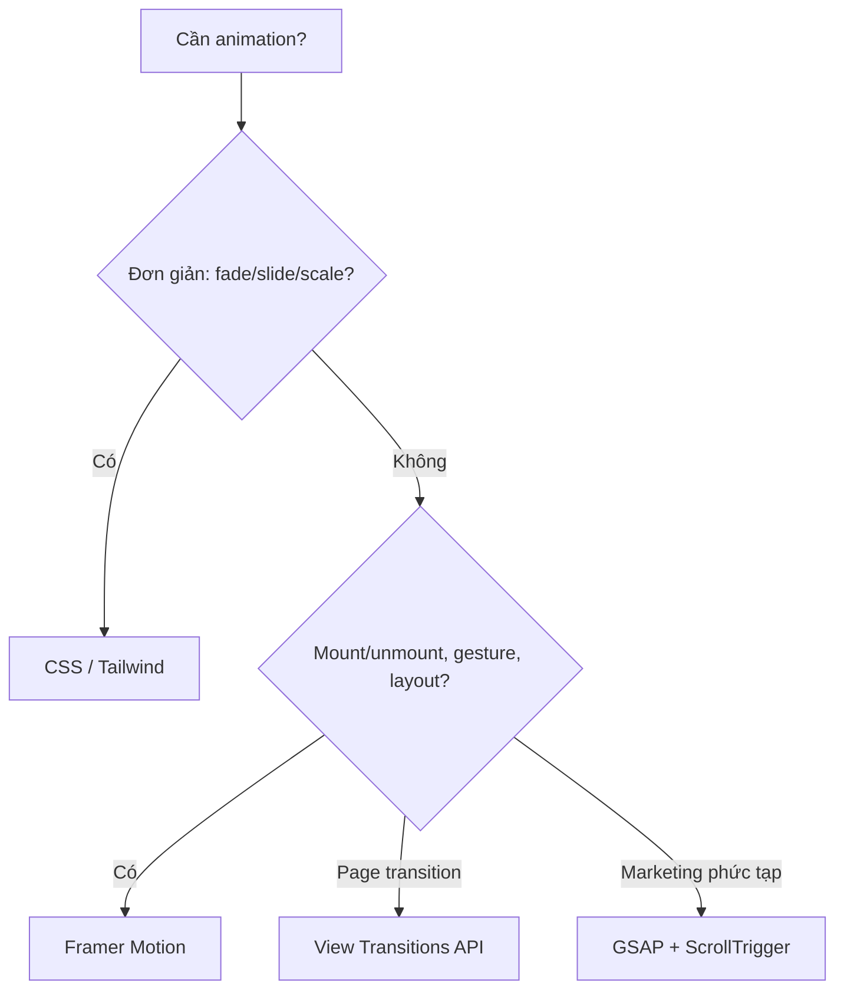
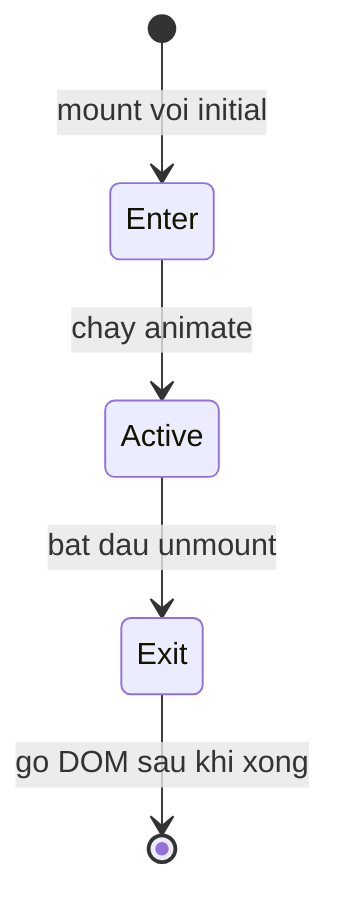

# Animation trong React

**Animation** (hoạt ảnh) là chuyển động mượt mà của các phần tử giao diện, ví dụ hiệu ứng xuất hiện, biến mất hay trượt qua lại, giúp trải nghiệm người dùng sinh động và dễ chịu hơn. Trong React, bạn có thể tạo hoạt ảnh bằng CSS thuần hoặc dùng các thư viện chuyên dụng. Bài này giới thiệu vài cách phổ biến như Framer Motion, React Spring và GSAP.

[](pathname:///img/react/animation.webp)

---

:::note[Ghi nhớ nhanh]

- ⭐ **Framer Motion (package `motion`) là lựa chọn mặc định 2026** — API khai báo gắn với state, `AnimatePresence` lo được exit animation khi component unmount (thứ CSS thuần khó làm).
- **CSS/Tailwind đáp ứng ~70% nhu cầu** (fade, slide, scale, hover) và chạy trên GPU — thử trước khi dùng library.
- **`React Spring`** hợp khi cần control spring physics chi tiết; **`GSAP` + ScrollTrigger** mạnh cho marketing/landing phức tạp.
- **View Transitions API** là web API native cho page transition (Chrome 111+, Safari 18+), integration React vẫn unstable.
- **Tôn trọng `prefers-reduced-motion`** — tắt bớt animation cho người dùng nhạy cảm chuyển động.

:::

---

## Mục lục

- [Vì sao dùng thư viện animation?](#vì-sao-dùng-thư-viện-animation)
- [CSS Animation thuần](#css-animation-thuần)
- [Framer Motion (khuyến nghị)](#framer-motion-khuyến-nghị)
- [React Spring](#react-spring)
- [GSAP](#gsap)
- [View Transitions API](#view-transitions-api)
- [Câu hỏi phỏng vấn](#câu-hỏi-phỏng-vấn)

---

## Vì sao dùng thư viện animation?

**Vấn đề:** Làm animation bằng CSS thuần khó phối hợp theo state của React. Khổ nhất là animate lúc component **mount/unmount** — React gỡ DOM ngay lập tức nên không có "exit animation". Chuỗi animation phức tạp, kéo-thả (drag), layout animation... nếu tự code bằng `requestAnimationFrame` thì rất cực và dễ giật.

```jsx
function Modal({ isOpen }) {
  // React unmount ngay → exit animation KHÔNG chạy
  if (!isOpen) return null;
  return <div className="modal fade-in">Nội dung</div>;
}

// Tự code spring/gesture bằng rAF: phải quản lý frame, velocity, cleanup...
useEffect(() => {
  let raf;
  const tick = () => {
    // tính toán từng frame thủ công, dễ sai và khó maintain
    raf = requestAnimationFrame(tick);
  };
  raf = requestAnimationFrame(tick);
  return () => cancelAnimationFrame(raf);
}, []);
```

**Giải pháp:** Thư viện animation (Framer Motion/Motion, React Spring, GSAP) cho API **khai báo** gắn thẳng với state/props, tự lo enter/exit (`AnimatePresence`), spring vật lý tự nhiên, gesture và layout animation — không cần đụng tới `requestAnimationFrame`.

```jsx
import { motion, AnimatePresence } from "motion/react";

function Modal({ isOpen }) {
  return (
    <AnimatePresence>
      {isOpen && (
        <motion.div
          initial={{ opacity: 0, y: 20 }}
          animate={{ opacity: 1, y: 0 }} // tự chạy khi mount
          exit={{ opacity: 0, y: 20 }}   // tự chạy trước khi unmount
        >
          Nội dung
        </motion.div>
      )}
    </AnimatePresence>
  );
}
```

Sơ đồ chọn công cụ animation phù hợp theo nhu cầu:



:::tip[Dùng thực tế]

- **Modal / danh sách item vào ra**: fade + slide khi thêm/xóa phần tử, có cả exit animation thay vì biến mất đột ngột.
- **Chuyển trang (page transition)**: hiệu ứng mượt giữa các route, shared element với `layoutId`.
- **Micro-interaction nút bấm**: scale nhẹ khi hover/tap để phản hồi cho người dùng.
- **Kéo-thả / gesture**: drag card, swipe to dismiss, kéo trong vùng giới hạn — xử lý sẵn velocity và ràng buộc.

:::

---

## CSS Animation thuần

Trước khi reach for library, hãy thử CSS:

```css
.fade-in {
  animation: fade 300ms ease-in;
}

@keyframes fade {
  from { opacity: 0; }
  to   { opacity: 1; }
}

.button {
  transition: transform 200ms;
}
.button:hover {
  transform: scale(1.05);
}
```

CSS transition + animation đáp ứng 70% nhu cầu:

- Hover state.
- Focus ring.
- Modal open/close.
- Skeleton loading.

**Tailwind animation** built-in:

```jsx
<div className="animate-pulse">Loading...</div>
<div className="animate-spin">Spinner</div>
<button className="transition-transform hover:scale-105">Click</button>
```

:::tip[Mẹo]

**Quy tắc dùng CSS**:

- Animation đơn giản (fade, slide, scale, rotate) → CSS.
- Transition giữa 2 state → CSS `transition`.
- Animation phức tạp (path, spring, gesture) → library.

CSS animation **chạy trên GPU** (composite), không block main thread →
performant hơn JS animation.

:::

---

## Framer Motion (khuyến nghị)

[Framer Motion](https://www.framer.com/motion/) — animation library
phổ biến nhất React.

```bash
npm install motion
```

(Đã rebrand từ `framer-motion` sang `motion` — npm package mới.)

```jsx
import { motion } from "motion/react";

function Card() {
  return (
    <motion.div
      initial={{ opacity: 0, y: 20 }}
      animate={{ opacity: 1, y: 0 }}
      transition={{ duration: 0.3 }}
    >
      Hello
    </motion.div>
  );
}
```

**Variants** — gom animation thành named state:

```jsx
const variants = {
  hidden: { opacity: 0, scale: 0.8 },
  visible: { opacity: 1, scale: 1 },
};

<motion.div
  variants={variants}
  initial="hidden"
  animate="visible"
  exit="hidden"
/>
```

**`AnimatePresence`** — animation khi component mount/unmount:

```jsx
import { motion, AnimatePresence } from "motion/react";

<AnimatePresence>
  {isOpen && (
    <motion.div
      key="modal"
      initial={{ opacity: 0 }}
      animate={{ opacity: 1 }}
      exit={{ opacity: 0 }}
    >
      Modal
    </motion.div>
  )}
</AnimatePresence>
```

`AnimatePresence` cho phép chạy đủ vòng đời enter → active → exit trước khi
React gỡ DOM:



**Gesture** — drag, hover, tap:

```jsx
<motion.div
  drag
  dragConstraints={{ left: 0, right: 300 }}
  whileHover={{ scale: 1.05 }}
  whileTap={{ scale: 0.95 }}
/>
```

**Layout animation** — tự animate khi layout thay đổi:

```jsx
<motion.div layout>
  {/* tự animate khi size/position đổi */}
</motion.div>
```

:::info[Phân tích]

**Tại sao Framer Motion thắng?**

- **Declarative API** — viết animation như prop, không phải callback.
- **Spring physics** built-in — animation tự nhiên (không cần config curve).
- **Layout animation** — animate giữa các state layout khác nhau (FLIP technique).
- **Gesture** + **scroll-linked animation** integrated.
- **TypeScript** support tốt.

Trade-off:

- Bundle ~30KB (gzipped).
- Learning curve khi đụng variants phức tạp.

Năm 2026, **default** cho animation React. Đặc biệt khi cần shared element
transition giữa 2 trang (`layoutId` prop).

:::

---

## React Spring

[React Spring](https://react-spring.dev) — spring physics-based, low-level.

```bash
npm install @react-spring/web
```

```jsx
import { useSpring, animated } from "@react-spring/web";

function Card() {
  const props = useSpring({
    from: { opacity: 0, y: 20 },
    to: { opacity: 1, y: 0 },
  });

  return <animated.div style={props}>Hello</animated.div>;
}
```

Phù hợp:

- Cần control chi tiết spring physics.
- Animation phức tạp (gesture + physics).
- React Native (có version `@react-spring/native`).

---

## GSAP

[GSAP](https://gsap.com) — animation library "kinh điển", powerful nhất.
Có React adapter:

```bash
npm install gsap @gsap/react
```

```jsx
import { useGSAP } from "@gsap/react";
import gsap from "gsap";

function Component() {
  const container = useRef(null);

  useGSAP(() => {
    gsap.to(".box", {
      x: 360,
      rotation: 360,
      duration: 1,
      stagger: 0.1,
    });
  }, { scope: container });

  return (
    <div ref={container}>
      <div className="box">A</div>
      <div className="box">B</div>
      <div className="box">C</div>
    </div>
  );
}
```

GSAP có **plugin ecosystem rộng**: ScrollTrigger, MorphSVG, DrawSVG,
SplitText... — phù hợp cho **marketing site, landing page, animation phức tạp**.

Trade-off: GSAP **không free** cho dùng thương mại với một số plugin
(Club GreenSock). Core thì free.

---

## View Transitions API

Web API mới (Chrome 111+, Safari 18+) — animation giữa 2 trạng thái DOM
**không cần library**:

```jsx
function navigate(url) {
  document.startViewTransition(() => {
    history.pushState({}, "", url);
    renderNewPage();
  });
}
```

CSS:

```css
::view-transition-old(root) {
  animation: fade-out 0.3s;
}
::view-transition-new(root) {
  animation: fade-in 0.3s;
}
```

React 19 + Next.js 15+ tích hợp View Transitions:

```jsx
import { unstable_ViewTransition as ViewTransition } from "react";

<ViewTransition>
  <div>{content}</div>
</ViewTransition>
```

:::info[Phân tích]

**View Transitions API là tương lai**:

- Browser native — không cần JS library.
- Cross-document (SPA + MPA).
- Performant — browser optimize.
- Shared element transition tự động.

Trade-off năm 2026:

- Browser support chưa đầy đủ (Safari có 18+).
- API mới — không phải mọi dev quen.
- React integration vẫn unstable.

Hiện tại: **Framer Motion** cho animation thực dụng, **View Transitions**
cho page transition khi browser support đủ. Tương lai gần (2027+) sẽ thay
một phần.

:::

:::tip[Mẹo]

**Quy tắc chọn animation tool 2026:**

```
Animation đơn giản (fade, slide, scale)?
└─ CSS / Tailwind animate-*

Mount/unmount animation, gesture, layout?
└─ Framer Motion (mặc định)

Page transition?
└─ View Transitions API (nếu browser support)
   hoặc Framer Motion + layoutId

Marketing site animation phức tạp?
└─ GSAP + ScrollTrigger

React Native?
└─ React Native Reanimated (separate ecosystem)

3D, canvas?
└─ React Three Fiber + drei
```

Đừng quá nhiều animation — UX tốt = nhẹ nhàng, có ý đồ. Reduce motion
respect:

```css
@media (prefers-reduced-motion: reduce) {
  * { animation: none !important; transition: none !important; }
}
```

Framer Motion có built-in `MotionConfig reducedMotion="user"`.

:::

---

## Câu hỏi phỏng vấn

Những câu thường gặp về chủ đề này. Tự trả lời trước, rồi bấm **Xem đáp án** để đối chiếu.

**1. Vì sao exit animation (khi component unmount) khó làm bằng CSS thuần trong React? `AnimatePresence` giải quyết bằng cách nào?**

<details className="qa">
<summary>Xem đáp án</summary>

Vì React **gỡ node khỏi DOM ngay lập tức** khi điều kiện render trở thành false. Node đã biến mất thì không còn gì để chạy animation:

```jsx
function Modal({ isOpen }) {
  if (!isOpen) return null;          // DOM mất ngay, exit animation không chạy
  return <div className="modal fade-in">Nội dung</div>;
}
```

Muốn tự làm bằng CSS thuần, bạn phải thêm state trung gian "đang đóng", nghe sự kiện `transitionend` hoặc đặt `setTimeout` đúng bằng thời lượng animation rồi mới thật sự unmount — rườm rà và dễ lệch.

**`AnimatePresence`** giải quyết bằng cách **giữ lại phần tử trong cây** sau khi điều kiện đã false: nó ghi nhận con vừa bị gỡ, chạy animation `exit`, đợi xong rồi mới cho React xoá DOM.

```jsx
<AnimatePresence>
  {isOpen && (
    <motion.div key="modal" initial={{ opacity: 0 }} animate={{ opacity: 1 }} exit={{ opacity: 0 }}>
      Modal
    </motion.div>
  )}
</AnimatePresence>
```

Vòng đời đầy đủ trở thành enter → active → exit → gỡ DOM.

</details>

**2. Khi nào nên dùng CSS/Tailwind transition thay vì cài hẳn một thư viện animation?**

<details className="qa">
<summary>Xem đáp án</summary>

Nguyên tắc: **thử CSS trước**, vì nó đáp ứng khoảng 70% nhu cầu thực tế mà không tốn KB nào và chạy trên GPU.

Dùng CSS/Tailwind khi:

- Chuyển đổi giữa **hai trạng thái**: hover, focus, active, mở/đóng đơn giản.
- Hiệu ứng cơ bản: fade, slide, scale, rotate.
- Loading: `animate-pulse`, `animate-spin`, skeleton.
- Micro-interaction: `transition-transform hover:scale-105`.

Chuyển sang thư viện khi gặp những thứ CSS làm rất cực:

- **Exit animation** lúc unmount.
- **Gesture**: drag, swipe, có velocity và ràng buộc.
- **Layout animation** — phần tử đổi vị trí/kích thước do layout thay đổi, hoặc shared element giữa hai màn hình.
- **Chuỗi phối hợp phức tạp**, stagger nhiều phần tử.
- **Spring vật lý** với khả năng ngắt giữa chừng.

Cái giá của thư viện là bundle (Framer Motion khoảng 30KB gzipped) và thời gian học. Nếu chỉ cần vài hiệu ứng fade, cài cả thư viện là không đáng.

</details>

**3. Thuộc tính CSS nào animate được trên GPU và thuộc tính nào bắt trình duyệt layout/paint lại? Vì sao nên ưu tiên `transform` và `opacity`?**

<details className="qa">
<summary>Xem đáp án</summary>

Pipeline vẽ của trình duyệt gồm ba bước: **Layout → Paint → Composite**. Thuộc tính bạn animate quyết định phải chạy lại từ bước nào.

| Nhóm | Thuộc tính | Chi phí |
|---|---|---|
| Composite (rẻ nhất) | `transform`, `opacity`, `filter` | Chạy trên compositor/GPU, không đụng main thread |
| Paint | `color`, `background-color`, `box-shadow`, `border-radius` | Vẽ lại pixel của layer |
| Layout (đắt nhất) | `width`, `height`, `top`, `left`, `margin`, `padding` | Tính lại vị trí của các phần tử, rồi paint và composite |

`transform` và `opacity` được ưu tiên vì chúng chỉ tác động ở bước composite: trình duyệt nâng phần tử lên một layer riêng rồi GPU biến đổi layer đó, **main thread gần như rảnh**. Nhờ vậy animation vẫn chạy 60fps ngay cả khi JavaScript đang bận.

Vì thế nên dùng `transform: translateX(...)` thay cho `left`, và `transform: scale(...)` thay cho đổi `width`/`height`. Có thể gợi ý trước bằng `will-change: transform`, nhưng đừng lạm dụng vì mỗi layer đều tốn bộ nhớ.

</details>

**4. Phân biệt CSS `transition` và `@keyframes` animation — mỗi loại hợp với tình huống nào?**

<details className="qa">
<summary>Xem đáp án</summary>

| | `transition` | `@keyframes` + `animation` |
|---|---|---|
| Số trạng thái | Hai: từ giá trị cũ sang giá trị mới | Nhiều mốc: `0%`, `50%`, `100%`... |
| Kích hoạt | Cần một thay đổi (hover, thêm class, đổi state) | Tự chạy khi phần tử xuất hiện |
| Lặp lại | Không | Có, `animation-iteration-count: infinite` |
| Điều khiển | Đơn giản | `delay`, `direction`, `fill-mode`, `play-state` |

```css
.button { transition: transform 200ms; }
.button:hover { transform: scale(1.05); }

.fade-in { animation: fade 300ms ease-in; }
@keyframes fade { from { opacity: 0; } to { opacity: 1; } }
```

Chọn **`transition`** cho tương tác hai trạng thái: hover, focus, mở/đóng, đổi theme. Đây là phần lớn nhu cầu giao diện.

Chọn **`@keyframes`** khi cần chạy tự động không chờ tương tác (fade-in lúc vào trang), khi lặp vô hạn (spinner, pulse, skeleton), hoặc khi chuyển động qua nhiều mốc (nảy, lắc, chạy theo đường phức tạp).

</details>

**5. Trong Framer Motion (package `motion`), giải thích vai trò của `initial`, `animate`, `exit` và `transition`.**

<details className="qa">
<summary>Xem đáp án</summary>

```jsx
<motion.div
  initial={{ opacity: 0, y: 20 }}   // trạng thái lúc vừa mount
  animate={{ opacity: 1, y: 0 }}    // trạng thái đích, tự chạy tới
  exit={{ opacity: 0, y: 20 }}      // trạng thái khi rời đi
  transition={{ duration: 0.3 }}    // cách di chuyển giữa các trạng thái
/>
```

- **`initial`** — giá trị ở khung hình đầu tiên. Đặt `initial={false}` để bỏ qua animation lần mount đầu (hữu ích khi không muốn cả trang "bay vào" lúc tải).
- **`animate`** — đích đến. Đây là prop gắn với state React: đổi giá trị trong `animate` là Motion tự chạy tới giá trị mới, **kể cả khi đang chạy dở** (ngắt mượt, giữ lại vận tốc).
- **`exit`** — chỉ có tác dụng khi phần tử nằm trong `AnimatePresence`, chạy trước khi DOM bị gỡ.
- **`transition`** — mô tả *cách đi*, không phải *đi đâu*: `duration`, `ease`, `delay`, hoặc `type: "spring"` với `stiffness`/`damping`. Có thể đặt riêng cho từng thuộc tính.

Đây chính là tinh thần **khai báo**: bạn mô tả trạng thái, thư viện lo phần chuyển động.

</details>

**6. `variants` mang lại lợi ích gì so với viết trực tiếp vào `animate`? `staggerChildren` hoạt động thế nào?**

<details className="qa">
<summary>Xem đáp án</summary>

`variants` gom các trạng thái animation thành **tên gọi** dùng lại được, và quan trọng hơn: tên đó **tự lan xuống các con**.

```jsx
const list = {
  hidden: { opacity: 0 },
  visible: { opacity: 1, transition: { staggerChildren: 0.1, delayChildren: 0.2 } },
};
const item = {
  hidden: { opacity: 0, y: 20 },
  visible: { opacity: 1, y: 0 },
};

<motion.ul variants={list} initial="hidden" animate="visible">
  {items.map(i => <motion.li key={i.id} variants={item} />)}
</motion.ul>
```

Lợi ích: JSX gọn, tách phần "mô tả animation" khỏi phần markup, dùng chung một bộ trạng thái cho nhiều component, và không phải truyền props animation qua từng tầng.

**`staggerChildren`** đặt trong `transition` của variant cha: thay vì cho tất cả con chạy cùng lúc, Motion **giãn thời điểm bắt đầu** của mỗi con ra một khoảng cố định (ở trên là 0,1s). Kết quả là hiệu ứng đổ lần lượt rất quen thuộc của menu và danh sách. Kèm theo có `delayChildren` (chờ trước khi bắt đầu chuỗi) và `staggerDirection: -1` để chạy ngược từ cuối lên.

</details>

**7. `AnimatePresence` yêu cầu gì ở phần tử con (`key`, vị trí đặt trong cây) để chạy đúng?**

<details className="qa">
<summary>Xem đáp án</summary>

Ba yêu cầu hay bị vi phạm nhất:

- **Mỗi con phải có `key` duy nhất và ổn định.** `AnimatePresence` nhận biết "ai vừa biến mất" bằng cách so sánh key giữa hai lần render. Không có key, hoặc dùng index, thì nó không nhận ra phần tử đã rời đi và `exit` không chạy.
- **Bản thân `AnimatePresence` phải luôn được mount**, nằm **bên ngoài** biểu thức điều kiện. Nếu nó cũng bị unmount cùng lúc thì chẳng còn ai giữ phần tử lại để chạy exit:

```jsx
// Sai
{isOpen && <AnimatePresence><motion.div exit={{ opacity: 0 }} /></AnimatePresence>}

// Đúng
<AnimatePresence>
  {isOpen && <motion.div key="modal" exit={{ opacity: 0 }} />}
</AnimatePresence>
```

- **Con trực tiếp phải là `motion` component có prop `exit`.** Nếu bọc thêm một component của bạn ở giữa, phải chuyển tiếp props xuống hoặc dùng `motion` ngay tại con trực tiếp.

Thêm một lưu ý: khi chuyển giữa hai phần tử khác nhau, hãy đổi `key` để Motion coi là "cái cũ đi, cái mới đến".

</details>

**8. Các chế độ `mode` của `AnimatePresence` (`wait`, `sync`, `popLayout`) khác nhau ra sao?**

<details className="qa">
<summary>Xem đáp án</summary>

| `mode` | Hành vi | Hợp với |
|---|---|---|
| `sync` (mặc định) | Phần tử vào và phần tử ra chạy **cùng lúc**, chồng lên nhau | Fade chéo, hầu hết trường hợp thông thường |
| `wait` | Chờ phần tử cũ chạy xong `exit` rồi mới mount phần tử mới | Chuyển tab, chuyển trang, chuyển slide — nơi không muốn hai nội dung cùng hiện |
| `popLayout` | Phần tử đang thoát bị **tách khỏi luồng layout** ngay lập tức, nên các phần tử còn lại lập tức dồn về vị trí mới (và tự animate nếu có prop `layout`) | Xoá item khỏi danh sách/lưới |

```jsx
<AnimatePresence mode="wait">
  <motion.div key={activeTab} initial={{ opacity: 0 }} animate={{ opacity: 1 }} exit={{ opacity: 0 }}>
    {content}
  </motion.div>
</AnimatePresence>
```

Lưu ý thực dụng:

- `mode="wait"` khiến tổng thời gian dài gấp đôi, nên hãy rút ngắn thời lượng để không thấy chậm.
- `popLayout` cần con có `position` phù hợp và thường đi kèm prop `layout` ở các item còn lại; đây là cách xử lý gọn nhất cho cảm giác "danh sách dồn lên" khi xoá dòng.

</details>

**9. Prop `layout` và `layoutId` làm được gì? Giải thích kỹ thuật FLIP đứng sau chúng.**

<details className="qa">
<summary>Xem đáp án</summary>

- **`layout`**: tự động animate khi vị trí hoặc kích thước của phần tử thay đổi do **layout** — sắp xếp lại danh sách, mở rộng accordion, đổi flex/grid. Bạn không khai báo giá trị đầu/cuối, thư viện tự đo.
- **`layoutId`**: hai phần tử ở hai nơi khác nhau mang **cùng một `layoutId`** sẽ được coi là "một vật thể"; khi cái này biến mất và cái kia xuất hiện, Motion animate mượt từ vị trí cũ sang vị trí mới — đây chính là **shared element transition** (ảnh nhỏ trong danh sách phóng to thành ảnh lớn ở trang chi tiết).

**FLIP** là bốn bước:

1. **F**irst — đo vị trí/kích thước trước khi thay đổi.
2. **L**ast — để DOM cập nhật, đo lại vị trí mới.
3. **I**nvert — áp một `transform` ngược lại để phần tử *trông như* vẫn đang ở chỗ cũ.
4. **P**lay — animate transform đó về 0.

Điểm hay của FLIP là toàn bộ chuyển động diễn ra bằng `transform` (chạy trên GPU), trong khi nếu animate trực tiếp `width`/`top` thì mỗi frame đều bắt trình duyệt layout lại và rất dễ rớt khung hình.

</details>

**10. So sánh animation theo `duration` + easing với animation theo spring physics. Khi nào spring cho cảm giác tự nhiên hơn?**

<details className="qa">
<summary>Xem đáp án</summary>

| | `duration` + easing | Spring physics |
|---|---|---|
| Tham số | `duration`, đường cong easing | `stiffness`, `damping`, `mass` (và vận tốc ban đầu) |
| Thời lượng | Cố định, biết trước | Phụ thuộc quãng đường và vận tốc |
| Khi bị ngắt giữa chừng | Nhảy hoặc phải khởi động lại | Tiếp tục mượt, **giữ nguyên vận tốc hiện tại** |
| Cảm giác | Chuẩn xác, có thể máy móc | Tự nhiên, có quán tính |

```jsx
<motion.div animate={{ x: 100 }} transition={{ type: "spring", stiffness: 300, damping: 30 }} />
```

**Spring tự nhiên hơn** trong các tình huống:

- **Gesture**: thả tay sau khi kéo, swipe để đóng — vật thể phải tiếp tục theo đà tay người dùng, đây là chỗ easing cố định luôn cho cảm giác "giả".
- **Người dùng đổi ý giữa chừng**: bấm mở rồi bấm đóng ngay, spring chuyển hướng mượt mà.
- **Chuyển động vật lý**: modal bật lên, phần tử dồn vị trí, kéo thả.

Còn easing cố định vẫn tốt cho fade, đổi màu, thanh tiến trình, và bất cứ chỗ nào cần đồng bộ chính xác về thời gian giữa nhiều phần tử.

</details>

**11. React Spring khác Framer Motion ở triết lý và API như thế nào? Khi nào bạn chọn React Spring?**

<details className="qa">
<summary>Xem đáp án</summary>

**Triết lý**: React Spring lấy **vật lý làm gốc** và ở tầng thấp hơn — bạn làm việc với các *giá trị động* rồi tự gắn vào style. Framer Motion ở tầng cao hơn, cho sẵn component `motion.*` với các prop khai báo và nhiều tính năng đóng gói (gesture, layout, presence).

```jsx
// React Spring: hook trả về giá trị, gắn vào animated component
const props = useSpring({ from: { opacity: 0, y: 20 }, to: { opacity: 1, y: 0 } });
return <animated.div style={props}>Hello</animated.div>;
```

Chọn **React Spring** khi:

- Cần **điều khiển chi tiết spring physics**, hoặc chạy nhiều giá trị theo chuỗi (`useChain`, `useTrail`, `useTransition`).
- Animate cả những thứ **không phải style DOM** — số đếm, giá trị truyền cho canvas/WebGL, thuộc tính của `react-three-fiber`.
- Làm **React Native** — có `@react-spring/native`, trong khi Framer Motion vốn gắn với web.
- Kết hợp sâu với thư viện gesture như `@use-gesture`.

Ngược lại, nếu cần `AnimatePresence`, `layoutId`, gesture sẵn có và muốn viết nhanh thì Framer Motion là mặc định hợp lý hơn cho năm 2026.

</details>

**12. GSAP mạnh ở điểm nào mà Framer Motion khó thay thế? Dùng GSAP trong React cần lưu ý gì về cleanup?**

<details className="qa">
<summary>Xem đáp án</summary>

Thế mạnh của GSAP:

- **Timeline** — dàn dựng chuỗi animation dài, phối nhiều phần tử theo mốc thời gian chính xác, tua/đảo/tạm dừng được. Đây là thứ Framer Motion không có tương đương.
- **Hệ plugin rộng**: ScrollTrigger (animation theo cuộn, pin, scrub), MorphSVG, DrawSVG, SplitText, MotionPath.
- **Xử lý SVG và canvas** rất mạnh, chạy được cả ngoài React.
- Vì vậy GSAP thống trị mảng **landing page, marketing site, storytelling theo cuộn**.

**Cleanup trong React** là điểm phải cẩn thận: GSAP thao tác trực tiếp lên DOM, không biết gì về vòng đời React. Component unmount mà tween còn sống thì nó vẫn cố sửa node đã bị gỡ — rò rỉ bộ nhớ và lỗi lạ. Strict Mode ở dev chạy effect hai lần còn khiến animation bị nhân đôi.

Giải pháp là dùng `useGSAP` của `@gsap/react`: nó chạy trong `gsap.context` với `scope`, tự **revert** mọi tween và ScrollTrigger tạo ra bên trong khi component unmount hoặc khi deps đổi.

```jsx
useGSAP(() => {
  gsap.to(".box", { x: 360, duration: 1, stagger: 0.1 });
}, { scope: container });
```

Nếu tự viết bằng `useEffect`, phải tự `kill()` tween và ScrollTrigger trong hàm cleanup.

</details>

**13. Vì sao không nên cập nhật giá trị animation vào `useState` mỗi frame? Cách làm đúng trong React là gì?**

<details className="qa">
<summary>Xem đáp án</summary>

Vì mỗi `setState` kéo theo một chu kỳ render đầy đủ: chạy lại hàm component, reconciliation, commit. Ở 60fps nghĩa là **60 lần render mỗi giây** cho một việc đáng lẽ chỉ là sửa một thuộc tính CSS. Cây con càng lớn thì càng chắc chắn rớt khung hình, và nó cũng chiếm main thread khiến những tương tác khác bị giật.

```jsx
// Sai
useEffect(() => {
  const tick = () => { setX(v => v + 1); requestAnimationFrame(tick); };
  requestAnimationFrame(tick);
}, []);
```

Cách đúng là để giá trị chuyển động **nằm ngoài chu trình render**:

- **CSS transition/animation** — trình duyệt lo, không đụng tới React.
- **Motion values của thư viện**: `useMotionValue`/`useSpring` của Motion, hay `animated.*` của React Spring, ghi thẳng vào style của DOM node mà **không gây re-render**.
- **`useRef` + sửa style trực tiếp** trong vòng `requestAnimationFrame` nếu tự làm, nhớ `cancelAnimationFrame` khi cleanup.

Chỉ đưa vào state những gì thật sự làm **cấu trúc UI** thay đổi (mở/đóng, đổi bước), chứ không phải từng giá trị trung gian của chuyển động.

</details>

**14. `prefers-reduced-motion` và `useReducedMotion` là gì? Vì sao đây là yêu cầu accessibility bắt buộc quan tâm?**

<details className="qa">
<summary>Xem đáp án</summary>

- **`prefers-reduced-motion`** là media query phản ánh **thiết lập của hệ điều hành** ("Giảm chuyển động" trên macOS/iOS/Windows/Android).
- **`useReducedMotion`** là hook của thư viện animation, trả về `true` khi người dùng đã bật thiết lập đó, để bạn rẽ nhánh trong JS.

```css
@media (prefers-reduced-motion: reduce) {
  * { animation: none !important; transition: none !important; }
}
```

Vì sao bắt buộc quan tâm: với người mắc rối loạn tiền đình, chứng đau nửa đầu hoặc nhạy cảm chuyển động, các hiệu ứng lớn — parallax, zoom mạnh, phần tử bay ngang màn hình, cuộn tự động — có thể gây **chóng mặt và buồn nôn thật sự**, không phải chuyện thẩm mỹ. Đây cũng là tiêu chí WCAG (2.3.3 Animation from Interactions), tức là yêu cầu pháp lý ở nhiều nơi.

Cách làm đúng không phải là **tắt sạch**, mà là **giảm**: bỏ chuyển động vị trí và scale lớn, giữ lại fade nhẹ hoặc đổi màu để người dùng vẫn hiểu có thay đổi xảy ra.

</details>

**15. `MotionConfig` với `reducedMotion="user"` làm gì cho toàn bộ cây component?**

<details className="qa">
<summary>Xem đáp án</summary>

`MotionConfig` là một provider đặt cấu hình mặc định cho **mọi `motion` component bên dưới** — không phải sửa từng chỗ.

```jsx
import { MotionConfig } from "motion/react";

<MotionConfig reducedMotion="user" transition={{ duration: 0.3 }}>
  <App />
</MotionConfig>
```

Với `reducedMotion="user"`, thư viện đọc `prefers-reduced-motion` của hệ thống; khi người dùng đã bật giảm chuyển động, nó **tự vô hiệu hoá các animation biến đổi vị trí và kích thước** (`x`, `y`, `scale`, `rotate`, layout animation) và cho phần tử nhảy thẳng tới giá trị đích, **nhưng vẫn giữ** các animation không gây chóng mặt như `opacity` và màu sắc.

Các giá trị khác: `"always"` (luôn giảm, hữu ích khi test) và `"never"` (mặc định, không quan tâm thiết lập).

Đây là cách rẻ nhất để đáp ứng yêu cầu accessibility ở quy mô toàn app: bọc một lần ở gốc, thay vì rải `useReducedMotion` khắp nơi. Vẫn nên dùng `useReducedMotion` cho các trường hợp cần xử lý riêng.

</details>

**16. View Transitions API là gì? Nó nằm ở tầng nào so với thư viện animation và hiện có hạn chế gì?**

<details className="qa">
<summary>Xem đáp án</summary>

Đây là **API gốc của trình duyệt** cho phép animate giữa hai trạng thái DOM. Trình duyệt chụp ảnh trạng thái cũ và mới, rồi cho bạn animate phần chuyển tiếp bằng CSS qua các pseudo-element:

```jsx
document.startViewTransition(() => {
  history.pushState({}, "", url);
  renderNewPage();
});
```

```css
::view-transition-old(root) { animation: fade-out 0.3s; }
::view-transition-new(root) { animation: fade-in 0.3s; }
```

**Tầng của nó thấp hơn thư viện**: nó nằm ở tầng trình duyệt, xử lý việc chuyển giữa hai *ảnh chụp* của trang, kể cả **cross-document** (điều hướng MPA thật sự) — điều mà JS library không làm được. Còn Framer Motion hoạt động ở tầng component, hiểu state React, gesture, spring.

Hạn chế năm 2026:

- **Hỗ trợ trình duyệt chưa đầy đủ** (Chrome 111+, Safari 18+), phải có fallback.
- **Tích hợp React vẫn unstable** — `unstable_ViewTransition` đúng như tên gọi.
- Ít kiểm soát giữa chừng: khó ngắt, khó phối theo gesture, khó đồng bộ với vật lý.

Thực dụng: Framer Motion cho animation trong ứng dụng, View Transitions cho chuyển trang khi trình duyệt hỗ trợ.

</details>

**17. Animation bị rớt FPS: chẩn đoán thế nào bằng Performance panel của DevTools và khắc phục theo hướng nào?**

<details className="qa">
<summary>Xem đáp án</summary>

**Chẩn đoán:**

1. Mở tab **Performance**, bật **CPU throttling** (4x hoặc 6x) để giống máy người dùng, rồi ghi lại trong lúc animation chạy.
2. Xem dải **Frames**: khung hình đỏ/dài là bị rớt. Ngân sách cho mỗi frame ở 60fps chỉ khoảng **16ms**.
3. Nhìn màu trong Main thread: **tím là Layout/Recalculate Style**, **xanh lá là Paint**, **vàng là Scripting**. Thấy nhiều khối tím lặp lại mỗi frame nghĩa là bạn đang animate thuộc tính gây layout.
4. Tìm **Long Task** — tác vụ JS trên 50ms chặn việc vẽ.
5. Trong tab **Rendering**, bật *Paint flashing* và *Layer borders* để xem vùng nào bị vẽ lại và phần tử có được tách layer không.

**Khắc phục:**

- Đổi sang animate `transform`/`opacity` thay vì `width`, `height`, `top`, `left`.
- Tránh **layout thrashing**: đọc rồi ghi DOM xen kẽ trong cùng một frame.
- Giảm số node cùng animate; virtualize danh sách dài.
- Bỏ `box-shadow`/`filter` nặng trên phần tử lớn đang chuyển động.
- Dùng `will-change` có chọn lọc để tách layer, và bỏ đi khi animation kết thúc.
- Chuyển tính toán nặng ra khỏi main thread hoặc dùng `useTransition` để nó không tranh chấp với animation.

</details>

**18. Thư viện animation làm tăng bundle — `LazyMotion` và component `m` của Motion giảm kích thước bằng cách nào?**

<details className="qa">
<summary>Xem đáp án</summary>

Component `motion` tiện vì nó **gói sẵn mọi tính năng** — animation, gesture, drag, layout, presence — nên chỉ cần import một chỗ là kéo theo toàn bộ.

Motion tách chuyện đó thành hai phần:

- **`m`** — phiên bản rút gọn của `motion`, chỉ chứa phần lõi, nhỏ hơn rất nhiều.
- **`LazyMotion`** — provider nạp gói tính năng, có thể nạp **động** khi cần.

```jsx
import { LazyMotion, domAnimation, m } from "motion/react";

<LazyMotion features={domAnimation}>
  <m.div animate={{ opacity: 1 }} />
</LazyMotion>

// Hoặc nạp bất đồng bộ, tách hẳn khỏi bundle ban đầu:
<LazyMotion features={() => import("./features").then(m => m.default)} strict>
```

`domAnimation` gồm animation và gesture cơ bản; `domMax` thêm drag và layout animation nhưng nặng hơn. Prop `strict` sẽ báo lỗi nếu bạn lỡ dùng `motion` thay vì `m`, giúp không vô tình kéo lại toàn bộ.

Kết quả: chỉ trả giá cho những tính năng thật sự dùng, và phần tính năng có thể nằm ở một chunk tải sau — rất đáng với trang cần LCP tốt.

</details>

**19. Animate danh sách thêm/xoá item cần lưu ý gì về `key` và về layout shift?**

<details className="qa">
<summary>Xem đáp án</summary>

**Về `key`:**

- Dùng **id ổn định từ dữ liệu**, tuyệt đối không dùng index. Với index, xoá item đầu sẽ khiến mọi item "đổi danh tính": `AnimatePresence` không nhận ra ai vừa rời đi, exit animation chạy nhầm phần tử, và trạng thái animation dính vào sai dòng.
- Key phải **duy nhất trong cả danh sách** và không đổi giữa các lần render.

**Về layout shift:**

- Khi một item bị xoá, các item còn lại nhảy vị trí ngay lập tức trong khi item cũ vẫn đang fade out — trông rất giật. Cách xử lý: `mode="popLayout"` để phần tử đang thoát rời khỏi luồng layout, kết hợp prop `layout` trên các item còn lại để chúng **trượt** tới vị trí mới thay vì nhảy.

```jsx
<AnimatePresence mode="popLayout">
  {items.map(item => (
    <motion.li key={item.id} layout initial={{ opacity: 0 }} animate={{ opacity: 1 }} exit={{ opacity: 0, scale: 0.9 }} />
  ))}
</AnimatePresence>
```

- Giữ **chiều cao ổn định** cho container hoặc đặt chiều cao tối thiểu để trang không co giãn — đây cũng là yếu tố ảnh hưởng trực tiếp tới chỉ số CLS.
- Danh sách rất dài thì cân nhắc giới hạn số item được animate, vì animate hàng trăm phần tử cùng lúc chắc chắn rớt FPS.

</details>
