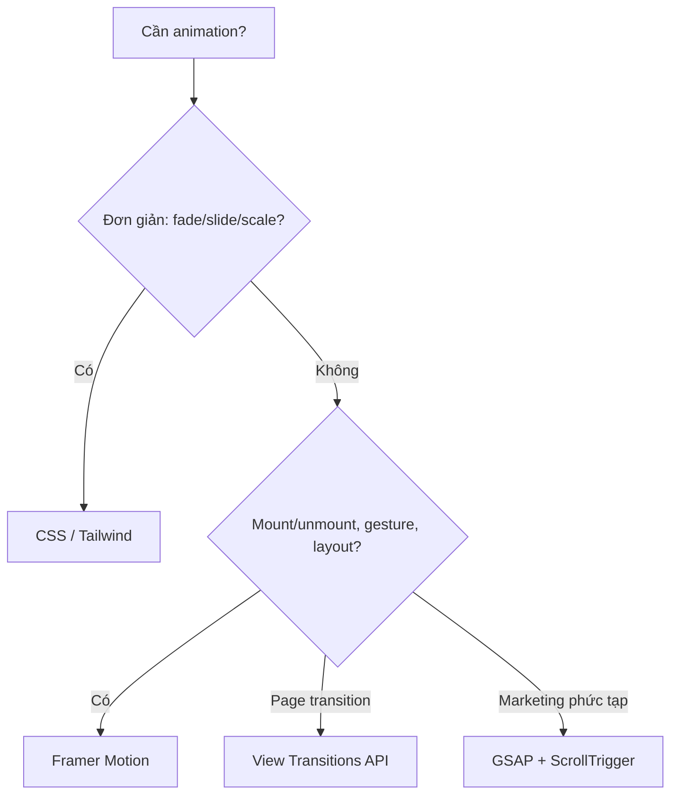
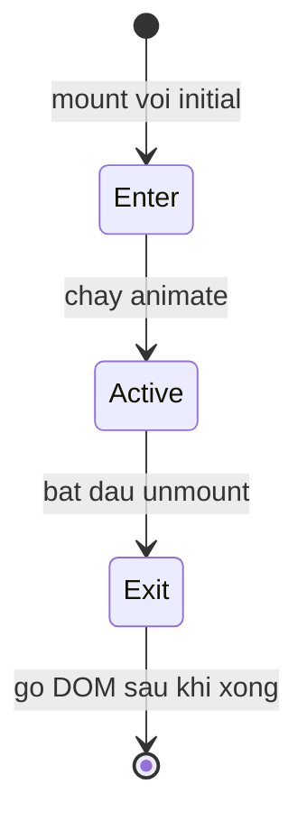

# Animation trong React

**Animation** (hoạt ảnh) là chuyển động mượt mà của các phần tử giao diện, ví dụ hiệu ứng xuất hiện, biến mất hay trượt qua lại, giúp trải nghiệm người dùng sinh động và dễ chịu hơn. Trong React, bạn có thể tạo hoạt ảnh bằng CSS thuần hoặc dùng các thư viện chuyên dụng. Bài này giới thiệu vài cách phổ biến như Framer Motion, React Spring và GSAP.

---

:::note[Ghi nhớ nhanh]

- ⭐ **Framer Motion (package `motion`) là lựa chọn mặc định 2026** — API khai báo gắn với state, `AnimatePresence` lo được exit animation khi component unmount (thứ CSS thuần khó làm).
- **CSS/Tailwind đáp ứng ~70% nhu cầu** (fade, slide, scale, hover) và chạy trên GPU — thử trước khi dùng library.
- **`React Spring`** hợp khi cần control spring physics chi tiết; **`GSAP` + ScrollTrigger** mạnh cho marketing/landing phức tạp.
- **View Transitions API** là web API native cho page transition (Chrome 111+, Safari 18+), integration React vẫn unstable.
- **Tôn trọng `prefers-reduced-motion`** — tắt bớt animation cho người dùng nhạy cảm chuyển động.

:::

---

## Mục lục

- [Vì sao dùng thư viện animation?](#vì-sao-dùng-thư-viện-animation)
- [CSS Animation thuần](#css-animation-thuần)
- [Framer Motion (khuyến nghị)](#framer-motion-khuyến-nghị)
- [React Spring](#react-spring)
- [GSAP](#gsap)
- [View Transitions API](#view-transitions-api)

---

## Vì sao dùng thư viện animation?

**Vấn đề:** Làm animation bằng CSS thuần khó phối hợp theo state của React. Khổ nhất là animate lúc component **mount/unmount** — React gỡ DOM ngay lập tức nên không có "exit animation". Chuỗi animation phức tạp, kéo-thả (drag), layout animation... nếu tự code bằng `requestAnimationFrame` thì rất cực và dễ giật.

```jsx
function Modal({ isOpen }) {
  // React unmount ngay → exit animation KHÔNG chạy
  if (!isOpen) return null;
  return <div className="modal fade-in">Nội dung</div>;
}

// Tự code spring/gesture bằng rAF: phải quản lý frame, velocity, cleanup...
useEffect(() => {
  let raf;
  const tick = () => {
    // tính toán từng frame thủ công, dễ sai và khó maintain
    raf = requestAnimationFrame(tick);
  };
  raf = requestAnimationFrame(tick);
  return () => cancelAnimationFrame(raf);
}, []);
```

**Giải pháp:** Thư viện animation (Framer Motion/Motion, React Spring, GSAP) cho API **khai báo** gắn thẳng với state/props, tự lo enter/exit (`AnimatePresence`), spring vật lý tự nhiên, gesture và layout animation — không cần đụng tới `requestAnimationFrame`.

```jsx
import { motion, AnimatePresence } from "motion/react";

function Modal({ isOpen }) {
  return (
    <AnimatePresence>
      {isOpen && (
        <motion.div
          initial={{ opacity: 0, y: 20 }}
          animate={{ opacity: 1, y: 0 }} // tự chạy khi mount
          exit={{ opacity: 0, y: 20 }}   // tự chạy trước khi unmount
        >
          Nội dung
        </motion.div>
      )}
    </AnimatePresence>
  );
}
```

Sơ đồ chọn công cụ animation phù hợp theo nhu cầu:



:::tip[Dùng thực tế]

- **Modal / danh sách item vào ra**: fade + slide khi thêm/xóa phần tử, có cả exit animation thay vì biến mất đột ngột.
- **Chuyển trang (page transition)**: hiệu ứng mượt giữa các route, shared element với `layoutId`.
- **Micro-interaction nút bấm**: scale nhẹ khi hover/tap để phản hồi cho người dùng.
- **Kéo-thả / gesture**: drag card, swipe to dismiss, kéo trong vùng giới hạn — xử lý sẵn velocity và ràng buộc.

:::

---

## CSS Animation thuần

Trước khi reach for library, hãy thử CSS:

```css
.fade-in {
  animation: fade 300ms ease-in;
}

@keyframes fade {
  from { opacity: 0; }
  to   { opacity: 1; }
}

.button {
  transition: transform 200ms;
}
.button:hover {
  transform: scale(1.05);
}
```

CSS transition + animation đáp ứng 70% nhu cầu:

- Hover state.
- Focus ring.
- Modal open/close.
- Skeleton loading.

**Tailwind animation** built-in:

```jsx
<div className="animate-pulse">Loading...</div>
<div className="animate-spin">Spinner</div>
<button className="transition-transform hover:scale-105">Click</button>
```

:::tip[Mẹo]

**Quy tắc dùng CSS**:

- Animation đơn giản (fade, slide, scale, rotate) → CSS.
- Transition giữa 2 state → CSS `transition`.
- Animation phức tạp (path, spring, gesture) → library.

CSS animation **chạy trên GPU** (composite), không block main thread →
performant hơn JS animation.

:::

---

## Framer Motion (khuyến nghị)

[Framer Motion](https://www.framer.com/motion/) — animation library
phổ biến nhất React.

```bash
npm install motion
```

(Đã rebrand từ `framer-motion` sang `motion` — npm package mới.)

```jsx
import { motion } from "motion/react";

function Card() {
  return (
    <motion.div
      initial={{ opacity: 0, y: 20 }}
      animate={{ opacity: 1, y: 0 }}
      transition={{ duration: 0.3 }}
    >
      Hello
    </motion.div>
  );
}
```

**Variants** — gom animation thành named state:

```jsx
const variants = {
  hidden: { opacity: 0, scale: 0.8 },
  visible: { opacity: 1, scale: 1 },
};

<motion.div
  variants={variants}
  initial="hidden"
  animate="visible"
  exit="hidden"
/>
```

**`AnimatePresence`** — animation khi component mount/unmount:

```jsx
import { motion, AnimatePresence } from "motion/react";

<AnimatePresence>
  {isOpen && (
    <motion.div
      key="modal"
      initial={{ opacity: 0 }}
      animate={{ opacity: 1 }}
      exit={{ opacity: 0 }}
    >
      Modal
    </motion.div>
  )}
</AnimatePresence>
```

`AnimatePresence` cho phép chạy đủ vòng đời enter → active → exit trước khi
React gỡ DOM:



**Gesture** — drag, hover, tap:

```jsx
<motion.div
  drag
  dragConstraints={{ left: 0, right: 300 }}
  whileHover={{ scale: 1.05 }}
  whileTap={{ scale: 0.95 }}
/>
```

**Layout animation** — tự animate khi layout thay đổi:

```jsx
<motion.div layout>
  {/* tự animate khi size/position đổi */}
</motion.div>
```

:::info[Phân tích]

**Tại sao Framer Motion thắng?**

- **Declarative API** — viết animation như prop, không phải callback.
- **Spring physics** built-in — animation tự nhiên (không cần config curve).
- **Layout animation** — animate giữa các state layout khác nhau (FLIP technique).
- **Gesture** + **scroll-linked animation** integrated.
- **TypeScript** support tốt.

Trade-off:

- Bundle ~30KB (gzipped).
- Learning curve khi đụng variants phức tạp.

Năm 2026, **default** cho animation React. Đặc biệt khi cần shared element
transition giữa 2 trang (`layoutId` prop).

:::

---

## React Spring

[React Spring](https://react-spring.dev) — spring physics-based, low-level.

```bash
npm install @react-spring/web
```

```jsx
import { useSpring, animated } from "@react-spring/web";

function Card() {
  const props = useSpring({
    from: { opacity: 0, y: 20 },
    to: { opacity: 1, y: 0 },
  });

  return <animated.div style={props}>Hello</animated.div>;
}
```

Phù hợp:

- Cần control chi tiết spring physics.
- Animation phức tạp (gesture + physics).
- React Native (có version `@react-spring/native`).

---

## GSAP

[GSAP](https://gsap.com) — animation library "kinh điển", powerful nhất.
Có React adapter:

```bash
npm install gsap @gsap/react
```

```jsx
import { useGSAP } from "@gsap/react";
import gsap from "gsap";

function Component() {
  const container = useRef(null);

  useGSAP(() => {
    gsap.to(".box", {
      x: 360,
      rotation: 360,
      duration: 1,
      stagger: 0.1,
    });
  }, { scope: container });

  return (
    <div ref={container}>
      <div className="box">A</div>
      <div className="box">B</div>
      <div className="box">C</div>
    </div>
  );
}
```

GSAP có **plugin ecosystem rộng**: ScrollTrigger, MorphSVG, DrawSVG,
SplitText... — phù hợp cho **marketing site, landing page, animation phức tạp**.

Trade-off: GSAP **không free** cho dùng thương mại với một số plugin
(Club GreenSock). Core thì free.

---

## View Transitions API

Web API mới (Chrome 111+, Safari 18+) — animation giữa 2 trạng thái DOM
**không cần library**:

```jsx
function navigate(url) {
  document.startViewTransition(() => {
    history.pushState({}, "", url);
    renderNewPage();
  });
}
```

CSS:

```css
::view-transition-old(root) {
  animation: fade-out 0.3s;
}
::view-transition-new(root) {
  animation: fade-in 0.3s;
}
```

React 19 + Next.js 15+ tích hợp View Transitions:

```jsx
import { unstable_ViewTransition as ViewTransition } from "react";

<ViewTransition>
  <div>{content}</div>
</ViewTransition>
```

:::info[Phân tích]

**View Transitions API là tương lai**:

- Browser native — không cần JS library.
- Cross-document (SPA + MPA).
- Performant — browser optimize.
- Shared element transition tự động.

Trade-off năm 2026:

- Browser support chưa đầy đủ (Safari có 18+).
- API mới — không phải mọi dev quen.
- React integration vẫn unstable.

Hiện tại: **Framer Motion** cho animation thực dụng, **View Transitions**
cho page transition khi browser support đủ. Tương lai gần (2027+) sẽ thay
một phần.

:::

:::tip[Mẹo]

**Quy tắc chọn animation tool 2026:**

```
Animation đơn giản (fade, slide, scale)?
└─ CSS / Tailwind animate-*

Mount/unmount animation, gesture, layout?
└─ Framer Motion (mặc định)

Page transition?
└─ View Transitions API (nếu browser support)
   hoặc Framer Motion + layoutId

Marketing site animation phức tạp?
└─ GSAP + ScrollTrigger

React Native?
└─ React Native Reanimated (separate ecosystem)

3D, canvas?
└─ React Three Fiber + drei
```

Đừng quá nhiều animation — UX tốt = nhẹ nhàng, có ý đồ. Reduce motion
respect:

```css
@media (prefers-reduced-motion: reduce) {
  * { animation: none !important; transition: none !important; }
}
```

Framer Motion có built-in `MotionConfig reducedMotion="user"`.

:::
