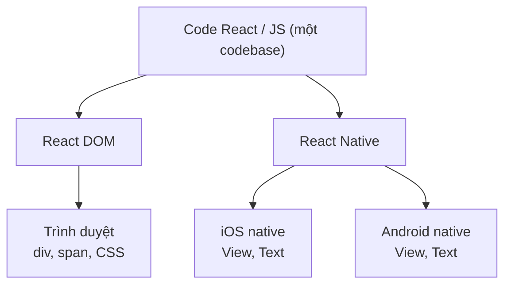
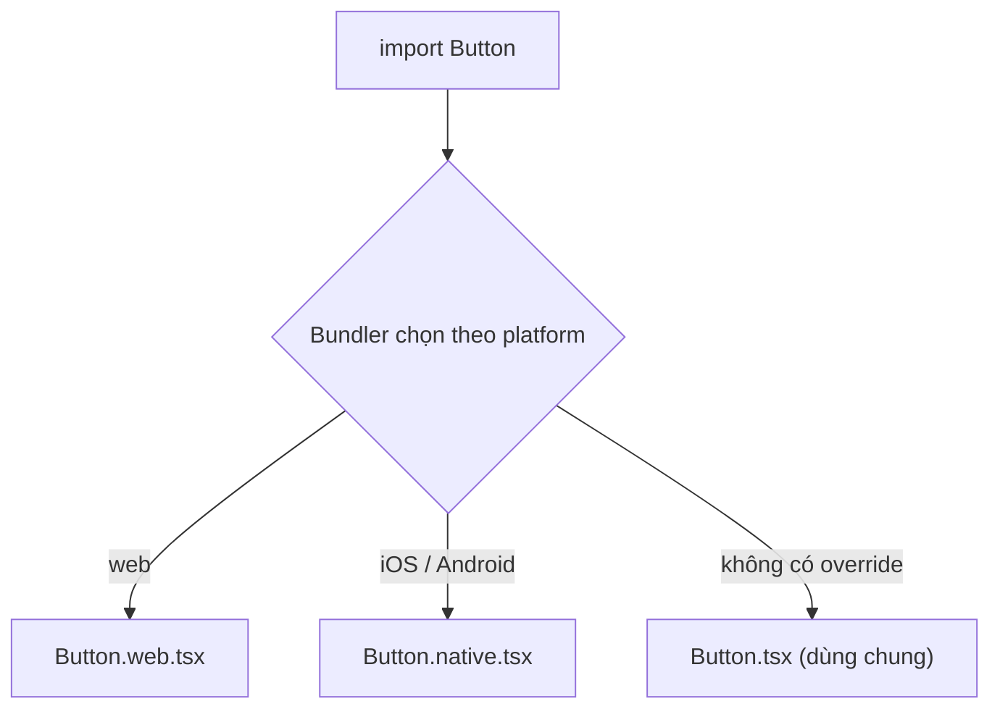

# Mobile Applications (React Native)

**React Native** là framework cho phép bạn dùng kiến thức React để xây dựng ứng dụng di động chạy thật trên cả iOS và Android, thay vì chỉ chạy trên trình duyệt. Nó dùng cùng cách viết component và hook như React web, nhưng kết xuất ra giao diện gốc (native) của điện thoại. Bài này giới thiệu cách bắt đầu với React Native, công cụ **Expo** (bộ công cụ giúp dựng app nhanh) và cách điều hướng màn hình.

[](pathname:///img/react/mobile.webp)

---

:::note[Ghi nhớ nhanh]

- ⭐ **React Native viết một lần bằng React/JS** — render ra UI native thật (không phải webview) cho cả iOS lẫn Android, tái dùng kiến thức React sẵn có.
- ⭐ **Expo là default 2026 (~90% project)** — dựng app cực nhanh, EAS Build cloud (không cần Mac), OTA update; Bare RN chỉ cần khi có native module rất custom.
- **Khác React web**: dùng `<View>`/`<Text>` thay `<div>`, `onPress` thay `onClick`, StyleSheet API hoặc NativeWind thay CSS, chỉ có Flexbox.
- **Navigation**: React Navigation (Stack/Tab/Drawer) hoặc Expo Router (file-based).
- **Reanimated chạy animation trên UI thread** (không block JS); lưu ý không phải mọi web library đều work trong RN, cần isolate logic dùng chung.

:::

---

## Mục lục

- [Vì sao có React Native?](#vì-sao-có-react-native)
- [React Native là gì?](#react-native-là-gì)
- [Expo (khuyến nghị)](#expo-khuyến-nghị)
- [Bare React Native](#bare-react-native)
- [Navigation](#navigation)
- [Animation: Reanimated](#animation-reanimated)
- [Styling](#styling)
- [Câu hỏi phỏng vấn](#câu-hỏi-phỏng-vấn)

---

## Vì sao có React Native?

**Vấn đề:** Làm app mobile native phải viết **riêng** cho từng nền tảng — iOS
bằng Swift, Android bằng Kotlin. Hai codebase, hai đội, tốn gấp đôi công sức và
chi phí maintain. Nhúng web view vào app thì trải nghiệm kém, cuộn giật, không
có "native feel".

```jsx
// iOS — Swift (codebase 1)
struct ContentView: View {
  var body: some View { Text("Hello") }
}

// Android — Kotlin (codebase 2)
@Composable
fun Content() { Text("Hello") }
```

**Giải pháp:** **React Native** — viết **một lần** bằng React/JS, render ra
**component native thật** (không phải webview) cho cả iOS lẫn Android. Chia sẻ
phần lớn code, dùng lại kiến thức React sẵn có. **Expo** giúp khởi tạo và build
dễ dàng. Đánh đổi: vài tính năng sâu (hardware-heavy) vẫn cần native module.

```jsx
// Một codebase — chạy cả iOS lẫn Android
import { View, Text } from "react-native";

function Content() {
  return (
    <View>
      <Text>Hello</Text>
    </View>
  );
}
```

Cùng một codebase React/JS được render ra nhiều nền tảng khác nhau:



:::tip[Dùng thực tế]

- **App cross-platform** — một đội build cho cả iOS + Android, tiết kiệm chi phí.
- **Đội web React chuyển sang mobile** — tái dùng kiến thức, không học lại từ đầu.
- **MVP mobile cần ra nhanh** — Expo dựng app và build trong ngày.
- **Chia sẻ logic giữa web và app** — hook, util, schema dùng chung một package.

:::

---

## React Native là gì?

**React Native (RN)** — framework dùng React để build mobile app **native**
cho iOS và Android. Code JS dùng React, render thành native UI thật
(không phải webview).

```jsx
import { View, Text, Button } from "react-native";

function App() {
  return (
    <View>
      <Text>Hello Mobile</Text>
      <Button title="Click" onPress={() => alert("Hi")} />
    </View>
  );
}
```

Khác React web:

| | React Web | React Native |
|--|-----------|--------------|
| Element | `<div>`, `<p>`, `<span>` | `<View>`, `<Text>` |
| Styling | CSS | StyleSheet API (camelCase) |
| Event | `onClick` | `onPress` |
| Layout | Flexbox + Grid | **Flexbox only** |
| Navigation | React Router | React Navigation |
| Animation | CSS / Framer | Reanimated |

---

## Expo (khuyến nghị)

[Expo](https://expo.dev) — framework + platform cho React Native, **default
2026**.

```bash
npx create-expo-app my-app
cd my-app
npx expo start
```

Expo cung cấp:

- **Expo Go app** — chạy trên điện thoại không cần build.
- **EAS Build** — build cloud iOS/Android không cần Mac.
- **OTA Updates** — push JS update không qua app store.
- **Module ecosystem**: camera, location, notifications, sensors...
- **File-based routing** (Expo Router v3+).
- **Web support** — chạy cùng code trên web qua React Native Web.

```
my-app/
├── app/                      # file-based router (Expo Router)
│   ├── _layout.tsx
│   ├── index.tsx             # /
│   └── profile/
│       └── [id].tsx          # /profile/:id
├── assets/
└── package.json
```

:::info[Phân tích]

**Expo vs Bare React Native:**

| | Expo | Bare RN |
|--|------|---------|
| Setup | Cực nhanh | Phức tạp (Xcode, Android Studio) |
| Native code custom | Hạn chế (config plugin) | Tự do |
| Build | Cloud (EAS) | Local |
| OTA Update | Built-in | Tự setup |
| Module ecosystem | **Rộng** | Manual install |
| Bundle size | Lớn hơn | Nhỏ hơn |

**Năm 2026, 90% RN project dùng Expo.** Expo đã giải quyết hầu hết
limitation cũ — có **prebuild** để eject thành bare khi cần, có
**config plugin** để inject native code.

Lý do còn dùng Bare:

- App có native module rất custom (Bluetooth low-level, hardware integration).
- Quan tâm bundle size cực kỳ.
- Team có native expertise.

Còn lại → Expo nhanh hơn nhiều, ít maintain.

:::

---

## Bare React Native

```bash
npx react-native@latest init MyApp
cd MyApp
npx react-native run-ios
npx react-native run-android
```

Yêu cầu:

- **macOS** + Xcode cho iOS.
- **Android Studio** + JDK cho Android.
- Setup CocoaPods, gradle phức tạp.

Phù hợp khi cần native code đặc biệt.

---

## Navigation

[React Navigation](https://reactnavigation.org) — chuẩn de-facto.

```bash
npx expo install @react-navigation/native @react-navigation/native-stack
```

```jsx
import { NavigationContainer } from "@react-navigation/native";
import { createNativeStackNavigator } from "@react-navigation/native-stack";

const Stack = createNativeStackNavigator();

function App() {
  return (
    <NavigationContainer>
      <Stack.Navigator>
        <Stack.Screen name="Home" component={Home} />
        <Stack.Screen name="Detail" component={Detail} />
      </Stack.Navigator>
    </NavigationContainer>
  );
}

function Home({ navigation }) {
  return (
    <Button
      title="Go to Detail"
      onPress={() => navigation.navigate("Detail", { id: 1 })}
    />
  );
}

function Detail({ route }) {
  return <Text>ID: {route.params.id}</Text>;
}
```

Navigator types:

- **Stack** — navigation kiểu push (default mobile).
- **Tab** — bottom tab bar.
- **Drawer** — side menu.

**Expo Router** — alternative file-based:

```
app/
├── index.tsx        # /
├── detail/[id].tsx  # /detail/:id
└── (tabs)/
    ├── _layout.tsx
    ├── home.tsx
    └── profile.tsx
```

```jsx
import { Link, useLocalSearchParams } from "expo-router";

function Home() {
  return <Link href="/detail/1">Go</Link>;
}

function Detail() {
  const { id } = useLocalSearchParams();
  return <Text>ID: {id}</Text>;
}
```

---

## Animation: Reanimated

[React Native Reanimated](https://docs.swmansion.com/react-native-reanimated/)
— animation chạy trên **UI thread**, không block JS thread.

```bash
npx expo install react-native-reanimated
```

```jsx
import Animated, { useSharedValue, withSpring } from "react-native-reanimated";

function Card() {
  const offset = useSharedValue(0);

  return (
    <>
      <Animated.View style={{ transform: [{ translateX: offset }] }}>
        <Text>Hello</Text>
      </Animated.View>
      <Button
        title="Move"
        onPress={() => { offset.value = withSpring(100); }}
      />
    </>
  );
}
```

**Worklet** — function chạy trên UI thread:

```jsx
import { useSharedValue, useAnimatedStyle } from "react-native-reanimated";

const animatedStyle = useAnimatedStyle(() => ({
  transform: [{ scale: scale.value }],
}));
```

Reanimated 3 hỗ trợ **shared element transition**, **gesture handler**,
**layout animation** — gần ngang Framer Motion về capability.

---

## Styling

**StyleSheet** — built-in:

```jsx
import { StyleSheet, View, Text } from "react-native";

function Card() {
  return (
    <View style={styles.card}>
      <Text style={styles.title}>Hello</Text>
    </View>
  );
}

const styles = StyleSheet.create({
  card: {
    padding: 16,
    backgroundColor: "white",
    borderRadius: 8,
    shadowOpacity: 0.1,
  },
  title: {
    fontSize: 18,
    fontWeight: "bold",
  },
});
```

**Tailwind cho RN** — [NativeWind](https://www.nativewind.dev):

```bash
npm install nativewind
```

```jsx
function Card() {
  return (
    <View className="p-4 bg-white rounded-lg shadow">
      <Text className="text-lg font-bold">Hello</Text>
    </View>
  );
}
```

NativeWind compile Tailwind class → StyleSheet runtime → cùng API như web.

:::tip[Mẹo]

**Stack chuẩn cho RN project 2026:**

- **Expo** (managed workflow).
- **Expo Router** cho navigation.
- **NativeWind** cho styling (Tailwind compat).
- **Zustand** cho state.
- **TanStack Query** cho data fetching.
- **React Native Reanimated** cho animation.
- **React Hook Form + Zod** cho form.
- **react-native-mmkv** cho local storage (nhanh hơn AsyncStorage).
- **Sentry** cho error tracking.

Phần lớn library web (Zustand, TanStack, RHF, Zod) đã compat với RN — code
share giữa web/mobile dễ hơn nhiều so với 5 năm trước.

:::

:::info[Phân tích]

**React Native năm 2026 — landscape:**

- **New Architecture** (Fabric + TurboModules) — đã default trong Expo SDK 51+.
  Performance tốt hơn, integration native dễ hơn.
- **React Native for Web** — chia sẻ code với web qua Expo Web.
- **Skia** (Shopify) — Canvas/2D rendering performant.
- **Tamagui** — UI library tối ưu cho RN + Web.
- **Solito** — share code Next.js + Expo monorepo.

**Khi nào chọn React Native vs Flutter vs Native?**

- **React Native**: team đã React web, cần share code, ecosystem npm.
- **Flutter**: muốn pixel-perfect UI giống nhau 100%, không quan tâm
  bundle nặng hơn.
- **Native (Swift/Kotlin)**: app cần performance cực cao, hardware-heavy
  (AR, game), không quan tâm chi phí maintain 2 codebase.

RN sweet spot: **app business** (banking, e-commerce, social, productivity).

:::

:::warning[Cần lưu ý]

**Không phải mọi web library work trong RN:**

- **`<a>`, `<div>`, `<button>`** → không tồn tại.
- **`window`, `document`, `localStorage`** → không có.
- **DOM-dependent library** → cần version RN riêng.
- **CSS animation** → cần Reanimated/Animated.
- **Fetch** → có, nhưng `Image` lazy loading khác.

Khi share code, isolate **platform-agnostic logic** (hook, util, schema)
vào package riêng. Component có platform-specific extension:

```
Button.tsx          # share
Button.web.tsx      # web override
Button.native.tsx   # mobile override
```

Bundler tự pick file đúng platform.



:::

---

## Câu hỏi phỏng vấn

Những câu thường gặp về chủ đề này. Tự trả lời trước, rồi bấm **Xem đáp án** để đối chiếu.

**1. React Native render giao diện bằng cách nào? Vì sao nói nó 'không phải webview'?**

<details className="qa">
<summary>Xem đáp án</summary>

Bạn vẫn viết component React như thường, nhưng thay vì trả về `div`/`span`, bạn dùng các **host component** của React Native như `View`, `Text`, `Image`. React Native ánh xạ chúng sang **widget native thật** của từng nền tảng:

| Component RN | iOS | Android |
|---|---|---|
| `View` | `UIView` | `ViewGroup` |
| `Text` | `UILabel` / text view | `TextView` |
| `Image` | `UIImageView` | `ImageView` |

Code JS chạy trong một JavaScript engine nhúng trong app (Hermes), mô tả cây UI; phía native dựng và cập nhật cây view tương ứng, đồng thời gửi sự kiện chạm ngược lên JS.

**Không phải webview** vì không có HTML, không có DOM, không có engine trình duyệt nào ở giữa. Bạn không thể dùng CSS hay `document`. Kết quả là app có đúng cảm giác native: cuộn, bàn phím, hiệu ứng chạm, cử chỉ quay lại đều là của hệ điều hành — khác hẳn giải pháp nhúng web (Cordova/Ionic kiểu cũ) vốn hay bị nhận ra ngay vì cuộn giật và tương tác "lệch chất".

</details>

**2. So sánh React Native, PWA và native thuần (Swift/Kotlin) theo hiệu năng, chi phí, khả năng truy cập API thiết bị và cách phân phối.**

<details className="qa">
<summary>Xem đáp án</summary>

| | React Native | PWA | Native (Swift/Kotlin) |
|---|---|---|---|
| Hiệu năng | Gần native; UI là view thật, phần nặng có thể đẩy xuống native | Thấp hơn, chạy trong trình duyệt | Cao nhất |
| Chi phí | Một codebase cho hai nền tảng | Rẻ nhất, dùng chung với web | Đắt nhất — hai codebase, hai đội |
| API thiết bị | Rộng: camera, vị trí, thông báo đẩy, sinh trắc học, Bluetooth (qua module) | Hạn chế, khác nhau theo trình duyệt; iOS giới hạn nhiều | Đầy đủ, có ngay khi OS ra tính năng mới |
| Phân phối | App Store / Google Play, kèm OTA cho phần JS | Chỉ cần URL, cập nhật tức thì, không qua duyệt | App Store / Google Play, mỗi lần đều phải duyệt |
| Hợp với | App nghiệp vụ: ngân hàng, thương mại điện tử, mạng xã hội, năng suất | Nội dung, công cụ nhẹ, tiếp cận nhanh | Game, AR, xử lý đồ hoạ/phần cứng nặng |

Nói ngắn: PWA rẻ nhưng bị giới hạn nền tảng; native mạnh nhất nhưng đắt; React Native là điểm cân bằng cho phần lớn app nghiệp vụ.

</details>

**3. Kiến thức React web tái sử dụng được bao nhiêu khi chuyển sang React Native? Liệt kê những khác biệt lớn nhất.**

<details className="qa">
<summary>Xem đáp án</summary>

**Tái dùng được gần như toàn bộ phần "tư duy React"**: component, props, state, mọi hook, Context, cách chia component, TypeScript, và phần lớn thư viện không phụ thuộc DOM — Zustand, TanStack Query, React Hook Form, Zod đều chạy tốt trong RN.

Khác biệt lớn nhất:

| | React Web | React Native |
|--|-----------|--------------|
| Element | `div`, `p`, `span` | `View`, `Text` |
| Styling | CSS | StyleSheet API (camelCase) |
| Event | `onClick` | `onPress` |
| Layout | Flexbox + Grid | **Chỉ Flexbox** |
| Navigation | React Router | React Navigation / Expo Router |
| Animation | CSS / Framer Motion | Reanimated |

Ngoài ra còn những thứ không thấy trong bảng nhưng tốn thời gian hơn cả: **không có `window`, `document`, `localStorage`**; quy trình build và phát hành qua app store; xử lý quyền, bàn phím, safe area, trạng thái nền; và việc phải kiểm thử trên cả hai nền tảng.

Ước lượng thực tế: kiến thức React dùng lại được, nhưng vẫn cần vài tuần để quen với nền tảng mobile.

</details>

**4. Vì sao React Native không có `div`, `span` hay CSS thuần? `View`, `Text` và `StyleSheet` thay thế thế nào?**

<details className="qa">
<summary>Xem đáp án</summary>

Vì `div`, `span` và CSS là khái niệm của **trình duyệt**, mà RN không có trình duyệt. Nó phải dùng những khái niệm mà iOS và Android đều hiểu.

- **`View`** thay cho `div` — khung chứa, ánh xạ sang `UIView`/`ViewGroup`.
- **`Text`** thay cho `p`/`span`. Khác biệt quan trọng: **mọi chuỗi ký tự bắt buộc nằm trong `Text`**, viết chữ trần trong `View` là lỗi, vì native cần một widget chuyên trách để vẽ chữ.
- **`StyleSheet.create`** thay CSS: style là **object JavaScript**, key viết camelCase (`backgroundColor`, `fontSize`), giá trị số không có đơn vị.

```jsx
const styles = StyleSheet.create({
  card: { padding: 16, backgroundColor: "white", borderRadius: 8 },
  title: { fontSize: 18, fontWeight: "bold" },
});
```

Điểm phải nhớ khi chuyển từ web sang:

- **Không có cascade và không kế thừa style** (trừ vài thuộc tính chữ giữa các `Text` lồng nhau) — mỗi component phải khai báo đủ.
- Không có selector, không pseudo-class (`:hover`), không media query — thay bằng `Dimensions`/`useWindowDimensions`.
- Chỉ hỗ trợ một tập con thuộc tính, và một số hoạt động khác nhau giữa iOS và Android (ví dụ đổ bóng).

</details>

**5. Layout trong React Native chỉ có Flexbox — khác gì Flexbox trên web (ví dụ giá trị mặc định của `flexDirection`)?**

<details className="qa">
<summary>Xem đáp án</summary>

RN dùng engine layout **Yoga**, cài đặt Flexbox nhưng đổi vài mặc định cho hợp với màn hình dọc của điện thoại:

| Thuộc tính | Web | React Native |
|---|---|---|
| `flexDirection` | `row` | **`column`** |
| `alignContent` | `stretch` | `flex-start` |
| `flexShrink` | `1` | **`0`** |
| `position` | `static` | `relative` |
| `display` | `block`, `grid`, `flex`... | chỉ `flex` và `none` |

Khác biệt hay gây bất ngờ nhất chính là `flexDirection: column` — trên web mọi người quen mặc định `row`.

Những điểm khác:

- **`flex: 1` trong RN** là dạng rút gọn nghĩa là "chiếm hết không gian còn lại", chứ không hoàn toàn giống shorthand `flex` của CSS.
- **Không có Grid**, không có `float`, không có `z-index` theo kiểu web (dùng `zIndex` trong giới hạn nhất định, thứ tự khai báo cũng ảnh hưởng trên Android).
- **Số là điểm không phụ thuộc mật độ màn hình** (dp/pt), không phải pixel; không viết `"16px"` mà viết `16`.
- Phần trăm hỗ trợ có giới hạn; `gap` đã được hỗ trợ ở các bản gần đây.

</details>

**6. Expo và Bare React Native khác nhau ở đâu? Khi nào bắt buộc phải rời khỏi Expo?**

<details className="qa">
<summary>Xem đáp án</summary>

| | Expo | Bare RN |
|--|------|---------|
| Khởi tạo | Cực nhanh (`npx create-expo-app`) | Phức tạp: Xcode, Android Studio, CocoaPods, Gradle |
| Native code tuỳ biến | Qua config plugin và prebuild | Sửa trực tiếp, tự do hoàn toàn |
| Build | Cloud (EAS) | Local |
| OTA update | Có sẵn | Tự dựng |
| Hệ module | **Rộng** — camera, vị trí, thông báo, cảm biến | Tự cài và link tay |
| Bundle size | Lớn hơn | Nhỏ hơn |

Năm 2026 khoảng **90% project RN dùng Expo**, vì nó đã gỡ gần hết các giới hạn cũ: có `prebuild` để sinh ra thư mục native, có config plugin để chèn cấu hình native, có development build để dùng module native tuỳ ý.

**Thật sự phải rời Expo** chỉ khi:

- Cần native module rất đặc thù mà không thể gói thành config plugin (tích hợp phần cứng sâu, Bluetooth mức thấp, SDK độc quyền).
- Cực kỳ quan tâm kích thước app, hoặc sáp nhập vào một app native đã tồn tại (brownfield).

Còn lại thì Expo nhanh hơn và ít bảo trì hơn nhiều.

</details>

**7. Expo prebuild, config plugin và development build là gì? Chúng làm ranh giới 'managed vs bare' thay đổi ra sao?**

<details className="qa">
<summary>Xem đáp án</summary>

- **Prebuild**: lệnh sinh ra thư mục `ios/` và `android/` **từ cấu hình** trong `app.json`/`app.config.js`. Ý tưởng là "continuous native generation" — coi code native là **kết quả build**, có thể xoá và sinh lại bất cứ lúc nào, thay vì là code bạn phải bảo trì tay.
- **Config plugin**: hàm JavaScript **sửa đổi project native trong lúc prebuild** — thêm quyền vào `Info.plist`/`AndroidManifest.xml`, chèn dependency, đổi cấu hình Gradle. Nhờ nó, một thư viện native vẫn cài được mà bạn không phải mở Xcode.
- **Development build**: bản "Expo Go của riêng bạn" — một app dev đã biên dịch kèm đúng những native module dự án cần, rồi vẫn nạp JS qua Metro như thường.

Ba thứ này **xoá nhoà ranh giới managed/bare**. Trước đây "eject" là con đường một chiều: đã ra là mất OTA, mất EAS, phải tự lo native mãi mãi. Giờ bạn dùng được native module tuỳ ý mà **vẫn giữ toàn bộ tiện ích của Expo**, và vẫn có thể sinh lại thư mục native từ cấu hình. Vì vậy cách nói đúng hơn hiện nay là "Expo có dùng prebuild hay không", chứ không còn là hai thế giới tách biệt.

</details>

**8. EAS Build giải quyết vấn đề gì? Vì sao nói 'không có máy Mac vẫn build được app iOS'?**

<details className="qa">
<summary>Xem đáp án</summary>

EAS Build là **dịch vụ build trên cloud** của Expo. Nó giải quyết những cơn đau kinh điển của khâu build mobile:

- Môi trường native khó cài và hay lệch giữa các máy (phiên bản Xcode, Gradle, JDK, CocoaPods).
- **Chứng chỉ và ký ứng dụng** — certificate, provisioning profile, keystore: EAS lưu trữ và quản lý hộ, không cần mỗi người một bản.
- Build lâu, chiếm máy dev; trên cloud thì chạy song song và tích hợp CI.
- Kèm **EAS Submit** để nộp thẳng lên App Store Connect và Google Play.

**Vì sao không cần Mac:** Apple bắt buộc biên dịch iOS trên macOS kèm Xcode. EAS có sẵn **đội máy macOS trên cloud** — bạn đẩy code lên, họ build và trả về file `.ipa`. Máy của bạn chỉ cần chạy được Node.

Vẫn còn hai thứ cần: **tài khoản Apple Developer** (99 USD/năm) để ký và phát hành, và một **thiết bị iOS thật hoặc trình giả lập** để kiểm thử — mà giả lập iOS thì lại cần macOS. Vì vậy chính xác hơn là "build được, nhưng test iOS đầy đủ vẫn cần thiết bị Apple".

</details>

**9. OTA update (EAS Update) cập nhật được những gì và không cập nhật được gì? Ràng buộc từ App Store và Google Play là gì?**

<details className="qa">
<summary>Xem đáp án</summary>

**Cập nhật được** (không cần qua store): toàn bộ **bundle JavaScript** và **asset đi kèm** — logic, giao diện, văn bản, ảnh, sửa lỗi, đổi màn hình, bật/tắt tính năng.

**Không cập nhật được**:

- Bất cứ thứ gì thuộc **code native**: thêm/nâng cấp native module, đổi Expo SDK, đổi React Native.
- Cấu hình native: **quyền** (camera, vị trí), icon, splash screen, tên app, deep link scheme, phiên bản hiển thị trong store.

Cơ chế bảo vệ là **`runtimeVersion`**: bản cập nhật chỉ được phát cho những bản build có runtime tương thích. Đổi phần native là phải tăng runtime version và phát hành binary mới.

**Ràng buộc từ store**: Apple cho phép cập nhật code thông dịch (JavaScript) miễn là **không thay đổi mục đích chính của ứng dụng** so với bản đã duyệt; Google Play cũng có quy định tương tự. Nghĩa là OTA dùng để sửa lỗi và cải tiến, **không phải để né quy trình duyệt** cho một tính năng hoàn toàn khác.

Thực hành tốt: phát dần theo tỷ lệ, có sẵn đường lùi về bản trước, và theo dõi lỗi sau mỗi lần phát.

</details>

**10. New Architecture (Fabric, TurboModules, JSI, Codegen) khắc phục hạn chế nào của kiến trúc Bridge cũ?**

<details className="qa">
<summary>Xem đáp án</summary>

| Thành phần | Vai trò | Khắc phục điều gì |
|---|---|---|
| **JSI** (JavaScript Interface) | Lớp C++ cho JS giữ tham chiếu và **gọi thẳng** đối tượng native | Bỏ khâu tuần tự hoá JSON và hàng đợi bất đồng bộ của Bridge |
| **Fabric** | Bộ render UI mới | Cho phép layout đồng bộ, hỗ trợ tính năng concurrent của React, giảm độ trễ khi cập nhật UI |
| **TurboModules** | Cách mới để khai báo module native | Nạp **lười** — module chỉ khởi tạo khi dùng, giúp app mở nhanh hơn |
| **Codegen** | Sinh mã ràng buộc từ khai báo TypeScript | Kiểu an toàn giữa JS và native |

Hạn chế của Bridge cũ: mọi trao đổi JS ↔ native đều phải **đóng gói thành JSON, gom theo lô, chạy bất đồng bộ** — nghẽn khi có nhiều sự kiện liên tục (cuộn, cử chỉ), không gọi đồng bộ được, và mọi module native đều phải khởi tạo lúc mở app.

New Architecture đã là mặc định từ Expo SDK 51+. Phần lớn thay đổi diễn ra bên dưới, nên điều cần quan tâm là **kiểm tra thư viện đã hỗ trợ New Architecture chưa** trước khi nâng cấp.

</details>

**11. Vì sao Bridge cũ gây nghẽn hiệu năng? JSI khác Bridge ở điểm cốt lõi nào?**

<details className="qa">
<summary>Xem đáp án</summary>

Bridge là một **hàng đợi thông điệp bất đồng bộ**: JS và native không gọi trực tiếp nhau mà gửi thông điệp đã **tuần tự hoá thành JSON**, gom theo lô rồi xử lý.

Hệ quả:

- **Chi phí tuần tự hoá** ở cả hai đầu cho mỗi lần trao đổi — tốn CPU vô ích.
- **Nghẽn cổ chai** khi lưu lượng lớn: cử chỉ và cuộn phát sinh hàng chục sự kiện mỗi giây, hàng đợi đầy thì animation giật.
- **Không gọi đồng bộ được**: JS không thể hỏi "chiều cao của view này là bao nhiêu" và nhận đáp án ngay, nên luôn trễ ít nhất một khung hình.
- **Khởi động chậm** vì mọi native module phải được đăng ký từ đầu.

**JSI** thay đổi điều cốt lõi: nó là một **lớp giao tiếp C++** cho phép JS **giữ tham chiếu trực tiếp tới đối tượng native** (HostObject) và gọi phương thức của chúng **đồng bộ, không qua JSON**. Về bản chất, hai bên chia sẻ cùng một vùng bộ nhớ thay vì nhắn tin cho nhau.

Đây cũng là nền tảng cho Reanimated chạy worklet trên UI thread và cho việc gắn các engine JS khác nhau (Hermes, JSC).

</details>

**12. React Navigation và Expo Router khác nhau ra sao? Ưu và nhược của điều hướng kiểu file-based?**

<details className="qa">
<summary>Xem đáp án</summary>

**React Navigation** khai báo bằng cấu hình: bạn tự tạo navigator và liệt kê từng màn hình.

```jsx
<Stack.Navigator>
  <Stack.Screen name="Home" component={Home} />
  <Stack.Screen name="Detail" component={Detail} />
</Stack.Navigator>
```

**Expo Router** được **xây trên chính React Navigation**, nhưng lấy **cấu trúc thư mục** làm định nghĩa route — giống Next.js App Router:

```
app/
├── index.tsx        # /
├── detail/[id].tsx  # /detail/:id
└── (tabs)/_layout.tsx
```

Ưu của file-based:

- **Deep linking và URL có sẵn** cho mọi màn hình, không phải cấu hình thủ công — rất quan trọng cho thông báo đẩy và chia sẻ link.
- **Quy ước rõ ràng**, nhìn cây thư mục là biết cấu trúc app.
- **Dùng chung với web** qua React Native Web, cùng một khái niệm route.
- Màn hình được nạp theo nhu cầu, tốt cho thời gian khởi động.

Nhược:

- **Nhiều quy ước ngầm**: `_layout`, nhóm `(tabs)`, route động — phải học và dễ nhầm.
- Route sinh động hoàn toàn từ dữ liệu thì gượng hơn.
- Ràng buộc vào hệ Expo, và di chuyển từ dự án React Navigation cũ tốn công.

Dự án mới dùng Expo thì Expo Router là lựa chọn mặc định hợp lý.

</details>

**13. Phân biệt Stack, Tab và Drawer navigator. Deep linking hoạt động thế nào trong React Native?**

<details className="qa">
<summary>Xem đáp án</summary>

| Navigator | Mô hình | Dùng cho |
|---|---|---|
| **Stack** | Chồng màn hình, đẩy vào/lấy ra, có nút quay lại và cử chỉ vuốt | Luồng đi sâu: danh sách → chi tiết → chỉnh sửa |
| **Tab** | Thanh tab dưới đáy, mỗi tab giữ trạng thái riêng | Các khu vực chính ngang hàng: Trang chủ, Tìm kiếm, Hồ sơ |
| **Drawer** | Ngăn kéo trượt từ cạnh | Menu phụ, nhiều mục ít dùng; phổ biến hơn trên Android |

Thực tế thường lồng nhau: Tab ở ngoài, mỗi tab một Stack riêng.

**Deep linking** cho phép mở thẳng một màn hình cụ thể từ bên ngoài app. Có hai loại:

- **Custom URL scheme**: `myapp://detail/1` — dễ làm, nhưng chỉ chạy khi app đã cài.
- **Universal Links (iOS) / App Links (Android)**: dùng `https://` thật, xác minh tên miền bằng file cấu hình trên server; link vẫn mở được web nếu chưa cài app.

Phía React Navigation, bạn khai báo `linking` để ánh xạ đường dẫn sang màn hình và tham số; với **Expo Router** thì việc này **tự động** vì cấu trúc thư mục đã chính là đường dẫn. Deep linking cũng là nền cho điều hướng từ thông báo đẩy.

</details>

**14. Vì sao `Animated` API mặc định có thể giật còn Reanimated thì mượt? Giải thích khái niệm UI thread và worklet.**

<details className="qa">
<summary>Xem đáp án</summary>

App React Native có (ít nhất) hai luồng quan trọng:

- **JS thread** — chạy code React của bạn: render, xử lý logic, gọi API.
- **UI thread** (main thread) — luồng native chịu trách nhiệm vẽ khung hình và nhận thao tác chạm.

`Animated` mặc định tính giá trị **trên JS thread** rồi gửi sang native mỗi khung hình. Khi JS thread bận — đang render danh sách lớn, parse JSON, chạy logic nặng — nó không kịp gửi giá trị, và animation **rớt khung hình ngay lập tức**, dù UI thread đang rảnh.

**Reanimated** đảo ngược điều đó bằng **worklet**: những hàm JavaScript nhỏ được đánh dấu để **chạy thẳng trên UI thread** (nhờ JSI và một runtime JS riêng). Giá trị chuyển động nằm trong `useSharedValue` — vùng nhớ mà cả hai luồng cùng đọc được:

```jsx
const offset = useSharedValue(0);
const animatedStyle = useAnimatedStyle(() => ({
  transform: [{ translateX: offset.value }],   // worklet, chạy trên UI thread
}));
```

Kết quả: animation và cử chỉ vẫn mượt **kể cả khi JS thread bị kẹt hoàn toàn** — điều quan trọng nhất với các tương tác kéo, vuốt, cuộn.

</details>

**15. `useNativeDriver` là gì và vì sao không áp dụng được cho mọi thuộc tính?**

<details className="qa">
<summary>Xem đáp án</summary>

`useNativeDriver: true` bảo `Animated` **gửi toàn bộ mô tả animation sang native một lần duy nhất** lúc bắt đầu, rồi để native tự tính từng khung hình:

```jsx
Animated.timing(opacity, {
  toValue: 1,
  duration: 300,
  useNativeDriver: true,
}).start();
```

Nhờ vậy animation không phụ thuộc JS thread nữa, mượt hơn hẳn.

**Vì sao không áp dụng được cho mọi thuộc tính:** native chỉ tự xử lý được những thuộc tính **không làm thay đổi layout** — `opacity` và nhóm `transform` (`translateX/Y`, `scale`, `rotate`). Đổi `width`, `height`, `top`, `left`, `margin`, `padding`... buộc phải chạy lại engine layout (Yoga) và tính lại vị trí của các phần tử khác, việc này nằm ngoài phạm vi mà driver native xử lý độc lập được. Màu sắc cũng không nằm trong nhóm hỗ trợ cơ bản.

Do đó: muốn dùng native driver thì **thiết kế animation quanh `transform` và `opacity`** — đúng nguyên tắc như bên web. Nếu bắt buộc phải animate layout, hãy cân nhắc Reanimated với layout animation thay vì `Animated` thuần.

</details>

**16. `FlatList` khác `ScrollView` ở đâu? Những prop nào ảnh hưởng lớn tới hiệu năng danh sách dài?**

<details className="qa">
<summary>Xem đáp án</summary>

**`ScrollView` render toàn bộ con ngay lập tức** — 1000 item là 1000 cây view tồn tại trong bộ nhớ. Tốt cho nội dung ngắn và biết trước.

**`FlatList` ảo hoá**: chỉ dựng những item trong vùng nhìn thấy cộng một vùng đệm, và **tháo bỏ** item đã cuộn qua xa. Đó là lựa chọn bắt buộc cho danh sách dài hoặc không biết trước độ dài.

Các prop ảnh hưởng nhiều tới hiệu năng:

- **`keyExtractor`** — id ổn định, đừng dùng index.
- **`getItemLayout`** — nếu mọi dòng cao bằng nhau, khai báo sẵn để RN khỏi phải đo; cải thiện rất rõ và cho phép nhảy tới vị trí bất kỳ.
- **`initialNumToRender`** — số item dựng ở khung hình đầu, ảnh hưởng trực tiếp tới tốc độ mở màn hình.
- **`maxToRenderPerBatch`** và **`windowSize`** — đánh đổi giữa mượt khi cuộn nhanh và lượng bộ nhớ.
- **`removeClippedSubviews`** — gỡ bớt view ngoài màn hình (hữu ích trên Android).
- **`onEndReached`** + `onEndReachedThreshold` cho phân trang.

Ngoài ra: bọc `renderItem` bằng `React.memo`, tránh hàm inline, giữ mỗi dòng đơn giản. Với danh sách rất lớn, nhiều đội chuyển sang **FlashList** của Shopify.

</details>

**17. `StyleSheet.create` và NativeWind khác nhau thế nào? NativeWind hoạt động ra sao ở bên dưới?**

<details className="qa">
<summary>Xem đáp án</summary>

**`StyleSheet.create`** là API sẵn có: style là object JS, tách khỏi JSX, tên thuộc tính camelCase.

```jsx
<View style={styles.card}><Text style={styles.title}>Hello</Text></View>
```

**NativeWind** cho phép viết **class Tailwind** ngay trên component RN:

```jsx
<View className="p-4 bg-white rounded-lg shadow">
  <Text className="text-lg font-bold">Hello</Text>
</View>
```

**Bên dưới nó làm gì:** NativeWind **không** chạy CSS. Một plugin Babel/Metro đọc các class Tailwind trong mã nguồn, dùng chính bộ máy Tailwind để tính ra giá trị, rồi **chuyển thành style object của React Native** và truyền vào prop `style`. Phần biến thể phụ thuộc trạng thái (dark mode, kích thước màn hình, `active:`) được xử lý ở runtime nhẹ.

Đánh đổi:

- **Ưu**: dùng chung ngôn ngữ style với web, chia sẻ design token và cấu hình `tailwind.config`, viết nhanh, ít file style rời rạc.
- **Nhược**: thêm một lớp công cụ có thể trục trặc khi nâng cấp; không phải class Tailwind nào cũng có tương đương trong RN (những gì RN không hỗ trợ thì cũng không có).

</details>

**18. Chia sẻ code giữa web và mobile: cơ chế `.web.tsx` / `.native.tsx` hoạt động ra sao và nên tách logic khỏi UI theo nguyên tắc nào?**

<details className="qa">
<summary>Xem đáp án</summary>

Bundler (Metro cho RN, webpack/Vite cấu hình cho web) phân giải module theo **đuôi mở rộng ưu tiên theo nền tảng**. Bạn `import Button from "./Button"` và nó tự chọn file phù hợp:

```
Button.tsx          # dùng chung
Button.web.tsx      # bản cho web
Button.native.tsx   # bản cho mobile
Button.ios.tsx      # riêng iOS nếu cần
```

Không có file riêng cho nền tảng thì dùng `Button.tsx`. Với khác biệt nhỏ trong cùng một file, dùng `Platform.OS` hoặc `Platform.select`.

**Nguyên tắc tách:** kéo mọi thứ **không phụ thuộc nền tảng** ra khỏi component UI và đặt vào package dùng chung:

- Hook nghiệp vụ, hàm tiện ích, hằng số.
- Schema Zod, kiểu dữ liệu TypeScript.
- Client gọi API, store trạng thái (Zustand, TanStack Query).

Phần **UI thì viết riêng cho từng nền tảng** — đừng cố ép một component chạy cả hai chỗ bằng hàng loạt `if (Platform.OS === ...)`, vì UX mobile và web vốn khác nhau (điều hướng, kích thước chạm, bàn phím).

Nguyên tắc kiểm chứng: file dùng chung **không được import** `react-native` lẫn `react-dom`.

</details>

**19. Vì sao không phải package npm nào cũng chạy được trong React Native? Kiểm tra thế nào trước khi cài?**

<details className="qa">
<summary>Xem đáp án</summary>

Hai lý do chính:

- **Phụ thuộc vào API không tồn tại**: thư viện đụng tới `window`, `document`, `localStorage`, DOM, hoặc các module lõi của Node (`fs`, `path`, `crypto`) — RN không có những thứ này.
- **Cần code native**: nhiều thư viện mobile đi kèm module native, phải được liên kết vào project và thường phải chạy prebuild hoặc dev build, không chỉ `npm install` là xong.

Cách kiểm tra trước khi cài:

- Tra trên **React Native Directory** (`reactnative.directory`) — có lọc theo nền tảng, hỗ trợ Expo, và **New Architecture**.
- Xem tài liệu Expo: thư viện có trong danh sách hỗ trợ không, có config plugin không, ưu tiên `npx expo install` để lấy đúng phiên bản khớp SDK.
- Đọc `package.json` của thư viện: có `react-native` trong `peerDependencies` không, có thư mục `ios/`/`android/` không (dấu hiệu có native code).
- Kiểm tra mức độ bảo trì: commit gần đây, issue tồn đọng, đã hỗ trợ New Architecture chưa.
- Ưu tiên bản dành riêng cho RN khi có (ví dụ lưu trữ cục bộ dùng `react-native-mmkv` hoặc AsyncStorage thay vì `localStorage`).

</details>

**20. Debug React Native bằng những công cụ nào? Hermes engine mang lại lợi ích gì cho thời gian khởi động và bộ nhớ?**

<details className="qa">
<summary>Xem đáp án</summary>

**Công cụ debug:**

- **React Native DevTools** — bộ debugger chính thức hiện nay, dựa trên Chrome DevTools: đặt breakpoint, xem console, network, profiler bộ nhớ.
- **React DevTools** — xem cây component, props/state, đo render.
- **Dev menu trong app** — reload, Fast Refresh, bật performance monitor để xem FPS của JS thread và UI thread.
- **Log native**: Xcode Console cho iOS, `adb logcat`/Logcat của Android Studio — bắt buộc khi app crash ở tầng native.
- **Expo Dev Tools** cho project Expo, **Reactotron** cho việc theo dõi state và API.
- **Sentry** cho lỗi trên môi trường thật, kèm source map để đọc được stack trace.

**Hermes** là engine JavaScript do Meta phát triển riêng cho mobile, nay là mặc định. Lợi ích:

- **Biên dịch trước ra bytecode** lúc build, nên khi mở app không phải parse và biên dịch JS — **thời gian khởi động (TTI) giảm rõ rệt**.
- **Bộ nhớ thấp hơn**: được thiết kế cho thiết bị RAM hạn chế, garbage collector phù hợp với mobile.
- **Kích thước app nhỏ hơn** so với dùng JSC.

Đánh đổi: khi debug cần source map để ánh xạ ngược từ bytecode về mã nguồn.

</details>
