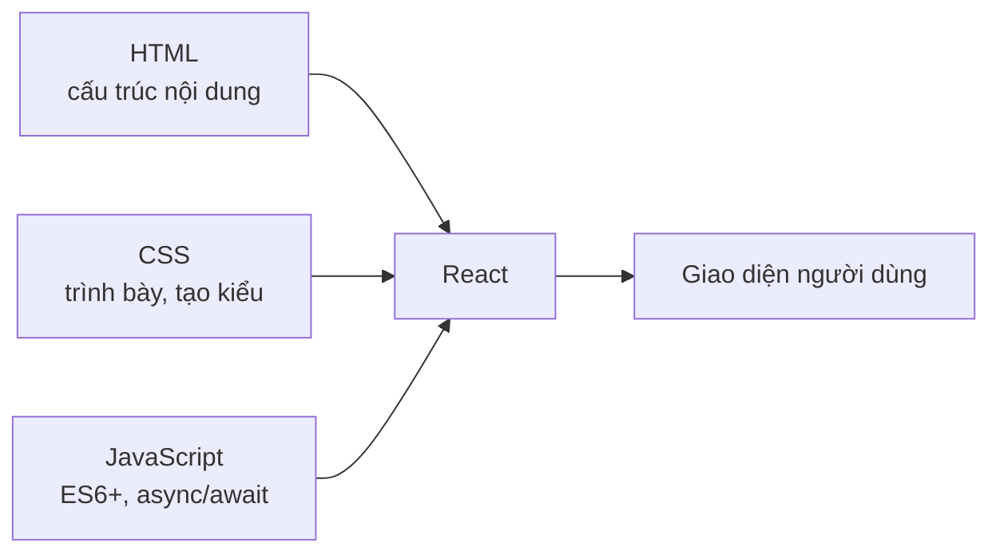
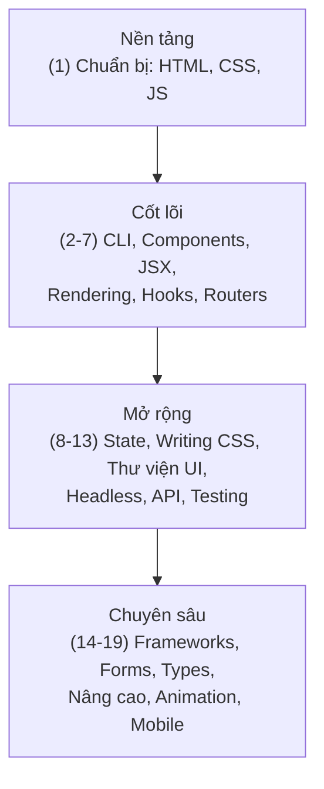

# Lộ trình học React

## React là gì?

**React** là một thư viện JavaScript (JavaScript library) dùng để xây dựng giao diện người dùng (User Interface - UI), được phát triển và duy trì bởi Meta (Facebook). Thay vì viết toàn bộ trang web theo kiểu thủ công, React giúp bạn chia giao diện thành những mảnh nhỏ có thể tái sử dụng.

### Component là gì?

**Component** (thành phần) là khối xây dựng cơ bản của React. Mỗi component là một đoạn giao diện độc lập, có thể tái sử dụng nhiều lần. Ví dụ: một nút bấm (button), một thanh điều hướng (navbar), hay một thẻ sản phẩm đều có thể là một component riêng. Bạn ghép các component nhỏ lại với nhau để tạo nên cả một ứng dụng hoàn chỉnh.

### Vì sao React phổ biến?

- **Tái sử dụng cao**: Viết một component một lần, dùng lại ở nhiều nơi.
- **Cập nhật hiệu quả**: React dùng cơ chế DOM ảo (Virtual DOM) để chỉ cập nhật phần giao diện thực sự thay đổi, giúp ứng dụng chạy nhanh.
- **Cộng đồng lớn**: Có rất nhiều thư viện, công cụ và tài liệu hỗ trợ.
- **Được dùng rộng rãi**: Nhiều công ty lớn dùng React, nên kỹ năng này rất giá trị khi đi làm.

## Cần biết gì trước khi học React?

React được xây dựng trên nền tảng web, nên bạn cần nắm vững các kiến thức cơ bản sau trước khi bắt đầu:

- **HTML**: Cách cấu trúc nội dung trang web.
- **CSS**: Cách trình bày, tạo kiểu cho giao diện.
- **JavaScript**: Đặc biệt là các khái niệm hiện đại như hàm mũi tên (arrow function), destructuring, module, và xử lý bất đồng bộ (async/await). React phụ thuộc rất nhiều vào JavaScript, nên đây là phần quan trọng nhất.

Nếu bạn chưa chắc về JavaScript, hãy dành thời gian học vững nó trước. Điều này sẽ giúp việc học React dễ dàng hơn rất nhiều.

Ba nền tảng web dưới đây đều hội tụ vào React:

## Lộ trình học

Dưới đây là 19 nhóm chủ đề theo thứ tự gợi ý để học React từ cơ bản đến nâng cao:

| #   | Chủ đề                  | Mô tả                                                                 |
| --- | ----------------------- | --------------------------------------------------------------------- |
| 1   | Chuẩn bị                | Ôn lại HTML, CSS và JavaScript trước khi bắt đầu với React.            |
| 2   | CLI Tools               | Công cụ dòng lệnh để tạo và chạy dự án React (như Vite, Create React App). |
| 3   | Components              | Hiểu về thành phần - khối xây dựng cơ bản của mọi ứng dụng React.      |
| 4   | Component Basics        | Kiến thức nền tảng về component: props, JSX, cách viết component.      |
| 5   | Rendering               | Cách React hiển thị (render) giao diện và cập nhật khi dữ liệu thay đổi. |
| 6   | Hooks                   | Các hàm móc giúp dùng state và tính năng React trong component hàm.    |
| 7   | Routers                 | Định tuyến (routing) để điều hướng giữa các trang trong ứng dụng.     |
| 8   | State Management        | Quản lý trạng thái (state) chung của ứng dụng, ví dụ Redux, Zustand.   |
| 9   | Writing CSS             | Các cách viết CSS trong React: CSS Modules, Tailwind, styled-components. |
| 10  | Component Libraries     | Thư viện component dựng sẵn (như Material UI, Ant Design) để tăng tốc. |
| 11  | Headless Libraries      | Thư viện cung cấp logic nhưng không kèm giao diện, bạn tự tạo kiểu.    |
| 12  | API Calls               | Gọi giao diện lập trình ứng dụng (API) để lấy và gửi dữ liệu.         |
| 13  | Testing                 | Kiểm thử (testing) ứng dụng để đảm bảo hoạt động đúng.                 |
| 14  | Frameworks              | Khung phát triển dựa trên React như Next.js, Remix.                   |
| 15  | Forms                   | Xử lý biểu mẫu (form): nhập liệu, kiểm tra, gửi dữ liệu.              |
| 16  | Types & Validation      | Kiểu dữ liệu (với TypeScript) và xác thực (validation) dữ liệu.       |
| 17  | Advanced Topics         | Chủ đề nâng cao: tối ưu hiệu năng, context, render có điều kiện.       |
| 18  | Animation               | Hoạt ảnh (animation) để giao diện sinh động và mượt mà hơn.           |
| 19  | Mobile Applications     | Xây dựng ứng dụng di động với React Native.                           |

## Học theo thứ tự nào?

Bạn nên học theo đúng thứ tự từ trên xuống dưới, vì các chủ đề được sắp xếp từ nền tảng đến nâng cao:

1. **Bắt đầu từ phần Chuẩn bị (1)**: Đảm bảo bạn nắm chắc HTML, CSS, JavaScript. Đây là gốc rễ quan trọng nhất.
2. **Học phần cốt lõi (2 đến 7)**: Cài đặt công cụ, hiểu component, JSX, rendering, hooks và routing. Đây là những kiến thức bắt buộc để xây dựng ứng dụng React thực sự.
3. **Mở rộng kỹ năng (8 đến 13)**: Khi đã viết được ứng dụng cơ bản, học cách quản lý state, viết CSS gọn gàng, dùng thư viện component, gọi API và kiểm thử.
4. **Đi vào chuyên sâu (14 đến 19)**: Sau khi vững nền tảng, khám phá framework, xử lý form, TypeScript, chủ đề nâng cao, hoạt ảnh và phát triển ứng dụng di động.

Sơ đồ dưới đây tóm tắt 19 chủ đề gom thành 4 nhóm học tuần tự:

> **Lời khuyên**: Đừng vội học hết mọi thứ cùng lúc. Hãy học đến đâu thực hành đến đó bằng cách tự xây các dự án nhỏ. Việc làm thực tế sẽ giúp bạn nhớ lâu và hiểu sâu hơn nhiều so với chỉ đọc lý thuyết.
