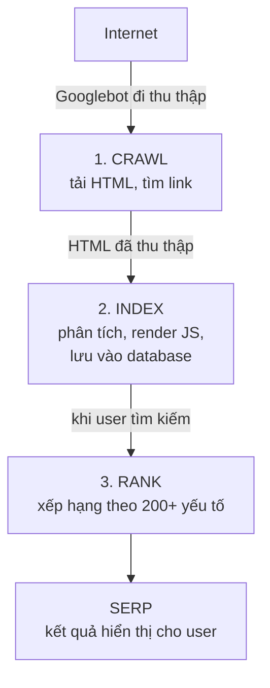

# Google hoạt động thế nào

Trước khi tối ưu SEO, bạn cần hiểu **Google làm gì** khi ai đó tìm kiếm. Google không phải magic -- nó là một hệ thống engineering khổng lồ với pipeline rõ ràng: **Crawl → Index → Rank**. Hiểu pipeline này giúp bạn biết chính xác cần làm gì để website được Google "yêu thích".

Bài này sẽ đi sâu vào cách Google hoạt động từ góc nhìn technical, với những thông tin mà developer cần biết để debug SEO issues.

---

:::note[Ghi nhớ nhanh]

- ⭐ **Google hoạt động theo pipeline tuần tự `Crawl → Index → Rank`** — không crawl được thì không index, không index thì không rank.
- **`Crawl budget`** — Googlebot có giới hạn số trang crawl; quan trọng với site lớn (>10,000 trang); tối ưu qua `robots.txt` và `sitemap.xml`.
- **Mobile-first indexing** — từ 2019 Google ưu tiên crawl phiên bản mobile của website.
- **`robots.txt` chặn crawl, `noindex` chặn index** — nếu đã chặn crawl bằng robots.txt, Google không đọc được thẻ `noindex`.
- **`PageRank` và `E-E-A-T`** — link như "phiếu bầu" uy tín; Google đánh giá chất lượng qua Experience, Expertise, Authoritativeness, Trustworthiness.

:::

---

## Mục lục

- [1. Pipeline tổng quan: Crawl → Index → Rank](#1-pipeline-tổng-quan-crawl-index-rank)
- [2. Bước 1: Crawl -- Googlebot thu thập dữ liệu](#2-bước-1-crawl-googlebot-thu-thập-dữ-liệu)
- [3. Bước 2: Index -- Google phân tích và lưu trữ](#3-bước-2-index-google-phân-tích-và-lưu-trữ)
- [4. Bước 3: Rank -- Google xếp hạng kết quả](#4-bước-3-rank-google-xếp-hạng-kết-quả)
- [5. Thực hành: Kiểm tra website của bạn](#5-thực-hành-kiểm-tra-website-của-bạn)
- [6. Lỗi thường gặp](#6-lỗi-thường-gặp)
- [7. Tổng kết](#7-tổng-kết)
- [8. Câu hỏi phỏng vấn](#8-câu-hỏi-phỏng-vấn)

---

## 1. Pipeline tổng quan: Crawl → Index → Rank

```
                    Internet
                       │
            ┌──────────▼──────────┐
            │    1. CRAWL          │
            │    Googlebot đi      │
            │    thu thập HTML     │
            └──────────┬──────────┘
                       │
            ┌──────────▼──────────┐
            │    2. INDEX          │
            │    Phân tích, lưu    │
            │    vào database      │
            └──────────┬──────────┘
                       │
            ┌──────────▼──────────┐
            │    3. RANK           │
            │    Xếp hạng khi     │
            │    user tìm kiếm    │
            └──────────┴──────────┘
                       │
            ┌──────────▼──────────┐
            │    SERP Results      │
            │    Hiển thị cho user │
            └─────────────────────┘
```



Pipeline này **tuần tự**: không crawl được thì không index, không index thì không rank. Mỗi bước đều có những yếu tố mà developer có thể tác động. Hãy đi chi tiết từng bước.

---

## 2. Bước 1: Crawl -- Googlebot thu thập dữ liệu

### 2.1. Googlebot là gì?

Googlebot là **web crawler** (bot tự động) của Google, đi duyệt internet để thu thập nội dung website. Nó hoạt động giống như một browser headless:

```
Googlebot gửi HTTP request
        ↓
Server trả về HTML
        ↓
Googlebot parse HTML, tìm links
        ↓
Thêm links vào hàng đợi crawl
        ↓
Lặp lại cho mỗi link
```

**Có 2 loại Googlebot chính:**
- **Googlebot Desktop**: Giả lập Chrome desktop
- **Googlebot Smartphone**: Giả lập Chrome mobile (được dùng cho mobile-first indexing)

Từ 2019, Google **ưu tiên crawl phiên bản mobile** của website. Nếu website bạn chỉ đẹp trên desktop mà mobile lỗi → Google sẽ index phiên bản lỗi.

### 2.2. Crawl Budget là gì?

Crawl budget là **số lượng trang** mà Googlebot sẽ crawl trên website của bạn trong một khoảng thời gian. Google không crawl vô hạn -- mỗi website có giới hạn.

**Hai yếu tố quyết định crawl budget:**

| Yếu tố | Giải thích |
|---------|-----------|
| **Crawl rate limit** | Tốc độ crawl tối đa mà server chịu được (Google không muốn làm sập server bạn) |
| **Crawl demand** | Mức độ "muốn crawl" -- trang phổ biến, cập nhật thường xuyên → Google crawl nhiều hơn |

**Khi nào crawl budget quan trọng?**
- Website lớn (>10,000 trang)
- Website thương mại điện tử (hàng nghìn sản phẩm)
- Website có nhiều URL parameters
- Website có nhiều trang duplicate

**Developer cần làm gì để tối ưu crawl budget:**

```
# robots.txt - Chặn Googlebot crawl trang không cần index
User-agent: Googlebot
Disallow: /admin/
Disallow: /api/
Disallow: /search?*
Disallow: /cart/
Disallow: /checkout/
Disallow: /tmp/

# Cho phép crawl CSS/JS (Google cần render trang)
Allow: /assets/
Allow: /static/

Sitemap: https://example.com/sitemap.xml
```

### 2.3. Crawl Frequency

Google không crawl mọi trang với tần suất giống nhau:

| Loại trang | Tần suất crawl | Lý do |
|-----------|----------------|-------|
| Trang chủ | Hàng ngày | Thường xuyên thay đổi |
| Blog post mới | Trong vài giờ | Fresh content |
| Blog post cũ (ít traffic) | Vài tuần/tháng | Ít thay đổi |
| Trang sản phẩm | Hàng tuần | Giá, stock thay đổi |
| Trang static (About, Contact) | Vài tháng | Hiếm khi thay đổi |

**Cách yêu cầu Google crawl lại:**

```bash
# Qua Google Search Console
# 1. Vào URL Inspection tool
# 2. Nhập URL cần crawl lại
# 3. Click "Request Indexing"

# Hoặc qua Indexing API (cho website lớn)
curl -X POST \
  "https://indexing.googleapis.com/v3/urlNotifications:publish" \
  -H "Content-Type: application/json" \
  -H "Authorization: Bearer YOUR_ACCESS_TOKEN" \
  -d '{
    "url": "https://example.com/bai-viet-moi",
    "type": "URL_UPDATED"
  }'
```

### 2.4. Sitemap.xml -- Bản đồ website

Sitemap giúp Google biết **tất cả các trang** trên website và mức độ ưu tiên:

```xml
<?xml version="1.0" encoding="UTF-8"?>
<urlset xmlns="http://www.sitemaps.org/schemas/sitemap/0.9">
  <url>
    <loc>https://example.com/</loc>
    <lastmod>2026-04-05</lastmod>
    <changefreq>daily</changefreq>
    <priority>1.0</priority>
  </url>
  <url>
    <loc>https://example.com/blog/seo-cho-developer</loc>
    <lastmod>2026-04-01</lastmod>
    <changefreq>monthly</changefreq>
    <priority>0.8</priority>
  </url>
  <url>
    <loc>https://example.com/about</loc>
    <lastmod>2026-01-01</lastmod>
    <changefreq>yearly</changefreq>
    <priority>0.3</priority>
  </url>
</urlset>
```

**Với Docusaurus** (framework bạn đang dùng), sitemap được generate tự động qua plugin `@docusaurus/plugin-sitemap`. Chỉ cần đảm bảo `url` đúng trong `docusaurus.config.ts`:

```javascript
// docusaurus.config.ts
const config = {
  url: 'https://your-domain.com', // URL production
  // plugin-sitemap nằm trong @docusaurus/preset-classic
};
```

---

## 3. Bước 2: Index -- Google phân tích và lưu trữ

### 3.1. Indexing là gì?

Sau khi crawl, Google **phân tích nội dung** trang và lưu vào database (Google Index). Đây là nơi Google "hiểu" trang nói về gì.

```
HTML đã crawl
     ↓
Parse HTML → Tách title, headings, content, links
     ↓
Render JavaScript (nếu có)
     ↓
Phân tích nội dung → Xác định chủ đề, từ khóa
     ↓
Kiểm tra duplicate → So sánh với trang đã có
     ↓
Lưu vào Google Index
```

### 3.2. Những gì Google index

| Được index | Không được index |
|-----------|-----------------|
| Text content trong HTML | Content trong iframe (hạn chế) |
| Title tag, meta description | CSS/JS files (chỉ render, không index nội dung) |
| Heading tags (H1-H6) | Content cần login |
| Alt text của images | Content bị block bởi robots.txt |
| Anchor text của links | Trang có `noindex` tag |
| Structured data (JSON-LD) | Content generate bởi Flash (đã chết) |
| Text trong `<main>`, `<article>` | Hidden text (CSS `display:none`) |

### 3.3. Kiểm soát indexing

**Cho phép index (mặc định):**

```html
<meta name="robots" content="index, follow">
```

**Chặn index một trang:**

```html
<!-- Trang admin, trang nội bộ -->
<meta name="robots" content="noindex, nofollow">
```

**Chặn index qua HTTP header (cho non-HTML files):**

```
HTTP/1.1 200 OK
X-Robots-Tag: noindex, nofollow
```

**Kiểm tra trang đã được index chưa:**

```bash
# Cách 1: Tìm trên Google
# Gõ vào Google Search: site:example.com/bai-viet-cua-ban

# Cách 2: Google Search Console → URL Inspection
# Nhập URL → Xem trạng thái "URL is on Google" hoặc "URL is not on Google"

# Cách 3: Google Cache
# Gõ vào Google Search: cache:example.com/bai-viet-cua-ban
# Hoặc truy cập: https://webcache.googleusercontent.com/search?q=cache:example.com/bai-viet
```

### 3.4. Canonical và Duplicate Content

Khi Google tìm thấy nhiều trang có nội dung giống nhau, nó cần biết trang nào là **bản gốc**:

```html
<!-- Trang gốc -->
<link rel="canonical" href="https://example.com/bai-viet">

<!-- Các URL khác cùng nội dung cũng nên trỏ canonical về trang gốc -->
<!-- https://example.com/bai-viet?ref=facebook -->
<!-- https://www.example.com/bai-viet -->
<!-- https://example.com/bai-viet/ -->
```

Nếu không xử lý canonical, Google sẽ tự chọn một phiên bản -- và có thể chọn URL sai, pha loãng ranking signal.

---

## 4. Bước 3: Rank -- Google xếp hạng kết quả

### 4.1. Google Ranking Factors

Google sử dụng **hơn 200 yếu tố** để xếp hạng. Không ai biết chính xác tất cả, nhưng dưới đây là các nhóm yếu tố đã được xác nhận hoặc có bằng chứng mạnh:

**Nhóm 1: Content Relevance (Độ liên quan nội dung)**

| Yếu tố | Mức độ quan trọng | Developer cần biết? |
|---------|-------------------|---------------------|
| Nội dung khớp search intent | Rất cao | Hiểu cơ bản |
| Từ khóa trong title tag | Cao | Có |
| Từ khóa trong H1 | Cao | Có |
| Từ khóa trong content | Trung bình | Hiểu cơ bản |
| Content freshness | Trung bình | Có (lastmod) |
| Content depth | Trung bình | Hiểu cơ bản |

**Nhóm 2: Technical Quality (Chất lượng kỹ thuật)**

| Yếu tố | Mức độ quan trọng | Developer cần biết? |
|---------|-------------------|---------------------|
| Core Web Vitals (LCP, FID, CLS) | Cao | Bắt buộc |
| Mobile-friendly | Rất cao | Bắt buộc |
| HTTPS | Cao | Bắt buộc |
| Page speed | Cao | Bắt buộc |
| Structured data | Trung bình | Có |
| Crawlability | Rất cao | Bắt buộc |

**Nhóm 3: Authority (Uy tín)**

| Yếu tố | Mức độ quan trọng | Developer cần biết? |
|---------|-------------------|---------------------|
| Backlinks (số lượng + chất lượng) | Rất cao | Hiểu cơ bản |
| Domain authority | Cao | Hiểu cơ bản |
| Brand signals | Trung bình | Không cần |
| Social signals | Thấp | Không cần |

**Nhóm 4: User Experience (Trải nghiệm người dùng)**

| Yếu tố | Mức độ quan trọng | Developer cần biết? |
|---------|-------------------|---------------------|
| Click-through rate (CTR) | Trung bình | Hiểu cơ bản |
| Bounce rate | Trung bình | Hiểu cơ bản |
| Dwell time | Trung bình | Hiểu cơ bản |
| Pogo-sticking | Trung bình | Hiểu cơ bản |

### 4.2. PageRank -- Giải thích đơn giản

PageRank là thuật toán **nền tảng** của Google (đặt theo tên Larry Page, đồng sáng lập Google). Ý tưởng cốt lõi:

```
Mỗi trang web có một "điểm uy tín" (PageRank score)
        ↓
Khi trang A link đến trang B → A "bỏ phiếu" cho B
        ↓
Trang A có PageRank càng cao → phiếu bầu càng giá trị
        ↓
Trang B nhận nhiều "phiếu bầu" chất lượng → PageRank cao hơn
        ↓
PageRank cao → Xếp hạng tốt hơn
```

**Công thức đơn giản hóa:**

```
PR(A) = (1-d) + d × (PR(T1)/C(T1) + PR(T2)/C(T2) + ... + PR(Tn)/C(Tn))

Trong đó:
- PR(A): PageRank của trang A
- d: Damping factor (~0.85)
- PR(Ti): PageRank của trang Ti (link đến A)
- C(Ti): Số lượng link ra (outbound links) của trang Ti
```

**Ví dụ thực tế:**

```
Wikipedia (PR cao) link đến blog bạn → Rất giá trị
Blog no-name (PR thấp) link đến blog bạn → Ít giá trị
Forum spam link đến blog bạn → Có hại (negative SEO)
```

**Lưu ý**: Google không còn công khai PageRank score từ 2016, nhưng thuật toán PageRank vẫn là **một phần** trong hệ thống ranking.

### 4.3. E-E-A-T (Experience, Expertise, Authoritativeness, Trustworthiness)

Đây là framework Google dùng để **đánh giá chất lượng nội dung**:

| Yếu tố | Ý nghĩa | Áp dụng cho developer |
|---------|---------|----------------------|
| **Experience** | Tác giả có kinh nghiệm thực tế | Viết blog chia sẻ kinh nghiệm coding thật |
| **Expertise** | Tác giả có chuyên môn | Profile tác giả rõ ràng, bài viết chuyên sâu |
| **Authoritativeness** | Được cộng đồng công nhận | Backlinks từ site uy tín, social proof |
| **Trustworthiness** | Đáng tin cậy | HTTPS, thông tin liên hệ rõ ràng, privacy policy |

---

## 5. Thực hành: Kiểm tra website của bạn

### 5.1. Xem page source

```bash
# Xem HTML mà Google nhận được (không bao gồm JS rendering)
curl -s https://example.com | head -50

# Xem với User-Agent giả lập Googlebot
curl -s -A "Googlebot" https://example.com | head -50

# So sánh response headers
curl -I https://example.com
```

### 5.2. Kiểm tra robots.txt

```bash
# Xem robots.txt
curl https://example.com/robots.txt

# Kết quả mẫu:
# User-agent: *
# Allow: /
# Disallow: /admin/
# Sitemap: https://example.com/sitemap.xml
```

**Test robots.txt trước khi deploy:**

```bash
# Dùng Google Search Console → robots.txt Tester
# Hoặc dùng Python:
pip install robotsparser

python3 -c "
from urllib.robotparser import RobotFileParser
rp = RobotFileParser()
rp.set_url('https://example.com/robots.txt')
rp.read()
print('Can crawl /blog:', rp.can_fetch('Googlebot', '/blog'))
print('Can crawl /admin:', rp.can_fetch('Googlebot', '/admin'))
"
```

### 5.3. Kiểm tra Google Cache

```bash
# Xem phiên bản Google đã cache
# Gõ vào Google Search:
cache:example.com

# Nếu kết quả trống hoặc thiếu nội dung → vấn đề rendering
# Nếu "not found" → trang chưa được index
```

### 5.4. Kiểm tra sitemap

```bash
# Xem sitemap
curl https://example.com/sitemap.xml

# Đếm số URL trong sitemap
curl -s https://example.com/sitemap.xml | grep -c "<loc>"

# Kiểm tra sitemap hợp lệ
# Truy cập: https://www.xml-sitemaps.com/validate-xml-sitemap.html
```

### 5.5. Kiểm tra indexing status

```bash
# Dùng Google Search Console API
# Hoặc kiểm tra nhanh:

# Đếm số trang đã index
# Gõ vào Google Search: site:example.com
# Google hiển thị "About X results"
```

---

## 6. Lỗi thường gặp

### Lỗi 1: Block Googlebot trong robots.txt

```
# SAI: Vô tình block toàn bộ
User-agent: *
Disallow: /

# ĐÚNG: Chỉ block trang không cần index
User-agent: *
Disallow: /admin/
Disallow: /api/
Allow: /
```

### Lỗi 2: Noindex trên trang quan trọng

```html
<!-- SAI: Copy từ staging mà quên xóa -->
<meta name="robots" content="noindex, nofollow">

<!-- Kiểm tra bằng lệnh -->
<!-- curl -s https://example.com | grep -i "noindex" -->
```

### Lỗi 3: Sitemap chứa URL bị noindex hoặc 404

Sitemap phải chỉ chứa URL **hợp lệ** (200 OK, được index). Nếu chứa URL 404 hoặc noindex, Google sẽ giảm trust vào sitemap.

### Lỗi 4: Không submit sitemap cho Google

```bash
# Phải submit sitemap qua Google Search Console
# Hoặc đặt trong robots.txt
Sitemap: https://example.com/sitemap.xml
```

### Lỗi 5: Server trả về 200 cho trang lỗi (Soft 404)

```bash
# SAI: Trang không tồn tại nhưng server trả 200
curl -I https://example.com/trang-khong-ton-tai
# HTTP/1.1 200 OK  ← Google thấy đây là trang "hợp lệ"

# ĐÚNG: Trả về 404
curl -I https://example.com/trang-khong-ton-tai
# HTTP/1.1 404 Not Found  ← Google hiểu trang không tồn tại
```

---

## 7. Tổng kết

| Bước | Ý nghĩa | Developer cần làm |
|------|---------|-------------------|
| **Crawl** | Googlebot thu thập HTML | Cấu hình `robots.txt`, `sitemap.xml`, internal linking |
| **Index** | Google phân tích và lưu trữ | Semantic HTML, canonical, noindex cho trang không cần |
| **Rank** | Google xếp hạng kết quả | Core Web Vitals, mobile-friendly, HTTPS, structured data |

**Key insight**: Nếu Google không crawl được → không index. Không index → không rank. Không rank → không traffic. Pipeline này là **tuần tự** -- mỗi bước phụ thuộc vào bước trước.

---

## 8. Câu hỏi phỏng vấn

### Câu 1: Mô tả cách Google hoạt động từ khi user gõ từ khóa đến khi thấy kết quả?

**Trả lời:**

Google hoạt động theo pipeline 3 bước (đã thực hiện trước khi user tìm kiếm):
1. **Crawl**: Googlebot tự động duyệt web, thu thập HTML qua HTTP request. Tìm links trong HTML để crawl tiếp các trang liên kết.
2. **Index**: Phân tích HTML đã crawl -- tách title, heading, content, links. Render JavaScript nếu cần. Lưu vào Google Index database.
3. **Rank**: Khi user tìm kiếm, Google query Index database, áp dụng thuật toán xếp hạng (200+ yếu tố) và trả về kết quả trong mili-giây.

Bước Crawl và Index xảy ra **liên tục, không phụ thuộc** vào search query. Bước Rank mới xảy ra real-time khi user tìm kiếm.

### Câu 2: Crawl budget là gì? Khi nào cần quan tâm?

**Trả lời:**

Crawl budget là giới hạn số trang mà Googlebot sẽ crawl trên website trong một khoảng thời gian, được quyết định bởi crawl rate limit (server capacity) và crawl demand (độ phổ biến/freshness).

**Cần quan tâm khi:**
- Website có hơn 10,000 trang
- Website e-commerce với nhiều biến thể sản phẩm
- Website có nhiều URL parameters tạo duplicate
- Website có nhiều trang chất lượng thấp

**Tối ưu bằng cách**: Dùng robots.txt block trang không cần index, submit sitemap, cải thiện server response time, xử lý duplicate content.

### Câu 3: Giải thích PageRank bằng ngôn ngữ đơn giản?

**Trả lời:**

PageRank xem mỗi link từ trang A đến trang B như một "lá phiếu bầu" cho trang B. Phiếu bầu từ trang có PageRank cao (ví dụ Wikipedia) giá trị hơn phiếu từ trang PageRank thấp (blog cá nhân). Trang nhận nhiều phiếu bầu chất lượng → PageRank cao → xếp hạng tốt hơn.

Damping factor (~0.85) mô phỏng xác suất user tiếp tục click link thay vì bắt đầu tìm kiếm mới. PageRank vẫn là một phần trong hệ thống ranking của Google, dù không còn được công khai score.

### Câu 4: Sự khác biệt giữa robots.txt và meta robots tag?

**Trả lời:**

| Tiêu chí | `robots.txt` | `<meta name="robots">` |
|----------|-------------|----------------------|
| **Vị trí** | File ở root domain (`/robots.txt`) | Trong `<head>` của HTML |
| **Tác dụng** | Chặn **crawl** (Googlebot không truy cập trang) | Chặn **index** (Googlebot crawl nhưng không lưu vào index) |
| **Scope** | Áp dụng theo đường dẫn (path) | Áp dụng cho từng trang |
| **Lưu ý quan trọng** | Nếu block bằng robots.txt, Google **không thấy** meta robots tag | Nếu muốn trang không xuất hiện trên Google, dùng `noindex` |

**Sai lầm phổ biến**: Block trang bằng robots.txt **nhưng** vẫn có link từ trang khác trỏ đến → Google vẫn có thể index URL (dù không crawl nội dung), hiển thị snippet rỗng trên SERP.

### Câu 5: Website SPA (React) không được Google index. Bạn sẽ debug như thế nào?

**Trả lời:**

**Bước 1**: Kiểm tra view source (`curl https://example.com`) -- nếu chỉ thấy `<div id="root"></div>` → vấn đề CSR, Google không render được JS.

**Bước 2**: Kiểm tra Google Search Console → URL Inspection → xem "Rendered page" có nội dung không.

**Bước 3**: Kiểm tra robots.txt không block CSS/JS files (Google cần chúng để render).

**Bước 4**: Kiểm tra console errors khi render -- API calls có timeout, CORS issues, hoặc JS errors có thể prevent rendering.

**Giải pháp lâu dài**: Migrate sang SSR (Next.js) hoặc SSG (Docusaurus, Gatsby), hoặc implement pre-rendering service (Prerender.io).
