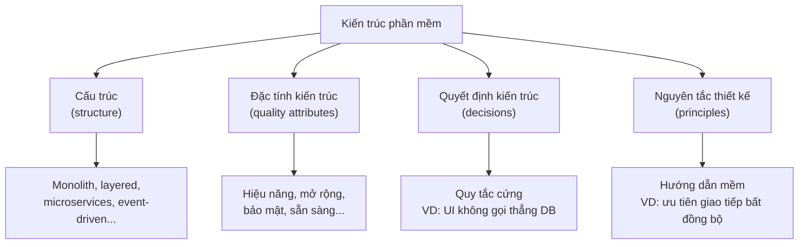
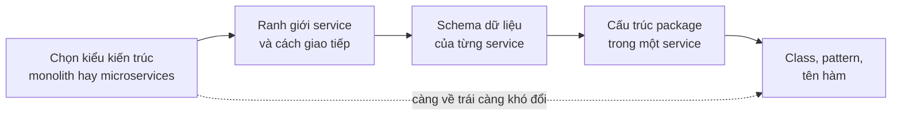
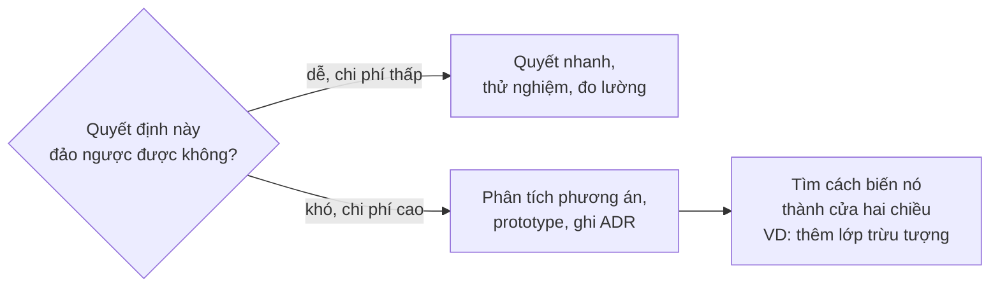
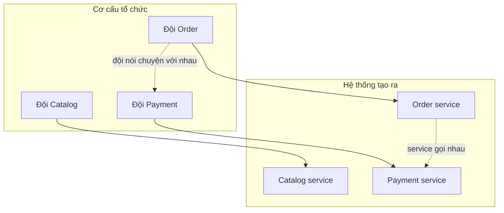

# Kiến trúc phần mềm là gì

**Kiến trúc phần mềm** (software architecture) là **cấu trúc tổng thể của một hệ thống**: hệ thống được chia thành những **thành phần** (component) nào, các thành phần **liên hệ** với nhau ra sao, dữ liệu nằm ở đâu và chảy đi thế nào, cùng với **những quyết định quan trọng** đứng sau cách chia đó. Nói gọn, kiến trúc là tập hợp những quyết định mà **sau này rất khó và rất đắt để thay đổi**.

**Tương tự đơn giản:** Một căn nhà có thể sơn lại tường, thay sofa, đổi rèm trong một buổi chiều. Đó là **thiết kế chi tiết** (design). Nhưng số tầng, vị trí cầu thang, móng chịu tải bao nhiêu, đường ống nước đi ngầm ở đâu thì phải quyết từ đầu. Muốn đổi thì gần như phải đập nhà. Đó là **kiến trúc**.

---

:::note[Ghi nhớ nhanh]

- ⭐ **Kiến trúc = các quyết định quan trọng, khó đảo ngược** — cách chia thành phần, cách giao tiếp, nơi lưu dữ liệu, công nghệ nền tảng. Cái gì đổi dễ thì thường không phải kiến trúc.
- ⭐ **Kiến trúc được dẫn dắt bởi thuộc tính chất lượng** (quality attributes) như hiệu năng, khả năng mở rộng, bảo mật, dễ bảo trì, không chỉ bởi chức năng.
- **Kiến trúc vs thiết kế** là một dải liên tục: kiến trúc ở mức "hệ thống gồm những khối nào", thiết kế ở mức "bên trong một khối viết thế nào".
- **Ràng buộc** (constraints) như ngân sách, thời hạn, kỹ năng đội, quy định pháp lý giới hạn không gian lựa chọn kiến trúc.
- **Định luật Conway:** cấu trúc hệ thống có xu hướng phản chiếu cấu trúc giao tiếp của tổ chức làm ra nó.

:::

---

## Mục lục

- [Vì sao cần quan tâm tới kiến trúc?](#vì-sao-cần-quan-tâm-tới-kiến-trúc)
- [1. Các định nghĩa kinh điển](#1-các-định-nghĩa-kinh-điển)
- [2. Kiến trúc gồm những gì](#2-kiến-trúc-gồm-những-gì)
- [3. Kiến trúc và thiết kế](#3-kiến-trúc-và-thiết-kế)
- [4. Thuộc tính chất lượng](#4-thuộc-tính-chất-lượng)
- [5. Ràng buộc](#5-ràng-buộc)
- [6. Quyết định khó đảo ngược và chi phí thay đổi](#6-quyết-định-khó-đảo-ngược-và-chi-phí-thay-đổi)
- [7. Định luật Conway](#7-định-luật-conway)
- [Khi nào cần nhớ?](#khi-nào-cần-nhớ)
- [Lỗi thường gặp](#lỗi-thường-gặp)
- [Câu hỏi phỏng vấn](#câu-hỏi-phỏng-vấn)

---

## Vì sao cần quan tâm tới kiến trúc?

**Vấn đề:** Hầu hết dự án bắt đầu rất nhanh: dựng một app Spring Boot hoặc Express, thêm vài controller, nối thẳng vào database. Sáu tháng sau, mỗi tính năng mới đụng vào chục file, sửa chỗ này vỡ chỗ kia, deploy một thay đổi nhỏ phải test lại cả hệ thống, và khi lượng người dùng tăng gấp 10 thì không ai biết nên scale phần nào. Đội không chậm vì người kém. Đội chậm vì **cấu trúc** của hệ thống chống lại họ.

**Giải pháp:** Chủ động đưa ra (và ghi lại) những quyết định cấu trúc quan trọng **ngay từ khi chúng còn rẻ**: chia hệ thống theo ranh giới nghiệp vụ, xác định thuộc tính chất lượng nào quan trọng nhất, chọn cách giao tiếp giữa các phần, chọn nơi lưu dữ liệu. Kiến trúc tốt không làm hệ thống "đẹp" hơn. Nó giữ cho **chi phí thêm tính năng tiếp theo** không tăng vọt theo thời gian.

:::tip[Dùng thực tế]

- **Khởi tạo dự án mới:** chọn monolith có module rõ ràng hay microservices, chọn SQL hay NoSQL, chọn REST hay message queue.
- **Hệ thống đang chậm dần:** nhận ra vấn đề nằm ở cấu trúc (phụ thuộc chằng chịt, database dùng chung) chứ không phải ở từng dòng code.
- **Đánh giá đề xuất kỹ thuật:** hỏi "quyết định này ảnh hưởng thuộc tính chất lượng nào, có đảo ngược được không?".
- **Phỏng vấn senior:** "kiến trúc phần mềm là gì?" là câu mở đầu rất hay gặp.

:::

---

## 1. Các định nghĩa kinh điển

Không có một định nghĩa duy nhất được mọi người đồng thuận, nhưng ba cách nhìn dưới đây được trích dẫn nhiều nhất và bổ sung cho nhau:

| Nguồn | Ý chính | Nhấn mạnh |
| --- | --- | --- |
| **Bass, Clements, Kazman** — *Software Architecture in Practice* | Kiến trúc là tập hợp các **cấu trúc** cần thiết để lập luận về hệ thống, gồm các phần tử phần mềm, quan hệ giữa chúng và thuộc tính của cả hai | Cấu trúc và khả năng **lập luận** |
| **Ralph Johnson, Martin Fowler** | Kiến trúc là "những thứ quan trọng", là những thứ mà người trong cuộc coi là **khó thay đổi** | Tầm quan trọng, góc nhìn của con người |
| **Grady Booch** | Kiến trúc là các quyết định thiết kế **quan trọng** định hình hệ thống, trong đó "quan trọng" được đo bằng **chi phí thay đổi** | Quyết định và chi phí |

Ba định nghĩa gặp nhau ở một điểm: **kiến trúc không phải là bản vẽ, mà là các quyết định**. Bản vẽ chỉ là cách ghi lại và truyền đạt chúng.

Cuốn *Fundamentals of Software Architecture* (Mark Richards, Neal Ford) tóm lại thành hai "định luật" rất đáng nhớ:

1. **Mọi thứ trong kiến trúc phần mềm đều là đánh đổi** (trade-off). Nếu bạn nghĩ mình tìm ra thứ không có đánh đổi, có lẽ bạn chưa nhận ra nó.
2. **"Tại sao" quan trọng hơn "như thế nào".** Người đến sau có thể nhìn code để biết hệ thống được làm thế nào, nhưng không thể biết vì sao lại chọn như vậy nếu không có ai ghi lại.

---

## 2. Kiến trúc gồm những gì

Một mô tả kiến trúc thường trả lời bốn nhóm câu hỏi:

| Thành phần | Ý nghĩa | Ví dụ |
| --- | --- | --- |
| **Cấu trúc** (structure) | Kiểu kiến trúc và cách chia thành phần | Monolith chia theo module, microservices, layered, event-driven |
| **Đặc tính kiến trúc** (architecture characteristics) | Những "-ility" hệ thống phải đạt | Scalability, availability, security, maintainability |
| **Quyết định kiến trúc** (architecture decisions) | Quy tắc bắt buộc mọi người tuân theo | "Chỉ service Order được ghi vào bảng orders", "tầng presentation không được gọi repository" |
| **Nguyên tắc thiết kế** (design principles) | Hướng dẫn, không bắt buộc tuyệt đối | "Ưu tiên messaging giữa các service", "API công khai phải có version" |

Ví dụ cụ thể với một app thương mại điện tử viết bằng Spring Boot:

- **Cấu trúc:** monolith chia module `catalog`, `cart`, `order`, `payment`; mỗi module có package riêng và chỉ lộ ra một interface công khai.
- **Đặc tính:** chịu được tải gấp 20 lần trong flash sale; thanh toán không được mất giao dịch.
- **Quyết định:** module `order` không được truy cập trực tiếp bảng của `payment`, chỉ gọi qua `PaymentService`.
- **Nguyên tắc:** việc không cần trả kết quả ngay (gửi email, cập nhật thống kê) thì đẩy vào hàng đợi.

---

## 3. Kiến trúc và thiết kế

Ranh giới giữa kiến trúc (architecture) và thiết kế (design) không phải một đường kẻ cứng mà là một **dải liên tục**, từ "quyết định ảnh hưởng toàn hệ thống" tới "quyết định chỉ ảnh hưởng một hàm".

| Tiêu chí | Kiến trúc | Thiết kế |
| --- | --- | --- |
| **Phạm vi** | Toàn hệ thống hoặc nhiều thành phần | Bên trong một thành phần, một module |
| **Câu hỏi** | Chia thành những khối nào? Khối nào nói chuyện với khối nào? | Class này có những method gì? Dùng pattern nào? |
| **Chi phí thay đổi** | Cao, thường kéo theo nhiều đội | Thấp hơn, thường gói gọn trong một đội |
| **Ví dụ** | Tách service thanh toán, chọn Kafka làm xương sống sự kiện | Dùng Strategy pattern cho các phương thức thanh toán |
| **Người quyết** | Kiến trúc sư cùng các tech lead | Developer, tech lead |

Một mẹo thực dụng: hỏi **"nếu quyết định này sai, sửa lại tốn bao nhiêu?"**. Nếu câu trả lời là "một buổi chiều refactor", đó là thiết kế. Nếu câu trả lời là "ba đội, hai tháng, một đợt migrate dữ liệu", đó là kiến trúc.

---

## 4. Thuộc tính chất lượng

Hai hệ thống có **cùng chức năng** (đặt hàng, thanh toán, theo dõi đơn) có thể cần kiến trúc **hoàn toàn khác nhau**: một shop nhỏ vài trăm đơn mỗi ngày chạy tốt trên một server, còn một sàn thương mại điện tử lớn cần phân tán, cache nhiều tầng, chịu lỗi từng phần. Điểm khác nằm ở **thuộc tính chất lượng** (quality attributes), còn gọi là **yêu cầu phi chức năng** (non-functional requirements).

Tiêu chuẩn **ISO/IEC 25010** (bản 2011) chia chất lượng sản phẩm phần mềm thành 8 nhóm đặc tính; bản sửa đổi năm 2023 có điều chỉnh tên gọi và bổ sung thêm nhóm an toàn (safety):

| Đặc tính (ISO 25010) | Ý nghĩa | Câu hỏi kiến trúc điển hình |
| --- | --- | --- |
| **Functional suitability** | Làm đúng và đủ chức năng | Nghiệp vụ được mô hình đúng chưa? |
| **Performance efficiency** | Thời gian phản hồi, thông lượng, tài nguyên | Cần cache ở đâu? Có xử lý bất đồng bộ được không? |
| **Compatibility** | Chung sống và trao đổi với hệ thống khác | Tích hợp qua API, file hay message? |
| **Usability** | Dễ dùng với người dùng cuối | SSR hay SPA? Có cần chạy offline? |
| **Reliability** | Sẵn sàng, chịu lỗi, phục hồi | Một service chết thì cả hệ thống có chết theo? |
| **Security** | Bảo mật, xác thực, phân quyền | Token lưu ở đâu? Dữ liệu nhạy cảm mã hoá thế nào? |
| **Maintainability** | Dễ hiểu, dễ sửa, dễ test | Module có phụ thuộc vòng không? |
| **Portability** | Dễ chuyển môi trường, dễ cài đặt | Có khoá chặt vào một nhà cung cấp cloud không? |

Điều quan trọng: các thuộc tính này **kéo nhau về các phía khác nhau**. Thêm mã hoá và kiểm tra quyền thì tăng bảo mật nhưng giảm hiệu năng. Tách microservices thì tăng khả năng mở rộng độc lập nhưng tăng độ phức tạp vận hành. Kiến trúc sư không thể tối đa tất cả, nên phải **chọn 3–5 thuộc tính quan trọng nhất** cho từng hệ thống. Chi tiết cách cân bằng ở bài [Cân bằng](/docs/software-architect/02-important-skills/7_can-bang).

Thuộc tính chất lượng chỉ hữu ích khi **đo được**. "Hệ thống phải nhanh" là vô nghĩa; "95% request API tìm kiếm phản hồi dưới 300 ms khi có 2.000 request mỗi giây" thì kiểm chứng được.

---

## 5. Ràng buộc

**Ràng buộc** (constraints) là những điều kiện **không được thương lượng** mà kiến trúc phải chấp nhận. Chúng thu hẹp không gian lựa chọn, đôi khi quyết định kiến trúc nhiều hơn cả yêu cầu chức năng.

| Loại ràng buộc | Ví dụ |
| --- | --- |
| **Kinh doanh** | Phải ra mắt trước dịp Tết; ngân sách hạ tầng tối đa một con số cố định mỗi tháng |
| **Kỹ thuật** | Phải dùng hệ thống ERP sẵn có; công ty chuẩn hoá trên Java và PostgreSQL |
| **Con người** | Đội 5 người, chưa ai từng vận hành Kubernetes |
| **Pháp lý** | Dữ liệu cá nhân phải lưu tại máy chủ trong nước; cần lưu log giao dịch nhiều năm |

Một ví dụ điển hình: đội 5 người, chưa có kinh nghiệm vận hành hệ phân tán, cần ra mắt sau 3 tháng. Dù microservices "hiện đại" hơn, ràng buộc về con người và thời gian gần như chọn sẵn đáp án: **một monolith có module rõ ràng**, chạy trên dịch vụ được quản lý (managed service). Kiến trúc tốt là kiến trúc **phù hợp với ràng buộc**, không phải kiến trúc giống của các công ty lớn.

---

## 6. Quyết định khó đảo ngược và chi phí thay đổi

Jeff Bezos (Amazon) chia quyết định thành hai loại, và cách chia này rất hữu ích cho kiến trúc:

- **Cửa một chiều** (one-way door): đi qua rồi rất khó quay lại. Cần cân nhắc kỹ, thu thập thông tin, xin ý kiến.
- **Cửa hai chiều** (two-way door): sai thì quay lại được với chi phí thấp. Nên quyết nhanh, thử rồi điều chỉnh.

| Cửa một chiều (khó đảo ngược) | Cửa hai chiều (dễ đảo ngược) |
| --- | --- |
| Chọn mô hình dữ liệu cốt lõi và database chính | Chọn thư viện log, thư viện validate |
| Định dạng và hợp đồng API công khai cho đối tác | Cấu trúc thư mục bên trong một module |
| Chia ranh giới giữa các service | Tên biến, tên class |
| Chọn ngôn ngữ, nền tảng chính | Tham số cache TTL, số lượng worker |

Một kỹ năng quan trọng của kiến trúc sư là **biến cửa một chiều thành cửa hai chiều**: đặt repository làm lớp trung gian để sau này đổi database ít đau hơn, gói SDK của nhà cung cấp sau một interface của mình, dùng feature flag để bật/tắt tính năng mới. Mỗi lớp trừu tượng như vậy cũng có chi phí, nên chỉ đặt ở những chỗ thật sự có khả năng thay đổi.

**Chi phí thay đổi tăng theo thời gian.** Một quyết định sai ở tuần đầu chỉ tốn vài giờ để sửa. Cùng quyết định đó sau hai năm, khi đã có hàng triệu bản ghi, hàng chục service phụ thuộc và khách hàng tích hợp qua API, có thể tốn nhiều tháng. Đó là lý do kiến trúc cần được nghĩ tới **sớm**, nhưng cũng không nên quyết **quá sớm** những thứ chưa có đủ thông tin. Nguyên tắc thường được nhắc là **"trì hoãn tới thời điểm có trách nhiệm cuối cùng"** (last responsible moment): quyết khi đã có đủ thông tin nhưng trước khi việc chưa quyết bắt đầu gây hại.

---

## 7. Định luật Conway

Năm 1968, Melvin Conway viết: *"Bất kỳ tổ chức nào thiết kế một hệ thống sẽ tạo ra một thiết kế có cấu trúc sao chép cấu trúc giao tiếp của tổ chức đó."*

Ví dụ: công ty có ba đội frontend, backend và database tách biệt, giao tiếp qua ticket. Gần như chắc chắn hệ thống sẽ thành ba tầng tách biệt với ranh giới đúng như ranh giới đội, và mỗi tính năng phải đi qua cả ba đội.

Hệ quả thực tế:

- **Muốn microservices thì phải có đội tự chủ tương ứng.** Một đội duy nhất quản 15 service thường tạo ra một "distributed monolith" (monolith phân tán): phân tán nhưng vẫn phải deploy cùng nhau.
- **Inverse Conway maneuver** (đảo ngược Conway): chủ động tổ chức đội theo kiến trúc mong muốn, ví dụ lập đội theo miền nghiệp vụ (catalog, order, payment) thay vì theo tầng kỹ thuật, để hệ thống tự nhiên đi theo hướng đó.
- **Kiến trúc sư không thể bỏ qua con người.** Một kiến trúc ngược với cách tổ chức giao tiếp sẽ bị "kéo" về đúng hình dạng của tổ chức theo thời gian.

---

## Khi nào cần nhớ?

- **Mỗi khi ra một quyết định kỹ thuật:**
  - Hỏi "đảo ngược quyết định này tốn bao nhiêu?" để biết nên quyết nhanh hay chậm.
  - Hỏi "quyết định này ảnh hưởng thuộc tính chất lượng nào?".
- **Khi bắt đầu dự án:**
  - Liệt kê ràng buộc (thời gian, ngân sách, đội, pháp lý) trước khi chọn công nghệ.
  - Chọn 3–5 thuộc tính chất lượng quan trọng nhất và viết chúng thành mục tiêu đo được.
- **Khi tổ chức đội:**
  - Nhớ định luật Conway, ranh giới đội và ranh giới hệ thống nên khớp nhau.
- **Best practice:**
  - Ghi lại "tại sao" của mỗi quyết định quan trọng (xem [Ra quyết định](/docs/software-architect/02-important-skills/2_ra-quyet-dinh)).
  - Không sao chép kiến trúc của công ty lớn khi ràng buộc của mình khác hẳn.

---

## Lỗi thường gặp

### Lỗi 1: Đồng nhất kiến trúc với công nghệ

"Kiến trúc của chúng tôi là React + Spring Boot + PostgreSQL" là danh sách công nghệ, không phải kiến trúc. Kiến trúc nói về **cách chia thành phần, ranh giới, luồng dữ liệu và lý do**. Cùng bộ công nghệ đó có thể là một monolith gọn gàng hoặc một mớ hỗn độn.

### Lỗi 2: Chỉ thiết kế theo chức năng

Liệt kê đầy đủ use case nhưng không hỏi "bao nhiêu người dùng, chấp nhận chậm bao lâu, chết bao lâu thì mất tiền". Kết quả là hệ thống đúng chức năng nhưng sập ở lần khuyến mãi đầu tiên.

### Lỗi 3: Chạy theo xu hướng

Chọn microservices, Kubernetes, event sourcing vì "ai cũng dùng", trong khi đội nhỏ và sản phẩm chưa được kiểm chứng. Chi phí vận hành nuốt hết thời gian làm tính năng.

### Lỗi 4: Quyết định cửa một chiều quá vội, cửa hai chiều quá chậm

Họp ba tuần để chọn thư viện log, nhưng chọn database chính trong một buổi chiều. Nên làm ngược lại: thời gian cân nhắc tỉ lệ với chi phí đảo ngược.

### Lỗi 5: Không ghi lại lý do

Hai năm sau không ai nhớ vì sao lại dùng hai database, vì sao service A gọi B qua queue. Người mới hoặc sợ không dám sửa, hoặc sửa bừa và phá vỡ một giả định quan trọng.

---

## Câu hỏi phỏng vấn

Những câu thường gặp về chủ đề này. Tự trả lời trước, rồi bấm **Xem đáp án** để đối chiếu.

**1. Kiến trúc phần mềm là gì? Nêu theo cách của bạn.**

Xem đáp án

Kiến trúc là tập hợp các **quyết định cấu trúc quan trọng** của hệ thống: chia thành những thành phần nào, chúng giao tiếp ra sao, dữ liệu nằm ở đâu, cùng với **lý do** của các quyết định đó. "Quan trọng" ở đây nghĩa là **khó và đắt để thay đổi** (theo Booch, Fowler). Kiến trúc được dẫn dắt bởi thuộc tính chất lượng và ràng buộc, không chỉ bởi chức năng.

**2. Kiến trúc khác thiết kế ở điểm nào?**

Xem đáp án

Đó là một dải liên tục. Kiến trúc ở mức toàn hệ thống: ranh giới thành phần, cách giao tiếp, công nghệ nền tảng, ảnh hưởng nhiều đội và đắt để đổi. Thiết kế ở mức bên trong một thành phần: class, pattern, cấu trúc hàm, thường gói gọn trong một đội và đổi rẻ hơn. Tiêu chí thực dụng: hỏi chi phí sửa nếu quyết định sai.

**3. Thuộc tính chất lượng là gì? Vì sao không thể tối đa tất cả?**

Xem đáp án

Là các yêu cầu phi chức năng như hiệu năng, độ tin cậy, bảo mật, khả năng bảo trì, khả năng mở rộng (ISO/IEC 25010 là một bộ phân loại chuẩn). Chúng thường mâu thuẫn: bảo mật cao hơn thường chậm hơn, nhất quán mạnh làm giảm tính sẵn sàng khi có phân vùng mạng, phân tán để mở rộng làm tăng độ phức tạp. Vì vậy phải ưu tiên vài thuộc tính quan trọng nhất cho từng hệ thống và viết chúng thành mục tiêu đo được.

**4. Định luật Conway nói gì? Ứng dụng thế nào?**

Xem đáp án

Hệ thống có xu hướng sao chép cấu trúc giao tiếp của tổ chức tạo ra nó. Ứng dụng: muốn có các service độc lập thì cần các đội tự chủ tương ứng; có thể dùng "inverse Conway maneuver", tổ chức đội theo miền nghiệp vụ để kiến trúc đi theo hướng mong muốn. Bỏ qua định luật này thường dẫn tới distributed monolith.

**5. Làm sao biết một quyết định cần cân nhắc kỹ hay quyết nhanh?**

Xem đáp án

Xét khả năng đảo ngược. Cửa một chiều (database chính, hợp đồng API công khai, ranh giới service) cần phân tích phương án, prototype, ghi ADR. Cửa hai chiều (thư viện tiện ích, cấu hình) nên quyết nhanh rồi đo và điều chỉnh. Ngoài ra nên tìm cách biến cửa một chiều thành hai chiều bằng lớp trừu tượng, feature flag, và trì hoãn quyết định tới "last responsible moment".

