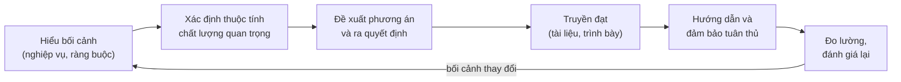
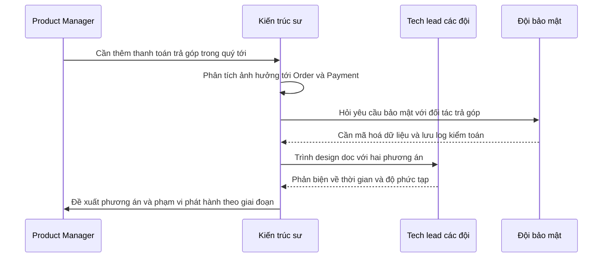
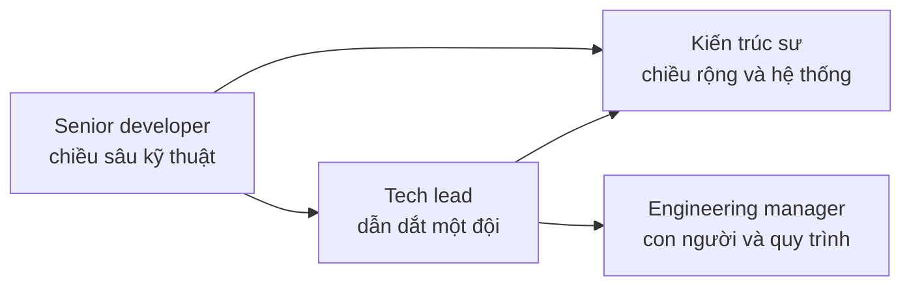

# Kiến trúc sư phần mềm

**Kiến trúc sư phần mềm** (software architect) là người chịu trách nhiệm về **những quyết định kỹ thuật quan trọng** của một hệ thống: hệ thống được chia thế nào, dùng công nghệ gì, đạt các **thuộc tính chất lượng** (quality attributes) ra sao, và làm sao để cả đội cùng hiểu và đi theo hướng đó. Đây là vai trò nằm ở **giao điểm giữa kỹ thuật và kinh doanh**: một chân trong code, một chân trong phòng họp với các bên liên quan (stakeholders).

**Tương tự đơn giản:** Kiến trúc sư giống **nhạc trưởng** của một dàn nhạc. Nhạc trưởng không chơi thay violin hay kèn đồng, nhưng phải hiểu từng nhạc cụ đủ sâu để biết đoạn nào nên nhanh, đoạn nào nên nhẹ, và giữ cho cả dàn nhạc chơi cùng một bản. Một nhạc trưởng chưa từng chơi nhạc cụ nào sẽ đưa ra những chỉ đạo không ai chơi được.

---

:::note[Ghi nhớ nhanh]

- ⭐ **Việc chính của kiến trúc sư là ra quyết định và giữ cho quyết định được thực thi** — không phải vẽ sơ đồ hay chọn framework yêu thích.
- ⭐ **Một nửa công việc là con người** — giao tiếp, thuyết phục, hướng dẫn, hiểu nghiệp vụ và hiểu "chính trị" trong tổ chức.
- **8 kỳ vọng** (theo Richards & Ford): ra quyết định, liên tục phân tích kiến trúc, cập nhật xu hướng, đảm bảo tuân thủ, trải nghiệm đa dạng, hiểu nghiệp vụ, kỹ năng giao tiếp, xử lý chính trị.
- **Nhiều kiểu kiến trúc sư:** technical/application, solution, enterprise, data, cloud — khác nhau ở phạm vi và chuyên môn.
- **Anti-pattern kinh điển:** kiến trúc sư "tháp ngà" (ivory tower) quyết định xa rời thực tế, và kiến trúc sư ôm hết việc thành nút thắt cổ chai.

:::

---

## Mục lục

- [Vì sao cần vai trò kiến trúc sư?](#vì-sao-cần-vai-trò-kiến-trúc-sư)
- [1. Kiến trúc sư làm gì](#1-kiến-trúc-sư-làm-gì)
- [2. Tám kỳ vọng đối với kiến trúc sư](#2-tám-kỳ-vọng-đối-với-kiến-trúc-sư)
- [3. Trách nhiệm hằng ngày](#3-trách-nhiệm-hằng-ngày)
- [4. Các kiểu kiến trúc sư](#4-các-kiểu-kiến-trúc-sư)
- [5. Kiến trúc sư, tech lead và senior developer](#5-kiến-trúc-sư-tech-lead-và-senior-developer)
- [6. Lộ trình từ developer lên architect](#6-lộ-trình-từ-developer-lên-architect)
- [7. Anti-pattern của kiến trúc sư](#7-anti-pattern-của-kiến-trúc-sư)
- [Khi nào cần nhớ?](#khi-nào-cần-nhớ)
- [Lỗi thường gặp](#lỗi-thường-gặp)
- [Câu hỏi phỏng vấn](#câu-hỏi-phỏng-vấn)

---

## Vì sao cần vai trò kiến trúc sư?

**Vấn đề:** Khi chỉ có một đội nhỏ, các quyết định kỹ thuật được bàn ngay trong buổi họp đứng. Nhưng khi công ty có 5 đội, 20 service, vài hệ thống của đối tác và yêu cầu từ pháp chế, sẽ có những câu hỏi **không thuộc về đội nào**: các service xác thực người dùng theo chuẩn chung nào? Dữ liệu khách hàng nằm ở đâu là "bản gốc"? Vì sao mỗi đội tự chọn một message broker? Không ai trả lời thì hệ thống phát triển theo kiểu mạnh ai nấy làm, và chi phí tích hợp tăng mãi.

**Giải pháp:** Có một người (hoặc một nhóm nhỏ) chịu trách nhiệm **nhìn hệ thống từ trên xuống**, nắm được các thuộc tính chất lượng quan trọng, đưa ra các quyết định xuyên suốt, ghi lại lý do, và đảm bảo các đội thực thi nhất quán. Vai trò này có thể là một chức danh riêng, hoặc là một **"chiếc mũ"** mà senior/tech lead đội lên khi cần.

:::tip[Dùng thực tế]

- **Định hướng công nghệ:** chọn nền tảng chung (ngôn ngữ, database, broker, cloud) để các đội không phân mảnh.
- **Thiết kế tính năng xuyên nhiều đội:** thanh toán mới, đăng nhập một lần (SSO), đồng bộ dữ liệu với đối tác.
- **Cầu nối với business:** dịch "mùa sale năm nay dự kiến gấp 5 lần" thành kế hoạch mở rộng hệ thống.
- **Nâng trình đội:** review thiết kế, hướng dẫn developer suy nghĩ về trade-off.

:::

---

## 1. Kiến trúc sư làm gì

Có thể tóm vai trò kiến trúc sư thành một vòng lặp liên tục:

Điểm đáng chú ý: **ra quyết định chỉ là một bước**. Quyết định hay mà không ai hiểu, không ai làm theo, hoặc không được xem lại khi bối cảnh đổi thì cũng vô ích.

---

## 2. Tám kỳ vọng đối với kiến trúc sư

Cuốn *Fundamentals of Software Architecture* (Mark Richards, Neal Ford) liệt kê 8 kỳ vọng cốt lõi, bất kể chức danh cụ thể là gì:

| # | Kỳ vọng | Ý nghĩa | Ví dụ |
| --- | --- | --- | --- |
| 1 | **Ra quyết định kiến trúc** (make architecture decisions) | Định ra quyết định và nguyên tắc để **dẫn dắt** lựa chọn công nghệ, thay vì chọn thay đội | "Frontend dùng một framework SPA phổ biến được đội chấp nhận" thay vì ra lệnh từng thư viện |
| 2 | **Liên tục phân tích kiến trúc** (continually analyze) | Kiểm tra kiến trúc còn phù hợp không khi công nghệ và nghiệp vụ thay đổi | Phát hiện module `order` dần trở thành nơi ai cũng sửa |
| 3 | **Cập nhật xu hướng** (keep current with trends) | Theo dõi công nghệ và ngành để quyết định không bị lỗi thời | Đánh giá khi nào serverless hợp với một luồng xử lý ảnh |
| 4 | **Đảm bảo tuân thủ** (ensure compliance) | Kiểm tra đội có làm theo quyết định kiến trúc | Test tự động (ArchUnit) chặn controller gọi thẳng repository |
| 5 | **Trải nghiệm đa dạng** (diverse exposure) | Biết rộng nhiều công nghệ, nền tảng, môi trường | Hiểu được cả Java, Node.js, cloud, database để so sánh |
| 6 | **Hiểu nghiệp vụ** (business domain knowledge) | Nói được ngôn ngữ của business | Hiểu quy trình đối soát thanh toán để thiết kế dữ liệu đúng |
| 7 | **Kỹ năng giao tiếp** (interpersonal skills) | Làm việc nhóm, hướng dẫn, thuyết trình, lắng nghe | Dẫn buổi review thiết kế mà ai cũng dám phản biện |
| 8 | **Hiểu và xử lý chính trị** (understand and navigate politics) | Hầu như mọi quyết định đều có người phản đối, cần thương lượng | Thuyết phục đội khác dừng một hệ thống họ đã đầu tư |

Hai kỳ vọng cuối thường bị developer xem nhẹ, nhưng trong thực tế chúng quyết định kiến trúc sư **có hiệu quả hay không**. Một quyết định đúng về kỹ thuật vẫn có thể thất bại nếu không thuyết phục được ai. Xem thêm [Giao tiếp](/docs/software-architect/02-important-skills/5_giao-tiep) và [Tư vấn, coaching và marketing](/docs/software-architect/02-important-skills/8_tu-van-coaching-marketing).

---

## 3. Trách nhiệm hằng ngày

Roadmap.sh liệt kê nhóm trách nhiệm (responsibilities) của kiến trúc sư. Dưới đây là cách chúng thể hiện trong một tuần làm việc thực tế:

| Trách nhiệm | Việc cụ thể |
| --- | --- |
| **Định hướng kỹ thuật** | Viết tầm nhìn kỹ thuật (tech vision), lộ trình 6–12 tháng |
| **Thiết kế giải pháp** | Viết design doc cho tính năng lớn, so sánh 2–3 phương án |
| **Chọn công nghệ** | Đánh giá, làm proof of concept, đề xuất chuẩn chung |
| **Review** | Review design doc, review pull request ở những chỗ nhạy cảm (bảo mật, dữ liệu) |
| **Tài liệu** | Duy trì sơ đồ hệ thống, ADR (Architecture Decision Record) |
| **Quản lý rủi ro và nợ kỹ thuật** | Liệt kê rủi ro, đề xuất kế hoạch trả nợ kỹ thuật (technical debt) |
| **Làm việc với các bên liên quan** | Họp với product, business, bảo mật, vận hành, đối tác |
| **Hướng dẫn** | Pair programming, mentoring, chia sẻ nội bộ |

Tỉ lệ giữa các việc này thay đổi theo quy mô. Ở công ty nhỏ, kiến trúc sư có thể dành phần lớn thời gian viết code. Ở tổ chức lớn, phần lớn thời gian là họp, viết và review.

---

## 4. Các kiểu kiến trúc sư

Chức danh "architect" ở mỗi công ty mang nghĩa khác nhau. Các kiểu phổ biến:

| Kiểu | Phạm vi | Trọng tâm | Đầu ra điển hình |
| --- | --- | --- | --- |
| **Technical / Application architect** | Một hoặc vài ứng dụng | Cấu trúc bên trong ứng dụng, pattern, chất lượng code | Sơ đồ component, quy ước module, ADR |
| **Solution architect** | Một giải pháp gồm nhiều hệ thống | Tích hợp, đáp ứng yêu cầu của một dự án/sản phẩm | Solution design, sơ đồ tích hợp |
| **Enterprise architect** | Toàn tổ chức | Chiến lược, chuẩn hoá, danh mục ứng dụng | Bản đồ năng lực (capability map), lộ trình công nghệ |
| **Data architect** | Dữ liệu toàn hệ thống | Mô hình dữ liệu, kho dữ liệu, quản trị dữ liệu | Data model, data flow, quy định lưu trữ |
| **Cloud architect** | Hạ tầng cloud | Mạng, bảo mật, chi phí, độ sẵn sàng trên cloud | Kiến trúc hạ tầng, landing zone, chính sách IAM |

Ngoài ra còn có security architect, infrastructure architect, integration architect… Ba cấp độ application, solution, enterprise được phân tích kỹ ở bài [Các cấp độ kiến trúc](/docs/software-architect/01-basics/3_cac-cap-do-kien-truc).

---

## 5. Kiến trúc sư, tech lead và senior developer

Ba vai trò này chồng lấn nhiều, đặc biệt ở công ty nhỏ, nơi một người có thể đội cả ba "mũ".

| Tiêu chí | Senior developer | Tech lead | Kiến trúc sư |
| --- | --- | --- | --- |
| **Phạm vi** | Tính năng, module | Một đội, một sản phẩm | Nhiều đội, nhiều hệ thống |
| **Câu hỏi chính** | Code này viết thế nào cho tốt? | Đội làm việc này thế nào, khi nào xong? | Hệ thống nên có hình dạng gì, vì sao? |
| **Thời gian viết code** | Phần lớn | Khá nhiều | Ít hơn, tập trung prototype và phần then chốt |
| **Tầm nhìn thời gian** | Sprint hiện tại | Vài sprint tới, quý tới | 6 tháng tới vài năm |
| **Thành công đo bằng** | Chất lượng code, tốc độ giao | Đội giao đúng hạn, ổn định | Hệ thống dễ phát triển lâu dài, các đội đi cùng hướng |

Một cách nói hay được nhắc: developer cần **chiều sâu kỹ thuật** (technical depth), kiến trúc sư cần **chiều rộng kỹ thuật** (technical breadth). Kiến trúc sư không cần biết mọi chi tiết của 10 database, nhưng cần biết **chúng tồn tại, mạnh yếu ở đâu**, để chọn đúng cái cần đi sâu.

---

## 6. Lộ trình từ developer lên architect

Không có con đường duy nhất, nhưng phần lớn kiến trúc sư đi qua các bước sau:

1. **Vững một nền tảng:** thành thạo một ngôn ngữ, một framework, một database. Đã từng tự đưa một hệ thống lên production và vận hành nó.
2. **Mở rộng ra ngoài code của mình:** đọc code của đội khác, tìm hiểu hạ tầng, CI/CD, monitoring, bảo mật.
3. **Bắt đầu đội "mũ kiến trúc":** viết design doc cho tính năng của đội, tham gia review thiết kế, tự đề xuất phương án và trade-off.
4. **Học nghiệp vụ:** hiểu công ty kiếm tiền thế nào, quy trình nào quan trọng nhất, chỗ nào mất tiền khi hệ thống lỗi.
5. **Rèn kỹ năng mềm:** trình bày, viết tài liệu, xử lý bất đồng, hướng dẫn người khác.
6. **Nhận phạm vi lớn hơn:** thiết kế tính năng xuyên nhiều đội, tham gia chọn công nghệ chung.

Một bài tập Richards & Ford gợi ý là **architecture kata**: lấy một đề bài giả định (ví dụ "hệ thống đặt bàn cho chuỗi nhà hàng"), nhóm 3–5 người thiết kế kiến trúc trong thời gian giới hạn, rồi trình bày và bị phản biện. Đây là cách luyện tư duy kiến trúc mà không cần đợi dự án thật.

---

## 7. Anti-pattern của kiến trúc sư

### Kiến trúc sư tháp ngà (ivory tower architect)

Ngồi tách biệt khỏi đội, vẽ sơ đồ và ban hành quyết định mà không tham gia code, không hiểu ràng buộc thực tế. Hệ quả: quyết định không khả thi, đội làm theo kiểu đối phó, hoặc lặng lẽ làm khác.

**Cách tránh:** vẫn viết code ở mức prototype và phần then chốt (xem [Vẫn phải viết code](/docs/software-architect/02-important-skills/3_van-phai-viet-code)), ngồi cùng đội, đưa quyết định ra thảo luận trước khi chốt.

### Kiến trúc sư ôm việc (bottleneck architect)

Muốn tự quyết mọi thứ, tự viết phần code quan trọng nhất, mọi pull request phải chờ mình duyệt. Kết quả là đội chờ, kiến trúc sư kiệt sức, và khi người đó nghỉ phép thì cả hệ thống đứng.

**Cách tránh:** ủy quyền quyết định cấp thiết kế cho đội, chỉ giữ những quyết định thật sự xuyên suốt; không nhận task code nằm trên đường găng (critical path) của sprint.

### Kiến trúc sư kiểm soát quá mức và quá lỏng

| Kiểm soát quá mức | Kiểm soát quá lỏng |
| --- | --- |
| Quy định cả tên class, cấu trúc package chi tiết | Chỉ vẽ vài hộp lớn rồi để đội tự lo |
| Đội mất tính chủ động, chậm | Mỗi đội làm một kiểu, tích hợp khó |
| Phù hợp khi: đội rất mới, hệ thống rủi ro cao | Phù hợp khi: đội giàu kinh nghiệm, hệ thống đơn giản |

Mức kiểm soát đúng phụ thuộc vào **kinh nghiệm của đội, quy mô đội, độ phức tạp và rủi ro của hệ thống**, và nên điều chỉnh theo thời gian.

---

## Khi nào cần nhớ?

- **Khi được giao "thiết kế" một tính năng lớn:** đó là lúc bạn đang đội mũ kiến trúc sư, hãy làm cả vòng: hiểu bối cảnh, đưa phương án, truyền đạt, theo dõi thực thi.
- **Khi định hướng sự nghiệp:**
  - Muốn đi sâu kỹ thuật một mảng: hướng senior/staff engineer.
  - Muốn rộng và hệ thống: hướng kiến trúc sư.
  - Muốn con người và quy trình: hướng engineering manager.
- **Khi làm kiến trúc sư:**
  - Đo mình bằng hiệu quả của đội, không phải bằng số quyết định mình đưa ra.
  - Thường xuyên tự hỏi "mình có đang thành tháp ngà hay nút thắt cổ chai không?".

---

## Lỗi thường gặp

### Lỗi 1: Nghĩ kiến trúc sư chỉ là developer giỏi nhất

Code giỏi là điều kiện cần, không đủ. Kiến trúc sư còn phải hiểu nghiệp vụ, giao tiếp, thuyết phục và nhìn đánh đổi ở quy mô hệ thống.

### Lỗi 2: Chọn công nghệ thay vì đặt nguyên tắc

Ra lệnh "dùng thư viện X" cho mọi đội làm mất tính chủ động. Hiệu quả hơn là đặt ra tiêu chí và ranh giới ("phải hỗ trợ tracing, phải có giấy phép phù hợp"), để đội tự chọn trong khuôn khổ đó.

### Lỗi 3: Quyết định xong là xong

Không kiểm tra đội có làm theo không, không xem lại khi bối cảnh đổi. Kiến trúc trên giấy và kiến trúc trong code dần trôi xa nhau (architecture drift).

### Lỗi 4: Xem nhẹ yếu tố chính trị

Đưa ra phương án đúng về kỹ thuật nhưng làm một đội mất phần việc họ tự hào, hoặc không hỏi ý kiến người có quyền phủ quyết. Phương án bị chặn dù tốt.

### Lỗi 5: Rời xa code quá lâu

Sau vài năm chỉ họp và vẽ, kiến trúc sư đánh giá sai độ khó, đề xuất công nghệ đã lỗi thời và mất uy tín với đội.

---

## Câu hỏi phỏng vấn

Những câu thường gặp về chủ đề này. Tự trả lời trước, rồi bấm **Xem đáp án** để đối chiếu.

**1. Theo bạn, trách nhiệm chính của một kiến trúc sư phần mềm là gì?**

Xem đáp án

Ra các quyết định kỹ thuật quan trọng dựa trên thuộc tính chất lượng và ràng buộc, ghi lại lý do, truyền đạt cho các bên liên quan, đảm bảo đội thực thi nhất quán và liên tục đánh giá lại kiến trúc khi bối cảnh đổi. Bên cạnh đó là hướng dẫn đội và làm cầu nối giữa kỹ thuật với kinh doanh.

**2. Kiến trúc sư khác tech lead thế nào?**

Xem đáp án

Tech lead thường gắn với một đội, chịu trách nhiệm đội giao việc đúng hạn và chất lượng, thời gian nhìn khoảng vài sprint. Kiến trúc sư có phạm vi nhiều đội hoặc nhiều hệ thống, tập trung vào hình dạng hệ thống và các quyết định xuyên suốt, nhìn xa hơn. Ở công ty nhỏ một người có thể làm cả hai.

**3. "Ivory tower architect" là gì và làm sao tránh?**

Xem đáp án

Là kiến trúc sư tách biệt khỏi đội, quyết định từ trên xuống mà không hiểu thực tế triển khai. Cách tránh: vẫn viết code (prototype, spike, phần then chốt), ngồi cùng đội, đưa quyết định ra thảo luận, nhận phản hồi và sẵn sàng điều chỉnh.

**4. Làm sao đảm bảo các đội tuân thủ quyết định kiến trúc?**

Xem đáp án

Kết hợp con người và tự động hoá: giải thích lý do (đội hiểu "tại sao" thì tự nguyện làm theo), ghi ADR, review thiết kế ở những điểm then chốt, và viết **fitness function**, tức các kiểm tra tự động như test kiến trúc bằng ArchUnit, rule lint chặn import chéo module, kiểm tra phụ thuộc trong CI.

**5. Kiến trúc sư cần chiều sâu hay chiều rộng kỹ thuật?**

Xem đáp án

Cả hai, nhưng ưu tiên chiều rộng. Kiến trúc sư cần biết nhiều lựa chọn tồn tại và điểm mạnh yếu của chúng để so sánh, đồng thời giữ chiều sâu ở một vài mảng để đánh giá đúng độ khó và đáng tin với đội. Chuyển từ developer lên architect là chấp nhận đánh đổi một phần chiều sâu lấy chiều rộng.

