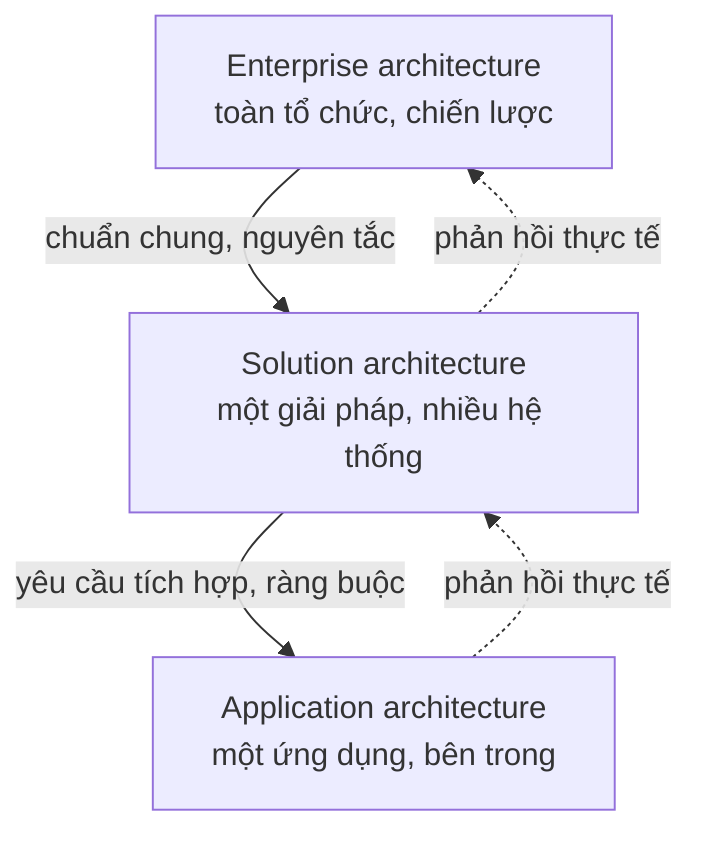
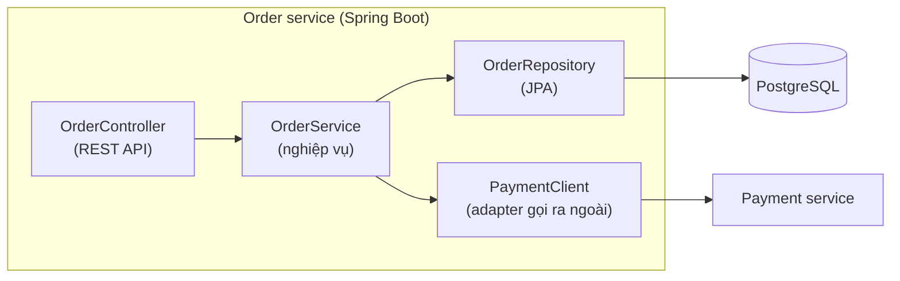
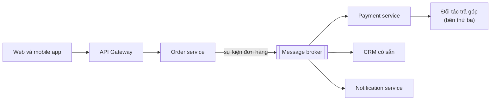
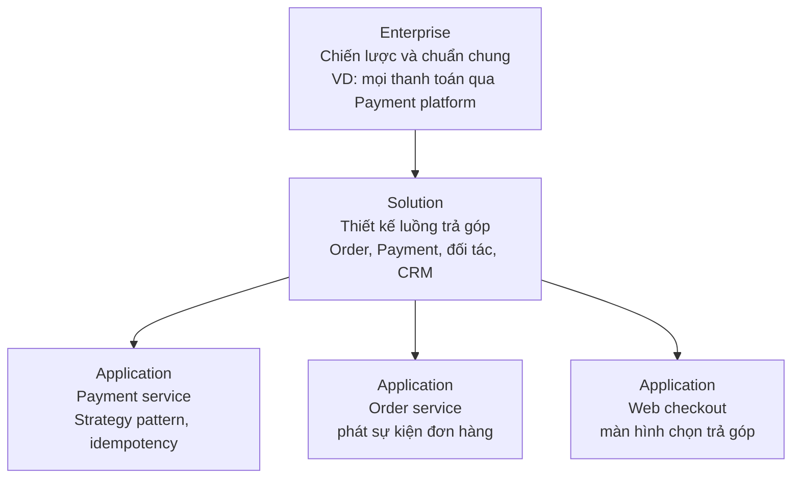

# Các cấp độ kiến trúc

**Các cấp độ kiến trúc** (levels of architecture) là cách chia công việc kiến trúc theo **phạm vi**: từ bên trong **một ứng dụng** (application architecture), tới **một giải pháp** gồm nhiều hệ thống phối hợp để giải một bài toán kinh doanh (solution architecture), tới **toàn bộ tổ chức** với hàng trăm hệ thống và chiến lược công nghệ dài hạn (enterprise architecture). Mỗi cấp trả lời những câu hỏi khác nhau, cho ra những sản phẩm khác nhau, và cần những kỹ năng khác nhau.

**Tương tự đơn giản:** Hãy nghĩ tới **quy hoạch đô thị**. **Kiến trúc sư công trình** thiết kế một toà nhà: mấy tầng, bố trí phòng, kết cấu (application). **Kiến trúc sư dự án** thiết kế cả một khu đô thị mới: các toà nhà, đường nội khu, trạm điện nước kết nối với nhau ra sao (solution). **Nhà quy hoạch thành phố** quyết định khu nào là công nghiệp, khu nào là dân cư, đường vành đai đi đâu, chuẩn chung về chiều cao và hạ tầng (enterprise). Cả ba đều là "kiến trúc", nhưng nhìn ở độ cao khác nhau.

---

:::note[Ghi nhớ nhanh]

- ⭐ **Ba cấp độ khác nhau ở phạm vi:** application = một ứng dụng, solution = một giải pháp nhiều hệ thống cho một nhu cầu kinh doanh, enterprise = toàn tổ chức.
- ⭐ **Càng lên cao càng gần kinh doanh, càng xa code:** enterprise nói về năng lực kinh doanh và chiến lược, application nói về module và pattern.
- **Application architecture:** cấu trúc bên trong một ứng dụng: layer, module, pattern, công nghệ.
- **Solution architecture:** ghép nhiều hệ thống (mới và có sẵn) thành giải pháp, tập trung vào tích hợp và đáp ứng yêu cầu dự án.
- **Enterprise architecture:** chuẩn hoá, danh mục ứng dụng, lộ trình chuyển đổi; khung phổ biến là **TOGAF**.

:::

---

## Mục lục

- [Vì sao cần phân cấp độ?](#vì-sao-cần-phân-cấp-độ)
- [1. Tổng quan ba cấp độ](#1-tổng-quan-ba-cấp-độ)
- [2. Application architecture](#2-application-architecture)
- [3. Solution architecture](#3-solution-architecture)
- [4. Enterprise architecture](#4-enterprise-architecture)
- [5. Một công ty, ba góc nhìn](#5-một-công-ty-ba-góc-nhìn)
- [6. TOGAF trong vài phút](#6-togaf-trong-vài-phút)
- [7. Các cấp độ phối hợp với nhau thế nào](#7-các-cấp-độ-phối-hợp-với-nhau-thế-nào)
- [Khi nào cần nhớ?](#khi-nào-cần-nhớ)
- [Lỗi thường gặp](#lỗi-thường-gặp)
- [Câu hỏi phỏng vấn](#câu-hỏi-phỏng-vấn)

---

## Vì sao cần phân cấp độ?

**Vấn đề:** Trong một công ty vừa và lớn, chữ "kiến trúc" bị dùng cho mọi thứ: từ "module này nên dùng Repository pattern" tới "năm năm tới công ty chuyển hết lên cloud". Hai câu hỏi này cần người khác nhau, thông tin khác nhau, thời gian khác nhau. Nếu lẫn lộn, ta sẽ thấy những buổi họp chiến lược sa vào bàn tên class, hoặc developer phải tự quyết chuyện tích hợp với hệ thống ERP của cả tập đoàn.

**Giải pháp:** Phân rõ **cấp độ** của từng quyết định để biết **ai quyết, dựa trên thông tin gì, đầu ra là gì, và quyết định ở cấp trên ràng buộc cấp dưới thế nào**. Một developer muốn lên kiến trúc sư cũng cần biết mình đang nhắm tới cấp nào, vì kỹ năng cần rèn khác nhau.

:::tip[Dùng thực tế]

- **Đọc mô tả công việc:** "solution architect" ở công ty tư vấn khác hẳn "application architect" ở công ty sản phẩm.
- **Trình bày thiết kế:** chọn đúng độ cao cho người nghe; ban giám đốc cần góc enterprise/solution, đội dev cần góc application.
- **Phân quyền quyết định:** cấp enterprise đặt chuẩn chung, cấp solution chọn cách tích hợp, cấp application tự quyết bên trong.
- **Định hướng sự nghiệp:** biết mình hợp với cấp nào để rèn đúng kỹ năng.

:::

---

## 1. Tổng quan ba cấp độ

| Tiêu chí | Application | Solution | Enterprise |
| --- | --- | --- | --- |
| **Phạm vi** | Một ứng dụng hoặc service | Một giải pháp gồm nhiều hệ thống | Toàn tổ chức |
| **Tầm nhìn thời gian** | Vài tháng tới 1–2 năm | Vòng đời một dự án/sản phẩm | Nhiều năm |
| **Gần với** | Code | Dự án, sản phẩm | Chiến lược kinh doanh |
| **Câu hỏi chính** | Bên trong chia thế nào? | Các hệ thống ghép với nhau thế nào? | Tổ chức cần những năng lực, hệ thống nào? |
| **Người làm việc cùng** | Developer, tech lead | Product, project manager, các đội | Ban lãnh đạo, CTO/CIO, các solution architect |
| **Độ chi tiết** | Cao | Trung bình | Thấp, khái quát |

---

## 2. Application architecture

**Application architecture** (kiến trúc ứng dụng) mô tả **cấu trúc bên trong một ứng dụng**: chia thành layer hay module nào, dùng pattern gì, phụ thuộc giữa các phần ra sao, công nghệ cụ thể nào.

**Câu hỏi điển hình:**

- Dùng kiểu **layered** (controller, service, repository) hay **hexagonal** (ports and adapters)?
- Chia module theo **tính năng** (feature) hay theo **tầng kỹ thuật**?
- State ở frontend quản lý thế nào? Có cần Redux hay React Query là đủ?
- Transaction đặt ở tầng nào? Xử lý lỗi thống nhất ra sao?

Ví dụ một backend Spring Boot cho phần đặt hàng:

**Sản phẩm đầu ra:**

- Sơ đồ component/container (mức 2–3 của mô hình C4, xem [Tài liệu kiến trúc](/docs/software-architect/02-important-skills/4_tai-lieu-kien-truc)).
- Quy ước cấu trúc thư mục, module, quy tắc phụ thuộc.
- ADR cho các lựa chọn như ORM, cách xác thực, cách xử lý lỗi.
- Test kiến trúc tự động (ví dụ ArchUnit trong Java, rule `eslint-plugin-boundaries` trong JS/TS).

Người làm cấp này thường là **tech lead** hoặc **application architect**, viết code khá nhiều.

---

## 3. Solution architecture

**Solution architecture** (kiến trúc giải pháp) thiết kế **một giải pháp cho một nhu cầu kinh doanh cụ thể**, thường gồm **nhiều hệ thống**: có hệ thống mới phải xây, có hệ thống sẵn có phải sửa, có dịch vụ bên thứ ba phải tích hợp.

**Câu hỏi điển hình:**

- Tính năng "trả góp" cần những hệ thống nào tham gia: web, app, order, payment, đối tác tài chính, CRM?
- Hệ thống A nói chuyện với B qua **REST**, **gRPC**, **message queue** hay **file batch**?
- Dữ liệu khách hàng lấy từ đâu là nguồn gốc (source of truth)?
- Giải pháp cần đạt yêu cầu phi chức năng nào, chi phí bao nhiêu, rủi ro gì?
- Mua (buy) hay tự xây (build)?

**Sản phẩm đầu ra:**

- **Solution design document**: bối cảnh, yêu cầu, phương án đã cân nhắc, phương án chọn, rủi ro.
- Sơ đồ tích hợp, luồng dữ liệu, sequence diagram cho luồng chính.
- Ước lượng chi phí hạ tầng, giấy phép, ước lượng công sức.
- Danh sách yêu cầu phi chức năng và cách đáp ứng.

Solution architect làm việc nhiều với **product manager, project manager, business analyst** và các tech lead. Ở công ty tư vấn hoặc nhà cung cấp phần mềm, solution architect còn tham gia **pre-sales**: hiểu bài toán khách hàng, đề xuất giải pháp, ước lượng để làm báo giá.

---

## 4. Enterprise architecture

**Enterprise architecture** (kiến trúc doanh nghiệp, EA) nhìn **toàn bộ tổ chức**: tổ chức cần những **năng lực kinh doanh** (business capabilities) nào, năng lực nào được hệ thống nào phục vụ, công nghệ chuẩn là gì, và làm sao đi từ hiện trạng tới trạng thái mong muốn trong vài năm.

**Câu hỏi điển hình:**

- Công ty đang có ba hệ thống CRM do ba lần sáp nhập, giữ cái nào, gộp thế nào?
- Chuẩn hoá trên ngôn ngữ, cloud, database nào để giảm chi phí và tăng khả năng chuyển người giữa các đội?
- Năng lực "quản lý khách hàng", "thanh toán", "logistics" đang được hệ thống nào đảm nhận, chỗ nào trùng lặp, chỗ nào thiếu?
- Lộ trình chuyển đổi số 3 năm gồm những bước nào?

| Khái niệm | Ý nghĩa |
| --- | --- |
| **Business capability map** | Bản đồ năng lực kinh doanh của tổ chức (bán hàng, kho, thanh toán, chăm sóc khách hàng…) |
| **Application portfolio** | Danh mục toàn bộ ứng dụng, mỗi ứng dụng phục vụ năng lực nào, tình trạng ra sao |
| **As-is / to-be** | Kiến trúc hiện tại và kiến trúc mục tiêu |
| **Roadmap** | Các bước chuyển từ as-is sang to-be |
| **Chuẩn và nguyên tắc** | "Mọi hệ thống mới chạy trên cloud", "dữ liệu khách hàng chỉ có một nguồn gốc" |
| **Governance** | Quy trình duyệt và kiểm tra các dự án có đi đúng chuẩn không |

Enterprise architect làm việc gần **ban lãnh đạo** (CTO, CIO, các giám đốc khối) và gần như không viết code. Kỹ năng quan trọng nhất ở cấp này là hiểu chiến lược kinh doanh, thương lượng và nhìn dài hạn.

---

## 5. Một công ty, ba góc nhìn

Lấy một công ty thương mại điện tử giả định, muốn thêm **thanh toán trả góp** (buy now, pay later). Cùng một sáng kiến, ba cấp độ nhìn như sau:

| Cấp | Câu hỏi họ đặt ra | Quyết định ví dụ |
| --- | --- | --- |
| **Enterprise** | Trả góp có nằm trong chiến lược năm nay? Năng lực "thanh toán" đang do hệ thống nào đảm nhận? Có chuẩn nào về đối tác tài chính, bảo mật dữ liệu? | Mọi tích hợp đối tác tài chính đi qua Payment platform chung; dữ liệu thẻ không lưu trong hệ thống nội bộ |
| **Solution** | Những hệ thống nào tham gia? Luồng đặt hàng trả góp ra sao? Đối tác trả góp nào, tích hợp kiểu gì? | Order phát sự kiện, Payment gọi API đối tác, kết quả gửi lại qua webhook; CRM nhận sự kiện để chăm sóc khách |
| **Application** | Trong Payment service, thêm phương thức trả góp thế nào để không phá các phương thức cũ? Xử lý webhook trùng lặp ra sao? | Dùng Strategy pattern cho các phương thức thanh toán; lưu idempotency key cho webhook |

Nhận xét: quyết định ở cấp trên trở thành **ràng buộc** cho cấp dưới. Đội Payment không được tự lưu số thẻ vì chuẩn enterprise cấm; nhưng cách tổ chức code bên trong Payment service thì đội tự quyết.

---

## 6. TOGAF trong vài phút

**TOGAF** (The Open Group Architecture Framework) là một khung (framework) phổ biến cho enterprise architecture, do tổ chức The Open Group phát triển. Không cần học thuộc TOGAF để làm kiến trúc sư, nhưng nên biết hai ý chính vì nó hay xuất hiện trong mô tả công việc và chứng chỉ:

**Bốn miền kiến trúc** (architecture domains):

| Miền | Nội dung |
| --- | --- |
| **Business architecture** | Chiến lược, tổ chức, quy trình kinh doanh |
| **Data architecture** | Cấu trúc dữ liệu, nguồn dữ liệu, quản trị dữ liệu |
| **Application architecture** | Các ứng dụng, chức năng và tương tác giữa chúng |
| **Technology architecture** | Hạ tầng phần cứng, phần mềm nền, mạng |

**ADM** (Architecture Development Method): một vòng lặp gồm các pha từ xác định tầm nhìn, phân tích các miền kiến trúc, lập kế hoạch chuyển đổi, tới quản trị triển khai và quản lý thay đổi. Ý tưởng cốt lõi: kiến trúc doanh nghiệp là **quá trình lặp lại liên tục**, không phải một tài liệu làm một lần.

Ngoài TOGAF còn có các khung như Zachman, và các chứng chỉ khác mà roadmap.sh liệt kê (BABOK, IAF…), sẽ đề cập ở các đợt sau.

---

## 7. Các cấp độ phối hợp với nhau thế nào

Các cấp độ không phải là "cấp trên ra lệnh, cấp dưới làm theo". Chúng phối hợp hai chiều:

- **Từ trên xuống:** enterprise đặt chuẩn và nguyên tắc, solution chọn cách ghép hệ thống trong khuôn khổ đó, application hiện thực bên trong.
- **Từ dưới lên:** application báo lại điều không khả thi ("thư viện chuẩn của công ty không hỗ trợ tính năng X"), solution báo lại rủi ro và chi phí thật, enterprise điều chỉnh chuẩn.

Ở công ty nhỏ, **một người đội cả ba mũ**: CTO vừa quyết chiến lược công nghệ, vừa thiết kế tích hợp, vừa review code. Điều quan trọng không phải là có đủ ba chức danh, mà là **biết mình đang ra quyết định ở cấp nào** để chọn đúng mức chi tiết và đúng người cần hỏi.

---

## Khi nào cần nhớ?

- **Khi nhận một yêu cầu "thiết kế kiến trúc":** hỏi ngay "ở cấp nào?" để biết mức chi tiết và đầu ra cần có.
- **Khi trình bày:**
  - Ban lãnh đạo: góc enterprise/solution, nói về năng lực, chi phí, rủi ro.
  - Đội dev: góc application, nói về module, API, pattern.
- **Khi gặp xung đột:** một quyết định application mâu thuẫn chuẩn enterprise thì cần nâng lên đúng cấp để giải quyết, không tự lách.
- **Khi định hướng sự nghiệp:**
  - Thích code và chất lượng code: application architect.
  - Thích ghép hệ thống và làm việc với business: solution architect.
  - Thích chiến lược và tổ chức: enterprise architect.

---

## Lỗi thường gặp

### Lỗi 1: Sai độ cao khi trình bày

Mang sơ đồ class lên buổi họp với giám đốc, hoặc mang bản đồ năng lực kinh doanh vào buổi planning của đội dev. Người nghe không nhận được thông tin họ cần để ra quyết định.

### Lỗi 2: Cấp trên quyết thay cấp dưới

Enterprise architect quy định cả cấu trúc package của từng service. Đội mất chủ động, quyết định thường không hợp thực tế.

### Lỗi 3: Cấp dưới bỏ qua chuẩn chung

Mỗi đội tự chọn message broker, cách xác thực, cách log. Từng ứng dụng thì ổn, nhưng cả tổ chức trả giá đắt khi tích hợp, vận hành và bảo mật.

### Lỗi 4: Coi enterprise architecture là tài liệu làm một lần

Vẽ một bản đồ hệ thống đẹp rồi để đó. Sau một năm, tổ chức đã đổi khác và tài liệu không còn ai tin.

### Lỗi 5: Solution design bỏ quên hệ thống có sẵn

Thiết kế giải pháp như thể bắt đầu từ con số không, rồi phát hiện muộn rằng phải tích hợp với ERP cũ, có giới hạn tốc độ gọi API và chỉ nhận file theo lô hằng đêm.

---

## Câu hỏi phỏng vấn

Những câu thường gặp về chủ đề này. Tự trả lời trước, rồi bấm **Xem đáp án** để đối chiếu.

**1. Phân biệt application, solution và enterprise architecture.**

Xem đáp án

- **Application:** cấu trúc bên trong một ứng dụng (layer, module, pattern, công nghệ), gần code nhất.
- **Solution:** thiết kế một giải pháp cho một nhu cầu kinh doanh, ghép nhiều hệ thống mới và cũ, tập trung vào tích hợp, yêu cầu phi chức năng, chi phí.
- **Enterprise:** toàn tổ chức, năng lực kinh doanh, danh mục ứng dụng, chuẩn công nghệ và lộ trình nhiều năm.

Cấp trên đặt ràng buộc cho cấp dưới, cấp dưới phản hồi thực tế lên cấp trên.

**2. Solution architect thường tạo ra những sản phẩm gì?**

Xem đáp án

Solution design document (bối cảnh, yêu cầu, phương án, lựa chọn, rủi ro), sơ đồ tích hợp và luồng dữ liệu, sequence diagram cho luồng chính, danh sách yêu cầu phi chức năng và cách đáp ứng, ước lượng chi phí và công sức, đôi khi là phân tích mua hay tự xây.

**3. TOGAF là gì? Bốn miền kiến trúc trong TOGAF là gì?**

Xem đáp án

TOGAF là khung enterprise architecture của The Open Group, có phương pháp ADM là một vòng lặp phát triển kiến trúc. Bốn miền: business, data, application và technology architecture.

**4. Ở công ty nhỏ không có enterprise architect thì sao?**

Xem đáp án

Các câu hỏi của cấp enterprise vẫn tồn tại (chuẩn công nghệ, nguồn gốc dữ liệu, chọn mua hay xây), chỉ là do CTO hoặc kiến trúc sư/tech lead cấp cao đảm nhận. Điều quan trọng là nhận ra mình đang quyết ở cấp nào để chọn mức chi tiết, thời gian cân nhắc và người cần tham gia phù hợp.

**5. Một đội muốn dùng công nghệ khác chuẩn chung của công ty. Bạn xử lý thế nào?**

Xem đáp án

Không cấm ngay cũng không cho lách. Hỏi lý do và yêu cầu cụ thể mà chuẩn hiện tại không đáp ứng, đánh giá chi phí lâu dài (vận hành, tuyển người, bảo mật, tích hợp), rồi nâng lên đúng cấp quyết định. Nếu lý do chính đáng, có thể chấp nhận như ngoại lệ có ghi ADR, hoặc cập nhật chính chuẩn chung.

