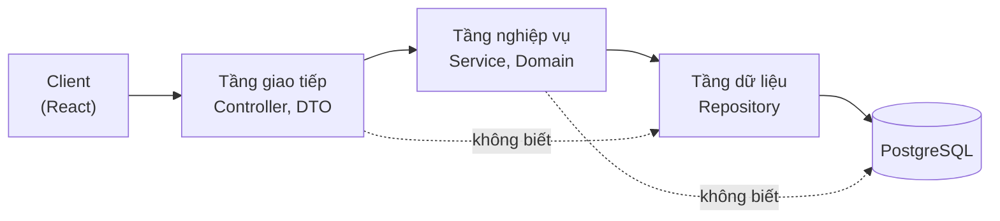
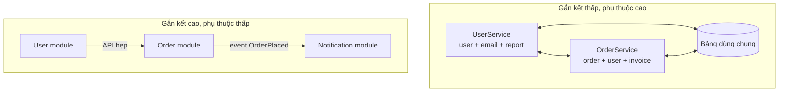
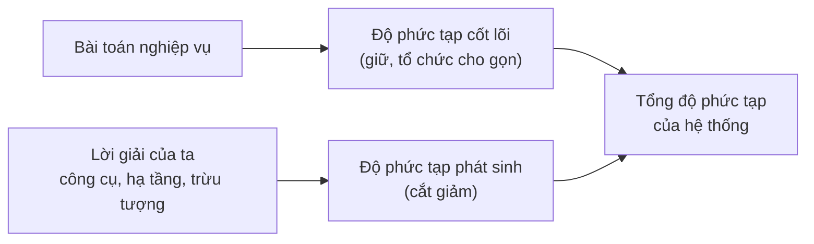
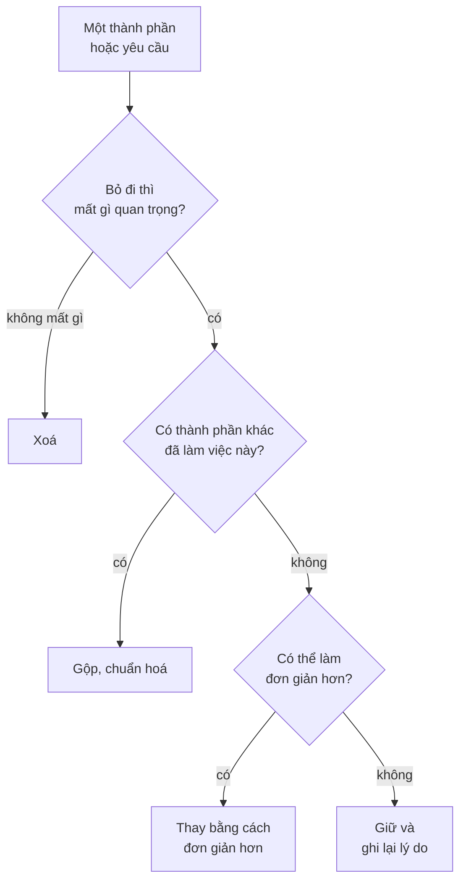

# Thiết kế và đơn giản hoá

**Thiết kế kiến trúc** (design & architecture) là việc chia một hệ thống thành các **thành phần** (component, module, service), quy định **trách nhiệm** của từng phần và **cách chúng phụ thuộc, giao tiếp** với nhau. **Đơn giản hoá** (simplifying things) là kỹ năng song sinh với nó: liên tục gỡ bỏ những phần phức tạp không cần thiết để hệ thống dễ hiểu, dễ sửa, dễ vận hành. Một kiến trúc sư giỏi không phải người vẽ được sơ đồ phức tạp nhất, mà là người tìm ra **lời giải đơn giản nhất vẫn đáp ứng được yêu cầu**.

**Tương tự đơn giản:** Thiết kế một căn bếp. Bếp tốt chia rõ **khu sơ chế, khu nấu, khu rửa**, mỗi khu có đủ đồ của riêng nó (gắn kết cao) và đi lại giữa các khu ít nhất có thể (phụ thuộc thấp). Bếp tồi là bếp mua đủ 30 thiết bị "phòng khi cần", tủ nào cũng chứa lẫn lộn, muốn lấy con dao phải mở ba ngăn. Đơn giản hoá là dọn bớt đồ không dùng, chứ không phải mua thêm tủ để chứa chúng.

---

:::note[Ghi nhớ nhanh]

- ⭐ **Gắn kết cao, phụ thuộc thấp** (high cohesion, low coupling) — những gì thay đổi cùng nhau thì để cùng chỗ; giữa các phần chỉ nói chuyện qua giao diện hẹp.
- ⭐ **Phân biệt độ phức tạp cốt lõi và phát sinh** — cốt lõi đến từ bài toán (không bỏ được), phát sinh đến từ cách ta giải (bỏ được và nên bỏ).
- **Tách mối quan tâm** (separation of concerns) và **che giấu thông tin** (information hiding) giúp sửa một chỗ không lan ra cả hệ thống.
- **KISS và YAGNI** — chọn lời giải đơn giản nhất chạy được; đừng xây thứ "sau này có thể cần".
- **Định luật Gall** — hệ thống phức tạp chạy được luôn tiến hoá từ một hệ thống đơn giản chạy được.

:::

---

## Mục lục

- [Vì sao cần thiết kế và đơn giản hoá?](#vì-sao-cần-thiết-kế-và-đơn-giản-hoá)
- [1. Thiết kế khác kiến trúc ở đâu?](#1-thiết-kế-khác-kiến-trúc-ở-đâu)
- [2. Tách mối quan tâm](#2-tách-mối-quan-tâm)
- [3. Gắn kết cao, phụ thuộc thấp](#3-gắn-kết-cao-phụ-thuộc-thấp)
- [4. Mô-đun hoá và che giấu thông tin](#4-mô-đun-hoá-và-che-giấu-thông-tin)
- [5. Độ phức tạp cốt lõi và phát sinh](#5-độ-phức-tạp-cốt-lõi-và-phát-sinh)
- [6. KISS, YAGNI và định luật Gall](#6-kiss-yagni-và-định-luật-gall)
- [7. Kỹ thuật đơn giản hoá](#7-kỹ-thuật-đơn-giản-hoá)
- [8. Ví dụ over-engineering](#8-ví-dụ-over-engineering)
- [Khi nào cần nhớ?](#khi-nào-cần-nhớ)
- [Lỗi thường gặp](#lỗi-thường-gặp)
- [Câu hỏi phỏng vấn](#câu-hỏi-phỏng-vấn)

---

## Vì sao cần thiết kế và đơn giản hoá?

**Vấn đề:** Hầu hết hệ thống không chết vì thiếu tính năng mà chết vì **quá khó thay đổi**. Sau một hai năm, thêm một trường vào form phải sửa 12 file ở 4 service, mỗi lần deploy là một lần hồi hộp, người mới mất ba tháng mới dám sửa code. Nguyên nhân thường không phải một quyết định tồi lớn, mà là hàng trăm quyết định nhỏ cộng dồn: thêm một lớp trừu tượng "cho linh hoạt", thêm một service "cho dễ scale", thêm một thư viện "cho tiện".

**Giải pháp:** Áp dụng có ý thức vài nguyên tắc thiết kế (tách mối quan tâm, gắn kết cao, phụ thuộc thấp, che giấu thông tin) để giới hạn **bán kính ảnh hưởng** của mỗi thay đổi; đồng thời coi độ phức tạp là **chi phí** phải biện minh, chứ không phải thành tích. Mỗi thành phần mới phải trả lời được câu hỏi: "nếu bỏ nó đi thì mất gì?".

:::tip[Dùng thực tế]

- **Chia module trong monolith:** tổ chức theo nghiệp vụ (`order`, `payment`, `catalog`) thay vì theo kỹ thuật (`controllers`, `services`, `repositories`).
- **Quyết định tách service:** chỉ tách khi có lý do cụ thể (đội riêng, nhu cầu scale riêng, vòng đời deploy riêng).
- **Review design doc:** hỏi "phần nào là cốt lõi của bài toán, phần nào là do ta tự thêm?".
- **Dọn dẹp định kỳ:** xoá feature flag cũ, code chết, thư viện trùng chức năng.

:::

---

## 1. Thiết kế khác kiến trúc ở đâu?

Ranh giới giữa **thiết kế** (design) và **kiến trúc** (architecture) không cứng. Một cách nhìn thực dụng: kiến trúc là những quyết định **đắt khi thay đổi** và **ảnh hưởng rộng**; thiết kế là những quyết định **rẻ hơn, cục bộ hơn**.

| | Kiến trúc | Thiết kế |
| --- | --- | --- |
| **Phạm vi** | Cả hệ thống hoặc nhiều thành phần | Bên trong một thành phần, một module |
| **Chi phí thay đổi** | Cao: chạm nhiều đội, nhiều hệ thống, dữ liệu persist | Thấp hơn: thường gói gọn trong một repo |
| **Ví dụ** | Monolith hay microservices, SQL hay NoSQL, đồng bộ hay qua message queue | Dùng Strategy pattern, tách class, đặt tên hàm |
| **Ai quyết** | Kiến trúc sư cùng tech lead, có ghi lại (ADR) | Developer, qua code review |

Các nguyên tắc dưới đây áp dụng được **ở cả hai cấp**: cùng ý tưởng "gắn kết cao, phụ thuộc thấp" dùng được cho một class, một module và cho cả một hệ thống nhiều service.

---

## 2. Tách mối quan tâm

**Tách mối quan tâm** (separation of concerns, SoC) nghĩa là mỗi phần của hệ thống lo **một khía cạnh** riêng, để thay đổi khía cạnh này không buộc phải sửa khía cạnh kia.

Ví dụ cấp ứng dụng với Spring Boot: controller lo giao thức HTTP, service lo nghiệp vụ, repository lo lưu trữ. Đổi từ REST sang gRPC chỉ đụng tầng ngoài; đổi từ PostgreSQL sang MongoDB chỉ đụng tầng trong.



Ở cấp hệ thống, SoC xuất hiện dưới dạng: tách **xác thực** ra API gateway, tách **gửi email** ra worker riêng, tách **đọc và ghi** (CQRS) khi hai luồng có yêu cầu rất khác nhau.

Lưu ý: tách mối quan tâm **không** có nghĩa là tách càng nhiều càng tốt. Mỗi ranh giới là một chỗ phải định nghĩa giao diện, chuyển đổi dữ liệu, xử lý lỗi. Tách khi hai khía cạnh **thật sự thay đổi vì những lý do khác nhau**.

---

## 3. Gắn kết cao, phụ thuộc thấp

- **Gắn kết** (cohesion): mức độ các phần tử bên trong một module **liên quan tới nhau**. Gắn kết cao nghĩa là mọi thứ trong module phục vụ cùng một mục đích.
- **Phụ thuộc / ghép nối** (coupling): mức độ một module **phải biết về** module khác. Phụ thuộc thấp nghĩa là module chỉ biết một giao diện nhỏ, ổn định của module kia.

| Loại ghép nối | Mô tả | Mức độ |
| --- | --- | --- |
| **Qua dữ liệu dùng chung** | Hai service cùng đọc/ghi một bảng database | Rất chặt, đổi schema là vỡ cả hai |
| **Qua nội bộ** | Module A gọi thẳng class nội bộ của module B | Chặt |
| **Qua API đồng bộ** | A gọi REST/gRPC của B | Vừa: phụ thuộc thời gian chạy (B chết thì A lỗi) |
| **Qua sự kiện** | A phát event, B tự nghe | Lỏng: A không cần biết B tồn tại |



Một phép thử nhanh: khi một yêu cầu nghiệp vụ thay đổi, bạn phải sửa **bao nhiêu module**? Nếu thường xuyên phải sửa đồng loạt nhiều module, ranh giới đang đặt sai chỗ: những thứ thay đổi cùng nhau đang bị chia ra.

---

## 4. Mô-đun hoá và che giấu thông tin

**Mô-đun hoá** (modularity) là chia hệ thống thành các khối có ranh giới rõ. **Che giấu thông tin** (information hiding) là ý tưởng của David Parnas (bài báo năm 1972): mỗi module nên **giấu đi một quyết định thiết kế có khả năng thay đổi**, và chỉ lộ ra một giao diện không phụ thuộc vào quyết định đó.

Ví dụ: module `payment` giấu việc đang dùng Stripe hay VNPay. Phần còn lại của hệ thống chỉ thấy:

```java
// Java: giao diện công khai của module payment, không lộ nhà cung cấp
public interface PaymentGateway {
    PaymentResult charge(OrderId orderId, Money amount);
    void refund(PaymentId paymentId);
}

// Chi tiết nhà cung cấp nằm bên trong module, có thể đổi mà không ai biết
class VnpayPaymentGateway implements PaymentGateway {
    // ... gọi API VNPay, ánh xạ mã lỗi về PaymentResult
}
```

Với Node.js/TypeScript, có thể làm tương tự bằng cách chỉ export từ file `index.ts` của mỗi module, và dùng quy tắc lint (ví dụ `eslint-plugin-boundaries` hay cấu hình `no-restricted-imports`) để cấm import sâu vào bên trong module khác.

**Modular monolith** (monolith chia module rõ ràng) là cách áp dụng mô-đun hoá phổ biến và rẻ: một codebase, một lần deploy, nhưng ranh giới module được tôn trọng như ranh giới service. Khi thật sự cần tách service, ranh giới đã sẵn.

---

## 5. Độ phức tạp cốt lõi và phát sinh

Trong bài luận *No Silver Bullet* (1986), Fred Brooks phân biệt hai loại độ phức tạp:

- **Độ phức tạp cốt lõi** (essential complexity): đến từ **chính bài toán**. Luật thuế có 40 trường hợp ngoại lệ thì phần mềm tính thuế phải xử lý đủ 40 trường hợp. Không bỏ được, chỉ tổ chức cho gọn.
- **Độ phức tạp phát sinh** (accidental complexity): đến từ **cách ta giải**: công cụ, framework, hạ tầng, các lớp trừu tượng ta tự thêm. Bỏ được, và việc của kiến trúc sư là bỏ bớt nó.

| Nguồn phức tạp | Cốt lõi hay phát sinh? |
| --- | --- |
| Quy tắc khuyến mãi chồng nhau của bộ phận marketing | Cốt lõi (nhưng có thể đàm phán lại với business) |
| Đồng bộ tồn kho giữa nhiều kho hàng thật | Cốt lõi |
| 7 microservice cho một app 3 developer | Phát sinh |
| Ba thư viện quản lý state khác nhau trong một app React | Phát sinh |
| Mapper chuyển DTO qua 4 lớp giống hệt nhau | Phát sinh |



Một điểm tinh tế: đôi khi độ phức tạp "cốt lõi" thật ra là **yêu cầu chưa được xem xét kỹ**. Kiến trúc sư giỏi hỏi lại business: "trường hợp này xảy ra bao nhiêu lần một năm? Xử lý tay có được không?". Bớt một yêu cầu hiếm gặp đôi khi tiết kiệm hàng tháng làm việc.

---

## 6. KISS, YAGNI và định luật Gall

| Nguyên tắc | Nội dung | Câu hỏi để tự kiểm |
| --- | --- | --- |
| **KISS** (Keep It Simple, Stupid) | Chọn lời giải đơn giản nhất đáp ứng được yêu cầu | "Có cách nào ít thành phần hơn mà vẫn đạt yêu cầu?" |
| **YAGNI** (You Aren't Gonna Need It) | Đừng xây tính năng hay lớp trừu tượng cho nhu cầu tương lai chưa có | "Yêu cầu này có thật hôm nay, hay chỉ là dự đoán?" |
| **Định luật Gall** (Gall's law) | Hệ thống phức tạp chạy được luôn tiến hoá từ hệ thống đơn giản chạy được; hệ thống phức tạp thiết kế từ đầu thường không chạy được | "Phiên bản đơn giản nhất chạy được là gì?" |

YAGNI không có nghĩa là bỏ qua tương lai. Nó có nghĩa là **không trả trước chi phí** cho tương lai không chắc chắn, nhưng vẫn **giữ cửa mở**: tách module rõ ràng, che giấu thông tin, để sau này thay đổi được rẻ. Phân biệt:

- **Xây trước** (vi phạm YAGNI): dựng sẵn Kafka cho "khi nào có triệu user".
- **Giữ cửa mở** (hợp lý): gửi event qua một interface `EventPublisher`; hôm nay cài đặt bằng gọi hàm trực tiếp hoặc bảng outbox, mai đổi sang Kafka chỉ cần đổi phần cài đặt.

---

## 7. Kỹ thuật đơn giản hoá

Đơn giản hoá là một kỹ năng có thể luyện, không phải năng khiếu. Vài kỹ thuật cụ thể:

1. **Bỏ bớt** (remove): câu hỏi mạnh nhất là "nếu xoá cái này thì chuyện gì xảy ra?". Feature flag đã bật 100% sáu tháng, endpoint không ai gọi, cột database không ai đọc: xoá.
2. **Chia nhỏ** (decompose): một quy trình 15 bước khó hiểu có thể là 3 giai đoạn, mỗi giai đoạn 5 bước. Chia theo **nghiệp vụ**, không chia theo kỹ thuật.
3. **Chuẩn hoá** (standardize): một cách làm cho một loại việc. Một cách gọi HTTP, một cách log, một cách xử lý lỗi, một ngôn ngữ backend nếu được. Mỗi biến thể thêm vào là thêm một thứ để học, để vá lỗi bảo mật.
4. **Dùng thứ nhàm chán** (choose boring technology): công nghệ đã chín muồi có ít bất ngờ hơn. Dùng PostgreSQL cho đến khi có lý do rõ ràng để dùng thứ khác.
5. **Đẩy độ phức tạp về một chỗ**: thay vì mỗi service tự xử lý retry, timeout, xác thực, dồn về một thư viện chung hoặc gateway.
6. **Hỏi lại yêu cầu**: nhiều độ phức tạp đến từ yêu cầu mà chính người đặt ra cũng không cần đến mức đó.



---

## 8. Ví dụ over-engineering

**Over-engineering** (thiết kế quá mức) là khi lời giải phức tạp hơn nhiều so với bài toán. Một tình huống quen thuộc:

> Một startup 4 developer làm app đặt lịch spa. Kiến trúc đề xuất: 9 microservice, Kafka, Kubernetes, service mesh, mỗi service một database, GraphQL federation ở giữa.

| Khía cạnh | Thiết kế quá mức | Thiết kế vừa đủ |
| --- | --- | --- |
| **Số đơn vị deploy** | 9 service + hạ tầng đi kèm | 1 modular monolith (Spring Boot hoặc NestJS) |
| **Database** | 9 database, đồng bộ qua event | 1 PostgreSQL, mỗi module một schema |
| **Giao tiếp** | Kafka + GraphQL federation | Gọi hàm qua interface giữa các module |
| **Vận hành** | Cần người lo Kubernetes, tracing phân tán | Một app, một pipeline CI/CD |
| **Khi cần tách** | Đã tách sẵn, nhưng trả giá từ ngày đầu | Tách module `booking` ra service khi có đội riêng hoặc tải riêng |

Dấu hiệu nhận biết over-engineering:

- Lý do được nêu là "sau này", "phòng khi", "các công ty lớn đều làm thế".
- Có nhiều lớp trừu tượng chỉ có **một cài đặt duy nhất** và không có kế hoạch thêm.
- Đội dành nhiều thời gian cho hạ tầng hơn cho nghiệp vụ.
- Không ai trong đội giải thích được toàn bộ luồng một request đi qua những đâu.

Ngược lại, **under-engineering** (thiết kế thiếu) cũng có thật: không có ranh giới module nào, mọi thứ gọi lẫn nhau, không test. Mục tiêu là **vừa đủ cho ràng buộc hiện tại, và rẻ để thay đổi khi ràng buộc đổi**.

---

## Khi nào cần nhớ?

- **Khi bắt đầu một hệ thống mới:**
  - Bắt đầu từ phiên bản đơn giản nhất chạy được (định luật Gall).
  - Chia module theo nghiệp vụ ngay từ đầu, kể cả trong monolith.
- **Khi review đề xuất kiến trúc:**
  - Với mỗi thành phần mới, hỏi "bỏ đi thì mất gì?".
  - Tách độ phức tạp cốt lõi và phát sinh ra hai cột.
- **Khi hệ thống trở nên khó sửa:**
  - Đếm số module phải sửa cho một thay đổi nghiệp vụ điển hình.
  - Tìm chỗ ghép nối qua dữ liệu dùng chung.
- **Best practice:**
  - Ưu tiên công nghệ nhàm chán, đã chín muồi.
  - Giữ cửa mở bằng ranh giới rõ, không bằng việc xây trước.
  - Dọn dẹp định kỳ: code chết, flag cũ, thư viện trùng lặp.

---

## Lỗi thường gặp

### Lỗi 1: Nhầm "nhiều thành phần" với "kiến trúc tốt"

Sơ đồ nhiều hộp trông chuyên nghiệp, nhưng mỗi hộp là một thứ phải deploy, giám sát, bảo mật, và mỗi mũi tên là một chỗ có thể lỗi mạng. Đo kiến trúc bằng khả năng đáp ứng yêu cầu và chi phí thay đổi, không bằng số hộp.

### Lỗi 2: Chia module theo kỹ thuật thay vì nghiệp vụ

Thư mục `controllers/`, `services/`, `repositories/` ở cấp cao nhất khiến mỗi tính năng nằm rải ở ba nơi. Chia theo nghiệp vụ (`order/`, `payment/`) để những gì thay đổi cùng nhau nằm cùng nhau.

### Lỗi 3: Tạo lớp trừu tượng cho thứ chỉ có một cài đặt

`IUserService` với đúng một `UserServiceImpl`, `AbstractBaseRepositoryFactory` không ai mở rộng. Lớp trừu tượng có giá khi nó **che giấu một quyết định có khả năng thay đổi** (như nhà cung cấp thanh toán), không phải theo thói quen.

### Lỗi 4: Microservices dùng chung database

Tách code ra nhiều service nhưng vẫn cùng đọc ghi các bảng chung: nhận đủ chi phí của hệ phân tán mà không được lợi ích độc lập. Đây là **distributed monolith** (monolith phân tán), tệ hơn cả monolith thường.

### Lỗi 5: Đơn giản hoá bằng cách bỏ qua độ phức tạp cốt lõi

Đơn giản hoá không phải là lờ đi trường hợp khó. Nếu nghiệp vụ thật sự có hoàn tiền một phần, đổi lịch, huỷ muộn có phí, hệ thống phải xử lý được; việc của ta là tổ chức chúng gọn gàng, không phải giả vờ chúng không tồn tại.

---

## Câu hỏi phỏng vấn

Những câu thường gặp về chủ đề này. Tự trả lời trước, rồi bấm **Xem đáp án** để đối chiếu.

**1. Coupling và cohesion là gì? Vì sao muốn "cohesion cao, coupling thấp"?**

<details className="qa">
<summary>Xem đáp án</summary>

- **Cohesion:** mức độ các phần tử trong một module cùng phục vụ một mục đích.
- **Coupling:** mức độ một module phải biết về module khác.

Cohesion cao giúp một thay đổi nghiệp vụ chỉ chạm một module; coupling thấp giúp thay đổi trong module đó không lan sang module khác. Kết quả: thay đổi nhanh hơn, ít rủi ro hơn, các đội làm việc song song ít dẫm chân nhau.

</details>

**2. Essential complexity và accidental complexity khác nhau thế nào? Cho ví dụ.**

<details className="qa">
<summary>Xem đáp án</summary>

Theo Fred Brooks: **essential** đến từ bài toán (quy tắc tính thuế, quy trình hoàn tiền), không thể bỏ, chỉ tổ chức cho gọn. **Accidental** đến từ lời giải (quá nhiều service, framework chồng chéo, lớp mapper thừa), có thể và nên giảm.

Kiến trúc sư giảm accidental complexity, và đôi khi giảm cả essential complexity bằng cách đàm phán lại yêu cầu với business.

</details>

**3. YAGNI có mâu thuẫn với việc thiết kế cho tương lai không?**

<details className="qa">
<summary>Xem đáp án</summary>

Không, nếu phân biệt **xây trước** và **giữ cửa mở**. YAGNI cấm trả trước chi phí cho nhu cầu chưa chắc có (dựng Kafka, sharding khi chưa cần). Nhưng ta vẫn nên giữ cho thay đổi tương lai rẻ: ranh giới module rõ, giao diện che giấu chi tiết cài đặt, test tốt. Khi nhu cầu thật xuất hiện, ta thay cài đặt thay vì viết lại.

</details>

**4. Khi nào bạn tách một module trong monolith thành service riêng?**

<details className="qa">
<summary>Xem đáp án</summary>

Khi có lý do cụ thể mà tách mới giải quyết được, ví dụ:

- Một đội riêng cần deploy độc lập với nhịp riêng.
- Module có nhu cầu tải hoặc tài nguyên rất khác phần còn lại (xử lý ảnh, tìm kiếm).
- Yêu cầu cô lập về bảo mật hoặc tuân thủ (dữ liệu thanh toán).
- Cần công nghệ khác hẳn.

Và chỉ tách khi ranh giới module đã ổn định; tách ranh giới còn đang thay đổi sẽ tạo distributed monolith.

</details>

**5. Bạn nhận ra một đề xuất kiến trúc là over-engineering bằng cách nào?**

<details className="qa">
<summary>Xem đáp án</summary>

- Lý do dựa trên "sau này", "phòng khi", "công ty lớn làm thế" thay vì yêu cầu hiện tại.
- Số thành phần hạ tầng lớn so với quy mô đội và tải.
- Nhiều lớp trừu tượng chỉ có một cài đặt.
- Không mô tả được phiên bản đơn giản hơn đã được cân nhắc và vì sao bị loại.

Cách xử lý: yêu cầu so sánh với một phương án đơn giản hơn, nêu rõ ràng buộc nào khiến phương án đơn giản không đủ.

</details>
