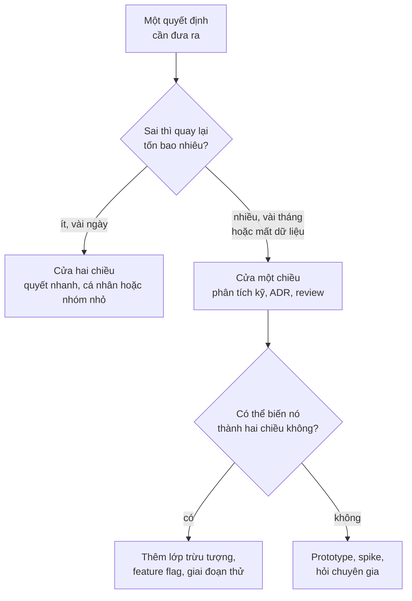
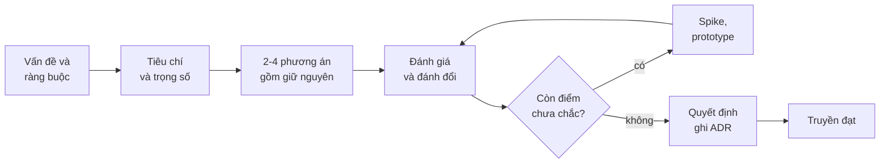
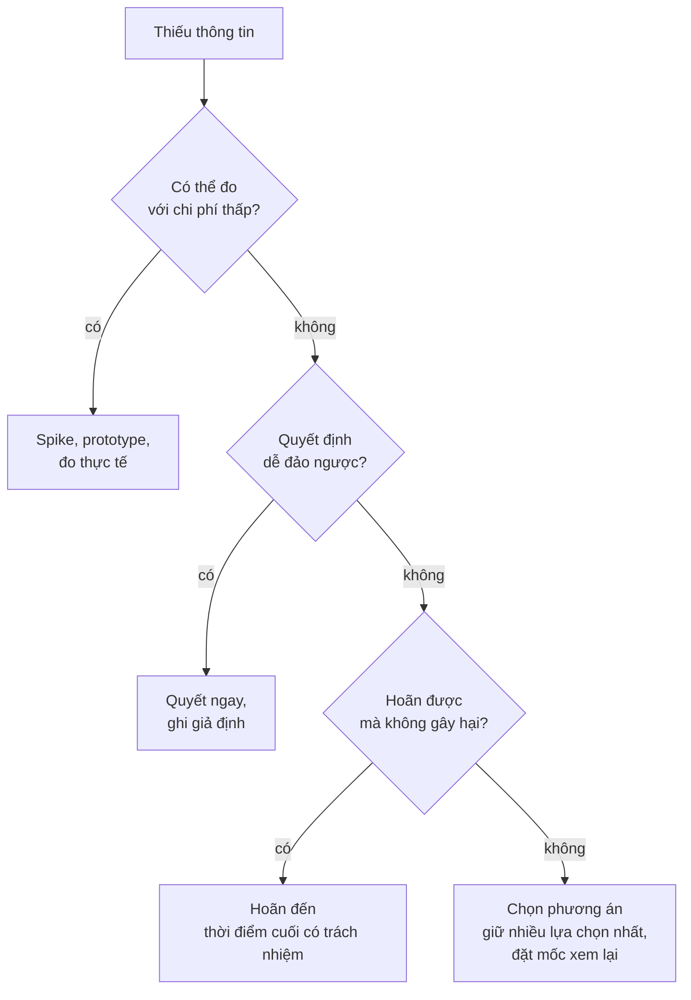

# Ra quyết định

**Ra quyết định** (decision making) là phần cốt lõi nhất trong công việc của kiến trúc sư: chọn giữa các phương án kỹ thuật khi **không có phương án nào hoàn hảo**. Mỗi lựa chọn là một **sự đánh đổi** (trade-off): được thêm thứ này thì mất bớt thứ kia. Kỹ năng ở đây không phải là "luôn chọn đúng", mà là **chọn có lý do, chọn đúng lúc, ghi lại lý do** để sau này người khác (và chính bạn) hiểu vì sao hệ thống lại như thế.

**Tương tự đơn giản:** Chọn nhà để thuê. Nhà gần công ty thì đắt và chật, nhà rộng rẻ thì xa. Không có căn "tốt nhất", chỉ có căn hợp nhất với ngân sách, thời gian đi lại và việc bạn có con nhỏ hay không. Người chọn giỏi biết rõ mình ưu tiên gì, so sánh vài căn theo cùng tiêu chí, và biết hợp đồng nào ký một năm thì dễ đổi, còn mua nhà thì khó quay lại.

---

:::note[Ghi nhớ nhanh]

- ⭐ **Mọi quyết định kiến trúc là đánh đổi** — nếu bạn chưa tìm ra nhược điểm của phương án mình chọn, bạn chưa phân tích đủ.
- ⭐ **Phân loại quyết định trước khi quyết** — quyết định khó đảo ngược (cửa một chiều) cần phân tích kỹ; quyết định dễ đảo ngược (cửa hai chiều) nên quyết nhanh.
- **Thời điểm có trách nhiệm cuối cùng** (last responsible moment) — hoãn quyết định khó đảo ngược đến lúc có nhiều thông tin nhất, nhưng không trễ hơn lúc việc hoãn bắt đầu gây hại.
- **ADR** (Architecture Decision Record) — ghi mỗi quyết định quan trọng thành một file ngắn: bối cảnh, quyết định, hệ quả.
- **Đồng thuận không bắt buộc, nhưng lắng nghe thì bắt buộc** — "disagree and commit" khi đã nghe đủ ý kiến.

:::

---

## Mục lục

- [Vì sao cần học cách ra quyết định?](#vì-sao-cần-học-cách-ra-quyết-định)
- [1. Mọi thứ là đánh đổi](#1-mọi-thứ-là-đánh-đổi)
- [2. Cửa một chiều và cửa hai chiều](#2-cửa-một-chiều-và-cửa-hai-chiều)
- [3. Thời điểm có trách nhiệm cuối cùng](#3-thời-điểm-có-trách-nhiệm-cuối-cùng)
- [4. Quy trình ra quyết định](#4-quy-trình-ra-quyết-định)
- [5. Ma trận lựa chọn có trọng số](#5-ma-trận-lựa-chọn-có-trọng-số)
- [6. Architecture Decision Record](#6-architecture-decision-record)
- [7. RFC và design doc](#7-rfc-và-design-doc)
- [8. Quyết định khi thiếu thông tin](#8-quyết-định-khi-thiếu-thông-tin)
- [9. Đồng thuận và quyết định](#9-đồng-thuận-và-quyết-định)
- [Khi nào cần nhớ?](#khi-nào-cần-nhớ)
- [Lỗi thường gặp](#lỗi-thường-gặp)
- [Câu hỏi phỏng vấn](#câu-hỏi-phỏng-vấn)

---

## Vì sao cần học cách ra quyết định?

**Vấn đề:** Các đội kỹ thuật thường mắc một trong hai bệnh. Bệnh thứ nhất là **tê liệt vì phân tích**: ba tuần tranh luận Kafka hay RabbitMQ cho một hệ thống mỗi ngày vài nghìn message. Bệnh thứ hai là **quyết theo cảm tính**: chọn MongoDB vì "đang hot", hai năm sau mới phát hiện dữ liệu toàn quan hệ và phải viết join bằng tay. Tệ hơn nữa, sau một năm không ai nhớ **vì sao** đã chọn như vậy, nên người mới hoặc giữ nguyên một cách mù quáng, hoặc đập đi mà không biết mình đang phá vỡ ràng buộc gì.

**Giải pháp:** Có một quy trình nhẹ: phân loại quyết định theo mức khó đảo ngược, xác định tiêu chí trước khi so sánh phương án, nêu rõ đánh đổi, chọn vào đúng thời điểm, và ghi lại bằng ADR. Quyết định nhỏ thì đi nhanh, quyết định lớn thì đi kỹ.

:::tip[Dùng thực tế]

- **Chọn công nghệ:** database, message broker, framework frontend, nhà cung cấp cloud.
- **Chọn kiểu kiến trúc:** monolith hay microservices, đồng bộ hay bất đồng bộ, REST hay gRPC.
- **Chọn cách tổ chức:** monorepo hay polyrepo, ai sở hữu service nào.
- **Ghi lại lịch sử:** thư mục `docs/adr/` trong repo để người mới hiểu hệ thống nhanh.

:::

---

## 1. Mọi thứ là đánh đổi

Câu nổi tiếng trong cuốn *Fundamentals of Software Architecture* (Mark Richards và Neal Ford) là: mọi thứ trong kiến trúc phần mềm đều là đánh đổi; nếu bạn nghĩ đã tìm ra thứ không phải đánh đổi, nhiều khả năng bạn chưa nhận ra nó đánh đổi điều gì.

| Lựa chọn | Được | Mất |
| --- | --- | --- |
| **Microservices** thay monolith | Deploy độc lập, scale riêng, đội tự chủ | Độ phức tạp vận hành, giao dịch phân tán, debug khó |
| **Cache** trước database | Đọc nhanh, giảm tải DB | Dữ liệu có thể cũ, thêm chỗ phải invalidate |
| **Giao tiếp qua event** thay gọi API | Ghép nối lỏng, chịu lỗi tốt hơn | Khó theo dõi luồng, nhất quán cuối cùng |
| **Thư viện bên ngoài** thay tự viết | Nhanh, đã được kiểm chứng | Phụ thuộc, cập nhật bảo mật, có thể bị bỏ rơi |
| **Một ngôn ngữ cho cả đội** | Dễ luân chuyển người, chuẩn hoá | Không dùng được công cụ tốt nhất cho từng việc |

Cách luyện: với mỗi phương án, **bắt buộc viết ra ít nhất hai nhược điểm**. Nếu không viết được, đi hỏi người phản đối phương án đó.

---

## 2. Cửa một chiều và cửa hai chiều

Jeff Bezos trong thư gửi cổ đông Amazon năm 2015 chia quyết định thành hai loại:

- **Cửa một chiều** (one-way door, Type 1): đi qua rồi rất khó hoặc không thể quay lại. Cần phân tích kỹ, nhiều người tham gia.
- **Cửa hai chiều** (two-way door, Type 2): sai thì quay lại được với chi phí thấp. Nên để cá nhân hoặc nhóm nhỏ quyết nhanh.

Sai lầm phổ biến là **dùng quy trình nặng cho quyết định cửa hai chiều**, khiến tổ chức chậm chạp.

| Quyết định | Loại | Vì sao |
| --- | --- | --- |
| Chọn thư viện date cho frontend | Hai chiều | Đổi được trong vài ngày |
| Đặt tên endpoint nội bộ | Hai chiều | Ít người dùng, đổi dễ |
| Shape API công khai cho đối tác | Một chiều | Đối tác đã tích hợp thì không đổi được tuỳ ý |
| Chọn database chính, schema dữ liệu lõi | Gần một chiều | Migrate dữ liệu đắt và rủi ro |
| Chọn nhà cung cấp cloud | Gần một chiều | Hạ tầng, dịch vụ đặc thù, hợp đồng |



Một kỹ năng quan trọng: **biến cửa một chiều thành cửa hai chiều**. Ví dụ, chọn message broker là quyết định khó đảo ngược, nhưng nếu toàn bộ code chỉ dùng một interface `EventPublisher` của nội bộ, đổi broker trở nên rẻ hơn nhiều.

---

## 3. Thời điểm có trách nhiệm cuối cùng

**Last responsible moment** (thời điểm có trách nhiệm cuối cùng) là khái niệm từ Lean Software Development (Mary và Tom Poppendieck): hoãn các quyết định khó đảo ngược **cho đến thời điểm mà nếu hoãn thêm, ta sẽ mất đi một phương án quan trọng** hoặc gây chậm trễ.

- **Quyết quá sớm:** chọn khi còn ít thông tin nhất về tải thật, hành vi user thật.
- **Quyết quá muộn:** đội đã tự ngầm chọn bằng cách viết code, hoặc dự án bị chặn.

Ví dụ: chưa cần chọn chiến lược sharding khi mới có vài nghìn user. Nhưng nếu khoá chính đang là số tự tăng và sau này sharding cần ID phân tán, thì quyết định "dùng UUID hay ID tự tăng" lại nên chốt sớm, vì đổi sau rất đắt.

---

## 4. Quy trình ra quyết định

Một quy trình nhẹ, dùng được cho hầu hết quyết định kiến trúc:

1. **Nêu rõ vấn đề và ràng buộc:** đang giải quyết gì, giới hạn ngân sách, thời gian, kỹ năng của đội, yêu cầu tuân thủ.
2. **Xác định tiêu chí trước khi xem phương án:** để tránh chọn phương án mình thích rồi mới đặt tiêu chí hợp với nó.
3. **Liệt kê 2–4 phương án**, trong đó luôn có phương án **đơn giản nhất** và phương án **giữ nguyên hiện trạng**.
4. **Đánh giá theo tiêu chí**, nêu rõ đánh đổi của từng phương án.
5. **Kiểm chứng điểm không chắc chắn** bằng spike hoặc prototype nếu cần.
6. **Quyết và ghi lại** bằng ADR, kèm điều kiện sẽ xem xét lại.
7. **Truyền đạt** cho những người bị ảnh hưởng.



---

## 5. Ma trận lựa chọn có trọng số

**Ma trận lựa chọn có trọng số** (weighted decision matrix) biến cảm giác thành con số có thể tranh luận. Ví dụ: chọn message broker cho hệ thống xử lý đơn hàng của một đội 6 người.

Tiêu chí và trọng số (tổng 100%), điểm từ 1 đến 5:

| Tiêu chí | Trọng số | RabbitMQ | Kafka | AWS SQS |
| --- | --- | --- | --- | --- |
| Đội đã có kinh nghiệm | 25% | 4 | 2 | 3 |
| Chi phí vận hành | 25% | 3 | 2 | 5 |
| Đáp ứng thông lượng dự kiến | 20% | 4 | 5 | 4 |
| Lưu và phát lại event | 15% | 2 | 5 | 1 |
| Phụ thuộc nhà cung cấp | 15% | 4 | 4 | 2 |
| **Tổng có trọng số** | | **3.45** | **3.35** | **3.25** |

(Ví dụ tính: RabbitMQ = 4×0.25 + 3×0.25 + 4×0.2 + 2×0.15 + 4×0.15 = 3.45.)

Bài học quan trọng không nằm ở con số cuối mà ở **quá trình**:

- Ba phương án sát nhau nghĩa là **tiêu chí quyết định nằm ở chỗ khác**. Có thể "lưu và phát lại event" thật ra là yêu cầu bắt buộc, khi đó nó là **điều kiện loại**, không phải một tiêu chí có trọng số.
- Ma trận giúp mọi người **cãi về trọng số** (thứ đáng cãi) thay vì cãi về công nghệ yêu thích.
- Đừng giả vờ chính xác: điểm 1–5 là ước lượng, đừng ra quyết định dựa trên chênh lệch 0.05.

---

## 6. Architecture Decision Record

**ADR** (Architecture Decision Record, bản ghi quyết định kiến trúc) được Michael Nygard phổ biến trong một bài blog năm 2011. Ý tưởng: mỗi quyết định kiến trúc quan trọng được ghi thành **một file Markdown ngắn**, đánh số, lưu ngay trong repo (thường ở `docs/adr/`). ADR **không sửa** sau khi được chấp nhận; nếu đổi ý, viết ADR mới **thay thế** (supersede) ADR cũ.

Mẫu theo cấu trúc gốc của Nygard (Title, Status, Context, Decision, Consequences), có thêm phần phương án đã cân nhắc:

```markdown
# ADR-0007: Dùng RabbitMQ cho xử lý đơn hàng bất đồng bộ

- Trạng thái: Accepted
- Ngày: 2026-09-15
- Người quyết định: Tech lead team Order, Kiến trúc sư
- Thay thế: (không)

## Bối cảnh

Khi user đặt hàng, hệ thống phải gửi email, trừ kho, báo kho vận.
Hiện tại các bước gọi đồng bộ trong request, p95 lên 2.5 giây và
lỗi email làm hỏng cả đơn hàng. Đội 6 người, đã vận hành RabbitMQ
ở dự án cũ. Lưu lượng dự kiến dưới 50 đơn mỗi giây trong 2 năm tới.
Chưa có yêu cầu phát lại lịch sử event.

## Các phương án đã cân nhắc

1. Giữ đồng bộ, thêm retry: đơn giản nhưng không giải quyết độ trễ.
2. RabbitMQ: đội có kinh nghiệm, đáp ứng thông lượng.
3. Kafka: mạnh về phát lại event nhưng vận hành nặng so với đội.
4. AWS SQS: rẻ khi vận hành, nhưng hệ thống đang chạy on-premise.

## Quyết định

Dùng RabbitMQ. Service Order phát event OrderPlaced qua bảng outbox,
các consumer email, inventory, shipping xử lý độc lập.
Mọi code nghiệp vụ chỉ phụ thuộc interface EventPublisher nội bộ.

## Hệ quả

- Tích cực: request đặt hàng trả về nhanh, lỗi email không ảnh hưởng đơn.
- Tiêu cực: dữ liệu nhất quán cuối cùng; cần giám sát hàng đợi và dead letter queue.
- Rủi ro: nếu sau này cần phát lại event, phải đánh giá lại (xem điều kiện dưới).

## Điều kiện xem xét lại

- Lưu lượng vượt 500 đơn mỗi giây, hoặc
- Có yêu cầu phát lại lịch sử event cho analytics.
```

Vài quy tắc khi dùng ADR:

| Nên | Không nên |
| --- | --- |
| Ngắn, 1–2 trang | Viết thành tài liệu thiết kế 20 trang |
| Ghi cả phương án bị loại và vì sao | Chỉ ghi phương án được chọn |
| Lưu cạnh code, review qua pull request | Để trong wiki không ai tìm thấy |
| Viết ADR mới khi đổi ý | Sửa ADR cũ, làm mất lịch sử |
| Ghi các quyết định đắt, ảnh hưởng rộng | Ghi mọi quyết định nhỏ như đặt tên biến |

Công cụ như `adr-tools` (dòng lệnh) hay `log4brains` giúp tạo file theo mẫu và sinh trang tổng hợp, nhưng một thư mục Markdown là đủ để bắt đầu.

---

## 7. RFC và design doc

ADR ghi **kết quả** của một quyết định. **RFC** (Request for Comments) hay **design doc** là tài liệu dùng **trong quá trình** đi tới quyết định: trình bày vấn đề, đề xuất, phương án thay thế, rồi mời mọi người góp ý trong một khoảng thời gian.

| | Design doc / RFC | ADR |
| --- | --- | --- |
| **Thời điểm** | Trước khi quyết, để thu thập ý kiến | Sau khi quyết, để ghi nhớ |
| **Độ dài** | Vài trang đến hàng chục trang | 1–2 trang |
| **Nội dung** | Chi tiết thiết kế, sơ đồ, kế hoạch rollout | Bối cảnh, quyết định, hệ quả |
| **Vòng đời** | Có thể lỗi thời khi hệ thống đổi | Bất biến, chỉ bị thay thế |

Luồng phổ biến: viết RFC, mở góp ý một đến hai tuần, họp review nếu còn tranh cãi, chốt, rồi tóm tắt kết quả thành ADR. Mẫu design doc chi tiết có ở bài [Tài liệu kiến trúc](/docs/software-architect/02-important-skills/4_tai-lieu-kien-truc).

---

## 8. Quyết định khi thiếu thông tin

Kiến trúc sư hiếm khi có đủ thông tin. Vài chiến lược:

- **Mua thông tin bằng thí nghiệm rẻ:** một spike hai ngày đo thông lượng thực tế rẻ hơn hai tuần tranh luận. Xem [Vẫn phải viết code](/docs/software-architect/02-important-skills/3_van-phai-viet-code).
- **Ghi rõ giả định:** "giả định lưu lượng dưới 50 đơn mỗi giây". Giả định được ghi ra thì có thể kiểm tra và có điều kiện xem xét lại.
- **Chọn phương án giữ được nhiều lựa chọn nhất:** khi không chắc, ưu tiên phương án dễ đảo ngược.
- **Đặt mốc xem lại:** "dùng cách A trong 3 tháng, đo chỉ số X, rồi quyết tiếp".
- **Phân biệt rủi ro và bất định:** rủi ro (biết các khả năng, đoán được xác suất) thì tính toán; bất định (không biết sẽ có gì) thì giữ linh hoạt.



---

## 9. Đồng thuận và quyết định

**Đồng thuận** (consensus) nghĩa là mọi người đều đồng ý. Với quyết định kỹ thuật lớn, đồng thuận hoàn toàn thường không đạt được và cố đạt bằng mọi giá sẽ dẫn tới tê liệt. Các mô hình thực tế:

| Mô hình | Mô tả | Phù hợp khi |
| --- | --- | --- |
| **Người quyết định rõ ràng** | Một người (tech lead, architect) có quyền quyết sau khi nghe ý kiến | Quyết định lớn, cần trách nhiệm rõ |
| **Đồng thuận phủ quyết** (consent) | Đi tiếp nếu không ai có phản đối nghiêm trọng | Nhóm nhỏ, quyết định hai chiều |
| **Disagree and commit** | Được phản đối, nhưng khi đã quyết thì cùng làm hết mình | Sau khi đã nghe đủ, cần đi tiếp |
| **Advice process** | Ai cũng được quyết, nhưng phải hỏi ý kiến người bị ảnh hưởng và chuyên gia | Tổ chức có độ tự chủ cao |

Nguyên tắc cho kiến trúc sư:

- **Lắng nghe là bắt buộc, đồng thuận thì không.** Người phản đối cần thấy ý kiến của mình được hiểu đúng và được phản hồi trong ADR.
- **Quyết định thuộc về người chịu trách nhiệm hậu quả.** Đội vận hành service nên có tiếng nói lớn về chọn công nghệ cho service đó.
- **Tránh quyết định trong tháp ngà.** Kiến trúc sư áp đặt mà không hiểu thực tế của đội sẽ nhận về sự tuân thủ hình thức, còn code thật thì đi đường khác.

---

## Khi nào cần nhớ?

- **Trước mỗi quyết định kỹ thuật:**
  - Hỏi: sai thì quay lại tốn bao nhiêu?
  - Hai chiều thì quyết nhanh; một chiều thì đi quy trình đầy đủ.
- **Khi so sánh phương án:**
  - Đặt tiêu chí trước, luôn có phương án đơn giản nhất và giữ nguyên.
  - Viết ra ít nhất hai nhược điểm cho mỗi phương án.
- **Sau khi quyết:**
  - Ghi ADR, kèm giả định và điều kiện xem xét lại.
  - Thông báo cho người bị ảnh hưởng.
- **Best practice:**
  - Biến cửa một chiều thành hai chiều khi có thể.
  - Mua thông tin bằng spike thay vì tranh luận.

---

## Lỗi thường gặp

### Lỗi 1: Chọn trước, đặt tiêu chí sau

Đã thích Kafka từ đầu rồi mới nghĩ ra tiêu chí hợp với Kafka. Đặt tiêu chí và trọng số **trước** khi nhìn phương án, tốt nhất là cùng những người có quan điểm khác nhau.

### Lỗi 2: Dùng quy trình nặng cho mọi quyết định

Họp review ba vòng cho việc chọn thư viện format ngày. Quy trình nặng chỉ dành cho cửa một chiều; còn lại trao quyền cho đội.

### Lỗi 3: Không ghi lại lý do

Một năm sau không ai biết vì sao service dùng MongoDB. Người mới hoặc không dám đổi, hoặc đổi và làm vỡ một ràng buộc không ai nhớ. Một ADR 20 dòng là đủ để tránh.

### Lỗi 4: Bỏ qua phương án "giữ nguyên"

Đề xuất chỉ so sánh ba công nghệ mới mà không so với việc không làm gì. Đôi khi chi phí chuyển đổi lớn hơn lợi ích, và giữ nguyên là quyết định đúng.

### Lỗi 5: Quyết định mà không có điều kiện xem lại

Quyết định đúng ở 50 đơn mỗi giây có thể sai ở 5.000. Ghi rõ "xem lại khi..." để quyết định không trở thành giáo điều.

---

## Câu hỏi phỏng vấn

Những câu thường gặp về chủ đề này. Tự trả lời trước, rồi bấm **Xem đáp án** để đối chiếu.

**1. ADR là gì? Một ADR gồm những phần nào?**

<details className="qa">
<summary>Xem đáp án</summary>

ADR (Architecture Decision Record) là file ngắn ghi lại một quyết định kiến trúc quan trọng, lưu trong repo. Các phần theo mẫu của Michael Nygard: **Tiêu đề**, **Trạng thái** (proposed, accepted, deprecated, superseded), **Bối cảnh** (vấn đề, ràng buộc), **Quyết định**, **Hệ quả** (cả tích cực và tiêu cực). Nhiều đội thêm phần phương án đã cân nhắc và điều kiện xem xét lại.

ADR không sửa sau khi chấp nhận; đổi ý thì viết ADR mới thay thế.

</details>

**2. Phân biệt quyết định "one-way door" và "two-way door". Vì sao quan trọng?**

<details className="qa">
<summary>Xem đáp án</summary>

- **One-way door:** khó hoặc không thể đảo ngược (API công khai, schema dữ liệu lõi, nhà cung cấp cloud). Cần phân tích kỹ.
- **Two-way door:** đảo ngược được với chi phí thấp (thư viện nội bộ, cấu trúc thư mục). Nên quyết nhanh, ở cấp đội.

Quan trọng vì nó quyết định **mức đầu tư phân tích**. Xử lý mọi quyết định như one-way door làm tổ chức chậm; xử lý one-way door như two-way door dẫn tới sai lầm đắt. Kỹ năng nâng cao là biến one-way thành two-way (lớp trừu tượng, feature flag, rollout từng phần).

</details>

**3. Bạn và một senior trong đội bất đồng về việc chọn database. Bạn xử lý thế nào?**

<details className="qa">
<summary>Xem đáp án</summary>

- Đưa tranh luận về **tiêu chí**: cùng thống nhất yêu cầu và trọng số trước, thay vì tranh luận công nghệ.
- Tìm điểm bất đồng thật: thường là khác nhau về giả định (tải, kiểu truy vấn). Kiểm chứng giả định bằng dữ liệu hoặc spike.
- Ghi lại cả hai quan điểm trong design doc hoặc ADR.
- Nếu vẫn không thống nhất, người chịu trách nhiệm quyết, và mọi người "disagree and commit". Đặt điều kiện xem lại để quan điểm thiểu số có cơ hội được kiểm chứng.

</details>

**4. "Last responsible moment" là gì? Hoãn quyết định có phải lúc nào cũng tốt?**

<details className="qa">
<summary>Xem đáp án</summary>

Là thời điểm muộn nhất có thể quyết định mà không làm mất phương án quan trọng hay gây chậm trễ. Hoãn đến lúc đó giúp quyết với nhiều thông tin hơn.

Không phải lúc nào cũng tốt: hoãn quá lâu thì đội tự ngầm quyết qua code, hoặc dự án bị chặn. Một số quyết định (định dạng ID, ranh giới dữ liệu) lại nên chốt sớm vì đổi sau rất đắt.

</details>

**5. Khi nào dùng design doc, khi nào dùng ADR?**

<details className="qa">
<summary>Xem đáp án</summary>

**Design doc / RFC** dùng **trước** khi quyết: trình bày chi tiết, phương án, mời góp ý, có thể dài. **ADR** dùng **sau** khi quyết: ghi ngắn gọn bối cảnh, quyết định và hệ quả, bất biến.

Hai thứ bổ sung nhau: design doc giúp ra quyết định tốt, ADR giúp nhớ quyết định đó. ADR có thể dẫn link tới design doc để ai cần chi tiết thì đọc thêm.

</details>
