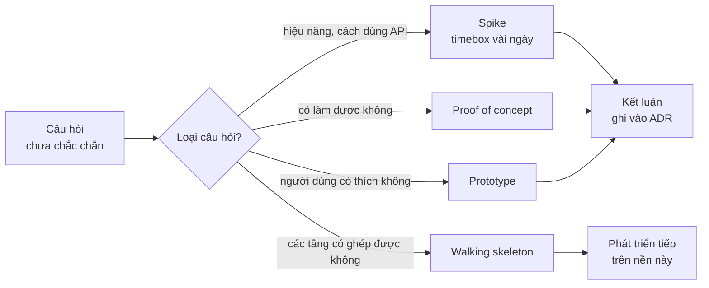
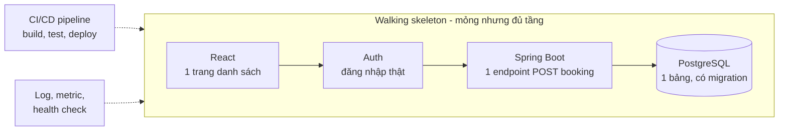

# Vẫn phải viết code

**Viết code** (how to code) vẫn là một kỹ năng bắt buộc của kiến trúc sư phần mềm, dù phần lớn thời gian của họ dành cho thiết kế, họp và tài liệu. Kiến trúc sư không cần là người viết nhiều code nhất đội, nhưng phải **đủ gần code** để quyết định của mình bám vào thực tế: biết một framework thật sự khó dùng ở đâu, một thư viện chạy nhanh đến đâu, một ranh giới module có đứng vững khi viết code thật không. Các công cụ chính là **prototype**, **spike**, **proof of concept**, **walking skeleton** và **code review**.

**Tương tự đơn giản:** Một huấn luyện viên bóng đá không cần đá chính mỗi trận, nhưng nếu lâu năm không chạm bóng, họ sẽ vẽ ra chiến thuật mà cầu thủ thật không thể thực hiện. Huấn luyện viên giỏi thỉnh thoảng xuống sân tập cùng đội, thử bài tập mới trước khi bắt cả đội tập. Kiến trúc sư viết code cũng vậy: thử trước, rồi mới yêu cầu cả đội đi theo.

---

:::note[Ghi nhớ nhanh]

- ⭐ **Kiến trúc sư xa code sẽ ra quyết định xa thực tế** — hiện tượng thường được gọi là "ivory tower architect" (kiến trúc sư tháp ngà).
- ⭐ **Code để học, không phải để giao** — spike và prototype là thí nghiệm để trả lời câu hỏi, viết xong thường vứt đi.
- **Bốn công cụ khác nhau:** spike (trả lời một câu hỏi kỹ thuật), proof of concept (chứng minh khả thi), prototype (thử trải nghiệm hoặc thiết kế), walking skeleton (bộ khung chạy được từ đầu đến cuối).
- **Đừng ôm phần việc nằm trên đường găng** (critical path) — lịch của kiến trúc sư bị cắt vụn, dễ thành nút thắt cổ chai.
- **Code review ở góc kiến trúc** — nhìn ranh giới, phụ thuộc, xu hướng, thay vì bắt lỗi chính tả.

:::

---

## Mục lục

- [Vì sao kiến trúc sư vẫn phải viết code?](#vì-sao-kiến-trúc-sư-vẫn-phải-viết-code)
- [1. Giữ tay nghề](#1-giữ-tay-nghề)
- [2. Spike, proof of concept, prototype, walking skeleton](#2-spike-proof-of-concept-prototype-walking-skeleton)
- [3. Ví dụ: spike so sánh hai lựa chọn](#3-ví-dụ-spike-so-sánh-hai-lựa-chọn)
- [4. Walking skeleton cho hệ thống mới](#4-walking-skeleton-cho-hệ-thống-mới)
- [5. Code review ở góc kiến trúc sư](#5-code-review-ở-góc-kiến-trúc-sư)
- [6. Không ôm đường găng](#6-không-ôm-đường-găng)
- [7. Biến quy tắc kiến trúc thành code](#7-biến-quy-tắc-kiến-trúc-thành-code)
- [Khi nào cần nhớ?](#khi-nào-cần-nhớ)
- [Lỗi thường gặp](#lỗi-thường-gặp)
- [Câu hỏi phỏng vấn](#câu-hỏi-phỏng-vấn)

---

## Vì sao kiến trúc sư vẫn phải viết code?

**Vấn đề:** Một kiến trúc sư từng là developer giỏi, nhưng ba năm nay chỉ vẽ sơ đồ và họp. Họ đề xuất dùng một framework mới mà chưa từng thử, quy định một mẫu thiết kế mà khi viết thật thì sinh ra hàng trăm dòng boilerplate, ước lượng một tính năng "hai tuần" trong khi đội biết phải hai tháng. Dần dần đội không còn tin vào quyết định kiến trúc, và code thật đi một hướng khác với sơ đồ.

**Giải pháp:** Kiến trúc sư giữ một nhịp viết code đều đặn, nhưng **chọn đúng loại code**: thí nghiệm để kiểm chứng quyết định (spike, proof of concept), bộ khung mẫu cho đội đi theo (walking skeleton, template), công cụ kiểm tra quy tắc kiến trúc tự động, và code review có chọn lọc. Tránh nhận những việc nằm trên đường găng của sprint.

:::tip[Dùng thực tế]

- **Trước khi chọn công nghệ:** viết spike 1–3 ngày đo thực tế thay vì đọc benchmark trên blog.
- **Khi khởi động dự án:** dựng walking skeleton có CI/CD, logging, auth, một luồng nghiệp vụ mỏng chạy từ UI đến DB.
- **Khi đặt chuẩn:** viết một module mẫu cho đội copy, thay vì một trang wiki mô tả.
- **Hằng tuần:** review một số pull request chạm ranh giới module hoặc hạ tầng chung.

:::

---

## 1. Giữ tay nghề

Công nghệ thay đổi nhanh; kinh nghiệm thực tế về một framework vài năm trước có thể đã lỗi thời. Viết code giúp kiến trúc sư:

| Lợi ích | Ví dụ |
| --- | --- |
| **Ước lượng sát hơn** | Biết thêm một trường vào form React + API Spring thật sự tốn bao nhiêu bước |
| **Đánh giá công nghệ đúng** | Tự thử Next.js App Router trước khi quyết chuyển cả frontend |
| **Thấy chi phí của quy tắc mình đặt ra** | Tự viết một tính năng theo mẫu kiến trúc mình đề xuất, thấy chỗ nào rườm rà |
| **Giữ uy tín với đội** | Đội lắng nghe người hiểu nỗi đau của họ hơn người chỉ vẽ sơ đồ |
| **Phát hiện vấn đề sớm** | Thấy build chậm, test chập chờn, công cụ dev kém trước khi chúng thành nợ |

Điều này không có nghĩa là kiến trúc sư phải code toàn thời gian. Mức độ phụ thuộc vào cấp độ: application architect có thể code khá nhiều; enterprise architect thường chỉ code thí nghiệm. Xem thêm ở bài [Các cấp độ kiến trúc](/docs/software-architect/01-basics/3_cac-cap-do-kien-truc).

---

## 2. Spike, proof of concept, prototype, walking skeleton

Bốn khái niệm hay bị dùng lẫn, nhưng mục đích khác nhau:

| | Spike | Proof of concept (PoC) | Prototype | Walking skeleton |
| --- | --- | --- | --- | --- |
| **Câu hỏi trả lời** | "Cách này chạy thế nào, nhanh cỡ nào?" | "Việc này có khả thi không?" | "Người dùng/các bên thấy thế nào?" | "Toàn bộ đường ống có chạy từ đầu đến cuối không?" |
| **Phạm vi** | Hẹp, một vấn đề kỹ thuật | Hẹp, một rủi ro lớn nhất | Giao diện hoặc luồng nghiệp vụ | Rộng nhưng mỏng, đủ các tầng |
| **Thời gian** | Vài giờ đến vài ngày, có giới hạn cứng | Vài ngày đến vài tuần | Vài ngày | Vài ngày đến hai tuần |
| **Chất lượng code** | Vứt đi | Thường vứt đi | Thường vứt đi | **Giữ lại**, là nền móng sản phẩm |
| **Đầu ra** | Số liệu, kết luận, ghi vào ADR | Có hoặc không, kèm điều kiện | Phản hồi | Hệ thống chạy được trên môi trường thật |

**Spike** là thuật ngữ từ Extreme Programming (XP). Đặc điểm quan trọng nhất của spike là **giới hạn thời gian** (timebox): "dành tối đa hai ngày để trả lời câu hỏi X". Hết giờ mà chưa có kết luận thì đó cũng là một kết luận: vấn đề phức tạp hơn dự kiến.



---

## 3. Ví dụ: spike so sánh hai lựa chọn

Bối cảnh: API danh sách sản phẩm của một shop Node.js chậm. Đội tranh luận nên cache bằng **bộ nhớ trong process** (in-memory, ví dụ `lru-cache`) hay **Redis**. Thay vì tranh luận, kiến trúc sư viết một spike nửa ngày.

Câu hỏi spike, ghi rõ trước khi bắt đầu:

1. Độ trễ đọc của mỗi cách khi cache hit là bao nhiêu trên máy giống production?
2. Khi chạy 4 instance, tỉ lệ cache hit của in-memory giảm thế nào?
3. Độ phức tạp vận hành thêm vào là gì?

```js
// spike/cache-latency.mjs — code thí nghiệm, sẽ vứt đi sau khi có kết luận
import { LRUCache } from 'lru-cache';
import { createClient } from 'redis';
import { performance } from 'node:perf_hooks';

const ITERATIONS = 10_000;
const payload = JSON.stringify({ items: Array.from({ length: 50 }, (_, i) => ({ id: i })) });

async function measure(label, getFn) {
  const samples = [];
  for (let i = 0; i < ITERATIONS; i++) {
    const start = performance.now();
    await getFn('products:page:1');
    samples.push(performance.now() - start);
  }
  samples.sort((a, b) => a - b);
  const p50 = samples[Math.floor(ITERATIONS * 0.5)];
  const p99 = samples[Math.floor(ITERATIONS * 0.99)];
  console.log(`${label}: p50=${p50.toFixed(3)}ms p99=${p99.toFixed(3)}ms`);
}

// Lựa chọn A: cache trong bộ nhớ của process
const lru = new LRUCache({ max: 1000 });
lru.set('products:page:1', payload);
await measure('in-memory', async (key) => JSON.parse(lru.get(key)));

// Lựa chọn B: Redis dùng chung giữa các instance
const redis = createClient({ url: process.env.REDIS_URL });
await redis.connect();
await redis.set('products:page:1', payload);
await measure('redis', async (key) => JSON.parse(await redis.get(key)));
await redis.quit();
```

Kết quả spike **không phải là code**, mà là một đoạn kết luận đưa vào ADR, đại loại:

```markdown
## Kết quả spike cache (timebox 0.5 ngày)

- In-memory nhanh hơn Redis một bậc khi hit, nhưng cả hai đều nhỏ hơn
  nhiều so với thời gian query DB hiện tại, nên độ trễ không phải yếu tố quyết định.
- Với 4 instance, in-memory làm mỗi instance tự làm ấm cache riêng
  và dữ liệu giữa các instance có thể lệch nhau sau khi admin sửa giá.
- Redis thêm một thành phần phải vận hành, nhưng team đã có Redis cho session.

Đề xuất: dùng Redis, TTL 60 giây, xoá key khi admin cập nhật sản phẩm.
```

Lưu ý cách đọc kết quả: ta không ghi số đo cụ thể như một chân lý, vì nó phụ thuộc máy và mạng. Ghi **kết luận và lý do**, kèm script để ai cần thì chạy lại.

---

## 4. Walking skeleton cho hệ thống mới

**Walking skeleton** (bộ xương biết đi), thuật ngữ được Alistair Cockburn phổ biến, là cài đặt **nhỏ nhất có thể** của hệ thống nhưng **chạy được từ đầu đến cuối**, đi qua mọi thành phần kiến trúc chính và được deploy bằng pipeline thật.

Ví dụ với hệ thống đặt lịch dùng React + Spring Boot + PostgreSQL, walking skeleton có thể chỉ là: user đăng nhập, xem danh sách một loại dịch vụ, bấm "đặt", một bản ghi xuất hiện trong DB.



Vì sao kiến trúc sư nên tự tay (hoặc cùng đội) dựng phần này:

- Nó **kiểm chứng kiến trúc trên giấy**: ranh giới module, cách xác thực, cách deploy có thực sự ghép được với nhau không.
- Nó trở thành **mẫu** cho đội: thêm tính năng mới bằng cách làm giống luồng đầu tiên.
- Các quyết định "nhàm chán nhưng đắt" (cấu trúc thư mục, cách log, cách migration, cách cấu hình môi trường) được chốt sớm bằng code chứ không bằng tài liệu.

---

## 5. Code review ở góc kiến trúc sư

Kiến trúc sư không cần (và không nên) review mọi pull request. Khi review, họ nhìn **khác** một developer thường:

| Developer review thường nhìn | Kiến trúc sư review nên nhìn thêm |
| --- | --- |
| Logic đúng chưa, test đủ chưa | Code có vượt ranh giới module, import sâu vào nội bộ module khác không |
| Đặt tên, format | Có thêm dependency mới không, đã cân nhắc chưa |
| Xử lý lỗi trong hàm | Chiến lược lỗi, retry, timeout có nhất quán với phần còn lại |
| Hiệu năng của đoạn code | Có gọi đồng bộ sang service khác trong vòng lặp không (N+1 qua mạng) |
| Một PR riêng lẻ | **Xu hướng** qua nhiều PR: cùng một kiểu vi phạm lặp lại nghĩa là quy tắc hoặc thiết kế có vấn đề |

Cách chọn PR để review: đặt `CODEOWNERS` cho các thư mục nhạy cảm (module dùng chung, hạ tầng, schema migration, API contract) để kiến trúc sư được tự động mời review đúng chỗ.

Khi góp ý, nhớ rằng code review là **công cụ dạy**, không phải công cụ kiểm soát. Giải thích "vì sao", dẫn link tới ADR, và phân biệt rõ góp ý bắt buộc với gợi ý.

---

## 6. Không ôm đường găng

**Đường găng** (critical path) là chuỗi công việc quyết định ngày hoàn thành của dự án; chậm một việc trên đường găng là chậm cả dự án. Lịch của kiến trúc sư bị chia nhỏ bởi họp, review, hỗ trợ các đội. Nếu kiến trúc sư nhận một tính năng nằm trên đường găng, rất dễ họ trở thành **nút thắt cổ chai** (bottleneck).

Nên nhận:

- Spike, PoC, walking skeleton (trước khi đội bắt đầu).
- Công cụ nội bộ, script, kiểm tra kiến trúc tự động.
- Sửa nợ kỹ thuật không gấp, refactor có lợi cho nhiều đội.
- Pair programming với developer trên việc khó, để chuyển giao kiến thức.

Không nên nhận:

- Tính năng chính có deadline của sprint.
- Phần việc mà chỉ mình biết làm, khiến đội phụ thuộc vào mình.

---

## 7. Biến quy tắc kiến trúc thành code

Quy tắc chỉ nằm trên wiki sẽ bị quên. Kiến trúc sư có thể viết code để **tự động kiểm tra** quy tắc kiến trúc, thường được gọi là **fitness function** (hàm thích nghi, khái niệm trong cuốn *Building Evolutionary Architectures*). Với Java, thư viện ArchUnit cho phép viết quy tắc như một unit test:

```java
// Java + ArchUnit: chặn module order truy cập nội bộ của module payment
@AnalyzeClasses(packages = "com.shop")
class ArchitectureRulesTest {

    @ArchTest
    static final ArchRule order_khong_goi_noi_bo_payment =
        noClasses().that().resideInAPackage("..order..")
            .should().dependOnClassesThat()
            .resideInAPackage("..payment.internal..");

    @ArchTest
    static final ArchRule controller_khong_goi_thang_repository =
        noClasses().that().haveSimpleNameEndingWith("Controller")
            .should().dependOnClassesThat()
            .haveSimpleNameEndingWith("Repository");
}
```

Với TypeScript/Node.js, `dependency-cruiser` hoặc quy tắc ESLint `no-restricted-imports` làm việc tương tự. Quy tắc chạy trong CI, nên vi phạm bị chặn ngay ở pull request thay vì bị phát hiện sau nhiều tháng. Bài [Ước lượng và đánh giá](/docs/software-architect/02-important-skills/6_uoc-luong-va-danh-gia) nói thêm về fitness function.

---

## Khi nào cần nhớ?

- **Trước một quyết định kỹ thuật có điểm không chắc chắn:**
  - Viết spike có timebox, ghi câu hỏi trước khi code.
  - Đưa kết luận (không phải code) vào ADR.
- **Khi khởi động hệ thống hoặc service mới:**
  - Dựng walking skeleton đi qua mọi tầng và được deploy thật.
- **Khi phân bổ thời gian của bản thân:**
  - Chọn việc không nằm trên đường găng.
  - Ưu tiên việc giúp nhiều đội: công cụ, mẫu, kiểm tra tự động.
- **Best practice:**
  - Dùng `CODEOWNERS` để review đúng chỗ nhạy cảm.
  - Biến quy tắc kiến trúc thành test chạy trong CI.

---

## Lỗi thường gặp

### Lỗi 1: Biến spike thành code production

Spike viết vội, không test, bỏ qua xử lý lỗi. Nếu nó "tạm" được merge vào main, nó sẽ ở đó mãi. Quy ước rõ: code spike nằm ở nhánh hoặc thư mục riêng, viết lại đàng hoàng khi đi vào sản phẩm.

### Lỗi 2: Spike không có câu hỏi và timebox

"Thử tìm hiểu GraphQL xem sao" không phải spike, là đi dạo. Spike cần câu hỏi cụ thể và thời hạn cứng; hết giờ thì báo kết quả, kể cả khi kết quả là "chưa đủ thông tin".

### Lỗi 3: Kiến trúc sư nhận tính năng chính của sprint

Họ bị kéo đi họp, tính năng trễ, cả sprint trễ theo. Nhận việc hỗ trợ, công cụ, thí nghiệm; để đội giữ đường găng.

### Lỗi 4: Ngừng code hoàn toàn

Sau vài năm, đề xuất của kiến trúc sư bắt đầu xa thực tế, đội mất niềm tin. Giữ ít nhất một nhịp đều đặn: một spike mỗi tháng, một vài PR review mỗi tuần, pair với developer khi có việc khó.

### Lỗi 5: Code review để thể hiện quyền lực

Chặn PR vì sở thích cá nhân, không giải thích lý do. Đội sẽ né kiến trúc sư thay vì học từ họ. Góp ý kèm "vì sao", phân biệt bắt buộc và gợi ý.

---

## Câu hỏi phỏng vấn

Những câu thường gặp về chủ đề này. Tự trả lời trước, rồi bấm **Xem đáp án** để đối chiếu.

**1. Kiến trúc sư có cần viết code không? Vì sao?**

<details className="qa">
<summary>Xem đáp án</summary>

Có, nhưng với mục đích khác developer. Viết code giúp quyết định kiến trúc bám thực tế, ước lượng sát, đánh giá công nghệ bằng thử nghiệm thay vì đọc quảng cáo, và giữ uy tín với đội. Loại code phù hợp: spike, PoC, walking skeleton, module mẫu, công cụ kiểm tra kiến trúc, review các PR quan trọng. Tránh nhận việc nằm trên đường găng.

</details>

**2. Spike, proof of concept và prototype khác nhau thế nào?**

<details className="qa">
<summary>Xem đáp án</summary>

- **Spike:** thí nghiệm có timebox để trả lời một câu hỏi kỹ thuật hẹp (hiệu năng, cách dùng API). Kết quả là kiến thức.
- **Proof of concept:** chứng minh một ý tưởng hoặc rủi ro lớn nhất là khả thi.
- **Prototype:** bản thử để lấy phản hồi về trải nghiệm hoặc thiết kế, thường cho người dùng hoặc các bên liên quan xem.

Cả ba thường được vứt đi sau khi có kết luận. Khác với **walking skeleton**, là bộ khung được giữ lại và phát triển tiếp.

</details>

**3. Walking skeleton là gì và vì sao nên làm sớm?**

<details className="qa">
<summary>Xem đáp án</summary>

Là cài đặt nhỏ nhất của hệ thống nhưng chạy được từ đầu đến cuối qua mọi thành phần kiến trúc chính (UI, API, DB, auth) và được deploy bằng pipeline thật. Làm sớm để kiểm chứng kiến trúc trên giấy, phát hiện vấn đề tích hợp và hạ tầng ngay từ đầu, chốt các quy ước nền (cấu trúc thư mục, logging, migration), và cho đội một mẫu để phát triển tiếp.

</details>

**4. Làm sao để quy tắc kiến trúc không chỉ nằm trên giấy?**

<details className="qa">
<summary>Xem đáp án</summary>

Biến chúng thành kiểm tra tự động chạy trong CI: ArchUnit cho Java, dependency-cruiser hoặc ESLint cho TypeScript để chặn import sai ranh giới; kiểm tra schema API bằng contract test; ngưỡng hiệu năng trong test tải. Kết hợp với `CODEOWNERS` để người hiểu kiến trúc được mời review các vùng nhạy cảm. Đây là ý tưởng fitness function trong kiến trúc tiến hoá.

</details>

**5. Khi review code, kiến trúc sư nên chú ý điều gì khác so với developer?**

<details className="qa">
<summary>Xem đáp án</summary>

Ranh giới module và chiều phụ thuộc, dependency mới được thêm vào, sự nhất quán của chiến lược xử lý lỗi, retry, timeout, các lời gọi mạng trong vòng lặp, thay đổi shape API hoặc schema dữ liệu. Quan trọng hơn là nhìn **xu hướng** qua nhiều PR: một vi phạm lặp lại cho thấy quy tắc chưa rõ hoặc thiết kế đang gây khó cho đội.

</details>
