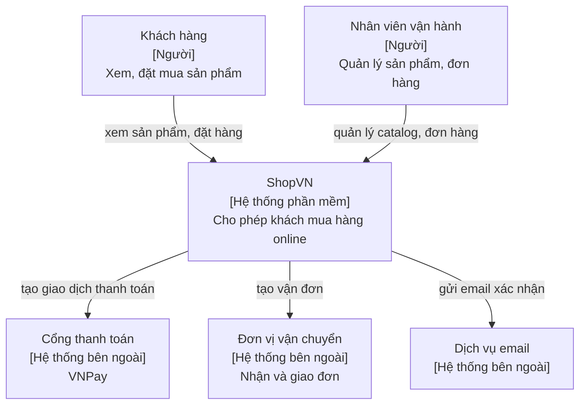
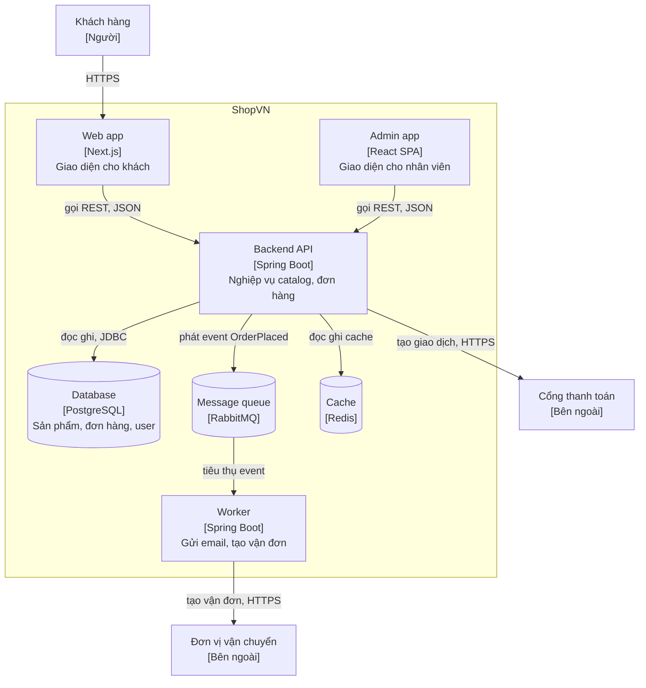
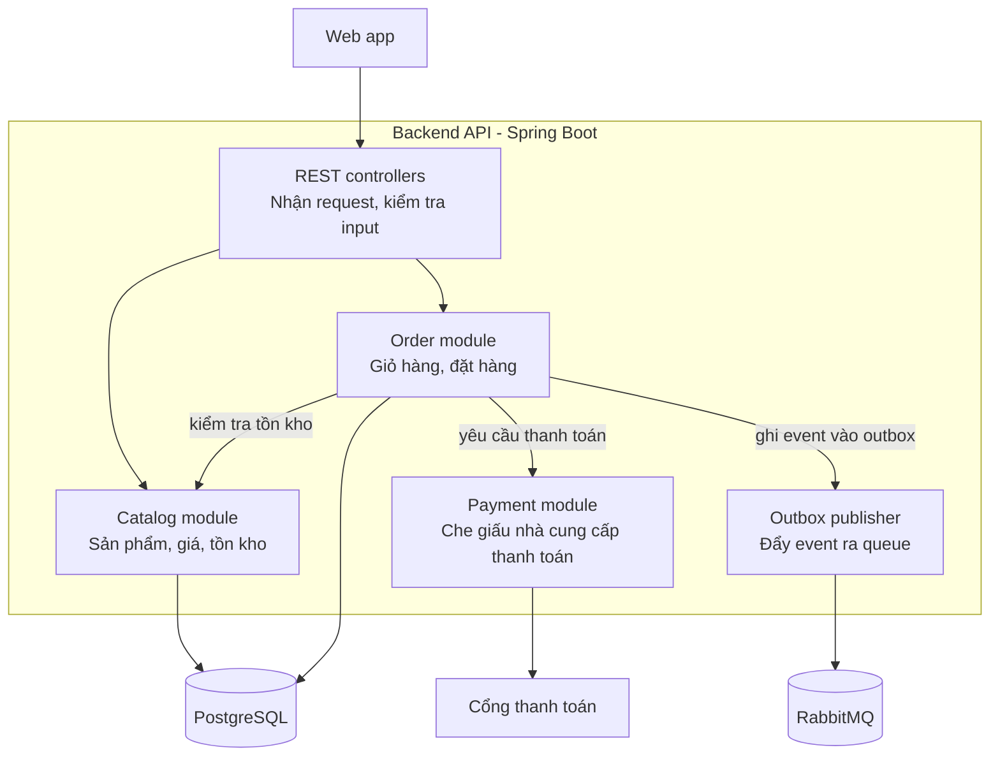
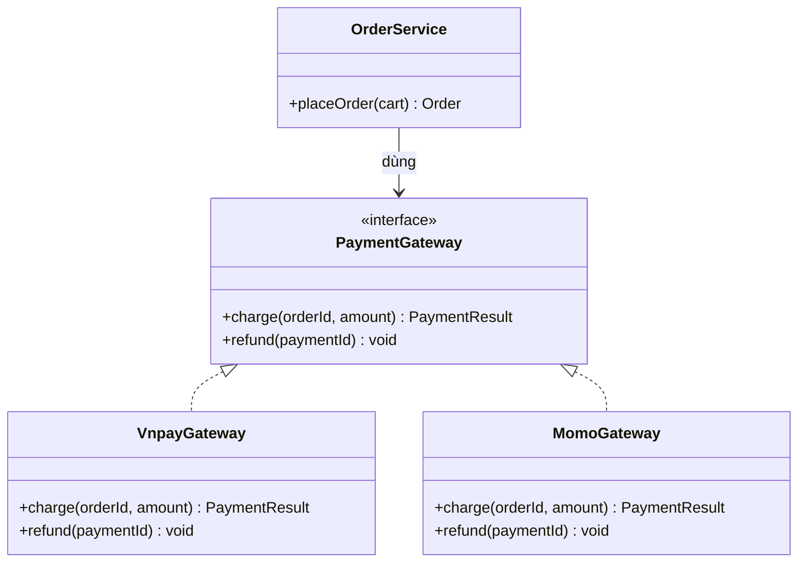
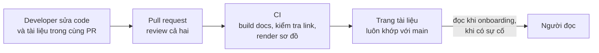

# Tài liệu kiến trúc

**Tài liệu kiến trúc** (architecture documentation) là cách kiến trúc sư truyền đạt **cấu trúc, quyết định và lý do** của hệ thống cho người khác: developer mới, đội vận hành, quản lý, đối tác tích hợp. Tài liệu tốt không mô tả từng dòng code (code đã làm việc đó), mà trả lời những câu hỏi code không trả lời được: hệ thống gồm những phần nào, chúng nói chuyện với nhau ra sao, **vì sao** lại thiết kế như vậy. Các công cụ phổ biến: **mô hình C4** để vẽ sơ đồ, **arc42** làm khung tài liệu, **design doc** cho đề xuất mới, **ADR** cho quyết định, và cách làm **docs as code** để giữ tài liệu sống cạnh code.

**Tương tự đơn giản:** Bản đồ Google Maps. Thu nhỏ thì thấy các tỉnh và đường cao tốc; phóng to thì thấy quận, rồi từng con phố, rồi từng toà nhà. Không ai vẽ một tấm bản đồ duy nhất chứa mọi thứ, vì nó sẽ không đọc được. Mô hình C4 làm đúng việc đó với phần mềm: bốn mức thu phóng, mỗi mức cho một nhóm người đọc khác nhau.

---

:::note[Ghi nhớ nhanh]

- ⭐ **Mô hình C4 có bốn mức thu phóng** — Context (hệ thống và thế giới bên ngoài), Container (các ứng dụng, database), Component (bên trong một container), Code (class, thường không cần vẽ tay).
- ⭐ **Tài liệu phải sống cạnh code** — Markdown và sơ đồ dạng text (Mermaid, PlantUML, Structurizr) trong repo, review qua pull request.
- **Viết vừa đủ** — ghi những thứ ổn định và khó suy ra từ code: bối cảnh, ranh giới, quyết định, lý do.
- **arc42** là khung 12 mục cho tài liệu kiến trúc, dùng như danh sách kiểm tra, không phải bắt buộc điền hết.
- **Design doc** cho đề xuất trước khi làm; **ADR** cho quyết định sau khi chốt.

:::

---

## Mục lục

- [Vì sao cần tài liệu kiến trúc?](#vì-sao-cần-tài-liệu-kiến-trúc)
- [1. Viết cho ai, viết cái gì?](#1-viết-cho-ai-viết-cái-gì)
- [2. Mô hình C4](#2-mô-hình-c4)
- [3. Mức 1: System Context](#3-mức-1-system-context)
- [4. Mức 2: Container](#4-mức-2-container)
- [5. Mức 3: Component](#5-mức-3-component)
- [6. Mức 4: Code](#6-mức-4-code)
- [7. arc42](#7-arc42)
- [8. Design doc mẫu](#8-design-doc-mẫu)
- [9. Docs as code](#9-docs-as-code)
- [10. Viết vừa đủ và giữ tài liệu sống](#10-viết-vừa-đủ-và-giữ-tài-liệu-sống)
- [Khi nào cần nhớ?](#khi-nào-cần-nhớ)
- [Lỗi thường gặp](#lỗi-thường-gặp)
- [Câu hỏi phỏng vấn](#câu-hỏi-phỏng-vấn)

---

## Vì sao cần tài liệu kiến trúc?

**Vấn đề:** Hai thái cực đều tệ. Một là **không có tài liệu**: mọi hiểu biết nằm trong đầu vài người, người mới mất hàng tháng để hiểu hệ thống, mỗi lần người cũ nghỉ là một lần mất trí nhớ tập thể. Hai là **tài liệu khổng lồ và lỗi thời**: wiki 200 trang viết lúc khởi động dự án, sơ đồ vẽ bằng công cụ kéo thả không ai sửa nổi, đọc xong còn hiểu sai hơn không đọc.

**Giải pháp:** Viết **ít nhưng đúng chỗ**: một bộ sơ đồ C4 ở hai ba mức đầu, ADR cho các quyết định, design doc cho các đề xuất lớn, một khung tài liệu gọn (lấy cảm hứng từ arc42). Tất cả nằm trong repo, dùng định dạng text, được cập nhật trong cùng pull request với thay đổi code.

:::tip[Dùng thực tế]

- **Onboarding:** người mới đọc sơ đồ Context và Container trong 30 phút là biết hệ thống có gì.
- **Thiết kế tính năng lớn:** viết design doc, mời các đội liên quan góp ý trước khi code.
- **Sự cố production:** đội trực biết request đi qua những đâu, phụ thuộc vào ai.
- **Làm việc với đối tác, kiểm toán:** sơ đồ Context cho thấy dữ liệu đi ra ngoài qua những đường nào.

:::

---

## 1. Viết cho ai, viết cái gì?

Mỗi tài liệu cần một **người đọc chính**. Không có tài liệu nào phục vụ tốt tất cả mọi người.

| Người đọc | Họ cần biết | Tài liệu phù hợp |
| --- | --- | --- |
| **Quản lý, business** | Hệ thống làm gì, kết nối với ai, rủi ro, chi phí | Sơ đồ Context, tóm tắt một trang |
| **Developer mới** | Có những service nào, code nằm đâu, chạy local thế nào | Sơ đồ Container, Component, README, ADR |
| **Developer đội khác** | API, event, ranh giới trách nhiệm | Sơ đồ Container, tài liệu API (OpenAPI), contract event |
| **Đội vận hành, SRE** | Deploy ở đâu, phụ thuộc gì, giám sát gì | Sơ đồ deployment, runbook |
| **Kiến trúc sư tương lai** | Vì sao hệ thống như thế này | ADR, design doc |

Quy tắc chung: tài liệu nên ghi những thứ **ổn định** (thay đổi chậm) và **khó suy ra từ code**: bối cảnh, ranh giới, luồng chính, quyết định và lý do. Chi tiết thay đổi nhanh (tên class, tham số hàm) để code tự nói.

---

## 2. Mô hình C4

**Mô hình C4** do Simon Brown đề xuất, gồm bốn mức trừu tượng, mỗi mức phóng to vào một phần của mức trên:

| Mức | Thấy gì | Người đọc chính | Có nên vẽ? |
| --- | --- | --- | --- |
| **1. System Context** | Hệ thống của ta là một hộp, xung quanh là người dùng và hệ thống bên ngoài | Mọi người, kể cả không kỹ thuật | Luôn luôn |
| **2. Container** | Các ứng dụng chạy được và kho dữ liệu: web app, API, database, queue | Developer, vận hành | Gần như luôn luôn |
| **3. Component** | Các khối lớn bên trong một container | Developer làm trên container đó | Khi container phức tạp |
| **4. Code** | Class, interface | Developer | Hiếm khi; IDE tự sinh được |

Lưu ý thuật ngữ: **container** trong C4 nghĩa là **một thứ chạy được độc lập hoặc nơi lưu dữ liệu** (một app Spring Boot, một SPA React, một database), không phải Docker container, dù hai thứ thường trùng nhau.

Vài quy ước giúp sơ đồ C4 đọc được:

- Mỗi hộp có **tên**, **loại** (công nghệ) và **một câu mô tả trách nhiệm**.
- Mỗi mũi tên có **nhãn động từ** ("gửi đơn hàng tới", "đọc dữ liệu từ") và nếu cần, giao thức (HTTPS/JSON, AMQP).
- Có **chú thích** (legend) và **tiêu đề** cho biết đây là mức nào, của hệ thống nào.

Các ví dụ dưới đây dùng một hệ thống chung: **ShopVN**, một trang thương mại điện tử nhỏ.

---

## 3. Mức 1: System Context

Sơ đồ Context trả lời: **hệ thống của ta phục vụ ai, phụ thuộc vào ai?** Không có chi tiết công nghệ.



Sơ đồ này nên đủ đơn giản để in ra và giải thích cho một người không làm kỹ thuật trong hai phút.

---

## 4. Mức 2: Container

Phóng to vào hộp ShopVN: hệ thống gồm những **ứng dụng và kho dữ liệu** nào, chúng giao tiếp ra sao.



Đây thường là sơ đồ **hữu ích nhất**: developer mới biết code nào chạy ở đâu, đội vận hành biết cần giám sát những gì, ai cũng thấy các phụ thuộc chính.

---

## 5. Mức 3: Component

Phóng to vào một container, ví dụ **Backend API**: bên trong có những khối lớn nào. Với modular monolith, mỗi component thường tương ứng một module nghiệp vụ.



Chỉ vẽ mức này cho container **đủ phức tạp**, và giữ ở mức các khối lớn. Nếu sơ đồ component có 40 hộp, nó đang trượt xuống mức code.

---

## 6. Mức 4: Code

Mức code là sơ đồ class/interface bên trong một component. Simon Brown khuyên **thường không cần vẽ tay** mức này: IDE và công cụ có thể sinh từ code, và nó lỗi thời rất nhanh. Chỉ vẽ cho phần cốt lõi, ổn định và khó hiểu, ví dụ cách module Payment che giấu nhiều nhà cung cấp:



Ngoài bốn mức chính, C4 còn có các sơ đồ bổ trợ: **deployment** (container chạy trên hạ tầng nào), **dynamic** (một luồng cụ thể theo thứ tự, gần giống sequence diagram) và **system landscape** (nhiều hệ thống của cả tổ chức).

---

## 7. arc42

**arc42** là một khung (template) tài liệu kiến trúc mã nguồn mở, do Gernot Starke và Peter Hruschka xây dựng. Nó gồm 12 mục:

| # | Mục | Nội dung chính |
| --- | --- | --- |
| 1 | Giới thiệu và mục tiêu | Yêu cầu chính, mục tiêu chất lượng hàng đầu, các bên liên quan |
| 2 | Ràng buộc | Ràng buộc kỹ thuật, tổ chức, pháp lý |
| 3 | Bối cảnh và phạm vi | Ranh giới hệ thống, đối tác bên ngoài (tương ứng C4 Context) |
| 4 | Chiến lược giải pháp | Các quyết định nền tảng, tóm tắt cách tiếp cận |
| 5 | Góc nhìn khối xây dựng | Cấu trúc tĩnh: các thành phần (tương ứng C4 Container, Component) |
| 6 | Góc nhìn thời gian chạy | Các kịch bản quan trọng diễn ra thế nào |
| 7 | Góc nhìn triển khai | Hạ tầng, môi trường, ánh xạ phần mềm lên phần cứng |
| 8 | Các khái niệm xuyên suốt | Bảo mật, logging, xử lý lỗi, i18n... |
| 9 | Các quyết định kiến trúc | Thường là danh sách ADR |
| 10 | Yêu cầu chất lượng | Cây chất lượng, kịch bản chất lượng |
| 11 | Rủi ro và nợ kỹ thuật | Những gì đã biết là có vấn đề |
| 12 | Thuật ngữ | Từ điển thuật ngữ nghiệp vụ và kỹ thuật |

C4 và arc42 **bổ sung nhau**: C4 trả lời "vẽ sơ đồ thế nào", arc42 trả lời "tài liệu nên có những phần nào". Với dự án nhỏ, chỉ cần các mục 1, 3, 4, 5, 9, 11; coi 12 mục như danh sách kiểm tra để không bỏ sót, không phải bài tập điền cho đủ.

---

## 8. Design doc mẫu

**Design doc** (tài liệu thiết kế) là đề xuất viết **trước khi** làm một thay đổi lớn, để thu thập góp ý. Mẫu gọn dùng được cho hầu hết đội:

```markdown
# Design doc: Tách gửi thông báo ra worker bất đồng bộ

- Tác giả: ...
- Người review: Tech lead Order, Tech lead Platform
- Trạng thái: Draft / In review / Approved
- Ngày: 2026-09-20

## 1. Bối cảnh và vấn đề

Mô tả hiện trạng, số liệu nếu có, vì sao phải thay đổi bây giờ.

## 2. Mục tiêu và ngoài phạm vi

- Mục tiêu: request đặt hàng không chờ gửi email; lỗi email không làm hỏng đơn.
- Ngoài phạm vi: thông báo đẩy (push notification), đổi nhà cung cấp email.

## 3. Đề xuất

Mô tả giải pháp. Kèm sơ đồ C4 Container cho phần thay đổi
và một sơ đồ luồng cho kịch bản chính.

## 4. Các phương án đã cân nhắc

| Phương án | Ưu | Nhược | Vì sao không chọn |
| --- | --- | --- | --- |
| Giữ đồng bộ, thêm retry | Đơn giản | Vẫn chậm | Không đạt mục tiêu 1 |
| Spring @Async trong process | Không thêm hạ tầng | Mất việc khi pod restart | Không đảm bảo gửi |

## 5. Ảnh hưởng

- API, schema, event: thêm event OrderPlaced (mô tả shape).
- Bảo mật, dữ liệu cá nhân: ...
- Vận hành, giám sát: thêm metric độ dài hàng đợi, cảnh báo dead letter.
- Chi phí: ...

## 6. Kế hoạch triển khai và rollback

Các bước, feature flag, cách quay lại nếu có sự cố.

## 7. Câu hỏi còn mở

- ...
```

Phần **"Các phương án đã cân nhắc"** và **"Ngoài phạm vi"** thường là phần giá trị nhất: chúng ngăn tranh luận lặp lại và giới hạn phạm vi. Sau khi duyệt, tóm tắt quyết định thành ADR như ở bài [Ra quyết định](/docs/software-architect/02-important-skills/2_ra-quyet-dinh).

---

## 9. Docs as code

**Docs as code** (tài liệu như code) là cách quản lý tài liệu bằng chính quy trình quản lý code:

- **Định dạng text:** Markdown, AsciiDoc cho chữ; Mermaid, PlantUML, Structurizr DSL cho sơ đồ.
- **Lưu trong Git**, cạnh code, thường ở thư mục `docs/`.
- **Review qua pull request**, cùng PR với thay đổi code liên quan.
- **Tự động build và publish** bằng CI (Docusaurus, MkDocs, Backstage TechDocs).



So sánh các công cụ sơ đồ dạng text:

| Công cụ | Điểm mạnh | Điểm yếu |
| --- | --- | --- |
| **Mermaid** | Render sẵn trên GitHub, GitLab, Docusaurus; cú pháp dễ | Kiểm soát bố cục hạn chế với sơ đồ lớn |
| **PlantUML** | Nhiều loại sơ đồ, có thư viện C4-PlantUML | Cần server hoặc Java để render |
| **Structurizr DSL** | Mô tả **mô hình** một lần, sinh nhiều view C4 nhất quán | Thêm một công cụ phải học |
| **Công cụ kéo thả** (draw.io, Excalidraw) | Đẹp, tự do | Khó review diff, dễ lỗi thời; draw.io có thể lưu file trong repo để giảm vấn đề này |

Điểm hay của Structurizr: bạn khai báo **mô hình** (các hệ thống, container, quan hệ) một lần, rồi định nghĩa nhiều **view** từ mô hình đó. Đổi tên một container thì mọi sơ đồ đều cập nhật, thay vì phải sửa năm bức hình riêng lẻ.

```text
workspace {
    model {
        customer = person "Khách hàng"
        shop = softwareSystem "ShopVN" {
            web = container "Web app" "Giao diện cho khách" "Next.js"
            api = container "Backend API" "Nghiệp vụ" "Spring Boot"
            db = container "Database" "Lưu dữ liệu" "PostgreSQL"
        }
        customer -> web "Mua hàng qua"
        web -> api "Gọi REST"
        api -> db "Đọc ghi"
    }
    views {
        systemContext shop { include * }
        container shop { include * }
    }
}
```

---

## 10. Viết vừa đủ và giữ tài liệu sống

Tài liệu lỗi thời **nguy hiểm hơn** không có tài liệu, vì người đọc tin vào nó. Vài nguyên tắc để tài liệu sống lâu:

1. **Viết thứ ổn định:** bối cảnh, ranh giới, quyết định, luồng chính. Không chép lại chi tiết code.
2. **Gắn với quy trình:** checklist pull request có dòng "đã cập nhật tài liệu/ADR nếu cần chưa?".
3. **Một nguồn sự thật:** tài liệu API sinh từ OpenAPI spec, không viết tay song song.
4. **Có chủ sở hữu:** mỗi tài liệu ghi đội nào chịu trách nhiệm.
5. **Ghi ngày cập nhật và xoá mạnh tay:** tài liệu không ai dùng nữa thì xoá hoặc đánh dấu lưu trữ.
6. **Kiểm tra tự động:** CI kiểm tra link gãy (Docusaurus có `onBrokenLinks: 'throw'`), render sơ đồ, lint Markdown.

| Nên viết | Không nên viết |
| --- | --- |
| Sơ đồ Context, Container | Sơ đồ class cho toàn bộ codebase |
| ADR cho quyết định đắt | Mô tả từng endpoint bằng tay khi đã có OpenAPI |
| Cách chạy local, cách deploy | Hướng dẫn copy từ README của framework |
| Rủi ro và nợ kỹ thuật đã biết | Tài liệu "kế hoạch" của tính năng đã bỏ |

---

## Khi nào cần nhớ?

- **Khi bắt đầu dự án:**
  - Vẽ C4 Context và Container, lưu dạng text trong repo.
  - Tạo thư mục `docs/adr/` và viết ADR đầu tiên.
- **Trước thay đổi lớn:**
  - Viết design doc, nêu rõ phương án đã loại và phạm vi.
- **Khi review pull request:**
  - Thay đổi kiến trúc có kèm cập nhật sơ đồ hoặc ADR không?
- **Best practice:**
  - Mỗi sơ đồ có tiêu đề, chú thích, nhãn trên mũi tên.
  - Viết cho một người đọc chính.
  - Tài liệu sống trong Git, build bằng CI, kiểm tra link tự động.

---

## Lỗi thường gặp

### Lỗi 1: Một sơ đồ chứa mọi thứ

Một bức hình có người dùng, 15 service, 40 class, hạ tầng mạng và luồng thanh toán. Không ai đọc nổi. Tách theo mức C4, mỗi sơ đồ một mức và một mục đích.

### Lỗi 2: Hộp và mũi tên không có nhãn

Mũi tên giữa hai hộp nghĩa là gì: gọi API, đọc DB chung, gửi event? Ai gọi ai? Mỗi mũi tên cần một động từ và chiều rõ ràng; mỗi hộp cần loại công nghệ và trách nhiệm.

### Lỗi 3: Tài liệu tách khỏi code

Sơ đồ nằm trong một công cụ riêng hoặc slide, không ai cập nhật khi code đổi. Sau vài tháng, tài liệu sai và người đọc bị dẫn lạc. Đưa tài liệu vào repo, sửa trong cùng PR.

### Lỗi 4: Viết quá nhiều ngay từ đầu

Điền đủ 12 mục arc42 cho một dự án mới hai tuần tuổi. Phần lớn sẽ sai khi hệ thống tiến hoá. Bắt đầu với Context, Container, vài ADR; thêm dần khi có nhu cầu thật.

### Lỗi 5: Chỉ ghi "cái gì", không ghi "vì sao"

Sơ đồ cho thấy có Redis, nhưng không ai biết vì sao cần Redis và có thể bỏ được không. Phần "vì sao" là thứ code không bao giờ nói được; nó thuộc về ADR và design doc.

---

## Câu hỏi phỏng vấn

Những câu thường gặp về chủ đề này. Tự trả lời trước, rồi bấm **Xem đáp án** để đối chiếu.

**1. Mô hình C4 gồm những mức nào? Mỗi mức dành cho ai?**

<details className="qa">
<summary>Xem đáp án</summary>

1. **System Context:** hệ thống là một hộp, xung quanh là người dùng và hệ thống ngoài. Cho mọi người, kể cả không kỹ thuật.
2. **Container:** các ứng dụng chạy được và kho dữ liệu (web app, API, DB, queue) cùng cách chúng giao tiếp. Cho developer và vận hành.
3. **Component:** các khối lớn bên trong một container. Cho developer làm trên container đó.
4. **Code:** class, interface. Hiếm khi vẽ tay, thường để IDE sinh.

Ngoài ra có sơ đồ bổ trợ: deployment, dynamic, system landscape.

</details>

**2. "Container" trong C4 có phải là Docker container không?**

<details className="qa">
<summary>Xem đáp án</summary>

Không hẳn. Trong C4, container là **một đơn vị chạy được độc lập hoặc một nơi lưu dữ liệu**: một app Spring Boot, một SPA React chạy trên trình duyệt, một database, một bucket lưu file. Nó có thể chạy trong Docker container hoặc không. Sơ đồ deployment mới là nơi thể hiện container C4 được đặt lên Docker, Kubernetes hay máy ảo nào.

</details>

**3. Docs as code là gì? Lợi ích so với wiki?**

<details className="qa">
<summary>Xem đáp án</summary>

Là quản lý tài liệu bằng quy trình như code: định dạng text (Markdown, Mermaid, PlantUML), lưu trong Git cạnh code, review qua pull request, build và publish bằng CI.

Lợi ích: tài liệu được cập nhật cùng PR với thay đổi code nên ít lỗi thời; có lịch sử và diff; có review; kiểm tra tự động được (link gãy, sơ đồ lỗi); developer không phải chuyển sang công cụ khác. Wiki dễ bắt đầu hơn nhưng thường tách rời code và lỗi thời nhanh.

</details>

**4. Bạn làm gì để tài liệu kiến trúc không bị lỗi thời?**

<details className="qa">
<summary>Xem đáp án</summary>

- Chỉ viết những thứ ổn định và khó suy ra từ code.
- Đặt tài liệu trong repo, thêm mục kiểm tra trong template PR.
- Sinh tự động những gì sinh được (OpenAPI, sơ đồ từ mô hình Structurizr).
- Gán chủ sở hữu cho từng tài liệu, ghi ngày cập nhật.
- Xoá tài liệu không còn dùng.
- Kiểm tra link và render sơ đồ trong CI.

</details>

**5. Design doc nên có những phần nào?**

<details className="qa">
<summary>Xem đáp án</summary>

Bối cảnh và vấn đề, mục tiêu và **ngoài phạm vi**, đề xuất (kèm sơ đồ), **các phương án đã cân nhắc** và vì sao không chọn, ảnh hưởng (API, dữ liệu, bảo mật, vận hành, chi phí), kế hoạch triển khai và rollback, câu hỏi còn mở. Hai phần ngoài phạm vi và phương án đã cân nhắc giúp tránh tranh luận lặp lại và giữ phạm vi rõ ràng. Sau khi duyệt, kết quả được tóm tắt thành ADR.

</details>
