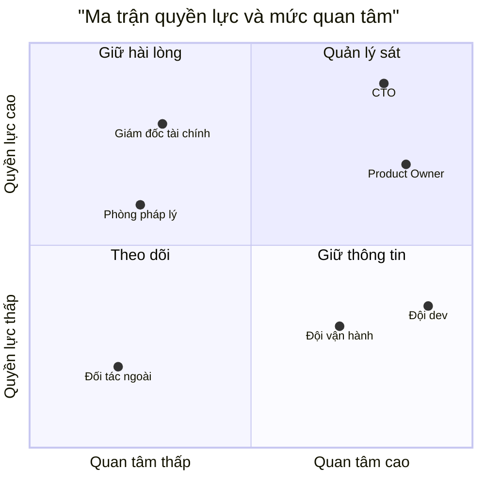
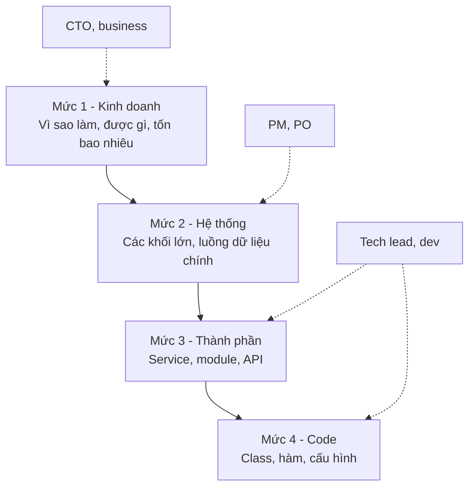
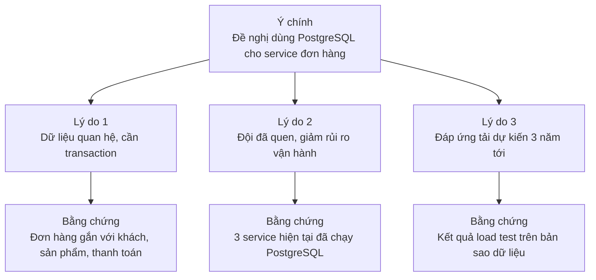
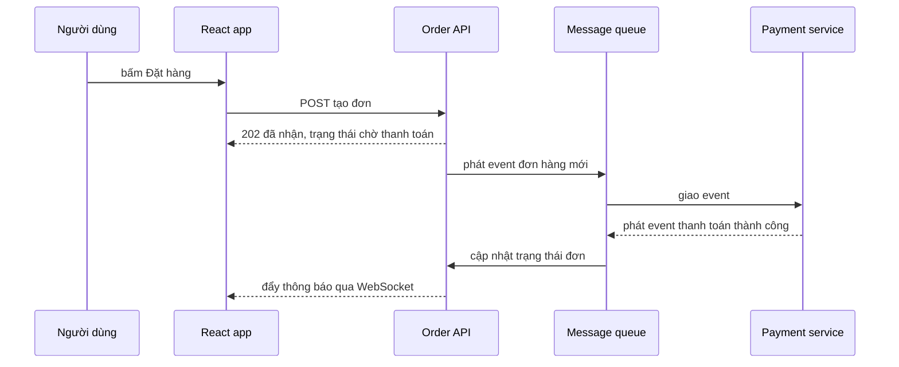
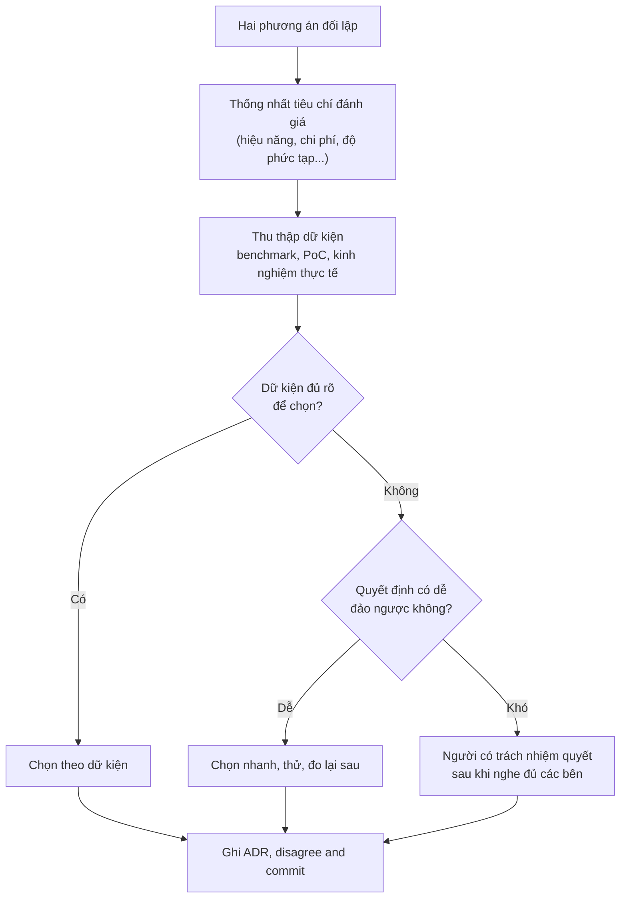

# Giao tiếp

**Giao tiếp** (communication) là kỹ năng giúp kiến trúc sư **truyền đạt quyết định kỹ thuật** đến đúng người, đúng mức chi tiết, đúng thời điểm, và **thu thông tin ngược lại** từ họ. Một kiến trúc đúng nhưng không ai hiểu, không ai đồng thuận thì sẽ không được hiện thực hoá, hoặc bị hiện thực hoá sai. Vì vậy giao tiếp không phải "kỹ năng mềm phụ trợ" mà là **một nửa công việc** của kiến trúc sư.

**Tương tự đơn giản:** Kiến trúc sư xây nhà phải nói chuyện với ba kiểu người. Với **chủ nhà**, họ nói về số phòng, ánh sáng, chi phí và thời gian hoàn thành. Với **kỹ sư kết cấu**, họ nói về tải trọng, cột, dầm. Với **đội thợ**, họ đưa bản vẽ thi công chi tiết. Cùng một toà nhà, nhưng ba cuộc nói chuyện hoàn toàn khác nhau. Nếu đưa bản vẽ kết cấu cho chủ nhà xem thì họ sẽ lạc, còn nói "nhà sẽ đẹp và thoáng" với thợ xây thì họ không biết phải làm gì.

---

:::note[Ghi nhớ nhanh]

- ⭐ **Nói theo đối tượng** — cùng một quyết định, developer cần "làm thế nào", PM cần "khi nào xong, rủi ro gì", CTO/business cần "tốn bao nhiêu, được gì".
- ⭐ **Kết luận trước, chi tiết sau (BLUF / Minto pyramid)** — người bận chỉ đọc 2 câu đầu, hãy để quyết định và lời đề nghị nằm ở đó.
- **Stakeholder map** — xếp các bên liên quan theo quyền lực và mức quan tâm để biết ai cần quản lý sát, ai chỉ cần thông báo.
- **Disagree and commit** — tranh luận hết mình trước khi quyết, nhưng một khi đã quyết thì cùng làm, kể cả khi mình từng phản đối.
- **Viết nhiều hơn họp** — design doc, RFC, ADR là kênh giao tiếp bất đồng bộ, có lưu vết và mở rộng được cho nhiều người.

:::

---

## Mục lục

- [Vì sao kiến trúc sư phải giỏi giao tiếp?](#vì-sao-kiến-trúc-sư-phải-giỏi-giao-tiếp)
- [1. Ai là người cần nghe? Stakeholder map](#1-ai-là-người-cần-nghe-stakeholder-map)
- [2. Nói theo đối tượng](#2-nói-theo-đối-tượng)
- [3. Trình bày phương án: BLUF và Minto pyramid](#3-trình-bày-phương-án-bluf-và-minto-pyramid)
- [4. Vẽ để nói: whiteboard và diagram](#4-vẽ-để-nói-whiteboard-và-diagram)
- [5. Lắng nghe trước khi nói](#5-lắng-nghe-trước-khi-nói)
- [6. Xử lý bất đồng kỹ thuật](#6-xử-lý-bất-đồng-kỹ-thuật)
- [7. Giao tiếp bất đồng bộ: design doc, RFC, chat](#7-giao-tiếp-bất-đồng-bộ-design-doc-rfc-chat)
- [8. Meeting hiệu quả](#8-meeting-hiệu-quả)
- [Khi nào cần nhớ?](#khi-nào-cần-nhớ)
- [Lỗi thường gặp](#lỗi-thường-gặp)
- [Câu hỏi phỏng vấn](#câu-hỏi-phỏng-vấn)

---

## Vì sao kiến trúc sư phải giỏi giao tiếp?

**Vấn đề:** Kiến trúc sư hiếm khi tự tay viết toàn bộ hệ thống. Ý tưởng của họ đi qua rất nhiều người: đội dev hiện thực hoá, QA kiểm thử, DevOps vận hành, PM lên kế hoạch, sếp duyệt ngân sách. Mỗi lần "truyền tay" là một lần thông tin có thể bị méo. Các triệu chứng quen thuộc:

- Đội dev làm đúng từng ticket nhưng tổng thể lệch hẳn thiết kế ban đầu.
- Sếp không duyệt việc trả nợ kỹ thuật vì "nghe không hiểu được lợi gì".
- Hai đội tranh cãi mãi về REST hay gRPC mà không có cách chốt.
- Một quyết định quan trọng được đưa ra trong cuộc họp, ba tháng sau không ai nhớ vì sao.

**Giải pháp:** Coi giao tiếp là một **hệ thống** cần thiết kế như mọi hệ thống khác: xác định **người nhận** (stakeholder), **thông điệp** phù hợp với từng người, **kênh** (họp, tài liệu, chat, diagram), **cơ chế phản hồi** (review, comment, hỏi lại), và **lưu trữ** (ADR, design doc) để quyết định không bị mất.

:::tip[Dùng thực tế]

- **Đề xuất tách module thanh toán thành service riêng:** viết một design doc 2 trang cho đội, một slide 3 dòng cho CTO, một tin nhắn tóm tắt cho PM về ảnh hưởng tiến độ.
- **Onboarding thành viên mới:** một sơ đồ C4 cấp container nói được nhiều hơn 30 phút giải thích miệng.
- **Sự cố production:** thông báo ngắn, rõ, có thời điểm cập nhật tiếp theo, tách kênh kỹ thuật và kênh báo cáo lãnh đạo.
- **Code review kiến trúc:** góp ý bằng câu hỏi và lý do, không bằng mệnh lệnh.

:::

---

## 1. Ai là người cần nghe? Stakeholder map

**Stakeholder** (bên liên quan) là bất kỳ ai bị ảnh hưởng bởi hệ thống hoặc có thể ảnh hưởng đến nó: người dùng cuối, đội dev, QA, DevOps, PM, PO, bộ phận pháp lý, bảo mật, tài chính, lãnh đạo, đối tác tích hợp.

Công cụ đơn giản và phổ biến là **ma trận quyền lực / mức quan tâm** (power/interest grid): trục ngang là mức độ quan tâm đến hệ thống, trục dọc là quyền lực ảnh hưởng đến quyết định.



| Nhóm | Đặc điểm | Cách giao tiếp |
| --- | --- | --- |
| **Quản lý sát** (quyền lực cao, quan tâm cao) | Quyết định và theo sát dự án | Gặp thường xuyên, mời tham gia review kiến trúc, hỏi ý kiến sớm |
| **Giữ hài lòng** (quyền lực cao, quan tâm thấp) | Có thể chặn dự án nhưng ít để ý chi tiết | Báo cáo ngắn theo mốc, nói về chi phí, rủi ro, tuân thủ |
| **Giữ thông tin** (quyền lực thấp, quan tâm cao) | Làm việc trực tiếp với hệ thống | Tài liệu chi tiết, kênh hỏi đáp, demo, lắng nghe phản hồi |
| **Theo dõi** (quyền lực thấp, quan tâm thấp) | Ít bị ảnh hưởng | Thông báo chung khi có thay đổi lớn |

Lưu ý: vị trí trên ma trận **thay đổi theo thời gian**. Phòng pháp lý thường ở góc "theo dõi" cho tới khi hệ thống bắt đầu lưu dữ liệu cá nhân, lúc đó họ có quyền dừng cả dự án.

---

## 2. Nói theo đối tượng

Cùng một quyết định "chuyển từ polling sang WebSocket cho tính năng thông báo", mỗi người cần nghe một phiên bản khác nhau:

| Đối tượng | Họ quan tâm | Thông điệp nên có |
| --- | --- | --- |
| **Developer** | Làm thế nào, đụng vào code nào, công nghệ gì | Kiến trúc kết nối, thư viện (Socket.IO / Spring WebSocket), cách xác thực, cách scale nhiều instance, ví dụ code |
| **QA** | Test thế nào, trường hợp biên | Kịch bản mất kết nối, reconnect, nhiều tab, nhiều thiết bị |
| **DevOps** | Vận hành, giám sát | Load balancer cần sticky session hay Redis adapter, metric số kết nối, cảnh báo |
| **PM / PO** | Tiến độ, phạm vi, rủi ro | Mất bao lâu, có ảnh hưởng tính năng khác không, có thể ra từng phần không |
| **CTO / lãnh đạo** | Chi phí, lợi ích, chiến lược | Giảm tải server bao nhiêu, cải thiện trải nghiệm thế nào, chi phí hạ tầng tăng hay giảm |

Một cách luyện tập đơn giản: trước khi trình bày, tự hỏi **"người này sẽ làm gì khác đi sau khi nghe mình nói?"**. Nếu câu trả lời là "không gì cả", phần trình bày đó có lẽ không dành cho họ.

**Mức trừu tượng** cũng phải thay đổi theo người nghe:



Kiến trúc sư giỏi có thể **zoom in / zoom out** giữa các mức này trong cùng một cuộc trò chuyện, giống cách mô hình C4 chia sơ đồ thành nhiều cấp (xem bài [Tài liệu kiến trúc](/docs/software-architect/02-important-skills/4_tai-lieu-kien-truc)).

---

## 3. Trình bày phương án: BLUF và Minto pyramid

**BLUF** (Bottom Line Up Front — kết luận đặt lên đầu) là nguyên tắc có gốc từ cách viết văn bản trong quân đội: câu đầu tiên phải nói điều quan trọng nhất, thường là **kết luận hoặc lời đề nghị**.

**Minto pyramid** (nguyên lý kim tự tháp của Barbara Minto) mở rộng ý đó: bắt đầu bằng **ý chính**, sau đó là **các lý lẽ hỗ trợ** (thường 3 ý), mỗi lý lẽ lại có **dữ kiện, bằng chứng** bên dưới.



So sánh hai cách mở đầu một email đề xuất:

| Kiểu kể chuyện (tránh) | Kiểu BLUF (nên dùng) |
| --- | --- |
| "Tuần trước bọn em có xem lại hệ thống, thấy dashboard chậm, rồi thử vài cách, đọc một số bài viết..." | "**Đề nghị:** thêm read replica cho DB báo cáo, chi phí khoảng một máy chủ nữa, giải quyết việc dashboard chậm giờ cao điểm. Cần anh duyệt trước thứ Sáu." |
| Người đọc phải đọc hết mới biết cần làm gì | Người đọc biết ngay cần quyết định gì, phần sau đọc khi cần |

Một khuôn trình bày phương án hay dùng trong design doc:

1. **Bối cảnh** — vấn đề là gì, vì sao cần giải quyết bây giờ.
2. **Đề xuất** — một câu.
3. **Các phương án đã cân nhắc** — mỗi phương án kèm ưu, nhược, chi phí.
4. **Lý do chọn** — gắn với thuộc tính chất lượng và ràng buộc.
5. **Rủi ro và cách giảm thiểu.**
6. **Cần quyết định gì, từ ai, trước khi nào.**

Luôn trình bày **ít nhất hai phương án**, kể cả khi mình đã chắc chắn. Việc đó cho thấy mình đã cân nhắc, và cho người nghe cảm giác được tham gia quyết định thay vì bị áp đặt.

---

## 4. Vẽ để nói: whiteboard và diagram

Hệ thống phần mềm vô hình, nên **sơ đồ** là cách nhanh nhất để mọi người cùng nhìn vào một thứ. Một sơ đồ vẽ tay trên bảng trong 5 phút thường giải quyết được tranh cãi kéo dài cả giờ.

Nguyên tắc khi vẽ để thảo luận:

- **Một sơ đồ, một câu hỏi.** Sơ đồ để bàn về luồng thanh toán thì đừng vẽ cả hệ thống email.
- **Có chú thích** (legend): hình chữ nhật là gì, mũi tên nét liền và nét đứt khác nhau thế nào.
- **Đặt tên mũi tên.** Mũi tên không nhãn là nguồn hiểu lầm số một: "gọi REST", "gửi event", hay "đọc DB"?
- **Ghi rõ đồng bộ hay bất đồng bộ**, vì khác biệt này ảnh hưởng lớn đến độ trễ và khả năng chịu lỗi.
- **Chụp lại và lưu** vào design doc hoặc wiki sau buổi họp.

Ví dụ sơ đồ trình tự đủ để cả dev backend, frontend và QA cùng hiểu luồng đặt hàng:



Công cụ hay dùng: bảng trắng thật hoặc Excalidraw, Miro cho thảo luận; Mermaid, PlantUML, Structurizr cho sơ đồ nằm cùng code (docs as code).

---

## 5. Lắng nghe trước khi nói

Kiến trúc sư thường bị kỳ vọng là "người có câu trả lời", nên dễ rơi vào thói quen nói nhiều hơn nghe. Nhưng thông tin quan trọng nhất để ra quyết định kiến trúc, như ràng buộc thật, nỗi đau thật, rủi ro thật, lại nằm trong đầu người khác.

Một số kỹ thuật **lắng nghe chủ động** (active listening):

| Kỹ thuật | Ví dụ |
| --- | --- |
| **Hỏi câu mở** | "Phần nào trong luồng deploy hiện tại làm anh mất thời gian nhất?" thay vì "Deploy có chậm không?" |
| **Nhắc lại để xác nhận** | "Nếu em hiểu đúng thì vấn đề không phải tốc độ query mà là lock khi chạy batch đêm, đúng không?" |
| **Hỏi "vì sao" nhiều lần** | Kỹ thuật 5 Whys để đi từ triệu chứng đến nguyên nhân gốc |
| **Chịu đựng khoảng lặng** | Đặt câu hỏi rồi chờ, đừng tự trả lời thay người nghe |
| **Tách yêu cầu và giải pháp** | Business nói "cần Kafka", hãy hỏi họ thực sự cần gì: không mất dữ liệu? xử lý realtime? |

Câu hỏi cuối cùng trong bảng đặc biệt quan trọng: stakeholder thường mang đến **giải pháp** họ nghe được ở đâu đó, còn việc của kiến trúc sư là đào ra **vấn đề** đằng sau.

---

## 6. Xử lý bất đồng kỹ thuật

Bất đồng là bình thường và có ích: nó giúp lộ ra rủi ro mà một người không thấy. Vấn đề chỉ xảy ra khi bất đồng kéo dài vô tận, hoặc trở thành chuyện cá nhân.

Một quy trình đơn giản để chốt bất đồng:



Những điểm then chốt:

- **Thống nhất tiêu chí trước, so phương án sau.** Phần lớn tranh cãi thực ra là do hai bên đang tối ưu cho hai thứ khác nhau: một bên ưu tiên tốc độ ra mắt, bên kia ưu tiên khả năng mở rộng.
- **Tranh luận về ý tưởng, không về con người.** Nói "phương án này có rủi ro X" thay vì "anh nghĩ sai rồi".
- **Steelman** — trình bày lại lập luận của bên kia ở dạng mạnh nhất trước khi phản biện. Nếu không làm được, có thể mình chưa hiểu họ.
- **Disagree and commit** (không đồng ý nhưng vẫn cam kết) — sau khi đã quyết, mọi người cùng làm hết sức cho phương án được chọn, không âm thầm làm theo cách của mình hay chờ nó thất bại để nói "tôi đã bảo rồi".
- **Ghi lại** trong ADR cả phương án bị loại và lý do loại, để sau này nếu bối cảnh thay đổi, có thể xem lại một cách công bằng (xem bài [Ra quyết định](/docs/software-architect/02-important-skills/2_ra-quyet-dinh)).

---

## 7. Giao tiếp bất đồng bộ: design doc, RFC, chat

Khi đội lớn lên hoặc làm việc từ xa, họp không còn mở rộng được: không thể gom 30 người vào mọi quyết định. **Giao tiếp bất đồng bộ** (asynchronous communication), tức người đọc phản hồi theo thời gian của họ, trở thành kênh chính.

| Kênh | Dùng cho | Ưu điểm | Nhược điểm |
| --- | --- | --- | --- |
| **Design doc** | Thiết kế một tính năng, một thay đổi lớn | Đầy đủ bối cảnh, phương án, lý do | Tốn công viết, dễ lỗi thời |
| **RFC** (Request for Comments) | Đề xuất thay đổi ảnh hưởng nhiều đội | Mời góp ý rộng, có quy trình chốt | Có thể kéo dài nếu không có hạn chót |
| **ADR** | Ghi lại một quyết định kiến trúc | Ngắn, nằm cùng repo, có lịch sử | Chỉ ghi quyết định, không thay design doc |
| **Chat** (Slack, Teams) | Hỏi nhanh, thông báo, phối hợp | Nhanh, tiện | Trôi mất, khó tìm lại, dễ hiểu lầm giọng điệu |
| **Họp** | Bất đồng phức tạp, cần xây đồng thuận | Phản hồi tức thì, đọc được thái độ | Đắt, không lưu vết nếu không ghi biên bản |

Quy tắc ngón tay cái:

- Quyết định được thảo luận trong chat **phải được chuyển** sang ADR hoặc design doc. Chat là nơi bàn, tài liệu là nơi lưu.
- Viết tin nhắn chat **tự đứng được**: thay vì "hi anh, anh rảnh không?" rồi chờ, hãy viết luôn "Anh ơi, em cần anh xác nhận service đơn hàng có được gọi thẳng DB của kho không, em cần trả lời trước 3 giờ chiều để chốt thiết kế."
- RFC nên có **hạn chót góp ý** và **người chốt** rõ ràng, nếu không nó sẽ mở mãi.

Một khung RFC tối giản:

```markdown
# RFC-012: Chuẩn hoá định dạng lỗi API

- Tác giả: ...
- Trạng thái: Đang lấy ý kiến (hạn chót: 15/10)
- Người chốt: Tech lead nhóm Platform

## Tóm tắt
Mọi API trả lỗi theo một định dạng chung, dựa trên RFC 7807 (Problem Details).

## Động lực
Mỗi service đang trả lỗi một kiểu, frontend phải viết nhiều nhánh xử lý.

## Đề xuất chi tiết
...

## Phương án thay thế đã cân nhắc
...

## Câu hỏi còn mở
...
```

---

## 8. Meeting hiệu quả

Họp vẫn cần thiết cho những quyết định khó hoặc nhiều cảm xúc. Kiến trúc sư thường là người tổ chức các buổi review kiến trúc, nên cần biết làm chúng đáng thời gian của mọi người.

| Trước họp | Trong họp | Sau họp |
| --- | --- | --- |
| Có **mục tiêu** rõ: "chốt chọn A hay B", không phải "bàn về kiến trúc" | Nhắc lại mục tiêu ở phút đầu | Gửi **biên bản**: quyết định, người phụ trách, hạn |
| Gửi tài liệu đọc trước (pre-read) | Mời người im lặng lên tiếng | Cập nhật ADR / design doc |
| Chỉ mời người **cần quyết định** hoặc **có thông tin** | Ghi lại câu hỏi ngoài lề vào "bãi đỗ" (parking lot) để xử lý sau | Theo dõi các việc được giao |
| Cân nhắc: việc này có giải quyết được bằng tài liệu không? | Kết thúc sớm nếu đã đạt mục tiêu | Huỷ các buổi họp định kỳ không còn giá trị |

Một số công ty dùng thói quen **đọc tài liệu trong im lặng** ở đầu buổi họp: mọi người dành vài phút đầu đọc design doc, sau đó mới thảo luận. Cách này đảm bảo ai cũng có cùng bối cảnh, và người viết buộc phải viết rõ ràng.

---

## Khi nào cần nhớ?

- **Trước mỗi lần trình bày:**
  - Người nghe là ai, nằm ở ô nào trên stakeholder map?
  - Sau khi nghe, họ cần quyết định hoặc làm gì?
  - Câu đầu tiên đã chứa kết luận chưa?
- **Khi đề xuất thay đổi lớn:**
  - Viết design doc hoặc RFC, có ít nhất hai phương án.
  - Gắn lý do với thuộc tính chất lượng và mục tiêu kinh doanh.
  - Có hạn chót góp ý và người chốt.
- **Khi có bất đồng:**
  - Thống nhất tiêu chí trước.
  - Dùng dữ kiện, PoC thay vì ý kiến.
  - Quyết xong thì ghi ADR và disagree and commit.
- **Best practice hằng ngày:**
  - Viết tin nhắn tự đứng được, không "hi" rồi chờ.
  - Vẽ sơ đồ có chú thích, mũi tên có nhãn.
  - Hỏi nhiều, nhắc lại để xác nhận.

---

## Lỗi thường gặp

### Lỗi 1: Một bài trình bày cho mọi người

Dùng cùng một bộ slide đầy sơ đồ class cho cả đội dev lẫn ban giám đốc. Đội dev thấy thiếu chi tiết, giám đốc thấy lạc đề. Chuẩn bị nhiều phiên bản theo mức trừu tượng, hoặc ít nhất một trang tóm tắt cho lãnh đạo.

### Lỗi 2: Chôn kết luận ở cuối

Kể lại toàn bộ quá trình điều tra rồi mới nói đề xuất ở slide cuối. Người bận đã rời đi hoặc mất tập trung từ trước đó. Đặt đề xuất và điều cần quyết định ở ngay đầu.

### Lỗi 3: Quyết định nằm trong chat hoặc trong đầu

Thảo luận sôi nổi trên Slack, chốt xong rồi không ghi lại. Ba tháng sau không ai nhớ lý do, đội mới đề xuất lại đúng phương án đã bị loại. Mỗi quyết định kiến trúc cần một ADR.

### Lỗi 4: Thắng tranh luận nhưng mất đội

Dùng vị trí "kiến trúc sư" để áp đặt, hoặc tranh luận đến khi đối phương im lặng. Quyết định có thể đúng, nhưng đội làm theo một cách miễn cưỡng và sẽ không báo khi thấy vấn đề. Hãy lắng nghe, ghi nhận lập luận của họ, giải thích lý do.

### Lỗi 5: Sơ đồ không ai hiểu

Hộp và mũi tên không nhãn, không chú thích, trộn nhiều mức trừu tượng trong một hình. Mỗi người đọc hiểu một kiểu. Một sơ đồ chỉ nên trả lời một câu hỏi và luôn có legend.

### Lỗi 6: Nhận yêu cầu dạng giải pháp mà không hỏi lại

Business nói "cần microservices", kiến trúc sư bắt tay vào tách service mà không hỏi vấn đề thật là gì. Có thể vấn đề chỉ là deploy chậm, và giải pháp là cải thiện CI/CD.

---

## Câu hỏi phỏng vấn

Những câu thường gặp về chủ đề này. Tự trả lời trước, rồi bấm **Xem đáp án** để đối chiếu.

**1. Bạn giải thích một quyết định kỹ thuật cho người không có nền tảng kỹ thuật như thế nào?**

<details className="qa">
<summary>Xem đáp án</summary>

- Bắt đầu bằng **tác động kinh doanh**: quyết định này giúp gì cho người dùng, doanh thu, chi phí, rủi ro.
- Dùng **so sánh đời thường** thay vì thuật ngữ (ví dụ cache giống như để đồ hay dùng ở bàn thay vì cất trong kho).
- Trình bày **lựa chọn và đánh đổi** bằng con số họ quan tâm: thời gian, tiền, số người dùng bị ảnh hưởng.
- Kết thúc bằng **điều cần họ quyết định** và hạn chót.
- Kiểm tra lại bằng cách hỏi họ tóm tắt lại để chắc đã hiểu.

</details>

**2. Khi bạn và một senior developer bất đồng về thiết kế, bạn xử lý thế nào?**

<details className="qa">
<summary>Xem đáp án</summary>

1. Lắng nghe và nhắc lại lập luận của họ cho đến khi họ đồng ý là mình đã hiểu đúng.
2. Thống nhất **tiêu chí đánh giá** (hiệu năng, độ phức tạp, thời gian, khả năng bảo trì).
3. Đưa về **dữ kiện**: benchmark, PoC nhỏ, kinh nghiệm từ dự án tương tự.
4. Nếu quyết định dễ đảo ngược, chọn nhanh và đo lại. Nếu khó đảo ngược, người chịu trách nhiệm quyết sau khi nghe đủ.
5. Ghi ADR kèm phương án bị loại, sau đó cả hai **disagree and commit**.

Điểm nhà tuyển dụng muốn nghe: bạn không dùng chức danh để áp đặt và không để bất đồng thành chuyện cá nhân.

</details>

**3. BLUF là gì? Vì sao nên dùng khi viết đề xuất kỹ thuật?**

<details className="qa">
<summary>Xem đáp án</summary>

BLUF (Bottom Line Up Front) là đặt **kết luận hoặc lời đề nghị** ngay ở câu đầu tiên, chi tiết và lý lẽ nằm sau. Lý do nên dùng: người ra quyết định thường bận và chỉ đọc phần đầu; BLUF giúp họ biết ngay cần làm gì, còn ai cần chi tiết vẫn đọc tiếp được. Nó cũng buộc người viết phải rõ ràng về điều mình thực sự muốn đề xuất.

</details>

**4. Design doc, RFC và ADR khác nhau thế nào?**

<details className="qa">
<summary>Xem đáp án</summary>

- **Design doc:** mô tả cách thiết kế một tính năng hoặc hệ thống, gồm bối cảnh, phương án, chi tiết kỹ thuật. Thường dài vài trang.
- **RFC:** một đề xuất mở để lấy ý kiến rộng, thường cho thay đổi ảnh hưởng nhiều đội, có quy trình góp ý và chốt.
- **ADR:** bản ghi ngắn về **một quyết định** đã đưa ra: bối cảnh, quyết định, hệ quả. Thường nằm trong repo cùng code.

Một RFC hoặc design doc sau khi chốt có thể sinh ra một hoặc vài ADR.

</details>

**5. Làm sao để cuộc họp review kiến trúc không kéo dài vô ích?**

<details className="qa">
<summary>Xem đáp án</summary>

- Có **mục tiêu cụ thể** (chốt phương án, xác định rủi ro), không phải "bàn chung chung".
- Gửi tài liệu đọc trước, hoặc dành vài phút đầu để đọc trong im lặng.
- Chỉ mời người cần quyết định hoặc có thông tin.
- Đưa chủ đề ngoài lề vào parking lot.
- Kết thúc bằng danh sách quyết định, người phụ trách, hạn chót, và cập nhật ADR ngay sau đó.

</details>

**6. Stakeholder map dùng để làm gì?**

<details className="qa">
<summary>Xem đáp án</summary>

Để xác định **ai cần được giao tiếp và ở mức nào**. Phổ biến nhất là ma trận quyền lực / mức quan tâm: nhóm quyền lực cao, quan tâm cao cần quản lý sát; quyền lực cao, quan tâm thấp cần giữ hài lòng bằng báo cáo ngắn; quyền lực thấp, quan tâm cao cần được cung cấp thông tin đầy đủ; nhóm còn lại chỉ cần theo dõi. Bản đồ này cần được xem lại khi dự án thay đổi, vì một bên ít quan tâm có thể đột ngột trở nên quan trọng (ví dụ bộ phận pháp lý khi có dữ liệu cá nhân).

</details>
