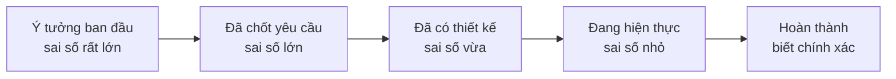
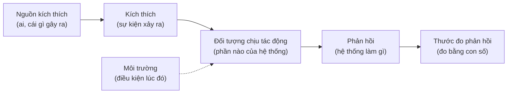
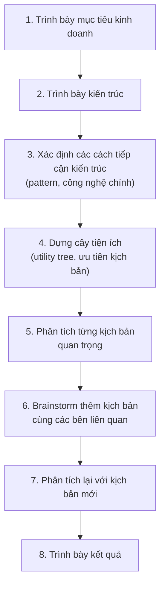
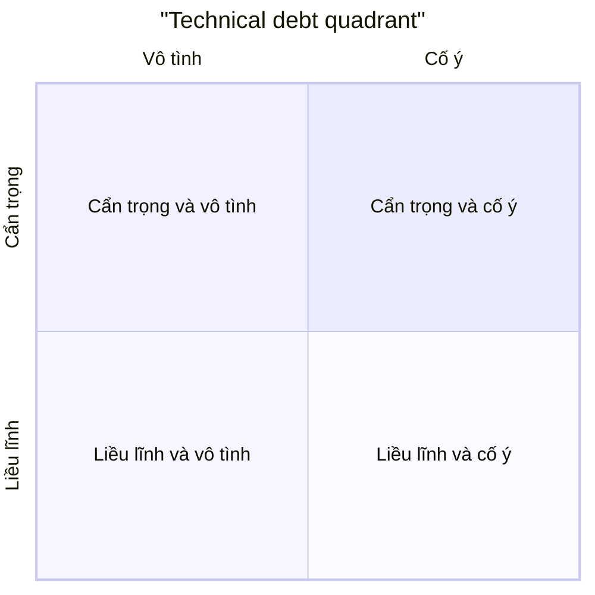

# Ước lượng và đánh giá

**Ước lượng** (estimation) là việc dự đoán công sức, thời gian, chi phí hoặc tài nguyên hệ thống cần cho một việc **khi còn nhiều điều chưa biết**. **Đánh giá** (evaluation) là việc kiểm tra một kiến trúc, một công nghệ hay một hệ thống đang chạy **có đáp ứng được mục tiêu không**, dựa trên tiêu chí rõ ràng thay vì cảm tính. Kiến trúc sư làm cả hai liên tục: ước lượng trước khi quyết, đánh giá sau khi quyết để biết có cần điều chỉnh không.

**Tương tự đơn giản:** Trước khi đi du lịch, bạn **ước lượng**: đi xe mất khoảng 5 đến 7 tiếng, xăng tầm vài trăm nghìn, khách sạn ba đêm. Con số không chính xác tuyệt đối, nhưng đủ để quyết có đi không và mang bao nhiêu tiền. Sau chuyến đi, bạn **đánh giá**: tốn nhiều hơn dự kiến ở khoản nào, đường nào tắc, lần sau nên đổi gì. Ước lượng không bao giờ đúng hoàn toàn, nhưng không ước lượng thì dễ hết tiền giữa đường.

---

:::note[Ghi nhớ nhanh]

- ⭐ **Ước lượng là một khoảng, không phải một con số** — "4 đến 8 tuần, khả năng cao nhất 5 tuần" trung thực hơn "6 tuần", và khoảng đó sẽ hẹp lại khi biết thêm (cone of uncertainty).
- ⭐ **Đánh giá kiến trúc phải dựa trên kịch bản thuộc tính chất lượng đo được** — "hệ thống phải nhanh" không đánh giá được, "95% request tìm kiếm trả về dưới 300 ms khi có 1.000 người dùng đồng thời" thì được.
- **Back-of-the-envelope** — tính nhẩm nhanh capacity (QPS, dung lượng, băng thông) để loại phương án sai từ sớm.
- **Fitness function** — kiểm tra tự động một đặc tính kiến trúc (không import chéo tầng, độ trễ dưới ngưỡng) chạy trong CI.
- **Nợ kỹ thuật** — phân loại theo technical debt quadrant để biết nợ nào chấp nhận được, nợ nào phải trả ngay.

:::

---

## Mục lục

- [Vì sao cần ước lượng và đánh giá?](#vì-sao-cần-ước-lượng-và-đánh-giá)
- [1. Cone of uncertainty](#1-cone-of-uncertainty)
- [2. Các kỹ thuật ước lượng công sức](#2-các-kỹ-thuật-ước-lượng-công-sức)
- [3. Back-of-the-envelope cho capacity](#3-back-of-the-envelope-cho-capacity)
- [4. Quality attribute scenario](#4-quality-attribute-scenario)
- [5. Đánh giá kiến trúc: ATAM và architecture review](#5-đánh-giá-kiến-trúc-atam-và-architecture-review)
- [6. Fitness function](#6-fitness-function)
- [7. Đánh giá công nghệ: tech radar và PoC](#7-đánh-giá-công-nghệ-tech-radar-và-poc)
- [8. Nợ kỹ thuật](#8-nợ-kỹ-thuật)
- [Khi nào cần nhớ?](#khi-nào-cần-nhớ)
- [Lỗi thường gặp](#lỗi-thường-gặp)
- [Câu hỏi phỏng vấn](#câu-hỏi-phỏng-vấn)

---

## Vì sao cần ước lượng và đánh giá?

**Vấn đề:** Mọi quyết định kiến trúc đều cần trả lời những câu hỏi có con số: làm mất bao lâu? Một server có chịu nổi không? Database có đủ chỗ cho 3 năm không? Công nghệ mới có thực sự tốt hơn công nghệ cũ không? Kiến trúc hiện tại có còn phù hợp không? Nếu trả lời bằng cảm tính, ta sẽ gặp:

- Cam kết tiến độ quá lạc quan, đội phải làm thêm giờ, chất lượng giảm.
- Hệ thống được thiết kế quá to (tốn tiền) hoặc quá nhỏ (sập khi tải tăng).
- Chọn công nghệ theo trào lưu, đến khi gặp vấn đề mới biết không phù hợp.
- Kiến trúc mục nát dần mà không ai nhận ra cho đến khi quá muộn.

**Giải pháp:** Dùng các kỹ thuật ước lượng có cơ sở (khoảng, so sánh tương đối, tính nhẩm capacity), đánh giá kiến trúc dựa trên kịch bản đo được, tự động hoá việc kiểm tra kiến trúc bằng fitness function, và theo dõi nợ kỹ thuật một cách có hệ thống.

:::tip[Dùng thực tế]

- **Lên kế hoạch quý:** ước lượng theo khoảng cho các epic lớn, cập nhật lại sau mỗi sprint.
- **Thiết kế hệ thống mới:** tính nhẩm QPS và dung lượng để chọn kiến trúc phù hợp.
- **Review đề xuất kiến trúc:** dùng quality attribute scenario và danh sách rủi ro thay vì "tôi thấy ổn".
- **Giữ kiến trúc không mục:** ArchUnit hoặc dependency-cruiser chạy trong CI, fail build khi có import vi phạm.

:::

---

## 1. Cone of uncertainty

**Cone of uncertainty** (nón bất định) mô tả hiện tượng: ở đầu dự án, sai số ước lượng rất lớn; càng đi tiếp, càng biết thêm về yêu cầu và kỹ thuật, khoảng sai số càng hẹp lại. Steve McConnell phổ biến khái niệm này trong sách *Software Estimation*.



Hệ quả thực tế:

- **Đừng cam kết con số chính xác ở giai đoạn ý tưởng.** Đưa một khoảng rộng và nói rõ giả định.
- **Ước lượng lại định kỳ.** Ước lượng không phải lời hứa một lần, mà là thông tin được cập nhật.
- **Giảm bất định chủ động** bằng spike, PoC, làm rõ yêu cầu, thay vì chờ nó tự giảm.
- Nón chỉ hẹp lại **nếu** dự án thực sự làm rõ được các điều chưa biết. Yêu cầu thay đổi liên tục thì nón không hẹp.

---

## 2. Các kỹ thuật ước lượng công sức

| Kỹ thuật | Cách làm | Khi nào dùng |
| --- | --- | --- |
| **Ước lượng tương đối** (relative estimation) | So sánh với việc đã làm: "cái này to gấp đôi tính năng đăng nhập" | Khi đội có lịch sử dự án tương tự |
| **Story point / T-shirt size** | Gán kích cỡ S, M, L, XL hoặc điểm Fibonacci 1, 2, 3, 5, 8 | Lên kế hoạch backlog, roadmap |
| **Three-point / PERT** | Ước 3 giá trị: lạc quan (O), khả dĩ nhất (M), bi quan (P) | Việc có nhiều rủi ro, cần một con số kỳ vọng |
| **Chia nhỏ** (work breakdown) | Chia việc thành phần nhỏ đủ để ước, rồi cộng lại | Khi đã có thiết kế tương đối rõ |
| **Dựa trên dữ liệu lịch sử** | Dùng velocity, cycle time của đội | Đội ổn định, công việc lặp lại |

### Three-point và PERT

Công thức PERT tính giá trị kỳ vọng E và độ lệch chuẩn xấp xỉ SD:

```text
E  = (O + 4M + P) / 6
SD = (P - O) / 6
```

Ví dụ ước lượng việc tích hợp cổng thanh toán mới:

| Phần việc | Lạc quan (O) | Khả dĩ (M) | Bi quan (P) | Kỳ vọng E |
| --- | --- | --- | --- | --- |
| Đọc tài liệu, sandbox | 1 ngày | 2 ngày | 4 ngày | 2,2 ngày |
| Tích hợp API, webhook | 3 ngày | 5 ngày | 10 ngày | 5,5 ngày |
| Xử lý lỗi, idempotency | 2 ngày | 3 ngày | 6 ngày | 3,3 ngày |
| Test, chứng nhận với đối tác | 2 ngày | 4 ngày | 10 ngày | 4,7 ngày |
| **Tổng** | 8 ngày | 14 ngày | 30 ngày | **khoảng 15,7 ngày** |

Thấy ngay: phần **test với đối tác** có khoảng rộng nhất, đó là rủi ro cần làm rõ sớm (hỏi đối tác quy trình chứng nhận mất bao lâu). Con số báo lên nên là một khoảng, ví dụ "khoảng 3 đến 4 tuần, phụ thuộc thời gian chứng nhận của đối tác".

### Ước lượng tương đối

Con người ước lượng **tương đối** tốt hơn **tuyệt đối**: khó nói chính xác một toà nhà cao bao nhiêu mét, nhưng dễ nói nó cao gấp đôi toà bên cạnh. Story point dựa trên ý này: chọn một việc mẫu làm mốc (ví dụ "thêm một trường vào form, có validate" = 2 điểm), rồi so các việc khác với nó. Velocity của đội sau vài sprint sẽ chuyển điểm thành thời gian.

---

## 3. Back-of-the-envelope cho capacity

**Back-of-the-envelope estimation** (tính nhẩm mặt sau phong bì) là phép tính thô, nhanh, dùng số tròn để biết **bậc độ lớn** (order of magnitude) của tải, dung lượng, băng thông. Mục tiêu không phải chính xác, mà để loại sớm các phương án sai bậc: một server hay một trăm server? vài GB hay vài TB?

Ví dụ: ước lượng cho tính năng **lưu lịch sử đơn hàng** của một sàn thương mại điện tử.

```text
Giả định:
- 1 triệu người dùng hoạt động mỗi ngày (DAU)
- Mỗi người xem lịch sử đơn 2 lần/ngày, đặt 0,1 đơn/ngày
- Một ngày khoảng 100.000 giây (làm tròn từ 86.400)

Tải đọc:
- 1.000.000 x 2 = 2.000.000 lượt đọc/ngày
- 2.000.000 / 100.000 = khoảng 20 QPS trung bình
- Giờ cao điểm gấp khoảng 5 lần → khoảng 100 QPS

Tải ghi:
- 1.000.000 x 0,1 = 100.000 đơn/ngày → khoảng 1 QPS, cao điểm khoảng 5 QPS

Dung lượng:
- Mỗi đơn khoảng 2 KB (gồm các dòng sản phẩm)
- 100.000 x 2 KB = 200 MB/ngày
- 1 năm khoảng 365 x 200 MB = khoảng 73 GB, 5 năm khoảng 365 GB
```

Kết luận rút ra trong vài phút: tải này **một instance PostgreSQL có index phù hợp** xử lý thoải mái, chưa cần sharding hay NoSQL. Nếu ai đó đề xuất dựng cụm Cassandra cho tính năng này, con số cho thấy đó là quá tay.

Một số con số nên nhớ ở mức bậc độ lớn:

| Đại lượng | Bậc độ lớn |
| --- | --- |
| Đọc từ RAM | nano giây |
| Đọc ngẫu nhiên từ SSD | chục đến trăm micro giây |
| Một vòng mạng trong cùng datacenter | dưới 1 mili giây |
| Một vòng mạng xuyên lục địa | khoảng trăm mili giây |
| Số giây trong một ngày | khoảng 100.000 (chính xác 86.400) |

Chi tiết hơn về các con số độ trễ và cách tính capacity có trong topic [System Design](/docs/system-design/intro).

---

## 4. Quality attribute scenario

**Thuộc tính chất lượng** (quality attribute) như hiệu năng, khả năng sẵn sàng, bảo mật, khả năng sửa đổi thường được nói rất mơ hồ: "hệ thống phải nhanh", "phải dễ mở rộng". Để đánh giá được, cần viết chúng thành **quality attribute scenario** (kịch bản thuộc tính chất lượng), một cấu trúc do Viện Kỹ thuật Phần mềm (SEI) của Đại học Carnegie Mellon đề xuất, gồm 6 phần:



Ví dụ:

| Thuộc tính | Kịch bản mơ hồ | Kịch bản đo được |
| --- | --- | --- |
| **Hiệu năng** | "Tìm kiếm phải nhanh" | Khi 1.000 người dùng đồng thời tìm kiếm sản phẩm trong giờ cao điểm, 95% request trả kết quả dưới 300 ms |
| **Sẵn sàng** | "Không được sập" | Khi một instance của Order service bị chết lúc vận hành bình thường, hệ thống tự chuyển tải trong 30 giây, không mất đơn hàng nào |
| **Sửa đổi được** | "Dễ thêm cổng thanh toán" | Khi cần thêm một cổng thanh toán mới, một developer hoàn thành trong 5 ngày mà không phải sửa module đơn hàng |
| **Bảo mật** | "Phải an toàn" | Khi kẻ tấn công thử đăng nhập sai liên tục, tài khoản bị khoá tạm sau 5 lần trong 15 phút và có cảnh báo cho đội vận hành |

Kịch bản đo được là nền tảng cho mọi phương pháp đánh giá kiến trúc, và cũng là đầu vào để viết fitness function.

---

## 5. Đánh giá kiến trúc: ATAM và architecture review

### ATAM

**ATAM** (Architecture Tradeoff Analysis Method) là phương pháp đánh giá kiến trúc có cấu trúc, cũng do SEI phát triển. Ý tưởng cốt lõi: không hỏi "kiến trúc này tốt không", mà hỏi **"kiến trúc này đáp ứng các kịch bản chất lượng quan trọng nhất thế nào, và đánh đổi những gì?"**.

Các bước chính (rút gọn):



Kết quả của ATAM gồm:

| Kết quả | Ý nghĩa | Ví dụ |
| --- | --- | --- |
| **Rủi ro** (risk) | Quyết định có thể gây vấn đề | Toàn bộ service dùng chung một DB, một query chậm làm chậm tất cả |
| **Không rủi ro** (non-risk) | Quyết định đã được phân tích là ổn | Dùng CDN cho ảnh sản phẩm đáp ứng kịch bản hiệu năng |
| **Điểm nhạy cảm** (sensitivity point) | Một tham số ảnh hưởng mạnh đến một thuộc tính | Kích thước connection pool quyết định thông lượng |
| **Điểm đánh đổi** (tradeoff point) | Một quyết định ảnh hưởng nhiều thuộc tính theo hướng ngược nhau | Mã hoá toàn bộ payload tăng bảo mật nhưng giảm hiệu năng |

ATAM đầy đủ là một quy trình khá nặng (nhiều buổi, nhiều bên tham gia), phù hợp với hệ thống lớn, rủi ro cao. Nhiều đội áp dụng phiên bản rút gọn.

### Architecture review nhẹ

Với đa số dự án web, một buổi **architecture review** rút gọn là đủ:

1. Tác giả gửi design doc trước, có các kịch bản chất lượng chính.
2. Người review đọc trước, chuẩn bị câu hỏi.
3. Buổi review tập trung vào: kịch bản nào chưa được đáp ứng, rủi ro nào chưa có cách giảm thiểu, điểm đánh đổi nào cần lãnh đạo biết.
4. Kết quả: danh sách rủi ro, việc cần làm, quyết định ghi thành ADR.

Câu hỏi hay dùng trong review: "Chuyện gì xảy ra nếu service X chết?", "Tải tăng gấp 10 thì phần nào gãy trước?", "Muốn đổi Y sau này thì phải sửa bao nhiêu chỗ?", "Dữ liệu nhạy cảm đi qua những đâu?".

---

## 6. Fitness function

**Architectural fitness function** (hàm thích nghi kiến trúc) là khái niệm trong sách *Building Evolutionary Architectures* (Neal Ford, Rebecca Parsons, Patrick Kua): một **phép kiểm tra khách quan** cho biết hệ thống còn giữ được một đặc tính kiến trúc mong muốn hay không. Tốt nhất là tự động và chạy liên tục trong CI.

Lý do cần: kiến trúc trên giấy rất dễ bị vi phạm dần dần. Một dev vội import thẳng repository vào controller, một người khác làm theo, sau một năm "kiến trúc phân tầng" chỉ còn trên sơ đồ.

| Loại | Ví dụ | Công cụ |
| --- | --- | --- |
| **Cấu trúc** | Controller không được import repository; không có phụ thuộc vòng | ArchUnit (Java), dependency-cruiser (Node.js), ESLint boundaries |
| **Hiệu năng** | p95 latency của API tìm kiếm dưới 300 ms | k6, Gatling trong pipeline |
| **Bảo mật** | Không có dependency có lỗ hổng nghiêm trọng | npm audit, OWASP Dependency-Check, Snyk |
| **Vận hành** | Mỗi service có health check, có metric | Kiểm tra cấu hình trong CI |

### Ví dụ ArchUnit cho Spring Boot

```java
// Kiểm tra quy tắc phân tầng bằng ArchUnit, chạy như một test JUnit bình thường
@AnalyzeClasses(packages = "com.shop.order")
class ArchitectureTest {

    @ArchTest
    static final ArchRule layers = layeredArchitecture()
        .consideringAllDependencies()
        .layer("Controller").definedBy("..controller..")
        .layer("Service").definedBy("..service..")
        .layer("Repository").definedBy("..repository..")
        .whereLayer("Controller").mayNotBeAccessedByAnyLayer()
        .whereLayer("Service").mayOnlyBeAccessedByLayers("Controller")
        .whereLayer("Repository").mayOnlyBeAccessedByLayers("Service");

    @ArchTest
    static final ArchRule noCycles = slices()
        .matching("com.shop.order.(*)..")
        .should().beFreeOfCycles();
}
```

### Ví dụ dependency-cruiser cho Node.js

```js
// .dependency-cruiser.js: route không được gọi thẳng tầng database
module.exports = {
  forbidden: [
    {
      name: 'no-routes-to-db',
      severity: 'error',
      comment: 'Route phải đi qua tầng service, không gọi thẳng db',
      from: { path: '^src/routes' },
      to: { path: '^src/db' },
    },
    {
      name: 'no-circular',
      severity: 'error',
      from: {},
      to: { circular: true },
    },
  ],
};
```

```bash
# Chạy trong CI, fail nếu có vi phạm
npx depcruise src --config .dependency-cruiser.js
```

Fitness function biến quy tắc kiến trúc từ "lời dặn" thành **thứ máy kiểm tra được**, giống như test biến yêu cầu nghiệp vụ thành thứ kiểm tra được.

---

## 7. Đánh giá công nghệ: tech radar và PoC

### Tech radar

**Technology radar** là cách tổ chức đánh giá công nghệ được ThoughtWorks phổ biến. Mỗi công nghệ được đặt vào một trong bốn vòng:

| Vòng | Ý nghĩa | Ví dụ cách dùng trong một công ty |
| --- | --- | --- |
| **Adopt** | Đã chứng minh, khuyến nghị dùng | PostgreSQL, React, Spring Boot |
| **Trial** | Đáng thử trong dự án thật, có kiểm soát | Một thư viện state management mới cho 1 dự án |
| **Assess** | Đáng tìm hiểu, chưa dùng trong production | Một runtime JavaScript mới |
| **Hold** | Không nên bắt đầu dùng mới | Framework đã hết hỗ trợ |

Nhiều công ty tự xây **tech radar nội bộ** để các đội biết công nghệ nào được khuyến khích, tránh mỗi đội chọn một kiểu khiến việc vận hành và chuyển người giữa các đội khó khăn.

### PoC và spike

Khi phải chọn giữa các công nghệ, **đọc tài liệu và benchmark của người khác là chưa đủ**. Hãy làm một **PoC** (proof of concept) hoặc **spike** (thử nghiệm có giới hạn thời gian) trên **trường hợp sử dụng thật** của mình.

Một PoC tốt:

- Có **câu hỏi cụ thể** cần trả lời: "Kafka có giữ được thứ tự event theo từng đơn hàng ở tải 500 event/giây không?"
- Có **thời hạn cứng** (vài ngày đến 1–2 tuần).
- Có **tiêu chí thành công** viết trước khi làm.
- Kết quả được ghi lại (ADR hoặc báo cáo ngắn), kể cả khi kết quả là "không phù hợp".
- Code PoC **không mặc nhiên lên production**. Nếu muốn dùng, viết lại cho đúng chuẩn.

Ma trận so sánh công nghệ thường dùng:

| Tiêu chí | Trọng số | RabbitMQ | Kafka | SQS |
| --- | --- | --- | --- | --- |
| Đáp ứng yêu cầu thứ tự và thông lượng | 30% | 3 | 5 | 3 |
| Kinh nghiệm của đội | 25% | 4 | 2 | 3 |
| Chi phí vận hành | 25% | 3 | 2 | 5 |
| Hệ sinh thái, cộng đồng | 20% | 4 | 5 | 4 |
| **Điểm có trọng số** | | **3,45** | **3,5** | **3,7** |

Ma trận không quyết định thay ta, nhưng buộc mọi người nói rõ tiêu chí và trọng số, từ đó tranh luận trở nên cụ thể. Điểm trong bảng trên chỉ là ví dụ minh hoạ, mỗi tổ chức sẽ chấm khác nhau. Xem thêm bài [Ra quyết định](/docs/software-architect/02-important-skills/2_ra-quyet-dinh).

---

## 8. Nợ kỹ thuật

**Nợ kỹ thuật** (technical debt) là ẩn dụ do Ward Cunningham đưa ra: chọn cách làm nhanh hôm nay giống như vay nợ, ta được lợi ngay (ra tính năng sớm) nhưng phải trả **lãi** về sau (mỗi lần sửa code đó lại tốn thêm công). Nợ không xấu nếu vay có chủ đích và có kế hoạch trả.

### Technical debt quadrant

Martin Fowler phân loại nợ theo hai trục: **cẩn trọng hay liều lĩnh** (prudent / reckless) và **cố ý hay vô tình** (deliberate / inadvertent):



| Loại | Câu nói điển hình | Cách xử lý |
| --- | --- | --- |
| **Liều lĩnh, cố ý** | "Không có thời gian thiết kế đâu, cứ code đi" | Nguy hiểm nhất, cần thay đổi văn hoá và quy trình |
| **Cẩn trọng, cố ý** | "Ra mắt trước, ghi lại nợ, sprint sau làm lại phần này" | Chấp nhận được nếu có ticket và kế hoạch trả |
| **Liều lĩnh, vô tình** | "Phân tầng là gì?" | Đào tạo, review, fitness function |
| **Cẩn trọng, vô tình** | "Giờ mới hiểu lẽ ra nên thiết kế thế này" | Không tránh được, là cái giá của việc học, refactor dần |

### Đo và quản lý nợ

Nợ kỹ thuật khó đo chính xác, nhưng có thể theo dõi qua các tín hiệu:

| Tín hiệu | Cách đo |
| --- | --- |
| **Code khó sửa** | Độ phức tạp (cyclomatic complexity), code trùng lặp, SonarQube |
| **Điểm nóng** (hotspot) | File vừa phức tạp vừa sửa nhiều nhất (phân tích lịch sử git) |
| **Tốc độ giảm** | Lead time, cycle time của tính năng tăng dần qua các quý |
| **Lỗi lặp lại** | Số bug quay lại ở cùng một module |
| **Dependency lỗi thời** | Số thư viện chậm nhiều phiên bản chính, có lỗ hổng |

Cách quản lý thực tế:

1. **Ghi nợ vào backlog** như mọi công việc khác, kèm "lãi suất": nó làm chậm việc gì, tốn bao nhiêu mỗi lần.
2. **Ưu tiên nợ ở hotspot**: code xấu mà không ai đụng tới thì lãi gần bằng 0, chưa cần trả.
3. **Dành một phần năng lực cố định** mỗi sprint cho trả nợ thay vì chờ "dự án refactor lớn" không bao giờ được duyệt.
4. **Nói bằng ngôn ngữ kinh doanh** khi xin thời gian trả nợ: "module thanh toán làm mỗi tính năng mới chậm thêm khoảng 1 tuần" thuyết phục hơn "code xấu quá".

---

## Khi nào cần nhớ?

- **Khi được hỏi "bao lâu xong?":**
  - Trả lời bằng khoảng, nói rõ giả định.
  - Chia nhỏ, dùng three-point cho phần rủi ro.
  - Cập nhật lại khi biết thêm.
- **Khi thiết kế hệ thống:**
  - Tính nhẩm QPS, dung lượng, băng thông trước khi chọn công nghệ.
  - Viết quality attribute scenario đo được cho các thuộc tính quan trọng.
- **Khi review kiến trúc:**
  - Hỏi theo kịch bản: hỏng thì sao, tải gấp 10 thì sao, đổi thì sửa bao nhiêu.
  - Liệt kê rủi ro, điểm nhạy cảm, điểm đánh đổi.
- **Khi giữ kiến trúc lâu dài:**
  - Fitness function trong CI.
  - Tech radar nội bộ.
  - Theo dõi nợ kỹ thuật ở hotspot.

---

## Lỗi thường gặp

### Lỗi 1: Đưa một con số chính xác ở giai đoạn đầu

"Dự án mất 3 tháng" nói khi còn chưa có yêu cầu chi tiết sẽ bị coi là cam kết. Khi trễ, uy tín cả đội bị ảnh hưởng. Đưa khoảng, nêu giả định và mốc ước lượng lại.

### Lỗi 2: Nhầm ước lượng với mục tiêu

Sếp nói "phải xong trước Tết", đội "ước lượng" ra đúng ngày trước Tết. Đó là mục tiêu, không phải ước lượng. Hai thứ cần tách bạch: ước lượng trung thực, rồi thương lượng phạm vi để đạt mục tiêu.

### Lỗi 3: Thiết kế cho tải tưởng tượng

Dựng Kafka, sharding, cache nhiều tầng cho hệ thống chỉ có vài QPS. Một phép tính nhẩm 5 phút sẽ cho thấy một database bình thường là đủ. Thiết kế cho tải dự kiến có cơ sở, chừa đường để mở rộng.

### Lỗi 4: Đánh giá kiến trúc bằng cảm tính

Buổi review chỉ toàn "trông ổn", "anh thấy hơi phức tạp". Không có kịch bản đo được thì không thể biết kiến trúc có đạt hay không. Viết kịch bản trước, review theo kịch bản.

### Lỗi 5: Quy tắc kiến trúc chỉ nằm trên giấy

Wiki ghi rõ "controller không gọi repository", nhưng không gì kiểm tra. Sau vài tháng, quy tắc bị phá ở hàng chục chỗ. Chuyển quy tắc thành fitness function chạy trong CI.

### Lỗi 6: PoC biến thành production

PoC viết vội, không test, không xử lý lỗi, nhưng "chạy được rồi" nên được đưa thẳng lên production. Nợ kỹ thuật liều lĩnh sinh ra từ đây. Xác định trước PoC là để vứt đi.

---

## Câu hỏi phỏng vấn

Những câu thường gặp về chủ đề này. Tự trả lời trước, rồi bấm **Xem đáp án** để đối chiếu.

**1. Bạn ước lượng một tính năng lớn mà yêu cầu còn chưa rõ như thế nào?**

<details className="qa">
<summary>Xem đáp án</summary>

- Nêu rõ đang ở đầu cone of uncertainty, nên đưa **khoảng rộng** kèm giả định.
- Chia tính năng thành các phần, ước lượng tương đối với việc đã làm, dùng three-point cho phần rủi ro.
- Xác định phần nào có khoảng rộng nhất, đó là chỗ cần **spike** hoặc làm rõ yêu cầu trước.
- Hẹn mốc ước lượng lại sau khi spike xong hoặc yêu cầu được chốt.
- Nếu có hạn chót cứng, đề xuất cắt phạm vi (MVP) thay vì nén ước lượng.

</details>

**2. Ước lượng nhanh: một dịch vụ rút gọn link có 100 triệu link mới mỗi tháng, cần bao nhiêu dung lượng cho 5 năm?**

<details className="qa">
<summary>Xem đáp án</summary>

- Số link: 100 triệu x 12 x 5 = 6 tỷ link.
- Mỗi bản ghi giả sử khoảng 500 byte (link gốc, mã ngắn, thời gian tạo, người tạo).
- Dung lượng: 6 tỷ x 500 byte = 3.000 GB, tức khoảng 3 TB, chưa tính index và bản sao.
- Ghi: 100 triệu / (30 x 100.000 giây) khoảng 33 QPS trung bình.
- Nếu tỷ lệ đọc/ghi khoảng 100:1 thì đọc khoảng 3.300 QPS trung bình, cao điểm cao hơn vài lần, nên cần cache.

Điều quan trọng là nói rõ giả định và làm tròn hợp lý, không phải con số tuyệt đối.

</details>

**3. Fitness function là gì? Cho ví dụ.**

<details className="qa">
<summary>Xem đáp án</summary>

Là một phép kiểm tra khách quan, thường tự động, cho biết hệ thống còn giữ một đặc tính kiến trúc mong muốn không. Ví dụ:

- **ArchUnit** test trong Java: tầng controller không được truy cập trực tiếp repository, không có phụ thuộc vòng giữa các package.
- **dependency-cruiser** trong Node.js: thư mục `routes` không được import `db`.
- Test hiệu năng trong pipeline: p95 của API dưới ngưỡng.
- Kiểm tra dependency không có lỗ hổng nghiêm trọng.

Fitness function giúp kiến trúc không bị mục dần, giống test giữ cho nghiệp vụ không bị hỏng.

</details>

**4. ATAM là gì? Kết quả chính của nó gồm những gì?**

<details className="qa">
<summary>Xem đáp án</summary>

ATAM (Architecture Tradeoff Analysis Method) là phương pháp đánh giá kiến trúc của SEI, đánh giá kiến trúc theo các **kịch bản thuộc tính chất lượng** quan trọng nhất với mục tiêu kinh doanh. Kết quả gồm: **rủi ro**, **không rủi ro**, **điểm nhạy cảm** (tham số ảnh hưởng mạnh đến một thuộc tính) và **điểm đánh đổi** (quyết định ảnh hưởng nhiều thuộc tính theo hướng ngược nhau). Với dự án nhỏ, có thể dùng phiên bản rút gọn: design doc có kịch bản và một buổi review tập trung vào rủi ro.

</details>

**5. Bạn thuyết phục lãnh đạo dành thời gian trả nợ kỹ thuật như thế nào?**

<details className="qa">
<summary>Xem đáp án</summary>

- Nói bằng **tác động kinh doanh**, không bằng "code xấu": tính năng ở module này mất gấp đôi thời gian, bug lặp lại gây mất đơn hàng.
- Đưa **dữ liệu**: cycle time tăng qua các quý, số sự cố liên quan, hotspot từ lịch sử git.
- Đề xuất cụ thể, có phạm vi: trả phần nợ ở hotspot, đo kết quả sau đó.
- Ưu tiên cách **trả dần** (một phần năng lực mỗi sprint) thay vì một dự án refactor lớn khó duyệt.
- Phân biệt nợ cẩn trọng có chủ đích (chấp nhận được) với nợ cần trả ngay.

</details>

**6. Khi nào nên làm PoC trước khi chọn công nghệ?**

<details className="qa">
<summary>Xem đáp án</summary>

Khi quyết định **khó đảo ngược** (database chính, message broker, framework nền), khi đội **chưa có kinh nghiệm** với công nghệ đó, hoặc khi có **yêu cầu đặc thù** mà tài liệu không trả lời được (thứ tự event ở tải cao, độ trễ ở dữ liệu thật). PoC cần câu hỏi cụ thể, thời hạn cứng, tiêu chí thành công viết trước, và không mặc nhiên đưa lên production.

</details>
