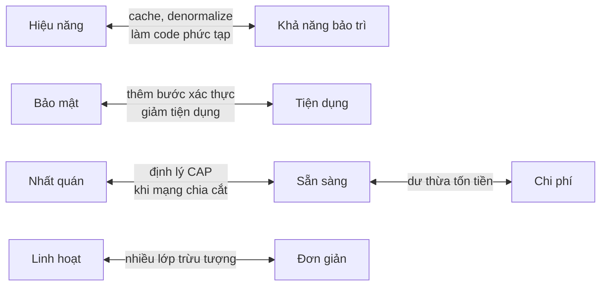
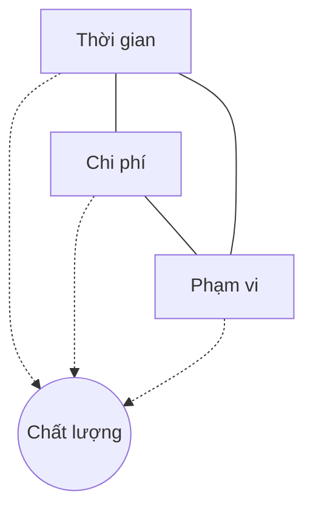
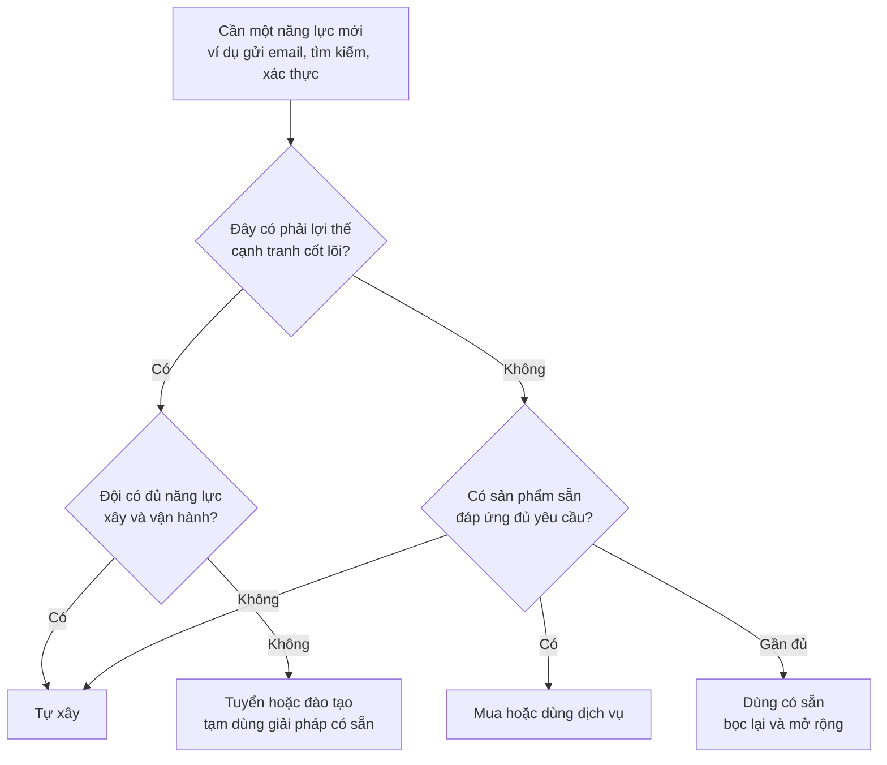
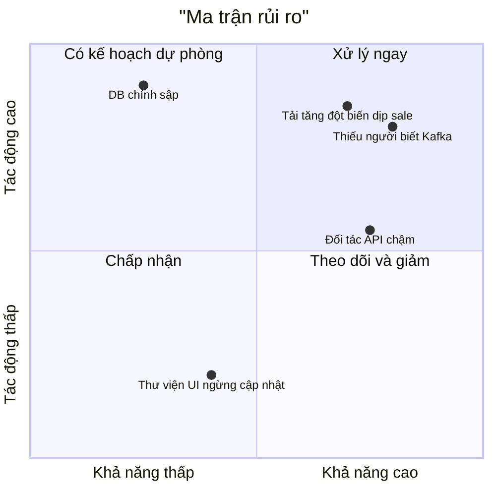
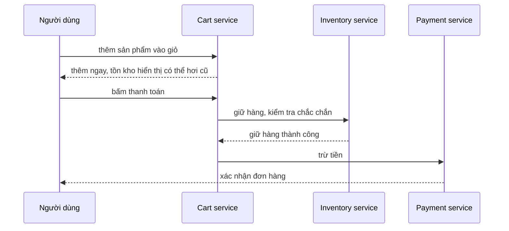

# Cân bằng

**Cân bằng** (balance) là kỹ năng giữ cho các mục tiêu **kéo nhau về các phía** ở một điểm chấp nhận được. Trong kiến trúc phần mềm gần như không có quyết định nào chỉ có lợi: tăng hiệu năng thường làm code khó bảo trì hơn, tăng bảo mật thường làm sản phẩm khó dùng hơn, ra mắt nhanh thường đồng nghĩa với nợ kỹ thuật. Kiến trúc sư không tìm phương án "hoàn hảo", mà tìm **điểm cân bằng phù hợp nhất với bối cảnh hiện tại**, và biết khi nào bối cảnh đã đổi để dịch điểm cân bằng theo.

**Tương tự đơn giản:** Thiết kế một chiếc xe hơi. Muốn xe **nhanh** thì động cơ to, tốn xăng. Muốn xe **an toàn** thì khung dày, xe nặng, chậm hơn. Muốn xe **rẻ** thì phải bớt cả hai. Xe đua F1, xe gia đình và xe tải đều là "xe tốt", nhưng mỗi loại chọn một điểm cân bằng khác nhau vì phục vụ mục đích khác nhau. Không ai chê xe tải vì nó không chạy nhanh như F1.

---

:::note[Ghi nhớ nhanh]

- ⭐ **Mọi thuộc tính chất lượng đều có giá** — muốn thêm một thứ là phải trả bằng thứ khác: thời gian, tiền, độ phức tạp, hoặc một thuộc tính chất lượng khác.
- ⭐ **Điểm cân bằng phụ thuộc bối cảnh và thay đổi theo thời gian** — startup tìm product-market fit ưu tiên tốc độ; ngân hàng ưu tiên đúng đắn và an toàn; cùng một công ty cũng dịch ưu tiên khi lớn lên.
- **Tam giác chất lượng, thời gian, chi phí** — cố định hai thì cái thứ ba phải linh hoạt, và phạm vi (scope) thường là đòn bẩy tốt nhất.
- **Build vs buy** — tự xây khi đó là lợi thế cạnh tranh cốt lõi; mua hoặc dùng dịch vụ có sẵn cho phần còn lại.
- **Quản lý rủi ro** — liệt kê, đánh giá khả năng và tác động, chọn né, giảm, chuyển hoặc chấp nhận một cách có chủ đích.

:::

---

## Mục lục

- [Vì sao cân bằng là kỹ năng cốt lõi?](#vì-sao-cân-bằng-là-kỹ-năng-cốt-lõi)
- [1. Thuộc tính chất lượng xung đột với nhau](#1-thuộc-tính-chất-lượng-xung-đột-với-nhau)
- [2. Chất lượng, thời gian, chi phí và phạm vi](#2-chất-lượng-thời-gian-chi-phí-và-phạm-vi)
- [3. Ngắn hạn và dài hạn](#3-ngắn-hạn-và-dài-hạn)
- [4. Build vs buy](#4-build-vs-buy)
- [5. Chuẩn hoá và tự do của đội nhóm](#5-chuẩn-hoá-và-tự-do-của-đội-nhóm)
- [6. Quản lý rủi ro](#6-quản-lý-rủi-ro)
- [7. Tình huống thực tế](#7-tình-huống-thực-tế)
- [Khi nào cần nhớ?](#khi-nào-cần-nhớ)
- [Lỗi thường gặp](#lỗi-thường-gặp)
- [Câu hỏi phỏng vấn](#câu-hỏi-phỏng-vấn)

---

## Vì sao cân bằng là kỹ năng cốt lõi?

**Vấn đề:** Developer thường được đánh giá theo một trục: code chạy đúng, nhanh, sạch. Khi lên vai trò kiến trúc, số trục tăng lên rất nhiều và chúng **mâu thuẫn nhau**. Các triệu chứng khi thiếu kỹ năng cân bằng:

- **Tối ưu một chiều:** hệ thống cực nhanh nhưng không ai dám sửa; hoặc kiến trúc "chuẩn sách" nhưng ra mắt chậm 6 tháng, đối thủ đã chiếm thị trường.
- **Over-engineering:** dựng microservices, event sourcing, Kubernetes cho sản phẩm 100 người dùng.
- **Under-engineering:** "cứ làm cho chạy đã", đến khi có 100.000 người dùng thì phải viết lại từ đầu.
- **Quyết định theo người nói to nhất** thay vì theo ưu tiên thực sự của sản phẩm.

**Giải pháp:** Biến các ưu tiên ngầm thành **ưu tiên rõ ràng**: thuộc tính chất lượng nào quan trọng nhất cho sản phẩm này, ở giai đoạn này? Sau đó đánh giá mỗi quyết định theo những gì nó **được** và **mất**, chấp nhận đánh đổi một cách có ý thức, ghi lại lý do, và xem lại khi bối cảnh thay đổi.

:::tip[Dùng thực tế]

- **Đầu dự án:** cùng PO xếp hạng 3 đến 5 thuộc tính chất lượng quan trọng nhất, dùng nó làm "la bàn" cho các quyết định sau.
- **Khi chọn công nghệ:** hỏi "ta được gì, mất gì, và cái mất có chấp nhận được không" thay vì "cái nào tốt hơn".
- **Khi deadline gấp:** thương lượng phạm vi thay vì cắt chất lượng âm thầm.
- **Khi đội muốn dùng công nghệ mới:** cân nhắc lợi ích của đội với chi phí vận hành của cả tổ chức.

:::

---

## 1. Thuộc tính chất lượng xung đột với nhau

**Thuộc tính chất lượng** (quality attribute, còn gọi là *-ilities* vì nhiều từ tiếng Anh kết thúc bằng "-ility": scalability, availability, maintainability...) mô tả hệ thống **tốt đến mức nào**, khác với yêu cầu chức năng mô tả hệ thống **làm gì**.

Một số cặp xung đột kinh điển:

| Cặp thuộc tính | Vì sao xung đột | Ví dụ cụ thể |
| --- | --- | --- |
| **Hiệu năng vs khả năng bảo trì** | Tối ưu thường thêm cache, denormalize, code đặc thù khó đọc | Viết SQL tay tối ưu thay vì dùng JPA; nhanh hơn nhưng mỗi lần đổi schema phải sửa nhiều chỗ |
| **Bảo mật vs tiện dụng** | Mỗi lớp bảo vệ là một bước thêm cho người dùng | Bắt buộc 2FA mỗi lần đăng nhập an toàn hơn nhưng nhiều người dùng bỏ đi |
| **Nhất quán vs sẵn sàng** | Khi mạng chia cắt, phải chọn trả lời ngay (có thể sai) hoặc chờ (có thể lỗi) | Định lý CAP: số dư ngân hàng chọn nhất quán, số lượt thích chọn sẵn sàng |
| **Linh hoạt vs đơn giản** | Càng nhiều điểm mở rộng, càng nhiều lớp trừu tượng | Plugin system cho phép tuỳ biến mọi thứ nhưng khó hiểu cho người mới |
| **Chi phí vs khả năng sẵn sàng** | Sẵn sàng cao cần dư thừa: nhiều vùng, nhiều bản sao | Chạy đa vùng (multi-region) có thể làm chi phí hạ tầng tăng gấp nhiều lần |
| **Tốc độ ra mắt vs chất lượng nội tại** | Làm nhanh thường bỏ qua test, thiết kế | MVP ra nhanh nhưng nợ kỹ thuật tích tụ |

Lưu ý: không phải lúc nào cũng xung đột. Code đơn giản, rõ ràng thường **vừa** dễ bảo trì **vừa** ít lỗi bảo mật hơn. Kiến trúc sư giỏi tìm các quyết định cải thiện nhiều thuộc tính cùng lúc trước, rồi mới đánh đổi ở phần còn lại.

### Xếp hạng ưu tiên

Cách đơn giản để cân bằng có hệ thống: buộc các bên liên quan **xếp hạng** thuộc tính chất lượng, không cho phép "tất cả đều quan trọng nhất".

| Sản phẩm | Ưu tiên 1 | Ưu tiên 2 | Ưu tiên 3 | Có thể nới |
| --- | --- | --- | --- | --- |
| Ví điện tử | Đúng đắn, nhất quán | Bảo mật | Sẵn sàng | Tốc độ ra tính năng mới |
| Mạng xã hội giai đoạn đầu | Tốc độ ra mắt | Tiện dụng | Chi phí thấp | Nhất quán tuyệt đối |
| Hệ thống nội bộ cho 50 nhân viên | Chi phí thấp | Dễ bảo trì | Tiện dụng | Khả năng mở rộng |
| Nền tảng bán vé sự kiện | Chịu tải đột biến | Nhất quán (không bán trùng ghế) | Sẵn sàng | Tính năng phụ |

---

## 2. Chất lượng, thời gian, chi phí và phạm vi

**Tam giác quản lý dự án** (iron triangle) nói rằng thời gian, chi phí và phạm vi ràng buộc lẫn nhau, và chất lượng nằm ở giữa chịu ảnh hưởng của cả ba. Thay đổi một cạnh thì ít nhất một cạnh khác phải đổi theo.

Khi deadline bị ép, có bốn lựa chọn:

| Lựa chọn | Hệ quả | Khi nào hợp lý |
| --- | --- | --- |
| **Cắt phạm vi** | Ra ít tính năng hơn nhưng chất lượng giữ được | Hầu như luôn là lựa chọn tốt nhất; ra MVP rồi bổ sung |
| **Thêm người** | Tốn tiền, và theo định luật Brooks, thêm người vào dự án đang trễ thường làm nó trễ hơn | Chỉ khi việc chia nhỏ được và còn nhiều thời gian |
| **Lùi deadline** | Mất cơ hội thị trường | Khi deadline không gắn với sự kiện cứng |
| **Cắt chất lượng** | Nợ kỹ thuật, lỗi production, chậm về sau | Chỉ khi có chủ đích, có ghi nợ và kế hoạch trả |

Vai trò của kiến trúc sư ở đây là **làm cho đánh đổi trở nên rõ ràng**. Câu nói "được, em sẽ cố" khi deadline bị ép thường có nghĩa là chất lượng bị cắt âm thầm. Thay vào đó: "Nếu giữ deadline này, ta có thể ra luồng thanh toán bằng thẻ trước, ví điện tử để bản sau. Nếu cần cả hai, cần thêm 2 tuần."

---

## 3. Ngắn hạn và dài hạn

Nhiều quyết định có lợi ngắn hạn nhưng hại dài hạn, hoặc ngược lại. Kiến trúc sư phải nhìn được cả hai thang thời gian.

| Quyết định | Lợi ngắn hạn | Hại dài hạn |
| --- | --- | --- |
| Copy-paste module thay vì trích xuất dùng chung | Nhanh, không ảnh hưởng chỗ khác | Sửa bug phải sửa nhiều chỗ |
| Gọi thẳng DB của service khác | Không cần làm API | Hai service bị khoá chặt với nhau, không đổi schema được |
| Bỏ qua test | Ra tính năng sớm | Mỗi thay đổi về sau rủi ro hơn, chậm hơn |
| Chọn công nghệ đội quen dù không tối ưu | Ra sản phẩm nhanh, ít lỗi | Có thể phải đổi khi quy mô lớn |
| Dựng hạ tầng tự động hoá từ đầu | (hại ngắn hạn) chậm ra mắt | (lợi dài hạn) deploy nhanh, ít sự cố |

Một số nguyên tắc giúp cân bằng:

- **Phân biệt quyết định dễ đảo ngược và khó đảo ngược.** Quyết định dễ đảo ngược (tên biến, thư viện UI nhỏ) cứ chọn nhanh. Quyết định khó đảo ngược (database chính, ranh giới service, định dạng dữ liệu công khai) cần cân nhắc kỹ hơn.
- **Trì hoãn quyết định đến thời điểm hợp lý cuối cùng** (last responsible moment): quyết khi có đủ thông tin, nhưng trước khi việc trì hoãn bắt đầu gây hại.
- **Giữ đường lui.** Nếu buộc phải chọn nhanh, thiết kế sao cho sau này đổi được: bọc thư viện bên thứ ba sau một interface, giữ ranh giới module rõ ràng dù vẫn chạy chung một ứng dụng.

---

## 4. Build vs buy

**Build vs buy** là câu hỏi: tự xây một thành phần, hay mua/dùng sản phẩm, dịch vụ có sẵn (bao gồm SaaS, mã nguồn mở, dịch vụ cloud được quản lý)?

| Tiêu chí | Tự xây (build) | Mua / dùng có sẵn (buy) |
| --- | --- | --- |
| **Mức kiểm soát** | Toàn quyền, tuỳ biến tối đa | Bị giới hạn bởi sản phẩm |
| **Chi phí ban đầu** | Cao (thời gian của đội) | Thấp hơn, thường trả theo tháng hoặc theo lượng dùng |
| **Chi phí dài hạn** | Bảo trì, vá lỗi, vận hành mãi mãi | Phí tăng theo quy mô, có thể đắt khi lớn |
| **Thời gian ra mắt** | Chậm | Nhanh |
| **Rủi ro** | Rủi ro kỹ thuật, phụ thuộc người viết | Phụ thuộc nhà cung cấp (vendor lock-in), nhà cung cấp tăng giá hoặc ngừng dịch vụ |
| **Lợi thế cạnh tranh** | Có thể tạo khác biệt | Đối thủ cũng dùng được |

Ví dụ thường gặp với một sản phẩm web:

- **Nên dùng có sẵn:** xác thực (Auth0, Keycloak, Cognito), gửi email (SES, SendGrid), thanh toán (cổng thanh toán), giám sát (Grafana, Datadog), tìm kiếm cơ bản (Elasticsearch, OpenSearch).
- **Có thể tự xây:** thuật toán gợi ý sản phẩm nếu đó là điểm khác biệt, logic định giá đặc thù, quy trình nghiệp vụ cốt lõi.

Sai lầm hay gặp là đánh giá thấp chi phí **vận hành** khi tự xây. Viết một hệ thống xác thực mất vài tuần, nhưng giữ nó an toàn trước các lỗ hổng mới thì mất công mãi mãi.

---

## 5. Chuẩn hoá và tự do của đội nhóm

Khi tổ chức có nhiều đội, câu hỏi xuất hiện: mỗi đội được tự chọn ngôn ngữ, framework, database, hay phải theo chuẩn chung?

| | Chuẩn hoá cao | Tự do cao |
| --- | --- | --- |
| **Ưu điểm** | Dễ chuyển người giữa đội, dùng chung công cụ, vận hành đơn giản, bảo mật dễ kiểm soát | Đội chọn công cụ tốt nhất cho bài toán, tinh thần làm chủ cao, thử nghiệm nhanh |
| **Nhược điểm** | Có thể ép công cụ không phù hợp, đội thấy bị kìm hãm | Nhiều công nghệ phải vận hành, khó hỗ trợ lẫn nhau, kiến thức phân mảnh |
| **Phù hợp** | Tổ chức vừa và nhỏ, ngành có quy định chặt | Tổ chức lớn, các đội độc lập rõ ràng, có nền tảng vận hành mạnh |

Cách cân bằng phổ biến:

- **Paved road / golden path** (con đường trải nhựa): tổ chức cung cấp một bộ công cụ được hỗ trợ đầy đủ (template, CI/CD, giám sát, thư viện). Đội đi đường này thì mọi thứ dễ dàng. Đội muốn đi đường khác thì được, nhưng tự chịu trách nhiệm vận hành.
- **Chuẩn hoá ở ranh giới, tự do ở bên trong:** bắt buộc chung về API (định dạng lỗi, xác thực, versioning), log, metric, bảo mật; còn bên trong service đội tự chọn cách tổ chức code.
- **Tech radar nội bộ:** nói rõ công nghệ nào được khuyến khích, đang thử nghiệm, hay không nên dùng mới (xem bài [Ước lượng và đánh giá](/docs/software-architect/02-important-skills/6_uoc-luong-va-danh-gia)).

---

## 6. Quản lý rủi ro

**Rủi ro** (risk) là điều chưa xảy ra nhưng có thể xảy ra và gây hại. Một cách đánh giá đơn giản: **mức rủi ro = khả năng xảy ra x tác động**.

Bốn cách ứng phó rủi ro:

| Chiến lược | Ý nghĩa | Ví dụ |
| --- | --- | --- |
| **Né tránh** (avoid) | Thay đổi kế hoạch để rủi ro không còn | Không dùng công nghệ chưa ai trong đội biết cho phần cốt lõi |
| **Giảm thiểu** (mitigate) | Giảm khả năng hoặc tác động | Thêm replica, circuit breaker, đào tạo đội, load test trước dịp sale |
| **Chuyển giao** (transfer) | Đẩy rủi ro cho bên khác | Dùng dịch vụ database được quản lý, mua bảo hiểm, hợp đồng SLA với nhà cung cấp |
| **Chấp nhận** (accept) | Biết và chấp nhận, có thể kèm kế hoạch dự phòng | Thư viện UI ngừng cập nhật, chấp nhận vì dễ thay |

Rủi ro nên được ghi vào **risk register** (sổ rủi ro), một bảng đơn giản gồm: mô tả, khả năng, tác động, chiến lược, người phụ trách, trạng thái. Xem lại định kỳ, vì rủi ro thay đổi khi dự án tiến triển.

---

## 7. Tình huống thực tế

### Tình huống 1: Startup cần ra mắt trong 3 tháng

Đội 4 người, cần ra mắt sàn đặt lịch spa. Đội đề xuất microservices với Kubernetes "để sau này dễ mở rộng".

**Cân bằng:** Ở giai đoạn này, ưu tiên số một là **tốc độ ra mắt và học từ người dùng**. Microservices với đội 4 người thêm rất nhiều chi phí vận hành mà chưa cần. Chọn **modular monolith** (một ứng dụng Spring Boot hoặc NestJS, chia module rõ ràng theo nghiệp vụ), một database PostgreSQL, deploy lên dịch vụ PaaS. Giữ ranh giới module sạch để sau này tách được nếu cần. Ghi ADR nói rõ lý do và điều kiện để xem lại (ví dụ khi đội vượt 15 người hoặc một module cần scale riêng).

### Tình huống 2: Bảo mật vs tiện dụng ở ứng dụng ngân hàng

Bộ phận bảo mật muốn bắt OTP cho mọi thao tác. Bộ phận sản phẩm phản đối vì người dùng phàn nàn.

**Cân bằng:** Không chọn một trong hai cực mà áp dụng **bảo mật theo rủi ro** (risk-based): xem số dư, lịch sử không cần OTP nếu phiên còn hiệu lực trên thiết bị đã đăng ký; chuyển tiền dưới một ngưỡng cho người nhận quen dùng sinh trắc học; chuyển tiền lớn hoặc cho người nhận mới mới yêu cầu OTP. Cả hai bên đều đạt được phần lớn mục tiêu.

### Tình huống 3: Nhất quán vs sẵn sàng ở giỏ hàng

Giỏ hàng đặt ở một service riêng. Khi service tồn kho chậm, có nên chặn người dùng thêm sản phẩm vào giỏ?

**Cân bằng:** Thêm vào giỏ ưu tiên **sẵn sàng**: cho thêm luôn, hiển thị tồn kho có thể hơi cũ. Bước thanh toán ưu tiên **nhất quán**: kiểm tra và giữ hàng chắc chắn trước khi trừ tiền. Hai bước của cùng một luồng chọn hai điểm cân bằng khác nhau, tuỳ theo cái giá của việc sai.

---

## Khi nào cần nhớ?

- **Đầu mỗi dự án hoặc giai đoạn mới:**
  - Xếp hạng thuộc tính chất lượng cùng các bên liên quan.
  - Viết rõ "có thể nới" những gì.
- **Khi đánh giá một phương án:**
  - Được gì, mất gì, cái mất có chấp nhận được không?
  - Quyết định này dễ hay khó đảo ngược?
  - Có giữ được đường lui không?
- **Khi deadline bị ép:**
  - Thương lượng phạm vi trước tiên.
  - Nếu cắt chất lượng, ghi nợ và kế hoạch trả.
- **Khi chọn công nghệ hoặc dịch vụ:**
  - Lợi thế cốt lõi thì cân nhắc tự xây, còn lại ưu tiên dùng có sẵn.
  - Tính cả chi phí vận hành dài hạn.
- **Định kỳ:**
  - Xem lại risk register.
  - Xem lại các ADR có điều kiện "xem lại khi..." xem điều kiện đã đến chưa.

---

## Lỗi thường gặp

### Lỗi 1: Cái gì cũng là ưu tiên số một

"Hệ thống phải nhanh, an toàn tuyệt đối, sẵn sàng 100%, rẻ và ra mắt tháng sau." Khi mọi thứ đều quan trọng nhất, không có cơ sở để quyết. Buộc xếp hạng, và chấp nhận rằng có thứ sẽ được nới.

### Lỗi 2: Thiết kế cho quy mô của công ty khác

Sao chép kiến trúc của các công ty công nghệ khổng lồ cho sản phẩm vài nghìn người dùng. Họ giải bài toán của họ với đội ngũ hàng nghìn kỹ sư. Hãy cân bằng theo quy mô và năng lực của chính mình.

### Lỗi 3: Cắt chất lượng âm thầm

Deadline gấp, đội lặng lẽ bỏ test và review mà không ai báo. Lãnh đạo nghĩ mọi thứ vẫn ổn cho đến khi sự cố xảy ra. Đánh đổi chất lượng phải được nói ra và ghi lại.

### Lỗi 4: Quên chi phí vận hành khi tự xây

Tính chi phí xây dựng nhưng quên rằng mỗi thành phần tự xây cần người vá lỗi, nâng cấp, trực sự cố trong nhiều năm. Build vs buy phải so tổng chi phí sở hữu, không chỉ chi phí ban đầu.

### Lỗi 5: Điểm cân bằng không bao giờ được xem lại

Quyết định "dùng monolith vì đội nhỏ" đúng ở năm đầu, nhưng 3 năm sau đội đã 50 người mà vẫn giữ nguyên vì "đã quyết rồi". Ghi điều kiện xem lại vào ADR và thật sự xem lại.

### Lỗi 6: Một điểm cân bằng cho toàn hệ thống

Áp cùng một mức nhất quán, bảo mật, sẵn sàng cho mọi phần. Thực tế mỗi phần có cái giá của việc sai khác nhau: thanh toán cần nhất quán chặt, số lượt xem thì không. Cân bằng theo từng phần.

---

## Câu hỏi phỏng vấn

Những câu thường gặp về chủ đề này. Tự trả lời trước, rồi bấm **Xem đáp án** để đối chiếu.

**1. Kể một lần bạn phải đánh đổi giữa hai thuộc tính chất lượng. Bạn quyết định thế nào?**

Xem đáp án

Nhà tuyển dụng muốn nghe một câu chuyện có cấu trúc (ví dụ theo STAR: tình huống, nhiệm vụ, hành động, kết quả):

- **Bối cảnh:** hai thuộc tính nào xung đột, vì sao (ví dụ dashboard cần nhanh nhưng dữ liệu phải chính xác).
- **Cách quyết:** đã làm rõ ưu tiên với ai, có những phương án nào, dựa vào dữ liệu gì.
- **Đánh đổi chấp nhận:** mất gì (dữ liệu trễ 5 phút), và vì sao chấp nhận được.
- **Kết quả và bài học:** đo được gì, có xem lại quyết định không.

Điểm cộng: nói rõ quyết định được ghi lại và có điều kiện để xem lại.

**2. Khi nào nên tự xây (build) và khi nào nên dùng giải pháp có sẵn (buy)?**

Xem đáp án

- **Tự xây** khi thành phần đó là **lợi thế cạnh tranh cốt lõi**, không có sản phẩm đáp ứng, và đội có năng lực xây lẫn vận hành lâu dài.
- **Dùng có sẵn** cho các năng lực phổ biến không tạo khác biệt: xác thực, email, thanh toán, giám sát.
- So **tổng chi phí sở hữu**: chi phí xây, vận hành, bảo trì, so với phí dịch vụ tăng theo quy mô.
- Cân nhắc rủi ro phụ thuộc nhà cung cấp, và giảm nó bằng cách bọc dịch vụ sau một interface của mình.

**3. Deadline bị rút ngắn một nửa. Bạn xử lý thế nào?**

Xem đáp án

- Không im lặng cắt chất lượng.
- Làm rõ phần nào của phạm vi là **bắt buộc** cho mục tiêu kinh doanh, đề xuất ra MVP với phần đó.
- Trình bày các lựa chọn rõ ràng: cắt phạm vi, lùi thời gian, hay chấp nhận nợ kỹ thuật có kiểm soát; mỗi lựa chọn có hệ quả gì.
- Lưu ý thêm người vào dự án đang gấp thường không giúp (định luật Brooks).
- Nếu chấp nhận nợ, ghi vào backlog kèm kế hoạch trả.

**4. Làm sao cân bằng giữa chuẩn hoá công nghệ và quyền tự chủ của các đội?**

Xem đáp án

- **Chuẩn hoá ở ranh giới:** API, xác thực, log, metric, bảo mật, định dạng sự kiện, vì đây là nơi các đội và hệ thống gặp nhau.
- **Tự do ở bên trong:** cách tổ chức code, thư viện nội bộ của service.
- Cung cấp **paved road**: template và công cụ được hỗ trợ sẵn, đi đường này thì dễ; đi đường khác thì được nhưng tự vận hành.
- Dùng **tech radar** nội bộ để định hướng mà không cấm đoán cứng nhắc.

**5. Bạn quản lý rủi ro kỹ thuật trong một dự án như thế nào?**

Xem đáp án

- Liệt kê rủi ro sớm (cùng đội, qua review kiến trúc), ghi vào risk register.
- Đánh giá theo **khả năng x tác động**, ưu tiên rủi ro cao ở cả hai trục.
- Chọn chiến lược: né tránh, giảm thiểu, chuyển giao, chấp nhận; có người phụ trách cho mỗi rủi ro.
- Giảm bất định sớm bằng spike, PoC, load test.
- Xem lại định kỳ, vì rủi ro thay đổi theo tiến độ.

**6. Vì sao nói "không có kiến trúc tốt nhất"?**

Xem đáp án

Vì mỗi kiến trúc là một tập hợp đánh đổi giữa các thuộc tính chất lượng, chi phí, thời gian và năng lực đội. Kiến trúc tốt cho một ngân hàng lớn (nhất quán chặt, nhiều lớp kiểm soát) có thể là thảm hoạ cho một startup cần ra mắt nhanh, và ngược lại. Kiến trúc "tốt" là kiến trúc **phù hợp nhất với ưu tiên và ràng buộc hiện tại**, và đủ linh hoạt để thay đổi khi ưu tiên thay đổi.

