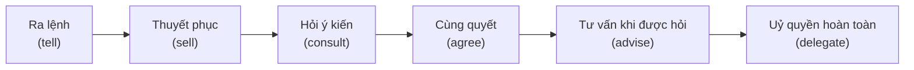
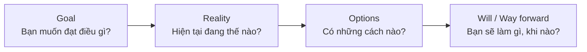
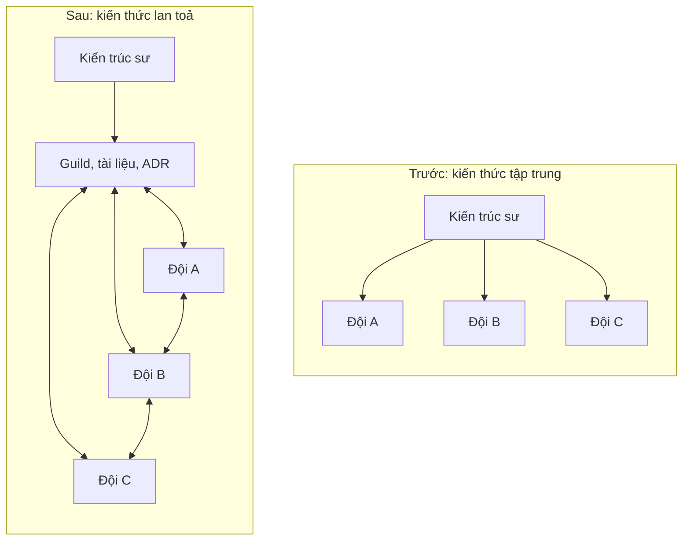
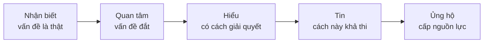
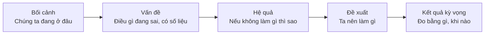
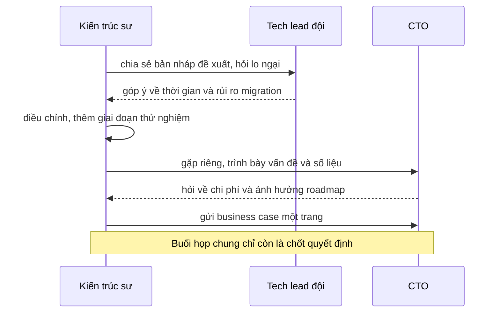

# Tư vấn, coaching và marketing

**Tư vấn** (consulting) là việc kiến trúc sư giúp người khác **đưa ra quyết định tốt hơn** bằng kiến thức và kinh nghiệm của mình, thay vì quyết định thay họ. **Coaching** (huấn luyện) là việc giúp đội **tự lớn lên** để ngày càng ít cần đến kiến trúc sư. **Marketing** ở đây không phải quảng cáo sản phẩm, mà là kỹ năng **"bán" ý tưởng kiến trúc**: làm cho lãnh đạo, đội nhóm và các bên liên quan hiểu, tin và ủng hộ một hướng đi kỹ thuật. Ba kỹ năng này cùng trả lời một câu hỏi: làm sao để ý tưởng đúng thực sự được hiện thực hoá, khi kiến trúc sư không thể (và không nên) ra lệnh cho tất cả mọi người.

**Tương tự đơn giản:** Một **huấn luyện viên bóng đá** không ra sân đá thay cầu thủ. Họ phân tích đối thủ và đề xuất chiến thuật (tư vấn), luyện cho từng cầu thủ kỹ năng và cách tự đọc trận đấu (coaching), và thuyết phục ban lãnh đạo câu lạc bộ đầu tư mua cầu thủ, xây sân tập (marketing). Huấn luyện viên giỏi nhất là người mà đội vẫn chơi tốt cả khi họ không đứng ở đường biên.

---

:::note[Ghi nhớ nhanh]

- ⭐ **Ảnh hưởng mà không cần quyền lực** — kiến trúc sư hiếm khi là sếp trực tiếp của đội; họ tạo ảnh hưởng bằng uy tín, lý lẽ, dữ liệu và sự tin tưởng.
- ⭐ **Bán vấn đề trước, giải pháp sau** — người nghe chỉ quan tâm giải pháp khi họ đã thấy vấn đề là thật và đắt; hãy nói bằng ngôn ngữ của họ: tiền, thời gian, rủi ro, khách hàng.
- **Mentoring khác coaching** — mentor chia sẻ kinh nghiệm và lời khuyên; coach đặt câu hỏi để người kia tự tìm ra câu trả lời.
- **Nâng trình đội là cách mở rộng chính mình** — pair/mob programming, tech talk, guild, tài liệu giúp kiến thức không kẹt ở một người.
- **Business case, ROI, cost of delay** — ba công cụ để biến đề xuất kỹ thuật thành quyết định kinh doanh.

:::

---

## Mục lục

- [Vì sao kiến trúc sư cần các kỹ năng này?](#vì-sao-kiến-trúc-sư-cần-các-kỹ-năng-này)
- [1. Kiến trúc sư như một cố vấn](#1-kiến-trúc-sư-như-một-cố-vấn)
- [2. Mentoring và coaching](#2-mentoring-và-coaching)
- [3. Các hình thức nâng trình đội](#3-các-hình-thức-nâng-trình-đội)
- [4. "Bán" ý tưởng kiến trúc](#4-bán-ý-tưởng-kiến-trúc)
- [5. Business case, ROI và cost of delay](#5-business-case-roi-và-cost-of-delay)
- [6. Kể chuyện với dữ liệu](#6-kể-chuyện-với-dữ-liệu)
- [7. Xây uy tín và thuyết phục mà không ra lệnh](#7-xây-uy-tín-và-thuyết-phục-mà-không-ra-lệnh)
- [Khi nào cần nhớ?](#khi-nào-cần-nhớ)
- [Lỗi thường gặp](#lỗi-thường-gặp)
- [Câu hỏi phỏng vấn](#câu-hỏi-phỏng-vấn)

---

## Vì sao kiến trúc sư cần các kỹ năng này?

**Vấn đề:** Một kiến trúc sư có thể thiết kế rất đúng, nhưng:

- Đội không hiểu lý do nên làm theo hình thức, gặp tình huống mới thì làm sai hướng.
- Mọi câu hỏi đều phải chờ kiến trúc sư trả lời, họ trở thành **nút thắt cổ chai** (bottleneck).
- Đề xuất nâng cấp hạ tầng bị gạt đi vì lãnh đạo không thấy lợi ích.
- Đội coi kiến trúc sư là người "ở tháp ngà" đưa ra quy định từ trên xuống, nên âm thầm chống đối.

**Giải pháp:** Chuyển vai trò từ "người ra quyết định cho mọi thứ" sang **người giúp tổ chức ra quyết định tốt**: tư vấn khi cần, huấn luyện để đội tự quyết được nhiều hơn, và trình bày đề xuất theo cách mà người ra quyết định kinh doanh hiểu và ủng hộ.

:::tip[Dùng thực tế]

- **Review code và thiết kế:** góp ý bằng câu hỏi để dev tự nhận ra vấn đề, thay vì chỉ ra đáp án.
- **Onboarding:** mỗi người mới có một buddy, có tài liệu kiến trúc, có buổi pair programming trong tuần đầu.
- **Xin ngân sách:** viết business case một trang cho việc chuyển sang CI/CD tự động, có số liệu thời gian tiết kiệm.
- **Lan toả thực hành tốt:** tổ chức guild frontend hằng tháng để các đội chia sẻ cách làm.

:::

---

## 1. Kiến trúc sư như một cố vấn

Có nhiều phong cách làm kiến trúc sư. Hai cực thường được nhắc đến:

| | Kiến trúc sư "tháp ngà" (ivory tower) | Kiến trúc sư cố vấn |
| --- | --- | --- |
| **Cách làm việc** | Thiết kế một mình, giao bản vẽ xuống đội | Thiết kế cùng đội, ở gần nơi code được viết |
| **Ra quyết định** | Quyết thay đội cho mọi thứ | Quyết các vấn đề xuyên suốt, để đội quyết phần trong phạm vi của họ |
| **Phản hồi** | Ít nghe phản hồi từ thực tế | Thường xuyên nghe đội, thay đổi khi có dữ kiện mới |
| **Kết quả** | Thiết kế đẹp trên giấy, lệch thực tế | Thiết kế được đội hiểu và làm chủ |

Một kiến trúc sư cố vấn giỏi thường:

- **Hỏi trước khi khuyên:** hiểu bối cảnh, ràng buộc, những gì đội đã thử.
- **Đưa ra lựa chọn kèm đánh đổi**, không chỉ một đáp án: "Có ba cách, cách A nhanh nhưng..., cách B..., mình nghiêng về B vì..."
- **Nói rõ mức độ chắc chắn:** "Chỗ này mình chắc chắn vì đã gặp" khác với "chỗ này mình đoán thôi, nên thử".
- **Phân biệt "bắt buộc" và "khuyến nghị":** quy tắc bảo mật là bắt buộc, cách đặt tên package có thể chỉ là khuyến nghị.
- **Để người được tư vấn sở hữu quyết định** khi nó nằm trong phạm vi của họ.

Mức độ tham gia nên thay đổi theo mức độ trưởng thành của đội và rủi ro của quyết định:



Thang này lấy ý từ khái niệm **delegation levels** trong Management 3.0. Với sự cố bảo mật nghiêm trọng, có thể cần ra lệnh. Với cách tổ chức component React trong một tính năng, đội nên được uỷ quyền hoàn toàn.

---

## 2. Mentoring và coaching

Hai từ này hay bị dùng lẫn, nhưng khác nhau về cách tiếp cận:

| | Mentoring (cố vấn kèm cặp) | Coaching (huấn luyện) |
| --- | --- | --- |
| **Cách làm** | Chia sẻ kinh nghiệm, kiến thức, lời khuyên | Đặt câu hỏi để người kia tự tìm câu trả lời |
| **Người nói nhiều hơn** | Mentor | Người được coach |
| **Phù hợp khi** | Người kia thiếu kiến thức hoặc kinh nghiệm | Người kia có năng lực nhưng cần làm rõ suy nghĩ |
| **Ví dụ câu nói** | "Lần trước mình gặp chuyện này, mình đã dùng outbox pattern vì..." | "Nếu service này gửi event xong rồi mới commit DB thất bại, chuyện gì xảy ra?" |
| **Kết quả** | Truyền được kiến thức nhanh | Người kia phát triển tư duy tự giải quyết |

Một mô hình coaching đơn giản và phổ biến là **GROW** (do John Whitmore và cộng sự phổ biến):



Ví dụ một cuộc trò chuyện coaching với một developer muốn cải thiện hiệu năng trang danh sách sản phẩm:

- **Goal:** "Em muốn trang này mở dưới 2 giây trên mạng 4G."
- **Reality:** "Hiện tại mất bao lâu? Em đã đo bằng công cụ gì? Phần nào tốn thời gian nhất?"
- **Options:** "Em nghĩ có những cách nào? Nếu không được dùng thêm server thì sao? Cách nào ít rủi ro nhất?"
- **Will:** "Em sẽ thử cách nào trước? Khi nào mình xem lại kết quả?"

Kiến trúc sư không đưa đáp án "dùng phân trang và lazy load ảnh", dù có thể biết. Developer tự tìm ra sẽ nhớ lâu hơn và lần sau tự xử lý được.

Tất nhiên không phải lúc nào cũng nên coach: khi đang có sự cố production lúc 2 giờ sáng, hãy nói thẳng cách sửa.

---

## 3. Các hình thức nâng trình đội

Kiến trúc sư không thể có mặt ở mọi cuộc thảo luận. Cách mở rộng ảnh hưởng là **nâng năng lực cả đội** để họ tự đưa ra quyết định tốt.

| Hình thức | Mô tả | Ưu điểm | Lưu ý |
| --- | --- | --- | --- |
| **Pair programming** | Hai người cùng làm một việc trên một máy, đổi vai người gõ và người quan sát | Truyền kiến thức sâu, phát hiện lỗi sớm | Mệt nếu làm cả ngày, cần nghỉ giữa giờ |
| **Mob programming** (ensemble) | Cả nhóm cùng làm một việc, một người gõ, đổi vai theo thời gian | Cả đội cùng hiểu phần khó, thống nhất cách làm | Tốn nhân lực, hợp với việc khó hoặc quan trọng |
| **Code review** | Đọc và góp ý code của nhau | Lan toả chuẩn mực, phát hiện lỗi | Góp ý bằng lý do và câu hỏi, tránh chỉ "sửa thế này" |
| **Tech talk / brown bag** | Buổi chia sẻ ngắn, thường trong giờ ăn trưa | Lan toả kiến thức rộng | Ghi hình và lưu lại cho người vắng |
| **Guild / chapter** | Cộng đồng xuyên đội theo chuyên môn (frontend, bảo mật, dữ liệu) | Thống nhất thực hành giữa các đội | Cần người duy trì, nếu không sẽ tàn dần |
| **Kata, coding dojo** | Luyện tập bài tập nhỏ có chủ đích | Luyện kỹ năng an toàn, không áp lực deadline | Cần chọn bài tập gần với công việc thật |
| **Tài liệu và ADR** | Ghi lại kiến thức, quyết định | Mở rộng không giới hạn, không phụ thuộc người | Phải được cập nhật |

### Bus factor

**Bus factor** (hệ số xe buýt) là số người tối thiểu mà nếu họ đột ngột rời đi, dự án sẽ gặp khó khăn nghiêm trọng. Bus factor bằng 1 nghĩa là có một phần hệ thống chỉ một người hiểu. Một mục tiêu quan trọng của coaching là **tăng bus factor**, bắt đầu từ chính kiến trúc sư: nếu chỉ kiến trúc sư hiểu kiến trúc, đó là rủi ro lớn của tổ chức.



---

## 4. "Bán" ý tưởng kiến trúc

Nhiều kỹ sư không thích từ "bán", nhưng thực tế mọi thay đổi kiến trúc đáng kể đều cần **nguồn lực** (thời gian, người, tiền) và **sự ủng hộ**. Không ai cho nguồn lực nếu họ không hiểu vì sao cần.

Nguyên tắc cốt lõi: **bán vấn đề trước, giải pháp sau.**

| Bán giải pháp (thường thất bại) | Bán vấn đề (thường thành công) |
| --- | --- |
| "Mình cần chuyển sang Kubernetes." | "Mỗi lần deploy mất 2 giờ và cần 2 người thức khuya. Tháng rồi có 3 lần deploy lỗi phải rollback, mỗi lần ảnh hưởng khách hàng khoảng 30 phút." |
| "Code module thanh toán cần refactor." | "Mỗi tính năng thanh toán mới tốn gấp đôi thời gian so với module khác, và 40% bug production quý trước nằm ở đây." |
| "Nên dùng event-driven architecture." | "Khi service email chậm, cả luồng đặt hàng bị chậm theo, khách hàng phải chờ." |

Con số trong bảng là ví dụ minh hoạ; khi trình bày thật, hãy dùng số liệu thật từ hệ thống của mình.

Hành trình thuyết phục thường đi qua các bước:



Gợi ý:

- **Nói ngôn ngữ của người nghe.** Lãnh đạo nghĩ về doanh thu, chi phí, rủi ro, tốc độ ra thị trường, sự hài lòng của khách hàng. Đội dev nghĩ về trải nghiệm làm việc, thời gian chờ build, số lần bị gọi dậy trực sự cố.
- **Gặp riêng trước khi họp chung.** Nói chuyện riêng với những người có ảnh hưởng trước buổi họp lớn để hiểu lo ngại của họ và điều chỉnh đề xuất. Không ai thích bị bất ngờ trong cuộc họp.
- **Bắt đầu nhỏ.** Đề xuất một thử nghiệm có giới hạn (một service, một quý) thay vì một cuộc đại tu toàn hệ thống. Thành công nhỏ tạo uy tín cho bước lớn hơn.
- **Tìm đồng minh.** PO bị ảnh hưởng bởi deploy chậm, đội vận hành mệt vì trực đêm, họ là những người sẽ ủng hộ.

---

## 5. Business case, ROI và cost of delay

### Business case

**Business case** là tài liệu ngắn giải thích **vì sao nên đầu tư** vào một việc, dưới góc nhìn kinh doanh. Một business case kỹ thuật một trang thường gồm:

1. **Vấn đề** — mô tả bằng tác động kinh doanh, có số liệu.
2. **Đề xuất** — một hoặc hai câu.
3. **Chi phí** — thời gian của đội, chi phí hạ tầng, chi phí cơ hội (những việc phải hoãn).
4. **Lợi ích** — tiết kiệm được gì, giảm rủi ro gì, mở ra cơ hội gì.
5. **Phương án khác** — kể cả "không làm gì", và hệ quả của nó.
6. **Rủi ro và cách giảm thiểu.**
7. **Cần quyết định gì, từ ai.**

### ROI

**ROI** (Return on Investment — lợi tức đầu tư) đo lợi ích so với chi phí:

```text
ROI = (Lợi ích - Chi phí) / Chi phí
```

Ví dụ minh hoạ tự động hoá quy trình deploy:

```text
Hiện tại:
- 8 lần deploy/tháng, mỗi lần 2 người x 2 giờ = 32 giờ công/tháng
- Khoảng 384 giờ công/năm

Đề xuất:
- Xây CI/CD tự động: khoảng 160 giờ công một lần
- Sau đó mỗi lần deploy khoảng 15 phút của 1 người = 2 giờ công/tháng, 24 giờ/năm

Năm đầu:
- Tiết kiệm: 384 - 24 = 360 giờ công
- Chi phí: 160 giờ công
- ROI = (360 - 160) / 160 = 1,25, tức lợi 125% ngay năm đầu
```

Con số trên chưa tính các lợi ích khó đo hơn: ít lỗi deploy, deploy được thường xuyên hơn nên tính năng tới tay người dùng nhanh hơn, đội ít mệt mỏi. Nên nhắc đến những lợi ích đó, nhưng giữ phần tính toán dựa trên những gì đo được để giữ uy tín.

### Cost of delay

**Cost of delay** (chi phí của việc trì hoãn), được Don Reinertsen phổ biến, trả lời câu hỏi: **mỗi tuần chưa làm việc này, ta mất bao nhiêu?** Nó giúp so sánh việc kỹ thuật với tính năng kinh doanh trên cùng một thước đo.

| Việc | Chi phí trì hoãn mỗi tuần (ví dụ) | Thời gian làm | Ưu tiên |
| --- | --- | --- | --- |
| Sửa lỗi thanh toán thất bại ngẫu nhiên | Cao, mất đơn hàng mỗi ngày | 1 tuần | Làm ngay |
| Nâng cấp thư viện có lỗ hổng bảo mật | Thấp hôm nay, nhưng có thể tăng vọt nếu bị khai thác | 2 tuần | Làm sớm |
| Tính năng gợi ý sản phẩm mới | Trung bình, doanh thu tăng thêm dự kiến | 6 tuần | Lên kế hoạch |
| Refactor module báo cáo ít dùng | Gần như bằng 0 | 4 tuần | Để sau |

Một cách xếp ưu tiên dựa trên ý này là **CD3** (Cost of Delay Divided by Duration): việc có chi phí trì hoãn cao và làm nhanh nên được làm trước.

---

## 6. Kể chuyện với dữ liệu

Con số thuyết phục hơn ý kiến, nhưng con số đứng một mình thì khó nhớ. **Kể chuyện với dữ liệu** (data storytelling) là kết hợp số liệu với một câu chuyện có bối cảnh, xung đột và kết quả.

Cấu trúc đơn giản:



Ví dụ:

> **Bối cảnh:** Quý này lượng người dùng tăng mạnh nhờ chiến dịch marketing.
> **Vấn đề:** Thời gian phản hồi p95 của API giỏ hàng tăng từ khoảng 200 ms lên khoảng 1,2 giây vào giờ cao điểm. Biểu đồ cho thấy nó tăng đúng theo số người dùng đồng thời.
> **Hệ quả:** Tỷ lệ bỏ giỏ hàng tăng cùng thời điểm. Dịp sale cuối năm dự kiến tải còn gấp đôi.
> **Đề xuất:** Thêm cache cho thông tin sản phẩm và tách việc tính khuyến mãi ra khỏi luồng chính, khoảng 3 tuần.
> **Kết quả kỳ vọng:** p95 về dưới 300 ms ở tải gấp đôi hiện tại, kiểm chứng bằng load test trước dịp sale.

Các con số trong ví dụ chỉ để minh hoạ cấu trúc. Lưu ý khi dùng dữ liệu:

- **Một biểu đồ, một thông điệp.** Tiêu đề biểu đồ nên là kết luận ("Độ trễ tăng theo số người dùng"), không chỉ là tên trục.
- **So sánh với mốc** người nghe hiểu: trước và sau, so với mục tiêu, so với đối thủ.
- **Trung thực về độ không chắc chắn.** Nói rõ đâu là số đo, đâu là ước tính.
- **Đừng chọn lọc dữ liệu** để chỉ hiện phần có lợi; một lần bị phát hiện là mất uy tín rất lâu.

---

## 7. Xây uy tín và thuyết phục mà không ra lệnh

Kiến trúc sư thường có **ảnh hưởng** lớn nhưng **quyền hạn trực tiếp** nhỏ: họ không phải sếp của các dev, không quyết ngân sách. Ảnh hưởng đến từ **uy tín** (credibility) và **sự tin tưởng** (trust).

Những thứ xây uy tín:

| Nguồn uy tín | Cách xây |
| --- | --- |
| **Năng lực kỹ thuật** | Vẫn viết code, làm PoC, hiểu hệ thống tới chi tiết đủ sâu (xem bài [Vẫn phải viết code](/docs/software-architect/02-important-skills/3_van-phai-viet-code)) |
| **Đáng tin cậy** | Làm đúng điều đã hứa, ước lượng trung thực, thừa nhận khi sai |
| **Gần gũi** | Ở gần đội, tham gia trực sự cố, hiểu khó khăn thực tế |
| **Công bằng** | Đánh giá phương án theo tiêu chí, không theo người đề xuất |
| **Đóng góp cho người khác** | Giúp người khác thành công, ghi công cho đội |

Kỹ thuật thuyết phục mà không ra lệnh:

- **Hỏi thay vì khẳng định:** "Nếu lượng event tăng gấp 10 thì thiết kế này xử lý thế nào?" thường hiệu quả hơn "Thiết kế này không scale được."
- **Cho người khác tham gia từ sớm:** người cùng tạo ra ý tưởng sẽ bảo vệ nó. Mời đội góp ý từ bản nháp design doc thay vì trình bày bản cuối.
- **Thừa nhận điểm mạnh của phương án khác** trước khi nêu lo ngại.
- **Thử nghiệm thay vì tranh cãi:** "Mình thử cả hai trên một service trong 2 tuần rồi đo nhé."
- **Chấp nhận thua những trận nhỏ.** Không phải mọi quyết định đều đáng để đấu tranh. Giữ uy tín cho những quyết định thực sự khó đảo ngược.



---

## Khi nào cần nhớ?

- **Khi được hỏi ý kiến:**
  - Hỏi bối cảnh trước khi khuyên.
  - Đưa lựa chọn kèm đánh đổi, nói rõ mức độ chắc chắn.
  - Quyết định thuộc phạm vi đội thì để đội quyết.
- **Khi kèm cặp người khác:**
  - Thiếu kiến thức thì mentor, có năng lực thì coach bằng câu hỏi (GROW).
  - Sự cố gấp thì nói thẳng cách làm.
- **Khi muốn lan toả thực hành:**
  - Pair/mob cho phần khó, tech talk cho kiến thức rộng, guild cho thống nhất xuyên đội.
  - Theo dõi bus factor, bắt đầu từ chính mình.
- **Khi xin nguồn lực:**
  - Bán vấn đề trước, có số liệu.
  - Viết business case một trang, tính ROI hoặc cost of delay.
  - Gặp riêng người có ảnh hưởng trước họp chung, bắt đầu bằng thử nghiệm nhỏ.

---

## Lỗi thường gặp

### Lỗi 1: Trở thành nút thắt cổ chai

Mọi quyết định đều phải qua kiến trúc sư, đội chờ đợi, kiến trúc sư quá tải. Hãy uỷ quyền các quyết định trong phạm vi đội, ghi nguyên tắc rõ ràng để đội tự áp dụng, và tập trung vào các quyết định xuyên suốt.

### Lỗi 2: Luôn đưa đáp án

Mỗi lần dev hỏi đều trả lời ngay cách làm. Nhanh trước mắt, nhưng đội không lớn lên và sẽ hỏi mãi. Với những vấn đề không gấp, hãy hỏi ngược lại để họ tự suy nghĩ.

### Lỗi 3: Bán giải pháp bằng thuật ngữ

"Chúng ta cần service mesh và event sourcing" trước ban giám đốc. Họ không hiểu và không thấy lý do để chi tiền. Bắt đầu bằng vấn đề kinh doanh, có số liệu, rồi mới đến giải pháp.

### Lỗi 4: Phóng đại lợi ích

Hứa refactor sẽ "tăng tốc độ gấp 3", rồi thực tế chỉ cải thiện một phần. Lần sau đề xuất khó được tin. Ước tính thận trọng, nói rõ đâu là số đo, đâu là kỳ vọng.

### Lỗi 5: Bất ngờ trong cuộc họp

Lần đầu tiên lãnh đạo hoặc tech lead nghe về đề xuất là trong buổi họp lớn. Họ dễ phản ứng phòng thủ. Gặp riêng trước, lắng nghe lo ngại, điều chỉnh đề xuất.

### Lỗi 6: Dùng chức danh để thắng tranh luận

"Tôi là kiến trúc sư, cứ làm theo tôi." Có thể thắng một lần, nhưng mất sự tin tưởng của đội. Uy tín đến từ lý lẽ và kết quả, không từ chức danh.

---

## Câu hỏi phỏng vấn

Những câu thường gặp về chủ đề này. Tự trả lời trước, rồi bấm **Xem đáp án** để đối chiếu.

**1. Mentoring và coaching khác nhau thế nào? Khi nào dùng cái nào?**

<details className="qa">
<summary>Xem đáp án</summary>

- **Mentoring:** chia sẻ kinh nghiệm, kiến thức, lời khuyên. Phù hợp khi người kia thiếu kiến thức, ví dụ junior mới vào chưa biết hệ thống.
- **Coaching:** đặt câu hỏi để người kia tự tìm ra hướng giải quyết (ví dụ theo mô hình GROW). Phù hợp khi người kia có năng lực nhưng cần làm rõ suy nghĩ hoặc phát triển khả năng tự quyết.

Thực tế thường kết hợp cả hai, và khi có sự cố gấp thì nói thẳng cách làm.

</details>

**2. Làm sao bạn thuyết phục ban lãnh đạo đầu tư vào một thay đổi kiến trúc lớn?**

<details className="qa">
<summary>Xem đáp án</summary>

- **Bán vấn đề trước:** mô tả tác động kinh doanh bằng số liệu thật (thời gian ra tính năng, sự cố, chi phí, khách hàng bị ảnh hưởng).
- Viết **business case** ngắn: vấn đề, đề xuất, chi phí, lợi ích, phương án "không làm gì", rủi ro.
- Dùng **ROI** hoặc **cost of delay** để so sánh với các việc khác.
- **Gặp riêng** những người có ảnh hưởng trước, điều chỉnh theo lo ngại của họ.
- Đề xuất **bắt đầu nhỏ** bằng một giai đoạn thử nghiệm có tiêu chí đo, rồi mở rộng khi có kết quả.

</details>

**3. Bạn làm gì khi đội không làm theo kiến trúc đã thống nhất?**

<details className="qa">
<summary>Xem đáp án</summary>

- Trước tiên **tìm hiểu lý do**: đội không hiểu, không đồng ý, hay kiến trúc không phù hợp với thực tế họ gặp? Có thể kiến trúc cần điều chỉnh.
- Nếu do không hiểu: giải thích lý do, tài liệu, pair programming, tech talk.
- Nếu do không đồng ý: mở lại thảo luận dựa trên dữ kiện, cập nhật ADR nếu cần.
- Nếu là quy tắc quan trọng và đã thống nhất: tự động hoá kiểm tra bằng fitness function trong CI thay vì nhắc nhở thủ công.
- Tránh dùng chức danh để ép buộc.

</details>

**4. Bus factor là gì? Bạn cải thiện nó thế nào?**

<details className="qa">
<summary>Xem đáp án</summary>

Bus factor là số người tối thiểu mà nếu họ đột ngột rời đi, dự án sẽ gặp khó khăn nghiêm trọng. Bus factor thấp (đặc biệt bằng 1) là rủi ro lớn.

Cải thiện bằng: pair và mob programming cho phần khó, luân chuyển người làm các phần khác nhau, code review bắt buộc, tài liệu và ADR, tech talk, và kiến trúc sư chủ động truyền lại kiến thức thay vì giữ cho riêng mình.

</details>

**5. Cost of delay là gì? Dùng nó để làm gì?**

<details className="qa">
<summary>Xem đáp án</summary>

Cost of delay là chi phí (doanh thu mất, rủi ro tăng, chi phí phát sinh) mà tổ chức phải chịu cho mỗi đơn vị thời gian một việc chưa được làm. Nó giúp so sánh việc kỹ thuật (trả nợ, nâng cấp bảo mật) với tính năng kinh doanh trên cùng một thước đo. Kết hợp với thời gian thực hiện (CD3: chi phí trì hoãn chia cho thời gian làm) để xếp ưu tiên: việc có chi phí trì hoãn cao và làm nhanh nên đi trước.

</details>

**6. Làm sao để có ảnh hưởng khi bạn không phải là quản lý của đội?**

<details className="qa">
<summary>Xem đáp án</summary>

- Xây **uy tín kỹ thuật**: vẫn viết code, hiểu hệ thống sâu, đưa ra lời khuyên đúng.
- Xây **sự tin tưởng**: làm đúng điều đã hứa, trung thực, thừa nhận khi sai, ghi công cho đội.
- **Lắng nghe và cho người khác tham gia** từ sớm vào quá trình thiết kế.
- Thuyết phục bằng **câu hỏi, dữ liệu và thử nghiệm** thay vì mệnh lệnh.
- Chọn trận để đấu: nhượng bộ ở quyết định nhỏ, giữ lập trường ở quyết định khó đảo ngược.

</details>
