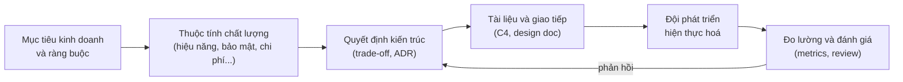

# Software Architect

Đây là lộ trình **Software Architect** (kiến trúc sư phần mềm) bám theo [roadmap.sh/software-architect](https://roadmap.sh/software-architect). Đợt này đi phần **tư duy của kiến trúc sư**: kiến trúc phần mềm là gì, kiến trúc sư làm gì mỗi ngày, các cấp độ kiến trúc, và những kỹ năng khiến một lập trình viên giỏi trở thành người dẫn dắt kỹ thuật: ra quyết định, đơn giản hoá, cân bằng đánh đổi, viết tài liệu, giao tiếp, ước lượng và hướng dẫn đội nhóm. Mỗi **thuật ngữ chuyên ngành** đều được giải thích ngay khi xuất hiện.

**Tương tự đơn giản:** Xây một toà nhà cần **kiến trúc sư** và **thợ xây**. Thợ xây giỏi biết đổ bê tông, xây tường thật chắc. Kiến trúc sư không trực tiếp xây từng viên gạch, nhưng quyết định toà nhà có mấy tầng, móng chịu được bao nhiêu tải, đường điện nước đi đâu, chỗ nào sau này có thể nới rộng. Những quyết định đó **đắt nhất khi phải sửa**: đập một bức tường thì dễ, đổi móng khi nhà đã lên 10 tầng thì gần như không thể. Kiến trúc phần mềm cũng vậy.

---

:::note[Ghi nhớ nhanh]

- ⭐ **Kiến trúc là những quyết định khó thay đổi** — cách chia hệ thống thành phần, cách các phần nói chuyện với nhau, dữ liệu nằm ở đâu.
- ⭐ **Mọi quyết định kiến trúc đều là đánh đổi (trade-off)** — không có "kiến trúc tốt nhất", chỉ có kiến trúc phù hợp nhất với ràng buộc hiện tại.
- **Kiến trúc sư phục vụ cả người lẫn máy** — một nửa công việc là kỹ thuật, nửa còn lại là giao tiếp, thuyết phục và hướng dẫn.
- **Ba cấp độ** — application architecture (một ứng dụng), solution architecture (một giải pháp nhiều hệ thống), enterprise architecture (cả tổ chức).
- **Kiến trúc sư vẫn phải viết code** — xa code quá lâu thì quyết định sẽ xa thực tế.

:::

---

## Vì sao cần học tư duy kiến trúc?

**Vấn đề:** Lên senior, bạn bắt đầu gặp những câu hỏi mà giỏi framework không trả lời được: tách microservice hay giữ monolith? Chọn SQL hay NoSQL? Vì sao hệ thống mới làm 6 tháng đã khó thêm tính năng? Làm sao thuyết phục sếp đầu tư trả nợ kỹ thuật? Làm sao để cả đội hiểu và làm theo cùng một hướng?

**Giải pháp:** Học cách nhìn hệ thống **từ trên xuống**, nhận ra các **thuộc tính chất lượng** (hiệu năng, khả năng mở rộng, bảo mật, dễ bảo trì…) đang kéo nhau về các phía, ra quyết định có lý do rõ ràng, ghi lại quyết định đó, và truyền đạt nó cho người khác. Đây chính là phần "system thinking" trong công việc kỹ thuật.

:::tip[Dùng thực tế]

- **Thiết kế tính năng lớn:** viết design doc, so sánh 2–3 phương án, chọn có lý do.
- **Review kiến trúc:** đánh giá một đề xuất theo thuộc tính chất lượng thay vì theo cảm tính.
- **Làm việc với business:** dịch yêu cầu kinh doanh thành ràng buộc kỹ thuật, và ngược lại.
- **Phỏng vấn senior/lead:** câu hỏi về trade-off, ADR, cách xử lý bất đồng kỹ thuật rất thường gặp.

:::

---

## Bức tranh tổng thể

| Cấp độ | Phạm vi | Câu hỏi điển hình |
|--------|---------|-------------------|
| Application architecture | Một ứng dụng / service | Chia layer thế nào? Module nào phụ thuộc module nào? |
| Solution architecture | Một giải pháp gồm nhiều hệ thống | Hệ thống A tích hợp với B qua API hay message queue? |
| Enterprise architecture | Toàn bộ tổ chức | Công ty chuẩn hoá trên công nghệ nào? Hệ thống nào nên gộp hoặc bỏ? |

---

## Nội dung tài liệu

| # | Chủ đề | Bạn sẽ học được gì |
|---|--------|--------------------|
| 1.1 | **Kiến trúc phần mềm là gì** | Định nghĩa, quyết định khó đảo ngược, thuộc tính chất lượng, kiến trúc vs thiết kế |
| 1.2 | **Kiến trúc sư phần mềm** | Vai trò, trách nhiệm, các kiểu kiến trúc sư, lộ trình từ developer lên architect |
| 1.3 | **Các cấp độ kiến trúc** | Application, solution, enterprise architecture và khác biệt giữa chúng |
| 2.1 | **Thiết kế và đơn giản hoá** | Nguyên tắc thiết kế, độ phức tạp cốt lõi và phát sinh, KISS, YAGNI |
| 2.2 | **Ra quyết định** | Trade-off, quyết định một chiều/hai chiều, ma trận lựa chọn, ADR |
| 2.3 | **Vẫn phải viết code** | Vì sao architect cần code, prototype, spike, proof of concept |
| 2.4 | **Tài liệu kiến trúc** | Mô hình C4, arc42, design doc, docs as code |
| 2.5 | **Giao tiếp** | Nói theo đối tượng, trình bày phương án, xử lý bất đồng |
| 2.6 | **Ước lượng và đánh giá** | Ước lượng tương đối, ATAM, fitness function, nợ kỹ thuật |
| 2.7 | **Cân bằng** | Cân bằng thuộc tính chất lượng, chi phí, thời gian và rủi ro |
| 2.8 | **Tư vấn, coaching và marketing** | Hướng dẫn đội nhóm, "bán" ý tưởng kiến trúc cho các bên liên quan |

Các nhánh kỹ thuật của roadmap như design pattern, kiểu kiến trúc, cơ sở dữ liệu và hạ tầng sẽ bổ sung ở các đợt sau. Một phần đã có trong topic [System Design](/docs/system-design/intro).

Bắt đầu từ chủ đề **1.1 Kiến trúc phần mềm là gì** ở thanh bên trái.
