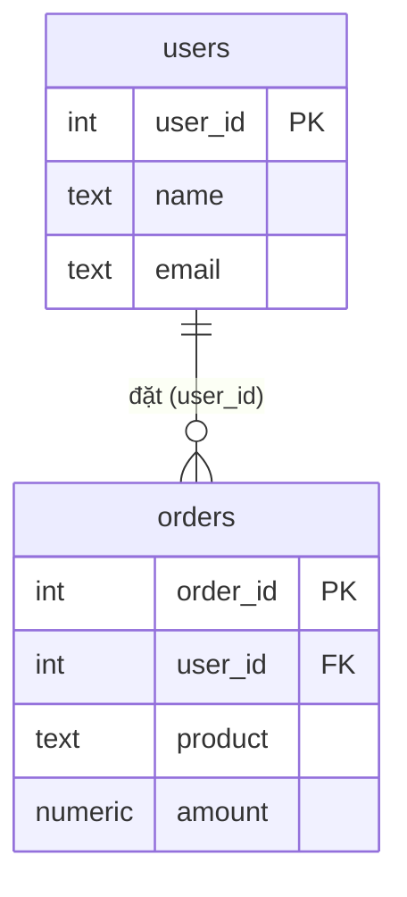

# JOIN — Kết hợp bảng

JOIN là cách kết hợp các hàng từ nhiều bảng dựa trên điều kiện liên kết, thường là khóa ngoại trỏ tới khóa chính của bảng kia. Bài này đi qua đầy đủ các loại JOIN — INNER, LEFT, RIGHT, FULL OUTER, SELF, CROSS — kèm sơ đồ minh họa, cách dùng ON/USING/NATURAL và bẫy ON vs WHERE với LEFT JOIN. Đây là kỹ năng cốt lõi để truy vấn dữ liệu trải trên nhiều bảng có quan hệ.

---

:::note[Ghi nhớ nhanh]

- ⭐ **JOIN** — kết hợp hàng từ nhiều bảng theo điều kiện liên kết (thường khóa ngoại trỏ tới khóa chính), tránh lưu trùng dữ liệu.
- **Các loại JOIN** — `INNER` chỉ lấy hàng khớp cả hai bên; `LEFT`/`RIGHT` giữ một bên; `FULL OUTER` giữ cả hai; `CROSS` tạo tích Descartes.
- **Tìm bản ghi mồ côi** — `LEFT JOIN ... WHERE right_col IS NULL` (nhanh hơn `NOT IN`/`NOT EXISTS` trên tập lớn).
- **Cú pháp điều kiện** — dùng `ON` trong production cho tường minh, tránh `NATURAL JOIN` (dễ lỗi ngầm khi schema đổi).
- ⭐ **Bẫy `ON` vs `WHERE` với LEFT JOIN** — điều kiện trong `ON` giữ hàng bảng trái; trong `WHERE` biến LEFT JOIN thành INNER JOIN.

:::

---

## Mục lục

- [JOIN là gì](#join-là-gì)
- [Vì sao cần JOIN?](#vì-sao-cần-join)
- [Dữ liệu mẫu](#dữ-liệu-mẫu)
- [INNER JOIN](#inner-join)
- [LEFT JOIN](#left-join)
- [RIGHT JOIN](#right-join)
- [FULL OUTER JOIN](#full-outer-join)
- [SELF JOIN](#self-join)
- [CROSS JOIN](#cross-join)
- [ON vs USING vs NATURAL JOIN](#on-vs-using-vs-natural-join)
- [Nhiều JOIN nối tiếp](#nhiều-join-nối-tiếp)
- [Bẫy ON vs WHERE với LEFT JOIN](#bẫy-on-vs-where-với-left-join)

---

## JOIN là gì

**JOIN** là cú pháp kết hợp các hàng từ hai hay nhiều bảng dựa trên một điều kiện liên kết — thường là khoá ngoại (foreign key) trỏ đến khoá chính (primary key) của bảng kia.

Bảng tổng quan các loại JOIN phổ biến trong PostgreSQL:

| Loại JOIN | Giữ hàng bên trái | Giữ hàng bên phải | Mô tả ngắn |
|---|---|---|---|
| `INNER JOIN` | Chỉ khi khớp | Chỉ khi khớp | Chỉ lấy hàng có cặp tương ứng ở cả hai bảng |
| `LEFT JOIN` | Tất cả | Chỉ khi khớp | Giữ toàn bộ bảng trái, NULL ở bên phải nếu không khớp |
| `RIGHT JOIN` | Chỉ khi khớp | Tất cả | Giữ toàn bộ bảng phải, NULL ở bên trái nếu không khớp |
| `FULL OUTER JOIN` | Tất cả | Tất cả | Giữ tất cả hàng cả hai phía, NULL ở phía không có cặp |
| `CROSS JOIN` | Tất cả | Tất cả | Tích Descartes — ghép mọi hàng bên trái với mọi hàng bên phải |
| `SELF JOIN` | — | — | Bảng join với chính nó (dùng alias) |

---

## Vì sao cần JOIN?

**Vấn đề:** Để tránh trùng lặp và giữ dữ liệu nhất quán, ta chuẩn hoá (normalize) — tách thành nhiều bảng riêng: `users`, `orders`, `products`. Nhưng khi hiển thị lại cần ghép chúng (đơn hàng kèm tên khách, kèm tên sản phẩm). Nếu lưu gộp tất cả vào một bảng thì dữ liệu dư thừa và khó cập nhật:

```sql
-- Lưu gộp tất cả vào một bảng → dư thừa, khó cập nhật
CREATE TABLE orders_gop (
    order_id    INT,
    user_name   TEXT,   -- lặp lại tên khách ở mọi đơn
    user_email  TEXT,   -- đổi email phải sửa tất cả các dòng
    product     TEXT,
    amount      NUMERIC
);
-- An đặt 2 đơn → tên + email của An bị lặp 2 lần
```

**Giải pháp:** JOIN kết hợp các bảng theo khoá liên kết — lấy dữ liệu liên quan từ nhiều bảng trong một truy vấn, không cần lưu trùng:

```sql
-- Mỗi thông tin chỉ lưu một nơi, ghép lại khi cần
SELECT o.order_id, u.name, u.email, o.product, o.amount
FROM orders AS o
INNER JOIN users AS u ON o.user_id = u.user_id;
-- INNER JOIN: chỉ bản ghi khớp · LEFT/RIGHT JOIN: giữ một bên
-- FULL OUTER JOIN: giữ cả hai bên · CROSS JOIN: ghép mọi cặp
```

:::tip[Dùng thực tế]
- **Đơn hàng kèm tên khách:** `orders INNER JOIN users` để hiển thị ai đã đặt đơn.
- **Danh sách user kèm số đơn:** `users LEFT JOIN orders` để giữ cả khách chưa mua.
- **Báo cáo nối nhiều bảng:** `orders JOIN users JOIN products` để gộp đơn + khách + sản phẩm.
- **Cấu trúc cây (self join):** bảng `employees` join chính nó để lấy nhân viên kèm quản lý.
:::

---

## Dữ liệu mẫu

Hai bảng này sẽ được dùng xuyên suốt các ví dụ bên dưới:

```sql
-- Bảng người dùng
CREATE TABLE users (
    user_id  SERIAL PRIMARY KEY,
    name     TEXT NOT NULL,
    email    TEXT NOT NULL
);

INSERT INTO users (user_id, name, email) VALUES
    (1, 'An',    'an@example.com'),
    (2, 'Bình',  'binh@example.com'),
    (3, 'Chi',   'chi@example.com'),
    (4, 'Dũng',  'dung@example.com');  -- Dũng chưa có đơn hàng nào

-- Bảng đơn hàng
CREATE TABLE orders (
    order_id   SERIAL PRIMARY KEY,
    user_id    INT REFERENCES users(user_id),
    product    TEXT NOT NULL,
    amount     NUMERIC(10,2) NOT NULL
);

INSERT INTO orders (order_id, user_id, product, amount) VALUES
    (101, 1, 'Laptop',    15000000),
    (102, 1, 'Chuột',       250000),
    (103, 2, 'Bàn phím',    850000),
    (104, 3, 'Màn hình',  4500000),
    (105, NULL, 'Hàng khuyến mãi', 0);  -- Đơn không gắn user
```

```text
users                         orders
┌─────────┬───────┐           ┌──────────┬─────────┬────────────────┬──────────┐
│ user_id │ name  │           │ order_id │ user_id │ product        │ amount   │
├─────────┼───────┤           ├──────────┼─────────┼────────────────┼──────────┤
│    1    │ An    │           │   101    │    1    │ Laptop         │ 15000000 │
│    2    │ Bình  │           │   102    │    1    │ Chuột          │   250000 │
│    3    │ Chi   │           │   103    │    2    │ Bàn phím       │   850000 │
│    4    │ Dũng  │           │   104    │    3    │ Màn hình       │  4500000 │
└─────────┴───────┘           │   105    │  NULL   │ Hàng khuyến mãi│        0 │
                              └──────────┴─────────┴────────────────┴──────────┘
```

Quan hệ giữa hai bảng: một `users` có nhiều `orders` (quan hệ 1–n), liên kết qua khoá ngoại `orders.user_id` trỏ về `users.user_id`:



Ký hiệu `||--o{` nghĩa là: một user (`||` — đúng một) có thể có **không hoặc nhiều** đơn (`o{`) — chính là quan hệ một-nhiều mà JOIN dùng để ghép lại.

---

## INNER JOIN

**INNER JOIN** chỉ trả về những hàng có giá trị khớp ở **cả hai bảng**. Hàng không có cặp tương ứng ở bên kia sẽ bị loại bỏ hoàn toàn.

```text
   users          orders
  ┌──────┐       ┌──────┐
  │      │       │      │
  │  ████████████████   │
  │      │       │      │
  └──────┘       └──────┘
       (vùng giao nhau)
```

```sql
SELECT
    u.user_id,
    u.name,
    o.order_id,
    o.product,
    o.amount
FROM users AS u
INNER JOIN orders AS o ON u.user_id = o.user_id;
```

Kết quả — Dũng (user_id = 4) và đơn hàng orphan (order_id = 105, user_id = NULL) **không xuất hiện** vì không có cặp khớp:

```text
┌─────────┬───────┬──────────┬─────────────┬──────────┐
│ user_id │ name  │ order_id │ product     │ amount   │
├─────────┼───────┼──────────┼─────────────┼──────────┤
│    1    │ An    │   101    │ Laptop      │ 15000000 │
│    1    │ An    │   102    │ Chuột       │   250000 │
│    2    │ Bình  │   103    │ Bàn phím    │   850000 │
│    3    │ Chi   │   104    │ Màn hình    │  4500000 │
└─────────┴───────┴──────────┴─────────────┴──────────┘
```

:::info[Phân tích]
`INNER JOIN` là loại JOIN mặc định và phổ biến nhất. Khi viết `JOIN` mà không ghi từ khoá `INNER`, PostgreSQL vẫn hiểu là `INNER JOIN`.
:::

---

## LEFT JOIN

**LEFT JOIN** (hay `LEFT OUTER JOIN`) giữ **toàn bộ** hàng của bảng trái. Nếu không có hàng khớp ở bảng phải, các cột bên phải sẽ nhận giá trị `NULL`.

```sql
SELECT
    u.user_id,
    u.name,
    o.order_id,
    o.product
FROM users AS u
LEFT JOIN orders AS o ON u.user_id = o.user_id;
```

```text
┌─────────┬───────┬──────────┬─────────────┐
│ user_id │ name  │ order_id │ product     │
├─────────┼───────┼──────────┼─────────────┤
│    1    │ An    │   101    │ Laptop      │
│    1    │ An    │   102    │ Chuột       │
│    2    │ Bình  │   103    │ Bàn phím    │
│    3    │ Chi   │   104    │ Màn hình    │
│    4    │ Dũng  │   NULL   │ NULL        │  ← Dũng không có đơn hàng
└─────────┴───────┴──────────┴─────────────┘
```

**Tìm người dùng chưa có đơn hàng nào** — dùng `WHERE ... IS NULL` sau LEFT JOIN:

```sql
SELECT
    u.user_id,
    u.name
FROM users AS u
LEFT JOIN orders AS o ON u.user_id = o.user_id
WHERE o.order_id IS NULL;
```

```text
┌─────────┬───────┐
│ user_id │ name  │
├─────────┼───────┤
│    4    │ Dũng  │
└─────────┴───────┘
```

:::tip[Mẹo]
Kỹ thuật `LEFT JOIN ... WHERE right_column IS NULL` là cách hiệu quả để tìm các bản ghi "mồ côi" — tức là tồn tại ở bảng trái nhưng không có dữ liệu liên quan ở bảng phải. Nó thường nhanh hơn dùng `NOT IN` hoặc `NOT EXISTS` trên tập dữ liệu lớn.
:::

---

## RIGHT JOIN

**RIGHT JOIN** (hay `RIGHT OUTER JOIN`) là đối xứng của LEFT JOIN — giữ **toàn bộ** hàng của bảng phải. Hàng bảng trái không khớp sẽ được điền `NULL`.

```sql
SELECT
    u.user_id,
    u.name,
    o.order_id,
    o.product
FROM users AS u
RIGHT JOIN orders AS o ON u.user_id = o.user_id;
```

```text
┌─────────┬───────┬──────────┬─────────────────┐
│ user_id │ name  │ order_id │ product         │
├─────────┼───────┼──────────┼─────────────────┤
│    1    │ An    │   101    │ Laptop          │
│    1    │ An    │   102    │ Chuột           │
│    2    │ Bình  │   103    │ Bàn phím        │
│    3    │ Chi   │   104    │ Màn hình        │
│  NULL   │ NULL  │   105    │ Hàng khuyến mãi │  ← Đơn không có user
└─────────┴───────┴──────────┴─────────────────┘
```

:::warning[Cần lưu ý]
Trong thực tế, `RIGHT JOIN` ít được dùng trực tiếp vì bạn hoàn toàn có thể đổi vị trí hai bảng và dùng `LEFT JOIN` để đạt kết quả tương đương — code dễ đọc hơn. Nhiều team quy ước chỉ dùng `LEFT JOIN` để thống nhất phong cách.
:::

---

## FULL OUTER JOIN

**FULL OUTER JOIN** giữ **tất cả hàng của cả hai bảng**. Khi không có cặp khớp ở một phía, phía đó sẽ nhận `NULL`.

```sql
SELECT
    u.user_id,
    u.name,
    o.order_id,
    o.product
FROM users AS u
FULL OUTER JOIN orders AS o ON u.user_id = o.user_id;
```

```text
┌─────────┬───────┬──────────┬─────────────────┐
│ user_id │ name  │ order_id │ product         │
├─────────┼───────┼──────────┼─────────────────┤
│    1    │ An    │   101    │ Laptop          │
│    1    │ An    │   102    │ Chuột           │
│    2    │ Bình  │   103    │ Bàn phím        │
│    3    │ Chi   │   104    │ Màn hình        │
│    4    │ Dũng  │   NULL   │ NULL            │  ← User không có đơn
│  NULL   │ NULL  │   105    │ Hàng khuyến mãi │  ← Đơn không có user
└─────────┴───────┴──────────┴─────────────────┘
```

Tìm tất cả bản ghi "không khớp" ở cả hai phía cùng lúc:

```sql
SELECT
    u.user_id,
    u.name,
    o.order_id,
    o.product
FROM users AS u
FULL OUTER JOIN orders AS o ON u.user_id = o.user_id
WHERE u.user_id IS NULL
   OR o.order_id IS NULL;
```

---

## SELF JOIN

**SELF JOIN** là kỹ thuật join một bảng với **chính nó** bằng cách dùng hai alias khác nhau. Thường gặp trong cấu trúc phân cấp như nhân viên — quản lý.

```sql
-- Bảng nhân viên có cột manager_id trỏ về chính bảng employees
CREATE TABLE employees (
    emp_id     INT PRIMARY KEY,
    name       TEXT NOT NULL,
    manager_id INT REFERENCES employees(emp_id)  -- NULL nếu là CEO
);

INSERT INTO employees VALUES
    (1, 'Lan',   NULL),   -- CEO, không có quản lý
    (2, 'Minh',  1),
    (3, 'Hoa',   1),
    (4, 'Tuấn',  2),
    (5, 'Ngân',  2);
```

```sql
-- Liệt kê nhân viên cùng tên quản lý của họ
SELECT
    e.name        AS nhan_vien,
    m.name        AS quan_ly
FROM employees AS e
LEFT JOIN employees AS m ON e.manager_id = m.emp_id;
```

```text
┌───────────┬──────────┐
│ nhan_vien │ quan_ly  │
├───────────┼──────────┤
│ Lan       │ NULL     │  ← CEO không có quản lý
│ Minh      │ Lan      │
│ Hoa       │ Lan      │
│ Tuấn      │ Minh     │
│ Ngân      │ Minh     │
└───────────┴──────────┘
```

:::info[Phân tích]
Hai alias `e` (employee) và `m` (manager) đều trỏ đến cùng một bảng `employees`. PostgreSQL xử lý chúng như hai bảng độc lập trong quá trình thực thi truy vấn.
:::

---

## CROSS JOIN

**CROSS JOIN** tạo ra **tích Descartes** — mỗi hàng của bảng trái ghép với mọi hàng của bảng phải. Nếu bảng A có M hàng và bảng B có N hàng, kết quả sẽ có M × N hàng.

```sql
-- Ví dụ: tạo lịch kết hợp màu áo và kích cỡ
SELECT
    colors.color,
    sizes.size
FROM (VALUES ('Đỏ'), ('Xanh'), ('Trắng')) AS colors(color)
CROSS JOIN
     (VALUES ('S'), ('M'), ('L'))         AS sizes(size);
```

```text
┌───────┬──────┐
│ color │ size │
├───────┼──────┤
│ Đỏ    │ S    │
│ Đỏ    │ M    │
│ Đỏ    │ L    │
│ Xanh  │ S    │
│ Xanh  │ M    │
│ Xanh  │ L    │
│ Trắng │ S    │
│ Trắng │ M    │
│ Trắng │ L    │
└───────┴──────┘
```

:::warning[Cần lưu ý]
CROSS JOIN trên các bảng lớn tạo ra tập kết quả khổng lồ (1000 × 1000 = 1 triệu hàng). Luôn kiểm tra kích thước dữ liệu trước khi dùng. Một truy vấn quên mất điều kiện `ON` trong INNER JOIN cũng vô tình tạo ra CROSS JOIN.
:::

---

## ON vs USING vs NATURAL JOIN

Ba cú pháp để chỉ định điều kiện kết nối:

```sql
-- Cách 1: ON — linh hoạt nhất, dùng được khi tên cột khác nhau
SELECT u.name, o.product
FROM users AS u
JOIN orders AS o ON u.user_id = o.user_id;

-- Cách 2: USING — dùng khi hai bảng có cột cùng tên
-- Cột user_id chỉ xuất hiện 1 lần trong kết quả
SELECT name, product
FROM users
JOIN orders USING (user_id);

-- Cách 3: NATURAL JOIN — tự động tìm cột cùng tên (KHÔNG khuyến nghị)
-- Nguy hiểm: thêm cột cùng tên vào bảng sau sẽ làm thay đổi hành vi truy vấn
SELECT name, product
FROM users
NATURAL JOIN orders;
```

| Cú pháp | Ưu điểm | Nhược điểm |
|---|---|---|
| `ON` | Tường minh, dùng được cột khác tên, hỗ trợ điều kiện phức tạp | Dài hơn một chút |
| `USING` | Ngắn gọn khi cột cùng tên, không trùng lặp cột trong SELECT | Chỉ dùng được khi tên cột khớp |
| `NATURAL JOIN` | Rất ngắn | Dễ bị lỗi ngầm khi schema thay đổi, không nên dùng trong production |

:::tip[Mẹo]
Trong môi trường production, hãy dùng `ON` cho tất cả các JOIN. Tính tường minh giúp code dễ bảo trì và tránh lỗi khi schema thay đổi.
:::

---

## Nhiều JOIN nối tiếp

Có thể nối nhiều bảng trong một câu truy vấn bằng cách thêm nhiều mệnh đề JOIN liên tiếp:

```sql
-- Thêm bảng thứ ba: categories (danh mục sản phẩm)
CREATE TABLE categories (
    category_id   SERIAL PRIMARY KEY,
    category_name TEXT NOT NULL
);

CREATE TABLE order_categories (
    order_id    INT REFERENCES orders(order_id),
    category_id INT REFERENCES categories(category_id),
    PRIMARY KEY (order_id, category_id)
);

INSERT INTO categories VALUES (1, 'Điện tử'), (2, 'Phụ kiện');
INSERT INTO order_categories VALUES (101,1),(102,2),(103,2),(104,1);
```

```sql
-- Lấy tên user, sản phẩm và danh mục
SELECT
    u.name            AS nguoi_dung,
    o.product         AS san_pham,
    c.category_name   AS danh_muc
FROM users AS u
INNER JOIN orders           AS o  ON u.user_id    = o.user_id
INNER JOIN order_categories AS oc ON o.order_id   = oc.order_id
INNER JOIN categories       AS c  ON oc.category_id = c.category_id;
```

:::info[Phân tích]
PostgreSQL xây dựng kết quả từng bước: `users JOIN orders` trước, rồi kết quả đó tiếp tục `JOIN order_categories`, và cuối cùng `JOIN categories`. Query planner sẽ tự chọn thứ tự thực thi tối ưu nhất dựa trên thống kê bảng.
:::

---

## Bẫy ON vs WHERE với LEFT JOIN

Đây là một trong những lỗi phổ biến nhất khi dùng `LEFT JOIN`. Vị trí của điều kiện lọc — trong `ON` hay trong `WHERE` — tạo ra kết quả hoàn toàn khác nhau.

```sql
-- TRƯỜNG HỢP 1: Điều kiện trong ON
-- Lọc phía bên phải TRƯỚC khi join → vẫn giữ tất cả hàng bảng trái
SELECT
    u.name,
    o.order_id,
    o.amount
FROM users AS u
LEFT JOIN orders AS o
    ON u.user_id = o.user_id
    AND o.amount > 1000000;   -- ← điều kiện nằm trong ON
```

```text
┌───────┬──────────┬──────────┐
│ name  │ order_id │ amount   │
├───────┼──────────┼──────────┤
│ An    │   101    │ 15000000 │  ← khớp
│ An    │   NULL   │   NULL   │  ← đơn 102 (250k) bị loại khỏi join nhưng An vẫn xuất hiện
│ Bình  │   NULL   │   NULL   │  ← đơn 103 (850k) bị loại, Bình vẫn xuất hiện
│ Chi   │   104    │  4500000 │  ← khớp
│ Dũng  │   NULL   │   NULL   │  ← không có đơn nào
└───────┴──────────┴──────────┘
```

```sql
-- TRƯỜNG HỢP 2: Điều kiện trong WHERE
-- Lọc SAU khi join → biến LEFT JOIN thành INNER JOIN
SELECT
    u.name,
    o.order_id,
    o.amount
FROM users AS u
LEFT JOIN orders AS o ON u.user_id = o.user_id
WHERE o.amount > 1000000;  -- ← điều kiện nằm trong WHERE
```

```text
┌───────┬──────────┬──────────┐
│ name  │ order_id │ amount   │
├───────┼──────────┼──────────┤
│ An    │   101    │ 15000000 │
│ Chi   │   104    │  4500000 │
└───────┴──────────┴──────────┘
-- Bình và Dũng biến mất! WHERE lọc ra NULL, LEFT JOIN mất tác dụng.
```

:::warning[Cần lưu ý]
**Quy tắc vàng:**

- Điều kiện trong `ON` → áp dụng **trước khi join**, vẫn giữ hàng bảng trái dù không khớp.
- Điều kiện trong `WHERE` → áp dụng **sau khi join**, loại bỏ hàng có giá trị `NULL` → vô hiệu hoá LEFT JOIN.

Nếu muốn lọc dữ liệu bảng phải mà vẫn giữ nguyên hành vi LEFT JOIN, hãy đặt điều kiện trong mệnh đề `ON`.
:::

---
