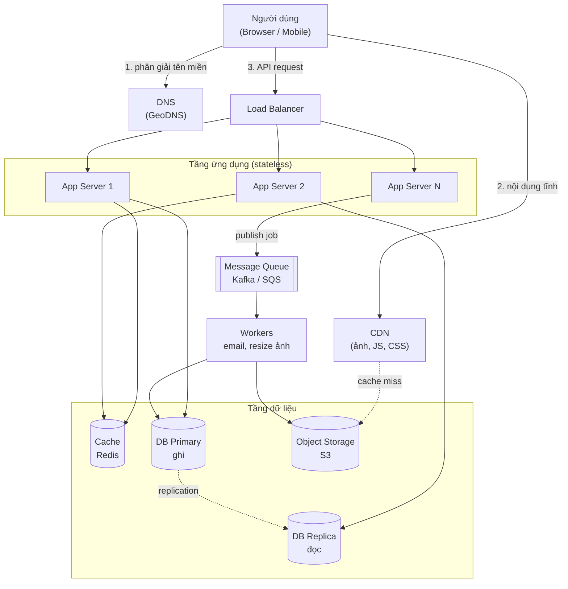
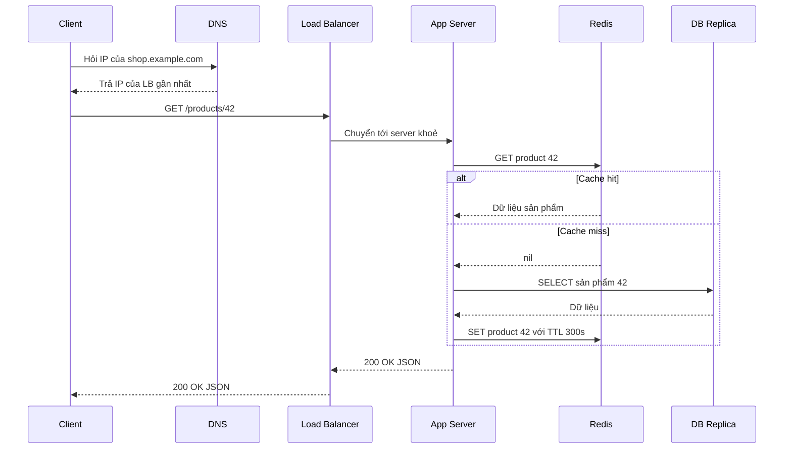
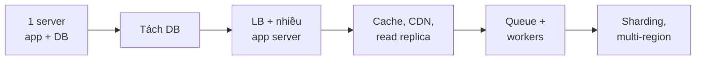

# System Design là gì?

**System Design** (thiết kế hệ thống) là quá trình xác định **kiến trúc, các thành phần (component), module, interface và luồng dữ liệu** của một hệ thống phần mềm sao cho nó đáp ứng được yêu cầu nghiệp vụ — và quan trọng hơn, vẫn chạy ổn khi số người dùng tăng từ 100 lên 100 triệu. Nó trả lời câu hỏi: "Code thì viết được rồi, nhưng **đặt nó ở đâu, nối với cái gì, dữ liệu chảy thế nào** để hệ thống nhanh, bền và không sập?"

**Tương tự đơn giản:** Viết code giống như **xây từng căn phòng**, còn System Design giống như **quy hoạch cả một khu đô thị** — đường sá (network), trạm điện (database), kho hàng (cache), bưu điện (message queue), cổng soát vé (load balancer). Một căn phòng đẹp chẳng có ý nghĩa gì nếu cả khu tắc đường mỗi giờ cao điểm.

---

:::note[Ghi nhớ nhanh]

- ⭐ **System Design = chọn thành phần + cách nối chúng + đánh đổi (trade-off)** — không có thiết kế "đúng tuyệt đối", chỉ có thiết kế phù hợp với yêu cầu và ràng buộc.
- ⭐ **Phân biệt Functional vs Non-functional requirements** — functional là "hệ thống làm gì", non-functional là "làm tốt đến mức nào" (latency, availability, scalability...).
- **Các khối xây dựng quen thuộc:** client, DNS, CDN, load balancer, app server (stateless), cache, database, message queue, worker, object storage.
- **Bắt đầu đơn giản, scale khi có số liệu** — một server + một DB vẫn là kiến trúc hợp lệ cho sản phẩm mới.
- **Phỏng vấn system design chấm cách bạn suy nghĩ**, không chấm việc thuộc lòng kiến trúc của Netflix.

:::

---

## Mục lục

- [Vì sao cần System Design?](#vì-sao-cần-system-design)
- [1. System Design là gì?](#1-system-design-là-gì)
- [2. Functional và Non-functional requirements](#2-functional-và-non-functional-requirements)
- [3. Các thành phần chính của một hệ thống lớn](#3-các-thành-phần-chính-của-một-hệ-thống-lớn)
- [4. Bức tranh tổng thể](#4-bức-tranh-tổng-thể)
- [5. Hành trình tiến hoá của một hệ thống](#5-hành-trình-tiến-hoá-của-một-hệ-thống)
- [6. High-level design và Low-level design](#6-high-level-design-và-low-level-design)
- [Khi nào dùng?](#khi-nào-dùng)
- [Lỗi thường gặp](#lỗi-thường-gặp)
- [Câu hỏi phỏng vấn](#câu-hỏi-phỏng-vấn)

---

## Vì sao cần System Design?

**Vấn đề:** Một ứng dụng web "bình thường" — Express + PostgreSQL trên một con VPS — chạy rất tốt với vài trăm người dùng. Nhưng khi traffic tăng gấp 100 lần: CPU server chạm 100%, database bị khoá (lock) liên tục, trang load 10 giây, một lần deploy lỗi là cả hệ thống chết vì chỉ có **một điểm duy nhất** (single point of failure). Thêm RAM, thêm CPU (scale dọc) chỉ cứu được một thời gian, và giá tăng theo cấp số nhân.

**Giải pháp:** System Design cung cấp **bộ từ vựng và các mẫu (pattern) đã được kiểm chứng** để tách hệ thống thành nhiều thành phần chuyên biệt: đưa nội dung tĩnh lên CDN, đặt load balancer trước nhiều app server, cache dữ liệu nóng trong Redis, đẩy việc nặng sang queue + worker, replicate database... Mỗi lựa chọn đều có cái giá — System Design là nghệ thuật **chọn cái giá chấp nhận được**.

:::tip[Dùng thực tế]

- **Phỏng vấn senior/staff:** hầu hết công ty lớn (Google, Meta, Amazon, Grab, Shopee...) có một vòng system design riêng — "Thiết kế Twitter", "Thiết kế URL shortener", "Thiết kế hệ thống chat".
- **Ra quyết định kiến trúc hằng ngày:** chọn SQL hay NoSQL, có cần Redis không, đồng bộ hay bất đồng bộ, monolith hay microservices.
- **Chuẩn bị cho sự kiện traffic lớn:** flash sale 11.11, mở bán vé concert, Black Friday — phải ước lượng tải và thiết kế trước, không thể "chữa cháy" lúc đó.
- **Điều tra sự cố (incident):** hiểu luồng dữ liệu qua từng tầng giúp khoanh vùng nhanh: lỗi ở DNS, LB, cache hay DB?

:::

---

## 1. System Design là gì?

Theo định nghĩa phổ biến (dùng trong roadmap.sh và system-design-primer), System Design là **quá trình định nghĩa kiến trúc, interface và dữ liệu** cho một hệ thống để thoả mãn các yêu cầu cụ thể. Nó bao gồm:

| Khía cạnh | Câu hỏi cần trả lời | Ví dụ quyết định |
| --- | --- | --- |
| **Kiến trúc (architecture)** | Hệ thống gồm những khối lớn nào? | Monolith hay microservices, có tách read/write không |
| **Thành phần (components)** | Mỗi khối dùng công nghệ gì? | PostgreSQL hay Cassandra, Redis hay Memcached |
| **Interface** | Các khối nói chuyện với nhau ra sao? | REST, gRPC, message queue, WebSocket |
| **Dữ liệu (data)** | Lưu gì, ở đâu, mô hình thế nào? | Schema, partition key, replication |
| **Vận hành (operations)** | Theo dõi, mở rộng, khôi phục ra sao? | Monitoring, autoscaling, backup, failover |

Có thể hình dung System Design ở 3 tầng trừu tượng:

1. **Tầng hạ tầng (infrastructure):** server, network, region, availability zone, CDN.
2. **Tầng kiến trúc (architecture):** các service, database, cache, queue và cách chúng nối với nhau.
3. **Tầng chi tiết (component/class):** schema bảng, API contract, thuật toán, cấu trúc dữ liệu bên trong một service.

Phỏng vấn system design thường tập trung vào tầng 2, thỉnh thoảng đi sâu xuống tầng 3 ở một component cụ thể (ví dụ: "thuật toán sinh short URL không trùng như thế nào?").

### System Design khác gì viết code?

| Viết code | System Design |
| --- | --- |
| Tối ưu một hàm, một module | Tối ưu toàn bộ luồng qua nhiều máy |
| Lỗi thường là bug logic | Lỗi thường là timeout, mất mạng, máy chết, dữ liệu lệch |
| Có "đáp án đúng" (test pass) | Chỉ có đánh đổi (trade-off) hợp lý |
| Đo bằng Big-O | Đo bằng latency, throughput, availability, chi phí |
| Một tiến trình, bộ nhớ chung | Nhiều máy, không có bộ nhớ chung, đồng hồ lệch nhau |

---

## 2. Functional và Non-functional requirements

Mọi bài System Design bắt đầu bằng **requirements** (yêu cầu). Có hai loại, và người mới thường chỉ nghĩ đến loại thứ nhất.

### 2.1. Functional requirements — hệ thống làm gì?

**Functional requirements** (yêu cầu chức năng) mô tả **hành vi** mà người dùng nhìn thấy. Ví dụ với một URL shortener:

- Người dùng gửi URL dài, nhận về URL ngắn (vd `https://sho.rt/aZ3k9`).
- Truy cập URL ngắn thì được redirect (HTTP 301/302) về URL gốc.
- Người dùng có thể tự chọn alias (custom alias).
- URL có thể có thời hạn hết hạn (expiration).
- (Tuỳ chọn) Thống kê số lượt click.

### 2.2. Non-functional requirements — làm tốt đến mức nào?

**Non-functional requirements** (yêu cầu phi chức năng, còn gọi là quality attributes) mô tả **chất lượng** của hệ thống. Đây mới là phần quyết định kiến trúc:

| Thuộc tính | Ý nghĩa | Ví dụ mục tiêu |
| --- | --- | --- |
| **Scalability** (khả năng mở rộng) | Chịu được tải tăng bằng cách thêm tài nguyên | 10K → 1M request/giây mà không viết lại |
| **Availability** (tính sẵn sàng) | Tỉ lệ thời gian hệ thống phục vụ được | 99.9% (≈ 8.76 giờ downtime/năm) |
| **Latency** (độ trễ) | Thời gian xử lý một request | p99 dưới 200ms |
| **Throughput** (thông lượng) | Số request xử lý được mỗi giây | 50K QPS |
| **Consistency** (tính nhất quán) | Mọi người đọc thấy cùng dữ liệu mới nhất? | Số dư ngân hàng: strong; số like: eventual |
| **Durability** (độ bền dữ liệu) | Dữ liệu đã ghi không bị mất | 11 số 9 (Amazon S3 công bố 99.999999999%) |
| **Reliability** (độ tin cậy) | Hoạt động đúng, kể cả khi có lỗi | Mất 1 máy không mất request |
| **Security** | Bảo vệ dữ liệu, chống tấn công | Mã hoá, xác thực, rate limit |
| **Maintainability** | Dễ sửa, dễ vận hành | Deploy độc lập, observability tốt |
| **Cost** | Chi phí hạ tầng và vận hành | Dưới X USD/tháng |

:::info[Vì sao non-functional quan trọng hơn?]

Hai hệ thống có **cùng functional requirements** có thể có kiến trúc hoàn toàn khác nhau. "Gửi tin nhắn cho bạn bè" với 1.000 user chỉ cần một bảng `messages` trong MySQL. Với 2 tỉ user như WhatsApp, cần WebSocket gateway, sharding theo user, queue cho người offline, end-to-end encryption... Chính **non-functional requirements** (quy mô, độ trễ, sẵn sàng) quyết định kiến trúc.

:::

### 2.3. Constraints — ràng buộc

Ngoài hai loại trên còn có **constraints** (ràng buộc): ngân sách, deadline, kỹ năng team, quy định pháp lý (dữ liệu người dùng EU phải nằm ở EU — GDPR), công nghệ bắt buộc dùng. Constraints thu hẹp không gian lựa chọn.

---

## 3. Các thành phần chính của một hệ thống lớn

Dưới đây là các "viên gạch" xuất hiện trong hầu hết hệ thống quy mô lớn. Mỗi thành phần sẽ có bài riêng ở các phần sau của topic.

### 3.1. Client

**Client** là nơi request bắt đầu: trình duyệt, mobile app, hoặc một service khác gọi API. Client có thể tự cache (HTTP cache, local storage), retry khi lỗi, và là nơi đo trải nghiệm thực của người dùng.

### 3.2. DNS

**DNS (Domain Name System)** dịch tên miền (`api.example.com`) thành địa chỉ IP. Ngoài chức năng "danh bạ", DNS còn dùng để **phân tải theo địa lý** (GeoDNS — trả IP của datacenter gần người dùng nhất) và **failover** (đổi bản ghi khi một region chết). Ví dụ: Amazon Route 53, Cloudflare DNS.

### 3.3. CDN

**CDN (Content Delivery Network)** là mạng lưới server đặt ở nhiều nơi trên thế giới (edge/PoP), cache nội dung tĩnh (ảnh, video, JS, CSS) gần người dùng. Người dùng ở Hà Nội tải ảnh từ edge ở Singapore thay vì origin ở Mỹ — giảm latency từ ~200ms xuống ~30ms. Ví dụ: Cloudflare, Akamai, CloudFront.

### 3.4. Load Balancer

**Load Balancer** (bộ cân bằng tải) nhận request và phân phối cho nhiều app server phía sau theo thuật toán (round robin, least connections, consistent hashing...). Nó còn **health check** — tự loại bỏ server chết. Ví dụ: Nginx, HAProxy, AWS ALB/NLB.

### 3.5. Application Server

**App server** chạy business logic (Node.js, Spring Boot, Go...). Nguyên tắc vàng: **app server nên stateless** — không giữ session hay dữ liệu cục bộ — để có thể thêm/bớt server tuỳ ý (horizontal scaling). State được đẩy ra cache hoặc database.

### 3.6. Cache

**Cache** lưu bản sao dữ liệu hay đọc trong bộ nhớ (RAM) để trả lời nhanh hơn database hàng chục lần. Đọc từ Redis mất khoảng dưới 1ms trong cùng datacenter, trong khi một query DB phức tạp có thể mất 10–100ms. Ví dụ: Redis, Memcached.

### 3.7. Database

**Database** là nơi lưu trữ dữ liệu bền vững (persistent). Hai họ chính:

- **SQL / quan hệ** (PostgreSQL, MySQL): schema chặt, transaction ACID, JOIN mạnh.
- **NoSQL** (MongoDB, Cassandra, DynamoDB): scale ngang dễ hơn, mô hình linh hoạt, thường đánh đổi bớt consistency.

Để scale database: **replication** (nhân bản để đọc nhiều/chịu lỗi), **sharding/partitioning** (chia dữ liệu ra nhiều máy), **federation** (tách theo chức năng).

### 3.8. Message Queue

**Message Queue** (hàng đợi thông điệp) cho phép các service giao tiếp **bất đồng bộ**: producer đẩy message vào, consumer xử lý sau. Giúp **giảm tải đột biến** (buffer), **tách rời (decouple)** các service, và xử lý việc nặng ở background. Ví dụ: RabbitMQ, Apache Kafka, AWS SQS.

### 3.9. Worker / Background jobs

**Worker** là tiến trình lấy việc từ queue để xử lý: gửi email, resize ảnh, transcode video, tính toán báo cáo. Người dùng không phải chờ những việc này trong request.

### 3.10. Object Storage

**Object storage** lưu file lớn (ảnh, video, backup) với độ bền rất cao và giá rẻ — Amazon S3, Google Cloud Storage, MinIO. Database chỉ lưu metadata + đường dẫn tới object.

### 3.11. Các thành phần hỗ trợ khác

| Thành phần | Vai trò |
| --- | --- |
| **API Gateway** | Cổng vào duy nhất: auth, rate limit, routing tới microservices |
| **Search engine** | Tìm kiếm full-text (Elasticsearch, OpenSearch) |
| **Monitoring / Logging** | Prometheus, Grafana, ELK — biết hệ thống đang khoẻ hay ốm |
| **Service discovery** | Service tìm thấy nhau động (Consul, Kubernetes DNS) |
| **Configuration / Secrets** | Quản lý cấu hình tập trung (Vault, AWS Parameter Store) |

---

## 4. Bức tranh tổng thể

Sơ đồ dưới đây ghép các thành phần trên thành một kiến trúc web điển hình. Request **đọc** thường đi qua cache trước; request **ghi** đi vào DB primary và có thể phát sự kiện vào queue cho worker xử lý tiếp.



Luồng một request đọc (ví dụ: xem trang sản phẩm) diễn ra như sau:



Đoạn code Node.js minh hoạ phía app server cho luồng trên (pattern **cache-aside**):

```ts
import { createClient } from 'redis';
import { Pool } from 'pg';

const redis = createClient({ url: process.env.REDIS_URL });
const replica = new Pool({ connectionString: process.env.DB_REPLICA_URL });

const PRODUCT_TTL_SECONDS = 300;

export async function getProduct(id: number) {
  const key = `product:${id}`;

  // 1. Thử cache trước
  const cached = await redis.get(key);
  if (cached) return JSON.parse(cached);

  // 2. Cache miss -> đọc từ DB replica
  const { rows } = await replica.query('SELECT * FROM products WHERE id = $1', [id]);
  const product = rows[0] ?? null;

  // 3. Ghi lại vào cache để lần sau nhanh hơn
  if (product) {
    await redis.set(key, JSON.stringify(product), { EX: PRODUCT_TTL_SECONDS });
  }
  return product;
}
```

---

## 5. Hành trình tiến hoá của một hệ thống

Không ai thiết kế ngay kiến trúc "đủ đồ" ở trên từ ngày đầu. Hệ thống thật tiến hoá theo nhu cầu:

| Giai đoạn | Người dùng | Kiến trúc | Vấn đề gặp phải → bước tiếp |
| --- | --- | --- | --- |
| **1. Một máy** | Vài trăm | App + DB cùng một server | DB tranh CPU/RAM với app → tách DB |
| **2. Tách DB** | Vài nghìn | 1 app server + 1 DB server | App server quá tải, là SPOF → thêm LB |
| **3. Scale ngang app** | Hàng chục nghìn | LB + N app server stateless | DB đọc quá tải → cache + read replica |
| **4. Cache + Replica** | Hàng trăm nghìn | + Redis + DB replica + CDN | Việc nặng làm chậm request → queue |
| **5. Bất đồng bộ** | Hàng triệu | + Message queue + worker | DB ghi quá tải → sharding |
| **6. Sharding, multi-region** | Hàng chục triệu+ | DB sharded, nhiều datacenter | Độ phức tạp vận hành → microservices, platform team |



:::warning[Đừng over-engineer]

Instagram năm 2012 phục vụ khoảng 30 triệu người dùng với đội kỹ thuật chỉ vài người, chủ yếu dựa trên Django + PostgreSQL + Redis + Memcached — không có hàng trăm microservice. Hãy thêm thành phần khi **có số liệu chứng minh cần**, không phải vì "công ty lớn cũng dùng".

:::

---

## 6. High-level design và Low-level design

Trong công việc và phỏng vấn, người ta hay chia hai mức:

| | High-level design (HLD) | Low-level design (LLD) |
| --- | --- | --- |
| **Phạm vi** | Toàn hệ thống | Một service / module |
| **Câu hỏi** | Có những service nào, nối nhau ra sao, dùng DB gì? | Class nào, schema bảng nào, API trả gì, thuật toán gì? |
| **Sản phẩm** | Sơ đồ kiến trúc, luồng dữ liệu | Class diagram, ERD, API spec |
| **Ví dụ** | "URL shortener gồm API service, KV store, cache, analytics pipeline" | "Bảng `urls(short_code PK, long_url, created_at, expires_at)`; sinh code bằng base62" |

Topic này tập trung chủ yếu vào **HLD** và các pattern dùng trong HLD.

---

## Khi nào dùng?

- **Cần tư duy System Design khi:**
  - Xây sản phẩm có kỳ vọng tăng trưởng người dùng/dữ liệu đáng kể
  - Có yêu cầu rõ về SLA: uptime, latency, không mất dữ liệu
  - Hệ thống gồm nhiều service, nhiều team
  - Chuẩn bị phỏng vấn vị trí middle/senior trở lên
- **Không cần làm phức tạp khi:**
  - MVP, prototype, tool nội bộ vài chục người dùng
  - Chưa có số liệu traffic thực tế — một monolith + PostgreSQL thường là đủ
- **Best practice:**
  - Viết requirements (cả functional và non-functional) **trước** khi vẽ sơ đồ
  - Mỗi thành phần thêm vào phải trả lời được: "Nó giải quyết vấn đề gì? Cái giá là gì?"
  - Ghi lại quyết định kiến trúc (ADR — Architecture Decision Record)

---

## Lỗi thường gặp

### Lỗi 1: Nhảy vào vẽ sơ đồ ngay

Vẽ Kafka, Redis, Cassandra ngay phút đầu mà chưa hỏi "bao nhiêu user? đọc nhiều hay ghi nhiều? cần consistency mạnh không?". Không có requirements thì không thể đánh giá thiết kế đúng hay sai.

### Lỗi 2: Bỏ qua non-functional requirements

Chỉ liệt kê tính năng (đăng bài, comment, like) mà không nêu quy mô, latency, availability. Kết quả: thiết kế không có căn cứ để chọn SQL hay NoSQL, có cần cache hay không.

### Lỗi 3: Thêm thành phần vì "trendy"

Dùng microservices, Kubernetes, Kafka cho một app 500 người dùng. Mỗi thành phần mới là thêm một thứ có thể hỏng, cần monitor, cần người hiểu. **Độ phức tạp cũng là chi phí.**

### Lỗi 4: Để app server giữ state

Lưu session trong bộ nhớ của app server → khi LB chuyển request sang server khác thì user bị logout; khi scale hoặc restart thì mất dữ liệu. Đưa session vào Redis hoặc dùng token (JWT).

### Lỗi 5: Quên single point of failure (SPOF)

Có 10 app server nhưng chỉ 1 load balancer, 1 database không replica. Chỉ cần một máy đó chết là cả hệ thống chết. Luôn tự hỏi: "Nếu cái này chết thì sao?"

---

## Câu hỏi phỏng vấn

Những câu thường gặp về chủ đề này. Tự trả lời trước, rồi bấm **Xem đáp án** để đối chiếu.

**1. Functional và non-functional requirements khác nhau thế nào? Cho ví dụ.**

<details className="qa">
<summary>Xem đáp án</summary>

- **Functional:** hệ thống **làm gì** — "user đăng được ảnh", "user follow được người khác".
- **Non-functional:** hệ thống **làm tốt đến đâu** — "feed load dưới 200ms ở p99", "uptime 99.99%", "chịu 100K QPS".

Non-functional requirements quyết định kiến trúc: cùng tính năng chat nhưng 1K user và 1 tỉ user có thiết kế khác hẳn nhau.

</details>

**2. Kể tên các thành phần chính trong một hệ thống web quy mô lớn và vai trò của chúng.**

<details className="qa">
<summary>Xem đáp án</summary>

DNS (phân giải tên miền, GeoDNS), CDN (nội dung tĩnh gần user), Load balancer (phân tải + health check), App server stateless (business logic), Cache (dữ liệu nóng trong RAM), Database (lưu bền, replica/shard), Message queue (bất đồng bộ, decouple, buffer), Worker (việc nặng ở background), Object storage (file lớn), cùng monitoring/logging.

</details>

**3. Vì sao app server nên stateless?**

<details className="qa">
<summary>Xem đáp án</summary>

Stateless nghĩa là server không giữ dữ liệu riêng giữa các request (session, file upload tạm...). Khi đó:

- Load balancer gửi request tới **bất kỳ** server nào cũng được.
- Thêm/bớt server (autoscaling) dễ dàng, không phải "di chuyển" state.
- Một server chết không làm mất dữ liệu người dùng.

State được đẩy ra hệ thống chuyên dụng: Redis (session), DB, object storage.

</details>

**4. Bạn bắt đầu thiết kế một hệ thống mới thế nào khi chưa biết traffic?**

<details className="qa">
<summary>Xem đáp án</summary>

Bắt đầu **đơn giản nhất có thể đáp ứng requirements hiện tại** (thường là monolith + một DB quan hệ + backup), nhưng giữ các nguyên tắc giúp scale về sau: app stateless, tách config, có monitoring. Khi có số liệu thật (QPS, kích thước dữ liệu, điểm nghẽn), mới thêm cache, replica, queue, sharding. Tránh tối ưu sớm.

</details>

**5. High-level design và low-level design khác gì nhau?**

<details className="qa">
<summary>Xem đáp án</summary>

- **HLD:** nhìn toàn hệ thống — các service, database, cache, queue, luồng dữ liệu giữa chúng.
- **LLD:** đi sâu vào một thành phần — schema, API contract, class, thuật toán.

Phỏng vấn system design chủ yếu là HLD, sau đó interviewer chọn 1–2 component để đào sâu (deep dive).

</details>
