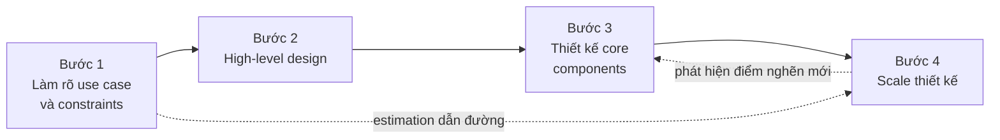
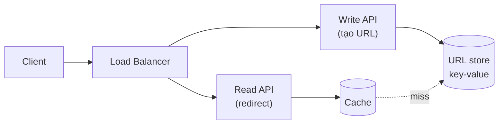
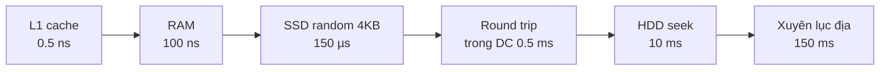
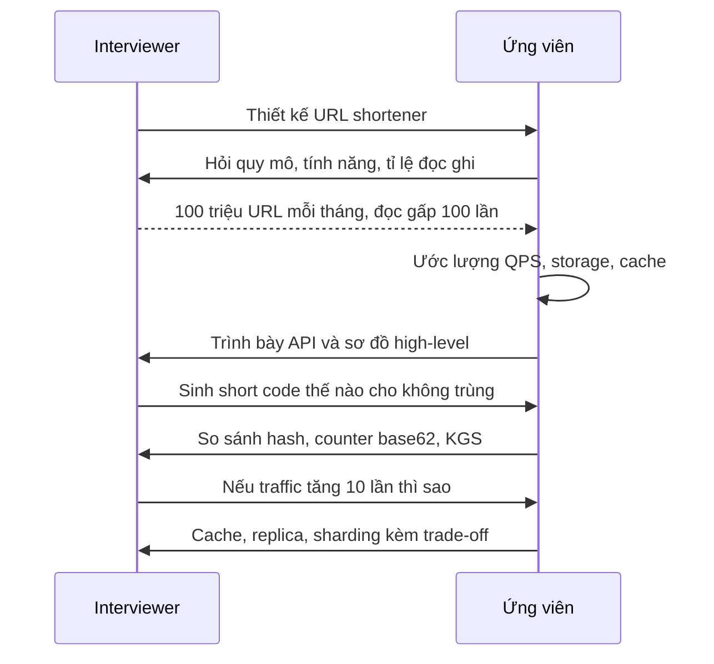

# Cách tiếp cận bài toán System Design

Bài toán System Design thường **mở và mơ hồ**: "Thiết kế Twitter", "Thiết kế URL shortener". Không có đề bài chi tiết, không có đáp án duy nhất. Thứ phân biệt một thiết kế tốt với một mớ hộp vẽ lung tung là **quy trình**: hỏi đúng câu, ước lượng đúng con số, đi từ tổng quát xuống chi tiết, rồi mới scale.

**Tương tự đơn giản:** Giống **kiến trúc sư xây nhà**: trước tiên hỏi gia chủ "mấy người ở, ngân sách bao nhiêu, có cần gara không" (requirements), ước lượng diện tích và vật liệu (estimation), vẽ mặt bằng tổng thể (high-level), rồi mới thiết kế chi tiết cầu thang, điện nước (core components), cuối cùng tính chuyện "sau này xây thêm tầng thì móng có chịu nổi không" (scale).

---

:::note[Ghi nhớ nhanh]

- ⭐ **Khung 4 bước:** (1) làm rõ use case và constraints → (2) high-level design → (3) thiết kế core components → (4) scale.
- ⭐ **Back-of-the-envelope estimation** — ước lượng nhanh QPS, storage, bandwidth để biết bài toán "to cỡ nào" trước khi chọn công nghệ.
- **Mẹo nhẩm:** 1 ngày ≈ 86.400 giây ≈ 10⁵ giây; 1 triệu request/ngày ≈ 12 request/giây.
- **Thuộc bảng latency cơ bản:** RAM ~100ns, đọc ngẫu nhiên SSD ~150µs, round trip trong datacenter ~0.5ms, round trip xuyên lục địa ~150ms.
- **Nói to suy nghĩ và nêu trade-off** — interviewer chấm quá trình, không chấm sơ đồ "giống Netflix".

:::

---

## Mục lục

- [Vì sao cần một cách tiếp cận có hệ thống?](#vì-sao-cần-một-cách-tiếp-cận-có-hệ-thống)
- [1. Khung 4 bước](#1-khung-4-bước)
- [2. Bước 1 - Làm rõ use case và constraints](#2-bước-1---làm-rõ-use-case-và-constraints)
- [3. Bước 2 - High-level design](#3-bước-2---high-level-design)
- [4. Bước 3 - Thiết kế core components](#4-bước-3---thiết-kế-core-components)
- [5. Bước 4 - Scale thiết kế](#5-bước-4---scale-thiết-kế)
- [6. Back-of-the-envelope estimation](#6-back-of-the-envelope-estimation)
- [7. Latency numbers every programmer should know](#7-latency-numbers-every-programmer-should-know)
- [8. Lũy thừa của 2](#8-lũy-thừa-của-2)
- [9. Ví dụ ước lượng cho URL shortener](#9-ví-dụ-ước-lượng-cho-url-shortener)
- [10. Phân bổ thời gian trong buổi phỏng vấn](#10-phân-bổ-thời-gian-trong-buổi-phỏng-vấn)
- [Khi nào dùng?](#khi-nào-dùng)
- [Lỗi thường gặp](#lỗi-thường-gặp)
- [Câu hỏi phỏng vấn](#câu-hỏi-phỏng-vấn)

---

## Vì sao cần một cách tiếp cận có hệ thống?

**Vấn đề:** Đứng trước đề "Thiết kế YouTube" trong 45 phút, người mới thường hoảng: hoặc im lặng quá lâu, hoặc vẽ ngay 20 hộp (Kafka, Cassandra, Kubernetes...) mà không giải thích được vì sao. Kết quả là thiết kế không bám requirements, bỏ sót phần quan trọng (upload video? transcode?), và hết giờ trước khi nói đến scale.

**Giải pháp:** Dùng một **khung (framework) cố định** để luôn biết bước tiếp theo là gì, kết hợp **ước lượng nhanh bằng số** để mọi quyết định có căn cứ: "Ta có ~4.000 QPS đọc, một Postgres instance chịu được, nhưng thêm cache để giảm p99". Khung này dùng được cả khi phỏng vấn lẫn khi viết design doc thật ở công ty.

:::tip[Dùng thực tế]

- **Phỏng vấn system design** ở các công ty công nghệ lớn — khung 4 bước tương tự được giới thiệu trong system-design-primer và nhiều sách luyện phỏng vấn.
- **Viết design doc / RFC** trước khi làm một tính năng lớn: mục Requirements, Estimation, High-level, Detailed design, Scaling là bộ khung quen thuộc.
- **Capacity planning** trước sự kiện lớn: flash sale, livestream, mùa thi — ước lượng QPS đỉnh để chuẩn bị số server.
- **Ước lượng chi phí cloud**: storage 5 năm cần bao nhiêu TB → bao nhiêu tiền S3 mỗi tháng.

:::

---

## 1. Khung 4 bước



| Bước | Mục tiêu | Đầu ra |
| --- | --- | --- |
| **1. Use case và constraints** | Hiểu đúng bài toán, giới hạn phạm vi | Danh sách tính năng, con số quy mô, giả định |
| **2. High-level design** | Phác thảo các khối chính và luồng dữ liệu | Sơ đồ 5–10 hộp, API chính, mô hình dữ liệu sơ bộ |
| **3. Core components** | Đi sâu vào phần khó / quan trọng nhất | Schema, thuật toán, chi tiết API |
| **4. Scale** | Tìm điểm nghẽn và xử lý | Cache, LB, replica, sharding, queue + trade-off |

---

## 2. Bước 1 - Làm rõ use case và constraints

Đây là bước người mới hay bỏ qua nhất nhưng quan trọng nhất. Hãy **đặt câu hỏi** thay vì tự giả định.

### 2.1. Câu hỏi về use case

- Ai là người dùng? Họ dùng hệ thống thế nào?
- Những tính năng nào **bắt buộc** (in scope), tính năng nào bỏ qua (out of scope)?
- Input và output của hệ thống là gì?

### 2.2. Câu hỏi về constraints và quy mô

- Có bao nhiêu người dùng (tổng, hoạt động hằng ngày — DAU)?
- Mỗi người dùng làm bao nhiêu thao tác mỗi ngày?
- Tỉ lệ **đọc / ghi** (read/write ratio)?
- Dữ liệu lớn cỡ nào, giữ bao lâu?
- Yêu cầu latency, availability, consistency?
- Có traffic đỉnh (peak) bất thường không — gấp mấy lần trung bình?

### 2.3. Ví dụ: làm rõ đề "Thiết kế URL shortener"

| Câu hỏi | Giả định thống nhất với interviewer |
| --- | --- |
| Tính năng chính? | Rút gọn URL, redirect, URL hết hạn sau mặc định 5 năm |
| Custom alias? | Có, tuỳ chọn |
| Analytics? | Ngoài phạm vi (out of scope) |
| Số URL mới mỗi tháng? | 100 triệu |
| Tỉ lệ đọc/ghi? | 100 : 1 |
| Latency redirect? | Càng nhanh càng tốt, p99 dưới 100ms |
| Availability? | Cao — redirect hỏng là link chết khắp internet |

:::info[Ghi lại giả định]

Viết các giả định lên bảng/tài liệu. Ở các bước sau, mọi quyết định đều tham chiếu ngược lại: "Vì đọc gấp 100 lần ghi nên ta ưu tiên cache và read replica".

:::

---

## 3. Bước 2 - High-level design

Phác thảo **các khối chính** và **luồng dữ liệu** giữa chúng. Chưa cần chi tiết, chỉ cần đủ để hệ thống chạy được end-to-end cho các use case chính.

Các việc cần làm:

1. **Định nghĩa API** chính (REST/gRPC).
2. **Vẽ sơ đồ** client → LB → service → storage.
3. **Mô hình dữ liệu** sơ bộ: những entity nào, quan hệ ra sao.

Ví dụ API cho URL shortener:

```http
POST /api/v1/urls
Content-Type: application/json

{ "longUrl": "https://example.com/very/long/path", "customAlias": null, "expireAt": null }

=> 201 Created
{ "shortUrl": "https://sho.rt/aZ3k9Xb" }

GET /aZ3k9Xb
=> 301 Moved Permanently
Location: https://example.com/very/long/path
```

Sơ đồ high-level:



---

## 4. Bước 3 - Thiết kế core components

Chọn 1–3 thành phần **khó nhất / quan trọng nhất** và đi sâu. Với URL shortener, đó là **cách sinh short code**:

| Cách | Ưu | Nhược |
| --- | --- | --- |
| **Hash (MD5/SHA) URL rồi lấy 7 ký tự đầu** | Đơn giản, cùng URL ra cùng code | Có thể trùng (collision), phải kiểm tra và xử lý |
| **Counter tự tăng + base62** | Không trùng, ngắn | Counter là điểm nghẽn/SPOF, code đoán được |
| **Key Generation Service** sinh sẵn key | Nhanh, không trùng | Thêm một service phải vận hành |

Code base62 minh hoạ:

```ts
const ALPHABET = '0123456789abcdefghijklmnopqrstuvwxyzABCDEFGHIJKLMNOPQRSTUVWXYZ';
const BASE = ALPHABET.length; // 62

// Chuyển một id số nguyên (bigint) sang chuỗi base62
export function toBase62(id: bigint): string {
  if (id === 0n) return ALPHABET[0];
  let n = id;
  let out = '';
  while (n > 0n) {
    out = ALPHABET[Number(n % BigInt(BASE))] + out;
    n = n / BigInt(BASE);
  }
  return out;
}

// 62^7 ≈ 3.5 nghìn tỉ -> 7 ký tự là dư cho 6 tỉ URL (xem phần ước lượng)
```

Schema dữ liệu:

```sql
CREATE TABLE urls (
  short_code  VARCHAR(7)  PRIMARY KEY,
  long_url    TEXT        NOT NULL,
  user_id     BIGINT,
  created_at  TIMESTAMPTZ NOT NULL DEFAULT now(),
  expires_at  TIMESTAMPTZ
);
```

---

## 5. Bước 4 - Scale thiết kế

Xác định **điểm nghẽn (bottleneck)** dựa trên con số ước lượng, rồi áp dụng kỹ thuật phù hợp. Luôn nêu **trade-off** của từng lựa chọn.

| Điểm nghẽn | Kỹ thuật | Trade-off |
| --- | --- | --- |
| App server quá tải | Load balancer + scale ngang (stateless) | Thêm LB phải tránh SPOF |
| Đọc DB quá nhiều | Cache (Redis), read replica | Dữ liệu cũ (stale), replication lag |
| Ghi DB quá nhiều / dữ liệu quá lớn | Sharding / partitioning | JOIN và transaction xuyên shard khó |
| Việc nặng trong request | Message queue + worker | Eventual consistency, cần idempotency |
| Người dùng ở xa | CDN, multi-region | Chi phí, đồng bộ dữ liệu giữa region |
| Một region chết | Failover, active-active | Phức tạp, có thể mất dữ liệu gần nhất |

Quy trình lặp: **đo / ước lượng → tìm nghẽn → xử lý → kiểm tra nghẽn mới**.

---

## 6. Back-of-the-envelope estimation

**Back-of-the-envelope estimation** ("tính nhẩm mặt sau phong bì") là ước lượng **cỡ độ lớn (order of magnitude)** bằng các con số tròn. Mục tiêu không phải chính xác, mà để biết: cần 1 server hay 1.000 server? Dữ liệu vài GB hay vài PB?

### 6.1. Các con số nền tảng

| Đại lượng | Giá trị | Mẹo nhẩm |
| --- | --- | --- |
| Giây trong 1 ngày | 86.400 | ≈ 10⁵ (thực tế ~ 0.86 × 10⁵) |
| Giây trong 1 tháng | ~2.6 triệu | ≈ 2.5 × 10⁶ |
| Giây trong 1 năm | ~31.5 triệu | ≈ 3 × 10⁷ |
| 1 triệu request/ngày | ~11.6 QPS | ≈ 12 QPS |
| 1 tỉ request/tháng | ~400 QPS | 10⁹ / 2.5 × 10⁶ |

### 6.2. QPS (Queries Per Second)

```
QPS trung bình = (DAU × số request mỗi user mỗi ngày) / 86.400
QPS đỉnh      = QPS trung bình × hệ số peak (thường 2–10)
```

Ví dụ: 10 triệu DAU, mỗi người 20 request/ngày → 200 triệu request/ngày → ~2.300 QPS trung bình → đỉnh (×3) ~7.000 QPS.

### 6.3. Storage

```
Storage = số bản ghi mới mỗi ngày × kích thước mỗi bản ghi × số ngày lưu × hệ số replication
```

Ví dụ: 1 triệu ảnh/ngày × 500 KB × 365 ngày × 5 năm ≈ 912 TB ≈ ~1 PB (chưa tính replication ×3).

### 6.4. Bandwidth

```
Bandwidth = QPS × kích thước response
```

Ví dụ: 7.000 QPS đọc × 100 KB = 700 MB/s ≈ 5.6 Gbps → cần CDN.

### 6.5. Số server (ước lượng thô)

Nếu một app server xử lý ~1.000 QPS cho API đơn giản, 7.000 QPS đỉnh cần ~7 server, cộng dư phòng (headroom) và dự phòng (N+1/N+2) → ~10 server. Con số "1.000 QPS/server" là giả định, phải benchmark với workload thật.

---

## 7. Latency numbers every programmer should know

Bảng nổi tiếng do Jeff Dean (Google) phổ biến, được Peter Norvig và nhiều người cập nhật. Giá trị là **cỡ độ lớn** (phần cứng hiện đại có thể nhanh hơn), dùng để so sánh tương đối:

| Thao tác | Thời gian | Quy đổi |
| --- | --- | --- |
| L1 cache reference | 0.5 ns | |
| Branch mispredict | 5 ns | |
| L2 cache reference | 7 ns | 14× L1 |
| Mutex lock/unlock | 25 ns | |
| Main memory (RAM) reference | 100 ns | 20× L2, 200× L1 |
| Nén 1 KB bằng Zippy/Snappy | 10.000 ns | 10 µs |
| Gửi 1 KB qua mạng 1 Gbps | 10.000 ns | 10 µs |
| Đọc ngẫu nhiên 4 KB từ SSD | 150.000 ns | 150 µs |
| Đọc tuần tự 1 MB từ RAM | 250.000 ns | 250 µs |
| Round trip trong cùng datacenter | 500.000 ns | 0.5 ms |
| Đọc tuần tự 1 MB từ SSD | 1.000.000 ns | 1 ms, 4× RAM |
| HDD seek | 10.000.000 ns | 10 ms |
| Đọc tuần tự 1 MB từ HDD | 30.000.000 ns | 30 ms, 120× RAM |
| Gửi packet California → Hà Lan → California | 150.000.000 ns | 150 ms |

Đơn vị: 1 ns = 10⁻⁹ s; 1 µs = 1.000 ns; 1 ms = 1.000 µs.



**Rút ra gì từ bảng?**

- **RAM nhanh hơn ổ đĩa hàng nghìn lần** → cache trong bộ nhớ (Redis) là vũ khí số 1.
- **Đọc tuần tự nhanh hơn đọc ngẫu nhiên nhiều** → log-structured storage, Kafka ghi tuần tự.
- **HDD seek rất chậm** → tránh random I/O trên HDD.
- **Mạng nội bộ datacenter (0.5ms) rẻ hơn nhiều so với xuyên lục địa (150ms)** → đặt dữ liệu gần người dùng (CDN, multi-region), giảm số round trip.
- **Nén dữ liệu trước khi gửi qua mạng** thường đáng giá.

---

## 8. Lũy thừa của 2

Dùng để quy đổi nhanh dung lượng:

| Lũy thừa | Giá trị chính xác | Xấp xỉ | Đơn vị |
| --- | --- | --- | --- |
| 2⁷ | 128 | | Số ký tự ASCII |
| 2⁸ | 256 | | 1 byte có 256 giá trị |
| 2¹⁰ | 1.024 | 1 nghìn (10³) | 1 KB |
| 2¹⁶ | 65.536 | | 64 KB, số port TCP |
| 2²⁰ | 1.048.576 | 1 triệu (10⁶) | 1 MB |
| 2³⁰ | 1.073.741.824 | 1 tỉ (10⁹) | 1 GB |
| 2³² | 4.294.967.296 | 4 tỉ | 4 GB, số địa chỉ IPv4 |
| 2⁴⁰ | ~1.1 × 10¹² | 1 nghìn tỉ | 1 TB |
| 2⁵⁰ | ~1.1 × 10¹⁵ | 1 triệu tỉ | 1 PB |

**Kích thước kiểu dữ liệu hay dùng:**

| Kiểu | Kích thước |
| --- | --- |
| char ASCII | 1 byte |
| int32 / float | 4 byte |
| int64 / double / timestamp | 8 byte |
| UUID | 16 byte |
| Ký tự UTF-8 (tiếng Việt có dấu) | 1–3 byte (chữ Việt có dấu thường 2–3 byte) |

---

## 9. Ví dụ ước lượng cho URL shortener

Dùng giả định ở Bước 1: **100 triệu URL mới/tháng**, đọc/ghi **100 : 1**, lưu **5 năm**.

### 9.1. QPS

```
Ghi: 100 triệu / tháng / (2.5 × 10⁶ giây) ≈ 40 URL mới/giây
Đọc: 40 × 100                              ≈ 4.000 redirect/giây
Đỉnh (×2):                                    ~80 ghi/s, ~8.000 đọc/s
```

### 9.2. Storage

```
Số URL trong 5 năm = 100 triệu × 12 × 5 = 6 tỉ URL
Mỗi bản ghi ≈ 500 byte (short_code 7B + long_url ~ vài trăm byte + metadata)
Tổng ≈ 6 × 10⁹ × 500 B = 3 × 10¹² B = 3 TB
```

→ 3 TB vừa với một cluster nhỏ; có thể dùng key-value store hoặc Postgres có partition.

### 9.3. Độ dài short code

```
62⁶ ≈ 56.8 tỉ   -> đủ cho 6 tỉ URL
62⁷ ≈ 3.5 nghìn tỉ -> dư rất nhiều, an toàn khi tăng trưởng
```

→ Chọn **7 ký tự base62**.

### 9.4. Bandwidth

```
Ghi: 40 req/s × 500 B   ≈ 20 KB/s
Đọc: 4.000 req/s × 500 B ≈ 2 MB/s
```

→ Bandwidth không phải vấn đề.

### 9.5. Cache

Theo quy tắc 80/20 (20% URL tạo ra 80% lượt truy cập), cache 20% request đọc mỗi ngày:

```
Request đọc/ngày = 4.000 × 86.400 ≈ 350 triệu
Cache 20%        ≈ 70 triệu × 500 B ≈ 35 GB
```

→ Vừa trong RAM của một vài node Redis.

### 9.6. Kết luận từ ước lượng

| Con số | Kết luận thiết kế |
| --- | --- |
| ~4.000–8.000 QPS đọc | Cần cache + vài app server sau LB |
| ~40–80 QPS ghi | Ghi nhẹ, một DB primary đủ |
| 3 TB / 5 năm | Không cần sharding phức tạp ngay; partition theo thời gian hoặc dùng KV store |
| 35 GB cache | Redis cluster nhỏ |
| Đọc ≫ ghi | Ưu tiên read path: cache, replica, CDN cho redirect |

Có thể viết một script nhỏ để tự kiểm tra con số:

```ts
const SECONDS_PER_MONTH = 30 * 24 * 3600; // ~2.59 triệu

const newUrlsPerMonth = 100e6;
const readWriteRatio = 100;
const years = 5;
const bytesPerRecord = 500;

const writeQps = newUrlsPerMonth / SECONDS_PER_MONTH;
const readQps = writeQps * readWriteRatio;
const totalUrls = newUrlsPerMonth * 12 * years;
const storageTB = (totalUrls * bytesPerRecord) / 1e12;

console.table({ writeQps, readQps, totalUrls, storageTB });
// writeQps ≈ 38.6, readQps ≈ 3858, totalUrls = 6e9, storageTB = 3
```

---

## 10. Phân bổ thời gian trong buổi phỏng vấn

Với một buổi 45 phút, phân bổ tham khảo:

| Giai đoạn | Thời gian | Ghi chú |
| --- | --- | --- |
| Làm rõ requirements | 5–8 phút | Hỏi, chốt giả định, ghi lên bảng |
| Estimation | 3–5 phút | Chỉ tính những con số ảnh hưởng thiết kế |
| High-level design | 10–15 phút | API, sơ đồ, data model |
| Deep dive core components | 10–15 phút | Theo hướng interviewer quan tâm |
| Scale, bottleneck, trade-off | 5–10 phút | Failure mode, monitoring |



---

## Khi nào dùng?

- **Dùng khung 4 bước khi:**
  - Phỏng vấn system design (bất kỳ đề nào)
  - Viết design doc / RFC cho tính năng mới có quy mô đáng kể
  - Đánh giá kiến trúc hiện tại trước khi mở rộng
- **Dùng back-of-the-envelope khi:**
  - Cần quyết định có cần cache / sharding / CDN hay không
  - Lập kế hoạch capacity, ước lượng chi phí cloud
  - Phản biện một đề xuất ("chắc chắn cần Cassandra không, hay 3 TB Postgres là đủ?")
- **Không nên sa đà khi:**
  - Tính toán chi tiết đến từng byte — chỉ cần đúng cỡ độ lớn
  - Con số không ảnh hưởng quyết định thiết kế (bandwidth 2 MB/s thì nói một câu là đủ)

---

## Lỗi thường gặp

### Lỗi 1: Không hỏi requirements

Tự giả định "chắc là giống Twitter thật" và thiết kế cho 500 triệu user, trong khi interviewer muốn một hệ thống nội bộ 10K user. Luôn hỏi trước.

### Lỗi 2: Ước lượng quá chi tiết hoặc sai đơn vị

Mất 15 phút tính chính xác 86.400 giây, hoặc nhầm MB với Mb (byte vs bit — chênh 8 lần), nhầm GB/ngày với GB/giây. Làm tròn mạnh tay, nhưng giữ đúng đơn vị.

### Lỗi 3: Ước lượng xong nhưng không dùng

Tính ra 3 TB rồi vẫn đề xuất "sharding 100 node Cassandra". Mỗi con số phải dẫn tới một kết luận thiết kế.

### Lỗi 4: Đi sâu chi tiết quá sớm

Bàn về index B-tree trước khi có sơ đồ tổng thể. Hãy có high-level chạy được end-to-end trước, rồi mới deep dive.

### Lỗi 5: Không nói trade-off

"Dùng Redis" — nhưng không nói chuyện invalidate cache, dữ liệu cũ, Redis chết thì sao. Interviewer cần thấy bạn biết **cái giá** của mỗi lựa chọn.

### Lỗi 6: Quên traffic đỉnh

Thiết kế cho QPS trung bình, quên rằng giờ cao điểm hoặc sự kiện có thể gấp 5–10 lần. Luôn nhân hệ số peak.

---

## Câu hỏi phỏng vấn

Những câu thường gặp về chủ đề này. Tự trả lời trước, rồi bấm **Xem đáp án** để đối chiếu.

**1. Bạn sẽ làm gì trong 5 phút đầu của một buổi phỏng vấn system design?**

<details className="qa">
<summary>Xem đáp án</summary>

Làm rõ requirements: hỏi tính năng chính (và loại bỏ tính năng ngoài phạm vi), quy mô (DAU, số request/user), tỉ lệ đọc/ghi, kích thước dữ liệu, yêu cầu latency/availability/consistency, traffic đỉnh. Ghi lại các giả định đã thống nhất để làm căn cứ cho các bước sau.

</details>

**2. Hệ thống có 50 triệu DAU, mỗi user 10 request/ngày. QPS trung bình và đỉnh khoảng bao nhiêu?**

<details className="qa">
<summary>Xem đáp án</summary>

- Tổng: 50 triệu × 10 = 500 triệu request/ngày.
- QPS trung bình ≈ 5 × 10⁸ / 10⁵ ≈ **5.000 QPS** (chính xác hơn ~5.800).
- QPS đỉnh với hệ số 2–3 ≈ **10.000–15.000 QPS**.

</details>

**3. Từ bảng latency numbers, bạn rút ra những nguyên tắc thiết kế gì?**

<details className="qa">
<summary>Xem đáp án</summary>

- RAM nhanh hơn SSD/HDD hàng nghìn lần → cache dữ liệu nóng trong bộ nhớ.
- Đọc tuần tự nhanh hơn ngẫu nhiên → thiết kế storage kiểu append-only/log.
- Round trip xuyên lục địa ~150ms → đặt dữ liệu gần user (CDN, multi-region), giảm số round trip (batch, gộp request).
- Nén dữ liệu trước khi gửi mạng thường có lợi vì CPU rẻ hơn mạng.

</details>

**4. Vì sao URL shortener chọn short code 7 ký tự base62?**

<details className="qa">
<summary>Xem đáp án</summary>

Base62 dùng `[0-9a-zA-Z]` — an toàn trong URL. 62⁶ ≈ 56.8 tỉ đã đủ cho 6 tỉ URL trong 5 năm, nhưng 62⁷ ≈ 3.5 nghìn tỉ cho dư địa tăng trưởng rất lớn và giảm xác suất trùng nếu sinh ngẫu nhiên/hash. Mỗi ký tự thêm vào nhân không gian lên 62 lần trong khi URL chỉ dài thêm 1 ký tự.

</details>

**5. Back-of-the-envelope estimation có cần chính xác không?**

<details className="qa">
<summary>Xem đáp án</summary>

Không. Mục tiêu là đúng **cỡ độ lớn** (order of magnitude) để đưa ra quyết định: cần 1 hay 100 server, dữ liệu GB hay PB, bandwidth có phải vấn đề không. Làm tròn (1 ngày ≈ 10⁵ giây) là chấp nhận được, miễn là giữ đúng đơn vị và nói rõ giả định.

</details>

**6. Khi scale thiết kế, bạn tìm điểm nghẽn thế nào?**

<details className="qa">
<summary>Xem đáp án</summary>

Dựa trên estimation và từng tầng của luồng request: app server (CPU, số kết nối), database (QPS đọc/ghi, kích thước dữ liệu, lock), cache (hit rate, bộ nhớ), mạng (bandwidth, latency xuyên vùng), và các SPOF. Với mỗi điểm nghẽn, đề xuất kỹ thuật (LB, cache, replica, sharding, queue, CDN) kèm trade-off, rồi kiểm tra lại xem nghẽn đã dịch chuyển sang đâu.

</details>
