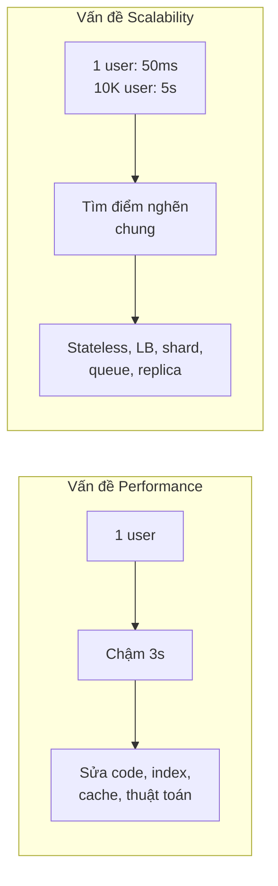
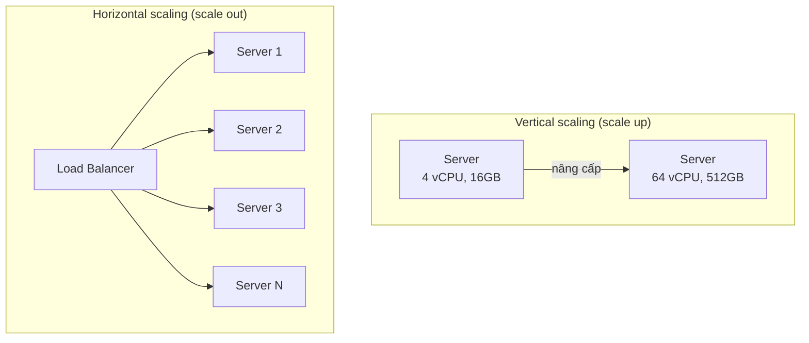
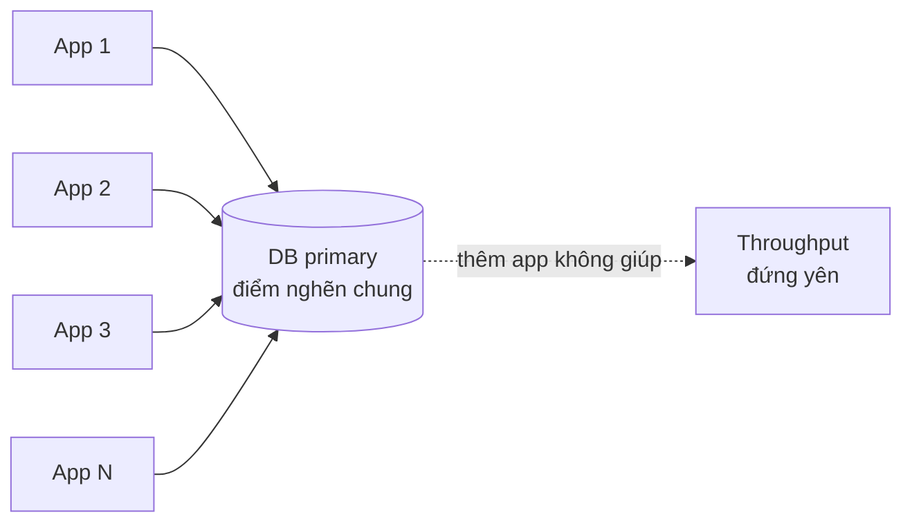
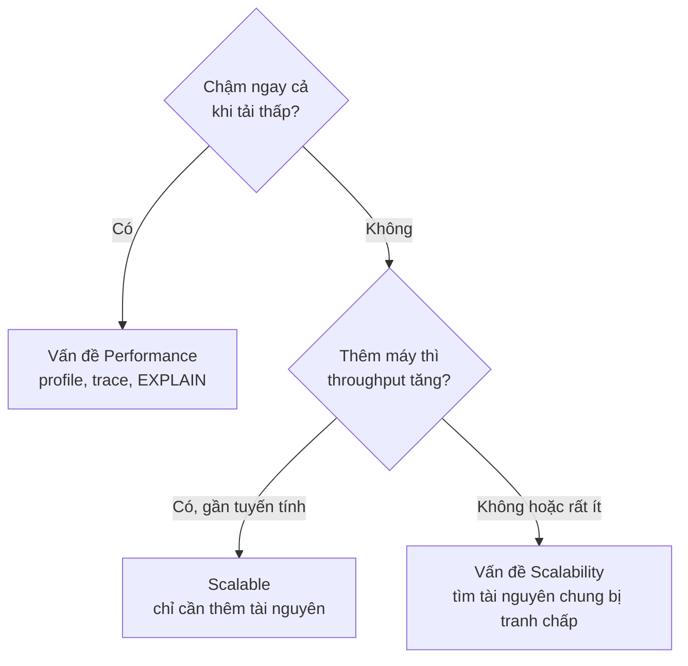

# Performance vs Scalability

**Performance** (hiệu năng) và **Scalability** (khả năng mở rộng) là hai khái niệm hay bị dùng lẫn lộn. Theo system-design-primer: **nếu hệ thống chậm với một người dùng, bạn có vấn đề về performance; nếu hệ thống nhanh với một người dùng nhưng chậm khi tải lớn, bạn có vấn đề về scalability.** Một service được gọi là scalable khi hiệu năng của nó tăng **tương ứng** với tài nguyên được thêm vào.

**Tương tự đơn giản:** Một quán phở. **Performance** là một đầu bếp nấu một tô phở mất bao lâu — 3 phút hay 10 phút. **Scalability** là khi khách đông gấp 10 lần, quán có thể thuê thêm đầu bếp, kê thêm bếp để vẫn phục vụ mỗi khách trong 3 phút hay không — hay bếp chật, nồi nước dùng chỉ có một, thêm người cũng vô ích.

---

:::note[Ghi nhớ nhanh]

- ⭐ **Chậm với 1 user → vấn đề performance; nhanh với 1 user nhưng chậm khi tải lớn → vấn đề scalability.**
- ⭐ **Scalable = thêm tài nguyên thì năng lực tăng gần tương ứng** — và việc thêm tài nguyên không làm hệ thống phức tạp/kém ổn định hơn đáng kể.
- **Vertical scaling (scale up):** máy to hơn — đơn giản nhưng có trần và là SPOF. **Horizontal scaling (scale out):** thêm máy — gần như không trần nhưng phức tạp.
- **Định luật Amdahl:** phần tuần tự (không song song được) giới hạn mức tăng tốc tối đa — thêm máy không giúp được phần đó.
- **Tối ưu performance trước khi scale** — scale một hệ thống chậm chỉ là nhân bản sự chậm và tốn tiền hơn.

:::

---

## Mục lục

- [Vì sao cần phân biệt Performance và Scalability?](#vì-sao-cần-phân-biệt-performance-và-scalability)
- [1. Performance là gì?](#1-performance-là-gì)
- [2. Scalability là gì?](#2-scalability-là-gì)
- [3. Vertical scaling và Horizontal scaling](#3-vertical-scaling-và-horizontal-scaling)
- [4. Vì sao scale không tuyến tính?](#4-vì-sao-scale-không-tuyến-tính)
- [5. Các kỹ thuật cải thiện từng loại](#5-các-kỹ-thuật-cải-thiện-từng-loại)
- [6. Đo lường và chẩn đoán](#6-đo-lường-và-chẩn-đoán)
- [Khi nào dùng?](#khi-nào-dùng)
- [Lỗi thường gặp](#lỗi-thường-gặp)
- [Câu hỏi phỏng vấn](#câu-hỏi-phỏng-vấn)

---

## Vì sao cần phân biệt Performance và Scalability?

**Vấn đề:** Khi hệ thống "chậm", phản xạ thường gặp là "thêm server". Nhưng nếu một API mất 3 giây vì một query thiếu index, thêm 10 server chỉ cho ra 10 server cùng chờ 3 giây — tốn tiền gấp 10 mà user vẫn chờ. Ngược lại, có hệ thống mỗi request rất nhanh (20ms) nhưng tất cả đều ghi vào một bảng bị lock — tối ưu code đến mấy cũng không vượt được giới hạn đó khi tải tăng.

**Giải pháp:** Chẩn đoán đúng loại vấn đề. **Performance** được cải thiện bằng cách làm mỗi đơn vị công việc rẻ hơn (thuật toán, index, cache, bớt I/O). **Scalability** được cải thiện bằng cách thiết kế để công việc **chia ra được** cho nhiều tài nguyên (stateless, partition, bất đồng bộ, loại bỏ điểm tranh chấp chung).

:::tip[Dùng thực tế]

- **Trang admin chậm 5 giây dù chỉ một người dùng:** vấn đề performance — kiểm tra N+1 query, thiếu index, payload quá lớn.
- **Flash sale Shopee/Lazada:** mỗi request nhanh lúc bình thường, nhưng 100× traffic thì tồn kho (inventory) của một sản phẩm thành điểm tranh chấp — vấn đề scalability, giải bằng hàng đợi, đặt chỗ trước, chia nhỏ tồn kho.
- **Mạng xã hội mở rộng toàn cầu:** Facebook, Instagram chuyển từ một database sang sharding theo user — bài toán scalability điển hình.
- **Autoscaling trên Kubernetes/AWS:** chỉ hiệu quả khi service stateless và DB phía sau chịu được thêm kết nối.

:::

---

## 1. Performance là gì?

**Performance** đo **hệ thống làm một việc nhanh/hiệu quả đến mức nào** với một lượng tải xác định. Các chỉ số chính:

| Chỉ số | Ý nghĩa | Ví dụ |
| --- | --- | --- |
| **Latency / response time** | Thời gian xử lý một request | API trả về trong 50ms |
| **Throughput** | Số việc xử lý được trong một đơn vị thời gian | 2.000 request/giây trên một server |
| **Resource utilization** | Mức dùng CPU, RAM, I/O, mạng cho một lượng việc | 30% CPU ở 1.000 QPS |
| **Efficiency** | Công việc trên mỗi đơn vị tài nguyên | Request/giây trên mỗi vCPU |

Performance là thuộc tính **tại một điểm tải**. Một hệ thống có thể performance tốt ở 100 QPS nhưng sụp ở 1.000 QPS.

### Các nguyên nhân performance kém thường gặp

- Thuật toán kém (O(n²) trên tập lớn).
- Query DB thiếu index, N+1 query, `SELECT *` lấy cả cột không dùng.
- Quá nhiều round trip mạng (gọi API tuần tự thay vì song song/batch).
- Không cache dữ liệu đọc lặp lại.
- Serialize/deserialize payload lớn, log quá nhiều.
- Chặn (blocking) event loop trong Node.js bằng việc nặng CPU.

```ts
// SAI: N+1 query — 1 query lấy orders + N query lấy user
const orders = await db.query('SELECT * FROM orders LIMIT 100');
for (const o of orders.rows) {
  o.user = (await db.query('SELECT * FROM users WHERE id = $1', [o.user_id])).rows[0];
}

// ĐÚNG: 1 query JOIN (hoặc 2 query với IN)
const { rows } = await db.query(`
  SELECT o.id, o.total, u.name
  FROM orders o JOIN users u ON u.id = o.user_id
  ORDER BY o.created_at DESC
  LIMIT 100
`);
```

Lỗi N+1 ở trên là vấn đề **performance** — chậm ngay với 1 user. Thêm server không giúp gì.

---

## 2. Scalability là gì?

**Scalability** là khả năng hệ thống **duy trì performance chấp nhận được khi tải tăng**, bằng cách thêm tài nguyên. Tải có thể là:

- **Số request** (QPS tăng).
- **Lượng dữ liệu** (từ GB lên PB).
- **Số người dùng đồng thời** (concurrent connections).
- **Độ phân tán địa lý** (người dùng ở nhiều châu lục).

Một hệ thống scalable lý tưởng có đường **throughput tăng tuyến tính** theo số máy. Thực tế đường cong luôn cong xuống do overhead điều phối và các điểm tranh chấp chung.



### Scalability theo nhiều chiều

| Chiều | Ý nghĩa | Kỹ thuật |
| --- | --- | --- |
| **Load scalability** | Chịu thêm request | LB + scale ngang app server, cache |
| **Data scalability** | Chịu thêm dữ liệu | Sharding, partitioning, archive |
| **Geographic scalability** | Phục vụ người dùng ở xa | CDN, multi-region, edge |
| **Administrative / organizational scalability** | Thêm team vẫn làm việc hiệu quả | Microservices, ranh giới domain rõ |

---

## 3. Vertical scaling và Horizontal scaling



| Tiêu chí | Vertical (scale up) | Horizontal (scale out) |
| --- | --- | --- |
| **Cách làm** | Máy mạnh hơn (CPU, RAM, disk) | Thêm nhiều máy |
| **Độ phức tạp** | Thấp — code không đổi | Cao — cần LB, stateless, phân tán dữ liệu |
| **Giới hạn** | Có trần phần cứng | Gần như không trần |
| **Chi phí** | Tăng phi tuyến (máy cực mạnh rất đắt) | Tăng gần tuyến tính, dùng máy phổ thông |
| **Chịu lỗi** | Một máy = SPOF | Một máy chết, các máy khác gánh |
| **Downtime khi nâng cấp** | Thường phải restart | Rolling, không downtime |
| **Phù hợp** | DB quan hệ giai đoạn đầu, workload khó chia | App server stateless, cache, NoSQL |

:::info[Thực tế thường kết hợp cả hai]

Database primary thường được **scale up** đến mức hợp lý (một máy Postgres mạnh có thể gánh rất nhiều), đồng thời app server được **scale out**. Chỉ khi DB chạm trần mới tính tới read replica rồi sharding.

:::

### Điều kiện để scale ngang được

1. **App server stateless** — session ở Redis/JWT, file ở object storage.
2. **Không có tài nguyên chung bị khoá** — tránh lock toàn cục, counter đơn lẻ.
3. **Dữ liệu chia được** — có partition key hợp lý (user_id, tenant_id).
4. **Có cơ chế phân phối tải** — load balancer, consistent hashing.

```yaml
# Ví dụ Kubernetes HPA: tự thêm pod khi CPU trung bình vượt 70%
apiVersion: autoscaling/v2
kind: HorizontalPodAutoscaler
metadata:
  name: api
spec:
  scaleTargetRef:
    apiVersion: apps/v1
    kind: Deployment
    name: api
  minReplicas: 3
  maxReplicas: 30
  metrics:
    - type: Resource
      resource:
        name: cpu
        target:
          type: Utilization
          averageUtilization: 70
```

Autoscaling chỉ có ý nghĩa nếu service thật sự stateless và phần phía sau (DB, cache) không thành điểm nghẽn.

---

## 4. Vì sao scale không tuyến tính?

### 4.1. Định luật Amdahl (Amdahl's Law)

Nếu một phần **p** của công việc song song hoá được và phần **1 − p** phải chạy tuần tự, thì với **N** bộ xử lý, mức tăng tốc tối đa là:

```
Speedup(N) = 1 / ((1 - p) + p / N)
```

| Phần song song (p) | N = 2 | N = 8 | N = 64 | N → ∞ |
| --- | --- | --- | --- | --- |
| 50% | 1.33× | 1.78× | 1.97× | 2× |
| 90% | 1.82× | 4.71× | 8.77× | 10× |
| 95% | 1.90× | 5.93× | 15.4× | 20× |
| 99% | 1.98× | 7.48× | 39.3× | 100× |

**Bài học:** chỉ 5% công việc tuần tự đã giới hạn tăng tốc tối đa ở 20×, dù có bao nhiêu máy. Trong hệ thống web, "phần tuần tự" là những chỗ như: ghi vào một DB primary duy nhất, một lock toàn cục, một counter chung.

### 4.2. Chi phí điều phối (coordination overhead)

Thêm máy kéo theo: đồng bộ dữ liệu giữa node, network round trip, consensus, rebalancing. **Universal Scalability Law** (Neil Gunther) mở rộng Amdahl bằng cách thêm hệ số "coherency" — mô tả việc throughput có thể **giảm** khi thêm quá nhiều node do chi phí giữ các node nhất quán với nhau.

### 4.3. Các điểm nghẽn chung điển hình

| Điểm nghẽn | Biểu hiện | Cách gỡ |
| --- | --- | --- |
| DB primary duy nhất | CPU DB 100%, lock wait tăng | Cache, replica cho đọc, sharding cho ghi |
| Hot key / hot partition | Một shard quá tải trong khi shard khác rảnh | Chia nhỏ key, thêm salt, cache cục bộ |
| Connection pool | "too many connections" khi thêm app server | PgBouncer, giới hạn pool mỗi instance |
| Lock toàn cục | Throughput không tăng khi thêm máy | Optimistic locking, partition lock |
| Service phụ thuộc chậm | Mọi request chờ một API bên thứ ba | Timeout, circuit breaker, bất đồng bộ |



---

## 5. Các kỹ thuật cải thiện từng loại

| Mục tiêu | Kỹ thuật | Ghi chú |
| --- | --- | --- |
| **Performance** | Index, tối ưu query, tránh N+1 | Đo bằng `EXPLAIN ANALYZE` |
| **Performance** | Cache (in-memory, Redis, HTTP cache) | Giảm I/O lặp lại |
| **Performance** | Thuật toán / cấu trúc dữ liệu tốt hơn | O(n log n) thay O(n²) |
| **Performance** | Giảm round trip: batch, gọi song song | `Promise.all` thay vì await tuần tự |
| **Performance** | Nén, giảm payload, pagination | Ít byte qua mạng |
| **Scalability** | Stateless app + load balancer | Điều kiện tiên quyết để scale ngang |
| **Scalability** | Read replica | Scale đọc |
| **Scalability** | Sharding / partitioning | Scale ghi và dữ liệu |
| **Scalability** | Message queue, xử lý bất đồng bộ | San phẳng đỉnh tải |
| **Scalability** | CDN, multi-region | Scale theo địa lý |
| **Cả hai** | Denormalization, precompute | Đổi storage lấy tốc độ đọc |

Ví dụ giảm round trip — một cải thiện performance thuần tuý:

```ts
// SAI: 3 lời gọi tuần tự — tổng latency = a + b + c
const user = await getUser(id);
const orders = await getOrders(id);
const recs = await getRecommendations(id);

// ĐÚNG: gọi song song — tổng latency ≈ max(a, b, c)
const [user2, orders2, recs2] = await Promise.all([
  getUser(id),
  getOrders(id),
  getRecommendations(id),
]);
```

---

## 6. Đo lường và chẩn đoán

Cách phân biệt nhanh một vấn đề là performance hay scalability:



Công cụ:

- **Load test:** k6, JMeter, Locust, wrk — tăng dần tải, vẽ đường latency/throughput theo số user.
- **Profiling:** Node `--prof`, clinic.js, async-profiler (JVM), pprof (Go).
- **Distributed tracing:** OpenTelemetry, Jaeger — xem thời gian ở từng service.
- **Metrics:** CPU, RAM, I/O, connection pool, lock wait, queue length.

```js
// k6: tăng dần từ 0 lên 500 virtual user để quan sát điểm gãy
import http from 'k6/http';

export const options = {
  stages: [
    { duration: '2m', target: 100 },
    { duration: '5m', target: 500 },
    { duration: '2m', target: 0 },
  ],
  thresholds: { http_req_duration: ['p(99)<300'] },
};

export default function () {
  http.get('https://api.example.com/products/42');
}
```

Dấu hiệu scalability kém trong kết quả load test: throughput tăng tới một mức rồi **đi ngang**, trong khi latency **tăng vọt** — hệ thống đã bão hoà ở một tài nguyên nào đó.

---

## Khi nào dùng?

- **Ưu tiên tối ưu Performance khi:**
  - Chậm ngay cả khi tải thấp
  - Chi phí hạ tầng cao bất thường so với lượng traffic
  - Chưa đo đạc, chưa profile — luôn tối ưu trước khi scale
- **Ưu tiên thiết kế Scalability khi:**
  - Traffic/dữ liệu tăng trưởng nhanh, có dự báo rõ
  - Throughput đi ngang khi thêm tài nguyên
  - Cần chịu đỉnh tải theo sự kiện (sale, livestream)
- **Chọn vertical hay horizontal:**
  - Vertical: giai đoạn đầu, workload khó chia (DB quan hệ), muốn đơn giản
  - Horizontal: service stateless, cần chịu lỗi, cần scale gần như không giới hạn

---

## Lỗi thường gặp

### Lỗi 1: Thêm server để chữa query chậm

Query thiếu index mất 2 giây — thêm app server không giúp, thậm chí làm DB quá tải hơn vì nhiều kết nối hơn. Sửa query trước.

### Lỗi 2: Scale ngang app server mà giữ session trong bộ nhớ

User đăng nhập ở server 1, request tiếp theo vào server 2 thì mất session. Phải dùng sticky session (tạm thời) hoặc tốt hơn là đưa session ra Redis.

### Lỗi 3: Quên database là điểm nghẽn chung

Tăng từ 3 lên 30 app server, mỗi server pool 20 kết nối → 600 kết nối vào Postgres, DB sập. Cần connection pooler (PgBouncer) và tính toán tổng kết nối.

### Lỗi 4: Nhầm "nhanh" với "scale được"

Benchmark một request 10ms trên máy dev rồi kết luận hệ thống chịu được 1 triệu user. Phải load test với tải đồng thời thực tế.

### Lỗi 5: Tối ưu sớm cho quy mô chưa tồn tại

Sharding DB cho sản phẩm 1.000 user. Phức tạp hoá vận hành mà không có lợi ích. Scale khi có số liệu.

---

## Câu hỏi phỏng vấn

Những câu thường gặp về chủ đề này. Tự trả lời trước, rồi bấm **Xem đáp án** để đối chiếu.

**1. Phân biệt performance và scalability.**

<details className="qa">
<summary>Xem đáp án</summary>

- **Performance:** hệ thống xử lý một lượng việc nhanh/hiệu quả thế nào. Chậm với 1 user → vấn đề performance.
- **Scalability:** khả năng giữ performance khi tải tăng bằng cách thêm tài nguyên. Nhanh với 1 user nhưng chậm khi tải lớn → vấn đề scalability.

Hệ thống scalable khi thêm tài nguyên thì năng lực tăng gần tương ứng.

</details>

**2. Vertical scaling và horizontal scaling: ưu nhược điểm?**

<details className="qa">
<summary>Xem đáp án</summary>

- **Vertical:** nâng cấp một máy. Đơn giản, không đổi code; nhưng có trần phần cứng, giá tăng phi tuyến, là SPOF, thường cần downtime.
- **Horizontal:** thêm máy. Gần như không trần, chịu lỗi tốt, dùng máy phổ thông; nhưng cần LB, stateless, xử lý dữ liệu phân tán, phức tạp hơn.

</details>

**3. Định luật Amdahl nói gì và áp dụng thế nào vào hệ thống web?**

<details className="qa">
<summary>Xem đáp án</summary>

Tăng tốc tối đa bị giới hạn bởi phần tuần tự: `Speedup = 1 / ((1 - p) + p/N)`. Với 5% tuần tự, tối đa chỉ 20× dù có vô số máy. Trong web, phần tuần tự là các điểm tranh chấp chung: DB primary duy nhất, lock toàn cục, counter chung, một service phụ thuộc. Muốn scale phải loại bỏ/giảm những điểm đó (sharding, cache, bất đồng bộ).

</details>

**4. Thêm app server nhưng throughput không tăng. Bạn điều tra thế nào?**

<details className="qa">
<summary>Xem đáp án</summary>

Tìm tài nguyên chung bị bão hoà: CPU/IO/lock wait của DB, số kết nối DB, hit rate cache, hot key, service bên ngoài chậm, bandwidth mạng, LB. Dùng metrics + tracing để thấy thời gian bị tiêu ở đâu. Giải pháp tuỳ điểm nghẽn: cache, read replica, connection pooler, sharding, chuyển sang bất đồng bộ.

</details>

**5. Vì sao nên tối ưu performance trước khi scale?**

<details className="qa">
<summary>Xem đáp án</summary>

Scale một hệ thống kém hiệu quả là nhân bản sự lãng phí: chi phí tăng tuyến tính theo số máy mà latency của từng request không cải thiện. Một index đúng có thể giảm 100× thời gian query — rẻ hơn rất nhiều so với thêm 100 máy. Ngoài ra, tải thừa do code kém có thể làm điểm nghẽn chung (DB) quá tải sớm hơn.

</details>
