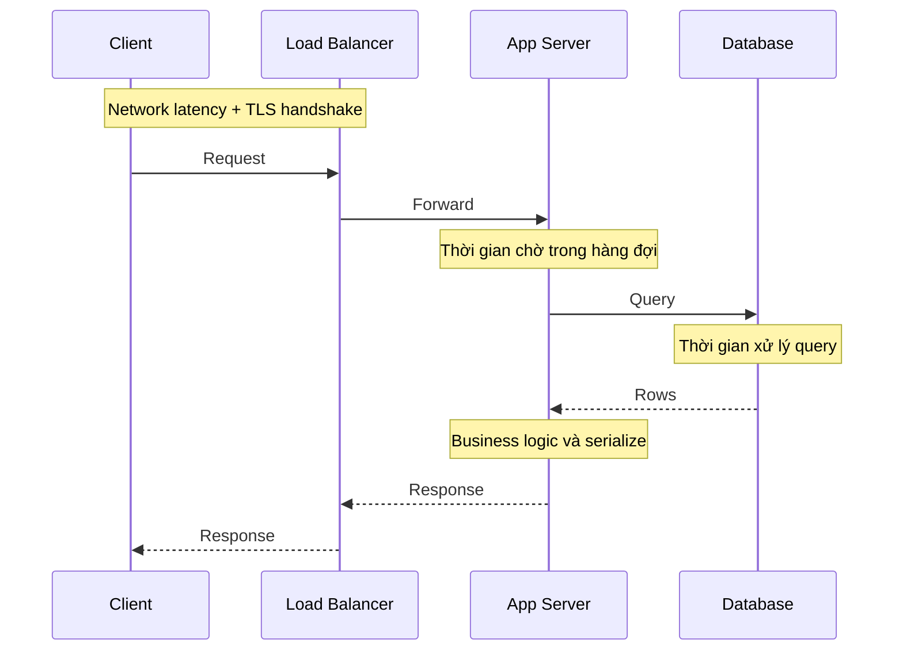
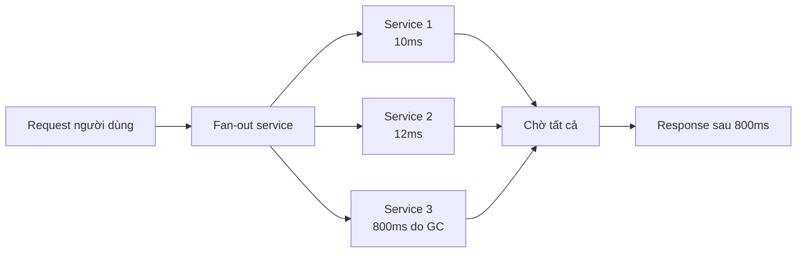
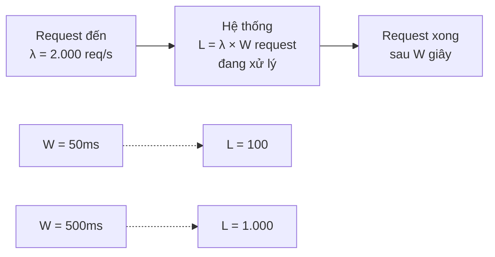
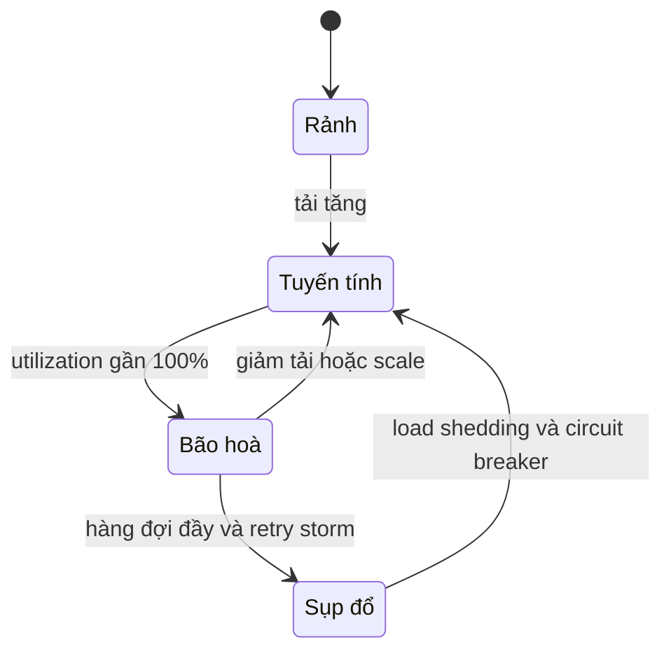

# Latency vs Throughput

**Latency** (độ trễ) là **thời gian để hoàn thành một thao tác** — từ lúc gửi request đến lúc nhận đủ response. **Throughput** (thông lượng) là **số thao tác hoàn thành trong một đơn vị thời gian** — request/giây, MB/giây, giao dịch/giây. Mục tiêu chung trong thiết kế: **tối đa hoá throughput trong khi giữ latency ở mức chấp nhận được**.

**Tương tự đơn giản:** Một đường cao tốc. **Latency** là thời gian một chiếc xe đi từ Hà Nội tới Hải Phòng (khoảng 1,5 giờ). **Throughput** là số xe đi qua trạm thu phí mỗi giờ. Mở thêm làn đường làm tăng throughput, nhưng không làm từng chiếc xe chạy nhanh hơn. Ngược lại, khi đường quá đông, xe chen nhau → cả latency tăng vọt lẫn throughput giảm (kẹt xe).

---

:::note[Ghi nhớ nhanh]

- ⭐ **Latency = thời gian cho MỘT việc; Throughput = số việc mỗi giây** — hai thước đo khác nhau, cải thiện cái này không tự động cải thiện cái kia.
- ⭐ **Đo latency bằng percentile (p50, p95, p99), không dùng trung bình** — trung bình che giấu những request chậm mà người dùng thật sự gặp.
- **Little's Law:** `L = λ × W` — số request đang xử lý đồng thời = throughput × latency trung bình.
- **Khi utilization tiến gần 100%, latency tăng vọt** do hàng đợi — đừng chạy hệ thống sát giới hạn.
- **Batching tăng throughput nhưng thường tăng latency**; song song hoá và cache có thể cải thiện cả hai.

:::

---

## Mục lục

- [Vì sao cần phân biệt Latency và Throughput?](#vì-sao-cần-phân-biệt-latency-và-throughput)
- [1. Latency là gì?](#1-latency-là-gì)
- [2. Throughput là gì?](#2-throughput-là-gì)
- [3. Percentile p50, p95, p99](#3-percentile-p50-p95-p99)
- [4. Little's Law](#4-littles-law)
- [5. Quan hệ giữa latency, throughput và utilization](#5-quan-hệ-giữa-latency-throughput-và-utilization)
- [6. Kỹ thuật cải thiện và các đánh đổi](#6-kỹ-thuật-cải-thiện-và-các-đánh-đổi)
- [Khi nào dùng?](#khi-nào-dùng)
- [Lỗi thường gặp](#lỗi-thường-gặp)
- [Câu hỏi phỏng vấn](#câu-hỏi-phỏng-vấn)

---

## Vì sao cần phân biệt Latency và Throughput?

**Vấn đề:** Một đội báo cáo "hệ thống chịu được 10.000 request/giây" — nhưng người dùng vẫn phàn nàn app chậm. Hoá ra 10.000 QPS là throughput khi dồn batch, còn mỗi request phải chờ 2 giây. Ngược lại, một API trả về trong 5ms nhưng chỉ xử lý được 50 request/giây — đẹp trên demo nhưng sụp khi lên production. Lẫn lộn hai khái niệm dẫn đến tối ưu sai chỗ.

**Giải pháp:** Đặt mục tiêu riêng cho từng loại, ví dụ **SLO: p99 dưới 200ms ở 5.000 QPS**. Đo latency bằng percentile, đo throughput ở mức tải thực tế, và hiểu quan hệ giữa chúng (Little's Law, hiệu ứng hàng đợi) để chọn kỹ thuật đúng.

:::tip[Dùng thực tế]

- **API cho người dùng (checkout, search):** ưu tiên latency thấp — Amazon từng chia sẻ rằng mỗi 100ms trễ thêm ảnh hưởng đáng kể tới doanh thu; Google cũng công bố tương tự với tốc độ trang tìm kiếm.
- **Pipeline dữ liệu / ETL / batch job:** ưu tiên throughput — xử lý hàng TB mỗi đêm, từng record chậm vài giây không sao.
- **Kafka:** thiết kế cho throughput rất cao nhờ batching và ghi tuần tự, có cấu hình `linger.ms` để đánh đổi với latency.
- **Game online, trading:** latency là tất cả — vài ms chênh lệch quyết định trải nghiệm hay lợi nhuận.

:::

---

## 1. Latency là gì?

**Latency** là tổng thời gian một request "sống" trong hệ thống. Nó gồm nhiều thành phần cộng lại:



| Thành phần | Mô tả | Cỡ độ lớn |
| --- | --- | --- |
| **Network / propagation** | Thời gian tín hiệu đi qua dây | Trong DC ~0.5ms RTT; xuyên lục địa ~100–150ms |
| **Transmission** | Đẩy hết byte lên đường truyền | Phụ thuộc bandwidth và kích thước payload |
| **Queueing** | Chờ đến lượt được xử lý | 0 khi rảnh, rất lớn khi quá tải |
| **Processing** | CPU xử lý logic, DB chạy query | Vài µs đến vài giây |

Phân biệt thêm:

- **Latency** đôi khi được dùng theo nghĩa hẹp: thời gian **chờ** trước khi được phục vụ.
- **Response time** = thời gian chờ + thời gian xử lý, là cái người dùng cảm nhận.

Trong thực tế (và trong bài này) hai từ thường dùng thay nhau với nghĩa response time.

---

## 2. Throughput là gì?

**Throughput** đo **năng suất**: hệ thống hoàn thành được bao nhiêu việc trong một đơn vị thời gian.

| Đơn vị | Dùng cho |
| --- | --- |
| **QPS / RPS** (queries/requests per second) | API, web server, database |
| **TPS** (transactions per second) | Hệ thống thanh toán, DB transaction |
| **MB/s, Gbps** | Network, disk, streaming |
| **Messages/s** | Message queue (Kafka, RabbitMQ) |

**Bandwidth** (băng thông) là **throughput tối đa lý thuyết** của một đường truyền (vd đường 1 Gbps), còn throughput là lượng thực tế đạt được (thường thấp hơn do overhead giao thức, mất gói, chờ ACK).

Ví dụ phân biệt:

| Hệ thống | Latency | Throughput |
| --- | --- | --- |
| Gửi ổ cứng 100 TB bằng xe tải (AWS Snowball) | Vài ngày | Cực cao (100 TB trong vài ngày) |
| Ping server cùng datacenter | ~0.5ms | Thấp (mỗi gói vài chục byte) |
| Kafka với batching lớn | Vài ms đến vài chục ms | Hàng trăm nghìn message/s mỗi broker |

---

## 3. Percentile p50, p95, p99

Latency không phải một con số mà là một **phân phối (distribution)**. Phân phối này thường **lệch phải (long tail)**: đa số request nhanh, một ít rất chậm (GC pause, cache miss, retry, máy ồn ào).

### 3.1. Định nghĩa

- **p50 (median):** 50% request nhanh hơn giá trị này. Trải nghiệm "điển hình".
- **p95:** 95% request nhanh hơn; 5% chậm hơn.
- **p99:** 99% request nhanh hơn; 1 trong 100 request chậm hơn.
- **p99.9:** 1 trong 1.000 request chậm hơn — quan trọng với hệ thống quy mô lớn.

### 3.2. Vì sao không dùng trung bình (mean)?

Ví dụ 10 request với latency (ms): `10, 12, 11, 13, 10, 12, 11, 10, 12, 2000`.

- **Trung bình** = 210.1ms → trông như mọi request đều chậm, sai.
- **p50** ≈ 11ms → phần lớn request rất nhanh.
- **p99** ≈ 2000ms → có request cực chậm cần điều tra.

Trung bình bị một outlier kéo lệch và không mô tả được trải nghiệm của bất kỳ ai.

### 3.3. Tail latency amplification

Khi một request của người dùng **gọi song song tới nhiều service** (fan-out) và phải chờ **tất cả** trả về, latency của nó là latency của service **chậm nhất**. Xác suất gặp ít nhất một request chậm tăng nhanh:

```
P(ít nhất 1 trong N lời gọi chậm hơn p99) = 1 - 0.99^N
N = 1   -> 1%
N = 10  -> ~9.6%
N = 100 -> ~63%
```

Đây là lý do Google (bài báo "The Tail at Scale", Jeff Dean và Luiz André Barroso, 2013) nhấn mạnh tối ưu **p99/p99.9**, và dùng các kỹ thuật như **hedged request** (gửi request dự phòng tới replica khác nếu request đầu chậm).



### 3.4. Tính percentile trong code

```ts
// Tính percentile đơn giản từ mảng latency (ms)
export function percentile(samples: readonly number[], p: number): number {
  if (samples.length === 0) throw new Error('Không có mẫu');
  const sorted = [...samples].sort((a, b) => a - b);
  const rank = Math.ceil((p / 100) * sorted.length) - 1;
  return sorted[Math.max(0, Math.min(rank, sorted.length - 1))];
}

const latencies = [10, 12, 11, 13, 10, 12, 11, 10, 12, 2000];
percentile(latencies, 50); // 11
percentile(latencies, 99); // 2000
```

Trong production, không lưu toàn bộ mẫu mà dùng **histogram** (Prometheus histogram, HdrHistogram, t-digest) để ước lượng percentile với bộ nhớ nhỏ:

```promql
# p99 latency theo route trong 5 phút gần nhất (Prometheus)
histogram_quantile(
  0.99,
  sum by (le, route) (rate(http_request_duration_seconds_bucket[5m]))
)
```

:::warning[Không lấy trung bình của percentile]

Không thể lấy trung bình p99 của 10 server để ra p99 toàn hệ thống. Phải gộp histogram (bucket) rồi mới tính percentile.

:::

---

## 4. Little's Law

**Little's Law** (John Little, 1961) là định lý nền tảng của lý thuyết hàng đợi, áp dụng cho mọi hệ thống ổn định (lượng vào ≈ lượng ra):

```
L = λ × W

L = số request trung bình đang nằm trong hệ thống (concurrency)
λ = throughput / tốc độ đến trung bình (request/giây)
W = thời gian trung bình một request ở trong hệ thống (latency, giây)
```

### 4.1. Ví dụ áp dụng

**Ví dụ 1 — tính số worker/thread cần thiết:**

Service cần xử lý **2.000 QPS**, mỗi request mất trung bình **50ms** (0.05s).

```
L = 2.000 × 0.05 = 100 request đồng thời
```

→ Cần ít nhất ~100 thread/worker/connection đồng thời (cộng thêm dư phòng). Nếu mỗi instance có pool 20 thread → cần ít nhất 5 instance.

**Ví dụ 2 — tính connection pool DB:**

App gửi **500 query/giây** tới DB, mỗi query mất **20ms**.

```
L = 500 × 0.02 = 10 kết nối bận trung bình
```

→ Pool 20–30 kết nối là hợp lý; pool 500 kết nối là lãng phí và có thể làm DB quá tải.

**Ví dụ 3 — latency tăng thì sao?**

Giữ nguyên 2.000 QPS, nhưng DB chậm đi và latency tăng lên 500ms:

```
L = 2.000 × 0.5 = 1.000 request đồng thời
```

→ Thread pool 100 sẽ cạn ngay, request xếp hàng, latency tăng tiếp → **vòng xoáy sụp đổ (cascading failure)**. Đây là lý do cần **timeout** và **circuit breaker**.



---

## 5. Quan hệ giữa latency, throughput và utilization

Khi tải tăng, lúc đầu throughput tăng tuyến tính và latency gần như không đổi. Khi gần tới **năng lực tối đa (capacity)**, hàng đợi hình thành và latency tăng **phi tuyến**. Quá điểm đó, throughput có thể còn **giảm** (thrashing, retry storm, context switch).

Theo mô hình hàng đợi đơn giản M/M/1, thời gian ở trong hệ thống tỉ lệ với `1 / (1 - ρ)`, với ρ là utilization:

| Utilization (ρ) | Hệ số latency so với lúc rảnh |
| --- | --- |
| 50% | 2× |
| 70% | ~3.3× |
| 80% | 5× |
| 90% | 10× |
| 95% | 20× |
| 99% | 100× |

**Bài học:** chạy server ở 90%+ CPU thường xuyên là nguy hiểm — một đợt tăng tải nhỏ làm latency bùng nổ. Đây là lý do autoscaling thường đặt ngưỡng 60–70%.



- **Tuyến tính:** throughput tăng theo tải, latency ổn định.
- **Bão hoà:** throughput đi ngang, latency tăng vọt.
- **Sụp đổ:** throughput giảm, latency rất cao hoặc timeout hàng loạt.

---

## 6. Kỹ thuật cải thiện và các đánh đổi

| Kỹ thuật | Latency | Throughput | Ghi chú |
| --- | --- | --- | --- |
| **Cache** | Giảm mạnh | Tăng | Đổi lại dữ liệu có thể cũ |
| **Song song hoá (parallelism)** | Giảm (khi fan-out) | Tăng | Tăng tail latency do fan-out |
| **Batching** | Tăng | Tăng mạnh | Kafka `linger.ms`, bulk insert |
| **Scale ngang** | Không đổi (khi chưa bão hoà) | Tăng | Không làm một request nhanh hơn |
| **Connection pooling / keep-alive** | Giảm (bỏ handshake) | Tăng | |
| **Nén (compression)** | Giảm khi mạng chậm | Tăng (ít byte) | Tốn CPU |
| **CDN / edge** | Giảm mạnh cho user ở xa | Tăng | Chủ yếu cho nội dung tĩnh/cacheable |
| **Xử lý bất đồng bộ (queue)** | Giảm latency phản hồi | Tăng, san phẳng đỉnh | Kết quả có sau (eventual) |
| **Load shedding / rate limit** | Giữ latency cho request được nhận | Giới hạn | Từ chối một phần request |

### Ví dụ batching: đánh đổi latency lấy throughput

```ts
// Gom insert thành batch: mỗi batch tối đa 500 bản ghi hoặc chờ tối đa 50ms
const MAX_BATCH = 500;
const MAX_WAIT_MS = 50;

type Row = { userId: number; event: string };

let buffer: Row[] = [];
let timer: NodeJS.Timeout | null = null;

export function enqueue(row: Row): void {
  buffer = [...buffer, row];
  if (buffer.length >= MAX_BATCH) {
    void flush();
  } else if (!timer) {
    timer = setTimeout(() => void flush(), MAX_WAIT_MS);
  }
}

async function flush(): Promise<void> {
  if (timer) clearTimeout(timer);
  timer = null;
  const batch = buffer;
  buffer = [];
  if (batch.length === 0) return;
  try {
    await bulkInsert(batch); // 1 round trip cho tối đa 500 dòng
  } catch (err) {
    console.error('Bulk insert thất bại', err);
    throw err;
  }
}

declare function bulkInsert(rows: Row[]): Promise<void>;
```

Mỗi sự kiện có thể chờ thêm tới 50ms (latency tăng), nhưng số round trip tới DB giảm hàng trăm lần (throughput tăng mạnh).

---

## Khi nào dùng?

- **Ưu tiên latency khi:**
  - Request do người dùng chờ trực tiếp: trang web, API mobile, checkout, search
  - Hệ thống realtime: game, chat, trading, video call
  - Đặt SLO theo p95/p99
- **Ưu tiên throughput khi:**
  - Batch job, ETL, data pipeline, xử lý log
  - Ingestion lượng lớn (sự kiện analytics, IoT)
  - Background worker không có người chờ
- **Best practice:**
  - Đặt SLO dạng "p99 dưới X ms tại Y QPS" — gắn cả hai đại lượng
  - Giữ utilization ở mức có dư phòng (thường 50–70%)
  - Luôn có timeout cho mọi lời gọi ra ngoài

---

## Lỗi thường gặp

### Lỗi 1: Báo cáo latency bằng trung bình

"Latency trung bình 80ms" trong khi p99 là 3 giây — 1% người dùng (có thể là hàng chục nghìn người) có trải nghiệm tệ. Luôn theo dõi p50, p95, p99.

### Lỗi 2: Nghĩ thêm server sẽ giảm latency

Khi hệ thống chưa bão hoà, thêm server tăng throughput nhưng **không** làm từng request nhanh hơn. Latency cao do query chậm phải sửa query.

### Lỗi 3: Benchmark throughput mà bỏ qua latency

Đẩy tải tới khi throughput max rồi công bố con số đó — nhưng ở mức đó p99 đã là 5 giây. Năng lực thực tế là throughput tối đa **mà vẫn giữ được SLO latency**.

### Lỗi 4: Không có timeout

Một service phụ thuộc chậm → theo Little's Law, số request treo tăng → cạn thread/connection → service của bạn cũng chết. Đặt timeout, retry có giới hạn (kèm backoff), circuit breaker.

### Lỗi 5: Lấy trung bình của p99

Trung bình p99 của các instance không phải p99 của toàn hệ thống. Gộp histogram rồi mới tính.

---

## Câu hỏi phỏng vấn

Những câu thường gặp về chủ đề này. Tự trả lời trước, rồi bấm **Xem đáp án** để đối chiếu.

**1. Latency và throughput khác nhau thế nào? Cho ví dụ cải thiện cái này mà không cải thiện cái kia.**

<details className="qa">
<summary>Xem đáp án</summary>

- **Latency:** thời gian hoàn thành một thao tác.
- **Throughput:** số thao tác hoàn thành mỗi đơn vị thời gian.

Ví dụ: **batching** tăng throughput nhưng tăng latency (mỗi item chờ đủ batch). **Scale ngang** tăng throughput nhưng không làm một request đơn lẻ nhanh hơn. Gửi dữ liệu bằng xe tải chở ổ cứng: throughput cực cao, latency vài ngày.

</details>

**2. Vì sao dùng p99 thay vì latency trung bình?**

<details className="qa">
<summary>Xem đáp án</summary>

Phân phối latency lệch phải; trung bình bị outlier kéo lệch và không phản ánh trải nghiệm của ai cả. p50 cho biết trải nghiệm điển hình, p99 cho biết trải nghiệm của nhóm tệ nhất — thường là user có nhiều dữ liệu nhất (quan trọng nhất). Với fan-out, tail latency bị khuếch đại: gọi 100 service thì ~63% request người dùng sẽ gặp ít nhất một lời gọi chậm hơn p99.

</details>

**3. Phát biểu Little's Law và áp dụng một ví dụ.**

<details className="qa">
<summary>Xem đáp án</summary>

`L = λ × W`: số request đồng thời trong hệ thống = throughput × latency trung bình. Ví dụ: 1.000 QPS, latency 200ms → 200 request đồng thời → cần pool ít nhất ~200 worker/connection. Nếu latency tăng lên 2s, cần 2.000 → nếu pool không đủ, request xếp hàng và latency tiếp tục tăng (cascading failure).

</details>

**4. Vì sao latency tăng vọt khi utilization tiến gần 100%?**

<details className="qa">
<summary>Xem đáp án</summary>

Request đến ngẫu nhiên, không đều. Khi utilization cao, xác suất request mới phải chờ trong hàng đợi tăng nhanh; theo mô hình M/M/1 thời gian trong hệ thống tỉ lệ `1/(1-ρ)`: 50% → 2×, 90% → 10×, 99% → 100×. Do đó nên giữ dư phòng và autoscale ở ngưỡng 60–70%.

</details>

**5. Làm thế nào giảm tail latency trong hệ thống fan-out?**

<details className="qa">
<summary>Xem đáp án</summary>

- **Hedged request:** sau một ngưỡng (vd p95), gửi request dự phòng tới replica khác, dùng kết quả về trước.
- Giảm số lời gọi fan-out, cache kết quả.
- Timeout và trả kết quả một phần (graceful degradation).
- Giảm nguyên nhân gốc: GC pause, noisy neighbor, hàng đợi cục bộ.

</details>
