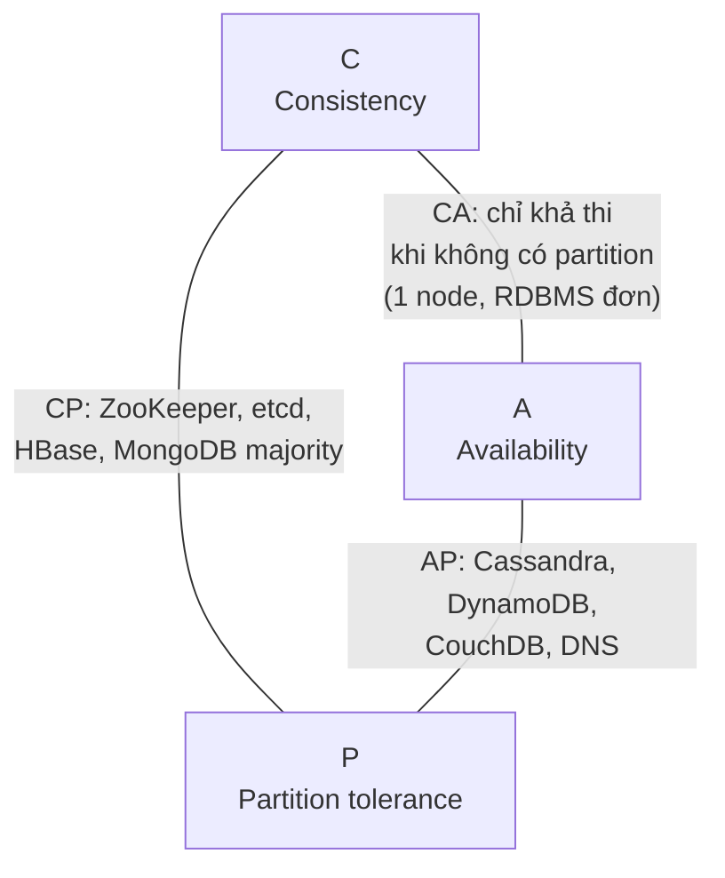
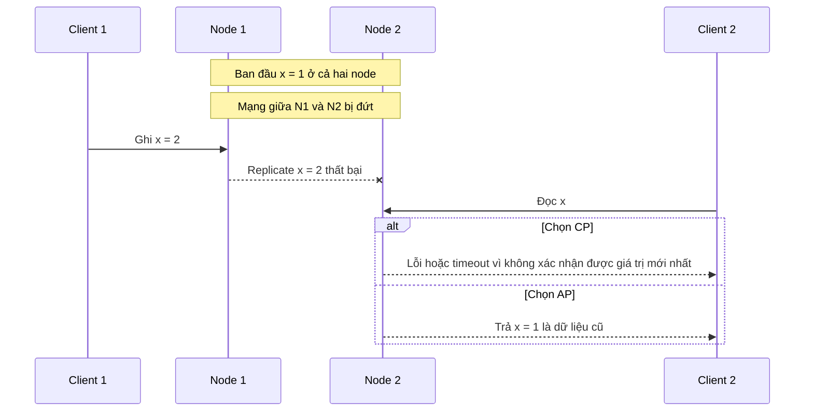
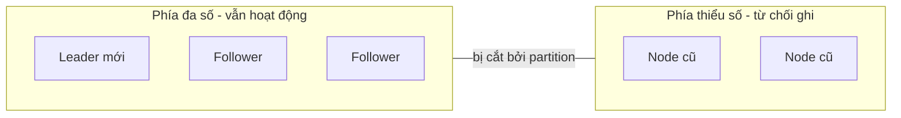
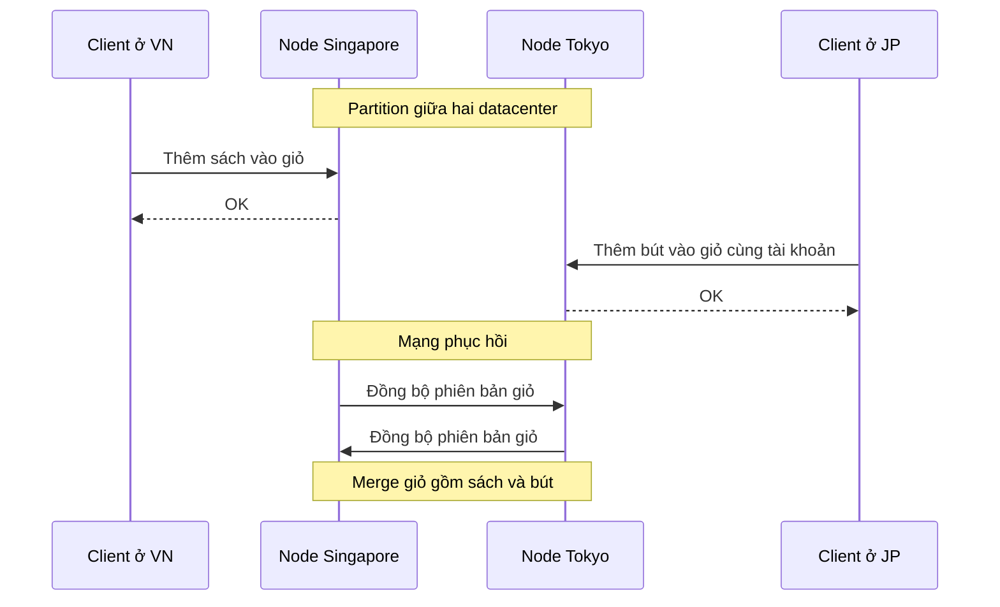
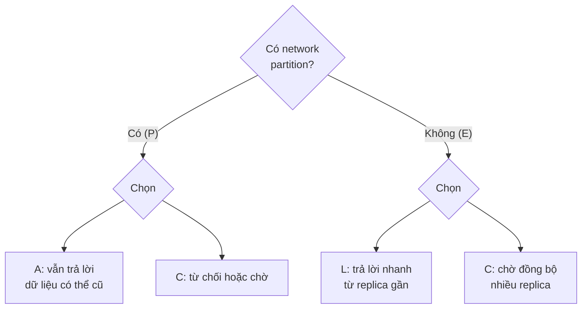

# Availability vs Consistency & CAP Theorem

Trong một hệ thống phân tán (dữ liệu nằm trên nhiều máy), khi mạng giữa các máy bị đứt, bạn buộc phải chọn: **trả lời ngay bằng dữ liệu có thể đã cũ** (ưu tiên **Availability** — tính sẵn sàng) hay **từ chối/chờ cho đến khi chắc chắn dữ liệu mới nhất** (ưu tiên **Consistency** — tính nhất quán). **CAP Theorem** phát biểu chính xác sự đánh đổi này.

**Tương tự đơn giản:** Hai chi nhánh ngân hàng dùng chung sổ tài khoản, liên lạc qua điện thoại. Một hôm đường dây điện thoại đứt. Khách đến rút tiền ở chi nhánh A. Chi nhánh A có hai lựa chọn: **cho rút luôn** dựa trên sổ của mình (sẵn sàng, nhưng có thể khách vừa rút hết ở chi nhánh B → sai lệch), hoặc **"xin lỗi, hệ thống đang bảo trì"** cho đến khi gọi được cho B (nhất quán, nhưng khách không được phục vụ). Không có lựa chọn thứ ba khi dây đã đứt.

---

:::note[Ghi nhớ nhanh]

- ⭐ **CAP: khi có network partition (P), hệ thống phân tán phải chọn giữa Consistency (C) và Availability (A).** Partition là thực tế không tránh được, nên lựa chọn thật sự là **CP hay AP**.
- ⭐ **PACELC mở rộng CAP:** khi có Partition chọn A hoặc C; Else (bình thường) chọn giữa Latency và Consistency.
- **CP** (vd ZooKeeper, etcd, HBase): thà trả lỗi/timeout còn hơn trả dữ liệu sai — dùng cho tiền, khoá phân tán, cấu hình.
- **AP** (vd Cassandra, DynamoDB mặc định, CouchDB, DNS): luôn trả lời, chấp nhận dữ liệu tạm thời lệch — dùng cho feed, giỏ hàng, số like.
- **"C" trong CAP là linearizability**, khác hẳn "C" trong ACID (ràng buộc toàn vẹn dữ liệu).

:::

---

## Mục lục

- [Vì sao cần hiểu Availability và Consistency?](#vì-sao-cần-hiểu-availability-và-consistency)
- [1. Availability và Consistency là gì?](#1-availability-và-consistency-là-gì)
- [2. CAP Theorem](#2-cap-theorem)
- [3. Network partition diễn ra thế nào?](#3-network-partition-diễn-ra-thế-nào)
- [4. CP - Consistency và Partition tolerance](#4-cp---consistency-và-partition-tolerance)
- [5. AP - Availability và Partition tolerance](#5-ap---availability-và-partition-tolerance)
- [6. Ví dụ hệ thống thực tế](#6-ví-dụ-hệ-thống-thực-tế)
- [7. PACELC Theorem](#7-pacelc-theorem)
- [8. Những hiểu lầm phổ biến về CAP](#8-những-hiểu-lầm-phổ-biến-về-cap)
- [Khi nào dùng?](#khi-nào-dùng)
- [Lỗi thường gặp](#lỗi-thường-gặp)
- [Câu hỏi phỏng vấn](#câu-hỏi-phỏng-vấn)

---

## Vì sao cần hiểu Availability và Consistency?

**Vấn đề:** Khi chỉ có một database trên một máy, mọi người đọc đều thấy cùng dữ liệu — consistency "miễn phí". Nhưng một máy thì có trần về tải và là single point of failure. Để scale và chịu lỗi, ta **nhân bản dữ liệu (replication)** ra nhiều máy, nhiều datacenter. Ngay lập tức xuất hiện câu hỏi: khi ghi vào máy A, máy B phải biết ngay hay biết sau? Và nếu mạng giữa A và B đứt thì B có được phục vụ đọc/ghi tiếp không?

**Giải pháp:** CAP Theorem (Eric Brewer đưa ra dạng phỏng đoán năm 2000, Seth Gilbert và Nancy Lynch chứng minh năm 2002) cho ta khung tư duy: không thể có cả ba C, A, P cùng lúc; vì partition chắc chắn xảy ra, mỗi hệ thống (hoặc mỗi loại dữ liệu trong hệ thống) phải **chọn rõ ràng** hành vi khi partition: CP hay AP. PACELC bổ sung thêm: ngay cả khi mạng bình thường, nhất quán mạnh vẫn tốn latency.

:::tip[Dùng thực tế]

- **Ngân hàng, ví điện tử, đặt chỗ ngồi:** chọn CP cho số dư, tồn kho ghế — không được bán trùng ghế, không được âm tiền.
- **Amazon shopping cart (Dynamo paper, 2007):** chọn AP — giỏ hàng luôn thêm được hàng, xung đột được merge sau; mất một lượt "thêm vào giỏ" là mất doanh thu.
- **Mạng xã hội:** số like, view, feed chọn AP — lệch vài giây không ai để ý.
- **Kubernetes (etcd), Kafka controller (ZooKeeper/KRaft):** chọn CP — metadata cụm phải nhất quán, thà dừng còn hơn split-brain.

:::

---

## 1. Availability và Consistency là gì?

### 1.1. Consistency (trong ngữ cảnh CAP)

**Consistency** trong CAP nghĩa là **mọi lần đọc đều nhận được lần ghi mới nhất hoặc một lỗi**. Chính xác hơn là **linearizability**: hệ thống hành xử như thể chỉ có **một bản dữ liệu duy nhất**, và mọi thao tác xảy ra tức thời tại một thời điểm nào đó giữa lúc gửi và lúc nhận phản hồi.

Ví dụ: Alice cập nhật ảnh đại diện lúc 10:00:00. Bất kỳ ai đọc **sau** khi Alice nhận được "OK" đều phải thấy ảnh mới — dù họ đọc từ replica nào.

### 1.2. Availability (trong ngữ cảnh CAP)

**Availability** trong CAP nghĩa là **mọi request gửi tới một node còn sống đều nhận được phản hồi không phải lỗi** — nhưng **không đảm bảo** đó là dữ liệu mới nhất.

Lưu ý: availability trong CAP là định nghĩa **lý thuyết, tuyệt đối** (mọi node còn sống đều phải trả lời). Availability trong vận hành (99.9%, 99.99%) là **tỉ lệ thời gian** phục vụ được — hai khái niệm liên quan nhưng không giống nhau.

### 1.3. Partition tolerance

**Partition tolerance** nghĩa là hệ thống **tiếp tục hoạt động** dù mạng giữa các node bị mất hoặc trễ message tuỳ ý. Một **network partition** là khi các node bị chia thành các nhóm không liên lạc được với nhau.

| Thuộc tính | Câu hỏi | Ví dụ vi phạm |
| --- | --- | --- |
| **C** — Consistency | Mọi người đọc có thấy cùng giá trị mới nhất? | Đọc replica thấy số dư cũ sau khi đã rút tiền |
| **A** — Availability | Mọi node sống có luôn trả lời? | Node trả "503 Service Unavailable" vì không liên lạc được leader |
| **P** — Partition tolerance | Hệ thống có sống sót khi mạng chia cắt? | Cả cụm dừng hoạt động khi một switch hỏng |

---

## 2. CAP Theorem

> **CAP Theorem:** Một hệ thống lưu trữ dữ liệu phân tán không thể đồng thời đảm bảo cả ba thuộc tính Consistency, Availability và Partition tolerance. Khi xảy ra network partition, hệ thống phải chọn giữa Consistency và Availability.



### Vì sao "chọn 2 trong 3" là cách nói gây hiểu lầm?

Cách phát biểu phổ biến "chọn 2 trong 3" dễ khiến người ta nghĩ có thể chọn **CA** (bỏ P). Nhưng trong hệ thống phân tán thật, **mạng có thể đứt bất kỳ lúc nào** — switch hỏng, cáp đứt, GC pause dài làm node bị coi là chết, cấu hình firewall sai. Bạn không "chọn" được việc không có partition. Vì vậy:

- **P là bắt buộc** với hệ thống phân tán.
- Câu hỏi thực sự là: **khi partition xảy ra, hy sinh C hay A?**
- **CA** chỉ có nghĩa với hệ thống **không phân tán** (một node duy nhất) — ví dụ một PostgreSQL đơn lẻ. Nhưng khi máy đó chết thì cũng chẳng còn A.

Brewer chính ông cũng viết năm 2012 ("CAP Twelve Years Later") rằng "2 trong 3" là gây hiểu lầm: partition hiếm, và ngoài lúc partition hệ thống có thể có cả C lẫn A; lựa chọn C/A có thể thực hiện ở mức chi tiết (từng thao tác, từng loại dữ liệu) thay vì cho cả hệ thống.

---

## 3. Network partition diễn ra thế nào?

Giả sử có 2 node N1, N2 nhân bản cùng một giá trị `x = 1`. Mạng giữa chúng đứt. Client 1 ghi `x = 2` vào N1. Client 2 đọc `x` từ N2.



Chỉ có hai cách hành xử ở N2:

1. **Từ chối trả lời** (hoặc chờ đến khi mạng phục hồi) → giữ **C**, mất **A** → **CP**.
2. **Trả giá trị nó đang có** (`x = 1`) → giữ **A**, mất **C** → **AP**.

Cũng tương tự với thao tác ghi: N1 có nên chấp nhận ghi `x = 2` khi không thể replicate sang N2 không? Hệ CP thường chỉ cho phía có **đa số (majority/quorum)** node được ghi; phía thiểu số từ chối.

---

## 4. CP - Consistency và Partition tolerance

**Hệ thống CP** đảm bảo mọi lần đọc thành công đều thấy dữ liệu mới nhất; khi partition, phía không chắc chắn sẽ **trả lỗi hoặc chờ**.

### Cơ chế thường gặp

- **Leader-based + quorum:** mọi ghi đi qua leader và phải được **đa số** node xác nhận (Raft, Paxos, Zab). Phía thiểu số trong partition không bầu được leader → ngừng nhận ghi.
- **Synchronous replication:** ghi chỉ thành công khi các replica đã nhận.
- **Đọc từ leader hoặc đọc có quorum.**



Với cụm 5 node bị chia 3–2: phía 3 node có đa số, tiếp tục; phía 2 node từ chối ghi (và đọc linearizable). Client kết nối vào phía 2 node sẽ thấy lỗi — **mất availability** cho họ.

### Ví dụ hệ thống CP

| Hệ thống | Ghi chú |
| --- | --- |
| **ZooKeeper** | Zab consensus, dùng cho coordination, leader election, cấu hình |
| **etcd** | Raft, là "bộ não" lưu state của Kubernetes |
| **Consul** (KV store) | Raft cho dữ liệu KV |
| **HBase** | Mỗi region do một RegionServer phục vụ, dựa trên HDFS + ZooKeeper |
| **MongoDB** (write concern `majority`, read concern `linearizable`) | Có thể cấu hình gần CP |
| **Google Spanner** | Về kỹ thuật là CP; Google tuyên bố availability thực tế rất cao nhờ mạng riêng |

### Khi nào chọn CP?

- Dữ liệu sai gây **hậu quả không đảo ngược được**: số dư, chuyển tiền, tồn kho có hạn, đặt ghế, mã giảm giá dùng một lần.
- **Khoá phân tán (distributed lock), leader election**, cấu hình hệ thống.
- Có thể chấp nhận "hệ thống tạm thời lỗi, vui lòng thử lại".

---

## 5. AP - Availability và Partition tolerance

**Hệ thống AP** luôn trả lời (đọc và thường cả ghi) ở mọi node còn sống; dữ liệu giữa các node có thể **tạm thời lệch**, và sẽ **hội tụ (converge)** sau khi mạng phục hồi — gọi là **eventual consistency**.

### Cơ chế thường gặp

- **Leaderless / multi-leader replication:** ghi được ở nhiều node.
- **Asynchronous replication.**
- **Giải quyết xung đột (conflict resolution):** last-write-wins (LWW) theo timestamp, vector clock, CRDT (Conflict-free Replicated Data Types), hoặc để ứng dụng tự merge.
- **Cơ chế sửa lệch:** read repair, hinted handoff, anti-entropy (Merkle tree).



### Ví dụ hệ thống AP

| Hệ thống | Ghi chú |
| --- | --- |
| **Apache Cassandra** | Leaderless, consistency level điều chỉnh theo từng query (`ONE`, `QUORUM`, `ALL`) |
| **Amazon DynamoDB** | Đọc mặc định eventually consistent; có tuỳ chọn strongly consistent read trong một region |
| **Riak, Voldemort** | Lấy cảm hứng từ Amazon Dynamo paper |
| **CouchDB** | Multi-master, sync offline |
| **DNS** | Bản ghi lan truyền dần qua cache theo TTL — ví dụ AP kinh điển |

### Khi nào chọn AP?

- Mất khả năng phục vụ còn tệ hơn dữ liệu lệch tạm thời: giỏ hàng, feed, bình luận, lượt like, analytics.
- Người dùng toàn cầu, multi-region, cần ghi được ở mọi nơi.
- Dữ liệu có thể **merge** được hoặc xung đột ít gây hại.

---

## 6. Ví dụ hệ thống thực tế

Lưu ý: nhiều database hiện đại **có thể cấu hình** theo từng thao tác, nên việc gắn nhãn "CP" hay "AP" chỉ đúng với cấu hình mặc định/điển hình.

| Hệ thống | Phân loại CAP điển hình | Phân loại PACELC | Ghi chú |
| --- | --- | --- | --- |
| PostgreSQL / MySQL đơn node | CA (không phân tán) | — | Replica async thì đọc replica có thể cũ |
| ZooKeeper, etcd | CP | PC/EC | Quorum cho mọi ghi |
| HBase | CP | PC/EC | |
| MongoDB (mặc định replica set) | CP (khi partition, chỉ phía có primary nhận ghi) | PA/EC theo Abadi, tuỳ read/write concern | Đọc từ secondary có thể cũ |
| Cassandra | AP | PA/EL | Tuỳ chỉnh bằng consistency level |
| DynamoDB | AP | PA/EL | Có strongly consistent read tuỳ chọn |
| Riak | AP | PA/EL | |
| Google Spanner | CP | PC/EC | TrueTime, external consistency |
| CockroachDB | CP | PC/EC | Raft per range |
| Redis Cluster | Thiên về AP | PA/EL | Replication async, có thể mất ghi khi failover |

Ví dụ điều chỉnh mức nhất quán theo query trong Cassandra (CQL shell):

```sql
-- Ưu tiên availability và latency: chỉ cần 1 replica trả lời
CONSISTENCY ONE;
SELECT * FROM feed WHERE user_id = 42 LIMIT 20;

-- Ưu tiên consistency: cần đa số replica (với RF = 3 là 2 replica)
CONSISTENCY QUORUM;
UPDATE accounts SET email = 'a@example.com' WHERE user_id = 42;
```

Và trong DynamoDB với AWS SDK v3:

```ts
import { DynamoDBClient, GetItemCommand } from '@aws-sdk/client-dynamodb';

const client = new DynamoDBClient({ region: 'ap-southeast-1' });

// Mặc định: eventually consistent read (rẻ hơn, nhanh hơn)
await client.send(new GetItemCommand({ TableName: 'Users', Key: { pk: { S: 'u#42' } } }));

// Strongly consistent read: luôn thấy lần ghi mới nhất (tốn gấp đôi read capacity)
await client.send(
  new GetItemCommand({ TableName: 'Users', Key: { pk: { S: 'u#42' } }, ConsistentRead: true }),
);
```

---

## 7. PACELC Theorem

CAP chỉ nói về lúc **có partition** — vốn hiếm. Nhưng phần lớn thời gian mạng vẫn bình thường; khi đó còn một đánh đổi khác. **PACELC** (Daniel Abadi, 2010–2012) bổ sung:

> **If Partition (P), choose Availability (A) or Consistency (C); Else (E), choose Latency (L) or Consistency (C).**

Nghĩa là:

- **Khi có partition:** chọn A hoặc C (như CAP).
- **Khi bình thường:** để đạt consistency mạnh, mỗi ghi/đọc phải chờ xác nhận từ nhiều replica (có thể ở datacenter khác) → **tốn latency**. Muốn latency thấp → trả lời từ replica gần nhất, chấp nhận có thể cũ.



| Nhóm PACELC | Ý nghĩa | Ví dụ |
| --- | --- | --- |
| **PA/EL** | Partition → Availability; bình thường → Latency | Cassandra, DynamoDB, Riak |
| **PC/EC** | Luôn ưu tiên Consistency | Spanner, HBase, ZooKeeper, CockroachDB |
| **PA/EC** | Partition → Availability; bình thường → Consistency | MongoDB (theo phân loại của Abadi) |
| **PC/EL** | Partition → Consistency; bình thường → Latency | PNUTS của Yahoo |

**Ý nghĩa thực tế:** PACELC giải thích vì sao hệ thống đa vùng (multi-region) với strong consistency luôn chậm hơn: một ghi ở Singapore phải chờ xác nhận từ quorum có thể nằm ở Tokyo/Mỹ — ít nhất một round trip xuyên vùng (vài chục đến hơn 100ms).

---

## 8. Những hiểu lầm phổ biến về CAP

| Hiểu lầm | Thực tế |
| --- | --- |
| "Chọn 2 trong 3, có thể chọn CA" | P không phải lựa chọn trong hệ phân tán; chỉ có CP hoặc AP khi partition |
| "Hệ AP không bao giờ nhất quán" | AP vẫn nhất quán khi không có partition và hội tụ sau partition (eventual) |
| "Hệ CP thì luôn không available" | CP chỉ mất availability ở phía thiểu số **trong lúc partition**; bình thường vẫn phục vụ tốt |
| "C trong CAP = C trong ACID" | CAP-C là linearizability giữa các replica; ACID-C là dữ liệu thoả ràng buộc (constraint, invariant) |
| "Cả hệ thống phải là CP hoặc AP" | Có thể chọn theo từng loại dữ liệu: thanh toán CP, feed AP |
| "CAP nói về latency" | CAP không đề cập latency — đó là phần PACELC bổ sung |

---

## Khi nào dùng?

| Loại dữ liệu / nghiệp vụ | Nên chọn | Lý do |
| --- | --- | --- |
| Số dư tài khoản, chuyển tiền | CP | Sai lệch gây mất tiền, không đảo ngược |
| Tồn kho có hạn, đặt ghế, đặt phòng | CP (hoặc AP + bù trừ nghiệp vụ) | Tránh bán trùng |
| Distributed lock, leader election, config | CP | Split-brain cực kỳ nguy hiểm |
| Giỏ hàng | AP | Luôn thêm được hàng; merge xung đột dễ |
| Feed, timeline, bình luận | AP | Chậm vài giây không sao, sập thì mất user |
| Lượt like, view, analytics | AP | Số gần đúng là chấp nhận được |
| DNS, CDN cache | AP | Lan truyền dần theo TTL |

**Best practice:** Không chọn CP/AP cho cả hệ thống một cách cảm tính — phân loại từng **loại dữ liệu** theo hậu quả của việc sai lệch và của việc không phục vụ được.

---

## Lỗi thường gặp

### Lỗi 1: Nói "hệ thống của tôi là CA"

Nếu dữ liệu nằm trên nhiều máy qua mạng, bạn không thể bỏ P. Nói CA trong phỏng vấn system design thường là dấu hiệu chưa hiểu CAP.

### Lỗi 2: Đọc từ replica async rồi hiển thị như dữ liệu mới nhất

User đổi mật khẩu/email, trang tiếp theo đọc từ read replica thấy giá trị cũ → tưởng lưu thất bại. Cần read-your-writes (đọc từ primary trong một khoảng ngắn sau khi ghi).

### Lỗi 3: Dùng hệ AP với last-write-wins cho dữ liệu quan trọng

LWW dựa trên đồng hồ các máy — đồng hồ lệch có thể khiến ghi mới bị ghi đè bởi ghi cũ, **mất dữ liệu âm thầm**. Với dữ liệu quan trọng cần vector clock, CRDT hoặc chuyển sang CP.

### Lỗi 4: Quên rằng consistency mạnh tốn latency ngay cả khi không có partition

Bật quorum xuyên 3 region cho mọi request đọc → p99 tăng vài trăm ms. Đây chính là phần "E-L-C" của PACELC.

### Lỗi 5: Áp một lựa chọn cho cả hệ thống

Đưa mọi thứ vào CP làm cả hệ thống "dễ vỡ" khi mạng chập chờn; đưa mọi thứ vào AP thì số dư có thể âm. Phân loại theo nghiệp vụ.

---

## Câu hỏi phỏng vấn

Những câu thường gặp về chủ đề này. Tự trả lời trước, rồi bấm **Xem đáp án** để đối chiếu.

**1. Phát biểu CAP Theorem. Vì sao không thể chọn CA?**

<details className="qa">
<summary>Xem đáp án</summary>

Hệ thống phân tán không thể đồng thời đảm bảo Consistency (mọi đọc thấy ghi mới nhất), Availability (mọi node sống đều trả lời không lỗi) và Partition tolerance (chịu được mạng chia cắt). Vì partition là điều chắc chắn xảy ra trong mạng thật, P là bắt buộc; khi partition xảy ra phải chọn C hoặc A. CA chỉ có nghĩa với hệ thống một node — không phân tán.

</details>

**2. Cho ví dụ một hệ thống nên chọn CP và một hệ thống nên chọn AP.**

<details className="qa">
<summary>Xem đáp án</summary>

- **CP:** chuyển tiền ngân hàng, bán vé có ghế số, distributed lock (etcd/ZooKeeper) — dữ liệu sai gây hậu quả nghiêm trọng, thà báo lỗi tạm thời.
- **AP:** giỏ hàng Amazon, feed mạng xã hội, lượt like, DNS — luôn phục vụ quan trọng hơn chính xác tuyệt đối từng giây; dữ liệu hội tụ sau.

</details>

**3. PACELC bổ sung gì cho CAP?**

<details className="qa">
<summary>Xem đáp án</summary>

CAP chỉ mô tả lúc có partition. PACELC thêm: **Else** (khi bình thường) vẫn phải đánh đổi giữa **Latency** và **Consistency** — muốn nhất quán mạnh phải chờ nhiều replica xác nhận (tốn latency, đặc biệt multi-region). Ví dụ: Cassandra/DynamoDB là PA/EL, Spanner/HBase là PC/EC.

</details>

**4. "C" trong CAP và "C" trong ACID khác nhau thế nào?**

<details className="qa">
<summary>Xem đáp án</summary>

- **CAP-C (linearizability):** mọi replica hành xử như một bản dữ liệu duy nhất — đọc luôn thấy ghi mới nhất.
- **ACID-C:** transaction đưa database từ trạng thái hợp lệ sang trạng thái hợp lệ khác, thoả mãn ràng buộc (foreign key, unique, check, invariant nghiệp vụ).

Hai khái niệm khác nhau, chỉ trùng tên.

</details>

**5. Trong cụm 5 node dùng Raft, mạng chia thành 3 và 2 node. Điều gì xảy ra?**

<details className="qa">
<summary>Xem đáp án</summary>

Phía 3 node có đa số (quorum = 3) → bầu/giữ leader, tiếp tục nhận ghi và đọc nhất quán. Phía 2 node không đủ quorum → không bầu được leader, từ chối ghi (và đọc linearizable). Client kết nối phía 2 node thấy lỗi → hệ thống chọn C, hy sinh A cho phía thiểu số — đây là hành vi CP. Khi mạng phục hồi, 2 node kia đồng bộ log từ leader.

</details>

**6. Hệ AP xử lý xung đột ghi thế nào khi mạng phục hồi?**

<details className="qa">
<summary>Xem đáp án</summary>

- **Last-write-wins (LWW):** giữ bản có timestamp lớn nhất — đơn giản nhưng có thể mất ghi do lệch đồng hồ.
- **Vector clock / version vector:** phát hiện ghi đồng thời, giữ cả hai "sibling" để ứng dụng merge (Dynamo, Riak).
- **CRDT:** cấu trúc dữ liệu tự merge không xung đột (counter, set, map).
- **Merge theo nghiệp vụ:** ví dụ hợp nhất giỏ hàng.

Kèm theo các cơ chế sửa lệch: read repair, hinted handoff, anti-entropy với Merkle tree.

</details>
