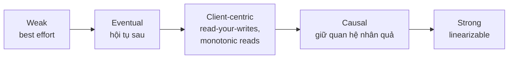
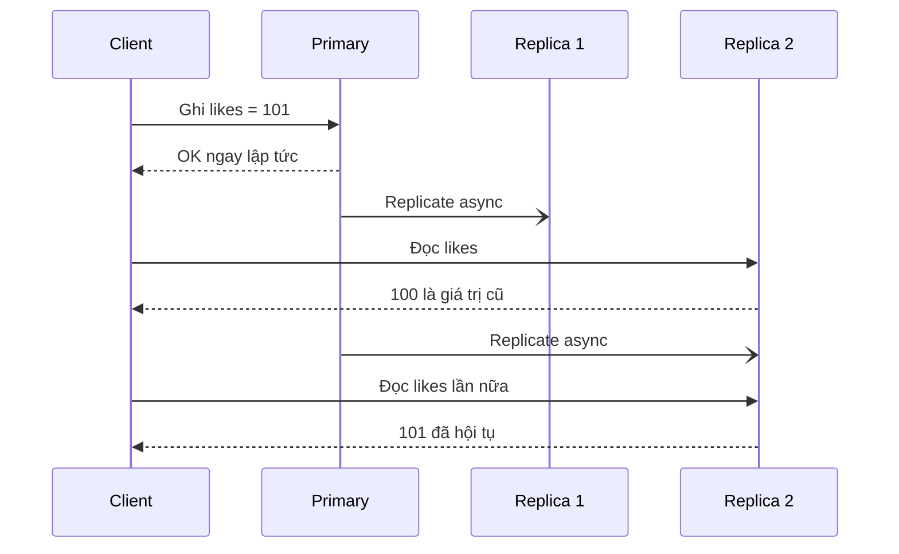
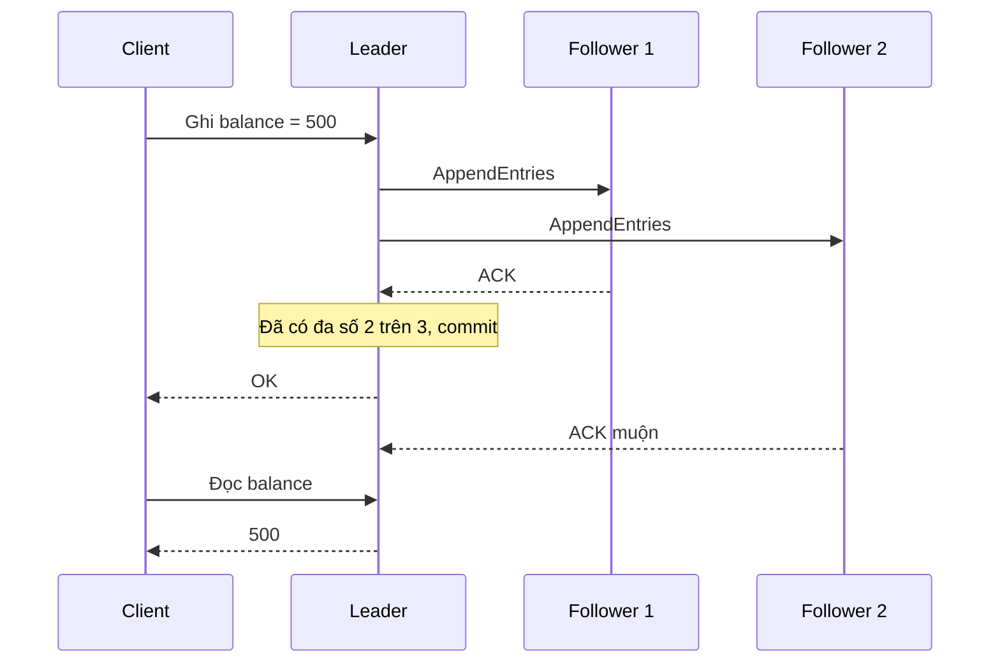
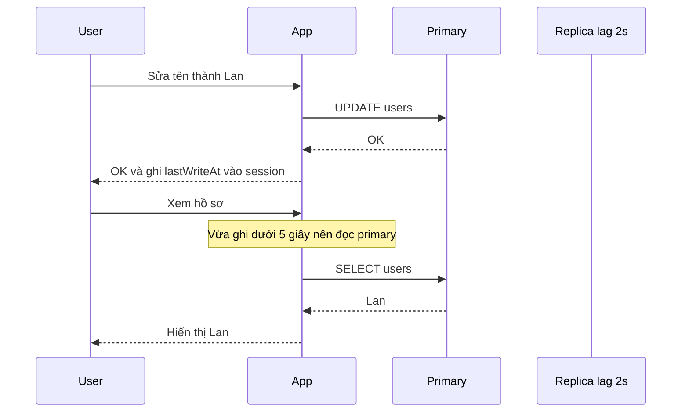
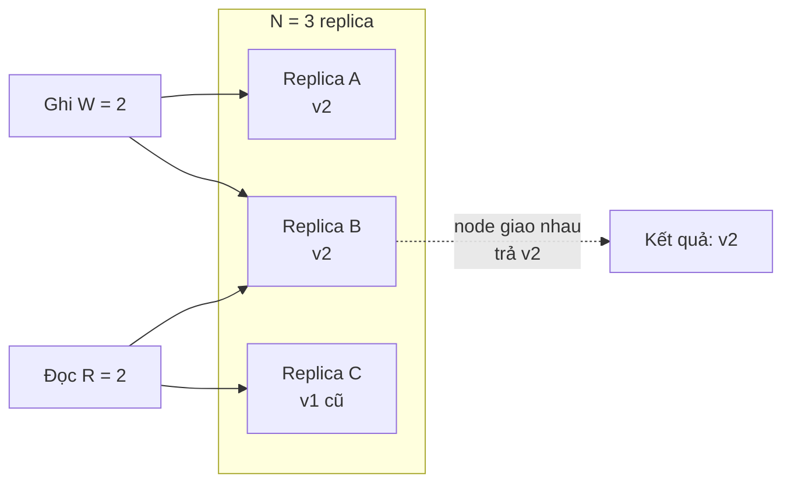

# Consistency Patterns

Khi cùng một dữ liệu được nhân bản (replicate) ở nhiều nơi — nhiều server, nhiều datacenter, cache và database — câu hỏi đặt ra là: **sau khi ghi, khi nào thì những người đọc khác thấy giá trị mới?** **Consistency patterns** (các mô hình nhất quán) là những "hợp đồng" mà hệ thống cam kết với người dùng về điều đó. Ba mô hình cơ bản theo system-design-primer: **Weak consistency**, **Eventual consistency** và **Strong consistency**.

**Tương tự đơn giản:** Một thông báo dán ở bảng tin công ty có nhiều chi nhánh. **Strong consistency** — bảng tin điện tử, cập nhật cùng lúc ở mọi chi nhánh, ai nhìn cũng thấy bản mới. **Eventual consistency** — gửi thông báo qua bưu điện, vài ngày sau mọi chi nhánh đều nhận được và dán lên. **Weak consistency** — thông báo qua loa phát thanh: ai đang nghe thì nghe được, ai vắng mặt thì lỡ, không phát lại.

---

:::note[Ghi nhớ nhanh]

- ⭐ **Weak → Eventual → Strong:** càng nhất quán mạnh thì càng tốn latency, càng giảm availability khi có sự cố.
- ⭐ **Quorum: R + W > N** đảm bảo tập replica đọc và tập replica ghi luôn giao nhau → đọc thấy bản ghi mới nhất (trong điều kiện lý tưởng).
- **Weak consistency:** sau khi ghi, đọc có thể thấy hoặc không — best effort (VoIP, video call, game realtime, memcached).
- **Eventual consistency:** nếu ngừng ghi, mọi replica cuối cùng sẽ hội tụ (DNS, email, Cassandra, DynamoDB mặc định).
- **Giữa eventual và strong có các đảm bảo "phía client":** read-your-writes, monotonic reads, monotonic writes, consistent prefix, causal consistency.

:::

---

## Mục lục

- [Vì sao cần Consistency patterns?](#vì-sao-cần-consistency-patterns)
- [1. Phổ các mô hình nhất quán](#1-phổ-các-mô-hình-nhất-quán)
- [2. Weak Consistency](#2-weak-consistency)
- [3. Eventual Consistency](#3-eventual-consistency)
- [4. Strong Consistency](#4-strong-consistency)
- [5. Các đảm bảo trung gian phía client](#5-các-đảm-bảo-trung-gian-phía-client)
- [6. Quorum và công thức R cộng W lớn hơn N](#6-quorum-và-công-thức-r-cộng-w-lớn-hơn-n)
- [7. So sánh tổng hợp](#7-so-sánh-tổng-hợp)
- [Khi nào dùng?](#khi-nào-dùng)
- [Lỗi thường gặp](#lỗi-thường-gặp)
- [Câu hỏi phỏng vấn](#câu-hỏi-phỏng-vấn)

---

## Vì sao cần Consistency patterns?

**Vấn đề:** Ngay khi có hơn một bản sao dữ liệu — DB primary + read replica, Redis cache + PostgreSQL, hai datacenter — các bản sao sẽ **lệch nhau trong một khoảng thời gian** vì việc đồng bộ tốn thời gian (và có thể thất bại). Nếu không định nghĩa rõ hệ thống cam kết gì, ta gặp những bug "ma": user vừa đăng bài, F5 không thấy; comment hiện rồi biến mất; số dư hiển thị hai giá trị khác nhau trên hai thiết bị.

**Giải pháp:** Chọn **mô hình nhất quán phù hợp từng loại dữ liệu** và thiết kế cơ chế tương ứng: đồng bộ (synchronous replication, consensus) cho dữ liệu cần strong; bất đồng bộ + cơ chế hội tụ cho dữ liệu chấp nhận eventual; và thêm các đảm bảo như read-your-writes để trải nghiệm người dùng không bị "giật".

:::tip[Dùng thực tế]

- **Strong:** số dư ngân hàng, đặt vé máy bay, hệ thống file phân tán cần ngữ nghĩa POSIX, metadata Kubernetes trong etcd.
- **Eventual:** DNS, email, lượt like/view trên YouTube, Facebook; DynamoDB và Cassandra mặc định; CDN cache.
- **Weak:** cuộc gọi VoIP/video (Zoom, Google Meet) — mất gói thì bỏ qua, không phát lại; game multiplayer realtime; memcached.
- **Read-your-writes:** sau khi sửa hồ sơ trên mạng xã hội, chính bạn phải thấy ngay thay đổi, dù người khác thấy chậm hơn vài giây.

:::

---

## 1. Phổ các mô hình nhất quán

Consistency không phải "có hoặc không" mà là một **phổ (spectrum)**:



| Chiều | Weak | Eventual | Strong |
| --- | --- | --- | --- |
| Đọc sau ghi thấy giá trị mới? | Có thể không bao giờ | Chắc chắn, sau một khoảng | Ngay lập tức |
| Latency | Thấp nhất | Thấp | Cao hơn (chờ đồng bộ) |
| Availability khi sự cố | Cao | Cao | Thấp hơn |
| Độ phức tạp cho ứng dụng | Phải chịu mất dữ liệu | Phải xử lý dữ liệu cũ, xung đột | Đơn giản nhất cho dev |
| Replication | Không đảm bảo | Async | Sync / consensus |

---

## 2. Weak Consistency

**Weak consistency:** sau một lần ghi, các lần đọc **có thể thấy hoặc không thấy** giá trị đó. Hệ thống chỉ cố gắng hết sức (**best effort**), không đảm bảo thời điểm hay việc dữ liệu tới nơi.

### Đặc điểm

- Không có cơ chế đảm bảo đồng bộ hay hội tụ.
- Dữ liệu có thể **mất** (không chỉ chậm).
- Latency rất thấp, throughput cao.

### Ví dụ

| Hệ thống | Vì sao weak là hợp lý |
| --- | --- |
| **VoIP, video call** (Zoom, WebRTC) | Mất kết nối vài giây thì phần âm thanh đó mất luôn — phát lại audio cũ vô nghĩa |
| **Game multiplayer realtime** | Vị trí người chơi cũ không còn giá trị; chỉ cần trạng thái mới nhất |
| **Memcached** | Cache có thể bị evict bất kỳ lúc nào, node chết là mất dữ liệu; nguồn sự thật vẫn là DB |
| **Live streaming** | Khung hình trễ thì bỏ qua |
| **Metrics sampling** | Mất vài điểm dữ liệu không ảnh hưởng xu hướng |

```ts
// Weak consistency: gửi vị trí người chơi qua UDP (WebRTC data channel không tin cậy)
// Mất gói thì thôi — gói tiếp theo đã có vị trí mới hơn
const channel = peer.createDataChannel('positions', {
  ordered: false,      // không cần đúng thứ tự
  maxRetransmits: 0,   // không gửi lại khi mất
});

function broadcastPosition(x: number, y: number): void {
  channel.send(JSON.stringify({ x, y, t: Date.now() }));
}

declare const peer: RTCPeerConnection;
```

---

## 3. Eventual Consistency

**Eventual consistency:** sau một lần ghi, các lần đọc **cuối cùng (eventually)** sẽ thấy giá trị đó — **nếu không có thêm ghi mới**, mọi replica sẽ hội tụ về cùng một giá trị. Thường đi kèm **replication bất đồng bộ**: ghi xong ở một node là trả OK ngay, các node khác nhận sau (thường trong vài mili giây đến vài giây).

### Cơ chế



Khoảng thời gian replica còn cũ gọi là **inconsistency window** (cửa sổ không nhất quán) — phụ thuộc replication lag, tải hệ thống, mạng.

### Cơ chế đảm bảo hội tụ

| Cơ chế | Mô tả |
| --- | --- |
| **Async replication** | Primary đẩy log thay đổi cho replica |
| **Read repair** | Khi đọc nhiều replica và thấy lệch, cập nhật replica cũ ngay lúc đó |
| **Hinted handoff** | Node tạm giữ ghi hộ cho node đang chết, chuyển lại khi node đó sống |
| **Anti-entropy** | Tiến trình nền so sánh dữ liệu (Merkle tree) và đồng bộ phần lệch |
| **Gossip protocol** | Node trao đổi trạng thái với nhau ngẫu nhiên, lan truyền dần |

### Giải quyết xung đột

Khi hai replica nhận hai ghi khác nhau cho cùng một key:

- **Last-write-wins (LWW):** giữ bản có timestamp lớn nhất. Đơn giản, nhưng có thể mất ghi do lệch đồng hồ (clock skew).
- **Version vector / vector clock:** phát hiện ghi đồng thời, giữ cả hai để merge.
- **CRDT (Conflict-free Replicated Data Type):** cấu trúc dữ liệu được thiết kế để merge luôn cho cùng kết quả (G-Counter, OR-Set...).

```ts
// G-Counter CRDT: mỗi node chỉ tăng phần của mình; merge = lấy max từng phần
type GCounter = Readonly<Record<string, number>>;

export const increment = (c: GCounter, nodeId: string, by = 1): GCounter => ({
  ...c,
  [nodeId]: (c[nodeId] ?? 0) + by,
});

export const merge = (a: GCounter, b: GCounter): GCounter => {
  const keys = new Set([...Object.keys(a), ...Object.keys(b)]);
  return Object.fromEntries(
    [...keys].map((k) => [k, Math.max(a[k] ?? 0, b[k] ?? 0)]),
  );
};

export const value = (c: GCounter): number =>
  Object.values(c).reduce((sum, n) => sum + n, 0);

// Node SG tăng 3, node JP tăng 2 trong lúc partition -> merge ra 5, không mất lượt nào
```

### Ví dụ hệ thống

- **DNS:** đổi bản ghi A, các resolver trên thế giới thấy giá trị mới sau khi TTL cũ hết hạn.
- **Email:** thư tới hộp thư sau vài giây đến vài phút.
- **Amazon DynamoDB, Cassandra, Riak:** mặc định eventual.
- **Read replica MySQL/PostgreSQL async:** đọc replica là eventual.
- **Cache + DB:** cache có TTL là eventual so với DB.

---

## 4. Strong Consistency

**Strong consistency:** sau khi một lần ghi **hoàn tất (được xác nhận)**, **mọi** lần đọc sau đó — từ bất kỳ client, bất kỳ replica nào — đều thấy giá trị đó. Dạng mạnh nhất thường nói tới là **linearizability**: hệ thống hành xử như chỉ có **một bản dữ liệu**, mọi thao tác có một thứ tự toàn cục phù hợp với thời gian thực.

### Cơ chế

- **Synchronous replication:** primary chỉ trả OK khi replica đã ghi xong.
- **Consensus (Raft, Paxos, Zab):** mỗi ghi phải được **đa số** node chấp nhận trước khi commit.
- **Đọc từ leader** (hoặc leader xác nhận vẫn còn là leader qua lease/read index).
- **Quorum đọc/ghi** với R + W > N (xem mục 6).
- **Distributed transaction:** two-phase commit (2PC) cho ghi xuyên nhiều node.



### Cái giá của strong consistency

| Chi phí | Giải thích |
| --- | --- |
| **Latency cao hơn** | Mỗi ghi chờ ít nhất một round trip tới đa số replica; multi-region thì cộng thêm hàng chục đến hơn 100ms |
| **Availability thấp hơn** | Mất đa số node hoặc bị partition về phía thiểu số → không ghi được |
| **Throughput ghi giới hạn** | Mọi ghi qua leader (trong một nhóm consensus) |

### Ví dụ hệ thống

- **etcd, ZooKeeper, Consul:** consensus, linearizable writes.
- **Google Spanner, CockroachDB:** strong consistency phân tán toàn cầu.
- **RDBMS đơn node** (PostgreSQL, MySQL đọc từ primary): strong trong phạm vi một máy.
- **PostgreSQL synchronous replication:** `synchronous_commit = on` + `synchronous_standby_names`.

```sql
-- PostgreSQL: yêu cầu ít nhất 1 trong 2 standby xác nhận trước khi commit trả về
ALTER SYSTEM SET synchronous_standby_names = 'ANY 1 (standby_a, standby_b)';
ALTER SYSTEM SET synchronous_commit = 'on';
SELECT pg_reload_conf();
```

---

## 5. Các đảm bảo trung gian phía client

Giữa eventual và strong có các đảm bảo **client-centric** — không cần cả hệ thống strong, chỉ cần **từng người dùng** không thấy hành vi vô lý. Đây là công cụ rất thực dụng.

### 5.1. Read-your-writes

**Read-your-writes (read-after-write consistency):** sau khi một user ghi, **chính user đó** luôn đọc thấy giá trị mình vừa ghi. Người khác có thể thấy chậm hơn.

Cách triển khai:

1. **Đọc từ primary** những dữ liệu user có thể vừa sửa (vd hồ sơ của chính mình).
2. **Đọc từ primary trong N giây sau lần ghi gần nhất** của user (lưu timestamp ghi cuối trong session/cookie).
3. **Theo dõi vị trí replication (LSN/GTID):** client nhớ vị trí log của lần ghi, chỉ đọc từ replica đã bắt kịp vị trí đó.

```ts
// Read-your-writes: định tuyến đọc sang primary trong 5 giây sau khi user ghi
const STICKY_PRIMARY_MS = 5_000;

type Session = Readonly<{ userId: string; lastWriteAt?: number }>;

export function pickDb(session: Session, now = Date.now()): 'primary' | 'replica' {
  const recentlyWrote =
    session.lastWriteAt !== undefined && now - session.lastWriteAt < STICKY_PRIMARY_MS;
  return recentlyWrote ? 'primary' : 'replica';
}

export function afterWrite(session: Session, now = Date.now()): Session {
  return { ...session, lastWriteAt: now };
}
```



### 5.2. Monotonic reads

**Monotonic reads:** nếu user đã đọc thấy một giá trị, các lần đọc sau **không bao giờ thấy giá trị cũ hơn**. Vi phạm điển hình: lần 1 đọc từ replica nhanh thấy comment mới, lần 2 đọc từ replica chậm thì comment biến mất.

Cách triển khai: **gắn user với một replica cố định** (hash user_id → replica), hoặc nhớ phiên bản đã đọc và chỉ đọc từ replica có phiên bản lớn hơn hoặc bằng.

### 5.3. Monotonic writes

**Monotonic writes:** các lần ghi của cùng một user được áp dụng **đúng thứ tự** trên mọi replica. Ví dụ: "đổi mật khẩu" rồi "đăng xuất mọi thiết bị" không được áp dụng ngược thứ tự.

### 5.4. Consistent prefix reads

**Consistent prefix:** nếu chuỗi ghi xảy ra theo thứ tự A rồi B, người đọc không bao giờ thấy B mà không thấy A. Ví dụ: không bao giờ thấy câu trả lời trước câu hỏi trong một cuộc hội thoại.

### 5.5. Causal consistency

**Causal consistency:** các thao tác có **quan hệ nhân quả** (B xảy ra vì đã thấy A) được mọi người thấy đúng thứ tự; các thao tác độc lập có thể thấy theo thứ tự khác nhau. Mạnh hơn eventual, yếu hơn linearizable, và vẫn giữ được availability khi partition. MongoDB hỗ trợ causal consistency trong client session.

| Đảm bảo | Vi phạm trông như thế nào |
| --- | --- |
| Read-your-writes | Vừa đăng bài, F5 không thấy bài của mình |
| Monotonic reads | Comment hiện rồi biến mất khi F5 |
| Monotonic writes | Thao tác sau bị ghi đè bởi thao tác trước |
| Consistent prefix | Thấy câu trả lời trước câu hỏi |
| Causal | Thấy reply mà không thấy bài gốc |

---

## 6. Quorum và công thức R cộng W lớn hơn N

Trong hệ thống leaderless (Dynamo, Cassandra, Riak), mỗi key được nhân bản lên **N** replica. Mỗi lần ghi gửi tới cả N, nhưng chỉ chờ **W** replica xác nhận; mỗi lần đọc chờ **R** replica trả lời và lấy bản có version mới nhất.

```
N = số replica của một key
W = số replica phải xác nhận ghi
R = số replica phải trả lời đọc

Nếu R + W > N  -> tập đọc và tập ghi luôn giao nhau ít nhất 1 node
               -> đọc chắc chắn chạm ít nhất 1 replica có bản ghi mới nhất
```



### Các cấu hình phổ biến

| N | W | R | R + W > N? | Đặc điểm |
| --- | --- | --- | --- | --- |
| 3 | 2 | 2 | Có (4 > 3) | Cân bằng — cấu hình QUORUM điển hình, chịu được 1 node chết |
| 3 | 3 | 1 | Có (4 > 3) | Đọc nhanh, ghi chậm và mất 1 node là không ghi được |
| 3 | 1 | 3 | Có (4 > 3) | Ghi nhanh, đọc chậm và mất 1 node là không đọc được |
| 3 | 1 | 1 | Không (2 ≤ 3) | Nhanh nhất, availability cao, chỉ eventual |
| 5 | 3 | 3 | Có (6 > 5) | Chịu được 2 node chết |

Quy tắc chịu lỗi: hệ thống vẫn ghi được khi còn ít nhất W node sống, đọc được khi còn ít nhất R node sống.

### Lưu ý: R + W > N chưa chắc là linearizable

Quorum giúp đọc thấy bản mới nhất **trong điều kiện lý tưởng**, nhưng vẫn có các trường hợp biên:

- **Sloppy quorum + hinted handoff:** khi node chính chết, ghi vào node "thay thế" → tập đọc và ghi có thể không giao nhau.
- **Ghi và đọc đồng thời:** đọc có thể thấy giá trị mới ở replica này nhưng cũ ở replica khác.
- **Ghi thất bại một phần:** ghi thành công ở ít hơn W node vẫn không được rollback ở các node đã ghi.
- **LWW với đồng hồ lệch** làm mất ghi.

Để có linearizable thực sự cần consensus (Raft/Paxos) hoặc thêm read repair đồng bộ.

```sql
-- Cassandra: RF = 3, dùng QUORUM cho cả đọc và ghi -> R + W = 4 > 3
CREATE KEYSPACE shop
  WITH replication = {'class': 'NetworkTopologyStrategy', 'dc1': 3};

CONSISTENCY QUORUM;
INSERT INTO shop.carts (user_id, item_id, qty) VALUES (42, 7, 1);
SELECT * FROM shop.carts WHERE user_id = 42;
```

---

## 7. So sánh tổng hợp

| Tiêu chí | Weak | Eventual | Strong |
| --- | --- | --- | --- |
| **Đảm bảo** | Không | Hội tụ khi ngừng ghi | Đọc luôn thấy ghi mới nhất |
| **Replication** | Best effort | Async | Sync / consensus |
| **Latency** | Rất thấp | Thấp | Cao |
| **Availability** | Rất cao | Cao | Thấp hơn khi sự cố |
| **CAP** | — | AP | CP |
| **Ví dụ** | VoIP, game realtime, memcached | DNS, email, Cassandra, DynamoDB | RDBMS, etcd, Spanner |
| **Dùng cho** | Dữ liệu realtime mất được | Feed, like, giỏ hàng, cache | Tiền, tồn kho, lock |

---

## Khi nào dùng?

- **Weak consistency khi:**
  - Dữ liệu chỉ có giá trị tức thời (audio, video, vị trí trong game)
  - Mất một phần dữ liệu không ảnh hưởng nghiệp vụ
- **Eventual consistency khi:**
  - Cần availability và latency thấp, chấp nhận lệch vài giây
  - Hệ thống multi-region, ghi ở nhiều nơi
  - Dữ liệu dạng đếm, feed, tìm kiếm, analytics, cache
  - Kết hợp read-your-writes để trải nghiệm không bị giật
- **Strong consistency khi:**
  - Tiền, tồn kho có hạn, đặt chỗ, định danh duy nhất (username, email)
  - Khoá phân tán, leader election, cấu hình
  - Sai lệch gây hậu quả không đảo ngược được

---

## Lỗi thường gặp

### Lỗi 1: Đọc từ replica ngay sau khi ghi vào primary

Tạo đơn hàng xong redirect sang trang chi tiết, trang này đọc từ replica chưa kịp đồng bộ → 404. Dùng read-your-writes: đọc primary sau khi ghi, hoặc trả luôn dữ liệu đã ghi trong response.

### Lỗi 2: Kiểm tra rồi ghi trên hệ eventual

"Kiểm tra username chưa tồn tại rồi insert" trên Cassandra với consistency ONE → hai người cùng lấy được một username. Ràng buộc duy nhất cần strong consistency (unique constraint trên RDBMS, lightweight transaction của Cassandra, hoặc conditional write của DynamoDB).

### Lỗi 3: Nghĩ R + W > N là đủ linearizable

Sloppy quorum, ghi thất bại một phần và đồng hồ lệch vẫn có thể gây đọc cũ. Nếu cần linearizable, dùng hệ thống consensus.

### Lỗi 4: Dùng last-write-wins cho dữ liệu cộng dồn

Hai replica cùng tăng lượt like từ 100 lên 101; LWW giữ một bản → mất một lượt. Dùng CRDT counter hoặc thao tác atomic increment.

### Lỗi 5: Strong consistency cho mọi thứ

Bật quorum xuyên region cho cả lượt view → latency tăng vọt, availability giảm, chi phí tăng mà người dùng không được lợi gì.

---

## Câu hỏi phỏng vấn

Những câu thường gặp về chủ đề này. Tự trả lời trước, rồi bấm **Xem đáp án** để đối chiếu.

**1. So sánh weak, eventual và strong consistency, cho ví dụ mỗi loại.**

<details className="qa">
<summary>Xem đáp án</summary>

- **Weak:** sau ghi, đọc có thể thấy hoặc không, best effort — VoIP, game realtime, memcached.
- **Eventual:** sau ghi, đọc cuối cùng sẽ thấy, replication async — DNS, email, Cassandra, DynamoDB mặc định.
- **Strong:** sau ghi, mọi đọc thấy ngay, replication sync/consensus — RDBMS, etcd, Spanner.

Càng mạnh thì latency càng cao, availability khi sự cố càng thấp.

</details>

**2. Giải thích công thức R + W > N.**

<details className="qa">
<summary>Xem đáp án</summary>

Với N replica, ghi cần W xác nhận, đọc cần R phản hồi. Nếu R + W > N thì theo nguyên lý chuồng bồ câu, tập đọc và tập ghi giao nhau ít nhất một node → đọc chạm được bản ghi mới nhất (chọn theo version). Ví dụ N=3, W=2, R=2. Giảm W thì ghi nhanh hơn nhưng đọc phải tăng R; R=W=1 thì nhanh nhất nhưng chỉ eventual. Lưu ý quorum chưa đảm bảo linearizable khi có sloppy quorum hay ghi đồng thời.

</details>

**3. Read-your-writes là gì và triển khai thế nào?**

<details className="qa">
<summary>Xem đáp án</summary>

Đảm bảo user luôn thấy những gì chính mình vừa ghi. Triển khai: đọc từ primary dữ liệu do chính user sở hữu; hoặc đọc primary trong vài giây sau lần ghi gần nhất (lưu timestamp trong session); hoặc nhớ vị trí replication (LSN) của lần ghi và chỉ đọc replica đã bắt kịp; hoặc trả luôn dữ liệu vừa ghi trong response.

</details>

**4. Eventual consistency hội tụ bằng những cơ chế nào?**

<details className="qa">
<summary>Xem đáp án</summary>

Async replication, read repair (sửa replica cũ khi đọc), hinted handoff (giữ ghi hộ node đang chết), anti-entropy dùng Merkle tree, gossip. Xung đột được giải bằng last-write-wins, version vector, CRDT hoặc merge theo nghiệp vụ.

</details>

**5. Monotonic reads khác read-your-writes thế nào?**

<details className="qa">
<summary>Xem đáp án</summary>

- **Read-your-writes:** liên quan tới dữ liệu **chính mình ghi** — phải thấy ngay.
- **Monotonic reads:** liên quan tới **mọi dữ liệu đã đọc** — đã thấy giá trị mới thì không được "quay ngược" về giá trị cũ (vd comment hiện rồi biến mất). Triển khai bằng cách gắn user với một replica cố định.

</details>

**6. Thiết kế đăng ký username duy nhất trên hệ eventual consistent thế nào?**

<details className="qa">
<summary>Xem đáp án</summary>

Không thể dựa vào "đọc rồi ghi" trên hệ eventual vì hai node có thể cùng chấp nhận. Cần một thao tác strong cho riêng ràng buộc này: unique constraint trên RDBMS, conditional write (`attribute_not_exists`) của DynamoDB, lightweight transaction (`IF NOT EXISTS`, dùng Paxos) của Cassandra, hoặc một service đặt chỗ username dựa trên consensus. Phần dữ liệu hồ sơ còn lại có thể vẫn eventual.

</details>
