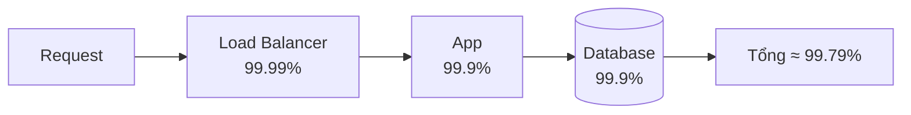
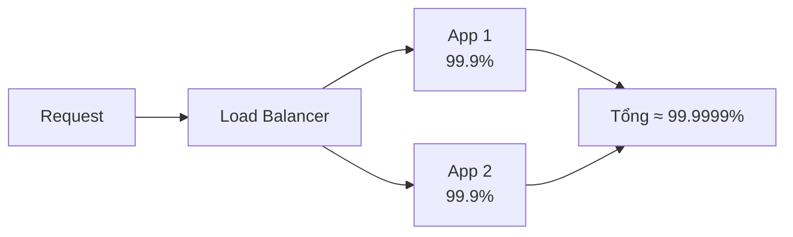
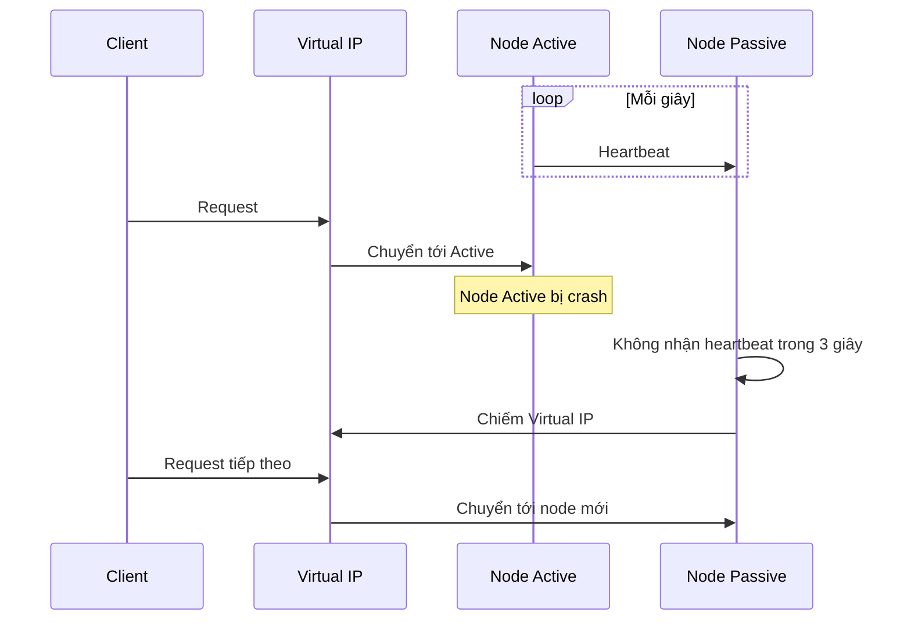
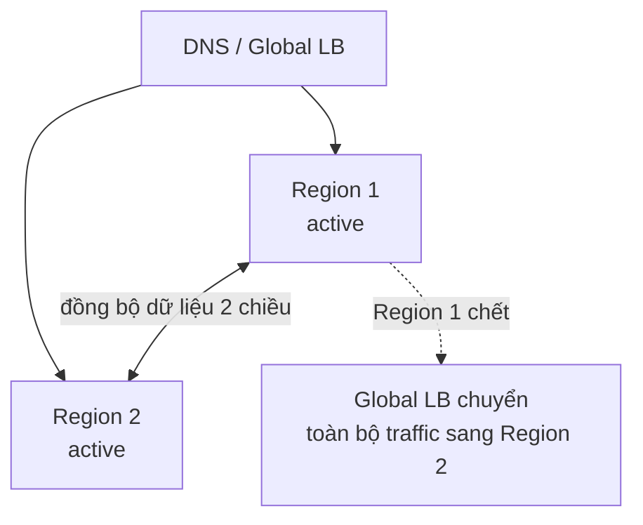
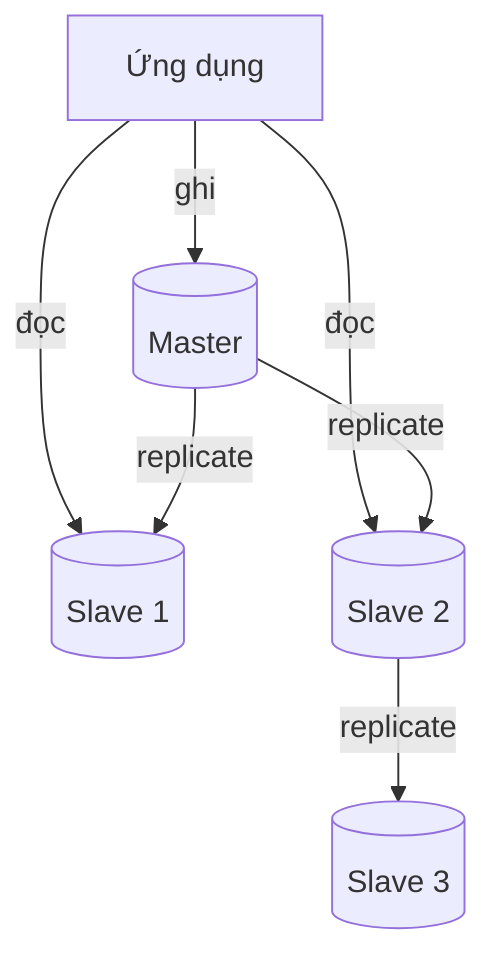
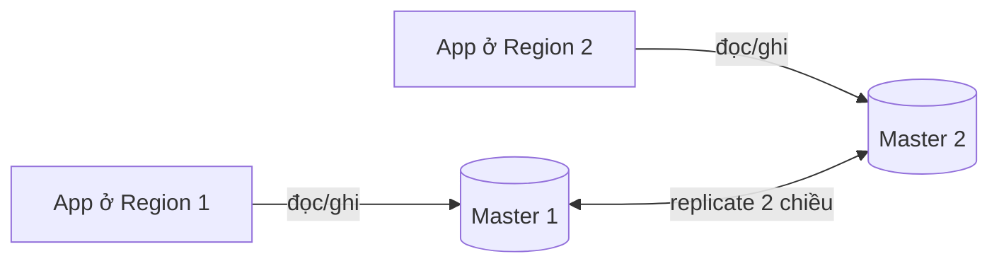

# Availability Patterns

**Availability** (tính sẵn sàng) là tỉ lệ thời gian hệ thống **hoạt động và phục vụ được** người dùng, thường biểu diễn bằng "số 9": 99.9%, 99.99%... Phần cứng sẽ hỏng, mạng sẽ đứt, deploy sẽ lỗi — **availability patterns** là các mẫu thiết kế giúp hệ thống vẫn chạy khi một phần của nó chết. Hai nhóm mẫu chính theo system-design-primer: **Fail-over** (chuyển sang bản dự phòng) và **Replication** (nhân bản dữ liệu).

**Tương tự đơn giản:** Một bệnh viện luôn có **máy phát điện dự phòng**. Mất điện lưới thì máy phát tự khởi động sau vài giây (**fail-over active-passive**). Phòng mổ quan trọng còn được cấp từ **hai nguồn điện độc lập cùng lúc** — một nguồn hỏng, nguồn kia vẫn gánh mà không gián đoạn (**active-active**). Hồ sơ bệnh án được **sao lưu ở nhiều nơi** để cháy một kho không mất dữ liệu (**replication**).

---

:::note[Ghi nhớ nhanh]

- ⭐ **Mỗi số 9 thêm vào giảm downtime 10 lần:** 99.9% ≈ 8.77 giờ/năm, 99.99% ≈ 52.6 phút/năm, 99.999% ≈ 5.26 phút/năm.
- ⭐ **Nối tiếp thì nhân (availability giảm), song song thì bù (availability tăng):** `A = A1 × A2` và `A = 1 - (1 - A1) × (1 - A2)`.
- **Active-passive:** một node phục vụ, node kia chờ (heartbeat), lỗi thì chiếm vai. Đơn giản nhưng có downtime chuyển đổi và lãng phí tài nguyên chờ.
- **Active-active:** mọi node cùng phục vụ, LB phân tải; một node chết thì các node còn lại gánh — nhưng phải xử lý đồng bộ dữ liệu ghi.
- **Replication master-slave / master-master** là nền tảng để dữ liệu sống sót khi node chết; replication async có thể **mất dữ liệu gần nhất** khi failover.

:::

---

## Mục lục

- [Vì sao cần Availability patterns?](#vì-sao-cần-availability-patterns)
- [1. Availability in Numbers](#1-availability-in-numbers)
- [2. Tính availability nối tiếp và song song](#2-tính-availability-nối-tiếp-và-song-song)
- [3. Fail-over](#3-fail-over)
- [4. Replication](#4-replication)
- [5. Đo và đảm bảo availability trong thực tế](#5-đo-và-đảm-bảo-availability-trong-thực-tế)
- [Khi nào dùng?](#khi-nào-dùng)
- [Lỗi thường gặp](#lỗi-thường-gặp)
- [Câu hỏi phỏng vấn](#câu-hỏi-phỏng-vấn)

---

## Vì sao cần Availability patterns?

**Vấn đề:** Mọi thành phần đều có thể hỏng: ổ đĩa chết, server mất nguồn, cả một availability zone mất điện, deploy làm crash process, DNS cấu hình sai. Nếu hệ thống chỉ có **một bản** của bất kỳ thành phần nào trên đường đi của request (single point of failure — SPOF), thành phần đó chết là cả hệ thống chết. Với hệ thống thương mại điện tử, mỗi phút ngừng hoạt động là mất doanh thu và uy tín.

**Giải pháp:** **Dư thừa (redundancy)** — có nhiều bản của mỗi thành phần — kết hợp với **cơ chế phát hiện lỗi và chuyển đổi tự động**. Với thành phần không có state (app server), chỉ cần thêm bản sao sau load balancer. Với thành phần có state (database), cần **replication** để dữ liệu tồn tại ở nhiều nơi, và **fail-over** để chuyển vai trò khi node chính chết.

:::tip[Dùng thực tế]

- **Amazon RDS Multi-AZ:** database primary ở một AZ, standby đồng bộ ở AZ khác; primary chết thì AWS tự fail-over bằng cách đổi DNS endpoint (thường trong khoảng 1–2 phút).
- **Load balancer cặp HA:** HAProxy/Nginx + Keepalived dùng VRRP để chuyển **virtual IP** sang máy dự phòng khi máy chính chết.
- **Netflix multi-region active-active:** chạy ở nhiều AWS region, có thể chuyển toàn bộ traffic khỏi một region gặp sự cố.
- **SLA của cloud:** AWS, GCP, Azure công bố SLA bằng số 9 cho từng dịch vụ, và hoàn tiền (service credit) khi không đạt.

:::

---

## 1. Availability in Numbers

Availability thường được tính bằng:

```
Availability = Uptime / (Uptime + Downtime)

hoặc theo độ tin cậy phần cứng:
Availability = MTBF / (MTBF + MTTR)
  MTBF = Mean Time Between Failures (thời gian trung bình giữa hai lần hỏng)
  MTTR = Mean Time To Repair/Recover (thời gian trung bình để khôi phục)
```

Công thức thứ hai cho thấy có **hai cách** tăng availability: **hỏng ít hơn** (tăng MTBF) hoặc **khôi phục nhanh hơn** (giảm MTTR). Trong hệ thống phân tán, giảm MTTR bằng fail-over tự động thường hiệu quả hơn cố gắng làm phần cứng không bao giờ hỏng.

### Bảng "số 9" và downtime cho phép

(Tính theo năm 365.25 ngày; con số làm tròn.)

| Availability | Tên gọi | Downtime/năm | Downtime/tháng | Downtime/tuần | Downtime/ngày |
| --- | --- | --- | --- | --- | --- |
| 90% | "một số 9" | 36.5 ngày | ~73 giờ | 16.8 giờ | 2.4 giờ |
| 99% | "hai số 9" | 3.65 ngày | ~7.3 giờ | 1.68 giờ | 14.4 phút |
| 99.9% | "ba số 9" | 8.77 giờ | ~43.8 phút | 10.1 phút | 1.44 phút |
| 99.95% | | 4.38 giờ | ~21.9 phút | 5.04 phút | 43.2 giây |
| 99.99% | "bốn số 9" | 52.6 phút | ~4.38 phút | 1.01 phút | 8.64 giây |
| 99.999% | "năm số 9" | 5.26 phút | ~26.3 giây | 6.05 giây | 0.86 giây |

**Đọc bảng thế nào?**

- **99.9%** cho phép khoảng **43 phút downtime mỗi tháng** — đủ cho một sự cố nhỏ, không đủ cho một lần migrate DB "tắt máy 2 tiếng".
- **99.99%** chỉ còn **~4 phút mỗi tháng** — con người không kịp phản ứng; bắt buộc phải có fail-over **tự động** và deploy không downtime.
- **99.999%** (~5 phút/năm) thường chỉ thấy ở hạ tầng viễn thông, hệ thống lõi; cực kỳ đắt đỏ.

```ts
// Tính downtime cho phép từ availability
const MINUTES_PER_YEAR = 365.25 * 24 * 60;

export function allowedDowntimeMinutes(availability: number, periodMinutes = MINUTES_PER_YEAR): number {
  if (availability <= 0 || availability > 1) {
    throw new RangeError('availability phải nằm trong (0, 1]');
  }
  return (1 - availability) * periodMinutes;
}

allowedDowntimeMinutes(0.999);  // ≈ 525.96 phút ≈ 8.77 giờ/năm
allowedDowntimeMinutes(0.9999); // ≈ 52.6 phút/năm
```

---

## 2. Tính availability nối tiếp và song song

Một hệ thống gồm nhiều thành phần. Availability tổng phụ thuộc vào cách chúng được ghép lại.

### 2.1. Nối tiếp (in sequence)

Khi request phải đi qua **tất cả** thành phần (A rồi B), hệ thống chỉ chạy khi **mọi** thành phần đều chạy:

```
Availability (tổng) = A1 × A2 × ... × An
```



Ví dụ: LB 99.99% × App 99.9% × DB 99.9% = 0.9999 × 0.999 × 0.999 ≈ **99.79%** — thấp hơn thành phần yếu nhất. **Càng nhiều thành phần nối tiếp, availability càng giảm.** Đây là lý do một chuỗi microservice gọi nhau đồng bộ dài có availability kém.

| Số thành phần nối tiếp (mỗi cái 99.9%) | Availability tổng | Downtime/năm |
| --- | --- | --- |
| 1 | 99.9% | ~8.8 giờ |
| 2 | ~99.8% | ~17.5 giờ |
| 5 | ~99.5% | ~43.7 giờ |
| 10 | ~99.0% | ~3.6 ngày |

### 2.2. Song song (in parallel)

Khi có **nhiều bản dự phòng**, hệ thống chỉ chết khi **tất cả** đều chết cùng lúc:

```
Availability (tổng) = 1 - (1 - A1) × (1 - A2) × ... × (1 - An)
```



Ví dụ: hai app server 99.9% song song: 1 − (0.001 × 0.001) = 1 − 0.000001 = **99.9999%**.

:::warning[Giả định độc lập]

Công thức song song giả định các bản **hỏng độc lập** với nhau. Nếu hai server nằm cùng rack, cùng AZ, cùng phiên bản code lỗi, cùng phụ thuộc một DNS — chúng có thể chết **cùng lúc** (correlated failure), và availability thực tế thấp hơn nhiều. Vì vậy phải phân tán bản dự phòng qua **nhiều AZ/region** và deploy dần (canary).

:::

### 2.3. Kết hợp nối tiếp và song song

```ts
// Availability của các thành phần nối tiếp và song song
export const inSeries = (...parts: readonly number[]): number =>
  parts.reduce((acc, a) => acc * a, 1);

export const inParallel = (...parts: readonly number[]): number =>
  1 - parts.reduce((acc, a) => acc * (1 - a), 1);

// LB đơn (99.99%) -> 3 app server song song (99.9%) -> DB primary + standby song song (99.9%)
const lb = 0.9999;
const appTier = inParallel(0.999, 0.999, 0.999); // ≈ 0.999999999
const dbTier = inParallel(0.999, 0.999);         // ≈ 0.999999
const total = inSeries(lb, appTier, dbTier);     // ≈ 0.99989 -> LB đơn thành điểm yếu nhất
```

**Bài học:** tổng availability bị chi phối bởi **thành phần nối tiếp yếu nhất không có dự phòng**. Trong ví dụ trên, LB đơn là SPOF — phải nhân đôi LB.

---

## 3. Fail-over

**Fail-over** là cơ chế **tự động chuyển** công việc từ thành phần bị lỗi sang thành phần dự phòng. Có hai mô hình chính.

### 3.1. Active-passive

Trong **active-passive** (còn gọi là **master-slave fail-over**), chỉ **một node active** phục vụ traffic; node **passive** đứng chờ. Hai node gửi **heartbeat** (nhịp tim) cho nhau định kỳ. Nếu heartbeat bị gián đoạn quá ngưỡng, node passive **chiếm IP/vai trò** của node active và bắt đầu phục vụ.



**Hot standby và cold standby:**

| Loại | Trạng thái node passive | Thời gian fail-over |
| --- | --- | --- |
| **Hot standby** | Đã chạy sẵn, dữ liệu đồng bộ liên tục | Vài giây |
| **Warm standby** | Đã chạy nhưng dữ liệu cần bắt kịp | Vài phút |
| **Cold standby** | Phải khởi động và khôi phục dữ liệu từ backup | Vài phút đến vài giờ |

Ví dụ cấu hình Keepalived (VRRP) cho cặp load balancer active-passive:

```nginx
# /etc/keepalived/keepalived.conf trên node MASTER
vrrp_instance VI_1 {
    state MASTER            # node BACKUP đặt state BACKUP
    interface eth0
    virtual_router_id 51
    priority 150            # node BACKUP đặt priority thấp hơn, vd 100
    advert_int 1            # gửi heartbeat VRRP mỗi 1 giây
    virtual_ipaddress {
        10.0.0.100/24       # Virtual IP mà client trỏ tới
    }
}
```

**Ưu điểm:** đơn giản, không phải xử lý ghi đồng thời ở hai nơi.

**Nhược điểm:**

- **Lãng phí tài nguyên:** node passive gần như không làm gì.
- **Có downtime chuyển đổi** (phát hiện lỗi + chiếm vai).
- **Có thể mất dữ liệu** nếu node active chết trước khi kịp replicate dữ liệu mới sang passive (khi replication async).
- **Split-brain:** nếu chỉ mạng giữa hai node đứt (cả hai vẫn sống), cả hai đều nghĩ mình là active → hai nơi cùng nhận ghi. Cần **fencing** (STONITH — "Shoot The Other Node In The Head") hoặc quorum/witness node để tránh.

### 3.2. Active-active

Trong **active-active** (còn gọi là **master-master fail-over**), **tất cả node đều phục vụ traffic** cùng lúc, tải được chia giữa chúng. Khi một node chết, các node còn lại gánh toàn bộ.



- Với server **public-facing**: DNS cần biết IP public của cả hai (vd GeoDNS hoặc DNS round robin + health check).
- Với server **nội bộ**: logic ứng dụng/LB cần biết tất cả node.

**Ưu điểm:**

- Không lãng phí tài nguyên — mọi node đều làm việc.
- Fail-over gần như tức thời (chỉ cần LB ngừng gửi tới node chết).
- Có thể đặt gần người dùng (multi-region) để giảm latency.

**Nhược điểm:**

- **Đồng bộ ghi phức tạp:** hai nơi cùng nhận ghi → xung đột cần giải quyết.
- **Capacity planning:** mỗi node phải đủ sức gánh tải của node chết. Hai node active cùng chạy 70% thì khi một node chết, node còn lại phải gánh 140% → sập dây chuyền. Nên giữ mỗi node dưới 50% (với 2 node).
- Chi phí hạ tầng và vận hành cao hơn.

### 3.3. So sánh

| Tiêu chí | Active-passive | Active-active |
| --- | --- | --- |
| Node phục vụ traffic | 1 | Tất cả |
| Tận dụng tài nguyên | Thấp (passive nhàn rỗi) | Cao |
| Thời gian fail-over | Vài giây đến vài phút | Gần như tức thời |
| Xử lý ghi | Đơn giản (một nơi ghi) | Phức tạp (xung đột, đồng bộ 2 chiều) |
| Rủi ro | Split-brain, mất dữ liệu chưa replicate | Xung đột dữ liệu, quá tải dây chuyền |
| Phù hợp | DB primary, LB cặp HA | App server stateless, multi-region |

### 3.4. Nhược điểm chung của fail-over

- Thêm phần cứng và độ phức tạp.
- **Có thể mất dữ liệu** nếu hệ thống active chết trước khi dữ liệu mới ghi được replicate sang passive.
- Cơ chế fail-over **chính nó** cũng có thể lỗi — cần test định kỳ (game day, chaos engineering).

---

## 4. Replication

**Replication** (nhân bản) là việc giữ **nhiều bản sao dữ liệu** trên nhiều node. Ở góc độ availability, replication đảm bảo khi một node chứa dữ liệu chết, vẫn còn node khác có dữ liệu để phục vụ và để fail-over sang. (Chi tiết kỹ thuật replication database sẽ có ở phần Databases.)

### 4.1. Master-slave replication

**Master-slave** (còn gọi là **primary-replica** hoặc **leader-follower**): **master** nhận mọi ghi (và có thể cả đọc), rồi **replicate** sang một hoặc nhiều **slave**. Slave chỉ phục vụ đọc. Slave có thể replicate tiếp sang slave khác theo dạng cây.



**Về availability:**

- **Slave chết:** chỉ giảm năng lực đọc, ứng dụng chuyển đọc sang slave khác.
- **Master chết:** hệ thống chuyển sang **chế độ chỉ đọc (read-only)** cho đến khi **một slave được thăng cấp (promote)** thành master mới — thủ công hoặc tự động (Patroni cho PostgreSQL, Orchestrator cho MySQL, RDS Multi-AZ).
- **Nếu replication async,** ghi chưa kịp sang slave sẽ **mất** khi master chết.

| Ưu điểm | Nhược điểm |
| --- | --- |
| Đơn giản, không xung đột ghi | Master là điểm ghi duy nhất |
| Scale đọc bằng cách thêm slave | Promote slave cần logic fail-over |
| Slave làm backup nóng | Replication lag → đọc slave có thể cũ |

### 4.2. Master-master replication

**Master-master** (còn gọi là **multi-leader** hoặc **active-active replication**): **hai (hoặc nhiều) master** cùng nhận đọc và ghi, và replicate cho nhau.



**Về availability:**

- **Một master chết:** master còn lại tiếp tục nhận cả đọc lẫn ghi — **không cần promote**, không có thời gian read-only.
- Phù hợp multi-region: mỗi region ghi vào master gần nhất.

**Nhược điểm:**

- Cần **load balancer** hoặc logic ứng dụng để biết ghi vào đâu.
- Phần lớn hệ thống master-master **hoặc** là **loosely consistent** (vi phạm ACID, eventual), **hoặc** tăng latency ghi do phải đồng bộ.
- **Xung đột ghi** (cùng một bản ghi sửa ở hai master) càng nhiều khi số node ghi tăng và latency giữa chúng lớn — cần chiến lược giải quyết (last-write-wins, merge, tránh xung đột bằng cách định tuyến mỗi user về một master "nhà").
- Auto-increment ID xung đột → dùng UUID, Snowflake ID, hoặc chia dải (`auto_increment_increment`, `auto_increment_offset` trong MySQL).

```sql
-- MySQL master-master: tránh trùng khoá tự tăng giữa 2 master
-- Trên Master 1:
SET GLOBAL auto_increment_increment = 2;
SET GLOBAL auto_increment_offset = 1;   -- sinh 1, 3, 5, ...
-- Trên Master 2:
SET GLOBAL auto_increment_increment = 2;
SET GLOBAL auto_increment_offset = 2;   -- sinh 2, 4, 6, ...
```

### 4.3. Nhược điểm chung của replication

- **Có nguy cơ mất dữ liệu** nếu master chết trước khi dữ liệu mới được replicate.
- **Replication lag:** replica càng nhiều, càng nhiều ghi cần replay → lag tăng; đọc replica có thể thấy dữ liệu cũ.
- Một số hệ thống: ghi vào master có thể sinh **nhiều ghi** trên replica (replay), làm replica bận ghi và đọc chậm đi.
- Thêm phần cứng, thêm độ phức tạp vận hành.

### 4.4. So sánh replication ở góc độ availability

| Tiêu chí | Master-slave | Master-master |
| --- | --- | --- |
| Ghi khi master chết | Gián đoạn tới khi promote slave | Tiếp tục ở master còn lại |
| Xung đột ghi | Không | Có, phải giải quyết |
| Nhất quán | Mạnh trên master, eventual trên slave | Thường eventual (loosely consistent) |
| Độ phức tạp | Trung bình | Cao |
| Phù hợp | Đa số ứng dụng web, đọc nhiều ghi ít | Multi-region, cần ghi ở nhiều nơi |

---

## 5. Đo và đảm bảo availability trong thực tế

### 5.1. SLI, SLO, SLA

| Khái niệm | Ý nghĩa | Ví dụ |
| --- | --- | --- |
| **SLI** (Service Level Indicator) | Chỉ số đo được | Tỉ lệ request trả về không phải 5xx |
| **SLO** (Service Level Objective) | Mục tiêu nội bộ cho SLI | 99.95% request thành công trong 30 ngày |
| **SLA** (Service Level Agreement) | Cam kết hợp đồng với khách hàng, có phạt | 99.9%, không đạt thì hoàn 10% phí |

SLO thường đặt **chặt hơn** SLA để có vùng đệm. Phần còn lại (100% − SLO) là **error budget** — "ngân sách lỗi" có thể tiêu cho deploy, thử nghiệm. Hết budget thì đóng băng tính năng mới, tập trung vào độ ổn định (cách làm của Google SRE).

### 5.2. Các kỹ thuật bổ trợ

- **Health check** để LB loại node lỗi.
- **Phân tán qua nhiều AZ/region** để tránh correlated failure.
- **Deploy không downtime:** rolling, blue-green, canary.
- **Graceful degradation:** tính năng phụ hỏng thì tắt, tính năng chính vẫn chạy (gợi ý sản phẩm lỗi thì ẩn khung gợi ý, vẫn cho thanh toán).
- **Circuit breaker, timeout, retry có backoff** để lỗi không lan dây chuyền.
- **Backup và test restore** định kỳ — replication không thay thế backup (lệnh `DELETE` nhầm cũng được replicate).

---

## Khi nào dùng?

- **Active-passive khi:**
  - Thành phần có state khó ghi ở nhiều nơi: DB primary, cặp load balancer
  - Chấp nhận vài giây đến vài phút fail-over
  - Muốn đơn giản, tránh xung đột ghi
- **Active-active khi:**
  - Thành phần stateless (app server, API gateway)
  - Cần fail-over gần như tức thời, tận dụng hết tài nguyên
  - Multi-region phục vụ người dùng toàn cầu (chấp nhận xử lý xung đột)
- **Master-slave replication khi:**
  - Đọc nhiều hơn ghi, cần scale đọc và có bản dự phòng nóng
- **Master-master replication khi:**
  - Cần ghi ở nhiều region, không chấp nhận thời gian read-only khi master chết
- **Chọn mức số 9:**
  - Tool nội bộ: 99%–99.5% thường đủ
  - Sản phẩm SaaS thông thường: 99.9%–99.95%
  - Thanh toán, hạ tầng lõi: 99.99%+ (chi phí tăng mạnh theo mỗi số 9)

---

## Lỗi thường gặp

### Lỗi 1: Nhân bản app server nhưng quên các SPOF khác

10 app server nhưng 1 load balancer, 1 DB, 1 Redis, 1 NAT gateway. Availability tổng bị chặn bởi thành phần nối tiếp yếu nhất. Vẽ đường đi của request và kiểm tra từng hộp.

### Lỗi 2: Đặt mọi bản dự phòng cùng một chỗ

Primary và standby cùng rack/AZ — mất điện AZ là mất cả hai. Công thức song song chỉ đúng khi lỗi độc lập.

### Lỗi 3: Không test fail-over

Cơ chế fail-over chưa bao giờ chạy thật, đến lúc sự cố mới phát hiện script promote lỗi, DNS TTL 1 ngày, standby thiếu quyền. Tổ chức game day / chaos engineering (Netflix Chaos Monkey) định kỳ.

### Lỗi 4: Active-active chạy quá tải

Hai node mỗi node 70% CPU — một node chết thì node kia nhận 140% và sập theo. Với N node, mỗi node nên chạy dưới khoảng `(N-1)/N` công suất, cộng thêm dư phòng.

### Lỗi 5: Bỏ qua split-brain

Mạng giữa hai node đứt, cả hai cùng nhận ghi → dữ liệu phân kỳ không gộp lại được. Dùng quorum (số node lẻ, witness), fencing/STONITH.

### Lỗi 6: Coi replication là backup

Replication sao chép cả lỗi: `DROP TABLE` nhầm được replicate ngay lập tức. Vẫn cần backup + point-in-time recovery và test restore.

---

## Câu hỏi phỏng vấn

Những câu thường gặp về chủ đề này. Tự trả lời trước, rồi bấm **Xem đáp án** để đối chiếu.

**1. 99.99% availability tương ứng bao nhiêu downtime mỗi năm và mỗi tháng?**

<details className="qa">
<summary>Xem đáp án</summary>

Khoảng **52.6 phút/năm** và **~4.4 phút/tháng** (8.6 giây/ngày). Để đạt mức này gần như bắt buộc fail-over tự động, deploy không downtime và phân tán qua nhiều AZ, vì con người không kịp phản ứng trong 4 phút.

</details>

**2. Ba thành phần nối tiếp có availability 99.9%, 99.9%, 99.99%. Availability tổng? Làm sao cải thiện?**

<details className="qa">
<summary>Xem đáp án</summary>

0.999 × 0.999 × 0.9999 ≈ **99.79%**. Cải thiện bằng cách thêm dự phòng song song cho thành phần yếu: hai bản 99.9% song song đạt 1 − 0.001² = 99.9999%. Ngoài ra giảm số thành phần nối tiếp (bớt lời gọi đồng bộ), giảm MTTR bằng fail-over tự động.

</details>

**3. So sánh active-passive và active-active fail-over.**

<details className="qa">
<summary>Xem đáp án</summary>

- **Active-passive:** một node phục vụ, node kia chờ với heartbeat; lỗi thì passive chiếm IP/vai trò. Đơn giản, không xung đột ghi; nhưng lãng phí tài nguyên, có downtime chuyển đổi, nguy cơ split-brain và mất dữ liệu chưa replicate.
- **Active-active:** mọi node cùng phục vụ, LB phân tải; node chết thì node còn lại gánh. Tận dụng tài nguyên, fail-over gần tức thời; nhưng phải xử lý đồng bộ/xung đột ghi và đảm bảo mỗi node đủ sức gánh tải khi node khác chết.

</details>

**4. Master-slave và master-master khác nhau thế nào về availability?**

<details className="qa">
<summary>Xem đáp án</summary>

- **Master-slave:** master chết → hệ thống read-only cho tới khi promote một slave; replication async có thể mất ghi gần nhất. Đơn giản, không xung đột.
- **Master-master:** một master chết → master kia tiếp tục nhận ghi ngay, không cần promote. Đổi lại phải giải quyết xung đột ghi, thường chỉ eventual consistent hoặc tăng latency ghi.

</details>

**5. Split-brain là gì và tránh thế nào?**

<details className="qa">
<summary>Xem đáp án</summary>

Khi mạng giữa các node đứt nhưng các node vẫn sống, nhiều node cùng tin mình là active/master và cùng nhận ghi → dữ liệu phân kỳ. Tránh bằng: quorum (chỉ phía có đa số được làm master, dùng số node lẻ hoặc witness), fencing/STONITH (cô lập hoặc tắt node cũ trước khi node mới nhận vai), lease có thời hạn, fencing token tăng dần khi ghi vào storage.

</details>

**6. Vì sao công thức availability song song có thể quá lạc quan?**

<details className="qa">
<summary>Xem đáp án</summary>

Công thức giả định các bản dự phòng hỏng **độc lập**. Thực tế có correlated failure: cùng AZ mất điện, cùng bug trong phiên bản deploy, cùng phụ thuộc DNS/config chung, cùng quá tải dây chuyền khi một node chết. Do đó cần phân tán qua AZ/region, deploy canary, đa dạng hoá phụ thuộc, và dự phòng đủ capacity.

</details>
