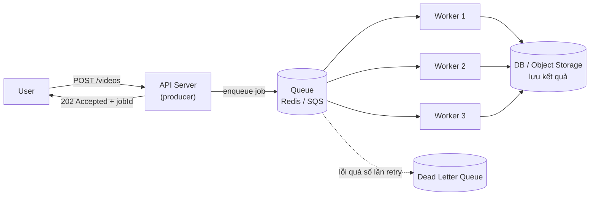
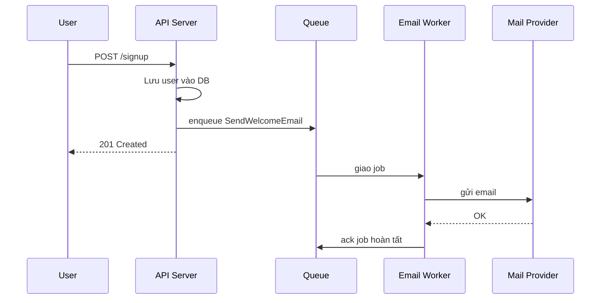
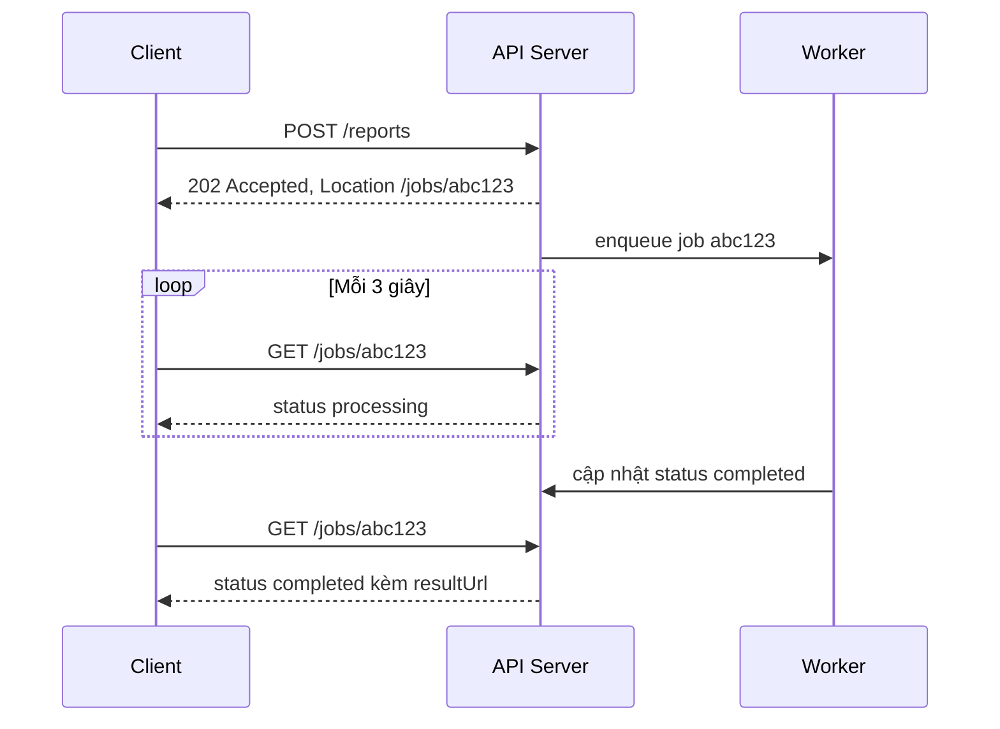
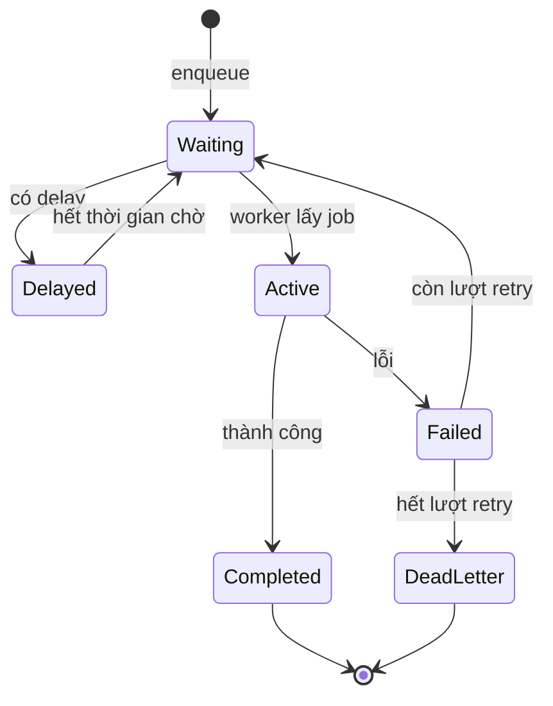

# Background Jobs

**Background job** (tác vụ nền) là những công việc được chạy **tách khỏi luồng request–response** của người dùng: gửi email, resize ảnh, xuất báo cáo, đồng bộ dữ liệu, tính điểm gợi ý... Thay vì bắt người dùng chờ, server ghi nhận yêu cầu, trả lời ngay, rồi để **worker** (tiến trình xử lý nền) làm phần nặng ở phía sau.

**Tương tự đơn giản:** Bạn mang áo vào tiệm giặt ủi. Nhân viên không bắt bạn đứng chờ máy giặt chạy xong — họ đưa **phiếu hẹn** (job id) rồi cho bạn về. Áo được giặt "ở phía sau", tới giờ bạn quay lại lấy, hoặc tiệm **gọi điện báo** khi xong. Phiếu hẹn chính là polling, cuộc gọi chính là callback/webhook.

---

:::note[Ghi nhớ nhanh]

- ⭐ **Background job = tách việc chậm ra khỏi request** — API trả `202 Accepted` + job id ngay, worker xử lý sau qua hàng đợi (queue).
- ⭐ **Hai kiểu kích hoạt:** **event-driven** (có sự kiện thì chạy — user upload ảnh) và **schedule-driven** (đến giờ thì chạy — cron 2h sáng).
- **Job phải idempotent** — chạy lại nhiều lần vẫn cho cùng kết quả, vì hầu hết queue chỉ đảm bảo **at-least-once** (ít nhất một lần).
- **Trả kết quả:** polling (client hỏi định kỳ), callback/webhook (server gọi lại), hoặc push qua WebSocket/SSE.
- **Luôn có retry + backoff + dead letter queue** — job lỗi không được biến mất âm thầm.

:::

---

## Mục lục

- [Vì sao cần Background Jobs?](#vì-sao-cần-background-jobs)
- [1. Background Jobs là gì?](#1-background-jobs-là-gì)
- [2. Kiến trúc producer, queue, worker](#2-kiến-trúc-producer-queue-worker)
- [3. Event-Driven Jobs](#3-event-driven-jobs)
- [4. Schedule-Driven Jobs](#4-schedule-driven-jobs)
- [5. Returning Results](#5-returning-results)
- [6. Độ tin cậy của job](#6-độ-tin-cậy-của-job)
- [7. Công cụ phổ biến](#7-công-cụ-phổ-biến)
- [Khi nào dùng?](#khi-nào-dùng)
- [Lỗi thường gặp](#lỗi-thường-gặp)
- [Câu hỏi phỏng vấn](#câu-hỏi-phỏng-vấn)

---

## Vì sao cần Background Jobs?

**Vấn đề:** Một request HTTP nên trả lời trong vài trăm mili-giây. Nhưng nhiều việc tốn **vài giây tới vài phút**: encode video, gọi API bên thứ ba chậm, gửi 10.000 email, sinh file PDF. Nếu làm đồng bộ (synchronous) trong request:

- User nhìn spinner rất lâu, dễ bấm lại → **gửi trùng**.
- Request bị **timeout** ở load balancer (thường 30–60 giây) dù việc vẫn đang chạy.
- Mỗi request giữ một connection/thread → **cạn tài nguyên** server khi tải tăng.
- Nếu API bên thứ ba sập, request của user cũng sập theo.

**Giải pháp:** Đẩy việc nặng vào **hàng đợi**, trả về ngay cho user, để **worker** chạy độc lập. Worker có thể scale riêng, retry riêng, chạy vào giờ thấp điểm, và không ảnh hưởng tới độ trễ của API chính.

:::tip[Dùng thực tế]

- **YouTube / TikTok:** video upload xong mới được transcode sang nhiều độ phân giải ở nền — user thấy trạng thái "Đang xử lý".
- **Shopify / sàn TMĐT:** đặt hàng xong, việc gửi email xác nhận, trừ kho, đẩy đơn sang đơn vị vận chuyển chạy bằng job.
- **GitHub Actions / CI:** push code tạo một job build–test chạy trên runner riêng, kết quả báo lại qua webhook và giao diện.
- **Ngân hàng / fintech:** đối soát giao dịch, chốt sổ cuối ngày chạy bằng job theo lịch (batch job) lúc nửa đêm.

:::

---

## 1. Background Jobs là gì?

Background job là một đơn vị công việc có **đầu vào rõ ràng** (payload), được **xếp hàng** và **thực thi bất đồng bộ** bởi một tiến trình khác với tiến trình nhận request.

Các đặc điểm chính:

| Đặc điểm | Ý nghĩa |
| --- | --- |
| **Bất đồng bộ (asynchronous)** | Người gọi không chờ kết quả ngay |
| **Tách tiến trình** | Worker chạy ở process/container/máy khác API |
| **Bền (durable)** | Job được lưu trong queue (Redis, RabbitMQ, SQS, DB) — server restart không mất |
| **Có thể retry** | Lỗi tạm thời thì chạy lại theo chính sách |
| **Có trạng thái** | `waiting` → `active` → `completed` / `failed` |

Theo Azure Architecture Center, background job thường được chia theo **cách kích hoạt**:

- **Event-driven** — kích hoạt bởi một sự kiện (user hành động, message đến queue, file mới trong storage).
- **Schedule-driven** — kích hoạt bởi thời gian (cron, timer, chạy một lần vào thời điểm định trước).

Và theo **loại công việc**:

- **CPU-intensive**: tính toán, xử lý ảnh/video, sinh báo cáo.
- **I/O-intensive**: gọi API ngoài, gửi email, ghi file lớn.
- **Batch**: xử lý hàng loạt bản ghi (import CSV, đối soát).
- **Long-running workflow**: nhiều bước, có thể kéo dài hàng giờ (onboarding khách hàng, xử lý đơn bảo hiểm).

---

## 2. Kiến trúc producer, queue, worker

Mô hình phổ biến nhất gồm 3 thành phần:

- **Producer** (thường là API server): tạo job và đẩy vào queue.
- **Queue / broker**: nơi lưu job chờ xử lý (Redis, RabbitMQ, Amazon SQS, Kafka...).
- **Worker / consumer**: lấy job ra, xử lý, cập nhật trạng thái.



Lợi ích của việc có queue ở giữa:

- **Giảm coupling** — API không cần biết worker nào, bao nhiêu worker.
- **San phẳng tải (load leveling)** — đỉnh traffic dồn vào queue, worker xử lý với tốc độ ổn định.
- **Scale độc lập** — queue dài thì thêm worker, không cần thêm API server.

Ví dụ với **BullMQ** (thư viện queue trên Redis cho Node.js):

```ts
// producer.ts — chạy trong API server
import { Queue } from 'bullmq';

const connection = { host: process.env.REDIS_HOST, port: 6379 };
export const videoQueue = new Queue('video-transcode', { connection });

// Route Express: nhận upload, đẩy job rồi trả về ngay
app.post('/videos', async (req, res) => {
  const video = await saveVideoMetadata(req.body); // ghi DB trạng thái "processing"
  const job = await videoQueue.add(
    'transcode',
    { videoId: video.id, sourceUrl: video.sourceUrl },
    {
      jobId: `transcode-${video.id}`, // id cố định → chống enqueue trùng
      attempts: 5,                    // retry tối đa 5 lần
      backoff: { type: 'exponential', delay: 2000 }, // 2s, 4s, 8s...
      removeOnComplete: 1000,
    },
  );
  res.status(202).json({ jobId: job.id, statusUrl: `/jobs/${job.id}` });
});
```

```ts
// worker.ts — chạy ở process/container riêng
import { Worker } from 'bullmq';

const worker = new Worker(
  'video-transcode',
  async (job) => {
    const { videoId, sourceUrl } = job.data;
    await job.updateProgress(10);
    const outputs = await transcode(sourceUrl, ['360p', '720p', '1080p']);
    await job.updateProgress(90);
    await markVideoReady(videoId, outputs); // idempotent: ghi đè theo videoId
    return { outputs };
  },
  { connection, concurrency: 4 }, // mỗi worker xử lý tối đa 4 job song song
);

worker.on('failed', (job, err) => {
  logger.error({ jobId: job?.id, err }, 'Transcode thất bại');
});
```

---

## 3. Event-Driven Jobs

**Event-driven job** chạy khi **có một sự kiện xảy ra**. Không có sự kiện thì worker nằm chờ.

Nguồn sự kiện phổ biến:

- **Hành động của user** — đăng ký tài khoản → job gửi email chào mừng.
- **Message tới queue/topic** — service Order publish `OrderCreated` → service Inventory trừ kho.
- **Thay đổi dữ liệu** — bản ghi mới trong DB (Change Data Capture), file mới trong S3 (S3 Event Notification → Lambda).
- **Webhook từ bên ngoài** — Stripe báo thanh toán thành công → job kích hoạt gói dịch vụ.



Đặc điểm cần lưu ý:

- **Độ trễ thấp** — job chạy gần như ngay sau sự kiện (vài ms tới vài giây tuỳ queue).
- **Tải không đều** — sự kiện tới theo đợt (flash sale) → cần autoscale worker theo **độ dài queue**.
- **Thứ tự** — nhiều queue không đảm bảo thứ tự tuyệt đối; nếu cần (vd các sự kiện của cùng một đơn hàng) phải dùng partition key (Kafka) hoặc FIFO queue (SQS FIFO) theo `orderId`.

---

## 4. Schedule-Driven Jobs

**Schedule-driven job** chạy theo **thời gian**, không phụ thuộc sự kiện:

- **Định kỳ (recurring)** — mỗi 5 phút đồng bộ tỷ giá, mỗi đêm 2h sáng tạo báo cáo, mỗi Chủ nhật dọn dữ liệu cũ.
- **Một lần vào thời điểm định trước (delayed)** — gửi nhắc nhở 24h trước lịch hẹn, huỷ đơn chưa thanh toán sau 15 phút.

Cú pháp **cron** (5 trường: phút, giờ, ngày trong tháng, tháng, ngày trong tuần):

```text
┌──────── phút (0-59)
│ ┌────── giờ (0-23)
│ │ ┌──── ngày trong tháng (1-31)
│ │ │ ┌── tháng (1-12)
│ │ │ │ ┌ ngày trong tuần (0-6, 0 = Chủ nhật)
│ │ │ │ │
0 2 * * *     → 2:00 sáng mỗi ngày
*/5 * * * *   → mỗi 5 phút
0 9 * * 1     → 9:00 sáng thứ Hai hằng tuần
```

Với BullMQ, có thể khai báo job lặp lại (repeatable) và job trì hoãn (delayed):

```ts
// Job lặp lại: báo cáo doanh thu lúc 2h sáng mỗi ngày (giờ Việt Nam)
await reportQueue.add(
  'daily-revenue',
  {},
  { repeat: { pattern: '0 2 * * *', tz: 'Asia/Ho_Chi_Minh' } },
);

// Job trì hoãn: tự huỷ đơn nếu sau 15 phút chưa thanh toán
await orderQueue.add(
  'cancel-if-unpaid',
  { orderId },
  { delay: 15 * 60 * 1000, jobId: `cancel-${orderId}` },
);
```

Trong Kubernetes, việc định kỳ thường dùng **CronJob**:

```yaml
apiVersion: batch/v1
kind: CronJob
metadata:
  name: cleanup-expired-sessions
spec:
  schedule: "0 3 * * *"
  concurrencyPolicy: Forbid      # lần trước chưa xong thì không chạy lần mới
  startingDeadlineSeconds: 600
  jobTemplate:
    spec:
      backoffLimit: 3
      template:
        spec:
          restartPolicy: OnFailure
          containers:
            - name: cleanup
              image: myapp/cleanup:1.4.2
```

### Bẫy riêng của schedule-driven

- **Chạy trùng khi có nhiều instance** — 3 server cùng chạy `node-cron` → báo cáo bị tạo 3 lần. Cách xử lý: chỉ một scheduler (leader election), dùng distributed lock (Redis `SET NX PX`), hoặc để queue quản lý lịch (BullMQ repeatable job được Redis đảm bảo chỉ tạo một lần mỗi lượt).
- **Lần chạy trước chưa xong** — job 5 phút nhưng chạy mất 7 phút → chồng lấn. Cần `concurrencyPolicy: Forbid` hoặc lock.
- **Múi giờ và giờ mùa hè (DST)** — luôn chỉ rõ timezone; lưu ý ở vùng có DST, một số giờ có thể bị bỏ qua hoặc chạy hai lần.
- **Bỏ lỡ lịch khi scheduler sập** — cần chính sách "catch-up" (chạy bù) hay bỏ qua.

---

## 5. Returning Results

Vì job chạy bất đồng bộ, câu hỏi tiếp theo là: **làm sao người gọi biết job đã xong và lấy kết quả?** Có ba cách chính.

### 5.1. Polling

Client gọi API kiểm tra trạng thái định kỳ. Đây là mẫu **Asynchronous Request-Reply** (Azure gọi như vậy):

1. Client `POST /reports` → server trả `202 Accepted` + header `Location: /jobs/abc123`.
2. Client `GET /jobs/abc123` mỗi vài giây → `{ "status": "processing", "progress": 40 }`.
3. Khi xong → `{ "status": "completed", "resultUrl": "/reports/abc123.pdf" }` (hoặc `303 See Other` tới tài nguyên kết quả).



```ts
// Endpoint trạng thái job
app.get('/jobs/:id', async (req, res) => {
  const job = await reportQueue.getJob(req.params.id);
  if (!job) return res.status(404).json({ error: 'Job không tồn tại' });

  const state = await job.getState(); // waiting | active | completed | failed | delayed
  if (state === 'completed') {
    return res.json({ status: 'completed', resultUrl: job.returnvalue.url });
  }
  res.set('Retry-After', '3'); // gợi ý client chờ 3 giây rồi hỏi lại
  res.json({ status: state, progress: job.progress });
});
```

- **Ưu điểm:** đơn giản, client không cần mở endpoint, chạy được sau firewall/NAT, dễ debug.
- **Nhược điểm:** tốn request vô ích, độ trễ phát hiện phụ thuộc chu kỳ poll. Nên dùng **backoff** (2s → 4s → 8s) và header `Retry-After`.

### 5.2. Callback / Webhook

Client đăng ký sẵn một URL; khi job xong, **server chủ động gọi lại** URL đó. Đây là cách Stripe, GitHub, Twilio thông báo sự kiện.

```ts
// Worker gọi webhook khi xong — có ký HMAC để bên nhận xác thực
import crypto from 'node:crypto';

async function notifyWebhook(url: string, payload: object, secret: string) {
  const body = JSON.stringify(payload);
  const signature = crypto.createHmac('sha256', secret).update(body).digest('hex');
  const res = await fetch(url, {
    method: 'POST',
    headers: { 'Content-Type': 'application/json', 'X-Signature': signature },
    body,
    signal: AbortSignal.timeout(5000),
  });
  if (!res.ok) throw new Error(`Webhook trả về ${res.status}`); // để queue retry
}
```

- **Ưu điểm:** thông báo gần như tức thì, không có request thừa.
- **Nhược điểm:** bên nhận phải có endpoint public; cần **retry** khi bên nhận sập, **ký chữ ký** (HMAC) để chống giả mạo, và bên nhận phải **idempotent** vì webhook có thể tới nhiều lần.

### 5.3. Push qua WebSocket / SSE / notification

Với ứng dụng web/mobile có user đang mở, server có thể đẩy kết quả qua **WebSocket**, **Server-Sent Events (SSE)** hoặc push notification. Phù hợp cho trải nghiệm thời gian thực (thanh tiến trình, "video của bạn đã sẵn sàng").

### So sánh

| Tiêu chí | Polling | Callback / Webhook | WebSocket / SSE |
| --- | --- | --- | --- |
| Độ trễ biết kết quả | Bằng chu kỳ poll | Gần tức thì | Gần tức thì |
| Tải lên server | Cao nếu poll dày | Thấp | Giữ connection mở |
| Yêu cầu phía client | Không | Endpoint public | Giữ kết nối |
| Độ phức tạp | Thấp | Trung bình (ký, retry) | Trung bình–cao |
| Hợp với | Mobile/web, script | Server-to-server | UI realtime |

:::tip[Chọn nhanh]

Server-to-server → **webhook** (kèm endpoint polling để đối soát khi webhook lỡ). Trình duyệt/app → **polling có backoff** là đủ cho đa số trường hợp; cần realtime mới dùng SSE/WebSocket.

:::

---

## 6. Độ tin cậy của job

### Vòng đời job



### Các nguyên tắc bắt buộc

- **Idempotency (tính luỹ đẳng):** đa số queue đảm bảo **at-least-once delivery** — worker có thể crash sau khi làm xong nhưng trước khi ack, job sẽ được giao lại. Job phải chạy lại an toàn: dùng khoá duy nhất (`idempotency key`), `UPSERT` thay cho `INSERT`, kiểm tra "đã gửi email cho orderId này chưa".
- **Retry với exponential backoff + jitter:** lỗi tạm thời (timeout, 503) nên thử lại với khoảng chờ tăng dần, thêm ngẫu nhiên để tránh nhiều job retry cùng lúc.
- **Dead Letter Queue (DLQ):** job lỗi quá số lần được chuyển sang hàng riêng để người xem xét, không chặn queue chính.
- **Timeout:** job treo phải bị kết thúc; BullMQ dùng cơ chế lock + "stalled job" để giao lại job của worker chết.
- **Graceful shutdown:** khi deploy, worker ngừng nhận job mới, chờ job đang chạy xong rồi mới thoát.
- **Payload nhỏ:** chỉ đưa ID vào job (`{ videoId }`), worker tự đọc dữ liệu mới nhất từ DB — tránh dữ liệu cũ và queue phình to.

```sql
-- Idempotency bằng ràng buộc UNIQUE: chạy lại cũng không tạo bản ghi trùng
INSERT INTO email_log (order_id, template, sent_at)
VALUES ($1, 'order_confirmation', now())
ON CONFLICT (order_id, template) DO NOTHING
RETURNING id;
-- Không có id trả về → email đã gửi trước đó, bỏ qua
```

### Theo dõi (monitoring)

Các chỉ số cần có: **độ dài queue**, **tuổi job cũ nhất đang chờ**, **tỷ lệ lỗi**, **thời gian xử lý p95**, **số job trong DLQ**. Queue dài liên tục tăng nghĩa là worker không theo kịp → cần scale hoặc tối ưu.

---

## 7. Công cụ phổ biến

| Công cụ | Ngôn ngữ / nền tảng | Broker | Ghi chú |
| --- | --- | --- | --- |
| **BullMQ** | Node.js | Redis | Delayed, repeatable, priority, flow (job cha–con) |
| **Sidekiq** | Ruby | Redis | Rất phổ biến trong Rails |
| **Celery** | Python | RabbitMQ / Redis | Có Celery Beat cho lịch |
| **Hangfire** | .NET | SQL Server / Redis | Có dashboard sẵn |
| **Spring Batch / Quartz** | Java | DB | Batch và lập lịch |
| **Amazon SQS + Lambda** | AWS | SQS | Serverless, scale tự động |
| **Kubernetes Job / CronJob** | Container | — | Job theo container |
| **Temporal** | Đa ngôn ngữ | Server riêng | Workflow dài, nhiều bước, có trạng thái bền |

Một số hệ thống dùng chính **database làm queue** (bảng `jobs` + `SELECT ... FOR UPDATE SKIP LOCKED` trong PostgreSQL, như thư viện pg-boss, Graphile Worker). Ưu điểm: không thêm hạ tầng, job được tạo **cùng transaction** với dữ liệu nghiệp vụ. Phù hợp quy mô vừa.

```sql
-- Worker lấy 1 job, các worker khác bỏ qua dòng đang bị khoá
UPDATE jobs SET status = 'active', started_at = now()
WHERE id = (
  SELECT id FROM jobs
  WHERE status = 'waiting' AND run_at <= now()
  ORDER BY run_at
  FOR UPDATE SKIP LOCKED
  LIMIT 1
)
RETURNING *;
```

---

## Khi nào dùng?

| Nên dùng background job | Không cần / không nên |
| --- | --- |
| Việc mất hơn ~1 giây (encode, PDF, gọi API chậm) | Việc nhanh, vài ms, user cần kết quả ngay |
| Gọi dịch vụ ngoài có thể lỗi/chậm (email, SMS, thanh toán đối soát) | Logic cần transaction đồng bộ với response (vd kiểm tra số dư trước khi trả lời) |
| Việc định kỳ (báo cáo, dọn dẹp, đồng bộ) | Hệ thống rất nhỏ mà thêm queue chỉ tăng độ phức tạp |
| Cần san phẳng tải đỉnh | User cần thấy kết quả ngay và không chấp nhận "đang xử lý" |
| Fan-out: một sự kiện kích hoạt nhiều việc | |

---

## Lỗi thường gặp

### Lỗi 1: Job không idempotent

Worker gửi email xong rồi crash trước khi ack → job chạy lại → khách nhận 2 email, tệ hơn là **bị trừ tiền 2 lần**. Luôn thiết kế job chạy lại an toàn: idempotency key, ràng buộc UNIQUE, kiểm tra trạng thái trước khi làm.

### Lỗi 2: Đưa cả object lớn vào payload

```ts
// SAI — nhét cả đơn hàng (có thể đã cũ khi worker chạy) vào queue
await queue.add('invoice', { order: fullOrderObjectWith500Items });

// ĐÚNG — chỉ đưa ID, worker đọc bản mới nhất
await queue.add('invoice', { orderId: order.id });
```

### Lỗi 3: Chạy cron trong mọi instance API

Dùng `setInterval`/`node-cron` trong API server rồi scale lên 4 instance → job chạy 4 lần. Tách scheduler ra một nơi duy nhất, hoặc dùng lock/queue hỗ trợ lịch phân tán.

### Lỗi 4: Enqueue trước khi commit transaction

API enqueue job rồi transaction DB bị rollback → worker chạy với `orderId` không tồn tại. Hoặc ngược lại: commit xong thì crash trước khi enqueue → mất job. Giải pháp: **Transactional Outbox** (ghi job vào bảng outbox cùng transaction, một tiến trình khác đẩy sang queue) hoặc dùng DB làm queue.

### Lỗi 5: Không có DLQ và cảnh báo

Job lỗi vĩnh viễn retry vô hạn chiếm worker, hoặc bị xoá âm thầm. Cần giới hạn số lần retry, chuyển vào DLQ, và cảnh báo khi DLQ có job.

---

## Câu hỏi phỏng vấn

Những câu thường gặp về chủ đề này. Tự trả lời trước, rồi bấm **Xem đáp án** để đối chiếu.

**1. Khi nào nên đưa một tác vụ thành background job?**

<details className="qa">
<summary>Xem đáp án</summary>

Khi tác vụ **chậm** (vượt ngưỡng latency chấp nhận được của API), **không cần kết quả ngay** để trả lời user, **phụ thuộc dịch vụ ngoài** dễ lỗi, hoặc cần **chạy định kỳ**. Lợi ích: API phản hồi nhanh, tách lỗi, scale worker độc lập, san phẳng tải đỉnh. Đổi lại: thêm hạ tầng (queue), xử lý eventual consistency và trạng thái "đang xử lý" ở UI.

</details>

**2. Event-driven và schedule-driven job khác nhau thế nào? Cho ví dụ.**

<details className="qa">
<summary>Xem đáp án</summary>

- **Event-driven:** kích hoạt bởi sự kiện — user đăng ký → gửi email; file upload lên S3 → tạo thumbnail; message `OrderCreated` → trừ kho. Tải phụ thuộc lượng sự kiện, cần autoscale theo độ dài queue.
- **Schedule-driven:** kích hoạt bởi thời gian — cron báo cáo 2h sáng, dọn session hết hạn, huỷ đơn chưa thanh toán sau 15 phút (delayed job). Rủi ro chính: chạy trùng khi nhiều instance, chồng lấn khi lần trước chưa xong, múi giờ.

</details>

**3. Làm sao trả kết quả của một job bất đồng bộ cho client?**

<details className="qa">
<summary>Xem đáp án</summary>

- **Polling:** API trả `202 Accepted` + URL trạng thái; client gọi định kỳ (có backoff, `Retry-After`). Đơn giản, không cần endpoint phía client.
- **Callback/Webhook:** server gọi lại URL client đã đăng ký khi xong. Gần tức thì nhưng cần ký HMAC, retry, và bên nhận phải idempotent.
- **Push (WebSocket/SSE/notification):** cho UI realtime.

Thực tế thường kết hợp: webhook để nhanh + endpoint polling để đối soát khi webhook bị lỡ.

</details>

**4. Vì sao job cần idempotent? Làm thế nào để đạt được?**

<details className="qa">
<summary>Xem đáp án</summary>

Vì đa số queue đảm bảo **at-least-once**: worker có thể xử lý xong nhưng crash trước khi ack → job bị giao lại; retry do timeout cũng có thể chạy lại việc đã thành công. Cách đạt idempotent: idempotency key (vd `orderId + loại việc`), ràng buộc UNIQUE + `ON CONFLICT DO NOTHING`, UPSERT, kiểm tra trạng thái trước khi làm, gửi idempotency key sang API bên thứ ba (Stripe hỗ trợ header `Idempotency-Key`).

</details>

**5. Bạn có 5 instance API, mỗi instance chạy một cron gửi báo cáo hằng ngày. Vấn đề gì xảy ra và sửa thế nào?**

<details className="qa">
<summary>Xem đáp án</summary>

Báo cáo bị gửi **5 lần**. Cách sửa:

- Tách scheduler thành một deployment riêng chỉ 1 replica (hoặc Kubernetes CronJob với `concurrencyPolicy: Forbid`).
- Dùng **distributed lock** (Redis `SET key value NX PX ttl`) — instance nào lấy được lock mới chạy.
- Dùng queue hỗ trợ repeatable job (BullMQ, Sidekiq-cron) để chỉ một job được tạo cho mỗi lượt.
- Kết hợp idempotency: khoá theo ngày báo cáo để có chạy trùng cũng không gửi trùng.

</details>

**6. Dead Letter Queue là gì và tại sao cần?**

<details className="qa">
<summary>Xem đáp án</summary>

DLQ là hàng đợi riêng chứa các message/job **đã thất bại quá số lần retry** (hoặc không thể parse). Nếu không có DLQ, job lỗi vĩnh viễn ("poison message") sẽ retry mãi chiếm tài nguyên, hoặc bị bỏ mất không ai biết. Với DLQ, ta cảnh báo, điều tra nguyên nhân, sửa bug rồi **replay** job từ DLQ về queue chính.

</details>
