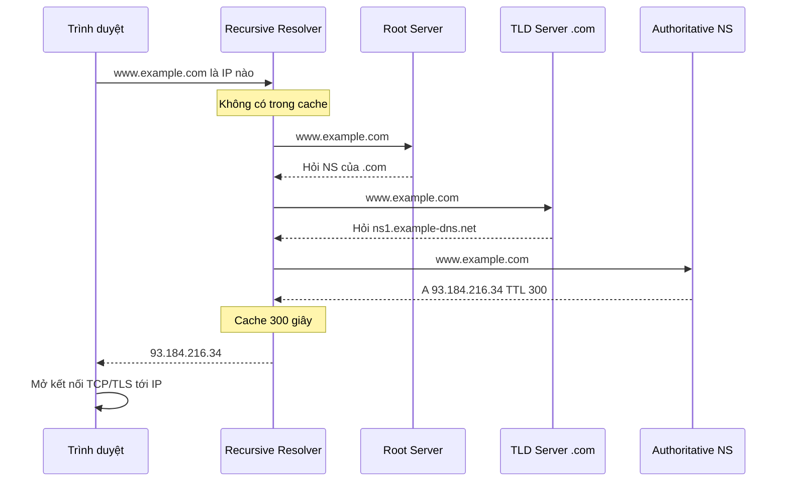
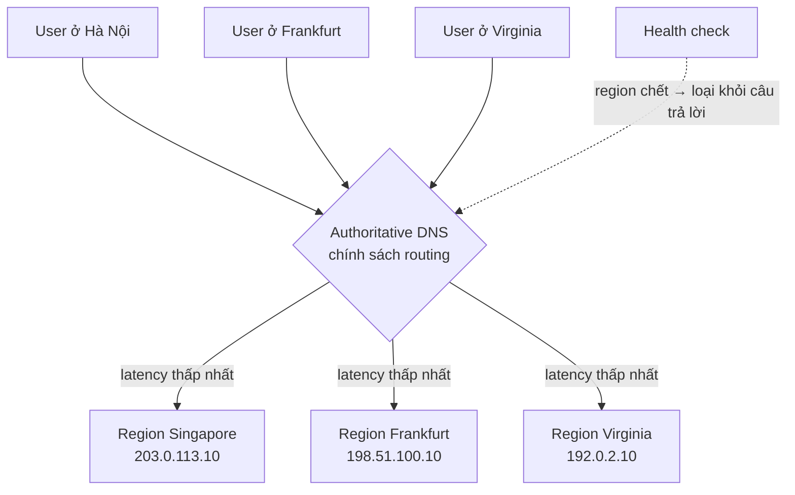

# Domain Name System (DNS)

**DNS (Domain Name System)** là hệ thống phân giải **tên miền** dễ nhớ (như `shop.example.com`) thành **địa chỉ IP** mà máy tính dùng để kết nối (như `93.184.216.34`). Đây là một cơ sở dữ liệu **phân tán, phân cấp** khổng lồ, và là bước đầu tiên của gần như mọi request trên Internet.

**Tương tự đơn giản:** DNS giống **danh bạ điện thoại** của Internet. Bạn nhớ tên "Nhà hàng Phở Hà Nội", không nhớ số điện thoại; danh bạ tra tên ra số. Nếu không tự có trong danh bạ, bạn hỏi tổng đài 1080, tổng đài lại hỏi tiếp các tổng đài cấp dưới cho tới khi tìm ra.

---

:::note[Ghi nhớ nhanh]

- ⭐ **DNS dịch tên miền → IP theo cấu trúc phân cấp** — Root → TLD (`.com`, `.vn`) → Authoritative name server của domain.
- ⭐ **Cache + TTL là chìa khoá** — kết quả được cache ở trình duyệt, OS, resolver; TTL quyết định bao lâu thay đổi DNS mới có hiệu lực.
- **Record hay gặp:** `A` (IPv4), `AAAA` (IPv6), `CNAME` (bí danh), `NS` (name server), `MX` (mail), `TXT` (xác minh, SPF/DKIM).
- **DNS cũng là công cụ định tuyến** — trả IP khác nhau theo latency, vị trí địa lý (geo), trọng số (weighted), hoặc failover.
- **Nhược điểm:** độ trễ tra cứu, thay đổi lan truyền chậm do cache, là mục tiêu tấn công DDoS (Dyn 2016), cấu hình sai có thể làm sập cả hệ thống.

:::

---

## Mục lục

- [Vì sao cần DNS?](#vì-sao-cần-dns)
- [1. DNS là gì?](#1-dns-là-gì)
- [2. Quá trình phân giải tên miền](#2-quá-trình-phân-giải-tên-miền)
- [3. Các loại DNS record](#3-các-loại-dns-record)
- [4. TTL và cache](#4-ttl-và-cache)
- [5. Định tuyến bằng DNS](#5-định-tuyến-bằng-dns)
- [6. Nhược điểm của DNS](#6-nhược-điểm-của-dns)
- [Khi nào dùng?](#khi-nào-dùng)
- [Lỗi thường gặp](#lỗi-thường-gặp)
- [Câu hỏi phỏng vấn](#câu-hỏi-phỏng-vấn)

---

## Vì sao cần DNS?

**Vấn đề:** Máy tính kết nối với nhau bằng địa chỉ IP. Con người không thể nhớ hàng triệu dãy số, và IP của một dịch vụ **thay đổi liên tục** (đổi server, đổi nhà cung cấp cloud, thêm máy chủ ở vùng mới). Thời ARPANET, mọi máy dùng một file `HOSTS.TXT` duy nhất do SRI-NIC duy trì và phân phát — khi số máy tăng lên, file này không thể cập nhật kịp, xung đột tên và tải tải xuống trở thành nút thắt.

**Giải pháp:** DNS (được định nghĩa năm 1983, chuẩn hoá trong RFC 1034/1035 năm 1987) chia không gian tên thành **cây phân cấp** và **uỷ quyền (delegate)** cho từng tổ chức quản lý phần của mình. Không có máy chủ nào phải biết tất cả; kết hợp với cache, hệ thống phục vụ hàng nghìn tỷ truy vấn mỗi ngày.

:::tip[Dùng thực tế]

- **Đổi server không đổi địa chỉ:** chuyển website từ VPS sang AWS chỉ cần sửa record `A`, user vẫn gõ cùng tên miền.
- **Netflix, Amazon dùng Route 53** để định tuyến user tới vùng gần nhất và failover khi một vùng gặp sự cố.
- **Xác minh quyền sở hữu domain:** Google Search Console, Let's Encrypt (DNS-01 challenge) yêu cầu thêm record `TXT`.
- **Email:** Gmail, Microsoft 365 dựa vào record `MX`, SPF, DKIM, DMARC (đều nằm trong DNS) để nhận và chống giả mạo thư.

:::

---

## 1. DNS là gì?

DNS là hệ thống gồm nhiều loại máy chủ phối hợp:

| Thành phần | Vai trò | Ví dụ |
| --- | --- | --- |
| **Stub resolver** | Thư viện trong OS của máy client, gửi câu hỏi tới resolver | `getaddrinfo()` trong Linux |
| **Recursive resolver** | Đi hỏi thay client, cache kết quả | `8.8.8.8` (Google), `1.1.1.1` (Cloudflare), resolver của ISP |
| **Root name server** | Biết name server của các TLD | 13 địa chỉ `a.root-servers.net` → `m.root-servers.net`, chạy trên hàng trăm máy nhờ Anycast |
| **TLD name server** | Biết name server của từng domain trong TLD | Server của `.com` (Verisign), `.vn` (VNNIC) |
| **Authoritative name server** | Nguồn sự thật của domain, trả lời record cụ thể | Route 53, Cloudflare DNS, NS1 |

Cấu trúc tên miền đọc **từ phải sang trái**:

```text
www.shop.example.com.
 │    │     │     │  └── root (dấu chấm cuối, thường ẩn)
 │    │     │     └───── TLD (Top-Level Domain): com
 │    │     └─────────── Second-level domain: example
 │    └───────────────── Subdomain: shop
 └────────────────────── Subdomain: www
```

---

## 2. Quá trình phân giải tên miền

Khi gõ `www.example.com` vào trình duyệt:

1. **Cache trình duyệt** → nếu có và còn hạn, dùng luôn.
2. **Cache OS** (và file `/etc/hosts`).
3. Stub resolver gửi **truy vấn đệ quy (recursive query)** tới recursive resolver: "hãy trả lời tôi đầy đủ".
4. Resolver (nếu chưa cache) thực hiện các **truy vấn lặp (iterative query)**:
   - Hỏi **root**: "`www.example.com` ở đâu?" → root: "Tôi không biết, hỏi name server của `.com` ở đây".
   - Hỏi **TLD `.com`** → "Hỏi name server của `example.com`: `ns1.example-dns.net`".
   - Hỏi **authoritative** → "`www.example.com` có `A` = `93.184.216.34`, TTL 300".
5. Resolver cache kết quả theo TTL và trả về cho client.



**Recursive vs iterative:**

- **Recursive query:** người hỏi muốn **câu trả lời cuối cùng** — client hỏi resolver kiểu này.
- **Iterative query:** server trả lời "tôi không biết, nhưng hãy hỏi chỗ kia" (referral) — resolver hỏi root/TLD kiểu này.

Trong thực tế, resolver gần như luôn có sẵn cache cho root và TLD phổ biến, nên một truy vấn "lạnh" thường chỉ cần hỏi authoritative. Truy vấn trúng cache resolver có thể mất chỉ vài ms; truy vấn lạnh có thể mất hàng chục tới vài trăm ms tuỳ vị trí.

Có thể tự quan sát bằng `dig`:

```bash
# Xem toàn bộ chuỗi phân giải từ root
dig +trace www.example.com

# Hỏi một resolver cụ thể, chỉ in kết quả
dig @1.1.1.1 www.example.com A +short

# Xem TTL còn lại trong cache resolver (cột thứ 2)
dig www.example.com A +noall +answer
```

---

## 3. Các loại DNS record

| Record | Ý nghĩa | Ví dụ |
| --- | --- | --- |
| **A** | Tên → địa chỉ IPv4 | `api.example.com. 300 IN A 203.0.113.10` |
| **AAAA** | Tên → địa chỉ IPv6 | `api.example.com. 300 IN AAAA 2001:db8::10` |
| **CNAME** | Bí danh: tên này là tên khác | `www.example.com. 3600 IN CNAME example.com.` |
| **NS** | Name server có thẩm quyền của zone | `example.com. 86400 IN NS ns1.dnsprovider.net.` |
| **MX** | Máy chủ nhận mail (kèm độ ưu tiên, số nhỏ ưu tiên hơn) | `example.com. 3600 IN MX 10 mail1.example.com.` |
| **TXT** | Văn bản tuỳ ý — SPF, DKIM, xác minh domain | `example.com. 300 IN TXT "v=spf1 include:_spf.google.com ~all"` |
| **SOA** | Thông tin quản trị zone (serial, refresh, TTL mặc định cho negative cache) | Mỗi zone có đúng 1 |
| **SRV** | Vị trí dịch vụ (host + port) | `_sip._tcp.example.com` |
| **CAA** | CA nào được phép cấp chứng chỉ TLS cho domain | `0 issue "letsencrypt.org"` |
| **PTR** | Phân giải ngược IP → tên | Dùng cho kiểm tra mail server |

Ví dụ một zone file thu gọn:

```text
$ORIGIN example.com.
$TTL 3600
@       IN  SOA   ns1.dnsprovider.net. admin.example.com. (
                  2026100101 ; serial
                  7200       ; refresh
                  3600       ; retry
                  1209600    ; expire
                  300 )      ; negative cache TTL
@       IN  NS    ns1.dnsprovider.net.
@       IN  NS    ns2.dnsprovider.net.
@       IN  A     203.0.113.10
www     IN  CNAME example.com.
api 60  IN  A     203.0.113.20
@       IN  MX    10 mail1.example.com.
@       IN  TXT   "v=spf1 include:_spf.google.com ~all"
```

### Lưu ý về CNAME

- **CNAME không được đặt ở apex (root domain)** như `example.com` vì apex bắt buộc có `SOA` và `NS`, mà CNAME không được tồn tại cùng record khác. Các nhà cung cấp giải quyết bằng record "ảo": **ALIAS** / **ANAME** / **CNAME flattening** (Cloudflare) hoặc **Alias record** (Route 53) — resolve CNAME phía server rồi trả `A`.
- **Chuỗi CNAME dài** (`www` → `cdn.provider` → `edge.provider` → IP) tăng thời gian phân giải.

---

## 4. TTL và cache

**TTL (Time To Live)** là số giây một bản ghi được phép nằm trong cache trước khi phải hỏi lại.

| TTL | Ưu điểm | Nhược điểm | Hợp với |
| --- | --- | --- | --- |
| **Ngắn (30–60s)** | Đổi IP/failover có hiệu lực nhanh | Nhiều truy vấn hơn, latency trung bình cao hơn, tốn phí DNS | Record cần failover, endpoint động |
| **Trung bình (300s)** | Cân bằng | — | Mặc định cho đa số record |
| **Dài (3600–86400s)** | Ít truy vấn, nhanh vì trúng cache | Thay đổi lan truyền rất chậm | `NS`, `MX`, record hầu như không đổi |

**Quy trình đổi IP an toàn (migration):**

1. Vài ngày trước: **hạ TTL** xuống 60s (phải chờ hết TTL cũ để cache khắp nơi nhận TTL mới).
2. Đổi record sang IP mới; giữ server cũ chạy song song.
3. Theo dõi traffic chuyển dần sang server mới.
4. Khi ổn định: **tăng TTL** trở lại.

:::warning[TTL không được tôn trọng tuyệt đối]

Một số resolver, OS, hoặc runtime cache lâu hơn TTL (ví dụ JVM cũ từng cache DNS vĩnh viễn khi bật security manager; nhiều app mobile/HTTP client tự giữ kết nối và không phân giải lại). Vì vậy khi chuyển IP vẫn phải **giữ server cũ một thời gian** chứ không tắt ngay khi hết TTL.

:::

Ngoài ra còn **negative caching**: câu trả lời "không tồn tại" (`NXDOMAIN`) cũng bị cache theo giá trị trong `SOA`. Nếu bạn truy vấn một subdomain trước khi tạo nó, có thể phải chờ một lúc mới thấy.

---

## 5. Định tuyến bằng DNS

Authoritative DNS hiện đại (Route 53, Cloudflare, Azure Traffic Manager, NS1) không chỉ trả một IP cố định mà có thể **chọn câu trả lời** theo chính sách. Đây là dạng **load balancing toàn cầu (GSLB — Global Server Load Balancing)** ở tầng DNS.



| Chính sách | Cách hoạt động | Dùng khi |
| --- | --- | --- |
| **Simple / Round-robin** | Trả nhiều IP, thứ tự xoay vòng | Phân tải đơn giản giữa vài server |
| **Weighted** | Trả IP theo tỷ lệ trọng số (vd 90/10) | Canary release, chuyển dần traffic sang hạ tầng mới |
| **Latency-based** | Trả region có độ trễ đo được thấp nhất tới resolver | App đa vùng, muốn nhanh nhất |
| **Geolocation** | Theo quốc gia/châu lục của user | Tuân thủ luật dữ liệu, nội dung theo vùng, chặn quốc gia |
| **Geoproximity** | Theo khoảng cách địa lý, có thể "kéo" thêm vùng (bias) | Điều chỉnh vùng phục vụ |
| **Failover** | Trả primary; health check fail → trả secondary | Active–passive disaster recovery |
| **Multivalue** | Trả nhiều IP khoẻ mạnh (đã health check) | Client tự chọn, kèm health check |

Ví dụ weighted record với Terraform cho Route 53:

```hcl
resource "aws_route53_record" "api_blue" {
  zone_id        = aws_route53_zone.main.zone_id
  name           = "api.example.com"
  type           = "A"
  ttl            = 60
  set_identifier = "blue"
  records        = ["203.0.113.10"]
  weighted_routing_policy { weight = 90 }   # 90% traffic
}

resource "aws_route53_record" "api_green" {
  zone_id        = aws_route53_zone.main.zone_id
  name           = "api.example.com"
  type           = "A"
  ttl            = 60
  set_identifier = "green"
  records        = ["203.0.113.20"]
  weighted_routing_policy { weight = 10 }   # 10% traffic → bản mới
}
```

**Giới hạn của routing bằng DNS:**

- DNS thấy **IP của resolver**, không phải IP user. User dùng `8.8.8.8` có thể bị coi ở vị trí của resolver. Phần mở rộng **EDNS Client Subnet (ECS)** gửi kèm một phần subnet của client để cải thiện, nhưng không phải resolver nào cũng hỗ trợ (Cloudflare `1.1.1.1` không gửi ECS vì lý do riêng tư).
- Tỷ lệ weighted chỉ đúng **xấp xỉ**, vì một câu trả lời được cache và dùng cho rất nhiều user sau cùng resolver.
- Failover chậm ít nhất bằng **TTL** + thời gian health check phát hiện lỗi.

Vì vậy DNS thường là **tầng định tuyến thô** (chọn region), còn phân tải chi tiết bên trong region do **load balancer** đảm nhiệm.

---

## 6. Nhược điểm của DNS

- **Thêm độ trễ:** mỗi lần cache miss là một vòng phân giải. Giảm bằng TTL hợp lý, `dns-prefetch` / `preconnect` trong HTML, giữ kết nối lâu (keep-alive).
- **Thay đổi lan truyền chậm:** do cache nhiều tầng; không có cách "xoá cache" toàn Internet.
- **Quản lý phức tạp:** thường được quản lý bởi chính phủ, ISP và công ty lớn; cấu hình sai (xoá nhầm NS, sai CNAME) có thể khiến **toàn bộ** dịch vụ không truy cập được.
- **Mục tiêu tấn công DDoS:** sự cố tấn công vào nhà cung cấp DNS **Dyn** (tháng 10/2016, botnet Mirai) khiến Twitter, GitHub, Netflix, Reddit... không truy cập được ở nhiều nơi dù server của họ vẫn chạy bình thường. Bài học: dùng **nhiều nhà cung cấp DNS** (thêm NS từ hai provider).
- **Bảo mật:** DNS truyền thống không mã hoá, không xác thực → bị **DNS spoofing / cache poisoning**. Giải pháp:
  - **DNSSEC** — ký số record để resolver kiểm chứng tính toàn vẹn.
  - **DoH (DNS over HTTPS)** / **DoT (DNS over TLS)** — mã hoá đường truyền giữa client và resolver.
- **Sự cố do chính hệ thống nội bộ:** nhiều sự cố lớn bắt nguồn từ DNS — ví dụ sự cố Facebook tháng 10/2021: một thay đổi cấu hình BGP rút route tới các DNS server của Facebook, khiến toàn bộ dịch vụ biến mất khỏi Internet nhiều giờ.

---

## Khi nào dùng?

- **Luôn cần DNS** cho mọi dịch vụ public — câu hỏi là **dùng tính năng nào**:
- **Dùng DNS routing khi:**
  - Có nhiều region và muốn đưa user tới region gần nhất (latency/geo).
  - Cần failover giữa các data center (active–passive).
  - Muốn canary/blue-green ở mức hạ tầng (weighted).
- **KHÔNG nên dựa vào DNS khi:**
  - Cần chuyển traffic **trong vài giây** — dùng load balancer hoặc Anycast.
  - Cần phân tải đều chính xác giữa các server trong cùng cụm — dùng L4/L7 load balancer.
  - Cần sticky session theo user — DNS không biết user là ai.
- **Best practice:**
  - Dùng managed DNS có Anycast và SLA cao; cân nhắc 2 provider cho hệ thống quan trọng.
  - TTL 300s mặc định, 60s cho record cần failover; hạ TTL trước khi migration.
  - Quản lý DNS bằng code (Terraform, OctoDNS) để review và rollback.

---

## Lỗi thường gặp

### Lỗi 1: Đổi IP rồi tắt server cũ ngay

TTL cũ là 86400s (1 ngày) → nhiều user vẫn dùng IP cũ tới 24 giờ, cộng thêm client cache lâu hơn TTL. Phải hạ TTL **trước** và giữ server cũ chạy song song.

### Lỗi 2: Đặt CNAME ở root domain

```text
; SAI — CNAME ở apex xung đột với SOA/NS
example.com.  IN CNAME  myapp.herokuapp.com.

; ĐÚNG — dùng ALIAS/ANAME/CNAME flattening của provider, hoặc A record
example.com.  IN ALIAS  myapp.herokuapp.com.
www           IN CNAME  myapp.herokuapp.com.
```

### Lỗi 3: Dùng DNS round-robin như load balancer thật

DNS không biết server nào đang chết hay quá tải (trừ khi có health check), client cache một IP và dồn hết vào đó. Round-robin DNS chỉ phân tải "thô"; hãy đặt load balancer phía sau.

### Lỗi 4: Ứng dụng cache DNS vĩnh viễn

Connection pool hoặc runtime phân giải một lần lúc khởi động rồi không bao giờ phân giải lại → khi database failover sang IP mới, app vẫn gọi IP cũ. Cấu hình TTL cho DNS cache trong runtime (vd `networkaddress.cache.ttl` của Java) và giới hạn tuổi kết nối.

### Lỗi 5: Chỉ có một nhà cung cấp DNS

Provider DNS sập = dịch vụ của bạn "biến mất" dù server khoẻ. Với hệ thống quan trọng, khai báo NS của hai provider và đồng bộ zone giữa chúng.

---

## Câu hỏi phỏng vấn

Những câu thường gặp về chủ đề này. Tự trả lời trước, rồi bấm **Xem đáp án** để đối chiếu.

**1. Điều gì xảy ra khi bạn gõ `www.example.com` vào trình duyệt (phần DNS)?**

<details className="qa">
<summary>Xem đáp án</summary>

Trình duyệt kiểm tra cache của nó → cache OS / file hosts → gửi truy vấn đệ quy tới recursive resolver (ISP, `8.8.8.8`...). Nếu resolver chưa cache, nó hỏi lặp: root server → TLD server `.com` → authoritative name server của `example.com`, nhận record `A`/`AAAA` kèm TTL, cache lại và trả về. Sau đó trình duyệt mới mở kết nối TCP/TLS tới IP đó.

</details>

**2. Phân biệt record A, AAAA, CNAME, NS, MX, TXT.**

<details className="qa">
<summary>Xem đáp án</summary>

- **A:** tên → IPv4. **AAAA:** tên → IPv6.
- **CNAME:** tên này là bí danh của tên khác; không dùng ở apex, không đi kèm record khác cùng tên.
- **NS:** chỉ ra name server có thẩm quyền của zone (dùng để uỷ quyền).
- **MX:** máy chủ nhận mail, kèm độ ưu tiên.
- **TXT:** văn bản tuỳ ý — SPF, DKIM, DMARC, xác minh domain.

</details>

**3. TTL ảnh hưởng gì đến hệ thống? Bạn chọn TTL thế nào?**

<details className="qa">
<summary>Xem đáp án</summary>

TTL là thời gian record được cache. TTL ngắn → thay đổi/failover nhanh nhưng nhiều truy vấn hơn và latency trung bình tăng. TTL dài → ít truy vấn, nhanh, nhưng thay đổi lan truyền chậm. Thường: 300s mặc định, 60s cho record cần failover, 1 ngày cho NS/MX ít đổi. Trước khi migration thì hạ TTL trước một khoảng bằng TTL cũ.

</details>

**4. Làm sao đưa user tới data center gần nhất? Hạn chế của cách dùng DNS?**

<details className="qa">
<summary>Xem đáp án</summary>

Dùng DNS **latency-based** hoặc **geolocation routing** (Route 53, Cloudflare, Traffic Manager) kèm health check; hoặc dùng **Anycast** (cùng một IP quảng bá từ nhiều nơi, BGP đưa gói tin tới điểm gần nhất). Hạn chế của DNS: chỉ thấy IP của resolver (trừ khi có ECS), bị cache nên failover chậm ít nhất bằng TTL, tỷ lệ phân tải không chính xác. Vì vậy DNS dùng để chọn region, còn load balancer phân tải bên trong region.

</details>

**5. Nêu các rủi ro/nhược điểm của DNS và cách giảm thiểu.**

<details className="qa">
<summary>Xem đáp án</summary>

- **Độ trễ phân giải** → cache, TTL hợp lý, `dns-prefetch`, keep-alive.
- **Lan truyền chậm** → hạ TTL trước khi đổi, giữ hạ tầng cũ chạy song song.
- **DDoS vào DNS provider** (Dyn 2016) → dùng nhiều provider, provider có Anycast.
- **Spoofing / cache poisoning** → DNSSEC; DoH/DoT để mã hoá.
- **Cấu hình sai** → quản lý bằng code, review, có rollback.

</details>

**6. Vì sao không thể đặt CNAME ở root domain và giải pháp là gì?**

<details className="qa">
<summary>Xem đáp án</summary>

Theo chuẩn DNS, một tên có CNAME thì không được có record nào khác. Apex domain bắt buộc có `SOA` và `NS`, nên không thể đặt CNAME ở đó. Giải pháp: dùng record **ALIAS / ANAME / CNAME flattening** (Cloudflare) hoặc **Alias record** (Route 53) — provider tự phân giải đích rồi trả về `A`/`AAAA`; hoặc đặt `A` trỏ tới IP tĩnh/Anycast của dịch vụ.

</details>
