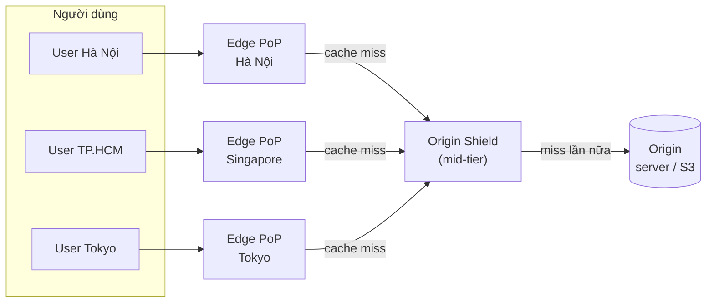
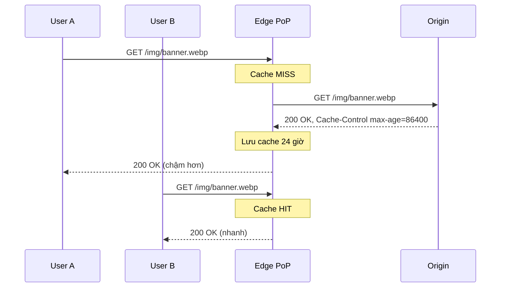
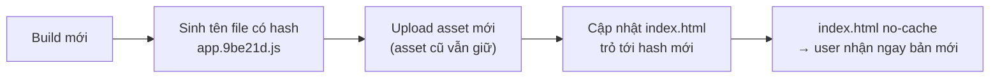

# Content Delivery Networks (CDN)

**CDN (Content Delivery Network)** là mạng lưới các máy chủ proxy được đặt ở **rất nhiều điểm trên thế giới** (gọi là **PoP — Point of Presence** hay **edge server**), dùng để lưu bản sao nội dung và phục vụ user từ vị trí **gần họ nhất**. Nội dung thường là file tĩnh (ảnh, CSS, JS, video), nhưng CDN hiện đại cũng tăng tốc cả API và HTML động.

**Tương tự đơn giản:** Thay vì mọi người ở cả nước phải ra **kho tổng ở Hà Nội** lấy hàng, công ty đặt **kho nhỏ ở từng tỉnh**. Người ở Cần Thơ lấy hàng ở kho Cần Thơ — nhanh hơn, và kho tổng không bị quá tải. CDN chính là hệ thống kho tỉnh đó, còn server của bạn là kho tổng (gọi là **origin**).

---

:::note[Ghi nhớ nhanh]

- ⭐ **CDN = cache ở edge gần user** — giảm latency (đường đi ngắn hơn) và giảm tải cho origin (phần lớn request không tới origin).
- ⭐ **Pull CDN** (phổ biến nhất): edge tự kéo từ origin khi có request đầu tiên rồi cache theo TTL. **Push CDN**: bạn chủ động upload nội dung lên CDN.
- **Header `Cache-Control` điều khiển hành vi cache** — `max-age`, `s-maxage`, `no-store`, `immutable`, `stale-while-revalidate`.
- **Đặt tên file có hash** (`app.3f9a1c.js`) + cache rất lâu — đổi nội dung là đổi URL, không cần invalidation.
- **Invalidation (purge) là phương án cuối** — chậm, có thể tốn phí, dễ sót; ưu tiên versioning URL.

:::

---

## Mục lục

- [Vì sao cần CDN?](#vì-sao-cần-cdn)
- [1. CDN là gì và hoạt động thế nào?](#1-cdn-là-gì-và-hoạt-động-thế-nào)
- [2. Pull CDNs](#2-pull-cdns)
- [3. Push CDNs](#3-push-cdns)
- [4. So sánh Push và Pull](#4-so-sánh-push-và-pull)
- [5. Điều khiển cache bằng Cache-Control](#5-điều-khiển-cache-bằng-cache-control)
- [6. Invalidation và versioning](#6-invalidation-và-versioning)
- [7. Lợi ích khác và nhược điểm của CDN](#7-lợi-ích-khác-và-nhược-điểm-của-cdn)
- [Khi nào dùng?](#khi-nào-dùng)
- [Lỗi thường gặp](#lỗi-thường-gặp)
- [Câu hỏi phỏng vấn](#câu-hỏi-phỏng-vấn)

---

## Vì sao cần CDN?

**Vấn đề:** Ánh sáng trong cáp quang đi khoảng 200.000 km/s. Một vòng đi–về giữa Việt Nam và Mỹ (~13.000 km mỗi chiều) tốn tối thiểu khoảng 130 ms chỉ riêng vật lý, thực tế thường 180–250 ms. Một trang web cần mở kết nối TCP + TLS (nhiều vòng đi–về) rồi tải hàng chục file → trang có thể chậm vài giây nếu server ở xa. Đồng thời, nếu mọi request đều về một origin, origin phải chịu toàn bộ băng thông và dễ sập khi có đỉnh traffic.

**Giải pháp:** Đặt bản sao nội dung ở hàng trăm PoP. User kết nối tới PoP gần nhất (thường vài ms tới vài chục ms), TLS được "kết thúc" ngay tại edge, và phần lớn nội dung được phục vụ từ cache. Origin chỉ nhận phần nhỏ request (cache miss).

:::tip[Dùng thực tế]

- **Netflix Open Connect:** Netflix đặt thiết bị cache ngay trong mạng của ISP để phục vụ video — phần lớn traffic xem phim không đi qua Internet đường dài.
- **Website tĩnh / SPA:** React/Vue build ra file tĩnh, đưa lên S3 + CloudFront, Cloudflare Pages, Vercel, Netlify — phục vụ hoàn toàn từ edge.
- **Thương mại điện tử:** Shopee, Tiki, Amazon dùng CDN cho ảnh sản phẩm (thường kèm resize/convert WebP/AVIF ngay tại edge).
- **Phân phối phần mềm / game:** bản cập nhật Windows, game Steam hàng chục GB phân phối qua CDN để chịu đỉnh khi phát hành.

:::

---

## 1. CDN là gì và hoạt động thế nào?

Các thành phần chính:

| Thành phần | Vai trò |
| --- | --- |
| **Origin** | Nguồn gốc nội dung: web server của bạn, S3 bucket, storage |
| **Edge server / PoP** | Máy chủ CDN gần user, giữ cache và phục vụ request |
| **Mid-tier / Origin shield** | Tầng cache trung gian giữa edge và origin — gom các cache miss lại để origin ít bị gọi |
| **Định tuyến tới edge** | Dùng DNS (trả IP của PoP gần nhất) hoặc **Anycast** (cùng IP quảng bá ở mọi PoP, BGP đưa gói tin tới PoP gần) |



Luồng xử lý một request:

1. User gọi `https://cdn.example.com/img/logo.png`. DNS / Anycast đưa user tới PoP gần nhất.
2. Edge tính **cache key** (thường là host + path + một số query/header) và tra cache.
3. **Cache hit** → trả ngay. **Cache miss** → hỏi tầng trên (shield) hoặc origin, nhận response, lưu cache theo TTL, rồi trả cho user.
4. Khi hết hạn, edge **revalidate** với origin (gửi `If-None-Match` / `If-Modified-Since`); nếu chưa đổi, origin trả `304 Not Modified` (rất nhẹ) và edge gia hạn cache.

Chỉ số quan trọng nhất là **cache hit ratio** (tỷ lệ request trúng cache). Với asset tĩnh có versioning, tỷ lệ này thường rất cao (trên 90%); nếu thấp, cần xem lại cache key và header.

---

## 2. Pull CDNs

Với **Pull CDN**, bạn **không upload gì cả**. Bạn chỉ cấu hình origin; edge sẽ **tự kéo (pull)** nội dung từ origin khi có request đầu tiên tới một URL, sau đó cache lại theo TTL.



**Ưu điểm:**

- Cấu hình đơn giản — chỉ đổi URL tĩnh trỏ sang domain CDN.
- Không tốn dung lượng cho nội dung không ai xem — chỉ nội dung được yêu cầu mới vào cache.
- Origin luôn là nguồn sự thật; thêm file mới không cần làm gì.

**Nhược điểm:**

- **Request đầu tiên chậm** (cache miss) ở mỗi PoP.
- Khi TTL hết hạn, có thể xảy ra **thundering herd** — nhiều PoP cùng về origin. Giảm bằng origin shield, `stale-while-revalidate`, request collapsing (edge gom nhiều request cùng URL thành một request về origin).
- Nếu TTL quá ngắn → nhiều request thừa về origin; quá dài → nội dung cũ.

**Phù hợp:** website có traffic lớn, nội dung đa dạng; đây là chế độ mặc định của Cloudflare, CloudFront, Fastly, Akamai.

---

## 3. Push CDNs

Với **Push CDN**, bạn **chủ động đẩy (push)** nội dung lên storage của CDN mỗi khi nội dung mới hoặc thay đổi. CDN không cần hỏi origin; bạn quyết định khi nào nội dung có mặt, khi nào hết hạn, khi nào xoá.

```bash
# Ví dụ quy trình "push": build xong thì upload lên storage của CDN
npm run build
# Asset có hash → cache 1 năm, immutable
aws s3 sync ./dist/assets s3://my-static-bucket/assets \
  --cache-control "public, max-age=31536000, immutable"
# index.html luôn phải được kiểm tra lại
aws s3 cp ./dist/index.html s3://my-static-bucket/index.html \
  --cache-control "no-cache"
```

**Ưu điểm:**

- **Không có cache miss lần đầu** — nội dung đã sẵn ở CDN trước khi user tới.
- Ít request về origin; có thể **không cần origin server** (CDN storage chính là nơi chứa).
- Kiểm soát chính xác nội dung nào tồn tại.

**Nhược điểm:**

- Bạn phải **quản lý vòng đời**: upload, cập nhật, xoá. Quên xoá → tốn dung lượng; quên upload → 404.
- Tốn dung lượng lưu trữ cho cả nội dung ít người xem.
- Không phù hợp với nội dung thay đổi liên tục hoặc khối lượng cực lớn mà không biết trước cái nào được xem.

**Phù hợp:** site có **ít traffic** hoặc nội dung **ít thay đổi**, file lớn phát hành theo đợt (bản cài đặt, video khoá học, bản patch game).

:::note[Ghi chú thực tế]

Ranh giới giữa push và pull ngày nay khá mờ. Mô hình "S3 + CloudFront" thực chất là **pull CDN** với origin là S3 — bạn push lên S3 (storage), còn CloudFront pull từ S3 khi cần. Một số CDN (như các nhà cung cấp có "storage zone") cho upload trực tiếp vào storage tại edge — đó là push thuần.

:::

---

## 4. So sánh Push và Pull

| Tiêu chí | Pull CDN | Push CDN |
| --- | --- | --- |
| Ai đưa nội dung lên CDN | CDN tự kéo khi có request | Bạn upload chủ động |
| Request đầu tiên | Chậm (cache miss) | Nhanh (đã có sẵn) |
| Công sức vận hành | Thấp | Cao hơn (quản lý upload/xoá) |
| Dung lượng lưu trên CDN | Chỉ nội dung được truy cập | Toàn bộ nội dung đã push |
| Tải lên origin | Có (miss, revalidate) | Gần như không |
| Nội dung thay đổi thường xuyên | Phù hợp (theo TTL) | Kém phù hợp |
| Traffic | Lớn, đa dạng | Nhỏ hoặc phát hành theo đợt |
| Ví dụ | Cloudflare, CloudFront, Fastly | Storage zone của CDN, upload file phát hành |

---

## 5. Điều khiển cache bằng Cache-Control

CDN và trình duyệt quyết định cache dựa trên header HTTP `Cache-Control` do origin trả về.

| Directive | Ý nghĩa |
| --- | --- |
| `public` | Mọi cache (trình duyệt, CDN) đều được lưu |
| `private` | Chỉ trình duyệt được lưu, CDN thì không (dữ liệu riêng của user) |
| `max-age=N` | Còn "tươi" trong N giây |
| `s-maxage=N` | Như `max-age` nhưng chỉ áp dụng cho shared cache (CDN), ghi đè `max-age` |
| `no-cache` | Được lưu nhưng **phải revalidate** với origin trước mỗi lần dùng |
| `no-store` | **Không được lưu** ở đâu cả (dữ liệu nhạy cảm) |
| `immutable` | Nội dung không bao giờ đổi trong thời hạn — trình duyệt không cần revalidate khi reload |
| `stale-while-revalidate=N` | Được trả bản cũ trong N giây trong khi cập nhật ngầm ở nền |
| `stale-if-error=N` | Được trả bản cũ nếu origin lỗi |

Header liên quan:

- **`ETag` / `Last-Modified`**: dùng để revalidate có điều kiện (`304 Not Modified`).
- **`Vary`**: báo cache rằng response khác nhau theo header nào (vd `Vary: Accept-Encoding`). `Vary: Cookie` hoặc `Vary: User-Agent` gần như phá huỷ hiệu quả cache.

Chiến lược điển hình cho một SPA:

```ts
// Express: phục vụ asset có hash và index.html với chính sách khác nhau
import express from 'express';
import path from 'node:path';

const app = express();
const ONE_YEAR_SECONDS = 31536000;

// /assets/app.3f9a1c.js — tên có hash, đổi nội dung là đổi tên
app.use('/assets', express.static(path.join(__dirname, 'dist/assets'), {
  setHeaders: (res) => {
    res.set('Cache-Control', `public, max-age=${ONE_YEAR_SECONDS}, immutable`);
  },
}));

// API public, đổi vài phút một lần: CDN cache 60s, cho phép trả bản cũ khi đang làm mới
app.get('/api/products/top', async (_req, res) => {
  res.set('Cache-Control', 'public, max-age=0, s-maxage=60, stale-while-revalidate=300');
  res.json(await getTopProducts());
});

// index.html — luôn kiểm tra lại để nhận bản build mới
app.get('*', (_req, res) => {
  res.set('Cache-Control', 'no-cache');
  res.sendFile(path.join(__dirname, 'dist/index.html'));
});
```

Cấu hình tương tự với nginx làm origin:

```nginx
location /assets/ {
    add_header Cache-Control "public, max-age=31536000, immutable";
}

location = /index.html {
    add_header Cache-Control "no-cache";
}

location /account/ {
    # Dữ liệu cá nhân — tuyệt đối không cho CDN cache
    add_header Cache-Control "private, no-store";
}
```

---

## 6. Invalidation và versioning

Khi nội dung đã nằm trong cache mà bạn cần thay đổi trước khi hết TTL, có hai hướng.

### 6.1. Invalidation (purge)

Gửi lệnh cho CDN xoá cache theo URL, wildcard, hoặc tag:

```bash
# CloudFront: invalidate theo đường dẫn
aws cloudfront create-invalidation \
  --distribution-id E123EXAMPLE \
  --paths "/index.html" "/img/banner.webp"
```

Nhược điểm:

- **Không tức thì** — cần thời gian lan ra mọi PoP (tuỳ CDN, từ vài giây tới vài phút).
- **Có thể tốn phí** (CloudFront miễn phí một số lượng path mỗi tháng, vượt thì tính tiền) và có giới hạn số lượng.
- **Không xoá được cache trình duyệt** của user — người đã tải về vẫn giữ bản cũ tới hết `max-age`.
- Sau purge, origin chịu một đợt cache miss lớn.

Một số CDN (Fastly, Cloudflare Enterprise, Akamai) hỗ trợ **purge theo tag (surrogate key)**: gắn header `Surrogate-Key: product-123` cho mọi trang liên quan sản phẩm 123, khi sản phẩm đổi chỉ cần purge tag đó.

### 6.2. Versioning (cache busting) — cách nên dùng

Đưa phiên bản vào URL để mỗi thay đổi là một URL mới:

```text
/assets/app.3f9a1c.js        ← hash nội dung (Vite, webpack tự sinh)
/img/logo.png?v=42           ← query version (cần đảm bảo CDN tính query vào cache key)
/v2025-10/styles.css         ← version trong path
```



Ưu điểm: không cần purge, asset cũ và mới cùng tồn tại (user đang mở trang cũ không bị lỗi tải chunk), có thể cache 1 năm với `immutable`.

---

## 7. Lợi ích khác và nhược điểm của CDN

**Lợi ích ngoài tốc độ:**

- **Giảm tải và chi phí băng thông origin** — phần lớn byte được phục vụ từ edge.
- **Chống DDoS** — mạng CDN có dung lượng rất lớn, hấp thụ tấn công trước khi tới origin; thường đi kèm **WAF** (Web Application Firewall).
- **Kết thúc TLS ở edge** — bắt tay TLS với PoP gần → nhanh hơn; hỗ trợ HTTP/2, HTTP/3 (QUIC).
- **Tối ưu nội dung tại edge** — nén Brotli/gzip, resize ảnh, chuyển WebP/AVIF.
- **Edge compute** — chạy code tại PoP (Cloudflare Workers, Lambda@Edge, Fastly Compute) để A/B test, auth, rewrite, render.
- **Tăng độ sẵn sàng** — một số CDN có thể trả nội dung cũ (`stale-if-error`) khi origin sập.

**Nhược điểm:**

- **Chi phí** — tính theo băng thông và số request; với lượng traffic lớn có thể đáng kể (dù thường rẻ hơn băng thông origin).
- **Nội dung cũ (stale)** nếu cấu hình TTL sai hoặc quên invalidation.
- **Phải đổi URL** nội dung tĩnh trỏ sang domain CDN (nếu không đặt CDN trước toàn bộ domain).
- **Rủi ro rò rỉ dữ liệu** — cache nhầm response cá nhân (có cookie, token) rồi trả cho người khác.
- **Phụ thuộc nhà cung cấp** — sự cố CDN ảnh hưởng hàng loạt website (sự cố Fastly tháng 6/2021 làm nhiều trang tin tức, Reddit, Amazon... lỗi khoảng một giờ do một lỗi cấu hình phần mềm).
- **Khó debug** — nhiều tầng cache; cần xem header như `X-Cache: HIT/MISS`, `Age`, `CF-Cache-Status`.

---

## Khi nào dùng?

| Nên dùng CDN | Ít lợi ích / cần cẩn thận |
| --- | --- |
| Asset tĩnh: JS, CSS, ảnh, font, video | Dữ liệu riêng của từng user (chỉ dùng CDN như proxy, không cache) |
| User phân bố nhiều vùng địa lý | App nội bộ, user ở cùng một văn phòng với server |
| Traffic có đỉnh lớn (flash sale, ra mắt sản phẩm) | Nội dung thay đổi từng giây và phải luôn mới |
| Cần chống DDoS, WAF | Dữ liệu bị ràng buộc pháp lý không được lưu ngoài lãnh thổ (cần chọn PoP/region phù hợp) |
| Website tĩnh, SPA, tài liệu | |

- **Chọn Pull** cho hầu hết website và API công khai.
- **Chọn Push** khi nội dung ít đổi, phát hành theo đợt, hoặc muốn không có cache miss lần đầu.

---

## Lỗi thường gặp

### Lỗi 1: Cache trang có dữ liệu cá nhân

CDN cache trang `/account` của user A (do thiếu `private`/`no-store`) rồi trả cho user B → **rò rỉ dữ liệu**. Đây là sự cố nghiêm trọng thực tế đã xảy ra ở nhiều công ty. Luôn đặt `Cache-Control: private, no-store` cho response phụ thuộc người dùng, và cấu hình CDN **không cache** khi có header `Authorization` hoặc cookie phiên.

### Lỗi 2: Cache `index.html` quá lâu

```text
# SAI — index.html bị cache 1 ngày, user không thấy bản deploy mới
Cache-Control: public, max-age=86400

# ĐÚNG — index.html luôn revalidate, asset có hash thì cache 1 năm
index.html:        Cache-Control: no-cache
assets/*.[hash].*: Cache-Control: public, max-age=31536000, immutable
```

### Lỗi 3: Dựa vào invalidation cho mỗi lần deploy

Purge toàn bộ `/*` mỗi lần deploy → origin bị dội traffic, tốn phí, vẫn không xoá được cache trình duyệt. Dùng tên file có hash thay vì purge.

### Lỗi 4: Cache key sai

Query string vô nghĩa (`?utm_source=...`, `?fbclid=...`) được tính vào cache key → mỗi link quảng cáo là một bản cache mới, hit ratio thấp. Ngược lại, bỏ query khỏi cache key trong khi app dùng `?page=2` → trả nhầm trang. Cấu hình cache key rõ ràng: chỉ giữ query/header thực sự ảnh hưởng nội dung.

### Lỗi 5: Để origin truy cập trực tiếp từ Internet

Kẻ tấn công tìm ra IP origin và tấn công thẳng, bỏ qua CDN/WAF. Chỉ cho phép IP của CDN vào origin (allowlist), hoặc dùng cơ chế như CloudFront Origin Access Control, Cloudflare Tunnel.

---

## Câu hỏi phỏng vấn

Những câu thường gặp về chủ đề này. Tự trả lời trước, rồi bấm **Xem đáp án** để đối chiếu.

**1. CDN giúp cải thiện hiệu năng như thế nào?**

<details className="qa">
<summary>Xem đáp án</summary>

- **Giảm latency:** user kết nối tới PoP gần, bắt tay TCP/TLS ngắn hơn, nội dung trả từ cache.
- **Giảm tải origin:** phần lớn request trúng cache ở edge, origin chỉ xử lý cache miss.
- **Băng thông lớn, chịu đỉnh tốt:** mạng CDN phân tán hấp thụ traffic tăng đột biến và DDoS.
- **Tối ưu ở edge:** nén, HTTP/2–3, resize ảnh.

</details>

**2. Push CDN và Pull CDN khác nhau thế nào? Khi nào chọn cái nào?**

<details className="qa">
<summary>Xem đáp án</summary>

- **Pull:** CDN tự kéo nội dung từ origin khi có request đầu tiên, cache theo TTL. Dễ cấu hình, chỉ lưu nội dung được xem; nhược điểm là request đầu chậm và có request về origin khi hết hạn. Hợp với site traffic lớn, nội dung đa dạng.
- **Push:** bạn upload nội dung lên CDN chủ động. Không có cache miss lần đầu, origin gần như không bị gọi; nhưng phải tự quản lý upload/xoá, tốn dung lượng. Hợp với site ít traffic, nội dung ít đổi hoặc phát hành theo đợt.

</details>

**3. Làm sao để deploy phiên bản frontend mới mà user không bị dính bản cũ trong cache?**

<details className="qa">
<summary>Xem đáp án</summary>

Dùng **tên file có hash nội dung** cho JS/CSS/ảnh và cache chúng 1 năm với `immutable`. `index.html` đặt `Cache-Control: no-cache` để luôn revalidate, nhờ đó luôn trỏ tới hash mới. Giữ asset cũ một thời gian để tab đang mở không lỗi tải chunk. Không cần purge CDN cho asset.

</details>

**4. Giải thích `max-age`, `s-maxage`, `no-cache`, `no-store`, `stale-while-revalidate`.**

<details className="qa">
<summary>Xem đáp án</summary>

- `max-age`: thời gian tươi cho mọi cache.
- `s-maxage`: thời gian tươi chỉ cho shared cache (CDN), ghi đè `max-age` ở CDN.
- `no-cache`: được lưu nhưng phải hỏi lại origin trước khi dùng (thường nhận `304`).
- `no-store`: không được lưu ở bất kỳ đâu.
- `stale-while-revalidate`: được trả bản cũ trong một khoảng thời gian trong khi làm mới ở nền — giảm latency và tránh dồn request về origin.

</details>

**5. Rủi ro bảo mật khi dùng CDN là gì?**

<details className="qa">
<summary>Xem đáp án</summary>

- **Cache nhầm dữ liệu cá nhân** → trả cho người khác (thiếu `private`/`no-store`, cache key không gồm thông tin phiên). Biến thể tấn công: **web cache deception** (lừa CDN cache `/account/profile.css`) và **cache poisoning** (header không nằm trong cache key làm thay đổi response).
- **Origin lộ IP** → bị tấn công trực tiếp bỏ qua WAF.
- **Phụ thuộc bên thứ ba** — sự cố của CDN ảnh hưởng toàn site.

Cách giảm: cấu hình cache key và `Cache-Control` chặt, không cache khi có cookie/Authorization, khoá origin chỉ nhận IP CDN.

</details>

**6. Hit ratio của CDN thấp, bạn sẽ điều tra những gì?**

<details className="qa">
<summary>Xem đáp án</summary>

- Header origin trả về: có `no-cache`/`private`/`Set-Cookie` khiến CDN không cache không?
- **Cache key**: có chứa query vô nghĩa (utm, fbclid), cookie, hoặc `Vary` quá rộng (`Vary: User-Agent`) không?
- **TTL** quá ngắn?
- Nội dung dạng "đuôi dài" (nhiều URL ít người xem) → cân nhắc origin shield / tiered cache.
- Có purge quá thường xuyên không?

</details>
