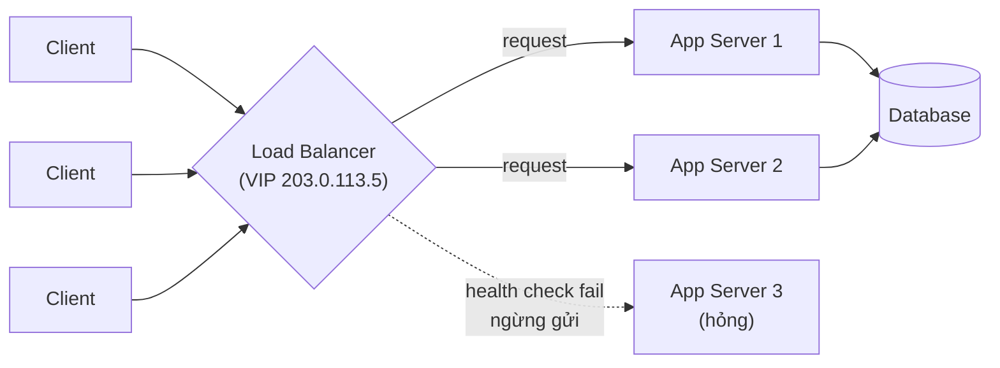
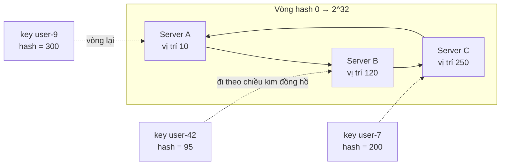
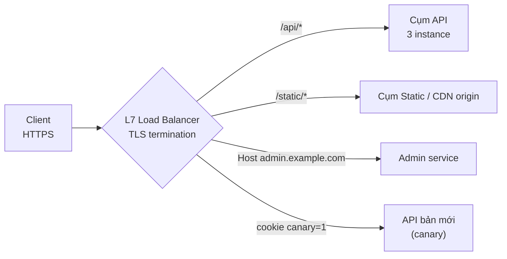
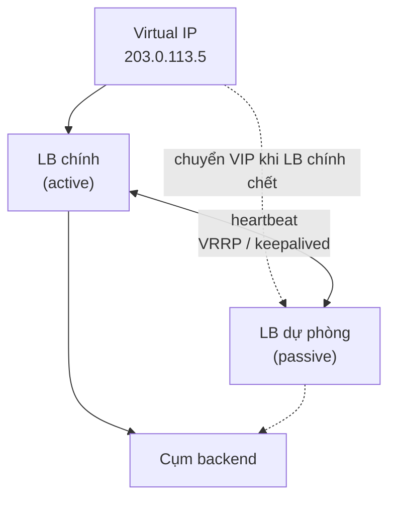

# Load Balancers

**Load balancer** (bộ cân bằng tải) là thành phần đứng giữa client và một nhóm server, **phân phối request tới các server phía sau** (backend / upstream) sao cho không server nào quá tải, đồng thời **loại bỏ server hỏng** khỏi vòng phục vụ. Nó có thể là phần mềm (nginx, HAProxy, Envoy), phần cứng (F5), hoặc dịch vụ cloud (AWS ALB/NLB, Google Cloud Load Balancing).

**Tương tự đơn giản:** Load balancer giống **nhân viên điều phối ở quầy check-in sân bay**. Khách xếp một hàng chung, nhân viên chỉ "bạn qua quầy 3", "bạn qua quầy 5" — quầy nào rảnh thì đưa khách tới, quầy nào đóng (nhân viên nghỉ) thì không đưa khách vào nữa.

---

:::note[Ghi nhớ nhanh]

- ⭐ **Load balancer phân phối traffic + health check** — tăng khả năng chịu tải (scale ngang) và độ sẵn sàng (loại server hỏng).
- ⭐ **Layer 4 vs Layer 7:** L4 định tuyến theo IP/port (nhanh, không đọc nội dung); L7 đọc HTTP (path, header, cookie) nên định tuyến thông minh hơn nhưng tốn tài nguyên hơn.
- **Thuật toán:** round robin, weighted round robin, least connections, least response time, IP hash, consistent hashing, random/power of two choices.
- **Load balancer vs reverse proxy:** reverse proxy đứng trước server (kể cả 1 server) để làm TLS, cache, nén, bảo mật; load balancer là reverse proxy có nhiệm vụ chia tải cho nhiều server.
- **Bản thân LB cũng có thể là điểm lỗi đơn (SPOF)** — chạy theo cặp active–passive/active–active hoặc dùng LB managed của cloud.

:::

---

## Mục lục

- [Vì sao cần Load Balancer?](#vì-sao-cần-load-balancer)
- [1. Load Balancer là gì?](#1-load-balancer-là-gì)
- [2. Load Balancer vs Reverse Proxy](#2-load-balancer-vs-reverse-proxy)
- [3. Load Balancing Algorithms](#3-load-balancing-algorithms)
- [4. Layer 4 Load Balancing](#4-layer-4-load-balancing)
- [5. Layer 7 Load Balancing](#5-layer-7-load-balancing)
- [6. Health check và độ sẵn sàng của chính Load Balancer](#6-health-check-và-độ-sẵn-sàng-của-chính-load-balancer)
- [Khi nào dùng?](#khi-nào-dùng)
- [Lỗi thường gặp](#lỗi-thường-gặp)
- [Câu hỏi phỏng vấn](#câu-hỏi-phỏng-vấn)

---

## Vì sao cần Load Balancer?

**Vấn đề:** Một server có giới hạn CPU, RAM, số kết nối. Khi traffic vượt ngưỡng, request bị chậm hoặc lỗi. Thêm server thứ hai, thứ ba thì client biết gọi server nào? Nếu client gọi thẳng IP một server và server đó chết, user thấy lỗi. Deploy phiên bản mới cũng buộc phải tắt server → downtime.

**Giải pháp:** Đặt load balancer làm **điểm vào duy nhất**. Client chỉ biết địa chỉ của LB; LB chia request cho nhiều server, liên tục **health check** để bỏ server hỏng, cho phép **thêm/bớt server** (scale ngang) và **rút dần server** khi deploy (connection draining) mà user không nhận ra.

:::tip[Dùng thực tế]

- **Web/API phổ biến trên AWS:** Route 53 → ALB → nhiều EC2/ECS task trải trên nhiều Availability Zone.
- **Kubernetes:** Ingress controller (nginx, Envoy, Traefik) là L7 LB; `Service` kiểu `ClusterIP` được kube-proxy cân bằng tải ở L4.
- **GitHub** phát triển GLB Director (L4 LB mã nguồn mở) chạy trước các HAProxy L7; **Google** dùng Maglev (L4 LB phần mềm) cho các dịch vụ của mình.
- **Database read replica:** ProxySQL / pgbouncer + HAProxy chia truy vấn đọc cho nhiều replica.

:::

---

## 1. Load Balancer là gì?

Một load balancer thường đảm nhiệm:

| Chức năng | Mô tả |
| --- | --- |
| **Phân phối tải** | Chia request/kết nối cho các backend theo thuật toán |
| **Health check** | Định kỳ kiểm tra backend; loại server lỗi, đưa lại khi khoẻ |
| **TLS termination** | Giải mã HTTPS tại LB, giảm tải mã hoá cho backend, quản lý chứng chỉ tập trung |
| **Session persistence** | Giữ một user dính với một backend (sticky session) khi cần |
| **Connection draining** | Khi gỡ backend, ngừng gửi request mới nhưng chờ request đang xử lý hoàn tất |
| **Bảo vệ** | Ẩn IP backend, giới hạn tốc độ, chặn request xấu (kết hợp WAF) |



Có ba dạng triển khai chính:

- **Phần cứng** (F5 BIG-IP, Citrix ADC): hiệu năng rất cao, đắt, ít linh hoạt.
- **Phần mềm** (nginx, HAProxy, Envoy, Traefik): chạy trên máy thường hoặc container, cấu hình bằng file/code.
- **Managed cloud** (AWS ALB/NLB, GCP Cloud Load Balancing, Azure Load Balancer / Application Gateway): tự scale, tự HA, trả tiền theo dùng.

---

## 2. Load Balancer vs Reverse Proxy

**Reverse proxy** (proxy ngược) là server đứng **trước** các web server, nhận request thay mặt chúng rồi chuyển tiếp. Client chỉ thấy reverse proxy. (Ngược lại với **forward proxy** đứng trước client, như proxy công ty.)

| Tiêu chí | Reverse Proxy | Load Balancer |
| --- | --- | --- |
| Mục đích chính | Làm "mặt tiền" cho server: bảo mật, TLS, cache, nén, rewrite | Chia tải giữa **nhiều** server và loại server hỏng |
| Số backend | Có ý nghĩa ngay cả với **1** server | Có ý nghĩa khi có **từ 2** server trở lên |
| Tầng hoạt động | Thường L7 (HTTP) | L4 hoặc L7 |
| Ví dụ | nginx trước một app Node.js để phục vụ static + TLS | AWS ALB chia request cho 10 container |

Lợi ích của reverse proxy:

- **Bảo mật:** ẩn thông tin backend, chỉ mở một điểm vào, chặn IP xấu, giới hạn số kết nối.
- **TLS termination** tập trung.
- **Nén** (gzip/brotli), **cache** response, **phục vụ file tĩnh** trực tiếp.
- **Linh hoạt:** thay đổi, thêm, bớt backend mà client không biết.

Nhược điểm chung: thêm một bước nhảy mạng (latency nhỏ), tăng độ phức tạp, và nếu chỉ có một instance thì thành **SPOF**.

Trên thực tế, **nginx, HAProxy, Envoy vừa là reverse proxy vừa là load balancer** — khi bạn khai báo nhiều server trong `upstream`, reverse proxy đó đã trở thành load balancer.

---

## 3. Load Balancing Algorithms

Thuật toán quyết định **request tiếp theo đi tới backend nào**. Chia làm hai nhóm: **tĩnh** (không xét trạng thái hiện tại của server) và **động** (dựa trên số kết nối, thời gian phản hồi...).

### 3.1. Round Robin

Lần lượt xoay vòng: S1 → S2 → S3 → S1 → ...

- Đơn giản, đều khi các server **giống nhau** và request **tốn công như nhau**.
- Không tính tới việc một request có thể rất nặng (export báo cáo) trong khi request khác rất nhẹ.

### 3.2. Weighted Round Robin

Mỗi server có trọng số tỷ lệ với năng lực. Server `weight=3` nhận gấp 3 lần server `weight=1`.

- Dùng khi server khác cấu hình, hoặc khi **canary** (bản mới nhận 5% traffic).

### 3.3. Least Connections

Gửi tới server đang có **ít kết nối hoạt động nhất**.

- Tốt khi thời gian xử lý mỗi request **chênh lệch lớn** hoặc kết nối dài (WebSocket).
- Biến thể **Weighted Least Connections** kết hợp với trọng số.

### 3.4. Least Response Time

Chọn server có **thời gian phản hồi trung bình thấp nhất** (thường kết hợp số kết nối). Nhạy với server đang chậm (GC, noisy neighbor). Ví dụ: nginx Plus `least_time`, Envoy dùng thông tin tương tự qua outlier detection.

### 3.5. IP Hash / Source Hash

`server = hash(IP client) mod N`. Cùng một client luôn tới cùng server → **dính phiên** mà không cần cookie.

- Nhược: nhiều user sau một NAT (công ty, mạng di động) dồn vào một server; thêm/bớt server làm **gần như mọi client đổi server** (vì `mod N` thay đổi).

### 3.6. Consistent Hashing

Đặt server và key lên một **vòng hash**; mỗi key đi tới server đầu tiên theo chiều kim đồng hồ. Khi thêm/bớt một server, **chỉ khoảng 1/N key bị dịch chuyển** thay vì gần như toàn bộ. Thường dùng **virtual node** (mỗi server có nhiều điểm trên vòng) để phân bố đều.

- Dùng khi backend **có trạng thái theo key**: cụm cache (Memcached), shard, chọn server theo `userId` để tận dụng cache cục bộ.
- Biến thể: Maglev hashing (Google), rendezvous hashing (HRW), ring hash trong Envoy.



### 3.7. Random và Power of Two Choices

- **Random:** chọn ngẫu nhiên; với số lượng lớn thì khá đều.
- **Power of two choices (P2C):** chọn ngẫu nhiên **2** server, lấy server ít tải hơn. Đơn giản, hiệu quả cao, không cần trạng thái toàn cục — Envoy dùng P2C cho thuật toán `LEAST_REQUEST`, nginx có `random two least_conn`.

### Bảng so sánh

| Thuật toán | Loại | Cần trạng thái | Phù hợp | Hạn chế |
| --- | --- | --- | --- | --- |
| Round robin | Tĩnh | Không | Server đồng nhất, request đều | Không xét tải thực |
| Weighted RR | Tĩnh | Không | Server khác cấu hình, canary | Trọng số cố định |
| Least connections | Động | Số kết nối | Request dài/ngắn lẫn lộn, WebSocket | Kết nối ít chưa chắc là tải nhẹ |
| Least response time | Động | Latency | Phát hiện server chậm | Cần đo đạc, dễ dao động |
| IP hash | Tĩnh | Không | Sticky đơn giản | Lệch tải sau NAT, đổi N là xáo trộn |
| Consistent hashing | Tĩnh | Không | Cache, backend có trạng thái theo key | Phức tạp hơn, cần virtual node |
| P2C | Động | Tải cục bộ | Hệ thống lớn, nhiều LB | Ít trực quan |

---

## 4. Layer 4 Load Balancing

**L4 load balancer** hoạt động ở **tầng Transport** (TCP/UDP) của mô hình OSI. Nó chỉ nhìn **IP nguồn/đích và port**, **không đọc nội dung** gói tin (không biết URL, header, cookie).

Cách hoạt động: client kết nối tới IP ảo (VIP) của LB; LB chọn backend và chuyển tiếp gói tin, thường bằng **NAT** (đổi địa chỉ đích) hoặc **DSR** (Direct Server Return — backend trả lời thẳng cho client, bỏ qua LB ở chiều về, rất hợp với traffic tải xuống lớn).

- **Ưu điểm:** rất nhanh, ít tốn CPU, độ trễ thấp, chịu hàng triệu kết nối; hỗ trợ **mọi giao thức** trên TCP/UDP (database, MQTT, game, gRPC thô); TLS có thể đi xuyên qua (passthrough) tới backend.
- **Nhược điểm:** không định tuyến theo URL/header, không sticky theo cookie, không biết request HTTP nào lỗi (chỉ biết kết nối), không cache, không sửa header.

Ví dụ: AWS **NLB**, Linux **IPVS/LVS**, HAProxy `mode tcp`, nginx `stream`, Google Maglev.

```nginx
# nginx stream (L4): cân bằng tải kết nối TCP tới cụm PostgreSQL read replica
stream {
    upstream pg_replicas {
        least_conn;
        server 10.0.1.11:5432 max_fails=3 fail_timeout=10s;
        server 10.0.1.12:5432 max_fails=3 fail_timeout=10s;
    }

    server {
        listen 5432;
        proxy_pass pg_replicas;
        proxy_connect_timeout 2s;
    }
}
```

---

## 5. Layer 7 Load Balancing

**L7 load balancer** hoạt động ở **tầng Application**: nó kết thúc kết nối của client, **đọc toàn bộ request HTTP** (method, path, host, header, cookie, đôi khi body), rồi mở kết nối riêng tới backend.

Nhờ hiểu nội dung, L7 làm được:

- **Content-based routing:** `/api/*` → cụm API, `/static/*` → cụm static, `admin.example.com` → service admin.
- **Sticky session theo cookie.**
- **Canary / A/B** theo header hoặc cookie (`X-Canary: true`).
- **Retry** request lỗi sang backend khác, **timeout** theo route, **rate limit**, **auth** ở biên.
- Sửa header (thêm `X-Forwarded-For`, `X-Request-Id`), nén, cache.
- Hỗ trợ HTTP/2, gRPC, WebSocket.

Đổi lại: tốn CPU hơn (phải parse HTTP, thường giải mã TLS), độ trễ cao hơn L4 một chút.



Ví dụ nginx làm L7 load balancer đầy đủ:

```nginx
http {
    upstream api_backend {
        least_conn;                              # thuật toán: ít kết nối nhất
        server 10.0.2.11:3000 weight=3;          # máy mạnh nhận nhiều hơn
        server 10.0.2.12:3000 weight=1;
        server 10.0.2.13:3000 backup;            # chỉ dùng khi các server trên đều hỏng
        keepalive 64;                            # giữ kết nối tới backend để tái sử dụng
    }

    upstream cache_backend {
        hash $request_uri consistent;            # consistent hashing theo URI
        server 10.0.3.11:8080;
        server 10.0.3.12:8080;
    }

    server {
        listen 443 ssl;
        http2 on;
        server_name example.com;
        ssl_certificate     /etc/ssl/example.crt;
        ssl_certificate_key /etc/ssl/example.key;

        location /api/ {
            proxy_pass http://api_backend;
            proxy_http_version 1.1;
            proxy_set_header Connection "";
            proxy_set_header Host $host;
            proxy_set_header X-Real-IP $remote_addr;
            proxy_set_header X-Forwarded-For $proxy_add_x_forwarded_for;
            proxy_set_header X-Forwarded-Proto $scheme;
            proxy_connect_timeout 2s;
            proxy_read_timeout 30s;
            # Thử backend khác khi lỗi kết nối hoặc 502/503 (chỉ an toàn với request idempotent)
            proxy_next_upstream error timeout http_502 http_503;
        }

        location /images/ {
            proxy_pass http://cache_backend;
        }
    }
}
```

### So sánh L4 và L7

| Tiêu chí | Layer 4 | Layer 7 |
| --- | --- | --- |
| Thông tin dùng để định tuyến | IP, port | URL, host, header, cookie, method |
| Hiệu năng | Rất cao, latency thấp nhất | Thấp hơn (parse HTTP, TLS) |
| Giao thức | Mọi TCP/UDP | HTTP/1.1, HTTP/2, gRPC, WebSocket |
| TLS | Passthrough hoặc terminate | Thường terminate để đọc nội dung |
| Sticky session | Theo IP | Theo cookie, header |
| Retry/timeout theo request | Không | Có |
| Ví dụ | AWS NLB, IPVS, Maglev, HAProxy tcp | AWS ALB, nginx http, Envoy, Traefik |

Kiến trúc lớn thường **xếp tầng**: L4 LB (chịu số lượng kết nối khổng lồ, Anycast) đứng trước một đội L7 proxy (định tuyến thông minh), sau đó mới tới service.

---

## 6. Health check và độ sẵn sàng của chính Load Balancer

### Health check

- **Passive:** LB quan sát traffic thật — kết nối lỗi/timeout liên tục thì đánh dấu backend hỏng (nginx `max_fails`, Envoy outlier detection).
- **Active:** LB tự gọi định kỳ một endpoint, vd `GET /healthz` mỗi 5 giây; fail 3 lần liên tiếp → loại; pass 2 lần → đưa lại.

```ts
// Endpoint health check: chỉ báo "sẵn sàng" khi phụ thuộc thiết yếu hoạt động
app.get('/healthz', async (_req, res) => {
  try {
    await db.query('SELECT 1');
    res.status(200).json({ status: 'ok' });
  } catch (err) {
    logger.warn({ err }, 'Health check thất bại: DB không phản hồi');
    res.status(503).json({ status: 'unavailable' });
  }
});
```

Lưu ý: health check quá "sâu" (kiểm tra cả dịch vụ phụ không thiết yếu) có thể khiến **mọi** backend bị loại cùng lúc khi một dịch vụ phụ chập chờn → sập toàn hệ thống. Tách **liveness** (process còn sống) và **readiness** (sẵn sàng nhận traffic).

### Load balancer không được là SPOF



- **Active–passive:** hai LB chia sẻ một virtual IP qua **VRRP** (keepalived); LB dự phòng chiếm VIP khi LB chính mất heartbeat.
- **Active–active:** nhiều LB cùng phục vụ, phía trước dùng DNS nhiều record hoặc **Anycast/ECMP** để chia cho các LB.
- **Managed LB** (ALB, NLB, Cloud LB) đã được nhà cung cấp làm HA và tự scale.

---

## Khi nào dùng?

- **Dùng load balancer khi:**
  - Có từ 2 instance trở lên của một service, hoặc cần zero-downtime deploy.
  - Cần loại bỏ tự động instance hỏng.
  - Cần TLS termination tập trung, định tuyến theo path/host.
- **Chọn L4 khi:** giao thức không phải HTTP (DB, MQTT, game UDP), cần throughput cực lớn và latency thấp nhất, hoặc muốn TLS passthrough tới backend.
- **Chọn L7 khi:** cần định tuyến theo URL/header, canary theo cookie, retry/timeout theo route, gRPC, quan sát chi tiết theo request.
- **Chọn thuật toán:**
  - Mặc định: **round robin** (server đồng nhất) hoặc **least connections / P2C** (request không đều).
  - Backend có cache/trạng thái theo key: **consistent hashing**.
  - Canary: **weighted**.

---

## Lỗi thường gặp

### Lỗi 1: Mất IP thật của client

Backend chỉ thấy IP của LB → log sai, rate limit theo IP chặn nhầm cả hệ thống. Cần đọc `X-Forwarded-For` (L7) hoặc **PROXY protocol** (L4), và chỉ tin header này khi nó đến từ LB của mình.

```ts
// Express: tin 1 tầng proxy (LB) phía trước để req.ip là IP thật của client
app.set('trust proxy', 1);
```

### Lỗi 2: Sticky session che giấu thiết kế stateful

Dùng sticky session để "chữa" việc lưu session trong RAM → tải lệch, server chết thì user mất phiên, khó scale. Hãy đưa session ra Redis/DB để server stateless (xem bài Horizontal Scaling).

### Lỗi 3: Retry request không idempotent

Cấu hình LB tự retry mọi request khi timeout → `POST /payments` có thể bị thực hiện hai lần. Chỉ retry request idempotent (GET, PUT có key) hoặc dùng idempotency key.

### Lỗi 4: Health check giả

`/health` luôn trả 200 kể cả khi DB mất kết nối → LB vẫn gửi traffic vào instance đã hỏng. Ngược lại, health check kiểm tra quá nhiều phụ thuộc → loại cả cụm. Cân bằng: readiness kiểm tra phụ thuộc thiết yếu, có timeout ngắn.

### Lỗi 5: Không có connection draining khi deploy

Tắt instance ngay khi deploy → request đang xử lý bị cắt, user nhận 502. Bật deregistration delay / connection draining và để app xử lý `SIGTERM` (ngừng nhận request mới, hoàn tất request đang chạy).

---

## Câu hỏi phỏng vấn

Những câu thường gặp về chủ đề này. Tự trả lời trước, rồi bấm **Xem đáp án** để đối chiếu.

**1. Load balancer khác reverse proxy thế nào?**

<details className="qa">
<summary>Xem đáp án</summary>

Reverse proxy đứng trước server để làm "mặt tiền": TLS, cache, nén, bảo mật, rewrite — hữu ích ngay cả với một server. Load balancer là chức năng phân phối request cho **nhiều** server và loại server hỏng. Hai khái niệm chồng lấn: nginx/HAProxy/Envoy là reverse proxy, và trở thành load balancer khi có nhiều backend trong upstream.

</details>

**2. So sánh Layer 4 và Layer 7 load balancing.**

<details className="qa">
<summary>Xem đáp án</summary>

- **L4:** dựa vào IP/port, không đọc nội dung; rất nhanh, hỗ trợ mọi giao thức TCP/UDP, có thể TLS passthrough; không định tuyến theo URL, không sticky theo cookie.
- **L7:** đọc HTTP; định tuyến theo path/host/header/cookie, retry, canary, rate limit, sửa header; tốn CPU hơn, latency cao hơn chút.

Hệ thống lớn thường dùng L4 phía ngoài (chịu số kết nối khổng lồ) và L7 phía trong (định tuyến thông minh).

</details>

**3. Khi nào dùng least connections thay vì round robin?**

<details className="qa">
<summary>Xem đáp án</summary>

Khi thời gian xử lý request **chênh lệch lớn** (có request vài ms, có request vài giây) hoặc có **kết nối dài** (WebSocket, streaming). Round robin chia đều số request nhưng không đều về tải thực, nên server xui nhận nhiều request nặng sẽ quá tải. Least connections (hoặc P2C) cân theo số kết nối đang hoạt động, phản ánh tải tốt hơn.

</details>

**4. Consistent hashing là gì và tại sao tốt hơn `hash mod N`?**

<details className="qa">
<summary>Xem đáp án</summary>

Với `hash(key) mod N`, khi N đổi (thêm/bớt server) gần như mọi key đổi server → cache miss hàng loạt. Consistent hashing đặt server và key trên một vòng hash; key thuộc server gần nhất theo chiều kim đồng hồ. Thêm/bớt một server chỉ dịch chuyển khoảng **1/N** key. Dùng virtual node để phân bố đều. Ứng dụng: cụm cache, sharding, định tuyến theo userId.

</details>

**5. Làm sao tránh load balancer trở thành single point of failure?**

<details className="qa">
<summary>Xem đáp án</summary>

- Chạy **cặp active–passive** với virtual IP qua VRRP/keepalived.
- Chạy **active–active** nhiều LB, phía trước là DNS nhiều record hoặc Anycast/ECMP.
- Dùng **managed LB** của cloud (đã HA, trải nhiều AZ).
- Kết hợp DNS failover giữa các region cho mức sự cố lớn hơn.

</details>

**6. Sticky session là gì? Có nên dùng không?**

<details className="qa">
<summary>Xem đáp án</summary>

Sticky session (session affinity) giữ mọi request của một user tới cùng backend, qua cookie (L7) hoặc IP hash. Hữu ích cho app legacy lưu session trong bộ nhớ, hoặc để tận dụng cache cục bộ. Nhược điểm: tải lệch, server chết là mất phiên, scale/deploy khó. Nên ưu tiên **server stateless** + session lưu ở Redis/DB/JWT, chỉ dùng sticky khi thật sự cần.

</details>
