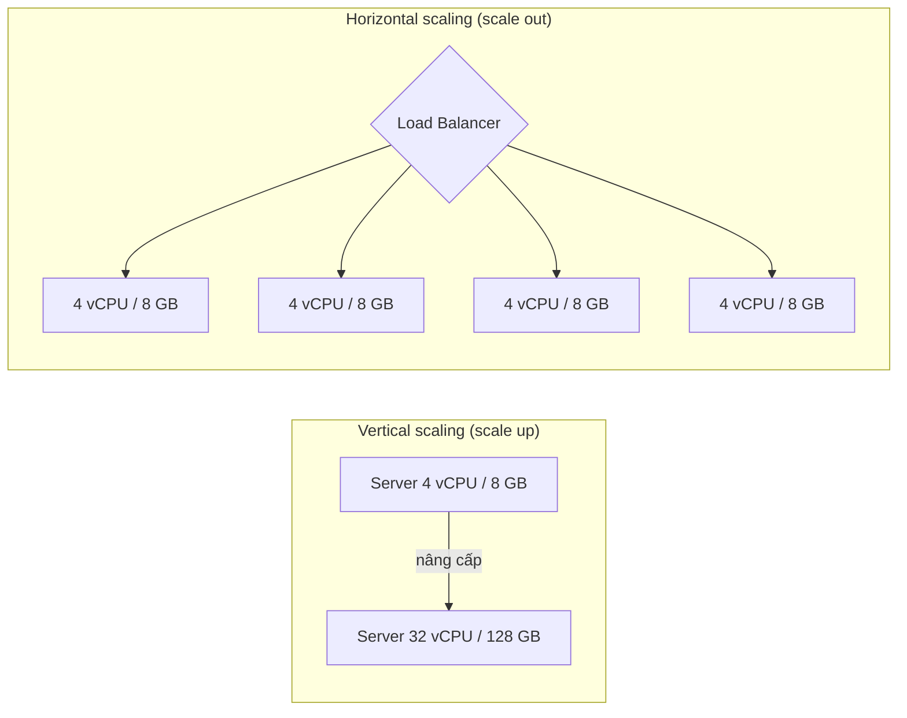
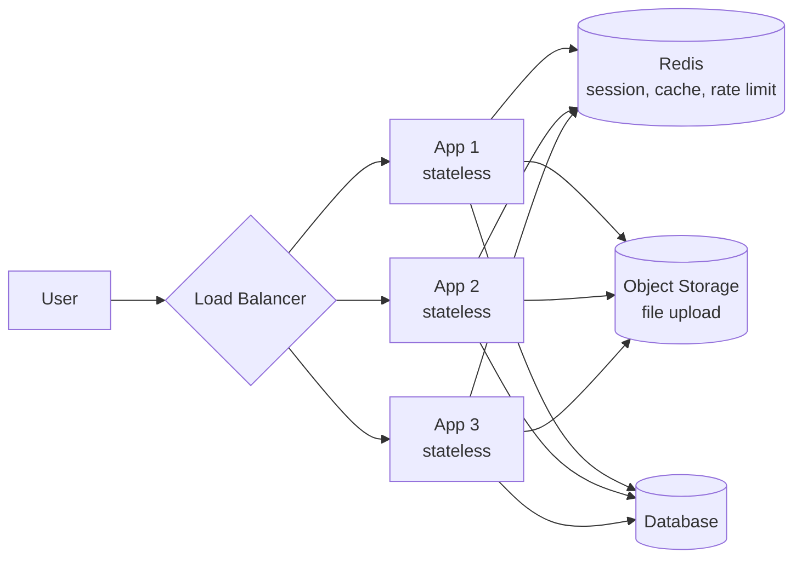
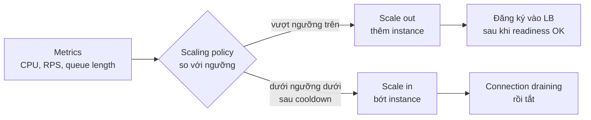

# Horizontal Scaling

**Horizontal scaling** (mở rộng theo chiều ngang, **scale out**) là cách tăng năng lực hệ thống bằng **thêm nhiều máy/instance** chạy song song, thay vì nâng cấp một máy duy nhất mạnh hơn (**vertical scaling**, **scale up**). Kết hợp với load balancer, nhiều server "bình thường" cùng chia nhau gánh traffic.

**Tương tự đơn giản:** Quán phở đông khách. **Scale up** là thay đầu bếp bằng một đầu bếp siêu tốc — tới một lúc không ai nấu nhanh hơn được nữa, và nếu người đó ốm thì quán đóng cửa. **Scale out** là thuê thêm nhiều đầu bếp bình thường, mỗi người một bếp — khách đông thì thuê thêm, một người nghỉ thì quán vẫn bán. Nhưng muốn vậy, công thức phải được ghi ra sổ chung (state dùng chung), không phải nằm trong đầu một người.

---

:::note[Ghi nhớ nhanh]

- ⭐ **Scale out = thêm máy, scale up = máy mạnh hơn** — scale out gần như không có trần và chịu lỗi tốt hơn, nhưng phức tạp hơn.
- ⭐ **Điều kiện tiên quyết: server phải stateless** — session, file upload, cache cục bộ phải chuyển ra nơi dùng chung (Redis, S3, DB).
- **Auto-scaling** — tự thêm/bớt instance theo CPU, số request, độ dài queue; cần có min/max và cooldown.
- **Nút thắt dịch chuyển xuống dưới** — thêm 50 app server có thể làm database ngộp kết nối; scale app phải đi cùng connection pooling, cache, read replica.
- **Nhược điểm:** phức tạp vận hành, dữ liệu phân tán, cần load balancer, chi phí license/kết nối tăng theo số node.

:::

---

## Mục lục

- [Vì sao cần Horizontal Scaling?](#vì-sao-cần-horizontal-scaling)
- [1. Vertical vs Horizontal Scaling](#1-vertical-vs-horizontal-scaling)
- [2. Stateless server](#2-stateless-server)
- [3. Đưa session ra Redis](#3-đưa-session-ra-redis)
- [4. Auto-scaling](#4-auto-scaling)
- [5. Scale tầng dữ liệu](#5-scale-tầng-dữ-liệu)
- [6. Nhược điểm của Horizontal Scaling](#6-nhược-điểm-của-horizontal-scaling)
- [Khi nào dùng?](#khi-nào-dùng)
- [Lỗi thường gặp](#lỗi-thường-gặp)
- [Câu hỏi phỏng vấn](#câu-hỏi-phỏng-vấn)

---

## Vì sao cần Horizontal Scaling?

**Vấn đề:** Nâng cấp một máy lên mạnh hơn (thêm CPU, RAM) là cách dễ nhất, nhưng:

- **Có trần** — máy lớn nhất trên thị trường vẫn có giới hạn, và giá tăng **nhanh hơn tuyến tính** khi lên cấu hình cao.
- **Một điểm lỗi** — máy đó chết là cả hệ thống chết.
- **Downtime khi nâng cấp** — thường phải tắt máy để đổi cấu hình.
- **Không co giãn** — trả tiền cho cấu hình đỉnh cả lúc 3h sáng không ai dùng.

**Giải pháp:** Chạy nhiều instance giống hệt nhau sau load balancer. Traffic tăng → thêm instance; giảm → bớt. Một instance chết → LB bỏ qua, các instance khác gánh tiếp. Deploy theo kiểu **rolling** (lần lượt từng instance) để không downtime.

:::tip[Dùng thực tế]

- **Netflix, Amazon** chạy hàng nghìn instance stateless trong Auto Scaling Group, tự co giãn theo giờ cao điểm.
- **Sàn TMĐT ngày sale 11/11:** scale out trước (pre-warm) gấp nhiều lần số instance bình thường, sau đó thu lại.
- **Kubernetes HPA** (Horizontal Pod Autoscaler) tăng số pod của một Deployment khi CPU vượt ngưỡng.
- **Serverless** (AWS Lambda, Cloud Run) là horizontal scaling tự động tối đa: mỗi request/nhóm request có thể chạy trên instance riêng.

:::

---

## 1. Vertical vs Horizontal Scaling



| Tiêu chí | Vertical (scale up) | Horizontal (scale out) |
| --- | --- | --- |
| Cách làm | Máy mạnh hơn | Thêm máy |
| Giới hạn | Trần phần cứng | Gần như không trần (thực tế bị DB, mạng giới hạn) |
| Chịu lỗi | Một điểm lỗi | Mất một node vẫn chạy |
| Downtime khi mở rộng | Thường có | Không (thêm node nóng) |
| Thay đổi code | Không cần | Cần stateless, xử lý đồng thời phân tán |
| Chi phí | Đắt dần ở cấu hình cao | Máy phổ thông, trả theo dùng |
| Độ phức tạp vận hành | Thấp | Cao (LB, discovery, monitoring nhiều node) |
| Hợp với | DB quan hệ chính, giai đoạn đầu, app legacy | Web/API stateless, worker, hệ thống lớn |

:::tip[Lời khuyên thực tế]

Đừng coi thường scale up: một máy chủ hiện đại có hàng trăm vCPU và hàng TB RAM, đủ cho rất nhiều sản phẩm. Thứ tự hợp lý thường là: **tối ưu code/query → scale up vừa phải → scale out tầng stateless → scale out tầng dữ liệu** (khó nhất). Ngay cả khi tầng app đã scale out, database chính thường vẫn được scale up.

:::

---

## 2. Stateless server

Để thêm/bớt instance tự do, **mỗi request phải xử lý được ở bất kỳ instance nào**. Server **stateless** là server không giữ trạng thái riêng của user giữa các request trong bộ nhớ/ổ đĩa cục bộ.

Những thứ thường làm server bị **stateful** và cách chuyển ra ngoài:

| Trạng thái cục bộ | Vấn đề khi có nhiều instance | Chuyển ra đâu |
| --- | --- | --- |
| Session trong RAM | Request sau rơi vào instance khác → mất đăng nhập | Redis / DB / JWT |
| File upload lưu ổ đĩa | Instance khác không có file | Object storage (S3, GCS) |
| Cache in-memory | Mỗi instance một bản, không nhất quán | Redis/Memcached (hoặc chấp nhận cache cục bộ TTL ngắn) |
| Cron chạy trong app | Chạy trùng N lần | Scheduler riêng / distributed lock |
| WebSocket connection | Gửi tin cho user ở instance khác | Pub/Sub (Redis, NATS) giữa các instance |
| Rate limit đếm trong RAM | Mỗi instance đếm riêng → giới hạn nhân N | Redis counter |



Cấu hình (URL DB, secret...) cũng nên lấy từ **biến môi trường** hoặc config service thay vì sửa tay trên từng máy — nguyên tắc **Twelve-Factor App** ("processes are stateless and share-nothing").

---

## 3. Đưa session ra Redis

Có hai cách phổ biến để bỏ session khỏi RAM của server:

1. **Session store tập trung** (Redis, Memcached, DB): cookie chỉ chứa `sessionId`, dữ liệu phiên nằm ở Redis.
2. **Token tự chứa** (JWT): toàn bộ thông tin cần thiết nằm trong token đã ký; server chỉ cần verify chữ ký, không tra cứu.

Ví dụ Express + Redis:

```ts
import express from 'express';
import session from 'express-session';
import { RedisStore } from 'connect-redis';
import { createClient } from 'redis';

const redisClient = createClient({ url: process.env.REDIS_URL });
redisClient.on('error', (err) => logger.error({ err }, 'Lỗi kết nối Redis'));
await redisClient.connect();

const app = express();
app.set('trust proxy', 1); // đứng sau load balancer

app.use(
  session({
    store: new RedisStore({ client: redisClient, prefix: 'sess:' }),
    secret: process.env.SESSION_SECRET!, // bắt buộc cấu hình qua biến môi trường
    resave: false,
    saveUninitialized: false,
    cookie: { secure: true, httpOnly: true, sameSite: 'lax', maxAge: 7 * 24 * 3600 * 1000 },
  }),
);
// Bây giờ request của user có thể rơi vào BẤT KỲ instance nào
```

| Tiêu chí | Session ở Redis | JWT |
| --- | --- | --- |
| Lưu trạng thái | Phía server (Redis) | Phía client (token) |
| Thu hồi (logout, khoá tài khoản) | Dễ — xoá key | Khó — phải chờ hết hạn hoặc thêm blacklist |
| Mỗi request | Thêm 1 lần gọi Redis (dưới 1 ms trong cùng mạng) | Chỉ verify chữ ký |
| Kích thước cookie | Nhỏ | Lớn hơn (payload + chữ ký) |
| Phụ thuộc | Redis phải HA | Không cần store |

Thực tế hay kết hợp: **access token JWT ngắn hạn** (vài phút) + **refresh token** lưu phía server để có thể thu hồi.

---

## 4. Auto-scaling

**Auto-scaling** là tự động điều chỉnh số instance theo tải.



Các kiểu chính sách:

- **Target tracking:** giữ một chỉ số quanh mục tiêu, vd CPU trung bình 60%. Đơn giản và phổ biến nhất.
- **Step scaling:** CPU trên 70% thêm 2 instance, trên 90% thêm 5.
- **Scheduled scaling:** biết trước đỉnh (8h sáng, ngày sale) thì tăng trước.
- **Predictive scaling:** dựa trên dữ liệu lịch sử để dự đoán (AWS có hỗ trợ).
- **Theo độ dài queue** (cho worker): KEDA trong Kubernetes scale theo số message trong SQS/Kafka/RabbitMQ.

Ví dụ Kubernetes HPA:

```yaml
apiVersion: autoscaling/v2
kind: HorizontalPodAutoscaler
metadata:
  name: api
spec:
  scaleTargetRef:
    apiVersion: apps/v1
    kind: Deployment
    name: api
  minReplicas: 3          # luôn ≥ 3 để chịu mất 1 node/zone
  maxReplicas: 30         # trần để bảo vệ DB và ngân sách
  metrics:
    - type: Resource
      resource:
        name: cpu
        target:
          type: Utilization
          averageUtilization: 60
  behavior:
    scaleDown:
      stabilizationWindowSeconds: 300   # chờ 5 phút ổn định mới thu nhỏ, tránh dao động
```

Lưu ý quan trọng:

- **Thời gian khởi động** — instance mới mất từ vài giây (container) tới vài phút (VM + warm-up JIT/cache). Đỉnh traffic đột ngột có thể tới trước khi instance mới sẵn sàng → giữ **dư địa** (headroom) và dùng scheduled scaling cho sự kiện biết trước.
- **Flapping (dao động)** — scale out/in liên tục. Dùng cooldown, stabilization window, ngưỡng lên/xuống cách nhau.
- **min ≥ 2** (thường ≥ 3, trải nhiều availability zone) để luôn chịu được mất một node.
- **max** để bảo vệ hệ thống phía sau và ngân sách — một vòng lặp lỗi hoặc tấn công có thể kéo scale tới hàng trăm instance.

---

## 5. Scale tầng dữ liệu

Scale out tầng app là phần dễ; nút thắt thường **dịch chuyển xuống database**.

- **Số kết nối DB bùng nổ:** 30 instance × pool 20 = 600 kết nối; PostgreSQL mỗi kết nối là một process, quá nhiều kết nối làm DB chậm. Dùng **connection pooler** (PgBouncer, RDS Proxy) và giảm pool size mỗi instance.
- **Đọc nhiều:** thêm **read replica**, cache (Redis), CDN.
- **Ghi nhiều:** **sharding/partitioning** (chia dữ liệu theo key ra nhiều DB), hoặc dùng DB phân tán (Cassandra, DynamoDB, CockroachDB, Vitess cho MySQL).

```text
Ước lượng nhanh:
- 1 instance Node.js xử lý ~1.000 RPS cho API nhẹ (giả định, cần đo thực tế bằng load test)
- Mục tiêu 20.000 RPS đỉnh, giữ CPU ~60% → cần khoảng 20.000 / (1.000 × 0,6) ≈ 34 instance
- Mỗi request trung bình 2 truy vấn DB → DB phải chịu ~40.000 QPS → nhiều khả năng cần cache + replica
```

Con số trên chỉ là ví dụ phương pháp; luôn đo năng lực thật bằng load test (k6, Gatling, Locust) trước khi lập kế hoạch.

---

## 6. Nhược điểm của Horizontal Scaling

- **Độ phức tạp:** cần load balancer, service discovery, quản lý cấu hình, log/metric/tracing tập trung cho nhiều node.
- **Bắt buộc stateless:** code cũ lưu state cục bộ phải refactor.
- **Dữ liệu phân tán khó:** sharding, giao dịch xuyên shard, nhất quán dữ liệu (CAP, eventual consistency).
- **Nút thắt phía sau:** DB, cache, API bên thứ ba có giới hạn kết nối/rate limit.
- **Chi phí tăng theo số node:** license tính theo máy, chi phí mạng giữa các zone, số kết nối tới dịch vụ phụ thuộc.
- **Vấn đề phân tán:** đồng hồ lệch nhau, race condition giữa các instance (hai instance cùng xử lý một việc), cache không nhất quán.
- **Debug khó hơn:** lỗi chỉ xảy ra trên một instance, request đi qua nhiều node → cần correlation ID.

---

## Khi nào dùng?

| Nên scale out | Nên scale up (hoặc chưa cần scale out) |
| --- | --- |
| Web/API stateless, worker xử lý queue | Database quan hệ chính (scale up trước, rồi replica/sharding) |
| Traffic biến động lớn theo giờ/ngày | Traffic nhỏ, ổn định, một máy dư sức |
| Cần high availability (chịu mất node/zone) | Phần mềm legacy stateful khó refactor |
| Tải vượt trần một máy | Đội nhỏ, chưa có năng lực vận hành phân tán |

**Best practice:**

- Thiết kế stateless **từ đầu**, kể cả khi mới chạy 1 instance.
- Luôn chạy tối thiểu 2–3 instance trải nhiều AZ cho dịch vụ quan trọng.
- Load test để biết năng lực một instance và nút thắt thật sự.
- Theo dõi DB connections, latency p95/p99, không chỉ CPU.

---

## Lỗi thường gặp

### Lỗi 1: Lưu session/upload cục bộ rồi scale out

User đăng nhập ở instance 1, request tiếp theo vào instance 2 → bị đăng xuất. Ảnh upload lưu `/uploads` ở instance 1, request xem ảnh vào instance 2 → 404. Chuyển session sang Redis, file sang object storage.

### Lỗi 2: Quên connection pool của DB

```text
Trước: 3 instance × pool 20 = 60 kết nối → ổn
Sau auto-scale: 40 instance × pool 20 = 800 kết nối → DB vượt max_connections, bắt đầu từ chối kết nối
```

Dùng PgBouncer/RDS Proxy, đặt pool nhỏ hơn, và đặt `maxReplicas` có tính tới DB.

### Lỗi 3: Scale theo chỉ số sai

Worker I/O-bound (chờ API ngoài) có CPU thấp dù queue dài hàng triệu message → autoscale theo CPU không bao giờ kích hoạt. Scale worker theo **độ dài queue / tuổi message**, scale API theo **RPS hoặc latency** khi CPU không phản ánh tải.

### Lỗi 4: Không có min/max hợp lý

`minReplicas: 1` → instance duy nhất chết là downtime. Không có `max` → bug vòng lặp hoặc DDoS kéo hoá đơn cloud tăng vọt.

### Lỗi 5: Tác vụ nền chạy trong mỗi instance

Cron gửi email nhắc nhở chạy trong app → scale lên 10 instance thì user nhận 10 email. Tách scheduler hoặc dùng lock/queue.

---

## Câu hỏi phỏng vấn

Những câu thường gặp về chủ đề này. Tự trả lời trước, rồi bấm **Xem đáp án** để đối chiếu.

**1. So sánh vertical scaling và horizontal scaling.**

<details className="qa">
<summary>Xem đáp án</summary>

- **Vertical:** nâng cấp một máy. Đơn giản, không đổi code, nhưng có trần phần cứng, giá tăng nhanh ở cấu hình cao, là single point of failure, thường cần downtime.
- **Horizontal:** thêm máy sau load balancer. Gần như không trần, chịu lỗi tốt, co giãn theo tải; nhưng yêu cầu stateless, thêm LB, discovery, quản lý phân tán, và đẩy nút thắt xuống tầng dữ liệu.

Thực tế dùng cả hai: tầng app scale out, DB chính thường scale up kết hợp replica.

</details>

**2. Vì sao server cần stateless để scale ngang? Làm thế nào để stateless?**

<details className="qa">
<summary>Xem đáp án</summary>

Vì load balancer có thể gửi request bất kỳ tới instance bất kỳ, và instance có thể bị thêm/bớt/chết bất cứ lúc nào. Nếu state nằm cục bộ, request rơi vào instance khác sẽ không thấy state đó. Cách làm: session → Redis/DB hoặc JWT; file → object storage; cache dùng chung → Redis; cron → scheduler riêng; WebSocket → pub/sub giữa instance; cấu hình → biến môi trường.

</details>

**3. Session ở Redis và JWT — chọn cái nào?**

<details className="qa">
<summary>Xem đáp án</summary>

- **Redis session:** dễ thu hồi (logout, khoá tài khoản tức thì), cookie nhỏ; đổi lại mỗi request gọi Redis và Redis phải HA.
- **JWT:** không cần store, verify cục bộ, hợp với nhiều service; nhưng khó thu hồi trước hạn, token lớn hơn.

Phổ biến: JWT access token ngắn hạn + refresh token lưu server-side để thu hồi được.

</details>

**4. Thiết kế auto-scaling cho một API có đỉnh vào 8h sáng và một đợt flash sale đã biết trước.**

<details className="qa">
<summary>Xem đáp án</summary>

- **Target tracking** theo CPU ~60% hoặc RPS mỗi instance cho tải thường.
- **Scheduled scaling** tăng min trước 8h sáng và trước flash sale (pre-warm) vì instance mới cần thời gian khởi động.
- `min` ≥ 3 trải nhiều AZ; `max` tính theo giới hạn DB và ngân sách.
- Cooldown/stabilization window để tránh dao động; scale in chậm hơn scale out.
- Readiness probe + connection draining để thêm/bớt không lỗi request.
- Kiểm tra tầng dưới: connection pooler cho DB, cache cho dữ liệu nóng, load test trước sự kiện.

</details>

**5. Sau khi scale app từ 5 lên 50 instance, hệ thống lại chậm hơn. Nguyên nhân có thể là gì?**

<details className="qa">
<summary>Xem đáp án</summary>

- **DB quá tải kết nối** (50 × pool size vượt `max_connections`) hoặc quá tải truy vấn.
- **Cache/Redis** hoặc dịch vụ phụ thuộc bị dồn tải, hoặc rate limit của API bên thứ ba.
- **Lock contention** trên cùng một hàng/bảng DB.
- **Cache cục bộ** bị chia nhỏ → hit ratio mỗi instance giảm.
- **LB** hoặc NAT gateway chạm giới hạn.

Hướng xử lý: connection pooler, cache, read replica, xem lại truy vấn nóng, đo p99 từng tầng bằng tracing.

</details>
