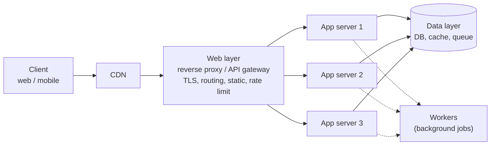
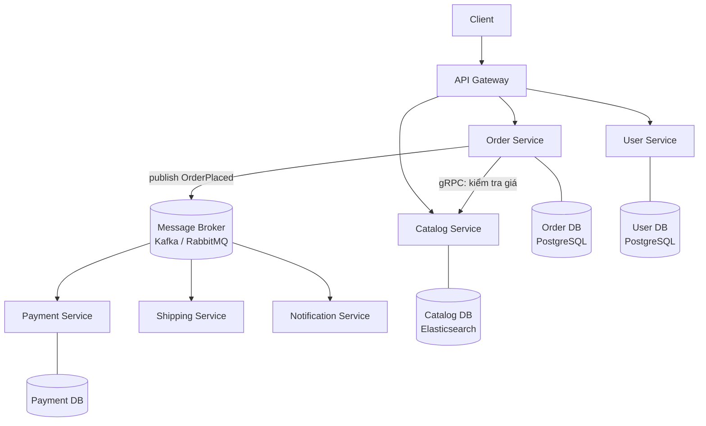
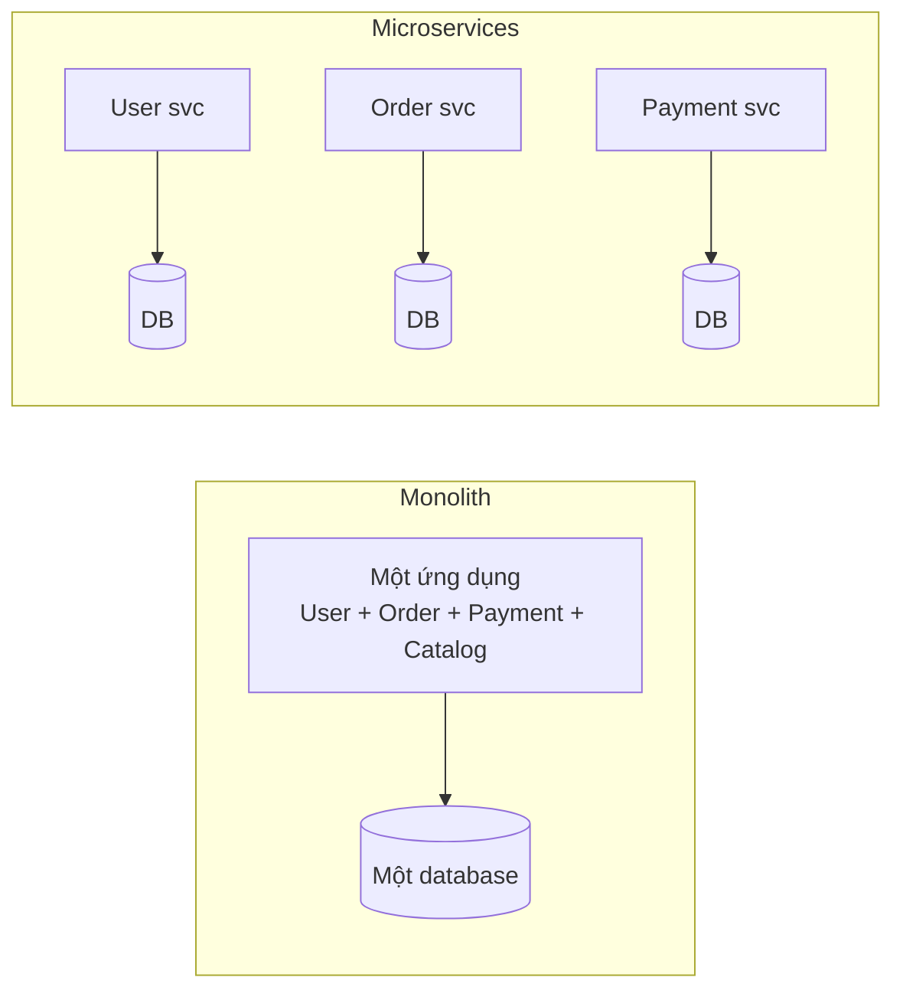
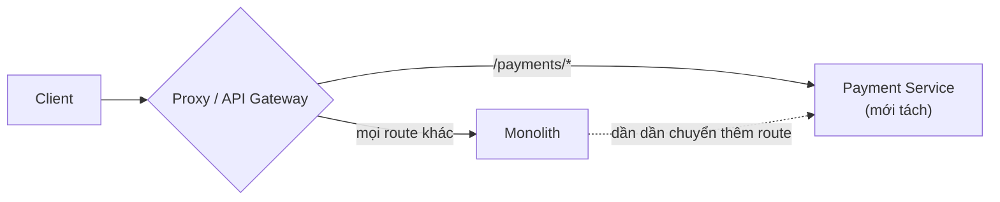
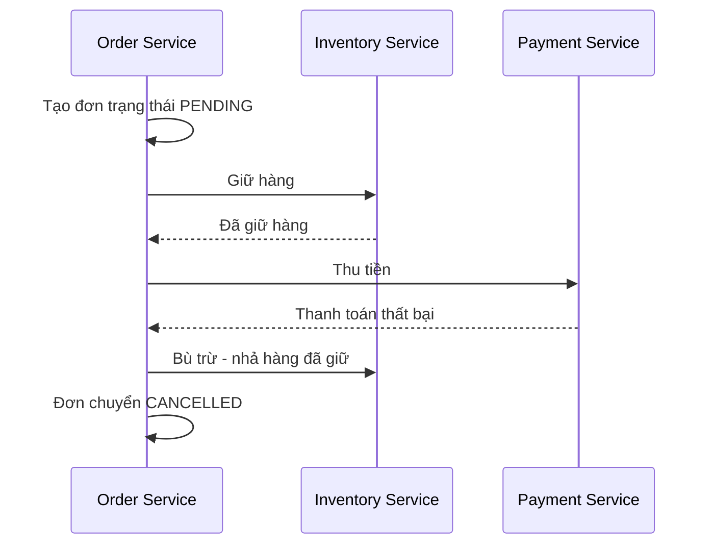

# Application Layer & Microservices

**Application layer** (tầng ứng dụng) là tầng chứa **business logic**, được **tách khỏi web layer** (tầng tiếp nhận request: reverse proxy, web server, phục vụ static, API gateway). Khi tách ra, mỗi tầng có thể **scale và cấu hình độc lập**. Đi xa hơn một bước, chính tầng ứng dụng có thể được chia thành nhiều **microservices** — các dịch vụ nhỏ, triển khai độc lập, mỗi dịch vụ phụ trách một năng lực nghiệp vụ.

**Tương tự đơn giản:** Nhà hàng nhỏ: một người vừa đón khách, vừa nấu, vừa thu tiền (monolith gộp mọi tầng). Nhà hàng lớn tách **lễ tân** (web layer) khỏi **bếp** (application layer). Chuỗi nhà hàng còn chia bếp thành **bếp nóng, bếp lạnh, quầy bánh** — mỗi bếp có đội riêng, thực đơn riêng, có thể mở rộng riêng (microservices). Nhưng càng chia nhỏ, càng cần phối hợp: phiếu order, người chạy món, và một món chậm có thể làm cả bàn phải chờ.

---

:::note[Ghi nhớ nhanh]

- ⭐ **Tách web layer khỏi application layer** — scale và triển khai từng tầng độc lập; web layer gọn nhẹ lo TLS, routing, static; app layer lo nghiệp vụ.
- ⭐ **Microservices = nhiều service nhỏ, deploy độc lập, sở hữu dữ liệu riêng** — giao tiếp qua mạng (HTTP/gRPC/message), tổ chức theo năng lực nghiệp vụ (bounded context).
- **Lợi ích:** đội làm việc độc lập, deploy độc lập, scale từng phần, cô lập lỗi, tự do công nghệ.
- **Cái giá:** hệ thống phân tán — latency mạng, lỗi một phần, nhất quán dữ liệu (saga), debug khó, vận hành nặng.
- **Đừng bắt đầu bằng microservices** — bắt đầu bằng **modular monolith** ranh giới rõ ràng, tách khi có lý do cụ thể (đội lớn, phần cần scale riêng, nhịp release khác nhau).

:::

---

## Mục lục

- [Vì sao cần tách Application Layer?](#vì-sao-cần-tách-application-layer)
- [1. Application Layer là gì?](#1-application-layer-là-gì)
- [2. Microservices là gì?](#2-microservices-là-gì)
- [3. Monolith vs Microservices](#3-monolith-vs-microservices)
- [4. Khi nào nên tách service?](#4-khi-nào-nên-tách-service)
- [5. Giao tiếp và dữ liệu giữa các service](#5-giao-tiếp-và-dữ-liệu-giữa-các-service)
- [6. Nhược điểm của Microservices](#6-nhược-điểm-của-microservices)
- [Khi nào dùng?](#khi-nào-dùng)
- [Lỗi thường gặp](#lỗi-thường-gặp)
- [Câu hỏi phỏng vấn](#câu-hỏi-phỏng-vấn)

---

## Vì sao cần tách Application Layer?

**Vấn đề:** Khi web server và business logic nằm chung một process, mọi thứ phải scale cùng nhau. Việc nhận hàng chục nghìn kết nối (nhiều kết nối chậm, nhiều file tĩnh) cần đặc tính khác hẳn việc xử lý nghiệp vụ nặng CPU. Thêm một tính năng nặng (xuất báo cáo) cũng ảnh hưởng khả năng phục vụ trang chủ. Với codebase lớn và nhiều đội, một ứng dụng nguyên khối khiến mọi người dẫm chân nhau: một thay đổi nhỏ phải build–test–deploy cả hệ thống.

**Giải pháp:**

1. **Tách web layer và application layer** — web layer (nginx, API gateway) tiếp nhận và định tuyến; application layer (các app server) xử lý nghiệp vụ. Mỗi tầng scale riêng.
2. Khi tổ chức và sản phẩm đủ lớn, **chia application layer thành microservices** theo năng lực nghiệp vụ, mỗi service có đội sở hữu, dữ liệu riêng và vòng đời deploy riêng.

:::tip[Dùng thực tế]

- **Amazon** (đầu những năm 2000) chuyển từ monolith sang kiến trúc hướng dịch vụ với nguyên tắc mọi đội giao tiếp qua API — nền tảng cho AWS sau này.
- **Netflix** chuyển sang microservices trên AWS sau sự cố hỏng database năm 2008, vận hành hàng trăm service độc lập.
- **Uber** từng có hàng nghìn microservice, sau đó gom lại thành các "domain" lớn hơn (DOMA) để giảm độ phức tạp — minh chứng việc chia quá nhỏ cũng có giá.
- **Shopify** chọn hướng ngược lại: **modular monolith** Ruby on Rails rất lớn, chia thành component có ranh giới rõ, thay vì microservices.

:::

---

## 1. Application Layer là gì?

Một kiến trúc web nhiều tầng điển hình:



| Tầng | Trách nhiệm | Đặc tính tải | Ví dụ |
| --- | --- | --- | --- |
| **Web layer** | TLS, nhận kết nối, phục vụ static, routing, rate limit, auth sơ bộ | Nhiều kết nối, I/O-bound, ít CPU nghiệp vụ | nginx, Envoy, Kong, AWS API Gateway |
| **Application layer** | Business logic, validation, điều phối giao dịch | CPU/I/O tuỳ nghiệp vụ | Node.js/Java/Go app server |
| **Data layer** | Lưu trữ, truy vấn | Phụ thuộc DB | PostgreSQL, Redis, Kafka |

Lợi ích của việc tách web layer khỏi app layer:

- **Scale độc lập** — thêm app server mà không cần thêm web server, và ngược lại.
- **Bảo mật** — chỉ web layer lộ ra Internet; app layer nằm trong mạng riêng.
- **Thêm API mới không cần thêm web server** — web layer chỉ định tuyến tới app server phù hợp.
- **Đơn giản hoá app** — TLS, nén, CORS, rate limit gom về một chỗ.
- **Worker** (background job) cũng thuộc application layer, dùng chung code nghiệp vụ nhưng chạy ở process khác (xem bài Background Jobs).

---

## 2. Microservices là gì?

Theo cách mô tả phổ biến của Martin Fowler và James Lewis (2014), **microservices** là cách xây dựng một ứng dụng thành **tập hợp các service nhỏ**, mỗi service:

- **Chạy trong process riêng**, giao tiếp qua cơ chế nhẹ (HTTP/REST, gRPC, message broker).
- **Xây quanh một năng lực nghiệp vụ** (business capability) — Order, Payment, Catalog, Shipping, Notification.
- **Triển khai độc lập** — đổi service Payment không cần deploy lại Catalog.
- **Sở hữu dữ liệu riêng** (database per service) — service khác không được truy vấn thẳng DB của nó.
- **Do một đội nhỏ sở hữu** từ code tới vận hành ("you build it, you run it").



Một khái niệm hay đi kèm là **bounded context** (ngữ cảnh giới hạn) trong Domain-Driven Design: một ranh giới trong đó các thuật ngữ và mô hình có nghĩa nhất quán. Ví dụ "Product" trong Catalog (mô tả, ảnh, thuộc tính) khác "Product" trong Inventory (SKU, số lượng tồn kho). Ranh giới service tốt thường trùng với bounded context.

**SOA vs microservices:** SOA (Service-Oriented Architecture) cũng chia hệ thống thành service, nhưng thường đi kèm **ESB** (Enterprise Service Bus) tập trung, chứa nhiều logic điều phối và dùng giao thức nặng (SOAP). Microservices ưu tiên "smart endpoints, dumb pipes" — logic nằm trong service, đường truyền đơn giản.

---

## 3. Monolith vs Microservices



| Tiêu chí | Monolith | Modular monolith | Microservices |
| --- | --- | --- | --- |
| Đơn vị deploy | 1 | 1 | Nhiều, độc lập |
| Gọi giữa các phần | Hàm trong process (ns) | Hàm qua interface module | Qua mạng (ms), có thể lỗi |
| Giao dịch dữ liệu | ACID trong 1 DB | ACID trong 1 DB | Phân tán — saga, eventual consistency |
| Scale | Cả khối | Cả khối | Từng service |
| Cô lập lỗi | Lỗi bộ nhớ có thể sập cả app | Như monolith | Một service lỗi, phần khác vẫn chạy (nếu thiết kế tốt) |
| Tự do công nghệ | Một stack | Một stack | Mỗi service có thể khác |
| Độc lập giữa các đội | Thấp | Trung bình | Cao |
| Vận hành | Đơn giản | Đơn giản | Phức tạp: discovery, tracing, CI/CD nhiều pipeline |
| Debug | Dễ (một stack trace) | Dễ | Khó (request đi qua nhiều service) |
| Phù hợp | Startup, đội nhỏ, sản phẩm chưa ổn định | Hầu hết sản phẩm vừa và lớn | Tổ chức nhiều đội, quy mô lớn |

---

## 4. Khi nào nên tách service?

Martin Fowler gọi nguyên tắc **"Monolith First"**: phần lớn câu chuyện microservices thành công bắt đầu từ một monolith đã lớn quá rồi mới tách; xây microservices từ đầu khi chưa hiểu rõ domain thường dẫn tới ranh giới sai — và sửa ranh giới giữa các service khó hơn nhiều so với giữa các module.

**Tín hiệu nên tách:**

- **Nhiều đội** (vd trên 3–4 đội) cùng sửa một codebase, xung đột merge và lịch release liên tục.
- Một phần có **đặc tính tải khác hẳn** (xử lý ảnh nặng CPU, search, realtime) cần scale riêng.
- Một phần cần **nhịp release khác** (thay đổi hằng ngày) trong khi phần lõi cần ổn định.
- Yêu cầu **cô lập** về bảo mật/tuân thủ (thanh toán PCI-DSS tách riêng để thu hẹp phạm vi kiểm toán).
- Cần **công nghệ khác** cho một bài toán cụ thể (ML bằng Python trong hệ thống Java).

**Tín hiệu CHƯA nên tách:**

- Đội dưới ~10 người, sản phẩm đang tìm product–market fit, domain còn thay đổi mạnh.
- Chưa có CI/CD tự động, monitoring, tracing, container orchestration.
- Lý do là "vì công ty lớn làm vậy" hoặc "cho CV đẹp".

**Cách tách an toàn — Strangler Fig pattern:**



1. Đặt proxy/gateway trước monolith.
2. Chọn một bounded context có ranh giới rõ, ít phụ thuộc (thường là Notification, Search, Payment).
3. Xây service mới, chuyển route tương ứng qua proxy; tách dữ liệu (đồng bộ dữ liệu trong giai đoạn chuyển tiếp).
4. Lặp lại; monolith "teo" dần.

---

## 5. Giao tiếp và dữ liệu giữa các service

### Đồng bộ vs bất đồng bộ

| Kiểu | Cơ chế | Ưu | Nhược |
| --- | --- | --- | --- |
| **Đồng bộ** | REST, gRPC | Đơn giản, nhận kết quả ngay | Coupling thời gian: service B chết thì A lỗi; latency cộng dồn |
| **Bất đồng bộ** | Event/message qua Kafka, RabbitMQ, SQS | Tách rời, chịu lỗi tốt, dễ fan-out | Eventual consistency, khó debug luồng, cần idempotent |

Nguyên tắc: dùng **đồng bộ** cho truy vấn cần kết quả ngay (lấy giá sản phẩm), **bất đồng bộ** cho thông báo "việc đã xảy ra" (`OrderPlaced`) mà nhiều service quan tâm.

```ts
// Gọi đồng bộ sang service khác: luôn có timeout + xử lý lỗi rõ ràng
async function getProductPrice(productId: string): Promise<number> {
  const res = await fetch(`${process.env.CATALOG_URL}/products/${productId}`, {
    signal: AbortSignal.timeout(800), // không chờ vô hạn
  });
  if (!res.ok) {
    throw new UpstreamError(`Catalog trả về ${res.status} cho sản phẩm ${productId}`);
  }
  const body = (await res.json()) as { price: number };
  return body.price;
}
```

### Database per service và giao dịch phân tán

Mỗi service sở hữu dữ liệu → **không còn transaction ACID xuyên service**. Đặt hàng (trừ kho + thu tiền + tạo đơn) phải dùng **Saga**: chuỗi transaction cục bộ, mỗi bước có **hành động bù trừ** (compensating action) nếu bước sau thất bại.



Các mẫu liên quan (sẽ gặp ở phần cloud patterns): **Saga**, **Transactional Outbox**, **CQRS**, **API Composition**, **Event Sourcing**.

### Hạ tầng đi kèm

- **API Gateway** — một điểm vào cho client, gom auth, rate limit, định tuyến tới service.
- **Service discovery** — service tìm địa chỉ của nhau khi instance thay đổi liên tục (bài tiếp theo).
- **Observability** — log tập trung, metrics, **distributed tracing** (OpenTelemetry, Jaeger) với correlation ID.
- **Resilience** — timeout, retry có backoff, **circuit breaker**, bulkhead.
- **Service mesh** (Istio, Linkerd) — đẩy mTLS, retry, tracing xuống sidecar thay vì code trong từng service.

---

## 6. Nhược điểm của Microservices

- **Hệ thống phân tán:** gọi qua mạng chậm hơn gọi hàm hàng nghìn lần và có thể thất bại một phần. Một request có thể đi qua 5–10 service; latency và xác suất lỗi cộng dồn (5 service mỗi service sẵn sàng 99,9% → chuỗi gọi đồng bộ chỉ còn khoảng 99,5%).
- **Nhất quán dữ liệu khó:** saga, eventual consistency, xử lý message trùng/không theo thứ tự.
- **Vận hành nặng:** mỗi service một pipeline CI/CD, cấu hình, dashboard, cảnh báo, on-call; cần Kubernetes/container, service discovery, tracing.
- **Test khó:** test tích hợp nhiều service, cần contract testing (Pact) để tránh vỡ API giữa các đội.
- **Distributed monolith:** chia service nhưng vẫn phải deploy cùng nhau, dùng chung DB, gọi đồng bộ chằng chịt — nhận đủ nhược điểm của cả hai mô hình.
- **Chi phí:** nhiều instance tối thiểu, chi phí mạng, công cụ quan sát.
- **Thay đổi xuyên service khó:** một tính năng chạm 4 service cần phối hợp 4 đội và versioning API.

---

## Khi nào dùng?

- **Tách web layer khỏi app layer:** gần như **luôn nên** khi chạy production — kể cả monolith cũng nên có reverse proxy/gateway phía trước.
- **Chọn monolith / modular monolith khi:**
  - Đội nhỏ, sản phẩm giai đoạn đầu, domain chưa rõ.
  - Cần tốc độ phát triển và đơn giản vận hành.
- **Chọn microservices khi:**
  - Nhiều đội cần làm việc và release độc lập.
  - Các phần có yêu cầu scale, công nghệ, bảo mật rất khác nhau.
  - Đã có nền tảng DevOps: CI/CD tự động, container orchestration, observability.
- **Best practice:**
  - Bắt đầu bằng modular monolith với ranh giới module theo bounded context.
  - Tách dần bằng Strangler Fig, mỗi lần một service.
  - Mỗi service sở hữu dữ liệu; giao tiếp qua API/event có version.
  - Ưu tiên giao tiếp bất đồng bộ cho luồng không cần kết quả ngay.

---

## Lỗi thường gặp

### Lỗi 1: Chia quá nhỏ (nano-services)

Mỗi bảng DB một service, mỗi endpoint một service → một request đi qua hàng chục hop, đội 5 người vận hành 40 service. Ranh giới nên theo **năng lực nghiệp vụ**, không theo bảng hay lớp kỹ thuật.

### Lỗi 2: Dùng chung database giữa các service

Service B truy vấn thẳng bảng của service A → A không thể đổi schema mà không làm vỡ B, hai service bị khoá chặt với nhau. Mỗi service chỉ truy cập DB của mình; dữ liệu của service khác lấy qua API hoặc event (có thể giữ bản sao chỉ đọc).

### Lỗi 3: Chuỗi gọi đồng bộ dài không có timeout

```text
Gateway → Order → Pricing → Promotion → User → Loyalty
```

Loyalty chậm 10 giây → mọi service phía trước giữ kết nối chờ → cạn thread pool → sập dây chuyền (cascading failure). Cần timeout ở mọi lời gọi, circuit breaker, fallback, và giảm chuỗi gọi đồng bộ bằng event/cache.

### Lỗi 4: Không có distributed tracing

Lỗi 500 ở client nhưng không biết service nào gây ra. Mọi service phải truyền **correlation ID / trace context** (chuẩn W3C `traceparent`) và gửi trace về hệ thống tập trung.

### Lỗi 5: Tách microservices để "sửa" code xấu

Monolith rối vì thiếu ranh giới module; tách thành microservices với cùng tư duy đó chỉ tạo ra **distributed monolith** — rối hơn và chậm hơn. Hãy làm sạch ranh giới trong monolith trước.

---

## Câu hỏi phỏng vấn

Những câu thường gặp về chủ đề này. Tự trả lời trước, rồi bấm **Xem đáp án** để đối chiếu.

**1. Vì sao nên tách web layer khỏi application layer?**

<details className="qa">
<summary>Xem đáp án</summary>

Hai tầng có đặc tính tải khác nhau: web layer xử lý nhiều kết nối, TLS, static, routing (I/O-bound); app layer xử lý nghiệp vụ. Tách ra cho phép **scale độc lập**, chỉ lộ web layer ra Internet (**bảo mật**), gom TLS/nén/rate limit/CORS về một chỗ, và thêm API/app server mới mà không đụng tới web server.

</details>

**2. Microservices là gì? Đặc điểm của một service "đúng nghĩa"?**

<details className="qa">
<summary>Xem đáp án</summary>

Kiến trúc chia ứng dụng thành các service nhỏ, mỗi service: xây quanh một năng lực nghiệp vụ (bounded context), chạy process riêng, **deploy độc lập**, **sở hữu dữ liệu riêng**, giao tiếp qua API/message, do một đội sở hữu. Nếu các service phải deploy cùng nhau hoặc dùng chung DB thì đó là distributed monolith, không phải microservices.

</details>

**3. So sánh monolith và microservices. Bạn sẽ chọn gì cho một startup 5 người?**

<details className="qa">
<summary>Xem đáp án</summary>

Monolith: đơn giản, gọi hàm nhanh, ACID dễ, debug dễ, nhưng scale cả khối và các đội dẫm chân nhau khi lớn. Microservices: đội độc lập, scale từng phần, cô lập lỗi, nhưng phải trả giá của hệ phân tán (latency, lỗi một phần, saga, tracing, vận hành). Với startup 5 người: **modular monolith** — tốc độ phát triển cao, ranh giới module rõ để sau này tách khi có lý do cụ thể.

</details>

**4. Làm sao xử lý giao dịch trải qua nhiều service (vd đặt hàng: giữ kho, thu tiền, tạo đơn)?**

<details className="qa">
<summary>Xem đáp án</summary>

Không dùng 2PC (two-phase commit) vì khoá tài nguyên lâu và kém sẵn sàng. Dùng **Saga**: chuỗi transaction cục bộ, mỗi bước có hành động bù trừ khi bước sau thất bại (nhả hàng, hoàn tiền). Hai kiểu: **choreography** (các service phản ứng với event của nhau) và **orchestration** (một orchestrator điều phối). Kết hợp **Transactional Outbox** để ghi DB và phát event nhất quán, và consumer idempotent.

</details>

**5. Bạn sẽ tách một monolith lớn thành microservices như thế nào?**

<details className="qa">
<summary>Xem đáp án</summary>

- Xác định bounded context, làm rõ ranh giới module **ngay trong monolith** trước.
- Dựng nền tảng: CI/CD, container, observability, API gateway.
- Áp dụng **Strangler Fig**: đặt proxy trước monolith, tách từng context ít phụ thuộc (Notification, Search...), chuyển route dần.
- Tách dữ liệu: service mới sở hữu bảng của mình, đồng bộ dữ liệu trong giai đoạn chuyển tiếp (CDC/event).
- Đo lường và lặp lại; không tách mọi thứ cùng lúc.

</details>

**6. Distributed monolith là gì và dấu hiệu nhận biết?**

<details className="qa">
<summary>Xem đáp án</summary>

Là hệ thống chia thành nhiều service nhưng vẫn **coupling chặt** như monolith: phải deploy nhiều service cùng lúc cho một thay đổi, dùng chung database, chuỗi gọi đồng bộ dài, một service chết kéo sập tất cả, thay đổi API phải phối hợp mọi đội. Nhận đủ nhược điểm của phân tán mà không có lợi ích độc lập. Khắc phục: vẽ lại ranh giới theo nghiệp vụ, tách dữ liệu, chuyển sang giao tiếp bất đồng bộ, versioning API.

</details>
