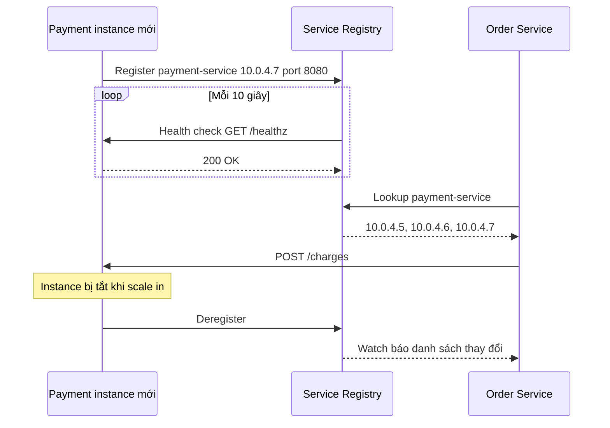
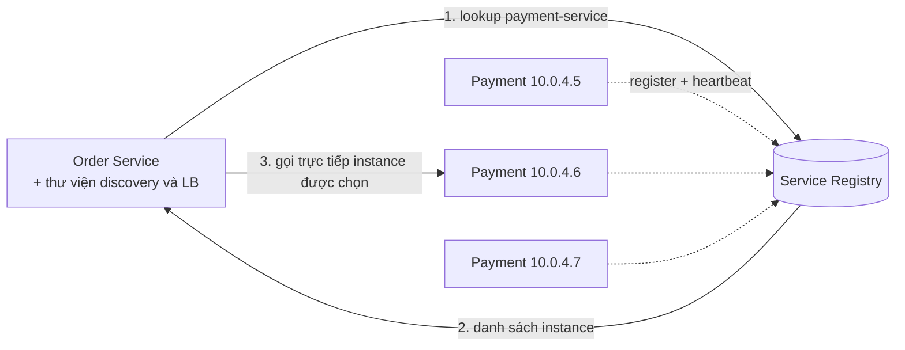
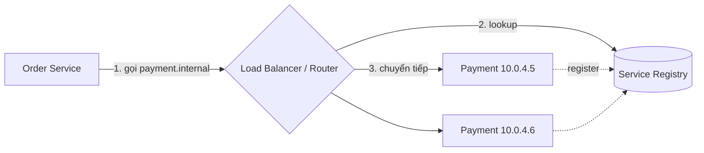
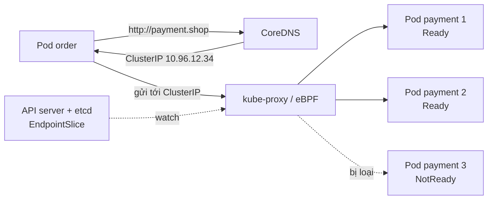

# Service Discovery

**Service discovery** (khám phá dịch vụ) là cơ chế giúp một service **tìm ra địa chỉ mạng (IP, port) hiện tại** của service khác mà nó cần gọi, trong môi trường mà các instance **liên tục được tạo, huỷ, di chuyển** (auto-scaling, deploy, container bị lập lịch lại). Trái tim của nó là **service registry** — một "danh bạ" động ghi lại instance nào đang sống và ở đâu.

**Tương tự đơn giản:** Ở một hội chợ, các gian hàng liên tục dọn đi, dọn tới. Thay vì nhớ "gian giày ở ô số 12" (có thể đã chuyển), bạn hỏi **quầy thông tin** — quầy luôn cập nhật gian nào đang mở và ở đâu. Gian hàng mới tới thì báo danh với quầy (register), gian nào đóng cửa thì bị gạch tên (deregister / health check fail).

---

:::note[Ghi nhớ nhanh]

- ⭐ **Service registry = danh bạ động của các instance đang khoẻ** — instance đăng ký khi khởi động, bị gỡ khi tắt hoặc health check thất bại.
- ⭐ **Client-side discovery:** client hỏi registry rồi tự chọn instance và tự load balance. **Server-side discovery:** client gọi một địa chỉ cố định (LB/proxy), LB hỏi registry thay client.
- **Công cụ:** Consul, etcd, ZooKeeper, Eureka (Netflix); trong **Kubernetes** discovery có sẵn qua `Service` + DNS nội bộ (`my-svc.my-ns.svc.cluster.local`).
- **Health check là bắt buộc** — registry chứa instance chết còn tệ hơn không có registry.
- **Registry phải HA và nhất quán** — Consul/etcd/ZooKeeper dùng thuật toán đồng thuận (Raft, ZAB) và chạy cụm 3 hoặc 5 node.

:::

---

## Mục lục

- [Vì sao cần Service Discovery?](#vì-sao-cần-service-discovery)
- [1. Service Discovery là gì?](#1-service-discovery-là-gì)
- [2. Service Registry](#2-service-registry)
- [3. Client-side discovery](#3-client-side-discovery)
- [4. Server-side discovery](#4-server-side-discovery)
- [5. Health check](#5-health-check)
- [6. Công cụ Consul, etcd, ZooKeeper](#6-công-cụ-consul-etcd-zookeeper)
- [7. Service discovery trong Kubernetes](#7-service-discovery-trong-kubernetes)
- [Khi nào dùng?](#khi-nào-dùng)
- [Lỗi thường gặp](#lỗi-thường-gặp)
- [Câu hỏi phỏng vấn](#câu-hỏi-phỏng-vấn)

---

## Vì sao cần Service Discovery?

**Vấn đề:** Thời server vật lý, IP của server gần như cố định — ghi cứng vào file cấu hình là đủ. Với cloud và container:

- Instance được **autoscale** — 3 instance lúc 3h sáng, 30 instance lúc 8h tối.
- Mỗi lần **deploy**, instance cũ bị thay bằng instance mới với IP mới.
- Container bị **lập lịch lại** sang node khác khi node chết; port có thể được cấp động.
- Có hàng chục, hàng trăm service gọi nhau.

Ghi cứng IP trong cấu hình nghĩa là mỗi thay đổi phải sửa cấu hình và restart — không khả thi, và gọi nhầm instance đã chết gây lỗi.

**Giải pháp:** Một **service registry** lưu danh sách instance theo tên service. Instance tự đăng ký (hoặc được nền tảng đăng ký hộ), registry health check liên tục. Bên gọi chỉ cần biết **tên logic** (`payment-service`), cơ chế discovery phân giải ra địa chỉ thật của một instance khoẻ.

:::tip[Dùng thực tế]

- **Netflix Eureka + Ribbon:** Netflix xây Eureka làm registry và Ribbon làm client-side load balancer cho hàng trăm service trên AWS (sau này Spring Cloud Netflix phổ biến chúng trong giới Java).
- **Kubernetes:** mọi `Service` tự động có tên DNS; pod gọi `http://payment` và CoreDNS + kube-proxy lo phần còn lại.
- **HashiCorp Consul:** dùng rộng rãi cho hệ thống lai VM + container, nhiều data center, kèm health check và key–value store.
- **AWS ECS / Cloud Map, Azure Service Fabric:** discovery được tích hợp trong nền tảng.

:::

---

## 1. Service Discovery là gì?

Service discovery gồm ba hoạt động:

1. **Registration (đăng ký):** khi instance khởi động xong, thông tin `{ tên service, IP, port, metadata, health check }` được ghi vào registry.
2. **Discovery (tra cứu):** bên gọi hỏi registry "các instance khoẻ của `payment-service` là gì?".
3. **Deregistration (huỷ đăng ký):** khi instance tắt (graceful) hoặc health check thất bại / hết hạn TTL / mất heartbeat, nó bị gỡ khỏi registry.

Có hai cách đăng ký:

| Kiểu đăng ký | Cách làm | Ưu | Nhược |
| --- | --- | --- | --- |
| **Self-registration** | Instance tự gọi API registry khi khởi động, gửi heartbeat, tự huỷ khi tắt | Đơn giản, không cần thành phần thêm | Code app phụ thuộc registry; mỗi ngôn ngữ cần thư viện |
| **Third-party registration** | Một thành phần khác (registrar, platform) theo dõi và đăng ký hộ | App không biết registry tồn tại | Cần thêm thành phần (Kubernetes, Registrator, Consul agent) |

---

## 2. Service Registry

**Service registry** là cơ sở dữ liệu của các instance dịch vụ. Yêu cầu chính:

- **Sẵn sàng cao** — registry sập thì không ai tìm được ai. Chạy cụm 3–5 node; client nên **cache** kết quả để vẫn hoạt động tạm thời khi registry gặp sự cố.
- **Cập nhật nhanh** — instance chết phải bị gỡ trong vài giây.
- **Có cơ chế theo dõi thay đổi (watch)** — client nhận thông báo khi danh sách đổi thay vì poll liên tục.

**CP hay AP?** Đây là chỗ CAP theorem xuất hiện:

| Registry | Thiên về | Đặc điểm |
| --- | --- | --- |
| **ZooKeeper, etcd, Consul (catalog)** | CP (nhất quán) | Dùng đồng thuận Raft/ZAB; khi mất quorum có thể từ chối ghi |
| **Eureka** | AP (sẵn sàng) | Các node sao chép lẫn nhau kiểu peer-to-peer; khi phân mảnh mạng vẫn trả dữ liệu (có thể cũ), có "self-preservation mode" để không xoá hàng loạt instance khi mất heartbeat diện rộng |

Với service discovery, nhiều người cho rằng **AP thường hợp lý hơn**: trả về danh sách hơi cũ (client sẽ retry sang instance khác) tốt hơn là không trả gì. Nhưng các registry CP phổ biến vẫn chạy tốt nhờ client cache và cụm được vận hành ổn định.



---

## 3. Client-side discovery

Trong **client-side discovery**, **service gọi** (client) tự hỏi registry, nhận danh sách instance, rồi **tự chọn** một instance theo thuật toán load balancing (round robin, least request...) và gọi trực tiếp.



Ví dụ client-side discovery tối giản với Consul HTTP API:

```ts
// Hỏi Consul các instance KHOẺ của một service, cache ngắn hạn, chọn ngẫu nhiên
type Instance = { address: string; port: number };

const CACHE_TTL_MS = 5000;
const cache = new Map<string, { instances: Instance[]; expiresAt: number }>();

async function resolveService(name: string): Promise<Instance> {
  const cached = cache.get(name);
  const now = Date.now();
  let instances = cached && cached.expiresAt > now ? cached.instances : undefined;

  if (!instances) {
    try {
      const res = await fetch(
        `${process.env.CONSUL_URL}/v1/health/service/${encodeURIComponent(name)}?passing=true`,
        { signal: AbortSignal.timeout(1000) },
      );
      if (!res.ok) throw new Error(`Consul trả về ${res.status}`);
      const body = (await res.json()) as Array<{ Service: { Address: string; Port: number } }>;
      instances = body.map((e) => ({ address: e.Service.Address, port: e.Service.Port }));
      cache.set(name, { instances, expiresAt: now + CACHE_TTL_MS });
    } catch (err) {
      // Registry lỗi: dùng tạm danh sách cũ nếu có, thay vì sập theo
      if (cached) {
        logger.warn({ err, name }, 'Không gọi được Consul, dùng danh sách cache cũ');
        instances = cached.instances;
      } else {
        throw err;
      }
    }
  }

  if (instances.length === 0) throw new Error(`Không có instance khoẻ cho ${name}`);
  return instances[Math.floor(Math.random() * instances.length)];
}
```

**Ưu điểm:**

- **Ít hop mạng** — gọi thẳng instance, không qua LB trung gian.
- Client **tự chọn thuật toán** LB thông minh (theo zone, theo latency, consistent hashing).
- Không có LB trung tâm làm nút thắt.

**Nhược điểm:**

- **Client bị coupling với registry**; logic discovery + LB phải có ở **mọi ngôn ngữ** dùng trong hệ thống (Java có Eureka/Ribbon, nhưng service Go, Python cần thư viện khác).
- Cập nhật logic discovery cần cập nhật mọi service.

Ví dụ: Netflix Eureka + Ribbon (nay Spring Cloud LoadBalancer), gRPC client với resolver tuỳ chỉnh, Finagle (Twitter).

---

## 4. Server-side discovery

Trong **server-side discovery**, client gọi tới **một địa chỉ cố định** (load balancer, router, proxy). **LB/proxy** mới là bên hỏi registry và chuyển request tới instance khoẻ. Client hoàn toàn không biết về registry.



**Ưu điểm:**

- **Client đơn giản** — chỉ gọi một hostname; ngôn ngữ nào cũng dùng được.
- Logic discovery tập trung, nâng cấp một chỗ.
- Nhiều nền tảng có sẵn: AWS ALB + ECS/target group, Kubernetes `Service`.

**Nhược điểm:**

- **Thêm một hop mạng** (latency nhỏ).
- LB phải được làm **HA**, nếu không là SPOF và nút thắt.

### Biến thể: service mesh

**Service mesh** (Istio, Linkerd, Consul Connect) đặt một **sidecar proxy** (thường là Envoy) cạnh mỗi instance. Ứng dụng gọi `localhost`/tên service như bình thường; sidecar nhận danh sách endpoint từ control plane, tự load balance, retry, mTLS, tracing. Về bản chất: discovery chạy **phía client** (sidecar cạnh client chọn instance) nhưng **trong suốt với code ứng dụng** — lấy ưu điểm của cả hai mô hình, đổi lại độ phức tạp vận hành tăng.

### So sánh

| Tiêu chí | Client-side | Server-side | Service mesh |
| --- | --- | --- | --- |
| Ai hỏi registry | Code/thư viện trong client | LB / router | Sidecar proxy |
| Số hop | Ít nhất | Thêm 1 hop qua LB | Thêm 2 hop cục bộ (localhost, rất nhanh) |
| Phụ thuộc ngôn ngữ | Cao | Không | Không |
| LB thông minh theo client | Có | Hạn chế | Có |
| Độ phức tạp | Trong code | Trong hạ tầng LB | Trong nền tảng mesh |
| Ví dụ | Eureka + Ribbon, gRPC resolver | AWS ALB, K8s Service, nginx + Consul Template | Istio, Linkerd |

---

## 5. Health check

Registry chỉ có giá trị khi nó **phản ánh đúng instance nào khoẻ**. Các cơ chế:

- **Heartbeat / TTL:** instance định kỳ báo "tôi còn sống"; quá TTL không báo → bị gỡ (Eureka mặc định heartbeat 30 giây; etcd dùng **lease** có TTL gắn với key).
- **Active check từ registry/agent:** registry gọi HTTP `/healthz`, mở TCP, hoặc chạy script định kỳ (Consul hỗ trợ HTTP, TCP, gRPC, script, TTL check).
- **Session/ephemeral node:** ZooKeeper tạo **ephemeral znode** gắn với session của client; client mất kết nối quá session timeout → znode tự biến mất.

Cấu hình service và health check trong Consul:

```json
{
  "service": {
    "name": "payment-service",
    "port": 8080,
    "tags": ["v2", "primary"],
    "check": {
      "http": "http://localhost:8080/healthz",
      "interval": "10s",
      "timeout": "2s",
      "deregister_critical_service_after": "1m"
    }
  }
}
```

Nguyên tắc:

- Tách **liveness** (process còn chạy không — fail thì restart) và **readiness** (sẵn sàng nhận traffic chưa — fail thì gỡ khỏi danh sách nhưng không restart).
- Health check có **timeout ngắn**, không kiểm tra quá sâu các phụ thuộc không thiết yếu.
- Khi tắt instance: **deregister trước**, chờ client cập nhật, rồi mới dừng nhận request (graceful shutdown).

---

## 6. Công cụ Consul, etcd, ZooKeeper

| Công cụ | Đồng thuận | Điểm mạnh | Dùng phổ biến cho |
| --- | --- | --- | --- |
| **Consul** (HashiCorp) | Raft | Service catalog, health check đa dạng, **DNS interface** (`payment.service.consul`), KV store, đa data center, service mesh (Connect) | Discovery cho VM + container, đa DC |
| **etcd** (CNCF) | Raft | KV store nhất quán mạnh, watch, lease; là **kho dữ liệu của Kubernetes** | Lưu trạng thái cluster, cấu hình, leader election |
| **ZooKeeper** (Apache) | ZAB | Lâu đời, ephemeral/sequential znode, watch | Hệ sinh thái Hadoop, HBase, Kafka đời cũ (Kafka mới dùng KRaft thay ZooKeeper) |
| **Eureka** (Netflix) | Không (AP, replicate P2P) | Đơn giản, tích hợp Spring Cloud | Hệ thống Java/Spring |

Một số lưu ý:

- **etcd và ZooKeeper** là **kho KV nhất quán** — discovery là một ứng dụng xây trên đó (tự đăng ký key có lease/ephemeral, client watch prefix). **Consul và Eureka** là sản phẩm discovery "đóng gói sẵn".
- Cụm đồng thuận chạy **số node lẻ** (3 hoặc 5): cụm 3 node chịu mất 1, cụm 5 node chịu mất 2. Thêm node làm ghi chậm hơn vì cần quorum lớn hơn.

```bash
# Consul: tra cứu qua DNS interface — mọi ngôn ngữ dùng được, không cần thư viện
dig @127.0.0.1 -p 8600 payment-service.service.consul SRV

# etcd: đăng ký instance với lease 15 giây (instance phải keep-alive lease)
LEASE_ID=$(etcdctl lease grant 15 | awk '{print $2}')
etcdctl put /services/payment/10.0.4.7:8080 '{"zone":"ap-southeast-1a"}' --lease="$LEASE_ID"
etcdctl lease keep-alive "$LEASE_ID" &

# Client theo dõi thay đổi danh sách instance
etcdctl watch --prefix /services/payment/
```

---

## 7. Service discovery trong Kubernetes

Kubernetes tích hợp discovery **server-side** sẵn, nên phần lớn ứng dụng chạy trên K8s **không cần** Consul/Eureka:

- **Pod** có IP thay đổi khi bị tạo lại.
- **Service** tạo một tên ổn định và một **ClusterIP** ảo; nó chọn pod theo **label selector**.
- **EndpointSlice** liệt kê IP của các pod **đang Ready** (readiness probe pass) — đây chính là service registry, lưu trong **etcd** của cluster.
- **CoreDNS** phân giải tên `payment.shop.svc.cluster.local` (hoặc ngắn gọn `payment` trong cùng namespace) ra ClusterIP.
- **kube-proxy** (iptables/IPVS) hoặc eBPF (Cilium) chuyển traffic từ ClusterIP tới một pod khoẻ — cân bằng tải ở L4.

```yaml
apiVersion: v1
kind: Service
metadata:
  name: payment
  namespace: shop
spec:
  selector:
    app: payment            # mọi pod có label app=payment và đang Ready
  ports:
    - port: 80
      targetPort: 8080
---
apiVersion: apps/v1
kind: Deployment
metadata:
  name: payment
  namespace: shop
spec:
  replicas: 3
  selector:
    matchLabels:
      app: payment
  template:
    metadata:
      labels:
        app: payment
    spec:
      containers:
        - name: payment
          image: shop/payment:2.3.0
          ports:
            - containerPort: 8080
          readinessProbe:          # chỉ pod Ready mới có trong EndpointSlice
            httpGet: { path: /healthz/ready, port: 8080 }
            periodSeconds: 5
          livenessProbe:
            httpGet: { path: /healthz/live, port: 8080 }
            periodSeconds: 10
```



Ghi chú:

- **Headless Service** (`clusterIP: None`): DNS trả về **IP của từng pod** thay vì một ClusterIP — dùng cho client-side discovery (gRPC client tự load balance) hoặc StatefulSet (`db-0.db.shop.svc.cluster.local`).
- kube-proxy cân bằng theo **kết nối** (L4). Với gRPC/HTTP2 (một kết nối dài mang nhiều request), mọi request có thể dồn vào một pod → dùng headless service + client-side LB, hoặc service mesh để cân bằng theo request.
- Giao tiếp **xuyên cluster** hoặc với VM ngoài cluster vẫn cần công cụ như Consul, multi-cluster service mesh.

---

## Khi nào dùng?

- **Cần service discovery khi:**
  - Có nhiều service gọi nhau và instance thay đổi động (autoscale, container).
  - Chạy microservices trên VM/container không có orchestration sẵn discovery.
- **Không cần công cụ riêng khi:**
  - Chạy trên **Kubernetes** trong một cluster — dùng `Service` + DNS.
  - Hệ thống nhỏ, vài service, đã có **load balancer với DNS cố định** (vd `payment.internal` trỏ tới ALB).
- **Chọn kiểu:**
  - **Server-side** (LB, K8s Service) là mặc định — đơn giản, độc lập ngôn ngữ.
  - **Client-side** khi cần LB thông minh, giảm hop, gRPC long-lived connection.
  - **Service mesh** khi có nhiều service, cần mTLS, retry, tracing đồng nhất và đội có năng lực vận hành.

---

## Lỗi thường gặp

### Lỗi 1: Ghi cứng IP trong cấu hình

```text
# SAI — IP đổi sau mỗi lần deploy/scale
PAYMENT_URL=http://10.0.4.5:8080

# ĐÚNG — dùng tên logic, để discovery phân giải
PAYMENT_URL=http://payment.shop.svc.cluster.local
```

### Lỗi 2: Không có health check hoặc deregister

Instance chết vẫn nằm trong registry → một phần request lỗi ngẫu nhiên, rất khó debug. Luôn cấu hình health check và `deregister` tự động khi critical quá lâu.

### Lỗi 3: Phụ thuộc registry trên đường nóng mà không cache

Mỗi request đều hỏi registry → registry thành nút thắt; registry chập chờn → toàn hệ thống lỗi. Client phải **cache** danh sách, dùng **watch** để cập nhật, và tiếp tục dùng danh sách cũ khi registry tạm thời không phản hồi.

### Lỗi 4: Cache DNS quá lâu trong ứng dụng

Dùng DNS-based discovery nhưng runtime cache DNS vĩnh viễn hoặc connection pool giữ kết nối mãi → vẫn gọi IP của pod đã chết. Đặt TTL cache DNS ngắn, giới hạn tuổi kết nối, retry sang instance khác khi lỗi kết nối.

### Lỗi 5: Cụm registry số node chẵn hoặc chỉ 1 node

Cụm etcd/Consul 1 node là SPOF; 2 hoặc 4 node không tăng khả năng chịu lỗi so với 1 hoặc 3 node (quorum của 4 là 3, vẫn chỉ chịu mất 1). Dùng 3 hoặc 5 node, trải trên nhiều zone.

---

## Câu hỏi phỏng vấn

Những câu thường gặp về chủ đề này. Tự trả lời trước, rồi bấm **Xem đáp án** để đối chiếu.

**1. Service discovery giải quyết vấn đề gì?**

<details className="qa">
<summary>Xem đáp án</summary>

Trong môi trường cloud/container, instance được tạo, huỷ, di chuyển liên tục nên IP/port không cố định. Service discovery cho phép service gọi nhau bằng **tên logic**, còn registry giữ danh sách instance **khoẻ** hiện tại (đăng ký khi khởi động, gỡ khi tắt hoặc health check thất bại). Nhờ vậy autoscale, deploy, failover không cần sửa cấu hình.

</details>

**2. So sánh client-side và server-side discovery.**

<details className="qa">
<summary>Xem đáp án</summary>

- **Client-side:** client hỏi registry, tự chọn instance và gọi thẳng. Ít hop, LB linh hoạt; nhưng mỗi ngôn ngữ cần thư viện, client coupling với registry. Ví dụ Eureka + Ribbon.
- **Server-side:** client gọi LB/router có địa chỉ cố định; LB hỏi registry và chuyển tiếp. Client đơn giản, độc lập ngôn ngữ; nhưng thêm hop và LB phải HA. Ví dụ AWS ALB, Kubernetes Service.
- **Service mesh:** sidecar làm discovery + LB phía client nhưng trong suốt với code.

</details>

**3. Kubernetes làm service discovery như thế nào?**

<details className="qa">
<summary>Xem đáp án</summary>

`Service` chọn pod theo label selector; control plane duy trì **EndpointSlice** chứa IP các pod đang Ready (dựa trên readiness probe), lưu trong etcd. **CoreDNS** phân giải `svc.ns.svc.cluster.local` ra ClusterIP; **kube-proxy** (iptables/IPVS) hoặc eBPF chuyển traffic từ ClusterIP tới pod khoẻ. Headless service trả thẳng IP các pod cho client-side discovery hoặc StatefulSet.

</details>

**4. Service registry nên là CP hay AP? Vì sao?**

<details className="qa">
<summary>Xem đáp án</summary>

Lập luận AP (Eureka): với discovery, trả danh sách **hơi cũ** vẫn tốt hơn không trả gì — client gọi nhầm instance chết thì retry sang instance khác. CP (etcd, ZooKeeper, Consul) đảm bảo dữ liệu nhất quán nhưng khi mất quorum có thể không ghi được. Thực tế cả hai đều dùng được nếu client **cache** danh sách và có retry; quan trọng là hệ thống không sập khi registry gặp sự cố.

</details>

**5. Tại sao gRPC chạy trên Kubernetes Service thường bị lệch tải và cách khắc phục?**

<details className="qa">
<summary>Xem đáp án</summary>

gRPC dùng HTTP/2 với **một kết nối dài** chứa nhiều request. kube-proxy cân bằng ở L4 **theo kết nối**, nên mọi request của một client đi vào cùng một pod. Khắc phục: dùng **headless service** để client nhận danh sách IP pod và gRPC client tự load balance (round robin) theo request; hoặc dùng **service mesh** / L7 proxy (Envoy, Linkerd) cân bằng theo request; hoặc giới hạn tuổi kết nối để client định kỳ kết nối lại.

</details>

**6. Health check trong service discovery hoạt động thế nào? Liveness khác readiness ra sao?**

<details className="qa">
<summary>Xem đáp án</summary>

Cơ chế: heartbeat/TTL (instance tự báo), active check (registry/agent gọi `/healthz`, TCP, gRPC), hoặc session/ephemeral node (ZooKeeper). Instance fail bị gỡ khỏi danh sách.

- **Liveness:** process còn hoạt động không — fail thì **restart**.
- **Readiness:** đã sẵn sàng nhận traffic chưa (đang warm-up, mất kết nối DB) — fail thì **gỡ khỏi danh sách** nhưng không restart.

Gộp hai loại làm một dễ gây restart vòng lặp hoặc nhận traffic khi chưa sẵn sàng.

</details>
