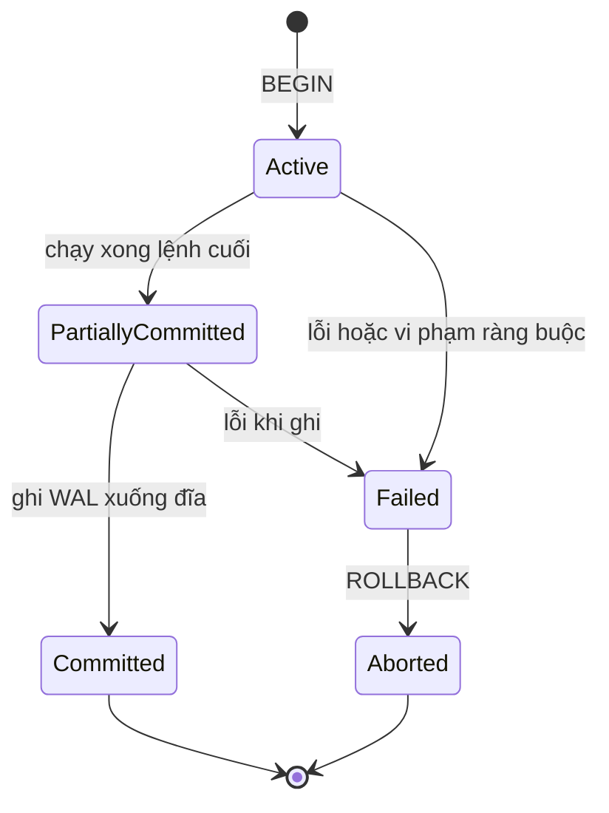
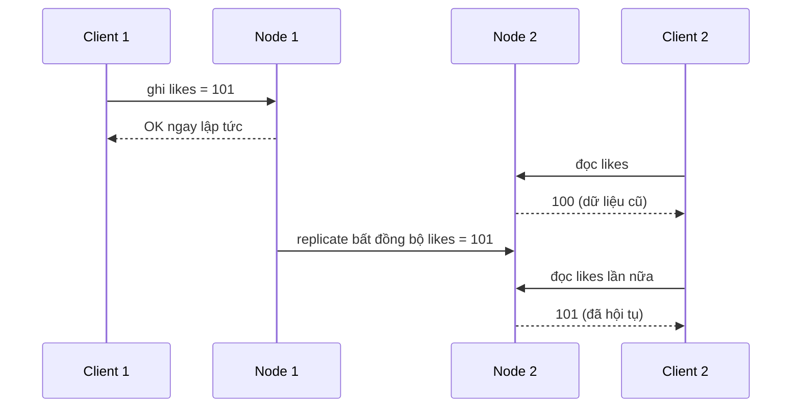
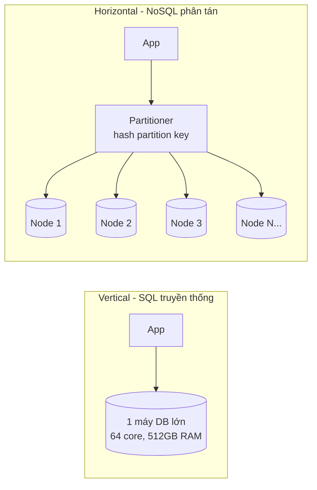
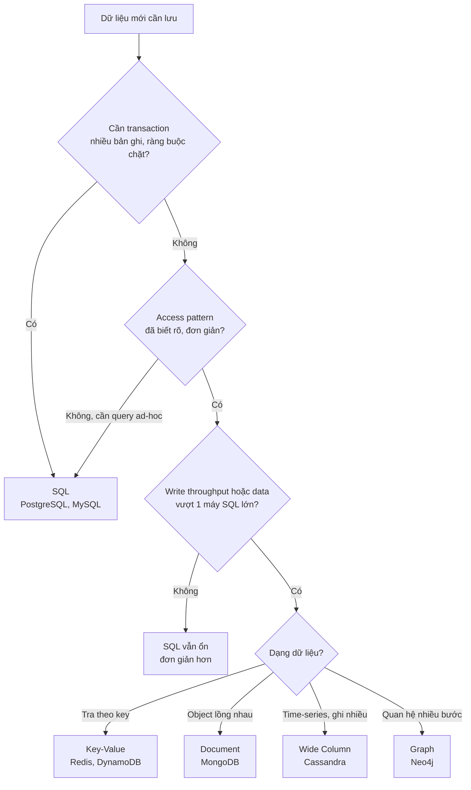
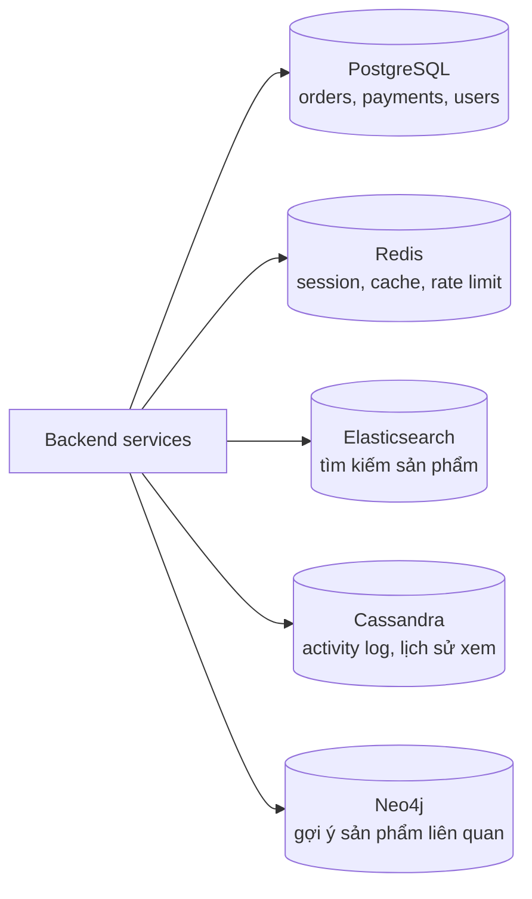

# SQL vs NoSQL

**Database** (cơ sở dữ liệu) là nơi hệ thống lưu trữ **trạng thái bền vững** -- user, đơn hàng, bài viết, số dư tài khoản. Trong system design, câu hỏi đầu tiên khi vẽ tầng dữ liệu gần như luôn là: dùng **SQL** (cơ sở dữ liệu quan hệ -- relational database, ví dụ PostgreSQL, MySQL) hay **NoSQL** (nhóm cơ sở dữ liệu phi quan hệ -- MongoDB, Cassandra, Redis, DynamoDB...)? Câu trả lời quyết định cách bạn mô hình hoá dữ liệu, cách scale, và mức độ nhất quán (consistency) mà hệ thống đảm bảo.

**Tương tự đơn giản:** SQL giống **một tủ hồ sơ kế toán** -- mọi tờ giấy đều theo một mẫu biểu cố định, có số tham chiếu chéo giữa các ngăn, kế toán trưởng kiểm tra từng bút toán trước khi ký. NoSQL giống **một kho hàng lớn** -- mỗi thùng đựng gì cũng được, xếp theo mã thùng để lấy cực nhanh, mở thêm kho mới dễ dàng, nhưng không ai đảm bảo các thùng ở kho A và kho B luôn khớp nhau từng giây.

---

:::note[Ghi nhớ nhanh]

- ⭐ **SQL = schema cố định + quan hệ (JOIN) + ACID** — phù hợp dữ liệu có cấu trúc, cần tính đúng đắn tuyệt đối (tiền, tồn kho).
- ⭐ **NoSQL = schema linh hoạt + scale ngang dễ + thường BASE** — đánh đổi một phần consistency để lấy availability và throughput.
- **ACID** (Atomicity, Consistency, Isolation, Durability) vs **BASE** (Basically Available, Soft state, Eventual consistency) — hai triết lý đối lập về tính nhất quán.
- **Chọn theo access pattern (cách đọc/ghi dữ liệu)**, không theo "trend" — hỏi: cần JOIN? cần transaction nhiều bảng? QPS bao nhiêu? dữ liệu bao lớn?
- **Ranh giới đang mờ dần** — PostgreSQL có JSONB, MongoDB có multi-document transaction, NewSQL (CockroachDB, Spanner) vừa SQL vừa scale ngang.
- **Hệ thống thật thường dùng cả hai** (polyglot persistence) — mỗi loại dữ liệu đặt vào kho phù hợp nhất.

:::

---

## Mục lục

- [Vì sao cần cân nhắc SQL hay NoSQL?](#vì-sao-cần-cân-nhắc-sql-hay-nosql)
- [1. Relational database (SQL) là gì?](#1-relational-database-sql-là-gì)
- [2. ACID trong SQL](#2-acid-trong-sql)
- [3. NoSQL là gì?](#3-nosql-là-gì)
- [4. BASE trong NoSQL](#4-base-trong-nosql)
- [5. So sánh ACID và BASE](#5-so-sánh-acid-và-base)
- [6. Scale: vertical vs horizontal](#6-scale-vertical-vs-horizontal)
- [7. Mô hình hoá cùng một bài toán theo 2 cách](#7-mô-hình-hoá-cùng-một-bài-toán-theo-2-cách)
- [8. Tiêu chí chọn SQL hay NoSQL](#8-tiêu-chí-chọn-sql-hay-nosql)
- [9. Polyglot persistence và NewSQL](#9-polyglot-persistence-và-newsql)
- [Khi nào dùng?](#khi-nào-dùng)
- [Lỗi thường gặp](#lỗi-thường-gặp)
- [Câu hỏi phỏng vấn](#câu-hỏi-phỏng-vấn)

---

## Vì sao cần cân nhắc SQL hay NoSQL?

**Vấn đề:** Suốt nhiều thập kỷ, relational database (RDBMS) là lựa chọn mặc định. Nhưng từ giữa những năm 2000, các công ty như Google, Amazon, Facebook gặp lượng dữ liệu và lượng request vượt khả năng của **một** máy SQL: hàng trăm nghìn request/giây, dữ liệu hàng petabyte, user khắp thế giới. Scale một RDBMS theo chiều ngang (thêm máy) rất khó vì JOIN và transaction xuyên nhiều máy rất đắt. Thêm vào đó, nhiều loại dữ liệu (log, sự kiện, profile linh hoạt, quan hệ mạng xã hội) không khớp tự nhiên với bảng và cột.

**Giải pháp:** Các hệ NoSQL ra đời (Google Bigtable 2006, Amazon Dynamo 2007, rồi Cassandra, MongoDB, HBase...) với ý tưởng: **bỏ bớt** những thứ khó scale (JOIN, schema cứng, transaction nhiều bảng) để đổi lấy khả năng **scale ngang gần như tuyến tính** và **availability cao**. Từ đó, câu hỏi "SQL hay NoSQL" trở thành một quyết định kiến trúc thật sự -- không có đáp án đúng cho mọi trường hợp.

:::tip[Dùng thực tế]

- **Ngân hàng, thanh toán, kế toán:** gần như luôn dùng SQL (PostgreSQL, Oracle, MySQL) vì cần ACID tuyệt đối cho số dư và bút toán.
- **Amazon giỏ hàng:** bài báo Dynamo (2007) mô tả việc chọn availability cao hơn consistency -- thà giỏ hàng đôi khi hiện lại món đã xoá còn hơn không cho khách thêm hàng.
- **Discord lưu tin nhắn:** chuyển từ MongoDB sang Cassandra (và sau đó ScyllaDB) vì khối lượng ghi tin nhắn khổng lồ, truy cập theo kênh + thời gian.
- **Instagram:** dùng PostgreSQL (sharded) cho dữ liệu chính, Cassandra cho một số feed/inbox, Redis cho cache -- ví dụ điển hình của polyglot persistence.

:::

---

## 1. Relational database (SQL) là gì?

**Relational database** lưu dữ liệu thành **bảng** (table) gồm **hàng** (row) và **cột** (column). Mỗi bảng có **schema** -- định nghĩa trước tên cột, kiểu dữ liệu, ràng buộc. Các bảng liên kết với nhau qua **khoá chính** (primary key) và **khoá ngoại** (foreign key). Ngôn ngữ truy vấn chuẩn là **SQL** (Structured Query Language).

```sql
CREATE TABLE users (
  id         BIGSERIAL PRIMARY KEY,
  email      VARCHAR(255) NOT NULL UNIQUE,
  name       VARCHAR(100) NOT NULL,
  created_at TIMESTAMPTZ  NOT NULL DEFAULT now()
);

CREATE TABLE orders (
  id         BIGSERIAL PRIMARY KEY,
  user_id    BIGINT NOT NULL REFERENCES users(id), -- khoá ngoại
  total      NUMERIC(12, 2) NOT NULL CHECK (total >= 0),
  status     VARCHAR(20) NOT NULL,
  created_at TIMESTAMPTZ NOT NULL DEFAULT now()
);

-- JOIN: lấy đơn hàng kèm thông tin user trong MỘT câu truy vấn
SELECT o.id, o.total, u.email
FROM orders o
JOIN users u ON u.id = o.user_id
WHERE o.status = 'PAID'
ORDER BY o.created_at DESC
LIMIT 20;
```

Đặc điểm cốt lõi:

| Đặc điểm | Ý nghĩa |
| --- | --- |
| **Schema-on-write** | Dữ liệu phải đúng schema **khi ghi** -- DB từ chối dữ liệu sai kiểu |
| **Normalization** (chuẩn hoá) | Mỗi sự thật lưu đúng 1 chỗ, tránh trùng lặp (1NF, 2NF, 3NF) |
| **JOIN** | Kết hợp nhiều bảng lúc đọc |
| **Ràng buộc** (constraint) | `UNIQUE`, `NOT NULL`, `CHECK`, `FOREIGN KEY` bảo vệ toàn vẹn dữ liệu |
| **Transaction ACID** | Nhiều thao tác thành một khối "tất cả hoặc không gì cả" |
| **Query linh hoạt** | Truy vấn ad-hoc bất kỳ, kể cả những câu chưa nghĩ tới lúc thiết kế |

Các RDBMS phổ biến: **PostgreSQL**, **MySQL/MariaDB**, **Oracle**, **SQL Server**, **SQLite**.

---

## 2. ACID trong SQL

**ACID** là bốn tính chất mà một transaction (giao dịch -- nhóm thao tác đọc/ghi được xử lý như một đơn vị) phải có:

| Chữ | Tên | Ý nghĩa | Ví dụ chuyển 100k từ A sang B |
| --- | --- | --- | --- |
| **A** | Atomicity (nguyên tử) | Tất cả thao tác thành công, hoặc tất cả bị huỷ (rollback) | Không bao giờ có chuyện A bị trừ mà B không được cộng |
| **C** | Consistency (nhất quán) | Transaction đưa DB từ trạng thái hợp lệ sang trạng thái hợp lệ, không vi phạm ràng buộc | Số dư không âm nếu có `CHECK (balance >= 0)` |
| **I** | Isolation (cô lập) | Các transaction chạy song song không thấy trạng thái dở dang của nhau | Người khác không thấy lúc "A đã trừ, B chưa cộng" |
| **D** | Durability (bền vững) | Đã commit thì không mất, kể cả mất điện ngay sau đó | Nhờ WAL (Write-Ahead Log) ghi xuống đĩa trước khi báo thành công |

```sql
BEGIN;
  UPDATE accounts SET balance = balance - 100000 WHERE id = 'A';
  UPDATE accounts SET balance = balance + 100000 WHERE id = 'B';
  -- Nếu bất kỳ lệnh nào lỗi (vd vi phạm CHECK) -> ROLLBACK toàn bộ
COMMIT;
```



### Isolation level

Isolation không phải "có hoặc không" mà có nhiều **mức** (chuẩn SQL định nghĩa 4 mức), mức càng cao càng an toàn nhưng càng chậm:

| Isolation level | Dirty read | Non-repeatable read | Phantom read | Ghi chú |
| --- | --- | --- | --- | --- |
| Read Uncommitted | Có thể | Có thể | Có thể | Hiếm dùng |
| Read Committed | Không | Có thể | Có thể | Mặc định của PostgreSQL, Oracle |
| Repeatable Read | Không | Không | Có thể (theo chuẩn) | Mặc định của MySQL InnoDB |
| Serializable | Không | Không | Không | An toàn nhất, có thể phải retry |

- **Dirty read:** đọc dữ liệu transaction khác chưa commit.
- **Non-repeatable read:** đọc cùng một hàng 2 lần trong 1 transaction ra 2 giá trị khác nhau.
- **Phantom read:** chạy lại cùng điều kiện `WHERE` thì thấy thêm/bớt hàng.

---

## 3. NoSQL là gì?

**NoSQL** ("Not only SQL") là tên gọi chung cho các database **không** theo mô hình bảng quan hệ truyền thống. Không có một "chuẩn NoSQL" -- đây là một họ gồm nhiều loại rất khác nhau:

| Loại | Mô hình dữ liệu | Ví dụ |
| --- | --- | --- |
| **Key-Value** | `key -> value` (value là blob) | Redis, DynamoDB, Memcached |
| **Document** | `key -> document` JSON/BSON lồng nhau | MongoDB, Couchbase, Firestore |
| **Wide Column** | Hàng có partition key, mỗi hàng nhiều cột linh hoạt | Cassandra, HBase, ScyllaDB, Bigtable |
| **Graph** | Node + edge (quan hệ) | Neo4j, Amazon Neptune |

Đặc điểm chung của phần lớn hệ NoSQL:

- **Schema linh hoạt** (schema-on-read) -- mỗi bản ghi có thể có cấu trúc khác nhau; app tự hiểu dữ liệu khi đọc.
- **Denormalized** -- dữ liệu thường được nhân bản và gom sẵn theo cách đọc, hạn chế hoặc không có JOIN.
- **Scale ngang tự nhiên** -- dữ liệu chia theo partition key ra nhiều node ngay từ thiết kế.
- **Consistency có thể điều chỉnh** -- nhiều hệ cho chọn mức consistency theo từng request (vd Cassandra `QUORUM`, DynamoDB strongly consistent read).

```js
// MongoDB: một document gom sẵn đơn hàng + item + snapshot user
{
  _id: ObjectId("..."),
  user: { id: 42, email: "an@example.com", name: "An" }, // nhân bản từ users
  status: "PAID",
  total: 350000,
  items: [
    { sku: "TSHIRT-01", qty: 2, price: 100000 },
    { sku: "CAP-07", qty: 1, price: 150000 }
  ],
  createdAt: ISODate("2026-09-01T10:00:00Z")
}
```

---

## 4. BASE trong NoSQL

**BASE** là cách nói đối lập (và hơi chơi chữ -- acid vs base, axit vs bazơ) mô tả hành vi của nhiều hệ phân tán:

- **Basically Available** -- hệ thống luôn trả lời request (có thể là dữ liệu cũ), kể cả khi một phần cluster gặp sự cố.
- **Soft state** -- trạng thái hệ thống có thể thay đổi theo thời gian dù không có input mới, do dữ liệu đang được đồng bộ giữa các replica.
- **Eventual consistency** (nhất quán cuối cùng) -- nếu ngừng ghi, sau một khoảng thời gian mọi replica sẽ hội tụ về cùng giá trị.



BASE gắn liền với **định lý CAP**: khi có network partition (mạng bị chia cắt), hệ phân tán phải chọn giữa Consistency và Availability. Hệ theo BASE thường chọn **AP** (Availability + Partition tolerance), hệ SQL truyền thống một máy hoặc cluster đồng bộ thường thiên về **CP**.

---

## 5. So sánh ACID và BASE

| Tiêu chí | ACID | BASE |
| --- | --- | --- |
| Ưu tiên | Tính đúng đắn | Tính sẵn sàng, throughput |
| Consistency | Strong -- đọc luôn thấy ghi mới nhất | Eventual -- có thể đọc dữ liệu cũ trong chốc lát |
| Khi có lỗi mạng | Có thể từ chối request để giữ đúng | Vẫn phục vụ, đồng bộ lại sau |
| Độ phức tạp ở app | Thấp -- DB lo hết | Cao hơn -- app phải chịu được dữ liệu cũ, xử lý conflict |
| Scale ngang | Khó, đắt | Dễ, gần tuyến tính |
| Phù hợp | Tiền, tồn kho, booking, quyền hạn | Like, view count, feed, log, giỏ hàng, IoT |

:::warning[Không phải đen trắng]

Đây là **phổ** chứ không phải hai thái cực. MongoDB từ 4.0 hỗ trợ multi-document ACID transaction; DynamoDB có `TransactWriteItems`; Cassandra có lightweight transaction (Paxos). Ngược lại, PostgreSQL với async replica cũng trả về dữ liệu cũ khi đọc từ replica. Hãy hỏi "hệ này đảm bảo gì, trong điều kiện nào" thay vì dán nhãn.

:::

---

## 6. Scale: vertical vs horizontal

- **Vertical scaling** (scale up): mua máy mạnh hơn -- nhiều CPU, RAM, SSD nhanh hơn. Đơn giản, không đổi code, nhưng có **trần vật lý** và giá tăng phi tuyến.
- **Horizontal scaling** (scale out): thêm nhiều máy, chia dữ liệu/tải ra. Gần như không có trần, nhưng phức tạp: phân mảnh dữ liệu, đồng bộ, xử lý lỗi từng node.



Thực tế một PostgreSQL trên máy tốt có thể phục vụ **hàng chục nghìn query đơn giản/giây** và dữ liệu vài TB -- đủ cho **phần lớn** sản phẩm. SQL vẫn scale ngang được qua replication (scale đọc) và sharding (scale ghi), chỉ là bạn tự gánh độ phức tạp (xem các bài về Replication và Sharding).

---

## 7. Mô hình hoá cùng một bài toán theo 2 cách

Bài toán: blog có `users`, `posts`, `comments`. Trang chi tiết bài cần: bài viết + tác giả + 20 comment mới nhất.

**Cách SQL (normalized):**

```sql
SELECT p.*, u.name AS author_name
FROM posts p JOIN users u ON u.id = p.author_id
WHERE p.id = 123;

SELECT c.*, u.name AS commenter_name
FROM comments c JOIN users u ON u.id = c.user_id
WHERE c.post_id = 123
ORDER BY c.created_at DESC
LIMIT 20;
```

- Ưu: đổi tên user một chỗ là mọi nơi cập nhật; query bất kỳ chiều nào (vd "mọi comment của user X") đều dễ.
- Nhược: mỗi lần đọc trang phải JOIN; khi bảng khổng lồ và shard ra nhiều máy, JOIN xuyên shard rất đắt.

**Cách Document (denormalized theo access pattern):**

```js
// collection posts -- đọc 1 document là đủ hiển thị trang
{
  _id: 123,
  title: "SQL vs NoSQL",
  author: { id: 42, name: "An" },          // snapshot tên tác giả
  recentComments: [                          // chỉ giữ 20 comment mới nhất
    { userId: 7, userName: "Bình", text: "Hay quá", at: "2026-09-30T08:00:00Z" }
  ],
  commentCount: 1534
}
```

- Ưu: đọc 1 lần, 1 node, rất nhanh; scale ngang theo `_id`.
- Nhược: user đổi tên phải cập nhật nhiều nơi (hoặc chấp nhận tên cũ); query chiều khác (comment theo user) cần collection/index khác.

:::info[Nguyên tắc vàng]

SQL: **thiết kế theo dữ liệu**, rồi viết query nào cũng được. NoSQL: **thiết kế theo query** -- phải biết trước access pattern, rồi mới thiết kế dữ liệu.

:::

---

## 8. Tiêu chí chọn SQL hay NoSQL



**Lý do chọn SQL** (theo system-design-primer):

- Dữ liệu có cấu trúc rõ ràng, schema ít thay đổi.
- Dữ liệu quan hệ, cần JOIN phức tạp.
- Cần transaction.
- Pattern scale đã rõ ràng, cộng đồng, công cụ, nhân sự dồi dào.
- Tra cứu theo index rất nhanh.

**Lý do chọn NoSQL:**

- Dữ liệu bán cấu trúc (semi-structured), schema động hoặc linh hoạt.
- Dữ liệu không quan hệ, không cần JOIN phức tạp.
- Lưu lượng dữ liệu lớn (nhiều TB đến PB).
- Workload ghi/đọc rất cao (hàng trăm nghìn IOPS).

**Dữ liệu điển hình hợp NoSQL:** clickstream, log, leaderboard/score, dữ liệu tạm (giỏ hàng, session), bảng tra cứu "nóng" truy cập liên tục, metadata/lookup table.

### Ước lượng nhanh khi phỏng vấn

| Câu hỏi | Gợi ý |
| --- | --- |
| Dữ liệu dưới vài TB, QPS dưới ~10k? | Một PostgreSQL + read replica gần như chắc chắn đủ |
| Ghi liên tục rất lớn (IoT, chat, log), truy cập theo key + thời gian? | Wide column (Cassandra) |
| Cần strong consistency + scale toàn cầu? | NewSQL (Spanner, CockroachDB) hoặc SQL sharding |

---

## 9. Polyglot persistence và NewSQL

**Polyglot persistence** -- mỗi loại dữ liệu dùng kho phù hợp nhất. Ví dụ một sàn thương mại điện tử:



Trade-off: thêm mỗi DB là thêm chi phí vận hành (backup, monitoring, nâng cấp, kiến thức đội). Đừng thêm DB mới khi DB hiện tại vẫn làm tốt.

**NewSQL** -- thế hệ DB cố gắng có cả hai: giao diện SQL + ACID, nhưng scale ngang tự động. Ví dụ: **Google Spanner** (dùng đồng hồ TrueTime), **CockroachDB**, **TiDB**, **YugabyteDB**. Đánh đổi: latency ghi cao hơn do phải đồng thuận (consensus) giữa các node, vận hành phức tạp, chi phí cao.

---

## Khi nào dùng?

- **Chọn SQL khi:**
  - Dữ liệu tài chính, đơn hàng, tồn kho, booking -- cần ACID.
  - Nhiều quan hệ giữa thực thể, cần JOIN, báo cáo ad-hoc.
  - Sản phẩm giai đoạn đầu, access pattern chưa rõ -- SQL linh hoạt hơn khi yêu cầu đổi.
  - Đội đã quen SQL; dữ liệu vừa sức vài máy.
- **Chọn NoSQL khi:**
  - Throughput ghi cực lớn, dữ liệu tăng không giới hạn (log, event, chat, IoT).
  - Access pattern đơn giản, đã biết trước (tra theo key, theo user + thời gian).
  - Schema thay đổi liên tục hoặc mỗi bản ghi khác nhau (catalog sản phẩm nhiều thuộc tính).
  - Chấp nhận eventual consistency để đổi lấy availability, multi-region.
- **Không nên:**
  - Chọn NoSQL chỉ vì "nghe nói scale tốt" khi dữ liệu mới vài GB.
  - Dùng NoSQL cho dữ liệu tiền tệ mà không hiểu rõ mức consistency nó đảm bảo.

---

## Lỗi thường gặp

### Lỗi 1: Chọn NoSQL để "khỏi phải thiết kế schema"

Schema linh hoạt không có nghĩa là **không có** schema -- schema chuyển từ DB sang code app. Không kiểm soát thì sau một năm collection có 5 phiên bản cấu trúc khác nhau, code đọc đầy `if (doc.field === undefined)`.

```ts
// ĐÚNG: vẫn validate schema ở tầng app (vd dùng zod) dù DB là MongoDB
import { z } from 'zod';

const OrderSchema = z.object({
  userId: z.number().int().positive(),
  status: z.enum(['PENDING', 'PAID', 'CANCELLED']),
  total: z.number().nonnegative(),
});

export type Order = z.infer<typeof OrderSchema>;
```

### Lỗi 2: Mô hình hoá NoSQL như SQL

Tạo collection `users`, `posts`, `comments` rời rạc trong MongoDB rồi tự "JOIN" bằng nhiều query trong code -- mất hết lợi thế của document model mà còn thiếu ràng buộc của SQL. Hãy thiết kế theo access pattern.

### Lỗi 3: Nghĩ SQL không scale được

Rất nhiều hệ lớn chạy trên MySQL/PostgreSQL (Facebook với MySQL, Instagram, Shopify, GitHub với MySQL). Scale SQL cần replication, sharding, cache -- khó hơn nhưng hoàn toàn khả thi.

### Lỗi 4: Bỏ qua eventual consistency trong logic app

Ghi xong đọc lại ngay từ replica khác, thấy dữ liệu cũ, rồi kết luận "lưu thất bại" và ghi lần nữa -- tạo bản ghi trùng. Cần read-your-writes (đọc từ node vừa ghi) hoặc idempotency key.

---

## Câu hỏi phỏng vấn

Những câu thường gặp về chủ đề này. Tự trả lời trước, rồi bấm **Xem đáp án** để đối chiếu.

**1. ACID là gì? Giải thích từng chữ cái bằng ví dụ chuyển tiền.**

<details className="qa">
<summary>Xem đáp án</summary>

- **Atomicity:** trừ A và cộng B cùng thành công hoặc cùng huỷ.
- **Consistency:** sau transaction mọi ràng buộc vẫn đúng (vd số dư không âm, tổng tiền hệ thống không đổi).
- **Isolation:** transaction song song không thấy trạng thái dở dang (A đã trừ, B chưa cộng).
- **Durability:** commit rồi thì crash cũng không mất -- nhờ WAL ghi xuống đĩa trước.

</details>

**2. BASE khác ACID thế nào? Khi nào chấp nhận BASE?**

<details className="qa">
<summary>Xem đáp án</summary>

BASE ưu tiên availability: luôn trả lời, chấp nhận đọc dữ liệu cũ, các replica hội tụ dần (eventual consistency). Chấp nhận BASE khi dữ liệu cũ vài trăm ms đến vài giây không gây hại: số like, view, feed, gợi ý, log, giỏ hàng. Không chấp nhận cho số dư, tồn kho cần chống bán vượt, quyền truy cập.

</details>

**3. Bạn thiết kế hệ thống chat như Messenger -- chọn DB gì để lưu tin nhắn? Vì sao?**

<details className="qa">
<summary>Xem đáp án</summary>

Tin nhắn có lượng ghi rất lớn, tăng mãi, truy cập gần như luôn theo `(conversation_id, thời gian)`. Wide column store như **Cassandra/HBase** hợp: partition key = `conversation_id`, clustering key = `message_id` (time-based) sắp xếp sẵn, ghi append nhanh, scale ngang. Metadata user, quan hệ bạn bè có thể để SQL. Facebook Messenger từng dùng HBase, Discord dùng Cassandra rồi ScyllaDB.

</details>

**4. "NoSQL scale tốt hơn SQL" -- đúng hay sai?**

<details className="qa">
<summary>Xem đáp án</summary>

Nửa đúng. NoSQL được **thiết kế sẵn** để scale ngang (partition từ đầu, không JOIN xuyên node), nên scale dễ hơn. Nhưng nó đánh đổi: không JOIN, transaction hạn chế, consistency yếu hơn, phải biết trước access pattern. SQL scale được bằng replication + sharding + cache, chỉ là phức tạp hơn và app phải tự gánh. Với phần lớn sản phẩm, một SQL tốt + replica là đủ rất lâu.

</details>

**5. Polyglot persistence là gì? Rủi ro?**

<details className="qa">
<summary>Xem đáp án</summary>

Dùng nhiều loại DB trong một hệ thống, mỗi loại cho đúng workload (PostgreSQL cho đơn hàng, Redis cho cache/session, Elasticsearch cho search...). Rủi ro: chi phí vận hành tăng, dữ liệu trùng lặp giữa các kho phải đồng bộ (thường qua CDC hoặc event), khó đảm bảo consistency xuyên kho, đội cần kiến thức nhiều công nghệ.

</details>

**6. Khi nào cân nhắc NewSQL như Spanner hay CockroachDB?**

<details className="qa">
<summary>Xem đáp án</summary>

Khi cần **đồng thời** strong consistency + ACID + SQL **và** dữ liệu/tải vượt một máy hoặc cần multi-region (vd hệ thống thanh toán toàn cầu). Đánh đổi: latency ghi cao hơn vì phải đạt đồng thuận giữa các replica (thường hàng chục ms khi xuyên region), chi phí và độ phức tạp vận hành cao hơn PostgreSQL thường.

</details>
