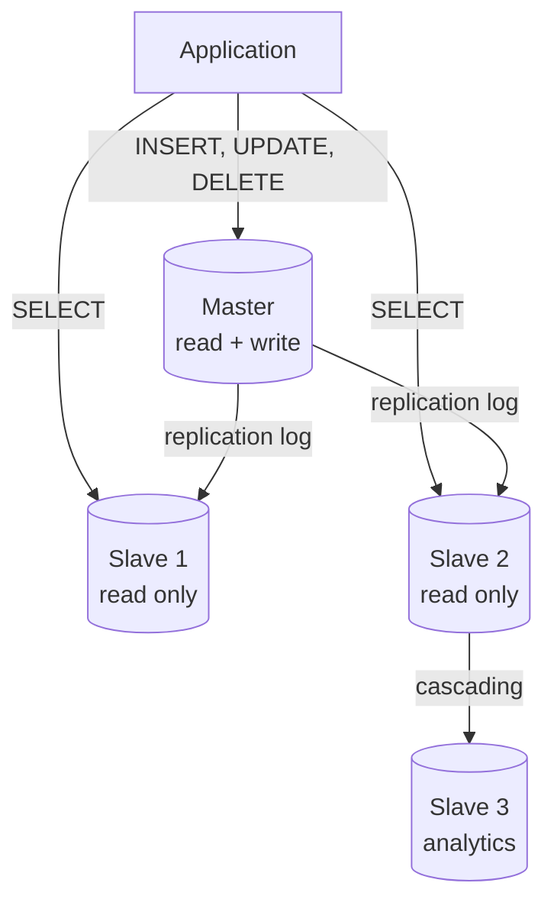
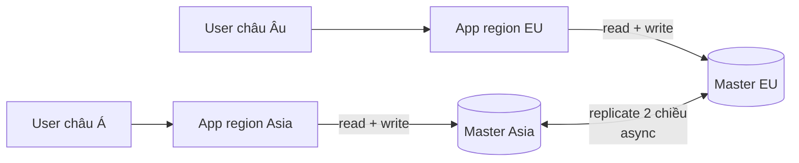
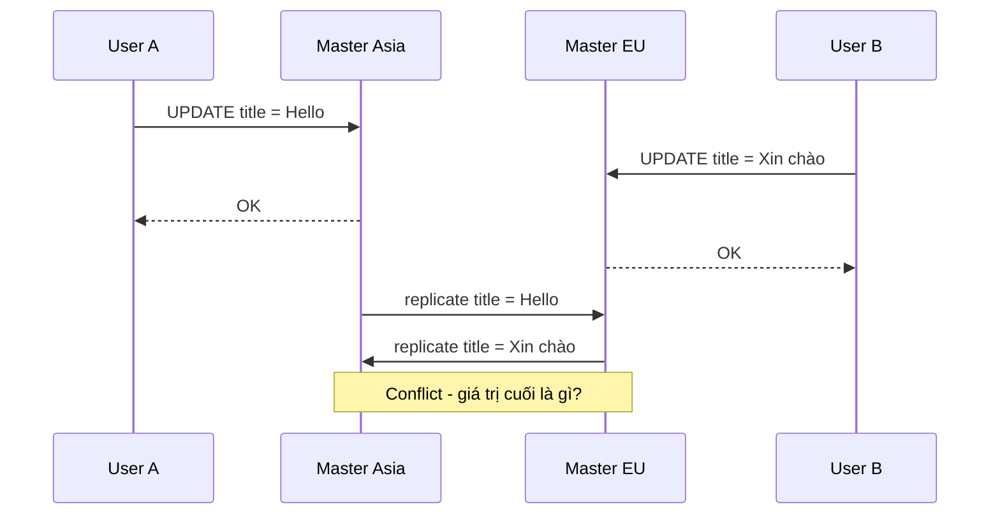
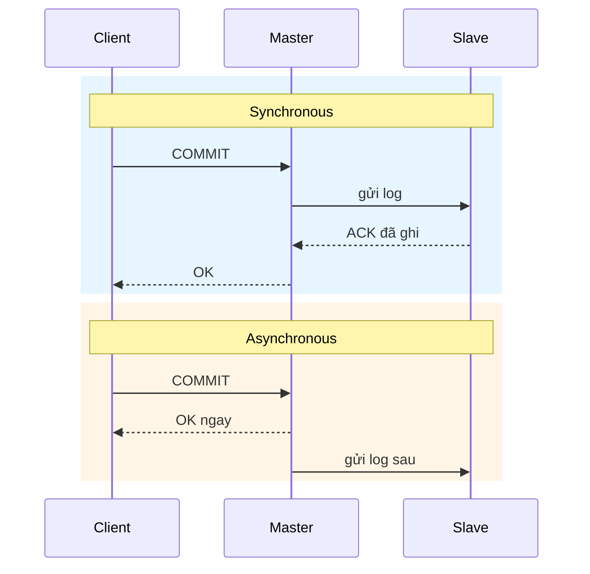
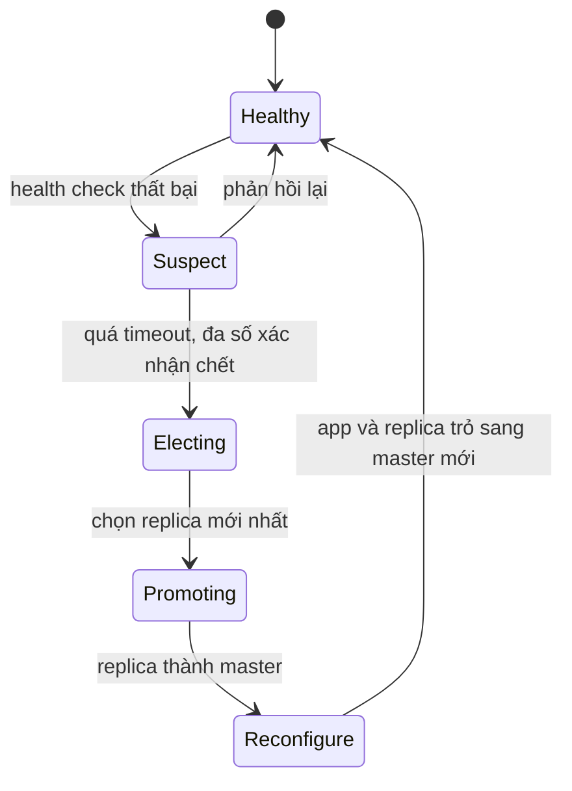
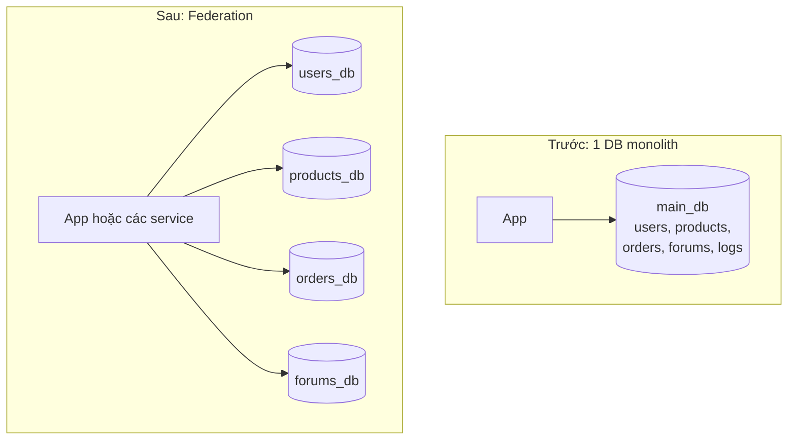

# Replication & Federation

**Replication** (nhân bản) là kỹ thuật giữ **nhiều bản sao** của cùng một dữ liệu trên nhiều máy database. **Federation** (liên hợp, còn gọi là **functional partitioning** -- chia theo chức năng) là kỹ thuật tách **một** database lớn thành **nhiều** database nhỏ, mỗi cái phụ trách một nhóm chức năng (users, products, forums...). Hai kỹ thuật này là bước đầu tiên khi một database đơn lẻ không còn chịu nổi tải hoặc trở thành điểm lỗi duy nhất (single point of failure).

**Tương tự đơn giản:** Replication giống **photocopy sổ danh bạ** gửi cho mọi chi nhánh -- ai cần tra số điện thoại thì xem bản gần nhất, nhưng chỉ văn phòng chính được sửa sổ gốc rồi gửi bản cập nhật đi. Federation giống **chia phòng ban** -- phòng nhân sự giữ hồ sơ nhân viên, phòng kho giữ sổ hàng hoá, phòng kế toán giữ sổ thu chi; mỗi phòng làm việc độc lập, không ai phải xếp hàng chờ một người thư ký duy nhất.

---

:::note[Ghi nhớ nhanh]

- ⭐ **Master-slave (primary-replica): ghi vào 1 master, đọc từ nhiều slave** — scale đọc tốt, master vẫn là nút thắt ghi và cần failover khi chết.
- ⭐ **Replication lag là cái giá của async replication** — slave chậm hơn master vài ms đến vài giây, gây lỗi "vừa sửa xong mà không thấy".
- **Master-master (multi-primary): nhiều node cùng nhận ghi** — tăng availability ghi nhưng phải xử lý **conflict** (xung đột ghi).
- **Sync vs async replication** — sync an toàn (không mất dữ liệu) nhưng chậm và kém sẵn sàng; async nhanh nhưng có thể mất dữ liệu khi master chết.
- **Federation = chia DB theo chức năng** — giảm tải mỗi DB, cache hit tốt hơn, ghi song song; đổi lại JOIN xuyên DB phải làm ở tầng app.

:::

---

## Mục lục

- [Vì sao cần Replication và Federation?](#vì-sao-cần-replication-và-federation)
- [1. Replication hoạt động thế nào?](#1-replication-hoạt-động-thế-nào)
- [2. Master-slave replication](#2-master-slave-replication)
- [3. Master-master replication](#3-master-master-replication)
- [4. Synchronous vs asynchronous replication](#4-synchronous-vs-asynchronous-replication)
- [5. Replication lag và cách xử lý](#5-replication-lag-và-cách-xử-lý)
- [6. Failover](#6-failover)
- [7. Federation và functional partitioning](#7-federation-và-functional-partitioning)
- [8. So sánh tổng hợp](#8-so-sánh-tổng-hợp)
- [Khi nào dùng?](#khi-nào-dùng)
- [Lỗi thường gặp](#lỗi-thường-gặp)
- [Câu hỏi phỏng vấn](#câu-hỏi-phỏng-vấn)

---

## Vì sao cần Replication và Federation?

**Vấn đề:** Một database duy nhất gặp ba giới hạn:

1. **Single point of failure** -- máy chết (hỏng đĩa, mất điện, bảo trì) là toàn bộ hệ thống ngừng.
2. **Giới hạn đọc** -- phần lớn web app có tỉ lệ đọc/ghi rất lệch (thường 10:1 đến 100:1). Một máy chỉ phục vụ được số query/giây nhất định.
3. **Mọi bảng tranh cùng tài nguyên** -- bảng log ghi liên tục chiếm I/O, làm chậm bảng users; cache (buffer pool) của DB bị các bảng ít dùng chiếm chỗ.

**Giải pháp:**

- **Replication** giải quyết (1) và (2): có bản sao để thay khi master chết; đọc từ nhiều bản sao để chia tải.
- **Federation** giải quyết (3): tách DB theo chức năng, mỗi DB nhỏ hơn, tải ít hơn, dữ liệu "nóng" vừa RAM hơn.

:::tip[Dùng thực tế]

- **Amazon RDS / Aurora:** tạo read replica bằng vài cú click; Aurora cho tới 15 replica dùng chung storage, lag thường dưới 100ms.
- **GitHub:** chạy MySQL với primary + nhiều replica, dùng Orchestrator để tự động failover; từng có sự cố năm 2018 khi failover xuyên datacenter gây lệch dữ liệu giữa hai bờ nước Mỹ.
- **Microservices:** mỗi service sở hữu database riêng (database-per-service) -- đây chính là federation ở mức kiến trúc.
- **CouchDB, Cassandra:** thiết kế multi-master/leaderless ngay từ đầu để ghi ở nhiều region.

:::

---

## 1. Replication hoạt động thế nào?

Ý tưởng chung: node nhận ghi (master/primary/leader) ghi thay đổi vào một **log** (nhật ký), rồi gửi log đó tới các node bản sao (slave/replica/follower) để chúng **áp dụng lại** đúng thứ tự.

| DB | Cơ chế log dùng để replicate |
| --- | --- |
| PostgreSQL | **WAL** (Write-Ahead Log) -- streaming replication (physical) hoặc logical replication |
| MySQL | **Binlog** (binary log) -- statement-based, row-based hoặc mixed |
| MongoDB | **Oplog** (operation log) trong replica set |
| Redis | Replication stream + RDB snapshot khi đồng bộ lần đầu |

Các cách replicate log:

- **Statement-based:** gửi nguyên câu SQL (`UPDATE ... SET x = NOW()`). Gọn nhưng nguy hiểm với hàm không tất định (`NOW()`, `RAND()`) -- replica có thể ra kết quả khác.
- **Row-based (logical):** gửi giá trị hàng trước/sau khi đổi. An toàn, dễ dùng cho CDC (Change Data Capture -- bắt thay đổi để đẩy sang hệ khác).
- **Physical (WAL shipping):** gửi thay đổi ở mức byte trên trang dữ liệu. Nhanh, nhưng replica phải cùng phiên bản DB.

---

## 2. Master-slave replication

**Master-slave** (thuật ngữ mới: **primary-replica** hoặc **leader-follower**): một master nhận **mọi** thao tác ghi và có thể nhận đọc; một hoặc nhiều slave nhận dữ liệu từ master và **chỉ phục vụ đọc**. Slave cũng có thể replicate tiếp sang slave khác theo dạng cây (cascading replication).



Code app tách đọc/ghi (read/write splitting):

```ts
import { Pool } from 'pg';

// Cấu hình đọc từ biến môi trường, không hardcode
const primary = new Pool({ connectionString: process.env.DB_PRIMARY_URL });
const replicas = (process.env.DB_REPLICA_URLS ?? '')
  .split(',')
  .filter(Boolean)
  .map((url) => new Pool({ connectionString: url }));

// Chọn replica theo round-robin; không có replica thì đọc primary
let cursor = 0;
function pickReader(): Pool {
  if (replicas.length === 0) return primary;
  cursor = (cursor + 1) % replicas.length;
  return replicas[cursor];
}

export async function getProduct(id: number) {
  const { rows } = await pickReader().query('SELECT * FROM products WHERE id = $1', [id]);
  return rows[0] ?? null;
}

export async function updatePrice(id: number, price: number) {
  // Ghi LUÔN vào primary
  await primary.query('UPDATE products SET price = $1 WHERE id = $2', [price, id]);
}
```

**Ưu điểm:**

- Scale đọc gần tuyến tính: thêm slave là thêm năng lực đọc.
- Có bản sao sẵn để **promote** thành master khi master chết.
- Chạy báo cáo nặng, backup trên slave mà không ảnh hưởng master.

**Nhược điểm:**

- **Ghi không scale** -- mọi ghi vẫn dồn về một master. Thêm slave còn làm master tốn thêm công gửi log.
- **Replication lag** -- đọc từ slave có thể ra dữ liệu cũ.
- **Failover phức tạp** -- cần cơ chế phát hiện master chết và promote slave (xem mục 6).
- Slave càng nhiều thì càng nhiều bản ghi phải áp dụng lại; ghi nặng có thể làm slave tụt lại xa.

---

## 3. Master-master replication

**Master-master** (multi-primary, multi-leader): hai hoặc nhiều master **cùng nhận ghi**, đồng bộ thay đổi cho nhau. Thường dùng khi cần ghi ở **nhiều datacenter** (mỗi region một master) hoặc cần ghi tiếp được khi một master chết.



**Vấn đề lớn nhất: conflict (xung đột ghi).** Hai master cùng sửa một bản ghi trước khi kịp đồng bộ:



Các chiến lược giải quyết conflict:

| Chiến lược | Cách làm | Đánh đổi |
| --- | --- | --- |
| **Last Write Wins (LWW)** | Bản ghi có timestamp mới hơn thắng | Đơn giản nhưng **âm thầm mất dữ liệu**, phụ thuộc đồng hồ các máy |
| **Tránh conflict** | Mỗi bản ghi chỉ ghi ở một master "nhà" (vd user ghi ở region của họ) | Hiệu quả nhất, nhưng khi đổi region vẫn có thể xung đột |
| **Merge theo nghiệp vụ** | Ghi giữ cả hai phiên bản, app hoặc user chọn | Phức tạp, cần UI xử lý |
| **CRDT** | Cấu trúc dữ liệu tự hội tụ (counter, set) | Chỉ áp dụng cho một số kiểu dữ liệu |
| **Phân vùng ID** | Master 1 sinh ID lẻ, master 2 sinh ID chẵn (MySQL `auto_increment_offset`) | Chỉ tránh trùng khoá chính, không giải quyết sửa cùng hàng |

**Ưu điểm:** ghi được ở nhiều nơi, latency ghi thấp cho user ở xa, một master chết vẫn ghi tiếp.

**Nhược điểm:** conflict, thường phải nới lỏng consistency (vi phạm ACID), cần load balancer hoặc logic app để biết ghi vào đâu, độ phức tạp vận hành cao. Đa số hệ thống nên tránh master-master nếu không thật sự cần ghi đa region.

---

## 4. Synchronous vs asynchronous replication

Câu hỏi then chốt: master **chờ** slave xác nhận trước khi báo "ghi thành công" cho client, hay không?



| Tiêu chí | Synchronous | Asynchronous | Semi-synchronous |
| --- | --- | --- | --- |
| Latency ghi | Cao (cộng thêm round-trip tới slave) | Thấp nhất | Trung bình |
| Mất dữ liệu khi master chết | Không (dữ liệu đã có ở slave) | Có thể mất các ghi chưa kịp gửi | Không mất nếu ít nhất 1 slave đã ACK |
| Availability ghi | Slave chậm hoặc chết thì **ghi bị treo** | Không phụ thuộc slave | Có timeout, rơi về async |
| Phổ biến | Ít (trong cùng DC) | Mặc định của MySQL, PostgreSQL | MySQL semi-sync, PostgreSQL `synchronous_standby_names` với 1 standby |

Trong thực tế hay dùng mô hình **semi-sync**: một slave đồng bộ (đảm bảo luôn có ít nhất 2 bản sao), các slave còn lại async.

```sql
-- PostgreSQL: yêu cầu ít nhất 1 trong 2 standby xác nhận trước khi commit trả về
ALTER SYSTEM SET synchronous_standby_names = 'ANY 1 (replica_a, replica_b)';
ALTER SYSTEM SET synchronous_commit = 'on';
SELECT pg_reload_conf();
```

---

## 5. Replication lag và cách xử lý

**Replication lag** là độ trễ giữa thời điểm master commit và thời điểm slave áp dụng thay đổi đó. Bình thường vài ms đến vài trăm ms; khi slave quá tải, chạy query dài, mạng chậm hoặc có transaction lớn, lag có thể lên **hàng giây đến hàng phút**.

Các dị thường (anomaly) do lag gây ra:

| Anomaly | Ví dụ | Cách xử lý |
| --- | --- | --- |
| **Read-your-writes** bị vi phạm | User sửa avatar, reload trang vẫn thấy ảnh cũ | Đọc từ master trong N giây sau khi user đó ghi; hoặc đọc dữ liệu của chính mình từ master |
| **Monotonic reads** bị vi phạm | Reload lần 1 thấy comment mới, lần 2 (slave khác) comment biến mất | Gắn user vào một slave cố định (hash user_id) |
| **Consistent prefix** bị vi phạm | Thấy câu trả lời trước khi thấy câu hỏi | Ghi các sự kiện liên quan vào cùng partition, giữ thứ tự |

Kỹ thuật "sticky to primary sau khi ghi":

```ts
const STICKY_WINDOW_MS = 5_000; // nên lớn hơn lag p99 quan sát được

// Lưu thời điểm ghi cuối của user (ở đây dùng Map minh hoạ; thực tế để trong session hoặc Redis)
const lastWriteAt = new Map<string, number>();

export function markWrite(userId: string): void {
  lastWriteAt.set(userId, Date.now());
}

export function chooseReader(userId: string): 'primary' | 'replica' {
  const last = lastWriteAt.get(userId) ?? 0;
  return Date.now() - last < STICKY_WINDOW_MS ? 'primary' : 'replica';
}
```

Theo dõi lag:

```sql
-- PostgreSQL, chạy trên replica: lag tính theo thời gian
SELECT now() - pg_last_xact_replay_timestamp() AS replication_lag;

-- MySQL, chạy trên replica
SHOW REPLICA STATUS;  -- xem cột Seconds_Behind_Source
```

Đặt alert khi lag vượt ngưỡng (ví dụ 10 giây) và tự động **loại slave đó ra khỏi pool đọc** cho tới khi bắt kịp.

---

## 6. Failover

**Failover** là quá trình chuyển vai trò master sang một node khác khi master chết.



Hai kiểu:

- **Active-passive** (master-standby): standby chỉ nhận heartbeat và dữ liệu, không phục vụ traffic; khi master chết, standby lấy IP/DNS của master. Downtime phụ thuộc thời gian phát hiện + promote (thường từ vài giây đến 1-2 phút).
- **Active-active**: cả hai cùng phục vụ (tương ứng master-master).

Rủi ro khi failover:

- **Mất dữ liệu** với async replication: các ghi chưa kịp sang replica sẽ mất, hoặc bị "hồi sinh" khi master cũ quay lại.
- **Split brain**: master cũ chưa chết hẳn (chỉ mất mạng), cả hai cùng nghĩ mình là master và cùng nhận ghi. Phòng bằng **fencing** (cắt hẳn master cũ -- STONITH, "shoot the other node in the head") và cơ chế quorum.
- **Timeout khó chọn**: ngắn quá thì failover nhầm khi mạng chập chờn; dài quá thì downtime lâu.

Công cụ phổ biến: **Patroni** (PostgreSQL, dùng etcd/Consul để bầu leader), **Orchestrator** (MySQL), **Redis Sentinel**, managed service (RDS Multi-AZ, Cloud SQL HA) tự lo failover.

---

## 7. Federation và functional partitioning

**Federation** chia database theo **chức năng nghiệp vụ**: thay vì một DB monolith chứa mọi bảng, ta có DB `users`, DB `products`, DB `forums`... mỗi DB có thể nằm trên máy riêng, có replication riêng.



**Ưu điểm:**

- **Giảm tải mỗi DB**: lượng đọc/ghi chia ra nhiều máy; ghi vào `forums_db` không làm chậm `orders_db`.
- **Cache hit tốt hơn**: mỗi DB nhỏ hơn, phần dữ liệu "nóng" vừa với RAM (buffer pool) hơn.
- **Ghi song song**: không có một master duy nhất làm nút thắt ghi cho cả hệ thống.
- **Tách biệt sự cố và đội ngũ**: hỏng `forums_db` không kéo sập checkout; mỗi đội sở hữu DB của mình (gần với microservices).

**Nhược điểm:**

- **Không JOIN xuyên DB**: muốn "đơn hàng kèm tên user" phải query 2 DB rồi ghép ở app.
- **Không transaction xuyên DB**: đặt hàng vừa trừ kho (`products_db`) vừa tạo đơn (`orders_db`) cần saga, outbox pattern hoặc 2PC (two-phase commit).
- **App phải biết DB nào chứa gì** -- thêm logic routing.
- **Không hiệu quả** nếu schema có một bảng khổng lồ (vd `orders` hàng tỉ dòng) -- federation không chia nhỏ một bảng; lúc đó cần **sharding**.

JOIN ở tầng app khi đã federation:

```ts
type Order = { id: number; userId: number; total: number };
type User = { id: number; name: string };

export async function getOrdersWithUser(
  ordersDb: { query: (sql: string, params: unknown[]) => Promise<{ rows: Order[] }> },
  usersDb: { query: (sql: string, params: unknown[]) => Promise<{ rows: User[] }> },
  limit: number,
) {
  const { rows: orders } = await ordersDb.query(
    'SELECT id, user_id AS "userId", total FROM orders ORDER BY id DESC LIMIT $1',
    [limit],
  );
  const userIds = [...new Set(orders.map((o) => o.userId))];
  // MỘT query lấy mọi user cần thiết -- tránh N+1 query
  const { rows: users } = await usersDb.query('SELECT id, name FROM users WHERE id = ANY($1)', [userIds]);
  const userById = new Map(users.map((u) => [u.id, u]));

  return orders.map((o) => ({ ...o, userName: userById.get(o.userId)?.name ?? null }));
}
```

---

## 8. So sánh tổng hợp

| Tiêu chí | Master-slave | Master-master | Federation |
| --- | --- | --- | --- |
| Scale đọc | Tốt | Tốt | Tốt |
| Scale ghi | Không | Có, có giới hạn (mọi master vẫn phải áp dụng mọi ghi) | Có (theo chức năng) |
| Availability ghi | Phụ thuộc failover | Cao | Mỗi DB độc lập |
| Consistency | Strong trên master, eventual trên slave | Thường eventual, có conflict | Strong trong từng DB |
| JOIN, transaction | Đầy đủ | Đầy đủ trong 1 node, rủi ro khi conflict | Không xuyên DB |
| Độ phức tạp | Thấp đến trung bình | Cao | Trung bình |

Ba kỹ thuật **kết hợp được**: federation chia `users_db`, `orders_db`; mỗi DB lại có master + vài slave.

---

## Khi nào dùng?

- **Master-slave khi:**
  - Workload đọc nhiều hơn ghi rõ rệt (blog, e-commerce catalog, news).
  - Cần HA (high availability) cơ bản với một standby sẵn sàng.
  - Cần tách báo cáo, analytics, backup khỏi DB chính.
- **Master-master khi:**
  - Cần ghi ở nhiều region với latency thấp, hoặc ghi phải tiếp tục khi một DC sập.
  - Dữ liệu có thể phân "nhà" rõ ràng để tránh conflict.
- **Federation khi:**
  - DB monolith có nhiều nhóm bảng ít liên quan, tranh tài nguyên.
  - Đang tách microservices.
- **Không nên:**
  - Thêm replica khi vấn đề thật là query thiếu index -- tối ưu query trước.
  - Federation sớm khi app còn nhỏ: mất JOIN/transaction mà chưa được lợi gì.

---

## Lỗi thường gặp

### Lỗi 1: Đọc ngay sau ghi từ replica

```ts
// SAI: ghi primary rồi đọc replica ngay -> có thể ra dữ liệu cũ
await primary.query('UPDATE users SET name = $1 WHERE id = $2', [name, id]);
const user = await replica.query('SELECT * FROM users WHERE id = $1', [id]);

// ĐÚNG: dùng RETURNING để lấy kết quả ngay từ primary
const { rows } = await primary.query(
  'UPDATE users SET name = $1 WHERE id = $2 RETURNING *',
  [name, id],
);
```

### Lỗi 2: Coi replica là backup

Replica nhân bản **mọi thứ** -- kể cả lệnh `DROP TABLE` hay `DELETE` nhầm. Vẫn cần backup định kỳ + PITR (Point-In-Time Recovery) tách biệt.

### Lỗi 3: Không test failover

Failover chỉ chạy khi có sự cố -- đúng lúc căng thẳng nhất. Không diễn tập định kỳ thì thường phát hiện ra connection string hardcode IP master cũ, DNS TTL quá dài, hoặc app không reconnect.

### Lỗi 4: Master-master với LWW cho dữ liệu quan trọng

Last Write Wins âm thầm vứt bỏ một trong hai ghi. Dùng cho số dư hoặc tồn kho là mất tiền.

---

## Câu hỏi phỏng vấn

Những câu thường gặp về chủ đề này. Tự trả lời trước, rồi bấm **Xem đáp án** để đối chiếu.

**1. Master-slave khác master-master thế nào? Khi nào chọn cái nào?**

<details className="qa">
<summary>Xem đáp án</summary>

- **Master-slave:** 1 node nhận ghi, nhiều node đọc. Đơn giản, không conflict, scale đọc. Ghi không scale, failover cần promote.
- **Master-master:** nhiều node cùng nhận ghi. Availability ghi cao, ghi gần user đa region, nhưng phải xử lý conflict và thường chỉ eventual consistency.

Mặc định chọn master-slave; chỉ chọn master-master khi bắt buộc ghi đa region hoặc yêu cầu availability ghi rất cao.

</details>

**2. Replication lag là gì? Nó gây vấn đề gì và xử lý ra sao?**

<details className="qa">
<summary>Xem đáp án</summary>

Là độ trễ giữa lúc master commit và lúc slave áp dụng. Gây vi phạm read-your-writes (sửa xong không thấy), monotonic reads (dữ liệu "nhảy lùi"). Xử lý: đọc từ master một khoảng thời gian sau khi user ghi; dùng `RETURNING` hoặc trả kết quả từ lệnh ghi; gắn user vào một replica cố định; theo dõi lag và loại replica tụt hậu khỏi pool.

</details>

**3. Sync và async replication -- trade-off?**

<details className="qa">
<summary>Xem đáp án</summary>

Sync: không mất dữ liệu khi master chết, nhưng latency ghi cao và nếu slave chết thì ghi bị treo. Async: nhanh, master độc lập, nhưng có thể mất các ghi chưa replicate khi failover. Phổ biến là semi-sync: chờ ít nhất 1 replica ACK, còn lại async.

</details>

**4. Split brain là gì? Phòng tránh thế nào?**

<details className="qa">
<summary>Xem đáp án</summary>

Tình huống hai node cùng tin mình là master (thường do mất mạng giữa chúng), cùng nhận ghi, dữ liệu phân kỳ. Phòng: dùng quorum (chỉ bầu master khi đa số node đồng ý -- cần số lẻ node, vd 3 node etcd), fencing (cắt quyền ghi hoặc tắt hẳn master cũ), fencing token tăng dần để storage từ chối ghi từ leader cũ.

</details>

**5. Federation là gì? Nhược điểm lớn nhất?**

<details className="qa">
<summary>Xem đáp án</summary>

Chia DB theo chức năng (users, products, orders) ra nhiều DB riêng. Lợi: giảm tải mỗi DB, cache tốt hơn, ghi song song. Nhược điểm lớn nhất: mất JOIN và transaction xuyên DB -- phải JOIN ở app và dùng saga/outbox cho thao tác đa DB. Ngoài ra không giải quyết được một bảng đơn lẻ quá lớn -- khi đó cần sharding.

</details>

**6. Federation khác sharding thế nào?**

<details className="qa">
<summary>Xem đáp án</summary>

Federation chia **theo chức năng** (bảng nào ở DB nào -- chia dọc). Sharding chia **theo dữ liệu** của cùng một bảng (user 1-1M ở shard A, 1M-2M ở shard B -- chia ngang). Hai kỹ thuật bổ sung nhau: federation trước khi các nhóm bảng tranh tài nguyên, sharding khi một bảng vượt sức một máy.

</details>
