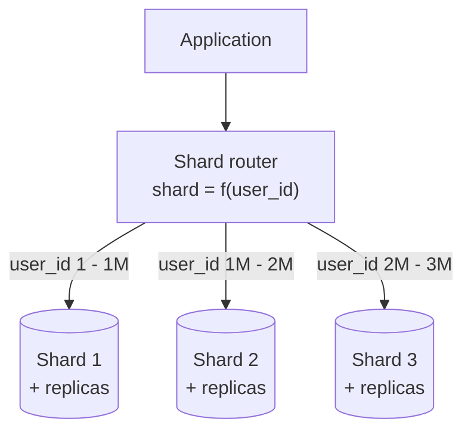
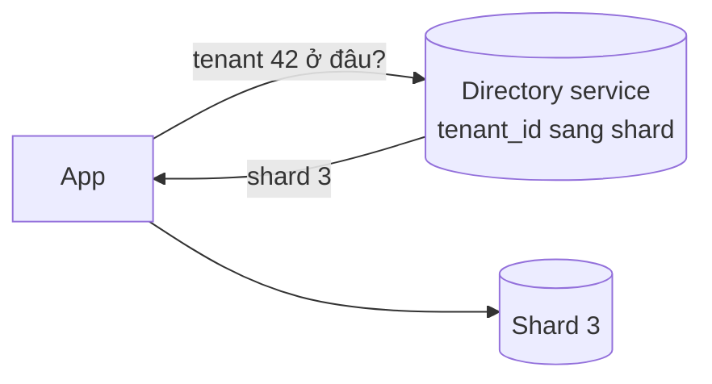
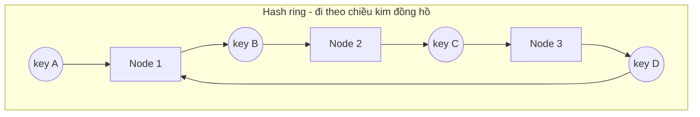
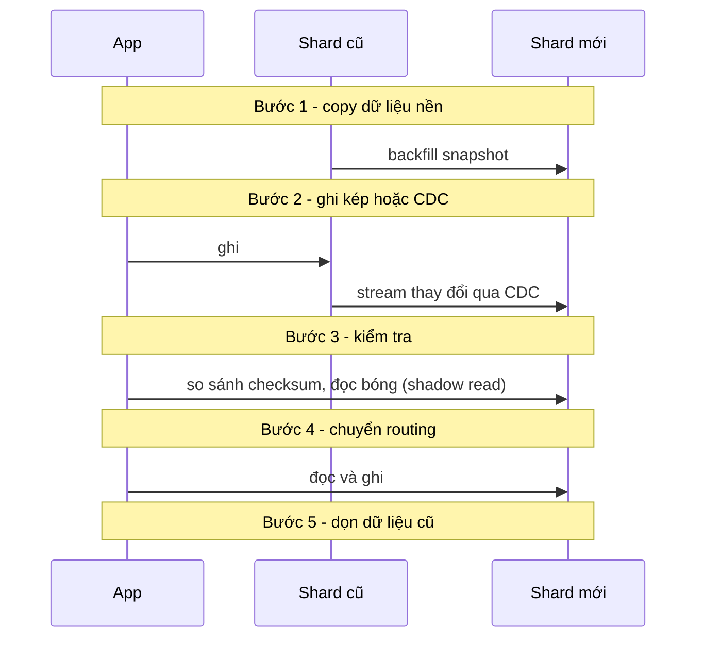
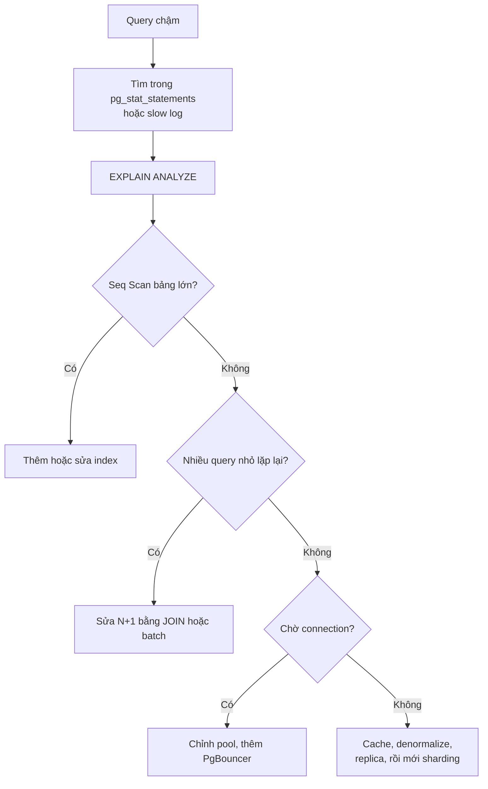

# Sharding, Denormalization & SQL Tuning

Khi replication và federation không còn đủ, ba công cụ tiếp theo để scale tầng dữ liệu là: **Sharding** (phân mảnh -- chia dữ liệu của **cùng một bảng** ra nhiều database, mỗi database giữ một phần), **Denormalization** (phi chuẩn hoá -- chủ động nhân bản dữ liệu để đọc nhanh hơn, tránh JOIN đắt), và **SQL Tuning** (tối ưu truy vấn -- index, đọc execution plan, sửa query, cấu hình connection pool). Thứ tự đúng trong thực tế thường **ngược lại**: tuning trước (rẻ nhất), denormalize khi cần, sharding sau cùng (đắt nhất, khó quay lại nhất).

**Tương tự đơn giản:** Một thư viện quá đông người mượn sách. **SQL tuning** là làm lại **mục lục** để thủ thư tìm sách nhanh hơn. **Denormalization** là **photo sẵn** những trang hay được hỏi, dán lên bảng tin để khỏi lật sách. **Sharding** là **mở thêm chi nhánh** -- sách vần A-H ở chi nhánh 1, I-P ở chi nhánh 2, Q-Z ở chi nhánh 3; mỗi chi nhánh phục vụ ít người hơn, nhưng muốn tìm "mọi sách của tác giả X" thì phải hỏi cả ba.

---

:::note[Ghi nhớ nhanh]

- ⭐ **Shard key quyết định tất cả** — chọn sai thì sinh hot spot, query xuyên shard và resharding đau đớn; chọn theo access pattern chính và độ phân tán cao.
- ⭐ **Tuning trước, sharding sau** — thiếu index, N+1 query, connection pool sai thường là thủ phạm thật, sửa rẻ hơn sharding hàng trăm lần.
- **Ba cách chia shard: range, hash, directory** — range hỗ trợ query khoảng nhưng dễ lệch; hash phân đều nhưng mất query khoảng; directory linh hoạt nhưng thêm một thành phần phải giữ HA.
- **Consistent hashing** giảm lượng dữ liệu phải di chuyển khi thêm/bớt node: chỉ khoảng 1/N thay vì gần như toàn bộ.
- **Denormalization đổi tốc độ đọc lấy chi phí ghi và rủi ro lệch dữ liệu** — hợp khi đọc nhiều hơn ghi rất nhiều.
- **Luôn đọc `EXPLAIN ANALYZE`** trước khi kết luận query chậm vì đâu.

:::

---

## Mục lục

- [Vì sao cần Sharding, Denormalization và SQL Tuning?](#vì-sao-cần-sharding-denormalization-và-sql-tuning)
- [1. Sharding là gì?](#1-sharding-là-gì)
- [2. Chọn shard key](#2-chọn-shard-key)
- [3. Các chiến lược sharding](#3-các-chiến-lược-sharding)
- [4. Consistent hashing](#4-consistent-hashing)
- [5. Hot spot và resharding](#5-hot-spot-và-resharding)
- [6. Cái giá của sharding](#6-cái-giá-của-sharding)
- [7. Denormalization](#7-denormalization)
- [8. SQL Tuning](#8-sql-tuning)
- [Khi nào dùng?](#khi-nào-dùng)
- [Lỗi thường gặp](#lỗi-thường-gặp)
- [Câu hỏi phỏng vấn](#câu-hỏi-phỏng-vấn)

---

## Vì sao cần Sharding, Denormalization và SQL Tuning?

**Vấn đề:** Replication chỉ scale **đọc** -- mọi ghi vẫn dồn về một master. Federation chỉ chia theo **chức năng** -- nếu bảng `messages` có 50 tỉ dòng và nhận 100k ghi/giây thì nó vẫn nằm trên một máy. Ngoài ra, nhiều hệ thống "chậm" không phải vì thiếu phần cứng mà vì query viết dở: quét toàn bảng, gọi 1000 query nhỏ thay vì 1 query, JOIN 6 bảng cho mỗi lần tải trang.

**Giải pháp:**

- **SQL tuning** -- làm cho mỗi query rẻ nhất có thể trên phần cứng hiện có.
- **Denormalization** -- giảm số lượng/độ phức tạp query khi đọc, chấp nhận ghi phức tạp hơn.
- **Sharding** -- chia dữ liệu và tải ghi ra nhiều máy khi một máy thực sự không đủ.

:::tip[Dùng thực tế]

- **Instagram:** shard PostgreSQL thành hàng nghìn **logical shard** (schema) đặt trên ít máy vật lý, ID 64-bit chứa sẵn shard ID để định tuyến mà không cần tra cứu.
- **Discord:** Cassandra/ScyllaDB partition tin nhắn theo `(channel_id, bucket)` -- bucket là khoảng thời gian cố định để tránh partition quá lớn ở kênh đông.
- **Vitess (YouTube, sau đó Slack, GitHub dùng):** lớp sharding đặt trước MySQL, che giấu shard khỏi ứng dụng.
- **Pinterest:** shard MySQL, ID chứa shard ID + type + local ID; denormalize số follower, số pin vào bảng riêng.

:::

---

## 1. Sharding là gì?

**Sharding** (horizontal partitioning -- phân vùng ngang) chia các **hàng** của một bảng ra nhiều database (gọi là **shard**). Mỗi shard có **cùng schema** nhưng giữ **tập dữ liệu khác nhau**. Mỗi shard thường lại có replica riêng.



Router có thể nằm ở:

- **Trong code app** (thư viện client tự tính shard).
- **Proxy** riêng (Vitess, ProxySQL, Citus coordinator, mongos của MongoDB).
- **Bên trong DB** -- các hệ phân tán như Cassandra, DynamoDB, CockroachDB tự shard (thường gọi là partition).

Lợi ích theo system-design-primer: ít traffic đọc/ghi mỗi shard, ít replication mỗi shard, cache hit tốt hơn (dữ liệu mỗi shard nhỏ, vừa RAM), index nhỏ hơn nên query nhanh hơn, một shard chết thì các shard khác vẫn chạy, ghi song song thật sự.

---

## 2. Chọn shard key

**Shard key** (partition key) là cột dùng để quyết định một hàng nằm ở shard nào. Đây là quyết định quan trọng nhất và **khó sửa nhất**.

Tiêu chí shard key tốt:

| Tiêu chí | Giải thích |
| --- | --- |
| **Cardinality cao** | Nhiều giá trị khác nhau (user_id tốt, `country` kém -- chỉ ~200 giá trị) |
| **Phân bố đều** | Không có giá trị nào chiếm quá nhiều dữ liệu hoặc traffic |
| **Khớp access pattern chính** | Query phổ biến nhất chỉ cần chạm **một** shard |
| **Ổn định** | Giá trị hiếm khi thay đổi (đổi shard key = di chuyển hàng sang shard khác) |

Ví dụ:

| Hệ thống | Shard key tốt | Vì sao | Shard key kém |
| --- | --- | --- | --- |
| SaaS B2B | `tenant_id` | Mọi query nằm trong một tenant | `created_at` |
| Chat | `conversation_id` | Tải tin nhắn của một cuộc hội thoại | `sender_id` (tải hội thoại phải gom nhiều shard) |
| E-commerce đơn hàng | `user_id` | "Đơn của tôi" chạm 1 shard | `status` (vài giá trị, cực lệch) |
| IoT metrics | `(device_id, day)` | Phân đều, giới hạn kích thước partition | `day` (mọi ghi hôm nay dồn vào 1 shard) |

---

## 3. Các chiến lược sharding

### 3.1 Range-based sharding

Chia theo **khoảng giá trị** của shard key: A-H, I-P, Q-Z hoặc theo ngày tháng.

- Ưu: query khoảng (`WHERE created_at BETWEEN ...`) chỉ chạm ít shard; dễ hiểu, dễ chia thêm.
- Nhược: **dễ lệch** -- shard chứa tháng hiện tại nhận mọi ghi (hot spot); tên bắt đầu bằng "N" (Nguyễn) ở Việt Nam chiếm tỉ lệ rất lớn.

### 3.2 Hash-based sharding

`shard = hash(key) mod N`.

```ts
import { createHash } from 'node:crypto';

const SHARD_COUNT = 16;

export function shardFor(userId: string): number {
  // Lấy 4 byte đầu của MD5 làm số nguyên không dấu
  const digest = createHash('md5').update(userId).digest();
  return digest.readUInt32BE(0) % SHARD_COUNT;
}
```

- Ưu: phân bố **đều**, hầu như không hot spot do phân bố key.
- Nhược: query khoảng phải gửi tới **mọi** shard; **đổi N** (thêm shard) làm gần như mọi key đổi shard -- phải di chuyển gần toàn bộ dữ liệu. Giải pháp: consistent hashing (mục 4) hoặc tạo sẵn nhiều logical shard.

### 3.3 Directory-based sharding

Một **bảng tra cứu** (lookup service) lưu ánh xạ `key -> shard`.



- Ưu: linh hoạt tối đa -- di chuyển một tenant lớn sang shard riêng chỉ cần sửa một dòng.
- Nhược: directory là **thêm một hop** và một **single point of failure** -- phải cache mạnh và chạy HA.

### 3.4 So sánh

| Chiến lược | Phân bố | Query khoảng | Thêm shard | Độ phức tạp |
| --- | --- | --- | --- | --- |
| Range | Dễ lệch | Tốt | Dễ (tách khoảng) | Thấp |
| Hash mod N | Đều | Kém (scatter-gather) | Rất đắt | Thấp |
| Consistent hash | Đều (với virtual node) | Kém | Rẻ (~1/N dữ liệu) | Trung bình |
| Directory | Tuỳ ý | Tuỳ | Rẻ, linh hoạt | Cao |

### 3.5 Logical shard -- mẹo của Instagram, Pinterest

Tạo sẵn **rất nhiều** shard logic (vd 4096) ngay từ đầu, đặt nhiều shard logic lên một máy vật lý. Khi cần scale, chỉ **di chuyển nguyên** shard logic sang máy mới -- không phải tính lại hash cho từng hàng.

---

## 4. Consistent hashing

**Consistent hashing** đặt cả **node** và **key** lên một **vòng tròn hash** (hash ring, ví dụ không gian 0 đến 2^32 - 1). Mỗi key thuộc về node **đầu tiên gặp được khi đi theo chiều kim đồng hồ**.



Khi thêm Node 4 vào giữa Node 1 và Node 2, chỉ những key nằm trong đoạn (Node 1, Node 4] chuyển từ Node 2 sang Node 4 -- **mọi key khác giữ nguyên**. Trung bình chỉ khoảng **1/N** dữ liệu phải di chuyển, so với gần như toàn bộ khi dùng `hash mod N`.

**Virtual node (vnode):** mỗi node vật lý chiếm **nhiều** vị trí trên vòng (vd 100-256). Nhờ vậy dữ liệu phân đều hơn, và khi một node chết, tải của nó rải đều ra nhiều node thay vì đổ hết vào node kế bên. Cassandra, DynamoDB (theo bài báo Dynamo), Riak dùng ý tưởng này.

```ts
import { createHash } from 'node:crypto';

const VNODES_PER_NODE = 128;

function hash32(value: string): number {
  return createHash('md5').update(value).digest().readUInt32BE(0);
}

type RingEntry = { readonly point: number; readonly node: string };

// Tạo ring mới (immutable) từ danh sách node
export function buildRing(nodes: readonly string[]): readonly RingEntry[] {
  return nodes
    .flatMap((node) =>
      Array.from({ length: VNODES_PER_NODE }, (_, i) => ({ point: hash32(`${node}#${i}`), node })),
    )
    .sort((a, b) => a.point - b.point);
}

export function nodeFor(ring: readonly RingEntry[], key: string): string {
  if (ring.length === 0) throw new Error('Ring rỗng: chưa có node nào');
  const h = hash32(key);
  // Tìm nhị phân điểm đầu tiên lớn hơn hoặc bằng h; không có thì quay vòng về đầu
  let lo = 0;
  let hi = ring.length;
  while (lo < hi) {
    const mid = (lo + hi) >>> 1;
    if (ring[mid].point < h) lo = mid + 1;
    else hi = mid;
  }
  return ring[lo === ring.length ? 0 : lo].node;
}
```

---

## 5. Hot spot và resharding

### Hot spot (celebrity problem)

**Hot spot** là shard nhận tải lớn bất thường so với các shard khác. Nguyên nhân:

- Shard key phân bố lệch (range theo thời gian, theo chữ cái đầu).
- **Key nóng** -- một thực thể cực phổ biến: tài khoản người nổi tiếng hàng chục triệu follower, sản phẩm flash sale, video viral. Dù hash đều, mọi request cho key đó vẫn vào **một** shard.

Cách xử lý:

| Kỹ thuật | Cách làm |
| --- | --- |
| **Thêm suffix ngẫu nhiên** (key salting) | Ghi `counter:{video_id}:{0..9}` thành 10 key ở 10 shard, đọc thì cộng lại |
| **Cache phía trước** | Key nóng chủ yếu là đọc -- đặt Redis/CDN trước để shard không phải gánh |
| **Tách shard riêng** | Directory-based: dời tenant khổng lồ sang shard riêng |
| **Bucket theo thời gian** | Partition key gồm `(channel_id, bucket)` để kênh đông không tạo partition vô hạn |

### Resharding

**Resharding** là thay đổi số shard hoặc ranh giới shard khi dữ liệu tăng hoặc phân bố đổi. Đây là thao tác **rủi ro và tốn kém** nhất trong vòng đời một hệ sharded.



Nguyên tắc: online migration (không downtime), có thể **rollback** ở từng bước, chuyển dần theo phần trăm traffic.

---

## 6. Cái giá của sharding

- **JOIN xuyên shard** -- không có hoặc rất đắt; phải denormalize hoặc JOIN ở app.
- **Transaction xuyên shard** -- cần 2PC (two-phase commit) hoặc saga; phần lớn hệ thống thiết kế để transaction nằm gọn trong một shard.
- **Query không có shard key** phải **scatter-gather** (gửi mọi shard rồi gộp) -- latency bằng shard chậm nhất.
- **Unique constraint toàn cục** (vd email duy nhất) không còn do DB bảo đảm -- cần bảng tra cứu riêng.
- **ID toàn cục** -- không dùng `AUTO_INCREMENT` từng shard được; dùng Snowflake ID, UUIDv7 hoặc ID chứa shard ID.
- **Vận hành** -- backup, migration schema, monitoring nhân lên theo số shard.

```sql
-- Instagram-style ID: 41 bit thời gian | 13 bit shard ID | 10 bit sequence
-- Từ ID suy ra shard mà không cần tra cứu:
SELECT (id >> 10) & ((1 << 13) - 1) AS shard_id FROM photos WHERE id = 2048112783289001234;
```

---

## 7. Denormalization

**Normalization** (chuẩn hoá) loại bỏ trùng lặp: mỗi sự thật lưu đúng một chỗ, đọc thì JOIN. **Denormalization** làm ngược lại -- **chủ động lưu trùng** để đọc nhanh hơn. Với hệ thống đọc nhiều hơn ghi (thường 100:1 hoặc hơn), đổi chi phí ghi lấy tốc độ đọc là hợp lý. Sau khi federation hoặc sharding, JOIN xuyên DB gần như không khả thi -- denormalization trở thành bắt buộc.

Các dạng phổ biến:

| Dạng | Ví dụ |
| --- | --- |
| **Sao chép cột** | Lưu `author_name` vào bảng `posts` thay vì JOIN `users` |
| **Cột tổng hợp** (counter) | `posts.comment_count`, `users.follower_count` thay vì `COUNT(*)` mỗi lần |
| **Bảng tổng hợp sẵn** | `daily_sales_summary` cho dashboard |
| **Materialized view** | PostgreSQL `CREATE MATERIALIZED VIEW`, refresh định kỳ |
| **Read model riêng** (CQRS) | Bảng hoặc collection tối ưu cho đọc, cập nhật qua event |

```sql
-- Bảng chuẩn hoá
-- posts(id, author_id, title), comments(id, post_id, ...)

-- Denormalize: thêm counter
ALTER TABLE posts ADD COLUMN comment_count INTEGER NOT NULL DEFAULT 0;

-- Giữ đồng bộ trong CÙNG transaction với thao tác ghi comment
BEGIN;
  INSERT INTO comments (post_id, user_id, body) VALUES (123, 7, 'Hay quá');
  UPDATE posts SET comment_count = comment_count + 1 WHERE id = 123;
COMMIT;

-- Materialized view cho dashboard
CREATE MATERIALIZED VIEW daily_revenue AS
SELECT date_trunc('day', created_at) AS day, SUM(total) AS revenue, COUNT(*) AS orders
FROM orders WHERE status = 'PAID'
GROUP BY 1;

REFRESH MATERIALIZED VIEW CONCURRENTLY daily_revenue; -- cần UNIQUE index trên view
```

**Đánh đổi:**

| Được | Mất |
| --- | --- |
| Đọc nhanh, ít JOIN, query đơn giản | Ghi chậm hơn, nhiều chỗ phải cập nhật |
| Hoạt động được sau sharding | Dữ liệu trùng có thể **lệch nhau** (anomaly) |
| Giảm tải CPU khi đọc | Tốn thêm dung lượng |

Các cách giữ dữ liệu trùng đồng bộ: cập nhật trong cùng transaction (khi cùng DB), trigger, CDC (Debezium đọc binlog/WAL rồi cập nhật read model), event + consumer, job đối soát (reconciliation) định kỳ để sửa lệch.

---

## 8. SQL Tuning

**SQL tuning** là quá trình đo và tối ưu query cùng cấu hình DB. Nguyên tắc số 1: **đo trước, sửa sau** (benchmark và profile).

### 8.1 Index

**Index** (chỉ mục) là cấu trúc dữ liệu phụ (thường **B-tree**) giúp tìm hàng mà không quét cả bảng: tìm kiếm O(log n) thay vì O(n).

```sql
-- Query thường gặp: đơn hàng mới nhất của một user
SELECT id, total, created_at FROM orders
WHERE user_id = 42 AND status = 'PAID'
ORDER BY created_at DESC LIMIT 20;

-- Composite index theo thứ tự: cột lọc bằng -> cột sắp xếp
CREATE INDEX CONCURRENTLY idx_orders_user_status_created
  ON orders (user_id, status, created_at DESC);

-- Covering index: chứa sẵn cột cần SELECT -> index-only scan, không cần đọc bảng
CREATE INDEX CONCURRENTLY idx_orders_cover
  ON orders (user_id, created_at DESC) INCLUDE (total, status);

-- Partial index: chỉ index phần dữ liệu hay truy vấn
CREATE INDEX CONCURRENTLY idx_orders_pending
  ON orders (created_at) WHERE status = 'PENDING';
```

Quy tắc về index:

- **Leftmost prefix:** index `(a, b, c)` dùng được cho `WHERE a`, `WHERE a AND b`, nhưng không dùng được cho `WHERE b` đơn lẻ.
- Index cột hay dùng trong `WHERE`, `JOIN ... ON`, `ORDER BY`, `GROUP BY`.
- **Mỗi index làm chậm ghi** (INSERT/UPDATE/DELETE phải cập nhật index) và tốn RAM -- đừng index mọi cột.
- Hàm trên cột làm mất index: `WHERE LOWER(email) = ...` cần **expression index** `ON users (LOWER(email))`.
- Cột cardinality thấp (boolean) thường không đáng index riêng, trừ partial index.

### 8.2 EXPLAIN và EXPLAIN ANALYZE

```sql
EXPLAIN (ANALYZE, BUFFERS)
SELECT id, total FROM orders WHERE user_id = 42 ORDER BY created_at DESC LIMIT 20;
```

Ví dụ output **trước** khi có index (rút gọn):

```text
Limit  (actual time=812.4..812.5 rows=20 loops=1)
  ->  Sort  (actual time=812.4..812.4 rows=20 loops=1)
        Sort Key: created_at DESC
        ->  Seq Scan on orders  (actual time=0.03..790.1 rows=1543 loops=1)
              Filter: (user_id = 42)
              Rows Removed by Filter: 4998457
```

**Sau** khi có index:

```text
Limit  (actual time=0.05..0.11 rows=20 loops=1)
  ->  Index Scan using idx_orders_user_status_created on orders
        (actual time=0.04..0.10 rows=20 loops=1)
        Index Cond: (user_id = 42)
```

Đọc plan:

| Dấu hiệu | Ý nghĩa |
| --- | --- |
| `Seq Scan` trên bảng lớn + `Rows Removed by Filter` rất lớn | Thiếu index hoặc index không dùng được |
| `Index Scan` / `Index Only Scan` | Tốt |
| `rows` ước lượng lệch xa `actual rows` | Thống kê cũ -- chạy `ANALYZE` |
| `Sort` với `external merge Disk` | Thiếu `work_mem` hoặc thiếu index cho `ORDER BY` |
| `Nested Loop` với `loops` hàng nghìn | JOIN thiếu index ở bảng trong |

### 8.3 N+1 query

**N+1** là lỗi kinh điển với ORM: 1 query lấy danh sách N bản ghi, rồi N query nữa để lấy dữ liệu liên quan cho từng bản ghi.

```ts
// SAI: 1 + N query (100 bài -> 101 round-trip tới DB)
const posts = await db.query('SELECT id, author_id, title FROM posts LIMIT 100');
for (const post of posts.rows) {
  const author = await db.query('SELECT name FROM users WHERE id = $1', [post.author_id]);
  // ...
}

// ĐÚNG cách 1: JOIN trong 1 query
const joined = await db.query(`
  SELECT p.id, p.title, u.name AS author_name
  FROM posts p JOIN users u ON u.id = p.author_id
  LIMIT 100`);

// ĐÚNG cách 2: batch bằng IN / ANY (2 query, hợp khi khác DB hoặc dùng DataLoader)
const authorIds = [...new Set(posts.rows.map((p) => p.author_id))];
const authors = await db.query('SELECT id, name FROM users WHERE id = ANY($1)', [authorIds]);
```

Với ORM: Prisma dùng `include`, TypeORM dùng `relations`/`leftJoinAndSelect`, Sequelize dùng `include`; GraphQL dùng **DataLoader** để gom request trong cùng tick.

### 8.4 Connection pool

Mỗi connection PostgreSQL là một **process** riêng, tốn vài MB RAM; mở connection mới mất vài ms (TCP + TLS + auth). **Connection pool** giữ sẵn một số connection để tái sử dụng.

```ts
import { Pool } from 'pg';

const pool = new Pool({
  connectionString: process.env.DATABASE_URL,
  max: Number(process.env.DB_POOL_MAX ?? 10),   // số connection tối đa mỗi instance app
  idleTimeoutMillis: 30_000,                    // đóng connection rảnh quá 30s
  connectionTimeoutMillis: 2_000,               // chờ lấy connection tối đa 2s rồi báo lỗi
  statement_timeout: 5_000,                     // giết query chạy quá 5s
});
```

Lưu ý:

- **Pool to hơn không nhanh hơn.** Số connection hiệu quả thường gần bằng vài lần số core CPU của DB server. Hàng nghìn connection làm DB tốn thời gian chuyển ngữ cảnh và tranh khoá.
- **Tổng connection = pool size x số instance app.** 50 pod x pool 20 = 1000 connection -- vượt `max_connections` mặc định 100 của PostgreSQL. Dùng **PgBouncer** (transaction pooling) đứng giữa.
- Luôn **trả connection về pool** (dùng `pool.query` hoặc `try/finally` với `client.release()`).

### 8.5 Các kỹ thuật tuning khác

- **Chỉ SELECT cột cần thiết** -- tránh `SELECT *`, nhất là cột TEXT/JSON lớn.
- **Kiểu dữ liệu chặt:** `INT` thay vì `BIGINT` khi đủ, `CHAR` cho trường độ dài cố định, `DECIMAL` cho tiền (không dùng float), `TIMESTAMPTZ` cho thời gian.
- **Pagination bằng keyset** thay vì `OFFSET` lớn:

```sql
-- CHẬM: OFFSET 100000 vẫn phải đọc và bỏ 100000 hàng
SELECT * FROM orders ORDER BY id DESC LIMIT 20 OFFSET 100000;

-- NHANH: keyset (seek) pagination, dùng index trên id
SELECT * FROM orders WHERE id < 987654 ORDER BY id DESC LIMIT 20;
```

- **Partitioning trong 1 DB** (PostgreSQL declarative partitioning theo tháng) cho bảng log/time-series -- xoá dữ liệu cũ bằng `DROP PARTITION` thay vì `DELETE` hàng triệu dòng.
- **Bật slow query log** (`log_min_duration_statement` ở PostgreSQL, `slow_query_log` ở MySQL) và dùng `pg_stat_statements` để tìm query tốn tổng thời gian nhất.
- **Batch ghi**: `INSERT ... VALUES (...), (...), (...)` thay vì từng dòng.



---

## Khi nào dùng?

| Kỹ thuật | Nên dùng khi | Chưa nên khi |
| --- | --- | --- |
| **SQL tuning** | Luôn luôn -- bước đầu tiên khi chậm | -- |
| **Denormalization** | Đọc nhiều hơn ghi rất nhiều; JOIN đắt; đã shard hoặc federation | Dữ liệu thay đổi liên tục; chưa đo thấy JOIN là nút thắt |
| **Sharding** | Ghi hoặc dữ liệu vượt sức một master mạnh nhất (sau khi đã tuning, cache, replica) | Dữ liệu vài trăm GB, tải vừa phải -- độ phức tạp không đáng |

---

## Lỗi thường gặp

### Lỗi 1: Sharding quá sớm

Shard khi DB mới 50GB vì "sau này sẽ lớn". Kết quả: mất JOIN, transaction, phải viết router, migration phức tạp -- trong khi một máy PostgreSQL có index đúng xử lý dễ dàng. Hãy chắc rằng đã tuning, cache, replica, vertical scaling trước.

### Lỗi 2: Chọn shard key theo thời gian

`shard = month(created_at)` khiến mọi ghi của tháng hiện tại dồn vào **một** shard -- đúng nghĩa hot spot. Nếu cần theo thời gian, kết hợp thêm thực thể: `(device_id, month)`.

### Lỗi 3: Thêm index cho mọi cột

Bảng ghi nhiều với 15 index thì mỗi INSERT phải cập nhật 15 cấu trúc B-tree. Xoá index không dùng (`pg_stat_user_indexes` với `idx_scan = 0`).

### Lỗi 4: Denormalize mà không có chiến lược đồng bộ

Cập nhật `users.name` nhưng quên `posts.author_name` -- dữ liệu lệch vĩnh viễn. Cần CDC, event hoặc job đối soát.

### Lỗi 5: `hash(key) mod N` rồi thêm shard

Đổi N từ 4 lên 5 làm khoảng 80% key đổi shard. Dùng consistent hashing hoặc logical shard ngay từ đầu.

---

## Câu hỏi phỏng vấn

Những câu thường gặp về chủ đề này. Tự trả lời trước, rồi bấm **Xem đáp án** để đối chiếu.

**1. Bạn chọn shard key thế nào cho bảng tweets của Twitter?**

<details className="qa">
<summary>Xem đáp án</summary>

Hai access pattern chính: (a) xem tweet theo `tweet_id`, (b) timeline của một user. Shard theo `user_id` giúp "tweets của user X" chạm 1 shard, nhưng user cực nổi tiếng tạo hot spot. Shard theo `tweet_id` (Snowflake, có thời gian) phân đều, tra theo ID nhanh; timeline lấy từ bảng/cache timeline riêng (fan-out). Thực tế thường shard theo `tweet_id` + index hoặc bảng phụ `user_id -> tweet_ids`, kèm cache cho tài khoản nổi tiếng.

</details>

**2. Consistent hashing giải quyết vấn đề gì? Virtual node để làm gì?**

<details className="qa">
<summary>Xem đáp án</summary>

Với `hash mod N`, thay đổi N làm gần như mọi key đổi node. Consistent hashing đặt node và key lên vòng hash; thêm/bớt node chỉ di chuyển khoảng 1/N key. Virtual node: mỗi node vật lý có nhiều điểm trên vòng để phân bố đều hơn, và khi node chết thì tải của nó rải ra nhiều node khác chứ không dồn vào một node kế bên; cũng cho phép gán nhiều vnode hơn cho máy mạnh hơn.

</details>

**3. Hot spot là gì và xử lý ra sao?**

<details className="qa">
<summary>Xem đáp án</summary>

Một shard nhận tải lớn bất thường do shard key lệch hoặc key nóng (celebrity). Xử lý: chọn shard key cardinality cao, phân bố đều; key salting (chia key nóng thành nhiều sub-key); cache key nóng ở Redis/CDN; dời tenant lớn ra shard riêng (directory); bucket theo thời gian.

</details>

**4. Một query chạy 2 giây. Bạn debug thế nào?**

<details className="qa">
<summary>Xem đáp án</summary>

1) Chạy `EXPLAIN (ANALYZE, BUFFERS)` xem Seq Scan, Sort ra đĩa, Nested Loop nhiều vòng, estimate lệch. 2) Thêm hoặc sửa index (composite theo leftmost prefix, covering, partial); tránh hàm trên cột. 3) Chạy `ANALYZE` nếu thống kê cũ. 4) Viết lại query: bỏ `SELECT *`, keyset pagination, tránh OR phức tạp. 5) Kiểm tra app: N+1, chờ connection pool, lock. 6) Nếu vẫn chậm: cache, denormalize, materialized view.

</details>

**5. N+1 query là gì? Phát hiện và sửa thế nào?**

<details className="qa">
<summary>Xem đáp án</summary>

1 query lấy danh sách rồi N query lấy dữ liệu liên quan từng phần tử -- N round-trip mạng. Phát hiện qua log query của ORM, APM (Datadog, New Relic) thấy cùng một câu lặp hàng trăm lần trong 1 request. Sửa bằng JOIN, eager loading (`include`), batch `WHERE id = ANY(...)`, hoặc DataLoader trong GraphQL.

</details>

**6. Denormalization có những rủi ro gì? Giữ đồng bộ thế nào?**

<details className="qa">
<summary>Xem đáp án</summary>

Rủi ro: dữ liệu trùng lệch nhau, ghi phức tạp và chậm hơn, tốn dung lượng. Đồng bộ: cập nhật trong cùng transaction nếu cùng DB; trigger; CDC (Debezium) hoặc event để cập nhật read model bất đồng bộ; materialized view refresh định kỳ; job đối soát chạy định kỳ phát hiện và sửa lệch.

</details>
