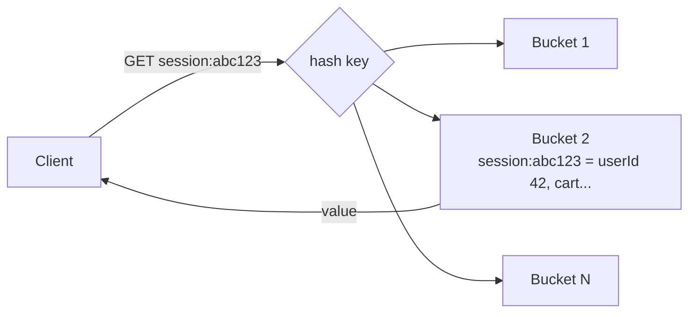
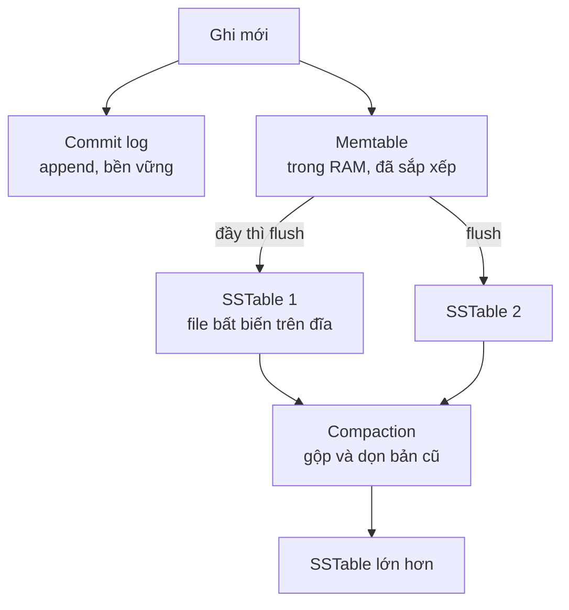
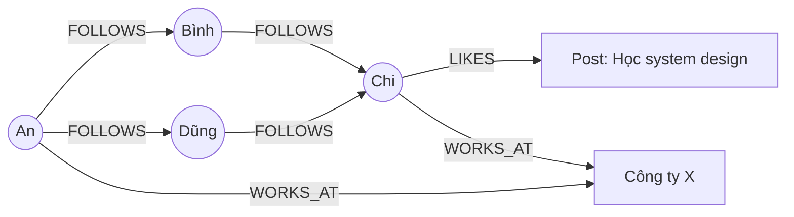
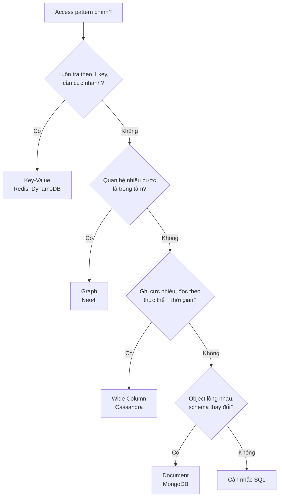

# Các loại NoSQL

"NoSQL" không phải một công nghệ mà là **bốn họ database** với mô hình dữ liệu rất khác nhau: **Key-Value Store** (kho khoá-giá trị), **Document Store** (kho tài liệu), **Wide Column Store** (kho cột rộng) và **Graph Database** (cơ sở dữ liệu đồ thị). Mỗi họ tối ưu cho một kiểu truy cập riêng -- dùng đúng thì nhanh và rẻ hơn SQL nhiều lần, dùng sai thì đau khổ hơn SQL nhiều lần.

**Tương tự đơn giản:** Key-value giống **tủ gửi đồ siêu thị** -- đưa số thẻ, nhận đúng túi đồ, không ai hỏi trong túi có gì. Document giống **hồ sơ bệnh án** -- mỗi bệnh nhân một tập, bên trong có đủ thứ lồng nhau, mỗi tập dày mỏng khác nhau. Wide column giống **sổ chấm công** khổng lồ -- mỗi nhân viên một dòng, cột là từng ngày, ghi thêm liên tục và đọc theo khoảng ngày. Graph giống **sơ đồ quan hệ họ hàng** -- quan trọng nhất là ai nối với ai, qua bao nhiêu bước.

---

:::note[Ghi nhớ nhanh]

- ⭐ **Key-Value (Redis, DynamoDB): O(1) theo key, cực nhanh** — hợp cache, session, counter, rate limit; không query theo nội dung value.
- ⭐ **Document (MongoDB): JSON lồng nhau, schema linh hoạt, có index trên field** — hợp catalog, CMS, profile; gom dữ liệu hay đọc cùng nhau vào một document.
- **Wide Column (Cassandra, HBase): partition key + clustering key, ghi cực nhiều** — hợp time-series, log, tin nhắn; phải thiết kế bảng theo từng query.
- **Graph (Neo4j): node + edge, duyệt quan hệ nhiều bước nhanh** — hợp mạng xã hội, gợi ý, phát hiện gian lận; khó scale ngang.
- **Chọn theo access pattern** — hỏi "tôi sẽ đọc dữ liệu này bằng cách nào?" trước khi hỏi "tôi lưu nó ở đâu?".

:::

---

## Mục lục

- [Vì sao có nhiều loại NoSQL?](#vì-sao-có-nhiều-loại-nosql)
- [1. Key-Value Store](#1-key-value-store)
- [2. Document Store](#2-document-store)
- [3. Wide Column Store](#3-wide-column-store)
- [4. Graph Databases](#4-graph-databases)
- [5. So sánh bốn loại](#5-so-sánh-bốn-loại)
- [6. Chọn loại nào cho bài toán nào](#6-chọn-loại-nào-cho-bài-toán-nào)
- [Khi nào dùng?](#khi-nào-dùng)
- [Lỗi thường gặp](#lỗi-thường-gặp)
- [Câu hỏi phỏng vấn](#câu-hỏi-phỏng-vấn)

---

## Vì sao có nhiều loại NoSQL?

**Vấn đề:** Mô hình bảng quan hệ là **tổng quát** -- biểu diễn được gần như mọi thứ, nhưng không tối ưu cho thứ gì đặc biệt. Cache cần đọc theo key dưới 1ms; nhật ký sự kiện cần ghi hàng triệu dòng/giây; hồ sơ sản phẩm có hàng trăm thuộc tính khác nhau theo ngành hàng; mạng xã hội cần "bạn của bạn của bạn" mà JOIN 3 lần trên bảng hàng tỉ cạnh thì quá chậm.

**Giải pháp:** Mỗi họ NoSQL **chuyên môn hoá** cho một mô hình dữ liệu và một kiểu truy cập, bỏ đi những gì không cần (JOIN, schema cứng, transaction đa bảng) để đạt hiệu năng và khả năng scale ở đúng việc đó.

:::tip[Dùng thực tế]

- **Twitter, GitHub, Stack Overflow** dùng **Redis** cho cache, counter, hàng đợi nhẹ.
- **Amazon DynamoDB** phục vụ giỏ hàng, phiên đăng nhập, metadata cho nhiều dịch vụ Amazon; Prime Day xử lý hàng chục triệu request/giây ở đỉnh.
- **Netflix, Apple, Discord** dùng **Cassandra** (hoặc ScyllaDB) cho lịch sử xem, tin nhắn, dữ liệu ghi khối lượng lớn.
- **eBay, Walmart, NASA** dùng **Neo4j** cho gợi ý sản phẩm, knowledge graph, phân tích quan hệ; ngân hàng dùng graph để phát hiện vòng giao dịch gian lận.

:::

---

## 1. Key-Value Store

**Key-value store** lưu dữ liệu dưới dạng cặp `key -> value`, giống một hash map khổng lồ. DB **không hiểu** cấu trúc bên trong value (với Redis thì hiểu một số kiểu dữ liệu như list, set, hash). Thao tác chính: `GET`, `SET`, `DELETE` theo key -- độ phức tạp O(1).



**Data model mẫu (Redis):**

```bash
# String + TTL: session hết hạn sau 30 phút
SET session:abc123 '{"userId":42,"role":"admin"}' EX 1800

# Counter nguyên tử: lượt xem bài viết
INCR post:123:views

# Rate limit cố định cửa sổ: tối đa 100 request/phút/IP
INCR ratelimit:1.2.3.4:202610011030
EXPIRE ratelimit:1.2.3.4:202610011030 60

# Sorted set: bảng xếp hạng game
ZADD leaderboard 9800 "user:7" 12500 "user:42"
ZREVRANGE leaderboard 0 9 WITHSCORES   # top 10

# Hash: lưu object dạng field-value
HSET user:42 name "An" plan "pro"
```

**DynamoDB** là key-value + document: khoá gồm **partition key** (bắt buộc) và **sort key** (tuỳ chọn) -- cho phép query khoảng trong một partition.

```ts
import { DynamoDBClient } from '@aws-sdk/client-dynamodb';
import { DynamoDBDocumentClient, QueryCommand } from '@aws-sdk/lib-dynamodb';

const doc = DynamoDBDocumentClient.from(new DynamoDBClient({}));

// Bảng Orders: PK = userId, SK = createdAt -> lấy 20 đơn mới nhất của 1 user
export async function recentOrders(userId: string) {
  const res = await doc.send(
    new QueryCommand({
      TableName: process.env.ORDERS_TABLE,
      KeyConditionExpression: 'userId = :u',
      ExpressionAttributeValues: { ':u': userId },
      ScanIndexForward: false, // sắp xếp giảm dần theo sort key
      Limit: 20,
    }),
  );
  return res.Items ?? [];
}
```

| Ưu điểm | Nhược điểm |
| --- | --- |
| Đọc/ghi cực nhanh (Redis in-memory: thường dưới 1ms) | Không query theo nội dung value (trừ khi tự tạo index) |
| Scale ngang đơn giản (hash key) | Không quan hệ, không JOIN |
| Mô hình đơn giản, dễ hiểu | Redis bị giới hạn bởi RAM; dữ liệu lớn tốn kém |

**Ví dụ:** Redis, Memcached (chỉ cache, không persist), Amazon DynamoDB, etcd (cấu hình, consensus), Riak.

**Khi nào dùng:** cache, session, rate limit, counter, leaderboard, feature flag, distributed lock, giỏ hàng tạm thời -- bất cứ khi nào bạn **luôn biết key** khi đọc.

---

## 2. Document Store

**Document store** cũng tra theo key, nhưng value là một **document** có cấu trúc (JSON, BSON, XML) mà DB **hiểu được** -- nên có thể query, index theo field bên trong. Documents gom vào **collection** (tương đương bảng), nhưng mỗi document có thể có cấu trúc khác nhau.

**Data model mẫu (MongoDB) -- catalog sản phẩm nhiều ngành hàng:**

```js
// Điện thoại
{
  _id: "sku-iphone-17",
  type: "phone",
  name: "iPhone 17",
  price: 25990000,
  specs: { screen: "6.3 inch", chip: "A19", storage: [128, 256, 512] },
  tags: ["apple", "5g"],
  reviews: { avg: 4.7, count: 1532 }
}

// Áo thun -- thuộc tính hoàn toàn khác, cùng collection
{
  _id: "sku-tshirt-01",
  type: "apparel",
  name: "Áo thun cotton",
  price: 199000,
  variants: [
    { size: "M", color: "đen", stock: 40 },
    { size: "L", color: "trắng", stock: 12 }
  ]
}
```

```js
// Index trên field lồng nhau và mảng
db.products.createIndex({ type: 1, price: 1 });
db.products.createIndex({ tags: 1 }); // multikey index cho mảng

// Query theo field bên trong document
db.products.find({ type: "phone", price: { $lte: 30000000 }, tags: "5g" })
  .sort({ "reviews.avg": -1 })
  .limit(20);

// Aggregation pipeline: doanh thu theo ngành hàng
db.orders.aggregate([
  { $match: { status: "PAID" } },
  { $unwind: "$items" },
  { $group: { _id: "$items.type", revenue: { $sum: "$items.price" } } }
]);
```

### Embed hay reference?

Quyết định thiết kế quan trọng nhất của document store:

| Embed (nhúng vào document cha) | Reference (lưu ID, tra riêng) |
| --- | --- |
| Dữ liệu luôn đọc cùng cha (địa chỉ giao hàng trong đơn) | Dữ liệu dùng chung nhiều nơi (thông tin user) |
| Quan hệ 1-ít, số lượng có giới hạn | Quan hệ 1-rất nhiều, tăng không giới hạn (comment của bài viral) |
| Cần cập nhật nguyên tử cùng cha | Cần cập nhật độc lập thường xuyên |

MongoDB giới hạn **16MB/document** -- đừng nhúng mảng tăng vô hạn.

| Ưu điểm | Nhược điểm |
| --- | --- |
| Schema linh hoạt, khớp object trong code | JOIN yếu (`$lookup` có nhưng đắt) |
| Đọc một document là đủ hiển thị (locality) | Dữ liệu trùng lặp khi denormalize |
| Index, query phong phú trên field | Transaction đa document có từ MongoDB 4.0 nhưng chậm hơn, nên hạn chế |

**Ví dụ:** MongoDB, Couchbase, CouchDB, Firestore, Amazon DocumentDB. Elasticsearch cũng lưu document nhưng chủ yếu dùng cho full-text search.

**Khi nào dùng:** catalog sản phẩm, CMS/bài viết, user profile, cấu hình, dữ liệu từ API bên ngoài có cấu trúc thay đổi, prototype nhanh.

---

## 3. Wide Column Store

**Wide column store** (column-family store) lưu dữ liệu theo **hàng** có **partition key**, mỗi hàng có thể có **rất nhiều cột** và các hàng không cần cùng tập cột. Dữ liệu trong một partition được **sắp xếp theo clustering key** trên đĩa, nên đọc một khoảng liên tục cực nhanh. Thiết kế lấy cảm hứng từ **Google Bigtable** (2006) và **Amazon Dynamo** (2007).

> Lưu ý: "wide column" **không** phải columnar database (ClickHouse, Redshift, BigQuery). Columnar lưu từng cột liền nhau để phân tích OLAP; wide column lưu theo partition để phục vụ OLTP ghi nhiều.



Kiến trúc **LSM-tree** (Log-Structured Merge tree) ở trên giải thích vì sao ghi cực nhanh: chỉ append log + ghi RAM, không phải tìm và sửa tại chỗ như B-tree.

**Data model mẫu (Cassandra CQL) -- tin nhắn theo kênh:**

```sql
CREATE TABLE messages_by_channel (
  channel_id  bigint,
  bucket      int,          -- vd số thứ tự khoảng 10 ngày, giới hạn kích thước partition
  message_id  timeuuid,     -- clustering key, có thời gian bên trong
  author_id   bigint,
  content     text,
  PRIMARY KEY ((channel_id, bucket), message_id)
) WITH CLUSTERING ORDER BY (message_id DESC);

-- Query chính: 50 tin mới nhất của kênh -> chỉ chạm 1 partition, đọc tuần tự
SELECT * FROM messages_by_channel
WHERE channel_id = 1001 AND bucket = 2045
LIMIT 50;
```

Nguyên tắc thiết kế: **một bảng cho mỗi query**. Muốn "tin nhắn theo author" thì tạo bảng thứ hai `messages_by_author` và ghi vào cả hai (denormalize). Cassandra không hỗ trợ JOIN, và query không có partition key thì bị chặn (trừ khi dùng `ALLOW FILTERING` -- gần như luôn là sai lầm).

**Consistency điều chỉnh được (tunable consistency):** với replication factor 3, ghi `QUORUM` (2/3 node xác nhận) + đọc `QUORUM` cho strong consistency vì R + W lớn hơn N; ghi/đọc `ONE` thì nhanh nhất nhưng eventual.

| Ưu điểm | Nhược điểm |
| --- | --- |
| Ghi cực nhanh, throughput rất lớn | Phải biết trước mọi query, mỗi query một bảng |
| Scale ngang tuyến tính, không có master (Cassandra leaderless) | Không JOIN, aggregation hạn chế |
| Multi-datacenter có sẵn | Xoá dữ liệu tạo tombstone, xử lý sai gây chậm đọc |
| Đọc khoảng theo clustering key nhanh | Vận hành phức tạp (compaction, repair) |

**Ví dụ:** Apache Cassandra, ScyllaDB, HBase, Google Bigtable.

**Khi nào dùng:** time-series (IoT, metrics), log sự kiện, tin nhắn, lịch sử hoạt động, feed -- dữ liệu ghi nhiều, đọc theo `(thực thể, khoảng thời gian)`.

---

## 4. Graph Databases

**Graph database** lưu dữ liệu dưới dạng **node** (đỉnh -- thực thể) và **edge/relationship** (cạnh -- quan hệ), cả hai đều có thể có **property** (thuộc tính). Điểm mạnh là **index-free adjacency**: mỗi node trỏ trực tiếp tới hàng xóm, nên duyệt một cạnh có chi phí gần như hằng số, **không phụ thuộc** kích thước toàn bộ đồ thị -- khác với SQL phải tra index cho mỗi lần JOIN.



**Data model mẫu (Neo4j Cypher):**

```sql
// Tạo node và quan hệ
CREATE (an:User {id: 1, name: 'An'}),
       (binh:User {id: 2, name: 'Bình'}),
       (chi:User {id: 3, name: 'Chi'}),
       (an)-[:FOLLOWS {since: date('2025-01-10')}]->(binh),
       (binh)-[:FOLLOWS]->(chi);

// Gợi ý "người bạn có thể biết": bạn của bạn mà An chưa follow, xếp theo số bạn chung
MATCH (me:User {id: 1})-[:FOLLOWS]->(friend)-[:FOLLOWS]->(fof)
WHERE fof <> me AND NOT (me)-[:FOLLOWS]->(fof)
RETURN fof.name, count(friend) AS mutual
ORDER BY mutual DESC
LIMIT 10;

// Đường đi ngắn nhất giữa 2 người (tối đa 6 bước)
MATCH p = shortestPath((a:User {id: 1})-[:FOLLOWS*..6]-(b:User {id: 3}))
RETURN p;
```

So với SQL, câu "bạn của bạn của bạn" cần self-JOIN bảng `follows` 3 lần; với hàng trăm triệu cạnh, mỗi bước nhân số hàng trung gian lên rất nhanh. Graph DB duyệt trực tiếp theo con trỏ.

| Ưu điểm | Nhược điểm |
| --- | --- |
| Truy vấn quan hệ nhiều bước nhanh và biểu đạt tự nhiên | Khó scale ngang (cắt đồ thị ra nhiều máy làm cạnh xuyên máy rất đắt) |
| Schema linh hoạt cho quan hệ mới | Không hợp cho aggregate toàn bộ dữ liệu, thống kê lớn |
| Thuật toán đồ thị có sẵn (PageRank, community detection) | Ít người biết, hệ sinh thái nhỏ hơn SQL |

**Ví dụ:** Neo4j, Amazon Neptune, JanusGraph, ArangoDB (đa mô hình), TigerGraph. Facebook dùng **TAO** -- hệ graph riêng đặt trên MySQL + cache -- cho social graph.

**Khi nào dùng:** mạng xã hội (follow, bạn chung), recommendation engine, phát hiện gian lận (vòng chuyển tiền, tài khoản dùng chung thiết bị), knowledge graph, phân quyền phức tạp (ai truy cập được gì qua nhóm lồng nhau), quản lý mạng/IT dependency.

---

## 5. So sánh bốn loại

| Tiêu chí | Key-Value | Document | Wide Column | Graph |
| --- | --- | --- | --- | --- |
| Đơn vị dữ liệu | Cặp key-value | Document JSON | Hàng trong partition | Node + edge |
| Query chính | Theo key | Theo key + field, aggregation | Theo partition key + khoảng clustering | Duyệt quan hệ |
| Schema | Không | Linh hoạt | Bảng có cột định nghĩa, linh hoạt | Linh hoạt |
| Scale ngang | Rất dễ | Dễ (sharding) | Rất dễ | Khó |
| Ghi throughput | Rất cao | Cao | Rất cao | Trung bình |
| Ví dụ | Redis, DynamoDB | MongoDB, Firestore | Cassandra, HBase | Neo4j, Neptune |
| Tiêu biểu | Cache, session | Catalog, CMS | Time-series, chat | Social, gợi ý, fraud |

---

## 6. Chọn loại nào cho bài toán nào



| Bài toán | Lựa chọn hợp lý |
| --- | --- |
| Cache trang sản phẩm, session đăng nhập | Redis |
| Rate limiter cho API gateway | Redis (INCR + EXPIRE hoặc sorted set) |
| Catalog sản phẩm đa ngành | MongoDB (hoặc PostgreSQL JSONB) |
| Lưu tin nhắn chat hàng tỉ dòng | Cassandra / ScyllaDB |
| Metrics IoT mỗi giây từ 1 triệu thiết bị | Cassandra, hoặc time-series DB chuyên dụng (TimescaleDB, InfluxDB) |
| "Người bạn có thể biết" | Neo4j hoặc graph service |
| Phát hiện vòng chuyển tiền gian lận | Graph DB |
| Leaderboard realtime | Redis sorted set |

---

## Khi nào dùng?

- **Key-Value:** biết key khi đọc, cần latency cực thấp, dữ liệu tạm hoặc có thể tái tạo.
- **Document:** dữ liệu dạng object tự chứa, đọc cả cục, cấu trúc đa dạng.
- **Wide Column:** khối lượng ghi rất lớn, dữ liệu tăng mãi, query biết trước theo partition.
- **Graph:** quan hệ là dữ liệu chính, cần duyệt nhiều bước.
- **Không nên dùng NoSQL khi:** cần transaction phức tạp đa thực thể, báo cáo ad-hoc nhiều chiều, hoặc dữ liệu nhỏ vừa một PostgreSQL -- lúc đó SQL đơn giản và an toàn hơn.

---

## Lỗi thường gặp

### Lỗi 1: Dùng Redis làm database chính mà không cấu hình persistence

Redis mặc định chỉ snapshot RDB định kỳ -- restart có thể mất dữ liệu từ lần snapshot cuối. Nếu cần bền vững, bật AOF (`appendonly yes`, `appendfsync everysec`) và hiểu rằng vẫn có thể mất khoảng 1 giây dữ liệu.

### Lỗi 2: Nhúng mảng tăng vô hạn trong MongoDB

```js
// SAI: comments của bài viral tăng mãi -> chạm giới hạn 16MB, mỗi update ghi lại document lớn
{ _id: 1, title: "...", comments: [ /* 200 nghìn phần tử */ ] }

// ĐÚNG: collection comments riêng, tham chiếu postId; chỉ nhúng vài comment mới nhất nếu cần
{ _id: "c1", postId: 1, text: "...", createdAt: ISODate("2026-09-30T08:00:00Z") }
```

### Lỗi 3: Thiết kế bảng Cassandra như bảng SQL

Tạo bảng `users`, `messages` chuẩn hoá rồi query `WHERE author_id = ?` không có partition key -- Cassandra từ chối hoặc phải quét cả cluster. Bắt đầu từ danh sách query, mỗi query một bảng.

### Lỗi 4: Partition quá lớn

Partition key `channel_id` cho kênh có hàng trăm triệu tin nhắn tạo partition hàng chục GB -- đọc chậm, compaction nặng, node chứa nó quá tải. Thêm `bucket` thời gian vào partition key.

### Lỗi 5: Dùng graph DB cho mọi thứ "có quan hệ"

Dữ liệu nào cũng có quan hệ. Nếu chỉ cần JOIN 1-2 bước (đơn hàng - user), SQL làm tốt hơn. Graph DB đáng giá khi query duyệt **nhiều bước, độ sâu thay đổi**.

---

## Câu hỏi phỏng vấn

Những câu thường gặp về chủ đề này. Tự trả lời trước, rồi bấm **Xem đáp án** để đối chiếu.

**1. Key-value store và document store khác nhau thế nào?**

<details className="qa">
<summary>Xem đáp án</summary>

Cả hai tra theo key. Key-value coi value là hộp đen -- chỉ GET/SET theo key. Document store **hiểu** cấu trúc document (JSON/BSON) nên index và query được theo field bên trong, có aggregation. Đổi lại key-value thường nhanh hơn và đơn giản hơn. DynamoDB nằm giữa: key-value với partition + sort key, item có thuộc tính dạng document.

</details>

**2. Vì sao Cassandra ghi nhanh?**

<details className="qa">
<summary>Xem đáp án</summary>

Dùng LSM-tree: mỗi ghi chỉ append vào commit log (ghi tuần tự) và chèn vào memtable trong RAM, không phải tìm và sửa trang trên đĩa như B-tree. Memtable đầy thì flush ra SSTable bất biến; compaction gộp nền. Thêm vào đó kiến trúc leaderless -- node nào cũng nhận ghi, không có master nút thắt -- và consistency điều chỉnh được (ghi `ONE` rất nhanh).

</details>

**3. Thiết kế lưu trữ cho tính năng "người bạn có thể biết" -- dùng gì?**

<details className="qa">
<summary>Xem đáp án</summary>

Bản chất là duyệt 2 bước trên đồ thị follow + đếm bạn chung -- graph DB (Neo4j) diễn đạt bằng một câu Cypher và duyệt nhanh nhờ index-free adjacency. Ở quy mô Facebook, thường tính **offline** (batch Spark/graph processing) rồi lưu kết quả gợi ý vào key-value store (`user_id -> danh sách gợi ý`) để đọc nhanh; graph DB dùng cho quy mô vừa hoặc truy vấn online.

</details>

**4. Khi nào embed, khi nào reference trong MongoDB?**

<details className="qa">
<summary>Xem đáp án</summary>

Embed khi dữ liệu con luôn đọc cùng cha, số lượng giới hạn, ít khi cập nhật độc lập (địa chỉ trong đơn hàng, variant của sản phẩm). Reference khi dữ liệu con tăng không giới hạn (comment), dùng chung nhiều nơi (user), hoặc cập nhật độc lập thường xuyên. Nhớ giới hạn 16MB/document.

</details>

**5. Wide column store khác columnar database (như ClickHouse) thế nào?**

<details className="qa">
<summary>Xem đáp án</summary>

Wide column (Cassandra, HBase) tổ chức theo **partition/hàng**, tối ưu OLTP ghi nhiều và đọc theo key + khoảng. Columnar (ClickHouse, Redshift, BigQuery) lưu **từng cột liền nhau** trên đĩa, nén tốt, tối ưu OLAP -- quét và aggregate vài cột trên hàng tỉ dòng. Tên giống nhau nhưng mục đích ngược nhau.

</details>

**6. Hệ thống chat cần những loại DB nào?**

<details className="qa">
<summary>Xem đáp án</summary>

- **Tin nhắn:** wide column (Cassandra), partition `(conversation_id, bucket)`, clustering theo `message_id` thời gian.
- **Trạng thái online, typing, session WebSocket:** Redis (key-value có TTL, pub/sub).
- **User, nhóm, quyền:** SQL (PostgreSQL) -- quan hệ, cần nhất quán.
- **Tìm kiếm tin nhắn:** Elasticsearch.

</details>
