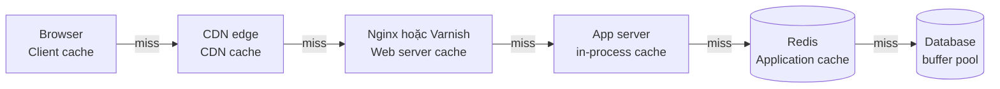
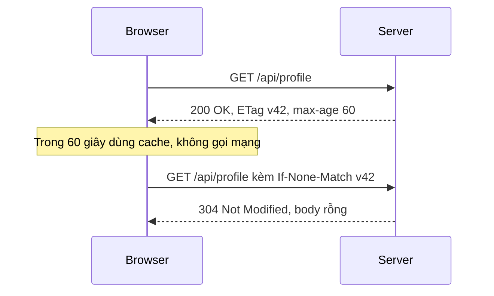
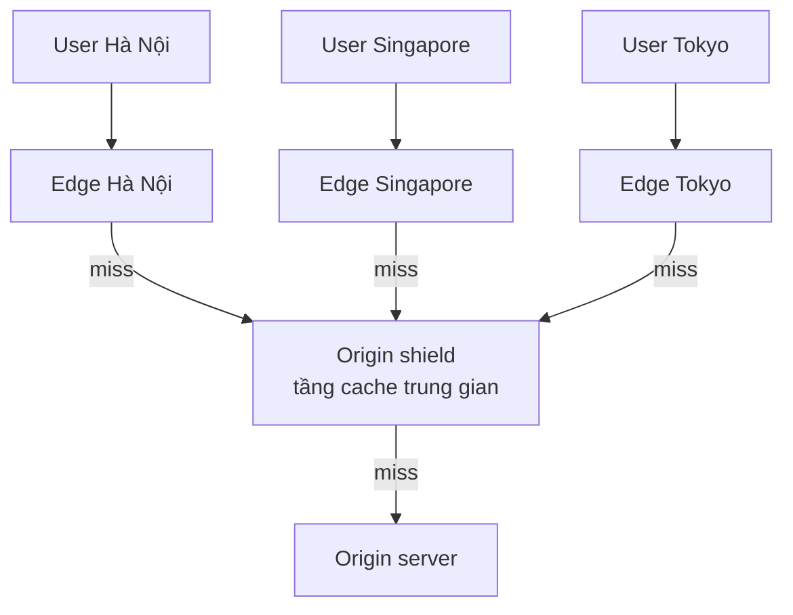

# Caching & các tầng cache

**Caching** (bộ nhớ đệm) là kỹ thuật lưu **bản sao** của dữ liệu ở nơi **nhanh hơn và gần người dùng hơn** nguồn gốc, để những lần đọc sau không phải đi tới nguồn chậm (database, service khác, ổ đĩa). Trong một hệ thống web, cache không nằm ở một chỗ mà trải dài nhiều **tầng**: trình duyệt (client), CDN, web server/reverse proxy, application (Redis, Memcached), và ngay bên trong database.

**Tương tự đơn giản:** Bạn hay nấu ăn. Gia vị dùng hằng ngày để ngay **trên bếp** (client cache), đồ khô để trong **tủ bếp** (application cache), đồ dự trữ để ở **kho dưới nhà** (database), còn thứ hiếm thì phải **ra chợ** (service bên ngoài). Mỗi tầng càng gần thì lấy càng nhanh nhưng chỗ càng ít -- và đồ để lâu trên bếp có thể đã **hết hạn** mà bạn không biết.

---

:::note[Ghi nhớ nhanh]

- ⭐ **Cache đổi consistency lấy tốc độ** — mọi cache đều có thể trả dữ liệu cũ; câu hỏi là "cũ bao lâu thì chấp nhận được".
- ⭐ **Cache nhiều tầng: client, CDN, web server, application, database** — tầng càng gần user càng rẻ khi hit, nhưng càng khó invalidate.
- **Cache ở mức object tốt hơn cache ở mức query** — invalidate theo object dễ, còn query cache phải xoá mọi câu query có liên quan khi một ô dữ liệu đổi.
- **Eviction policy (LRU, LFU...) và TTL** quyết định cái gì bị đẩy ra khi đầy và dữ liệu sống bao lâu.
- **Đo cache hit ratio** — cache hit 95% nghĩa là DB chỉ chịu 5% tải đọc; hit thấp thì cache chỉ thêm độ phức tạp.

:::

---

## Mục lục

- [Vì sao cần Caching?](#vì-sao-cần-caching)
- [1. Cache hoạt động thế nào?](#1-cache-hoạt-động-thế-nào)
- [2. Client Caching](#2-client-caching)
- [3. CDN Caching](#3-cdn-caching)
- [4. Web Server Caching](#4-web-server-caching)
- [5. Database Caching](#5-database-caching)
- [6. Application Caching](#6-application-caching)
- [7. Cache ở mức query vs mức object](#7-cache-ở-mức-query-vs-mức-object)
- [8. Eviction policy và TTL](#8-eviction-policy-và-ttl)
- [Khi nào dùng?](#khi-nào-dùng)
- [Lỗi thường gặp](#lỗi-thường-gặp)
- [Câu hỏi phỏng vấn](#câu-hỏi-phỏng-vấn)

---

## Vì sao cần Caching?

**Vấn đề:** Database là tầng **đắt nhất** để scale và thường là nút thắt đầu tiên. Phần lớn ứng dụng có workload đọc lệch: một số ít dữ liệu được đọc rất nhiều lần (trang chủ, sản phẩm hot, profile người nổi tiếng) -- phân bố kiểu **Pareto**, khoảng 20% dữ liệu nhận 80% lượt đọc. Mỗi lần đọc lại tốn round-trip mạng, CPU parse query, I/O đĩa. Thêm vào đó, độ trễ giữa các tầng lưu trữ chênh nhau hàng nghìn lần:

| Thao tác | Độ trễ cỡ |
| --- | --- |
| Đọc từ RAM cục bộ | ~100 ns |
| Round-trip trong cùng datacenter | ~0.5 ms |
| Đọc ngẫu nhiên từ SSD | ~0.1 ms |
| Query DB đơn giản qua mạng | 1 - 5 ms |
| Round-trip xuyên lục địa | ~150 ms |

(Theo bảng "Latency numbers every programmer should know" phổ biến -- con số mang tính độ lớn.)

**Giải pháp:** Đặt dữ liệu hay dùng ở tầng nhanh hơn. Cache giúp **giảm latency**, **giảm tải** cho DB/service phía sau, và **hấp thụ đột biến traffic** (spike).

:::tip[Dùng thực tế]

- **Facebook:** vận hành một trong những cụm Memcached lớn nhất thế giới (bài báo "Scaling Memcache at Facebook", 2013) để đỡ tải đọc cho MySQL.
- **Netflix EVCache:** tầng cache phân tán dựa trên Memcached, replicate đa region cho dữ liệu metadata, cá nhân hoá.
- **Wikipedia:** phần lớn lượt xem trang của người dùng chưa đăng nhập được phục vụ từ tầng cache HTTP (Varnish, sau này là ATS) mà không chạm vào PHP/MySQL.
- **Twitter:** timeline của user được build sẵn và giữ trong Redis cluster.

:::

---

## 1. Cache hoạt động thế nào?

Hai khái niệm cơ bản:

- **Cache hit** -- dữ liệu có trong cache, trả về ngay.
- **Cache miss** -- không có, phải lấy từ nguồn (rồi thường lưu lại vào cache).

**Hit ratio** = hit / (hit + miss). Latency trung bình xấp xỉ:

```text
avg_latency = hit_ratio * cache_latency + (1 - hit_ratio) * (cache_latency + origin_latency)

Ví dụ: cache 1ms, DB 20ms
  hit 50% -> 0.5*1 + 0.5*21 = 11 ms
  hit 95% -> 0.95*1 + 0.05*21 = 2 ms
  hit 99% -> 0.99*1 + 0.01*21 = 1.2 ms
```

Các tầng cache trong một request điển hình:



Mỗi tầng chặn được bao nhiêu request thì tầng sau bớt bấy nhiêu tải.

---

## 2. Client Caching

**Client caching** là cache nằm phía client: **trình duyệt** (HTTP cache), **app mobile** (bộ nhớ, SQLite, AsyncStorage), hoặc **thư viện client** (React Query, SWR, Apollo). Request hit ở đây thì **không hề đi qua mạng** -- nhanh nhất và rẻ nhất cho server.

Trình duyệt được điều khiển qua HTTP header:

| Header | Ý nghĩa |
| --- | --- |
| `Cache-Control: max-age=3600` | Dùng bản cache trong 3600 giây, không hỏi lại server |
| `Cache-Control: no-cache` | Được lưu nhưng **phải hỏi lại** server (revalidate) trước khi dùng |
| `Cache-Control: no-store` | Không được lưu (dữ liệu nhạy cảm) |
| `Cache-Control: private` | Chỉ trình duyệt được cache, CDN/proxy thì không |
| `Cache-Control: public, s-maxage=600` | Cho phép cache dùng chung (CDN) giữ 600 giây |
| `immutable` | Nội dung không bao giờ đổi -- không revalidate kể cả khi user reload |
| `ETag` + `If-None-Match` | Revalidate: server trả `304 Not Modified` nếu không đổi, tiết kiệm băng thông |
| `stale-while-revalidate=60` | Hết hạn vẫn dùng bản cũ trong 60 giây, đồng thời làm mới nền |



**Chiến lược phổ biến cho web app:**

- File tĩnh có hash trong tên (`app.3f9a1c.js`): `Cache-Control: public, max-age=31536000, immutable` -- cache 1 năm, deploy mới thì đổi tên file.
- `index.html`: `no-cache` -- luôn revalidate để lấy đúng bản build mới.
- API dữ liệu cá nhân: `private, no-cache` + ETag, hoặc quản lý ở client bằng React Query (`staleTime`).

```ts
// Express: đặt header cache cho API công khai
import express from 'express';

const app = express();

app.get('/api/products/:id', async (req, res) => {
  const product = await findProduct(req.params.id); // hàm truy vấn giả định
  if (!product) return res.status(404).json({ error: 'Không tìm thấy sản phẩm' });
  res.set('Cache-Control', 'public, max-age=60, s-maxage=300, stale-while-revalidate=30');
  return res.json(product); // Express tự sinh ETag yếu cho body
});

declare function findProduct(id: string): Promise<unknown | null>;
```

---

## 3. CDN Caching

**CDN** (Content Delivery Network) là mạng lưới máy chủ **edge** đặt ở hàng trăm thành phố. User được định tuyến tới edge gần nhất; edge trả nội dung từ cache, chỉ khi miss mới về **origin** (server gốc). CDN được coi là một **loại cache** trong system-design-primer.

- Truyền thống: cache file tĩnh (ảnh, JS, CSS, video).
- Hiện đại: cache cả **API response** và **HTML** công khai, chạy logic ở edge (Cloudflare Workers, Lambda@Edge).



**Origin shield** -- một tầng cache trung gian giữa các edge và origin, gom các miss lại để origin không bị hàng trăm edge cùng hỏi một lúc.

Điểm cần nhớ:

- CDN tôn trọng `Cache-Control: s-maxage` và `public`/`private`.
- **Cache key** mặc định là URL; query string, header (`Accept-Language`, cookie) có thể làm phân mảnh cache -- cấu hình chỉ giữ tham số cần thiết.
- **Invalidate (purge)** CDN mất từ vài giây đến vài phút để lan khắp edge -- thường dùng **versioned URL** (`/v2/logo.png`, hash trong tên file) thay vì purge.
- Không bao giờ để CDN cache response có dữ liệu cá nhân (sai header `public` là lộ dữ liệu người này cho người khác).

---

## 4. Web Server Caching

**Web server caching** -- reverse proxy như **Nginx**, **Varnish**, **HAProxy** (cùng nhiều API gateway) cache response ngay trước app server. App không phải chạy lại logic và query cho mỗi request giống nhau.

```nginx
# Nginx: cache response từ upstream app trong 10 phút
proxy_cache_path /var/cache/nginx levels=1:2 keys_zone=api_cache:50m
                 max_size=2g inactive=30m use_temp_path=off;

server {
  listen 80;

  location /api/public/ {
    proxy_pass http://app_upstream;
    proxy_cache api_cache;
    proxy_cache_key "$scheme$request_method$host$request_uri";
    proxy_cache_valid 200 10m;
    proxy_cache_valid 404 1m;
    proxy_cache_use_stale error timeout updating http_500 http_502 http_503;
    proxy_cache_lock on;              # chỉ 1 request đi upstream khi miss, số còn lại chờ
    proxy_cache_background_update on; # làm mới nền khi hết hạn
    add_header X-Cache-Status $upstream_cache_status;
  }
}
```

Hai dòng đáng chú ý:

- `proxy_cache_use_stale` -- app chết vẫn phục vụ bản cũ: cache trở thành **lớp chống sập**.
- `proxy_cache_lock` -- chống **cache stampede** (nhiều request cùng miss đồng thời dồn về app).

**Microcaching**: cache trang động chỉ **1 giây**. Nghe vô nghĩa, nhưng với 1000 request/giây cho cùng một trang, app chỉ phải render 1 lần/giây thay vì 1000.

---

## 5. Database Caching

Database đã có sẵn nhiều tầng cache bên trong, cấu hình đúng là được hiệu năng "miễn phí":

| Cơ chế | DB | Mô tả |
| --- | --- | --- |
| **Buffer pool / shared buffers** | MySQL InnoDB, PostgreSQL | Cache các trang dữ liệu và index trong RAM. InnoDB thường đặt 50-75% RAM máy chuyên dụng; PostgreSQL `shared_buffers` thường khoảng 25% RAM và dựa thêm vào page cache của OS |
| **OS page cache** | Mọi DB dùng file | Kernel giữ các block file vừa đọc trong RAM |
| **Query cache** | MySQL (đã **bị loại bỏ** ở 8.0) | Cache kết quả nguyên câu SELECT; bị xoá vì mọi ghi vào bảng đều xoá cache của bảng đó, gây tranh khoá trên máy nhiều core |
| **Plan cache** | PostgreSQL prepared statement, SQL Server | Cache execution plan để khỏi lập kế hoạch lại |
| **Materialized view** | PostgreSQL, Oracle | Kết quả query lưu sẵn như bảng, refresh định kỳ |

```sql
-- PostgreSQL: tỉ lệ đọc trúng shared buffers (nên trên ~99% cho OLTP)
SELECT sum(blks_hit) * 100.0 / NULLIF(sum(blks_hit) + sum(blks_read), 0) AS cache_hit_pct
FROM pg_stat_database;
```

Nếu "working set" (dữ liệu hay truy cập) vừa RAM, DB đọc gần như toàn bộ từ bộ nhớ. Đây cũng là lý do federation và sharding giúp cache tốt hơn: mỗi DB nhỏ hơn thì working set dễ vừa RAM hơn.

---

## 6. Application Caching

**Application caching** là cache do **code ứng dụng** chủ động đọc/ghi, thường là **in-memory key-value store** như **Redis** hoặc **Memcached**, nằm giữa app và database. Đây là tầng linh hoạt nhất vì app quyết định cache cái gì, dạng gì, sống bao lâu.

| | Memcached | Redis |
| --- | --- | --- |
| Kiểu dữ liệu | Chỉ string/blob | String, hash, list, set, sorted set, stream, bitmap... |
| Persistence | Không | RDB snapshot, AOF |
| Replication, failover | Không có sẵn | Có (replica, Sentinel, Cluster) |
| Đa luồng | Có | Xử lý lệnh chủ yếu đơn luồng (I/O đa luồng từ bản 6) |
| Dùng khi | Cache đơn giản, cần đa luồng thuần | Hầu hết trường hợp khác: cache + counter + lock + pub/sub |

Ngoài cache phân tán còn có **in-process cache** (cache ngay trong RAM của process app, vd `lru-cache` của Node): nhanh nhất (không qua mạng) nhưng mỗi instance một bản, khó invalidate đồng bộ, mất khi restart. Mô hình **2 tầng** (L1 in-process vài giây + L2 Redis vài phút) rất phổ biến.

```ts
import { LRUCache } from 'lru-cache';
import { createClient } from 'redis';

const L1_TTL_MS = 5_000;
const L2_TTL_SECONDS = 300;

const l1 = new LRUCache<string, string>({ max: 10_000, ttl: L1_TTL_MS });
const redis = createClient({ url: process.env.REDIS_URL });
await redis.connect();

export async function getCached<T>(key: string, load: () => Promise<T>): Promise<T> {
  const local = l1.get(key);
  if (local !== undefined) return JSON.parse(local) as T;

  const remote = await redis.get(key);
  if (remote !== null) {
    l1.set(key, remote);
    return JSON.parse(remote) as T;
  }

  const fresh = await load();                 // miss cả 2 tầng -> đọc nguồn
  const serialized = JSON.stringify(fresh);
  await redis.set(key, serialized, { EX: L2_TTL_SECONDS });
  l1.set(key, serialized);
  return fresh;
}
```

**Nên cache gì ở tầng application** (theo system-design-primer): session user, trang web đã render hoàn chỉnh, activity stream, dữ liệu đồ thị user, kết quả tính toán đắt, kết quả gọi API bên thứ ba có rate limit.

Lưu ý Redis là **RAM** -- đắt hơn đĩa nhiều. Không cache mọi thứ; cache **dữ liệu nóng**, và luôn đặt TTL.

---

## 7. Cache ở mức query vs mức object

Có hai cách chọn **cái gì** làm đơn vị cache:

### 7.1 Caching at the database query level

Hash câu query (kèm tham số) làm key, lưu kết quả làm value:

```ts
import { createHash } from 'node:crypto';

function queryKey(sql: string, params: readonly unknown[]): string {
  return 'q:' + createHash('sha1').update(sql + JSON.stringify(params)).digest('hex');
}
// key = q:9a1f... -> value = mảng hàng kết quả
```

Vấn đề:

- **Khó invalidate**: khi một hàng `products` thay đổi, bạn không biết những query nào (trong vô số query đã cache) có chứa hàng đó -- thường phải xoá hết hoặc chờ TTL.
- Một ô dữ liệu đổi có thể ảnh hưởng hàng trăm kết quả query đã cache.
- Hai query khác nhau chút xíu (thứ tự tham số, khoảng trắng) tạo hai entry trùng nội dung.

### 7.2 Caching at the object level

Coi dữ liệu như **object** của ứng dụng: lắp ghép object từ DB (có thể từ nhiều bảng), rồi cache cả object theo ID của nó.

```ts
type ProductView = {
  readonly id: string;
  readonly name: string;
  readonly price: number;
  readonly brand: string;
  readonly rating: number;
};

const productKey = (id: string) => `product:v3:${id}`; // v3 = version schema của object

// Khi sản phẩm đổi -> chỉ xoá đúng 1 key
export async function onProductUpdated(id: string, del: (k: string) => Promise<unknown>) {
  await del(productKey(id));
}
```

Lợi ích:

- **Invalidate rõ ràng**: dữ liệu nguồn đổi thì xoá đúng key của object đó.
- Cho phép xử lý **bất đồng bộ**: worker lắp ráp object và ghi cache sẵn.
- Cache dùng lại được ở nhiều trang (trang chi tiết, danh sách, giỏ hàng cùng dùng `product:{id}`).

| | Query level | Object level |
| --- | --- | --- |
| Key | Hash của câu SQL + tham số | ID nghiệp vụ (`user:42`) |
| Invalidate | Khó, thường chờ TTL | Dễ, xoá theo ID |
| Tái sử dụng | Thấp | Cao |
| Phù hợp | Báo cáo, query nặng ít đổi | Phần lớn dữ liệu OLTP |

**Khuyến nghị: ưu tiên cache ở mức object.**

---

## 8. Eviction policy và TTL

Cache có dung lượng giới hạn. **Eviction policy** (chính sách loại bỏ) quyết định entry nào bị đẩy ra khi đầy; **TTL** (Time To Live) quyết định entry sống tối đa bao lâu.

| Policy | Loại bỏ | Ưu | Nhược |
| --- | --- | --- | --- |
| **LRU** (Least Recently Used) | Entry lâu nhất chưa được truy cập | Đơn giản, hợp đa số workload | Một lần quét lớn (scan) có thể đẩy hết dữ liệu nóng |
| **LFU** (Least Frequently Used) | Entry ít được truy cập nhất | Giữ dữ liệu nóng lâu dài tốt | Dữ liệu từng hot nhưng nay nguội vẫn chiếm chỗ (cần decay) |
| **FIFO** | Entry vào sớm nhất | Rất đơn giản | Bỏ qua mức độ sử dụng |
| **Random** | Ngẫu nhiên | Chi phí thấp nhất | Kém tối ưu |
| **TTL-based** | Entry sắp hết hạn trước | Hợp dữ liệu có hạn sử dụng rõ | Không xét độ nóng |

Redis cấu hình bằng `maxmemory-policy`:

```bash
# redis.conf
maxmemory 4gb
maxmemory-policy allkeys-lru     # hoặc allkeys-lfu, volatile-lru, volatile-ttl, noeviction
```

- `allkeys-*`: áp dụng cho mọi key -- dùng khi Redis **chỉ** làm cache.
- `volatile-*`: chỉ loại key có TTL -- dùng khi Redis vừa cache vừa lưu dữ liệu không được mất.
- `noeviction`: đầy thì báo lỗi khi ghi -- dùng khi Redis là store chính.

Redis dùng **LRU/LFU xấp xỉ** (lấy mẫu một số key rồi loại key "tệ" nhất) thay vì LRU chính xác, để tiết kiệm bộ nhớ.

**Cấu trúc LRU kinh điển:** hash map + doubly linked list -- `get` và `put` đều O(1). Đây là câu hỏi phỏng vấn coding rất phổ biến.

```ts
// LRU tối giản dựa trên thứ tự chèn của Map (Map giữ thứ tự insertion)
export class LruCache<K, V> {
  private readonly store = new Map<K, V>();

  constructor(private readonly capacity: number) {
    if (capacity <= 0) throw new Error('capacity phải lớn hơn 0');
  }

  get(key: K): V | undefined {
    if (!this.store.has(key)) return undefined;
    const value = this.store.get(key) as V;
    this.store.delete(key);       // đưa key về cuối = mới dùng gần nhất
    this.store.set(key, value);
    return value;
  }

  put(key: K, value: V): void {
    if (this.store.has(key)) this.store.delete(key);
    this.store.set(key, value);
    if (this.store.size > this.capacity) {
      const oldest = this.store.keys().next().value as K; // phần tử đầu = lâu nhất chưa dùng
      this.store.delete(oldest);
    }
  }
}
```

**Chọn TTL:**

| Loại dữ liệu | TTL gợi ý |
| --- | --- |
| Cấu hình, danh mục ít đổi | Vài giờ đến 1 ngày |
| Trang sản phẩm, profile | 5 - 60 phút + invalidate chủ động khi đổi |
| Feed, số liệu realtime | Vài giây đến 1 phút |
| Session | Bằng thời gian phiên đăng nhập |

Thêm **jitter** (độ lệch ngẫu nhiên) vào TTL (vd 300s cộng ngẫu nhiên 0-60s) để hàng nghìn key không hết hạn **cùng một lúc** gây dồn tải về DB.

---

## Khi nào dùng?

- **Nên cache khi:**
  - Dữ liệu đọc nhiều hơn ghi rất nhiều.
  - Tính toán hoặc query tốn kém, kết quả dùng lại nhiều lần.
  - Chấp nhận được dữ liệu cũ trong một khoảng (TTL).
  - Cần bảo vệ DB khỏi spike traffic.
- **Chọn tầng nào:**
  - File tĩnh, nội dung công khai -- **client + CDN**.
  - Trang/API công khai giống nhau cho mọi user -- **web server cache** hoặc CDN.
  - Dữ liệu theo user, object nghiệp vụ -- **application cache** (Redis).
  - Luôn: cấu hình **DB buffer** hợp lý.
- **Không nên cache khi:**
  - Dữ liệu đổi liên tục và yêu cầu luôn mới nhất (số dư ví khi thanh toán, tồn kho lúc chốt đơn).
  - Hit ratio thấp (mỗi key chỉ đọc 1 lần) -- cache chỉ tốn RAM.
  - Dữ liệu nhạy cảm ở tầng chia sẻ (CDN) mà không kiểm soát được cache key.

---

## Lỗi thường gặp

### Lỗi 1: Cache không có TTL

Key không TTL sống mãi -- dữ liệu sai do bug invalidate sẽ **không bao giờ tự sửa**, và RAM đầy dần. Luôn đặt TTL như lưới an toàn, kể cả khi đã invalidate chủ động.

### Lỗi 2: CDN cache response cá nhân

API `/api/me` trả `Cache-Control: public` -- CDN trả profile user A cho user B. Dữ liệu cá nhân phải `private` hoặc `no-store`, và kiểm tra cache key của CDN.

### Lỗi 3: Cache cả lỗi hoặc giá trị rỗng không kiểm soát

Cache response lỗi 500 trong 10 phút làm lỗi tạm thời kéo dài 10 phút. Ngược lại, **không** cache kết quả "không tồn tại" thì kẻ xấu gọi ID không tồn tại liên tục sẽ xuyên thẳng xuống DB (cache penetration) -- nên cache giá trị rỗng với TTL ngắn hoặc dùng Bloom filter.

### Lỗi 4: Coi cache là nguồn dữ liệu

Chỉ ghi vào Redis mà không ghi DB; Redis evict hoặc restart là mất. Cache phải **tái tạo được** từ nguồn.

### Lỗi 5: Không đo hit ratio

Thêm Redis rồi tưởng nhanh hơn, nhưng hit ratio 20% -- 80% request vẫn xuống DB và còn thêm một round-trip Redis. Theo dõi `keyspace_hits` / `keyspace_misses` (Redis `INFO stats`).

---

## Câu hỏi phỏng vấn

Những câu thường gặp về chủ đề này. Tự trả lời trước, rồi bấm **Xem đáp án** để đối chiếu.

**1. Kể các tầng cache trong một hệ thống web và vai trò của từng tầng.**

<details className="qa">
<summary>Xem đáp án</summary>

- **Client** (browser HTTP cache, React Query, app mobile): không gọi mạng.
- **CDN**: phục vụ nội dung tĩnh/công khai ở edge gần user, giảm latency và tải origin.
- **Web server / reverse proxy** (Nginx, Varnish): cache response HTTP, chống sập với stale.
- **Application** (Redis, Memcached, in-process): cache object nghiệp vụ, session, kết quả tính toán.
- **Database** (buffer pool, page cache, materialized view): giữ dữ liệu nóng trong RAM.

</details>

**2. Vì sao nên cache ở mức object thay vì mức query?**

<details className="qa">
<summary>Xem đáp án</summary>

Query cache khó invalidate: khi một hàng đổi, không biết những kết quả query nào chứa nó, nên phải xoá hàng loạt hoặc chờ TTL. Object cache gắn với ID nghiệp vụ (`product:42`) -- dữ liệu đổi thì xoá đúng key, tái sử dụng được nhiều nơi, và cho phép worker build sẵn object bất đồng bộ. MySQL thậm chí đã loại bỏ query cache ở 8.0.

</details>

**3. LRU và LFU khác nhau thế nào? Khi nào chọn LFU?**

<details className="qa">
<summary>Xem đáp án</summary>

LRU loại entry lâu nhất chưa truy cập -- nhạy với truy cập gần đây, nhưng một lần quét lớn có thể đẩy hết dữ liệu nóng. LFU loại entry ít truy cập nhất -- giữ "hàng hot" bền vững hơn, nhưng cần cơ chế decay để entry từng hot rồi nguội không chiếm chỗ mãi. Chọn LFU khi tập dữ liệu nóng ổn định theo thời gian (sản phẩm bán chạy, trang phổ biến); LRU cho workload có tính thời điểm.

</details>

**4. Cài đặt LRU cache O(1) thế nào?**

<details className="qa">
<summary>Xem đáp án</summary>

Hash map (key -> node) + doubly linked list (thứ tự sử dụng). `get`: tra map O(1), chuyển node về đầu list O(1). `put`: nếu có thì cập nhật và chuyển về đầu; nếu không thì thêm vào đầu, vượt capacity thì xoá node cuối list và xoá khỏi map. Trong JS/TS có thể tận dụng `Map` giữ thứ tự chèn: xoá rồi set lại để "đưa về cuối", phần tử đầu tiên là ứng viên bị loại.

</details>

**5. Hit ratio là gì? Làm sao tăng nó?**

<details className="qa">
<summary>Xem đáp án</summary>

Tỉ lệ request được phục vụ từ cache. Tăng bằng: cache đúng dữ liệu nóng; tăng dung lượng cho vừa working set; chọn eviction phù hợp (LFU cho hot set ổn định); TTL đủ dài + invalidate chủ động thay vì TTL ngắn; chuẩn hoá cache key (bỏ query string thừa, sắp xếp tham số); warm-up cache sau deploy; dùng object-level để nhiều trang dùng chung key.

</details>

**6. `Cache-Control: no-cache` và `no-store` khác gì?**

<details className="qa">
<summary>Xem đáp án</summary>

`no-cache` vẫn **được lưu** nhưng phải revalidate với server (qua ETag/Last-Modified) trước mỗi lần dùng -- nếu không đổi thì server trả 304, tiết kiệm băng thông. `no-store` **không được lưu** ở bất kỳ đâu -- dùng cho dữ liệu nhạy cảm (thông tin ngân hàng).

</details>
