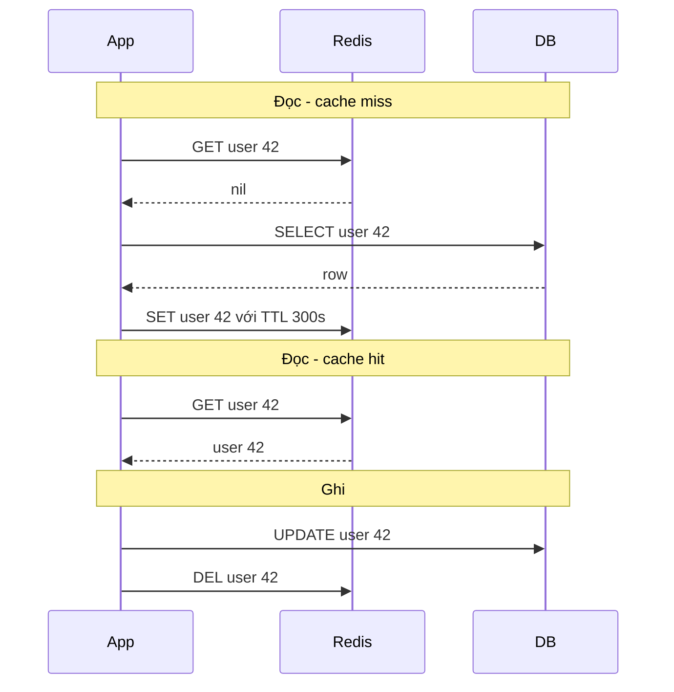
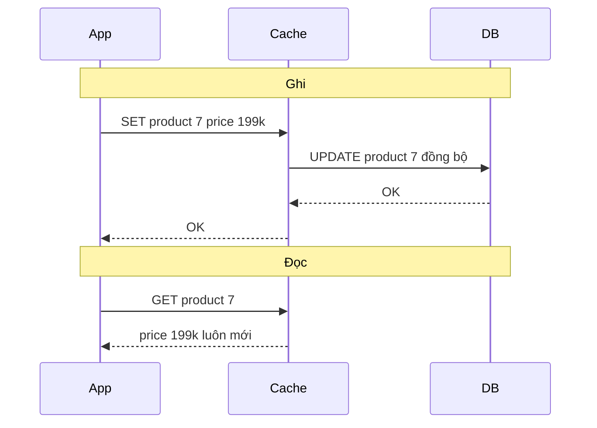
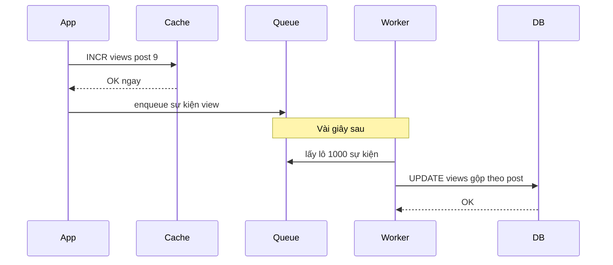
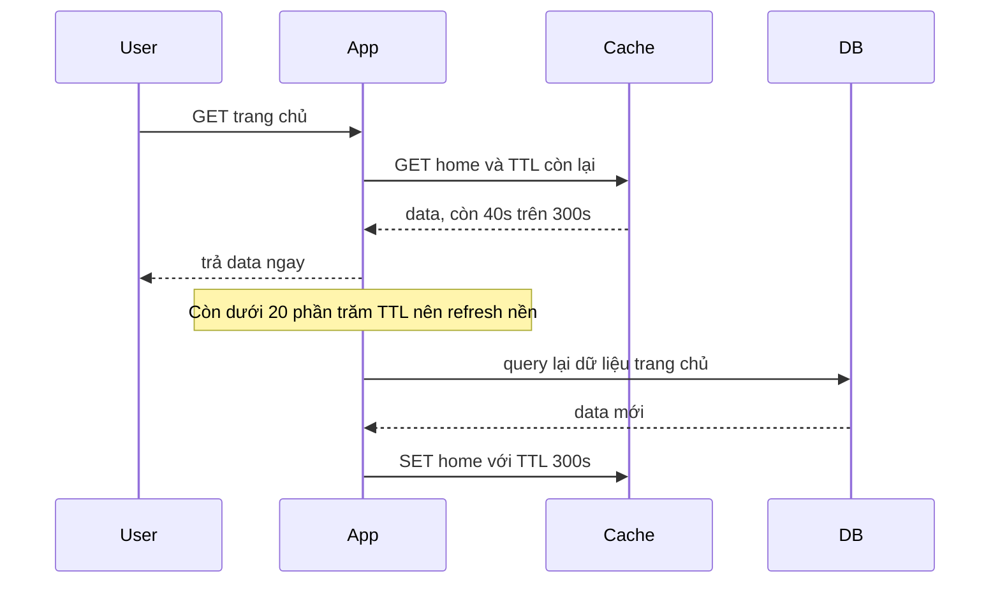
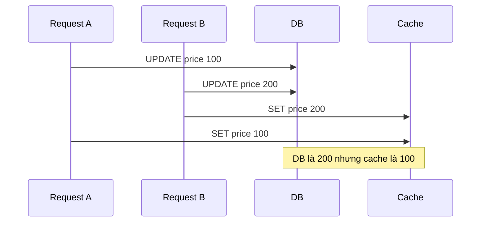
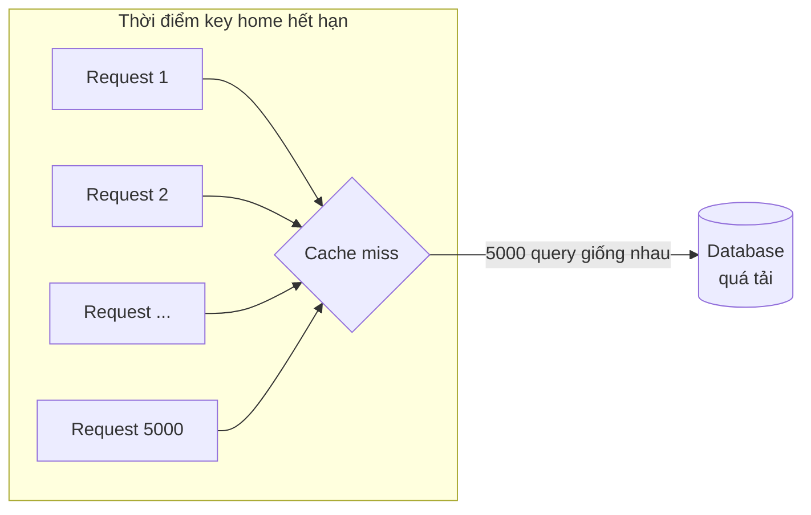

# Chiến lược cập nhật cache

Có cache rồi, câu hỏi tiếp theo là: **ai** ghi dữ liệu vào cache, **khi nào**, và làm sao để cache **không lệch** quá xa database? Bốn chiến lược kinh điển (theo system-design-primer) là **Cache-aside** (app tự nạp cache khi miss), **Write-through** (ghi cache và DB cùng lúc), **Write-behind** (ghi cache trước, DB sau -- bất đồng bộ) và **Refresh-ahead** (làm mới cache trước khi hết hạn). Mỗi chiến lược là một cách đánh đổi giữa **độ tươi dữ liệu**, **latency ghi/đọc**, **độ an toàn dữ liệu** và **độ phức tạp**.

**Tương tự đơn giản:** Hãy nghĩ tới tấm bảng giá trước cửa quán cà phê (cache) và sổ giá trong máy tính của chủ quán (database). **Cache-aside**: khách hỏi món chưa có trên bảng thì nhân viên tra sổ rồi viết thêm lên bảng. **Write-through**: mỗi lần đổi giá, chủ quán sửa sổ **và** bảng ngay lập tức. **Write-behind**: chủ quán sửa bảng trước cho nhanh, cuối ngày mới cập nhật sổ (lỡ mất bảng là mất luôn thay đổi). **Refresh-ahead**: nhân viên tự động viết lại các món bán chạy trước khi phấn kịp mờ.

---

:::note[Ghi nhớ nhanh]

- ⭐ **Cache-aside (lazy loading) là mặc định phổ biến nhất** — chỉ cache dữ liệu thật sự được đọc; miss tốn 3 bước; khi ghi thì **xoá** key thay vì cập nhật.
- ⭐ **Cache stampede (thundering herd)** — key nóng hết hạn, hàng nghìn request cùng miss và dồn xuống DB; phòng bằng lock, request coalescing, TTL jitter, refresh-ahead.
- **Write-through: cache luôn mới, ghi chậm hơn** — mỗi ghi phải qua cả cache và DB; dữ liệu ghi nhưng ít đọc làm phí RAM.
- **Write-behind: ghi cực nhanh, có rủi ro mất dữ liệu** — cache gom và ghi DB bất đồng bộ; cache chết trước khi flush là mất.
- **Refresh-ahead: giảm latency cho key nóng** — chỉ hiệu quả khi dự đoán đúng key nào sẽ được đọc.
- **Invalidation là phần khó nhất** — "There are only two hard things in Computer Science: cache invalidation and naming things" (Phil Karlton).

:::

---

## Mục lục

- [Vì sao cần chiến lược cập nhật cache?](#vì-sao-cần-chiến-lược-cập-nhật-cache)
- [1. Cache-aside](#1-cache-aside)
- [2. Write-through](#2-write-through)
- [3. Write-behind](#3-write-behind)
- [4. Refresh-ahead](#4-refresh-ahead)
- [5. So sánh bốn chiến lược](#5-so-sánh-bốn-chiến-lược)
- [6. Cache invalidation](#6-cache-invalidation)
- [7. Cache stampede và cách phòng](#7-cache-stampede-và-cách-phòng)
- [Khi nào dùng?](#khi-nào-dùng)
- [Lỗi thường gặp](#lỗi-thường-gặp)
- [Câu hỏi phỏng vấn](#câu-hỏi-phỏng-vấn)

---

## Vì sao cần chiến lược cập nhật cache?

**Vấn đề:** Cache là **bản sao** -- và mọi bản sao đều có thể lệch bản gốc. Nếu không có quy tắc rõ ràng ai cập nhật cache và khi nào, bạn sẽ gặp: user đổi tên nhưng trang vẫn hiện tên cũ hàng giờ; giá sản phẩm trên trang khác giá lúc thanh toán; hoặc ngược lại, mỗi lần cache hết hạn thì DB bị dội hàng nghìn query cùng lúc và sập.

**Giải pháp:** Chọn một **chiến lược** cập nhật phù hợp với đặc tính dữ liệu (tỉ lệ đọc/ghi, mức chấp nhận dữ liệu cũ, mức chấp nhận mất dữ liệu), kết hợp **invalidation** đúng cách và cơ chế chống **stampede**.

:::tip[Dùng thực tế]

- **Cache-aside với Redis/Memcached** là mô hình mặc định của hầu hết web app (Facebook mô tả Memcached dùng như "demand-filled look-aside cache" trong bài báo năm 2013).
- **Write-through:** Amazon DynamoDB Accelerator (DAX) là cache write-through đặt trước DynamoDB.
- **Write-behind:** bộ đếm lượt xem/like (YouTube, Reddit kiểu) thường gom trong Redis rồi flush định kỳ xuống DB; CPU cache và page cache của OS cũng dùng write-back.
- **Refresh-ahead:** CDN và Nginx với `stale-while-revalidate` / `proxy_cache_background_update`; Caffeine (Java) có `refreshAfterWrite`.

:::

---

## 1. Cache-aside

**Cache-aside** (còn gọi là **lazy loading** hay **look-aside**): ứng dụng **tự** nói chuyện với cả cache và DB; cache **không** tự tương tác với DB.

Luồng **đọc**:

1. Tìm trong cache.
2. Miss thì đọc DB.
3. Ghi kết quả vào cache (kèm TTL) rồi trả về.

Luồng **ghi**: ghi DB, rồi **xoá** (invalidate) key trong cache -- lần đọc sau sẽ tự nạp lại.



```ts
import { createClient } from 'redis';
import { Pool } from 'pg';

const USER_TTL_SECONDS = 300;
const redis = createClient({ url: process.env.REDIS_URL });
const db = new Pool({ connectionString: process.env.DATABASE_URL });
await redis.connect();

type User = { readonly id: number; readonly name: string; readonly email: string };
const userKey = (id: number) => `user:v1:${id}`;

export async function getUser(id: number): Promise<User | null> {
  try {
    const cached = await redis.get(userKey(id));
    if (cached !== null) return JSON.parse(cached) as User;
  } catch (err) {
    // Cache lỗi không được làm sập request -> rơi về DB
    console.error('Đọc Redis lỗi, fallback DB', err);
  }

  const { rows } = await db.query<User>('SELECT id, name, email FROM users WHERE id = $1', [id]);
  const user = rows[0] ?? null;
  if (user) {
    await redis
      .set(userKey(id), JSON.stringify(user), { EX: USER_TTL_SECONDS })
      .catch((err) => console.error('Ghi Redis lỗi', err));
  }
  return user;
}

export async function updateUserName(id: number, name: string): Promise<void> {
  await db.query('UPDATE users SET name = $1 WHERE id = $2', [name, id]);
  await redis.del(userKey(id)); // xoá, KHÔNG set giá trị mới (xem mục Lỗi thường gặp)
}
```

**Ưu điểm:**

- Chỉ cache dữ liệu **thật sự được đọc** -- không phí RAM.
- **Chịu lỗi tốt**: cache chết thì app vẫn chạy (chậm hơn) bằng cách đọc DB.
- Mô hình dữ liệu trong cache có thể khác DB (object đã lắp ráp).

**Nhược điểm:**

- **Miss tốn 3 round-trip** (cache, DB, cache) -- latency đáng kể cho request đầu.
- **Dữ liệu có thể cũ** nếu DB bị ghi trực tiếp (bởi service khác, script) mà không xoá cache -- giảm thiểu bằng TTL.
- Node cache mới hoặc cache vừa restart thì **lạnh** (cold) -- mọi request miss, tăng tải DB đột ngột.
- Dễ bị **stampede** với key nóng (mục 7).

---

## 2. Write-through

**Write-through**: ứng dụng coi **cache là nơi ghi chính**; cache (hoặc lớp thư viện/proxy quanh nó) **đồng bộ** ghi xuống DB trước khi báo thành công. Đọc luôn từ cache.



Redis không có sẵn write-through tới DB của bạn, nên thường cài ở **tầng repository** của app:

```ts
type Product = { readonly id: number; readonly name: string; readonly price: number };
const productKey = (id: number) => `product:v1:${id}`;
const PRODUCT_TTL_SECONDS = 3600;

// Repository write-through: ghi DB rồi ghi cache trong cùng một thao tác
export async function saveProduct(product: Product): Promise<Product> {
  const { rows } = await db.query<Product>(
    `UPDATE products SET name = $1, price = $2 WHERE id = $3
     RETURNING id, name, price`,
    [product.name, product.price, product.id],
  );
  const saved = rows[0];
  if (!saved) throw new Error(`Không tìm thấy sản phẩm ${product.id}`);
  await redis.set(productKey(saved.id), JSON.stringify(saved), { EX: PRODUCT_TTL_SECONDS });
  return saved;
}
```

**Ưu điểm:**

- Cache **luôn mới** (với dữ liệu được ghi qua đường này) -- đọc nhanh và nhất quán.
- Đọc hầu như không miss với dữ liệu đã từng ghi.

**Nhược điểm:**

- **Ghi chậm hơn**: mỗi ghi tốn thêm một thao tác cache (user chấp nhận ghi chậm hơn đọc, nhưng vẫn là chi phí).
- **Phí RAM**: dữ liệu ghi nhưng không bao giờ đọc vẫn nằm trong cache -- thường kết hợp TTL.
- Node cache mới (thêm node, failover) **trống** cho tới khi có ghi mới -- thường kết hợp thêm cache-aside cho đọc miss.
- Không có transaction chung giữa cache và DB: ghi DB thành công nhưng ghi cache lỗi thì cache cũ -- cần retry hoặc xoá key.

---

## 3. Write-behind

**Write-behind** (hay **write-back**): ứng dụng ghi vào cache và **trả về ngay**; việc ghi xuống DB được thực hiện **bất đồng bộ** sau đó -- thường qua một hàng đợi, gom theo lô (batch) hoặc định kỳ.



Ví dụ: gom lượt xem trong Redis, mỗi 10 giây flush xuống PostgreSQL:

```ts
const FLUSH_INTERVAL_MS = 10_000;
const PENDING_KEY = 'views:pending'; // hash postId -> số view chưa ghi DB

export async function recordView(postId: number): Promise<void> {
  await redis.hIncrBy(PENDING_KEY, String(postId), 1); // cực nhanh, không chạm DB
}

async function flushViews(): Promise<void> {
  // Đổi tên key nguyên tử để lấy "ảnh chụp" và cho ghi mới vào key trống
  const snapshotKey = `${PENDING_KEY}:${Date.now()}`;
  try {
    await redis.rename(PENDING_KEY, snapshotKey);
  } catch {
    return; // không có view mới (key không tồn tại)
  }
  const counts = await redis.hGetAll(snapshotKey);
  const entries = Object.entries(counts);
  if (entries.length === 0) return;

  const ids = entries.map(([id]) => Number(id));
  const deltas = entries.map(([, n]) => Number(n));
  await db.query(
    `UPDATE posts AS p SET views = p.views + v.delta
     FROM unnest($1::bigint[], $2::int[]) AS v(id, delta)
     WHERE p.id = v.id`,
    [ids, deltas],
  );
  await redis.del(snapshotKey); // chỉ xoá SAU khi DB ghi thành công
}

setInterval(() => {
  flushViews().catch((err) => console.error('Flush views lỗi, sẽ thử lại', err));
}, FLUSH_INTERVAL_MS);
```

(Bản production cần thêm cơ chế quét lại các `snapshotKey` còn sót khi worker chết giữa chừng.)

**Ưu điểm:**

- **Ghi cực nhanh** -- latency ghi bằng latency cache.
- **Giảm tải ghi DB** nhờ gộp: 1 triệu `INCR` thành vài trăm `UPDATE`.
- Hấp thụ spike ghi.

**Nhược điểm:**

- **Mất dữ liệu** nếu cache chết trước khi flush (với Redis có thể giảm bằng AOF, replica, nhưng không triệt tiêu).
- **DB tạm thời không có dữ liệu mới** -- báo cáo, service khác đọc DB thấy số cũ.
- Phức tạp hơn cache-aside/write-through: hàng đợi, retry, idempotency, thứ tự ghi.

Hợp với: counter (view, like), analytics, log hoạt động, dữ liệu mà mất một ít chấp nhận được. **Không** dùng cho tiền, đơn hàng.

---

## 4. Refresh-ahead

**Refresh-ahead**: cache **tự động làm mới** những entry vừa được truy cập **trước khi** chúng hết hạn. Nếu cache dự đoán đúng entry nào sẽ cần, user gần như không bao giờ gặp miss.

Cơ chế phổ biến: khi đọc một key có thời gian sống còn lại dưới một ngưỡng (vd còn dưới 20% TTL), trả giá trị hiện tại **ngay** cho user và kích hoạt một tác vụ nền nạp lại từ DB.



```ts
const HOME_TTL_SECONDS = 300;
const REFRESH_THRESHOLD = 0.2; // làm mới khi TTL còn dưới 20%
const refreshing = new Set<string>(); // tránh refresh trùng trong cùng process

export async function getWithRefreshAhead<T>(
  key: string,
  ttlSeconds: number,
  load: () => Promise<T>,
): Promise<T> {
  const [cached, ttlLeft] = await Promise.all([redis.get(key), redis.ttl(key)]);

  if (cached === null) {
    const fresh = await load(); // miss thật -> nạp đồng bộ
    await redis.set(key, JSON.stringify(fresh), { EX: ttlSeconds });
    return fresh;
  }

  if (ttlLeft > 0 && ttlLeft < ttlSeconds * REFRESH_THRESHOLD && !refreshing.has(key)) {
    refreshing.add(key);
    load()
      .then((fresh) => redis.set(key, JSON.stringify(fresh), { EX: ttlSeconds }))
      .catch((err) => console.error(`Refresh-ahead ${key} lỗi`, err))
      .finally(() => refreshing.delete(key));
  }
  return JSON.parse(cached) as T;
}
```

**Ưu điểm:**

- Latency thấp và **ổn định** cho key nóng -- user không phải chịu miss.
- Giảm stampede vì key nóng không bao giờ thực sự hết hạn.

**Nhược điểm:**

- **Dự đoán sai** thì tốn tài nguyên refresh những key không ai đọc nữa -- hiệu năng có thể **tệ hơn** không dùng.
- Dữ liệu vẫn có thể cũ tới mức TTL.
- Phức tạp hơn cache-aside.

---

## 5. So sánh bốn chiến lược

| Tiêu chí | Cache-aside | Write-through | Write-behind | Refresh-ahead |
| --- | --- | --- | --- | --- |
| Ai nạp cache | App khi miss | Lúc ghi | Lúc ghi | Tác vụ nền trước khi hết hạn |
| Latency đọc | Miss chậm, hit nhanh | Nhanh | Nhanh | Nhanh, ổn định |
| Latency ghi | Bằng DB | DB + cache | Bằng cache (nhanh nhất) | Bằng DB |
| Độ tươi dữ liệu | Có thể cũ tới TTL | Mới | Cache mới, DB trễ | Có thể cũ tới TTL |
| Rủi ro mất dữ liệu | Không | Không | **Có** | Không |
| Chịu lỗi khi cache chết | Tốt | Kém (đường ghi phụ thuộc cache) | Kém | Tốt |
| Lãng phí RAM | Thấp | Cao (dữ liệu ít đọc) | Trung bình | Tuỳ độ chính xác dự đoán |
| Độ phức tạp | Thấp | Trung bình | Cao | Trung bình |

Trong thực tế, các chiến lược **kết hợp** với nhau: cache-aside cho đọc + write-through cho vài object quan trọng; cache-aside + refresh-ahead cho trang chủ; write-behind riêng cho counter.

---

## 6. Cache invalidation

**Invalidation** là việc làm cho cache **không còn trả dữ liệu cũ** sau khi nguồn thay đổi. Các cách phổ biến:

| Cách | Mô tả | Khi nào |
| --- | --- | --- |
| **TTL** | Tự hết hạn sau N giây | Luôn dùng như lưới an toàn |
| **Delete on write** | Ghi DB xong thì `DEL` key | Mặc định với cache-aside |
| **Update on write** | Ghi DB xong thì `SET` giá trị mới | Write-through; cẩn thận race condition |
| **Event-driven / CDC** | Đọc binlog/WAL (Debezium) hoặc event, xoá key tương ứng | Nhiều service ghi chung DB, không kiểm soát được mọi đường ghi |
| **Versioned key** | Đổi key khi đổi phiên bản (`product:v4:42`, hoặc thêm `updated_at` vào key) | Đổi cấu trúc object; CDN asset |
| **Tag-based** | Gắn tag cho key, xoá theo tag (vd mọi key của category 5) | Một thay đổi ảnh hưởng nhiều key |

### Vì sao xoá tốt hơn cập nhật?

Hai request ghi song song với update-on-write có thể để lại cache **sai vĩnh viễn** (cho tới TTL):



Dùng `DEL` thì cả hai đều chỉ xoá; lần đọc sau nạp lại giá trị đúng từ DB.

Ngay cả cache-aside + delete vẫn có một race hiếm: request đọc lấy giá trị cũ từ DB, request ghi cập nhật DB và xoá cache, rồi request đọc mới `SET` giá trị cũ vào cache. Cách giảm thiểu:

- **TTL ngắn** làm giới hạn trên cho thời gian sai.
- **Delayed double delete**: xoá ngay sau khi ghi, rồi xoá lần nữa sau vài trăm ms.
- **Lease** (cách Facebook làm với Memcached): khi miss, cache cấp một token; chỉ ai giữ token hợp lệ mới được `SET`, và `DEL` làm token cũ vô hiệu.

---

## 7. Cache stampede và cách phòng

**Cache stampede** (còn gọi **thundering herd** hoặc **dog-piling**): một key **rất nóng** hết hạn (hoặc bị xoá); trong khoảnh khắc trước khi ai đó nạp lại, **hàng nghìn** request cùng miss và cùng gửi một query nặng xuống DB -- DB quá tải, query chậm hơn, càng nhiều request dồn lại, có thể sập dây chuyền.



Các biến thể liên quan:

- **Cache avalanche**: **nhiều** key hết hạn cùng lúc (cùng TTL, hoặc cache restart) -- phòng bằng TTL jitter, warm-up.
- **Cache penetration**: request liên tục cho key **không tồn tại** -- luôn miss, luôn xuống DB -- phòng bằng cache giá trị rỗng TTL ngắn, Bloom filter.

### Kỹ thuật phòng chống

| Kỹ thuật | Ý tưởng |
| --- | --- |
| **Mutex / distributed lock** | Chỉ request giành được lock mới nạp DB; số còn lại chờ ngắn rồi đọc lại cache |
| **Request coalescing** (single flight) | Trong một process, các request cùng key dùng chung **một** Promise đang chạy |
| **TTL jitter** | TTL = base + random, tránh hết hạn đồng loạt |
| **Stale-while-revalidate** | Trả bản cũ trong lúc một request làm mới nền |
| **Refresh-ahead** | Key nóng được làm mới trước khi hết hạn |
| **Probabilistic early expiration** (XFetch) | Mỗi request có xác suất tự refresh tăng dần khi gần hết hạn |

Cài đặt kết hợp lock Redis + single flight + jitter:

```ts
import { randomUUID } from 'node:crypto';

const LOCK_TTL_MS = 5_000;
const WAIT_STEP_MS = 50;
const MAX_WAIT_STEPS = 40;          // chờ tối đa khoảng 2 giây
const inflight = new Map<string, Promise<unknown>>();

const sleep = (ms: number) => new Promise((r) => setTimeout(r, ms));
const withJitter = (base: number) => base + Math.floor(Math.random() * base * 0.1);

// Mở khoá an toàn: chỉ xoá nếu lock vẫn thuộc về mình
const UNLOCK_SCRIPT = `
if redis.call("get", KEYS[1]) == ARGV[1] then
  return redis.call("del", KEYS[1])
end
return 0`;

async function loadWithLock<T>(key: string, ttl: number, load: () => Promise<T>): Promise<T> {
  const lockKey = `lock:${key}`;
  const token = randomUUID();
  const acquired = await redis.set(lockKey, token, { NX: true, PX: LOCK_TTL_MS });

  if (acquired) {
    try {
      const fresh = await load();
      await redis.set(key, JSON.stringify(fresh), { EX: withJitter(ttl) });
      return fresh;
    } finally {
      await redis.eval(UNLOCK_SCRIPT, { keys: [lockKey], arguments: [token] });
    }
  }

  // Không giành được lock -> chờ người khác nạp xong rồi đọc cache
  for (let i = 0; i < MAX_WAIT_STEPS; i += 1) {
    await sleep(WAIT_STEP_MS);
    const cached = await redis.get(key);
    if (cached !== null) return JSON.parse(cached) as T;
  }
  return load(); // hết kiên nhẫn: tự nạp (chấp nhận rủi ro thay vì treo request)
}

export async function getProtected<T>(key: string, ttl: number, load: () => Promise<T>): Promise<T> {
  const cached = await redis.get(key);
  if (cached !== null) return JSON.parse(cached) as T;

  // Single flight trong process: các request cùng key dùng chung 1 Promise
  const existing = inflight.get(key);
  if (existing) return existing as Promise<T>;

  const promise = loadWithLock(key, ttl, load).finally(() => inflight.delete(key));
  inflight.set(key, promise);
  return promise;
}
```

---

## Khi nào dùng?

| Chiến lược | Nên dùng khi | Không nên khi |
| --- | --- | --- |
| **Cache-aside** | Mặc định cho đa số dữ liệu đọc nhiều; cần chịu lỗi khi cache chết | Cần latency ổn định tuyệt đối cho request đầu |
| **Write-through** | Dữ liệu vừa ghi thường được đọc ngay; cần cache luôn khớp DB | Ghi rất nhiều mà ít đọc; latency ghi quan trọng |
| **Write-behind** | Counter, analytics, ghi dồn dập, chấp nhận mất một ít | Tiền, đơn hàng, dữ liệu pháp lý |
| **Refresh-ahead** | Tập key nóng dự đoán được (trang chủ, top sản phẩm, config) | Truy cập ngẫu nhiên, khó đoán |

---

## Lỗi thường gặp

### Lỗi 1: Cập nhật cache thay vì xoá

```ts
// SAI: race giữa 2 request ghi có thể để cache giữ giá trị cũ
await db.query('UPDATE products SET price = $1 WHERE id = $2', [price, id]);
await redis.set(productKey(id), JSON.stringify({ ...product, price }));

// ĐÚNG (cache-aside): xoá, để lần đọc sau nạp lại từ DB
await db.query('UPDATE products SET price = $1 WHERE id = $2', [price, id]);
await redis.del(productKey(id));
```

### Lỗi 2: Xoá cache TRƯỚC khi ghi DB

Xoá cache rồi mới ghi DB: giữa hai bước, một request đọc miss, lấy giá trị **cũ** từ DB và nạp lại vào cache -- cache sai cho tới hết TTL. Thứ tự đúng: **ghi DB rồi xoá cache**.

### Lỗi 3: Cùng một TTL cho mọi key

Warm-up 100 nghìn key lúc deploy với TTL 3600 thì đúng 1 giờ sau tất cả hết hạn cùng lúc -- avalanche. Thêm jitter.

### Lỗi 4: Để lỗi cache làm sập request

Redis timeout ném exception lên tận user dù DB vẫn khoẻ. Với cache-aside, bọc thao tác cache trong try/catch, đặt timeout ngắn, fallback về DB (kèm circuit breaker để không dội DB khi cache chết lâu).

### Lỗi 5: Write-behind cho dữ liệu quan trọng

Ghi đơn hàng vào Redis rồi "để worker lưu DB sau" -- Redis failover mất vài giây dữ liệu là mất đơn hàng thật. Dữ liệu quan trọng phải ghi DB đồng bộ (hoặc qua hàng đợi bền vững như Kafka, có xác nhận).

---

## Câu hỏi phỏng vấn

Những câu thường gặp về chủ đề này. Tự trả lời trước, rồi bấm **Xem đáp án** để đối chiếu.

**1. So sánh cache-aside và write-through.**

<details className="qa">
<summary>Xem đáp án</summary>

- **Cache-aside:** app tự đọc cache, miss thì đọc DB rồi nạp cache; ghi thì ghi DB và xoá key. Chỉ cache dữ liệu được đọc, chịu lỗi cache tốt, nhưng miss tốn 3 bước và dữ liệu có thể cũ tới TTL.
- **Write-through:** mọi ghi đi qua cache và đồng bộ xuống DB. Cache luôn mới, đọc ít miss, nhưng ghi chậm hơn và phí RAM cho dữ liệu ít đọc.

Thường kết hợp: write-through cho dữ liệu vừa ghi hay đọc ngay, cache-aside để xử lý miss.

</details>

**2. Write-behind có rủi ro gì? Giảm thiểu ra sao?**

<details className="qa">
<summary>Xem đáp án</summary>

Rủi ro: mất dữ liệu nếu cache chết trước khi flush; DB tạm thời không có dữ liệu mới; thứ tự ghi và retry phức tạp. Giảm thiểu: bật persistence (Redis AOF) và replica; dùng hàng đợi bền vững (Kafka) thay vì chỉ RAM; ghi idempotent (cộng delta theo batch ID); chỉ áp dụng cho dữ liệu chấp nhận mất một phần (counter, analytics).

</details>

**3. Cache stampede là gì? Nêu ít nhất 3 cách phòng.**

<details className="qa">
<summary>Xem đáp án</summary>

Key nóng hết hạn, hàng nghìn request cùng miss và cùng query DB, gây quá tải dây chuyền. Phòng: (1) distributed lock -- chỉ một request nạp DB; (2) request coalescing/single flight trong process; (3) TTL jitter tránh hết hạn đồng loạt; (4) stale-while-revalidate -- trả bản cũ trong lúc làm mới; (5) refresh-ahead hoặc probabilistic early expiration cho key nóng.

</details>

**4. Khi ghi dữ liệu, nên xoá cache hay cập nhật cache? Thứ tự thế nào?**

<details className="qa">
<summary>Xem đáp án</summary>

Với cache-aside nên **xoá**: cập nhật dễ gặp race khi 2 request ghi song song, để lại giá trị cũ trong cache. Thứ tự: **ghi DB trước, xoá cache sau** -- xoá trước thì một request đọc xen giữa có thể nạp lại giá trị cũ. Vẫn còn race hiếm, nên kết hợp TTL, delayed double delete, hoặc lease như Facebook.

</details>

**5. Refresh-ahead hiệu quả khi nào và có nhược điểm gì?**

<details className="qa">
<summary>Xem đáp án</summary>

Hiệu quả khi tập key nóng ổn định và dự đoán được (trang chủ, top sản phẩm, config): user gần như không gặp miss, latency ổn định, tránh stampede. Nhược điểm: nếu dự đoán sai thì tốn tài nguyên refresh key không ai đọc, có thể làm hiệu năng tệ hơn; dữ liệu vẫn cũ tới mức TTL; thêm độ phức tạp.

</details>

**6. Nhiều service cùng ghi vào một DB, làm sao invalidate cache cho đúng?**

<details className="qa">
<summary>Xem đáp án</summary>

Không thể dựa vào từng service tự xoá cache (dễ quên một đường ghi). Dùng **CDC**: Debezium đọc binlog/WAL, phát event thay đổi lên Kafka, một consumer xoá (hoặc cập nhật) key cache tương ứng. Kết hợp TTL làm lưới an toàn và versioned key khi đổi cấu trúc object.

</details>
