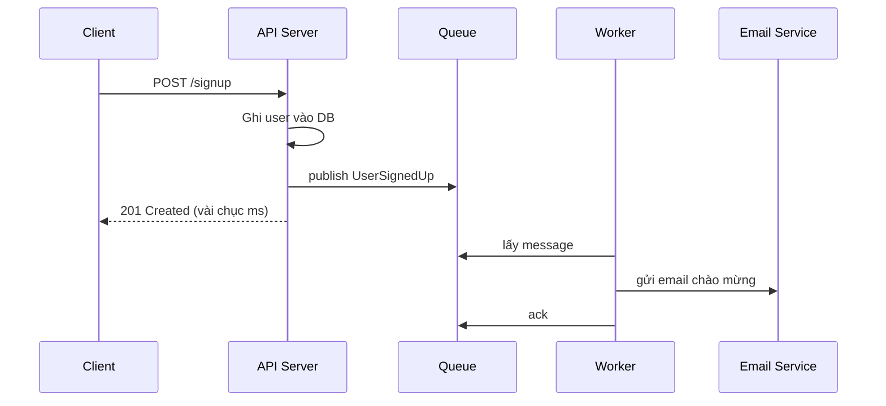
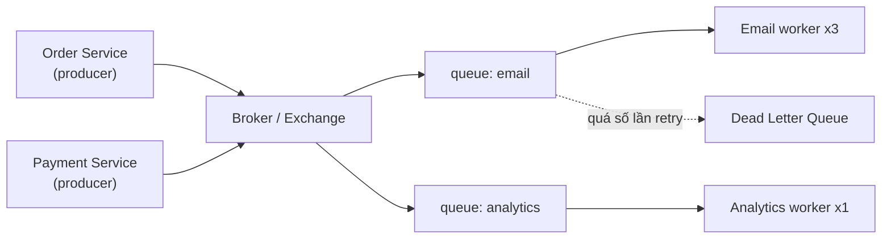
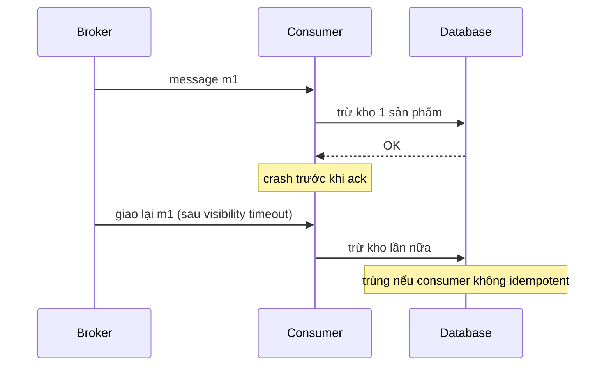
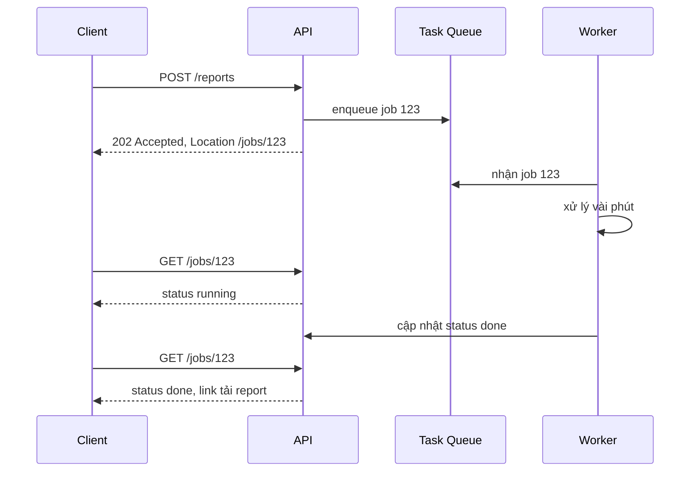
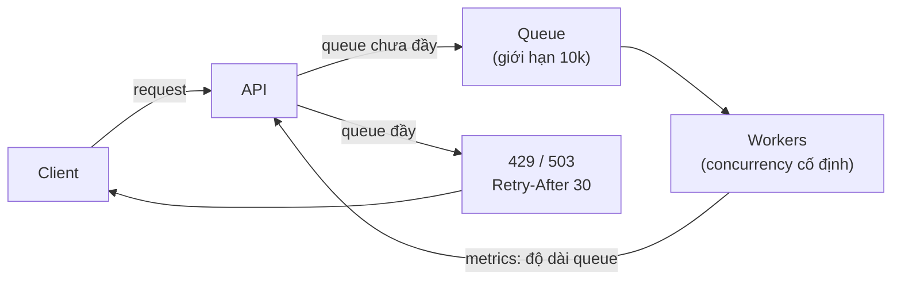

# Asynchronism: Message Queue, Task Queue & Back Pressure

**Asynchronism** (xử lý bất đồng bộ) là cách tách một việc tốn thời gian ra khỏi luồng request -- response: server nhận yêu cầu, **ghi nhận** nó (thường đẩy vào một hàng đợi), trả lời ngay cho client, rồi để **worker** chạy nền xử lý sau. Ba công cụ chính của mảng này là **Message Queue** (hàng đợi thông điệp giữa các service), **Task Queue** (hàng đợi công việc cho worker) và **Back Pressure** (cơ chế "phanh" khi hàng đợi đầy để hệ thống không chết vì quá tải).

**Tương tự đơn giản:** Quán trà sữa đông khách. Nếu thu ngân vừa nhận order vừa tự pha thì hàng người xếp dài và ai cũng phải đứng chờ. Quán thông minh sẽ để thu ngân **nhận order, in phiếu** (đẩy vào queue), đưa khách số thứ tự (trả response ngay), còn nhân viên pha chế (worker) lấy phiếu ra làm lần lượt. Khi phiếu dồn quá nhiều, quán treo biển **"tạm ngưng nhận order 10 phút"** -- đó chính là back pressure.

---

:::note[Ghi nhớ nhanh]

- ⭐ **Queue tách producer khỏi consumer** — giảm latency phía người dùng, hấp thụ đột biến tải (traffic spike), cho phép scale worker độc lập.
- ⭐ **Back pressure: queue phải có giới hạn** — queue vô hạn chỉ dời điểm chết; khi đầy thì từ chối sớm bằng `429`/`503` + `Retry-After`, client lùi lại bằng exponential backoff + jitter.
- **Delivery semantics:** at-most-once (có thể mất), at-least-once (có thể trùng -- phổ biến nhất), exactly-once (đắt, thường chỉ "hiệu quả exactly-once" nhờ idempotency).
- **Message queue vs log:** RabbitMQ/SQS xoá message khi đã ack; Kafka giữ log theo thời gian, consumer tự quản lý offset và có thể đọc lại.
- **Task queue** (Celery, BullMQ, Sidekiq) = queue + worker + retry + lịch chạy, chuyên cho "công việc" thay vì "sự kiện".
- **Dead Letter Queue (DLQ)** giữ message lỗi quá số lần retry để không chặn cả hàng đợi (poison message).

:::

---

## Mục lục

- [Vì sao cần xử lý bất đồng bộ?](#vì-sao-cần-xử-lý-bất-đồng-bộ)
- [1. Asynchronism là gì?](#1-asynchronism-là-gì)
- [2. Message Queues](#2-message-queues)
- [3. Delivery semantics](#3-delivery-semantics)
- [4. Dead Letter Queue](#4-dead-letter-queue)
- [5. Task Queues](#5-task-queues)
- [6. Back Pressure](#6-back-pressure)
- [7. Exponential backoff và jitter](#7-exponential-backoff-và-jitter)
- [Khi nào dùng?](#khi-nào-dùng)
- [Lỗi thường gặp](#lỗi-thường-gặp)
- [Câu hỏi phỏng vấn](#câu-hỏi-phỏng-vấn)

---

## Vì sao cần xử lý bất đồng bộ?

**Vấn đề:** Một request đăng ký tài khoản có thể kéo theo: ghi DB, gửi email chào mừng, resize avatar, đồng bộ CRM, bắn event analytics. Nếu làm hết **đồng bộ** trong request thì: (1) user chờ vài giây; (2) chỉ cần dịch vụ email chậm là toàn bộ API chậm theo; (3) khi traffic tăng đột biến (flash sale, chiến dịch marketing), server bị dồn request và sập dây chuyền.

**Giải pháp:** Chỉ làm **phần bắt buộc** trong request (ghi DB), phần còn lại đẩy vào **queue** để worker xử lý nền. Queue đóng vai **bộ đệm** giữa nơi sinh việc và nơi làm việc: producer chạy nhanh bao nhiêu cũng được, consumer xử lý theo sức mình. Kèm theo đó là **back pressure** để khi bộ đệm đầy thì hệ thống chủ động từ chối thay vì sập.

:::tip[Dùng thực tế]

- **Gửi email/SMS/push notification:** hầu hết SaaS đẩy việc gửi sang worker (Sidekiq ở các app Rails như GitHub, Shopify; Celery ở nhiều app Django).
- **Xử lý media:** YouTube, Instagram nhận file upload rồi đưa vào pipeline transcode/resize chạy nền.
- **Event streaming:** LinkedIn tạo ra Kafka để truyền activity event và log giữa hàng trăm hệ thống; Uber, Netflix dùng Kafka làm xương sống dữ liệu.
- **Đặt hàng mùa cao điểm:** sàn thương mại điện tử đưa order vào queue để hấp thụ đỉnh tải của flash sale thay vì bắt DB chịu trực tiếp.

:::

---

## 1. Asynchronism là gì?

Theo system-design-primer, asynchronous workflow giúp **giảm thời gian request** cho những thao tác tốn kém mà lẽ ra phải làm inline. Có hai cách chính:

1. **Làm trước (pre-compute):** những việc tốn thời gian có thể làm sẵn theo lịch -- ví dụ render sẵn trang tĩnh, tổng hợp báo cáo hằng đêm.
2. **Đẩy vào queue:** việc phát sinh theo request thì ghi vào queue và trả lời ngay, worker xử lý sau.



So sánh nhanh:

| Tiêu chí | Đồng bộ (synchronous) | Bất đồng bộ (asynchronous) |
| --- | --- | --- |
| Latency phía user | Tổng thời gian mọi bước | Chỉ phần bắt buộc |
| Phụ thuộc dịch vụ ngoài | Dịch vụ ngoài chậm/lỗi là API chậm/lỗi | Cô lập lỗi, worker retry sau |
| Đột biến tải | Dồn thẳng vào server/DB | Queue hấp thụ, worker xử lý dần |
| Kết quả cho user | Có ngay | Phải polling, webhook, WebSocket, hoặc "sẽ báo sau" |
| Độ phức tạp | Thấp | Cao hơn: retry, trùng lặp, thứ tự, giám sát queue |

:::warning[Đánh đổi]

Bất đồng bộ đổi **latency** lấy **độ phức tạp** và **eventual consistency** (dữ liệu nhất quán sau một khoảng trễ). Với những thao tác rẻ hoặc cần kết quả ngay (kiểm tra số dư trước khi chuyển tiền), làm đồng bộ vẫn đúng hơn. Primer cũng nhắc: thêm queue cho tác vụ nhỏ có thể làm hệ thống **chậm hơn** vì thêm overhead mạng và độ trễ hàng đợi.

:::

---

## 2. Message Queues

**Message queue** nhận, giữ và phân phối message giữa **producer** (bên gửi) và **consumer** (bên nhận). Luồng điển hình: producer publish message, broker lưu lại, consumer lấy ra xử lý rồi gửi **ack** (acknowledgement -- xác nhận đã xong) để broker xoá.



Hai mô hình phân phối:

- **Point-to-point (work queue):** mỗi message chỉ do **một** consumer xử lý -- dùng để chia việc cho nhiều worker (competing consumers).
- **Publish/Subscribe (pub/sub):** một message được **sao chép** tới mọi subscriber -- dùng khi nhiều hệ thống cùng quan tâm một sự kiện.

### 2.1. RabbitMQ

- Broker theo chuẩn **AMQP 0-9-1**. Producer gửi vào **exchange**, exchange route sang **queue** theo binding (`direct`, `topic`, `fanout`, `headers`).
- Mạnh ở **routing linh hoạt**, priority queue, TTL, DLX (dead letter exchange), ack từng message.
- Message bị xoá sau khi ack -- không phù hợp để "đọc lại lịch sử".
- `prefetch` (QoS) giới hạn số message chưa ack mỗi consumer giữ -- chính là một dạng back pressure phía consumer.

### 2.2. Apache Kafka

- Không hẳn là "queue" mà là **distributed commit log**: message được **append** vào **partition** của **topic**, giữ lại theo thời gian (retention, ví dụ 7 ngày) dù đã đọc hay chưa.
- Consumer tự quản lý **offset** (vị trí đã đọc); nhiều **consumer group** đọc độc lập cùng một topic; có thể **replay** (đọc lại) bằng cách lùi offset.
- **Thứ tự chỉ đảm bảo trong một partition** -- chọn partition key (ví dụ `orderId`) để các event của cùng một đối tượng đi đúng thứ tự.
- Throughput rất cao nhờ ghi tuần tự và batch; phù hợp event streaming, log aggregation, CDC.

### 2.3. Amazon SQS

- Queue **managed** của AWS, không phải vận hành broker.
- **Standard queue:** throughput gần như không giới hạn, **at-least-once**, thứ tự best-effort (có thể đảo, có thể trùng).
- **FIFO queue:** giữ thứ tự theo `MessageGroupId`, có **deduplication** trong cửa sổ 5 phút, throughput thấp hơn standard.
- **Visibility timeout:** khi consumer nhận message, message bị "ẩn" trong một khoảng; nếu consumer không xoá kịp (crash, xử lý quá lâu) thì message hiện lại cho consumer khác -- đây là nguồn gốc của trùng lặp.
- Tích hợp sẵn **DLQ** qua `redrive policy` (`maxReceiveCount`).

| | RabbitMQ | Kafka | SQS |
| --- | --- | --- | --- |
| Mô hình | Broker + queue | Distributed log | Managed queue |
| Lưu sau khi đọc | Không (xoá khi ack) | Có (theo retention) | Không (xoá khi delete) |
| Replay | Không | Có (lùi offset) | Không |
| Thứ tự | Theo queue (1 consumer) | Theo partition | FIFO queue theo group |
| Routing | Rất linh hoạt (exchange) | Theo topic/partition | Đơn giản (kết hợp SNS để fan-out) |
| Vận hành | Tự host hoặc managed | Nặng (hoặc MSK, Confluent) | Không cần |
| Hợp với | Work queue, routing phức tạp | Event streaming, analytics, CDC | Tách service trên AWS nhanh gọn |

Ví dụ publish/consume với RabbitMQ (thư viện `amqplib`):

```ts
import amqp from 'amqplib';

const QUEUE = 'email';

export async function publishEmail(payload: { userId: string; template: string }) {
  const conn = await amqp.connect(process.env.AMQP_URL as string);
  const ch = await conn.createConfirmChannel(); // confirm: broker xác nhận đã nhận
  await ch.assertQueue(QUEUE, {
    durable: true, // queue sống sót khi broker restart
    arguments: { 'x-dead-letter-exchange': 'dlx', 'x-max-length': 100_000 },
  });
  ch.sendToQueue(QUEUE, Buffer.from(JSON.stringify(payload)), { persistent: true });
  await ch.waitForConfirms();
  await conn.close();
}

export async function startEmailWorker(send: (p: unknown) => Promise<void>) {
  const conn = await amqp.connect(process.env.AMQP_URL as string);
  const ch = await conn.createChannel();
  await ch.prefetch(10); // tối đa 10 message chưa ack mỗi worker
  await ch.consume(QUEUE, async (msg) => {
    if (!msg) return;
    try {
      await send(JSON.parse(msg.content.toString()));
      ch.ack(msg); // ack SAU khi xử lý xong -> at-least-once
    } catch (err) {
      ch.nack(msg, false, false); // không requeue -> chuyển sang DLX
    }
  });
}
```

---

## 3. Delivery semantics

Mạng có thể rớt bất kỳ lúc nào: message gửi đi rồi nhưng ack không về, consumer xử lý xong nhưng crash trước khi ack... Vì vậy mỗi hệ thống queue phải chọn một **delivery semantics** (cam kết giao nhận):

| Semantics | Ý nghĩa | Cách đạt được | Rủi ro | Dùng cho |
| --- | --- | --- | --- | --- |
| **At-most-once** | Giao tối đa 1 lần | Ack/commit offset **trước** khi xử lý, không retry | **Mất** message | Metrics, log ít quan trọng |
| **At-least-once** | Giao ít nhất 1 lần | Ack **sau** khi xử lý, retry khi lỗi | **Trùng** message | Mặc định cho hầu hết nghiệp vụ |
| **Exactly-once** | Đúng 1 lần | Transaction + dedupe/idempotency | Đắt, giới hạn phạm vi | Thanh toán, số dư, tồn kho |



**Exactly-once thật sự** giữa hai hệ thống độc lập qua mạng là rất khó. Kafka hỗ trợ exactly-once **trong phạm vi Kafka** (idempotent producer + transactions, đọc-xử lý-ghi từ topic sang topic). Còn khi side effect đi ra ngoài (gửi email, gọi API thanh toán), cách thực tế là: **at-least-once + consumer idempotent** = "effectively exactly-once". Chủ đề này được đào sâu ở bài Idempotent Operations.

:::info[Thứ tự message]

Ngoài "bao nhiêu lần", còn câu hỏi "theo thứ tự nào". Hầu hết queue chỉ đảm bảo thứ tự trong phạm vi hẹp (một partition Kafka, một message group SQS FIFO, một queue RabbitMQ có một consumer). Khi scale nhiều consumer song song, thứ tự toàn cục mất đi -- hãy thiết kế để không cần thứ tự toàn cục, hoặc partition theo khoá nghiệp vụ.

:::

---

## 4. Dead Letter Queue

**Dead Letter Queue (DLQ)** là hàng đợi riêng chứa những message **không thể xử lý** sau một số lần thử (ví dụ JSON sai định dạng, tham chiếu tới bản ghi đã bị xoá, bug trong consumer). Nếu không có DLQ, một **poison message** (message độc) sẽ bị retry mãi, chiếm worker, và với queue có thứ tự thì chặn luôn các message phía sau.

Thực hành tốt:

- Đặt `maxReceiveCount`/số lần retry hợp lý (3--5) trước khi chuyển sang DLQ.
- **Giám sát và alert** độ dài DLQ -- DLQ mà không ai nhìn thì chỉ là thùng rác.
- Lưu kèm **lý do lỗi**, stack trace, số lần thử vào header/metadata.
- Có công cụ **redrive** (đẩy lại vào queue chính) sau khi sửa bug.
- Phân biệt **lỗi tạm thời** (timeout, 503 -- nên retry) và **lỗi vĩnh viễn** (400, validation fail -- đưa thẳng vào DLQ, retry vô ích).

```yaml
# SQS: queue chính trỏ tới DLQ sau 5 lần nhận thất bại
Resources:
  OrdersDLQ:
    Type: AWS::SQS::Queue
    Properties:
      MessageRetentionPeriod: 1209600 # 14 ngày
  OrdersQueue:
    Type: AWS::SQS::Queue
    Properties:
      VisibilityTimeout: 60
      RedrivePolicy:
        deadLetterTargetArn: !GetAtt OrdersDLQ.Arn
        maxReceiveCount: 5
```

---

## 5. Task Queues

**Task queue** nhận **công việc** (task) kèm dữ liệu, chạy chúng trên worker và (tuỳ chọn) trả kết quả. Nó thường xây trên một message broker (Redis, RabbitMQ, SQS) nhưng bổ sung các tính năng "việc làm": retry có backoff, lịch chạy (delay, cron), ưu tiên, giới hạn tốc độ, theo dõi trạng thái, kết quả.

| Thư viện | Ngôn ngữ | Broker | Điểm nổi bật |
| --- | --- | --- | --- |
| **Celery** | Python | RabbitMQ, Redis, SQS | Chuẩn de facto của Python, `celery beat` chạy lịch, chain/group/chord |
| **BullMQ** | Node.js | Redis | Delay, priority, rate limit, repeatable job, flow (cha--con) |
| **Sidekiq** | Ruby | Redis | Đa luồng, rất nhanh, phổ biến ở Rails |
| **Temporal** | Đa ngôn ngữ | Server riêng | Durable workflow nhiều bước, chạy hàng ngày/tuần |

Message queue và task queue khác nhau ở **ngữ nghĩa**: message queue truyền **sự kiện** ("đơn hàng đã tạo" -- nhiều bên có thể quan tâm); task queue truyền **mệnh lệnh** ("hãy gửi email cho user 42" -- đúng một worker thực hiện).

Ví dụ BullMQ với retry backoff, giới hạn tốc độ và concurrency:

```ts
import { Queue, Worker } from 'bullmq';

const connection = { host: process.env.REDIS_HOST, port: 6379 };

export const imageQueue = new Queue('resize-image', {
  connection,
  defaultJobOptions: {
    attempts: 5,
    backoff: { type: 'exponential', delay: 1_000 }, // 1s, 2s, 4s, 8s...
    removeOnComplete: 1_000, // chỉ giữ 1000 job xong gần nhất
    removeOnFail: 5_000,
  },
});

// Producer: API chỉ enqueue rồi trả 202 Accepted
export async function enqueueResize(imageId: string) {
  return imageQueue.add('resize', { imageId }, { jobId: `resize:${imageId}` }); // jobId chống trùng
}

// Worker: tối đa 5 job song song, không quá 100 job mỗi giây
new Worker(
  'resize-image',
  async (job) => {
    await job.updateProgress(10);
    // ... tải ảnh, resize, upload lên S3
    return { ok: true };
  },
  { connection, concurrency: 5, limiter: { max: 100, duration: 1_000 } },
);
```

Mô hình HTTP cho tác vụ lâu: API trả **`202 Accepted`** kèm URL trạng thái, client polling hoặc nhận webhook khi xong.



---

## 6. Back Pressure

Queue hấp thụ được đột biến **ngắn hạn**. Nhưng nếu tốc độ sinh việc **liên tục** lớn hơn tốc độ xử lý, queue sẽ phình mãi: bộ nhớ broker cạn, message nằm chờ hàng giờ (khi tới lượt thì kết quả đã vô nghĩa), và cuối cùng broker sập. Primer nói rõ: *"If queues start to grow significantly, the queue size can become larger than memory, resulting in cache misses, disk reads, and even slower performance."*

**Back pressure** (áp lực ngược) là cơ chế để consumer/hệ thống phía sau **báo ngược lên** phía trước rằng "tôi không kham nổi, chậm lại". Các kỹ thuật:

1. **Giới hạn kích thước queue (bounded queue):** quá ngưỡng thì từ chối thêm message (RabbitMQ `x-max-length` + `overflow: reject-publish`).
2. **Trả lỗi sớm cho client:** API kiểm tra độ dài queue/độ bận, nếu quá tải trả **`429 Too Many Requests`** (client gửi quá nhiều) hoặc **`503 Service Unavailable`** (server đang quá tải) kèm header **`Retry-After`**.
3. **Giới hạn đồng thời phía consumer:** `prefetch`, `concurrency` -- consumer chỉ kéo bao nhiêu việc nó kham nổi (mô hình **pull** tự nhiên có back pressure tốt hơn **push**).
4. **Load shedding:** chủ động bỏ bớt việc ít quan trọng (analytics, recommendation) để giữ việc quan trọng (checkout).
5. **Stream back pressure:** trong code, Node.js stream có `highWaterMark` và tín hiệu `write()` trả `false`; Reactive Streams có `request(n)`.



Ví dụ middleware Express từ chối khi queue quá dài:

```ts
import type { Request, Response, NextFunction } from 'express';
import { imageQueue } from './queues';

const MAX_WAITING = 10_000;
const RETRY_AFTER_SECONDS = 30;

export async function backPressureGuard(_req: Request, res: Response, next: NextFunction) {
  const waiting = await imageQueue.getWaitingCount();
  if (waiting >= MAX_WAITING) {
    res.setHeader('Retry-After', String(RETRY_AFTER_SECONDS));
    return res.status(503).json({ error: 'Hệ thống đang quá tải, vui lòng thử lại sau' });
  }
  return next();
}
```

Hai điểm cần nhớ:

- **Little's Law:** số việc trong hệ thống = tốc độ đến x thời gian trong hệ thống (L = λW). Ví dụ 500 job/giây đến, mỗi job ở hệ thống trung bình 2 giây thì có khoảng 1000 job đang "lơ lửng". Nếu muốn job không chờ quá 60 giây với tốc độ xử lý 500 job/giây, queue không nên dài quá khoảng 30.000 -- đó là căn cứ đặt giới hạn.
- **Từ chối sớm tốt hơn nhận rồi bỏ:** request bị 503 ngay trong vài ms giúp client chủ động retry/hiển thị thông báo; request nằm trong queue 10 phút rồi timeout là lãng phí tài nguyên cả hai phía.

---

## 7. Exponential backoff và jitter

Khi nhận `429`/`503` hoặc lỗi tạm thời, client không nên retry ngay lập tức (sẽ dồn thêm tải vào hệ thống đang quá tải). **Exponential backoff** tăng thời gian chờ theo cấp số nhân: 1s, 2s, 4s, 8s... đến một mức trần. **Jitter** (độ nhiễu ngẫu nhiên) làm cho các client không retry cùng một thời điểm -- nếu không, hàng nghìn client sẽ cùng retry theo từng "đợt sóng" (thundering herd). Bài "Exponential Backoff And Jitter" của AWS Architecture Blog khuyến nghị **full jitter**: chờ một khoảng ngẫu nhiên từ 0 tới giá trị backoff.

```ts
const BASE_MS = 200;
const CAP_MS = 20_000;
const MAX_ATTEMPTS = 6;

function sleep(ms: number) {
  return new Promise((resolve) => setTimeout(resolve, ms));
}

function isRetryable(status: number) {
  return status === 429 || status === 502 || status === 503 || status === 504;
}

export async function fetchWithBackoff(url: string, init?: RequestInit): Promise<Response> {
  for (let attempt = 0; attempt < MAX_ATTEMPTS; attempt += 1) {
    const res = await fetch(url, init);
    if (!isRetryable(res.status)) return res;

    // Ưu tiên Retry-After nếu server gửi về
    const retryAfter = Number(res.headers.get('Retry-After'));
    const backoff = Math.min(CAP_MS, BASE_MS * 2 ** attempt);
    const wait = Number.isFinite(retryAfter) && retryAfter > 0 ? retryAfter * 1_000 : Math.random() * backoff; // full jitter
    await sleep(wait);
  }
  throw new Error(`Hết số lần thử khi gọi ${url}`);
}
```

| Chiến lược | Thời gian chờ | Nhận xét |
| --- | --- | --- |
| Retry ngay | 0 | Tệ nhất -- nhân tải lên hệ thống đang yếu |
| Fixed delay | Cố định, ví dụ 1s | Các client đồng bộ nhau thành từng đợt |
| Exponential | base x 2^n | Giảm tải nhanh, nhưng vẫn có đợt sóng |
| Exponential + full jitter | random(0, base x 2^n) | Trải đều, khuyến nghị mặc định |

Nhớ kết hợp với **giới hạn số lần retry**, **timeout** tổng và **circuit breaker** -- retry vô tội vạ dẫn tới antipattern **Retry Storm** (xem bài Performance Antipatterns phần 2).

---

## Khi nào dùng?

| Tình huống | Nên dùng | Ghi chú |
| --- | --- | --- |
| Gửi email, push, SMS sau một hành động | Task queue | Retry khi nhà cung cấp lỗi |
| Xử lý ảnh/video, xuất báo cáo lớn | Task queue + `202 Accepted` | Cho user xem tiến độ |
| Nhiều service cùng phản ứng một sự kiện | Pub/sub (Kafka, SNS + SQS, RabbitMQ fanout) | Producer không cần biết consumer |
| Cần đọc lại lịch sử event, CDC, analytics | Kafka | Retention + replay |
| Hấp thụ traffic spike ngắn | Queue có giới hạn + back pressure | Đo Little's Law để đặt giới hạn |
| Thao tác rẻ, cần kết quả ngay | **Không** dùng queue | Thêm queue chỉ thêm latency |
| Luồng nhiều bước dài, cần bù trừ (saga) | Workflow engine (Temporal, Step Functions) | Task queue đơn thuần khó quản lý trạng thái |

---

## Lỗi thường gặp

### Lỗi 1: Queue không giới hạn

Để queue phình vô hạn "cho an toàn". Kết quả: broker hết RAM, ghi ra đĩa, chậm thêm, cuối cùng sập và mất luôn message. **Sửa:** đặt giới hạn độ dài/tuổi message, alert theo độ dài queue và **consumer lag**, từ chối sớm bằng 429/503.

### Lỗi 2: Ack trước khi xử lý

Consumer ack ngay khi nhận rồi mới xử lý, crash giữa chừng là mất việc (vô tình chọn at-most-once). **Sửa:** ack sau khi xử lý xong và đảm bảo consumer **idempotent** để chịu được giao lại.

### Lỗi 3: Không có DLQ

Một message lỗi định dạng bị retry vĩnh viễn, chiếm hết worker. **Sửa:** cấu hình DLQ + số lần retry tối đa, phân loại lỗi tạm thời/vĩnh viễn, giám sát DLQ.

### Lỗi 4: Retry không backoff

Worker retry ngay khi API đối tác trả 503, tạo vòng lặp dội tải. **Sửa:** exponential backoff + jitter, tôn trọng `Retry-After`, giới hạn số lần thử.

### Lỗi 5: Gửi message ngoài transaction DB

Ghi đơn hàng vào DB thành công nhưng publish event lỗi (hoặc ngược lại) -- hai hệ thống lệch nhau. **Sửa:** dùng **Transactional Outbox**: ghi event vào bảng `outbox` trong **cùng transaction** với dữ liệu nghiệp vụ, một tiến trình riêng (hoặc CDC như Debezium) đọc bảng outbox và publish.

### Lỗi 6: Visibility timeout ngắn hơn thời gian xử lý

Với SQS, nếu job chạy 2 phút mà visibility timeout là 30 giây, message hiện lại và bị worker khác xử lý song song. **Sửa:** đặt timeout lớn hơn thời gian xử lý tối đa, hoặc gia hạn (`ChangeMessageVisibility`) trong lúc chạy.

---

## Câu hỏi phỏng vấn

**1. Vì sao dùng message queue? Đánh đổi là gì?**

<details className="qa">
<summary>Xem đáp án</summary>

Lợi ích: tách producer/consumer (decoupling), giảm latency phía user, hấp thụ đột biến tải, scale worker độc lập, cô lập lỗi của dịch vụ phía sau, retry dễ dàng. Đánh đổi: thêm một thành phần phải vận hành và giám sát; eventual consistency; phải xử lý trùng lặp, thứ tự, poison message; debug khó hơn vì luồng bị cắt rời (cần tracing có correlation id).

</details>

**2. Phân biệt at-most-once, at-least-once, exactly-once. Bạn chọn cái nào cho hệ thống thanh toán?**

<details className="qa">
<summary>Xem đáp án</summary>

At-most-once: ack trước khi xử lý, có thể mất. At-least-once: ack sau khi xử lý, có thể trùng. Exactly-once: không mất không trùng, rất khó đạt end-to-end qua mạng. Với thanh toán: dùng **at-least-once** + consumer **idempotent** (idempotency key, unique constraint, bảng processed_messages) để đạt "effectively exactly-once". Kafka transactions chỉ cho exactly-once trong phạm vi Kafka.

</details>

**3. Kafka khác RabbitMQ thế nào?**

<details className="qa">
<summary>Xem đáp án</summary>

RabbitMQ là broker truyền thống: exchange route vào queue, message bị xoá khi ack, routing linh hoạt, phù hợp work queue. Kafka là distributed log: message giữ theo retention, consumer tự giữ offset, có thể replay, nhiều consumer group đọc độc lập, thứ tự trong partition, throughput rất cao -- phù hợp event streaming, CDC, analytics. Chọn RabbitMQ cho task/routing phức tạp; Kafka khi cần lưu lịch sử và nhiều hệ thống cùng tiêu thụ.

</details>

**4. Back pressure là gì? Hãy thiết kế cách xử lý khi queue tăng nhanh hơn tốc độ xử lý.**

<details className="qa">
<summary>Xem đáp án</summary>

Back pressure là cơ chế để phía sau báo ngược lên phía trước giảm tốc. Thiết kế: (1) queue có giới hạn dựa trên Little's Law và SLA chờ tối đa; (2) API trả 429/503 + `Retry-After` khi vượt ngưỡng; (3) consumer dùng pull với prefetch/concurrency cố định; (4) autoscale worker theo độ dài queue/consumer lag; (5) load shedding việc ít quan trọng; (6) client retry bằng exponential backoff + jitter.

</details>

**5. Task queue khác message queue ở điểm nào?**

<details className="qa">
<summary>Xem đáp án</summary>

Message queue là hạ tầng truyền message (thường là sự kiện, có thể nhiều consumer). Task queue (Celery, BullMQ, Sidekiq) xây trên broker, truyền **mệnh lệnh** cho đúng một worker, kèm tính năng: retry backoff, delay/cron, priority, rate limit, theo dõi trạng thái và kết quả job.

</details>

**6. Làm sao đảm bảo ghi DB và publish event cùng thành công?**

<details className="qa">
<summary>Xem đáp án</summary>

Không dùng two-phase commit giữa DB và broker (chậm, broker thường không hỗ trợ). Dùng **Transactional Outbox**: trong cùng transaction, ghi dữ liệu nghiệp vụ và một bản ghi vào bảng `outbox`. Relay process (polling hoặc CDC qua Debezium) đọc outbox và publish, đánh dấu đã gửi. Có thể publish trùng nên consumer phải idempotent.

</details>
