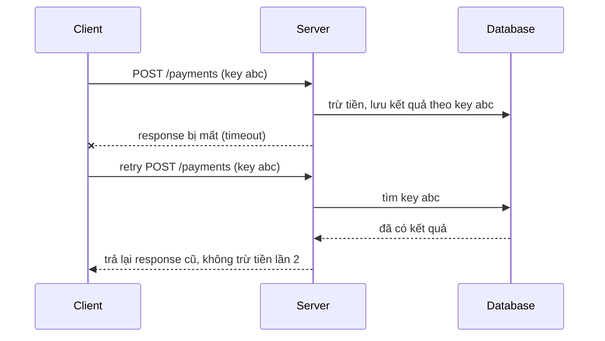
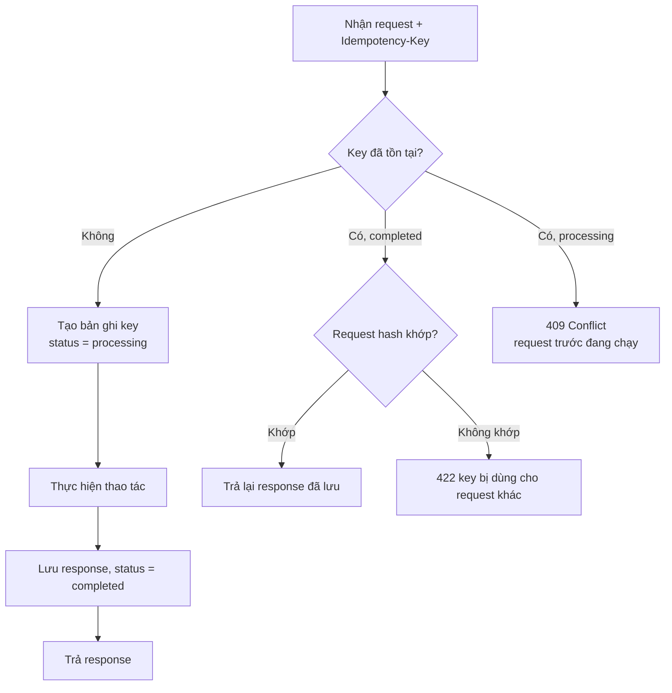
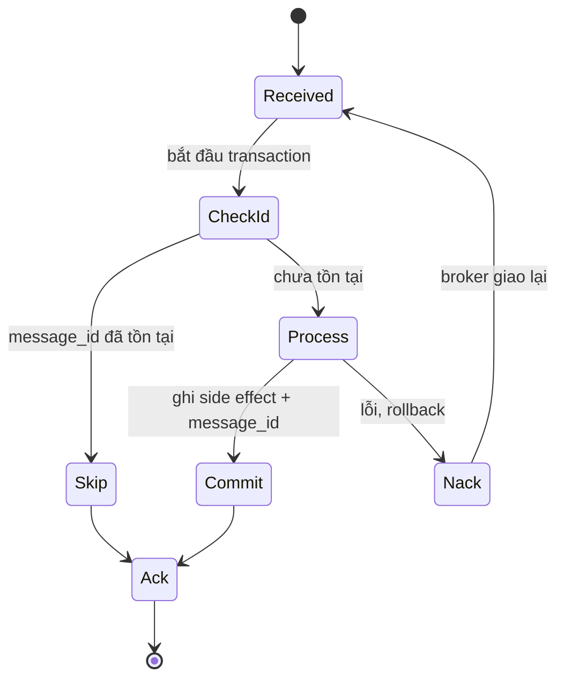
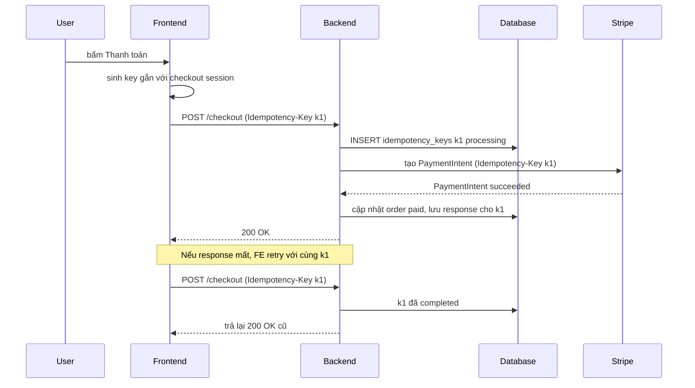

# Idempotent Operations

Một thao tác **idempotent** (lũy đẳng) là thao tác mà **thực hiện một lần hay nhiều lần đều cho cùng một kết quả** trên hệ thống. Trong hệ phân tán -- nơi mạng chập chờn, client retry, queue giao lại message -- idempotency là điều kiện để **retry an toàn**: request có bị gửi lặp bao nhiêu lần thì tiền cũng chỉ bị trừ một lần, đơn hàng chỉ được tạo một lần.

**Tương tự đơn giản:** Nút gọi thang máy là idempotent -- bấm 1 lần hay bấm 10 lần thì thang cũng chỉ đến một lần. Còn máy bán nước tự động **không** idempotent: bấm "mua" 3 lần là rơi ra 3 lon và bị trừ 3 lần tiền. Mục tiêu của thiết kế idempotent là biến mọi "máy bán nước" quan trọng thành "nút thang máy".

---

:::note[Ghi nhớ nhanh]

- ⭐ **Retry chỉ an toàn khi thao tác idempotent** — mạng không cho bạn biết request "lỗi" thật sự đã chạy hay chưa, nên client sẽ retry; server phải chịu được.
- ⭐ **Idempotency key** — client sinh một ID duy nhất cho mỗi ý định (ví dụ UUID), server lưu kết quả theo key và trả lại kết quả cũ khi gặp lại key đó (Stripe dùng header `Idempotency-Key`).
- **HTTP:** `GET`, `HEAD`, `PUT`, `DELETE`, `OPTIONS` idempotent theo định nghĩa (RFC 9110); `POST` và `PATCH` thì không mặc định.
- **Consumer queue phải dedupe** — at-least-once nghĩa là message sẽ trùng; lưu `message_id` đã xử lý trong cùng transaction với side effect.
- **Unique constraint trong DB là chốt chặn cuối** — kiểm tra rồi ghi (check-then-insert) bị race; để DB từ chối bản ghi trùng.
- Idempotent khác **safe**: safe là không thay đổi trạng thái (GET); idempotent là thay đổi nhưng lặp lại không thay đổi thêm (PUT, DELETE).

:::

---

## Mục lục

- [Vì sao cần Idempotent Operations?](#vì-sao-cần-idempotent-operations)
- [1. Idempotency là gì?](#1-idempotency-là-gì)
- [2. HTTP method nào idempotent?](#2-http-method-nào-idempotent)
- [3. Idempotency key](#3-idempotency-key)
- [4. Cài đặt idempotency key với TypeScript và SQL](#4-cài-đặt-idempotency-key-với-typescript-và-sql)
- [5. Dedupe phía consumer của queue](#5-dedupe-phía-consumer-của-queue)
- [6. Các kỹ thuật biến thao tác thành idempotent](#6-các-kỹ-thuật-biến-thao-tác-thành-idempotent)
- [7. Ví dụ thực tế: thanh toán kiểu Stripe](#7-ví-dụ-thực-tế-thanh-toán-kiểu-stripe)
- [Khi nào dùng?](#khi-nào-dùng)
- [Lỗi thường gặp](#lỗi-thường-gặp)
- [Câu hỏi phỏng vấn](#câu-hỏi-phỏng-vấn)

---

## Vì sao cần Idempotent Operations?

**Vấn đề:** Client gọi `POST /payments` để trừ 500.000đ. Request tới server, server trừ tiền thành công, nhưng response bị **timeout** trên đường về (mạng di động rớt, load balancer cắt kết nối). Client không biết: tiền đã trừ chưa? Nếu **không retry** thì có thể đơn chưa được thanh toán; nếu **retry** thì có thể trừ tiền hai lần. Tương tự, message queue at-least-once sẽ giao lại message khi consumer crash trước khi ack -- email gửi đôi, kho trừ đôi.

**Giải pháp:** Thiết kế mọi thao tác có side effect quan trọng sao cho **lặp lại không gây thêm hiệu ứng**. Khi đó, chiến lược đơn giản nhất -- "lỗi thì cứ retry" -- trở nên an toàn, và hệ thống đạt được hiệu quả "exactly-once" dù hạ tầng chỉ đảm bảo at-least-once.

:::tip[Dùng thực tế]

- **Stripe API:** mọi request `POST` nhận header `Idempotency-Key`; Stripe lưu kết quả (cả mã lỗi) và trả lại y nguyên khi gặp lại key, key được giữ ít nhất 24 giờ.
- **AWS:** nhiều API có tham số `ClientToken` (EC2 `RunInstances`) để tránh tạo trùng tài nguyên khi retry; SQS FIFO có `MessageDeduplicationId`.
- **Kafka:** idempotent producer (`enable.idempotence=true`) dùng producer id + sequence number để broker loại bỏ bản ghi trùng do retry.
- **Ví điện tử, ngân hàng:** mỗi giao dịch có mã tham chiếu duy nhất; hệ thống đối soát từ chối mã đã xử lý.

:::

---

## 1. Idempotency là gì?

Về toán học, hàm `f` idempotent khi `f(f(x)) = f(x)`. Trong hệ thống, ta quan tâm **trạng thái sau khi thực hiện**:

| Thao tác | Idempotent? | Lý do |
| --- | --- | --- |
| `SET balance = 100` | Có | Lặp lại vẫn là 100 |
| `balance = balance - 50` | **Không** | Mỗi lần trừ thêm 50 |
| `DELETE FROM carts WHERE id = 7` | Có | Lần 2 không còn gì để xoá |
| `INSERT INTO orders (...)` | **Không** | Mỗi lần thêm một dòng |
| `INSERT ... ON CONFLICT (order_code) DO NOTHING` | Có | Dòng trùng bị bỏ qua |
| Gửi email | **Không** | Mỗi lần gửi thêm một email |
| Đánh dấu email đã đọc | Có | Đã đọc thì vẫn là đã đọc |

Lưu ý: idempotent nói về **trạng thái** chứ không bắt buộc **response** giống nhau. `DELETE /carts/7` lần đầu trả `204`, lần hai có thể trả `404` -- vẫn idempotent vì trạng thái server không đổi thêm. Tuy vậy, với API thanh toán, trả lại **đúng response cũ** giúp client xử lý đơn giản hơn nhiều.



---

## 2. HTTP method nào idempotent?

Theo RFC 9110 (HTTP Semantics):

| Method | Safe | Idempotent | Ghi chú |
| --- | --- | --- | --- |
| `GET` | Có | Có | Chỉ đọc |
| `HEAD` | Có | Có | Như GET nhưng không body |
| `OPTIONS` | Có | Có | Hỏi khả năng của resource |
| `PUT` | Không | Có | **Thay thế toàn bộ** resource bằng nội dung gửi lên |
| `DELETE` | Không | Có | Xoá rồi thì xoá nữa vẫn là đã xoá |
| `POST` | Không | **Không** | Tạo mới / hành động -- mỗi lần có thể tạo thêm |
| `PATCH` | Không | **Không** (mặc định) | Tuỳ nội dung: `set name = X` thì idempotent, `increment counter` thì không |

- **Safe** = không thay đổi trạng thái server. Mọi method safe đều idempotent, nhưng không ngược lại.
- Proxy, trình duyệt và thư viện HTTP **tự động retry** method idempotent khi kết nối lỗi; với `POST` thì không (trình duyệt hỏi "Gửi lại form?").
- Idempotent theo **ngữ nghĩa** chứ không tự động: nếu bạn cài `PUT /counter` thành "tăng 1" thì bạn đã phá hợp đồng HTTP.

Mẹo thiết kế: thay vì `POST /orders` (server sinh id), có thể cho client sinh id và dùng `PUT /orders/{id}` -- lặp lại chỉ ghi đè cùng một đơn. Cách phổ biến hơn là giữ `POST` và thêm **idempotency key**.

---

## 3. Idempotency key

**Idempotency key** là một chuỗi duy nhất (thường UUID v4) do **client** sinh ra cho **mỗi ý định** thực hiện thao tác (ví dụ mỗi lần user bấm "Thanh toán" cho một giỏ hàng), và gửi kèm mọi lần retry của ý định đó.

Luồng xử lý phía server:



Các quyết định thiết kế quan trọng:

- **Phạm vi key:** gắn với user/tài khoản (`(merchant_id, key)`) để key của người này không đụng người kia.
- **Thời gian sống (TTL):** đủ dài để bao phủ mọi lần retry (Stripe: tối thiểu 24 giờ), sau đó dọn dẹp.
- **Lưu fingerprint của request** (hash body): nếu cùng key mà body khác -- client có bug -- trả lỗi thay vì âm thầm trả kết quả cũ.
- **Trạng thái processing:** hai request cùng key đến **đồng thời** -- request sau nên nhận `409 Conflict` (hoặc chờ) chứ không được chạy song song.
- **Lưu cả kết quả lỗi nghiệp vụ** (thẻ bị từ chối) để retry trả đúng lỗi đó; nhưng lỗi **tạm thời** phía server (500 do DB timeout trước khi làm gì) thì nên cho phép thử lại.
- **Atomic:** ghi key, thực hiện thao tác, lưu kết quả nên nằm trong **một transaction DB** khi thao tác là ghi DB cục bộ.

---

## 4. Cài đặt idempotency key với TypeScript và SQL

Bảng lưu key, dùng **unique constraint** để DB tự chặn race:

```sql
CREATE TABLE idempotency_keys (
  account_id     BIGINT       NOT NULL,
  idem_key       VARCHAR(255) NOT NULL,
  request_hash   CHAR(64)     NOT NULL,          -- SHA-256 của body
  status         VARCHAR(20)  NOT NULL,          -- processing | completed
  response_code  INT,
  response_body  JSONB,
  created_at     TIMESTAMPTZ  NOT NULL DEFAULT now(),
  PRIMARY KEY (account_id, idem_key)             -- chốt chặn trùng lặp
);

CREATE INDEX idx_idem_created ON idempotency_keys (created_at); -- để dọn key cũ

-- Dọn key quá 24 giờ (chạy bằng cron)
DELETE FROM idempotency_keys WHERE created_at < now() - INTERVAL '24 hours';
```

Middleware/handler trong Node.js (PostgreSQL qua `pg`):

```ts
import { createHash } from 'node:crypto';
import type { Pool, PoolClient } from 'pg';

type StoredResponse = { code: number; body: unknown };

const hashBody = (body: unknown) => createHash('sha256').update(JSON.stringify(body)).digest('hex');

export class IdempotencyConflictError extends Error {}
export class IdempotencyMismatchError extends Error {}

export async function withIdempotency(
  pool: Pool,
  accountId: string,
  key: string,
  body: unknown,
  operation: (tx: PoolClient) => Promise<StoredResponse>,
): Promise<StoredResponse> {
  const requestHash = hashBody(body);
  const client = await pool.connect();
  try {
    await client.query('BEGIN');

    // 1. Thử "giành" key: chỉ một request thắng nhờ PRIMARY KEY
    const inserted = await client.query(
      `INSERT INTO idempotency_keys (account_id, idem_key, request_hash, status)
       VALUES ($1, $2, $3, 'processing')
       ON CONFLICT (account_id, idem_key) DO NOTHING
       RETURNING idem_key`,
      [accountId, key, requestHash],
    );

    if (inserted.rowCount === 0) {
      // 2. Key đã tồn tại -> đọc trạng thái
      await client.query('ROLLBACK');
      const { rows } = await pool.query(
        'SELECT request_hash, status, response_code, response_body FROM idempotency_keys WHERE account_id = $1 AND idem_key = $2',
        [accountId, key],
      );
      const row = rows[0];
      if (row.request_hash !== requestHash) throw new IdempotencyMismatchError('Key đã dùng cho request khác');
      if (row.status !== 'completed') throw new IdempotencyConflictError('Request trước vẫn đang xử lý');
      return { code: row.response_code, body: row.response_body };
    }

    // 3. Thực hiện thao tác trong CÙNG transaction
    const result = await operation(client);

    await client.query(
      `UPDATE idempotency_keys SET status = 'completed', response_code = $3, response_body = $4
       WHERE account_id = $1 AND idem_key = $2`,
      [accountId, key, result.code, JSON.stringify(result.body)],
    );
    await client.query('COMMIT');
    return result;
  } catch (err) {
    await client.query('ROLLBACK').catch(() => undefined);
    throw err;
  } finally {
    client.release();
  }
}
```

Nhờ nằm chung transaction: nếu thao tác lỗi, bản ghi key cũng bị rollback -- client retry được chạy lại từ đầu. Request đồng thời cùng key sẽ bị **block** ở câu `INSERT` cho tới khi transaction đầu commit/rollback, sau đó rơi vào nhánh "đã tồn tại".

Dùng trong route Express:

```ts
app.post('/payments', async (req, res) => {
  const key = req.header('Idempotency-Key');
  if (!key || key.length > 255) return res.status(400).json({ error: 'Thiếu hoặc sai Idempotency-Key' });
  try {
    const result = await withIdempotency(pool, req.user.accountId, key, req.body, (tx) => chargeCard(tx, req.body));
    return res.status(result.code).json(result.body);
  } catch (err) {
    if (err instanceof IdempotencyConflictError) return res.status(409).json({ error: err.message });
    if (err instanceof IdempotencyMismatchError) return res.status(422).json({ error: err.message });
    throw err;
  }
});
```

:::warning[Khi thao tác gọi ra hệ thống bên ngoài]

Nếu `operation` gọi API ngoài (cổng thanh toán, gửi email), transaction DB **không** rollback được side effect bên ngoài. Khi đó: (1) truyền tiếp idempotency key xuống API bên ngoài (Stripe nhận key); (2) chia thao tác thành nhiều bước có **recovery point** (Stripe gọi là "atomic phases") và lưu bước đã hoàn thành để retry tiếp tục từ đó.

:::

---

## 5. Dedupe phía consumer của queue

Với at-least-once, consumer chắc chắn sẽ gặp message trùng. Mỗi message cần một **ID ổn định** (sinh lúc publish, không phải lúc consume). Consumer lưu ID đã xử lý **trong cùng transaction** với side effect:

```sql
CREATE TABLE processed_messages (
  consumer_name VARCHAR(100) NOT NULL,
  message_id    UUID         NOT NULL,
  processed_at  TIMESTAMPTZ  NOT NULL DEFAULT now(),
  PRIMARY KEY (consumer_name, message_id)
);
```

```ts
export async function handleOrderPaid(pool: Pool, msg: { id: string; orderId: string; amount: number }) {
  const client = await pool.connect();
  try {
    await client.query('BEGIN');
    const { rowCount } = await client.query(
      `INSERT INTO processed_messages (consumer_name, message_id) VALUES ('loyalty', $1)
       ON CONFLICT DO NOTHING`,
      [msg.id],
    );
    if (rowCount === 0) {
      await client.query('ROLLBACK'); // đã xử lý rồi -> bỏ qua, vẫn ack
      return;
    }
    await client.query('UPDATE loyalty_points SET points = points + $1 WHERE order_id = $2', [
      Math.floor(msg.amount / 10_000),
      msg.orderId,
    ]);
    await client.query('COMMIT');
  } catch (err) {
    await client.query('ROLLBACK').catch(() => undefined);
    throw err; // không ack -> broker giao lại
  } finally {
    client.release();
  }
}
```



Các lựa chọn lưu ID đã xử lý:

| Cách | Ưu | Nhược |
| --- | --- | --- |
| Bảng trong cùng DB nghiệp vụ | Atomic với side effect -- chuẩn nhất | Bảng phình, cần dọn theo thời gian |
| Redis `SET key NX EX 86400` | Nhanh, tự hết hạn | Không atomic với DB; Redis mất dữ liệu là mất dedupe |
| Unique constraint trên dữ liệu nghiệp vụ (`order_id` trong bảng `shipments`) | Không cần bảng phụ | Chỉ áp dụng khi có khoá nghiệp vụ tự nhiên |
| Broker dedupe (SQS FIFO, Kafka idempotent producer) | Không phải code | Chỉ chặn trùng phía producer/broker, không chặn trùng do consumer xử lý lại |

---

## 6. Các kỹ thuật biến thao tác thành idempotent

1. **Dùng giá trị tuyệt đối thay vì tương đối:** `SET status = 'shipped'` thay vì "chuyển sang trạng thái kế tiếp"; `SET quantity = 3` thay vì `quantity = quantity + 1`.
2. **Unique constraint trên khoá nghiệp vụ:** `UNIQUE (order_id)` cho bảng `payments`, `UNIQUE (user_id, coupon_id)` cho bảng sử dụng coupon. DB từ chối bản ghi thứ hai dù có race.
3. **Upsert:** `INSERT ... ON CONFLICT DO UPDATE` / `DO NOTHING` (PostgreSQL), `INSERT ... ON DUPLICATE KEY UPDATE` (MySQL).
4. **Conditional update (optimistic concurrency):** chỉ cập nhật khi trạng thái còn đúng như mong đợi:

   ```sql
   UPDATE orders SET status = 'paid', paid_at = now()
   WHERE id = 42 AND status = 'pending';  -- lần 2: 0 dòng bị ảnh hưởng
   ```

5. **Version / ETag:** client gửi `If-Match: "v7"`; server chỉ cập nhật khi version hiện tại là 7, ngược lại trả `412 Precondition Failed`.
6. **Máy trạng thái (state machine):** chỉ cho phép chuyển trạng thái hợp lệ (`pending` sang `paid`); sự kiện "paid" đến lần hai thì bỏ qua vì đã ở `paid`.
7. **Idempotency key** cho thao tác không có khoá tự nhiên (POST tạo thanh toán).

---

## 7. Ví dụ thực tế: thanh toán kiểu Stripe

Stripe là ví dụ kinh điển về API idempotent. Client gửi:

```bash
curl https://api.stripe.com/v1/payment_intents \
  -u "$STRIPE_SECRET_KEY:" \
  -H "Idempotency-Key: 5f1c7a2e-8b9d-4c1e-9f6a-2d3b4c5e6f70" \
  -d amount=2000 \
  -d currency=usd
```

Hành vi được Stripe mô tả trong tài liệu:

- Key do client sinh (khuyến nghị UUID v4 hoặc chuỗi đủ ngẫu nhiên), tối đa 255 ký tự.
- Stripe lưu **status code và body** của lần đầu tiên -- kể cả khi là lỗi (ví dụ `400`) -- và trả lại y nguyên cho mọi request sau cùng key.
- Nếu tham số request sau **khác** request đầu cùng key, Stripe trả lỗi để tránh dùng nhầm.
- Key có thể bị xoá sau ít nhất 24 giờ; dùng lại sau đó được coi như request mới.
- Request `GET` và `DELETE` vốn idempotent nên không cần key.

Phía hệ thống của bạn (merchant), luồng end-to-end an toàn:



Điểm tinh tế: frontend phải sinh key **một lần cho mỗi ý định** (ví dụ gắn với `checkoutSessionId`) và **giữ nguyên** khi retry -- nếu sinh key mới mỗi lần bấm nút thì idempotency vô tác dụng. Đồng thời disable nút "Thanh toán" sau lần bấm đầu để giảm request trùng ngay từ UI.

Ngoài ra, **webhook** từ Stripe (ví dụ `payment_intent.succeeded`) cũng là at-least-once: Stripe có thể gửi lại cùng event. Handler webhook phải dedupe theo `event.id` -- chính là kỹ thuật ở mục 5.

---

## Khi nào dùng?

| Tình huống | Có cần idempotency? | Kỹ thuật gợi ý |
| --- | --- | --- |
| API thanh toán, chuyển tiền, trừ điểm | **Bắt buộc** | Idempotency key + transaction |
| Tạo đơn hàng, đặt vé, đặt phòng | **Bắt buộc** | Idempotency key hoặc unique khoá nghiệp vụ |
| Consumer của queue at-least-once | **Bắt buộc** | Bảng processed_messages, upsert |
| Webhook nhận từ bên thứ ba | **Bắt buộc** | Dedupe theo event id |
| Cập nhật hồ sơ (ghi đè toàn bộ) | Thường đã idempotent | `PUT`, conditional update |
| Tăng bộ đếm lượt xem | Có thể chấp nhận sai số | Không cần, hoặc dedupe gần đúng |
| Chỉ đọc (GET) | Không | -- |

---

## Lỗi thường gặp

### Lỗi 1: Check-then-insert không có unique constraint

```ts
// SAI: hai request đồng thời đều thấy "chưa có" và cùng insert
const existing = await db.query('SELECT 1 FROM payments WHERE order_id = $1', [orderId]);
if (existing.rowCount === 0) await db.query('INSERT INTO payments ...');
```

**Sửa:** thêm `UNIQUE (order_id)` và dùng `INSERT ... ON CONFLICT`, để DB làm trọng tài.

### Lỗi 2: Sinh idempotency key mới mỗi lần retry

Key sinh trong hàm gửi request (mỗi lần gọi một UUID mới) thì retry vẫn bị coi là request mới. **Sửa:** sinh key một lần cho mỗi ý định nghiệp vụ, lưu lại (state, localStorage, DB) và tái sử dụng khi retry.

### Lỗi 3: Lưu key và thực hiện thao tác ở hai transaction tách rời

Ghi DB thành công nhưng crash trước khi lưu key -- retry chạy lại thao tác. Hoặc lưu key "completed" trước, thao tác lỗi sau -- retry bị trả về thành công giả. **Sửa:** cùng transaction, hoặc dùng trạng thái `processing` + recovery point.

### Lỗi 4: Message ID sinh ở phía consumer

Consumer tự sinh UUID cho mỗi lần nhận thì message giao lại sẽ có ID khác -- dedupe vô nghĩa. **Sửa:** ID sinh **một lần lúc publish** (hoặc dùng ID tự nhiên như `eventId`, `orderId + eventType`).

### Lỗi 5: Dùng PATCH/POST cho thao tác tăng giảm mà proxy tự retry

Một số proxy, SDK cấu hình retry cả request không idempotent. **Sửa:** kiểm soát cấu hình retry, chỉ retry tự động cho method idempotent hoặc request có idempotency key.

---

## Câu hỏi phỏng vấn

**1. Idempotent là gì? Phân biệt với safe.**

<details className="qa">
<summary>Xem đáp án</summary>

Idempotent: thực hiện một hay nhiều lần cho cùng trạng thái cuối. Safe: không làm thay đổi trạng thái. GET là safe và idempotent; PUT, DELETE là idempotent nhưng không safe; POST không có tính chất nào mặc định. Idempotency nói về trạng thái, không đòi hỏi response giống hệt (DELETE lần 2 có thể trả 404).

</details>

**2. Client gọi API thanh toán bị timeout. Thiết kế thế nào để client retry an toàn?**

<details className="qa">
<summary>Xem đáp án</summary>

Client sinh idempotency key một lần cho ý định thanh toán và gửi kèm mọi lần retry. Server: bảng `idempotency_keys` với primary key `(account_id, key)`; trong một transaction, insert key trạng thái processing (ON CONFLICT DO NOTHING), thực hiện thanh toán, lưu response và đánh dấu completed. Gặp lại key: completed thì trả response cũ, processing thì 409, hash body khác thì 422. Truyền key xuống cổng thanh toán. Key có TTL (ví dụ 24 giờ). Client retry bằng exponential backoff.

</details>

**3. Queue đảm bảo at-least-once. Làm sao consumer không xử lý trùng?**

<details className="qa">
<summary>Xem đáp án</summary>

Mỗi message có ID ổn định từ lúc publish. Consumer, trong cùng transaction với side effect, insert `message_id` vào bảng processed_messages có primary key; nếu insert không thêm dòng nào thì message đã xử lý, bỏ qua và ack. Ngoài ra dùng upsert, conditional update, unique constraint trên khoá nghiệp vụ. Redis SETNX nhanh nhưng không atomic với DB.

</details>

**4. PUT và POST khác nhau thế nào về idempotency? Khi nào nên dùng PUT để tạo resource?**

<details className="qa">
<summary>Xem đáp án</summary>

PUT thay thế toàn bộ resource tại một URI xác định -- lặp lại cho cùng kết quả. POST gửi tới collection, server sinh id -- lặp lại có thể tạo nhiều resource. Dùng PUT để tạo khi client có thể tự quyết định id (UUID sinh phía client, hoặc khoá tự nhiên như username), khi đó retry an toàn mà không cần idempotency key.

</details>

**5. Vì sao "check rồi insert" không đủ để chống trùng?**

<details className="qa">
<summary>Xem đáp án</summary>

Race condition: hai request đồng thời cùng SELECT thấy chưa có, rồi cùng INSERT. Muốn đúng phải để DB làm trọng tài bằng unique constraint (INSERT ON CONFLICT), hoặc khoá (SELECT FOR UPDATE, advisory lock), hoặc isolation SERIALIZABLE. Unique constraint là cách đơn giản và chắc chắn nhất.

</details>

**6. Exactly-once có tồn tại không?**

<details className="qa">
<summary>Xem đáp án</summary>

Exactly-once **delivery** qua mạng không đáng tin cậy là không thể đảm bảo tuyệt đối (giới hạn kiểu Two Generals). Thứ đạt được là exactly-once **processing/effect**: at-least-once delivery + xử lý idempotent (dedupe), hoặc transaction bao trọn đọc-xử lý-ghi trong một hệ thống (Kafka transactions trong phạm vi Kafka).

</details>
