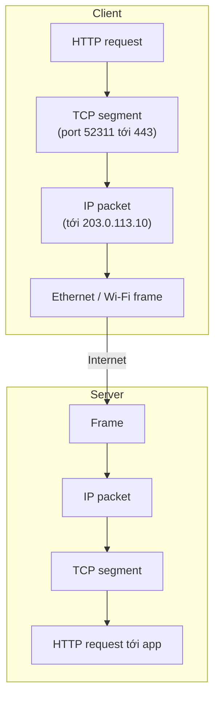
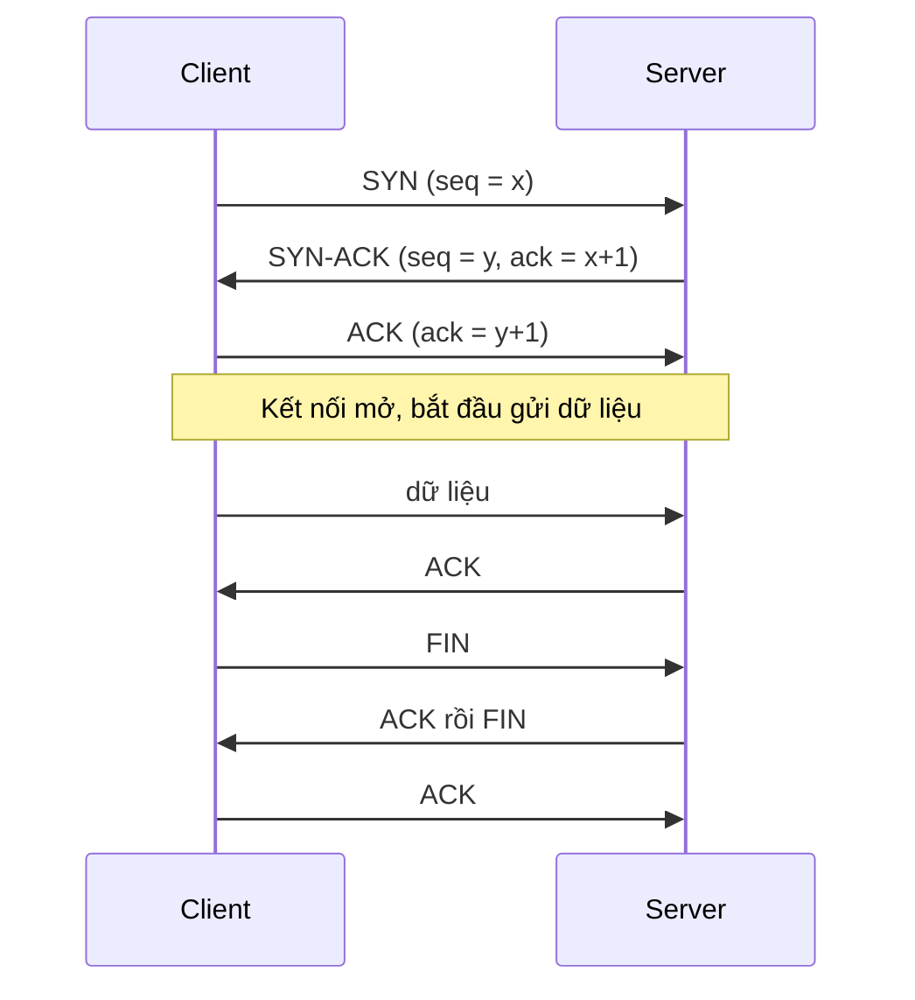
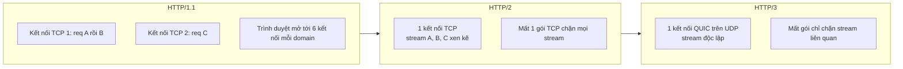

# HTTP, TCP & UDP

Mọi hệ thống phân tán đều là các máy **nói chuyện với nhau qua mạng**. Phần **Communication** trong roadmap system design bắt đầu từ ba giao thức nền tảng: **TCP** (Transmission Control Protocol -- giao thức truyền tải tin cậy, có kết nối), **UDP** (User Datagram Protocol -- giao thức truyền tải gọn nhẹ, không kết nối, không đảm bảo) và **HTTP** (HyperText Transfer Protocol -- giao thức tầng ứng dụng mà gần như mọi API web đều dùng). Hiểu chúng giúp bạn giải thích được vì sao request đầu tiên chậm, vì sao HTTP/2 nhanh hơn HTTP/1.1, vì sao game và video call dùng UDP, và vì sao HTTP/3 chuyển hẳn sang QUIC.

**Tương tự đơn giản:** **TCP** giống gửi **thư bảo đảm**: bưu điện xác nhận người nhận có ở nhà trước, đánh số từng trang, trang nào thất lạc thì gửi lại, người nhận đọc đúng thứ tự. **UDP** giống **phát loa phường**: nói luôn, nhanh, ai nghe được thì nghe, lỡ một câu thì thôi. **HTTP** là **mẫu đơn từ** chuẩn hoá điền bên trong lá thư: ghi rõ muốn làm gì (`GET`, `POST`), gửi tới đâu, kết quả ra sao (`200`, `404`).

---

:::note[Ghi nhớ nhanh]

- ⭐ **TCP = tin cậy + đúng thứ tự + có kết nối** — bắt tay 3 bước, đánh số thứ tự, ACK và gửi lại gói mất, flow control và congestion control; đổi lại latency cao hơn.
- ⭐ **UDP = nhanh, không đảm bảo** — không bắt tay, không gửi lại, không thứ tự; hợp với dữ liệu thời gian thực (video call, game, DNS) nơi dữ liệu trễ còn tệ hơn dữ liệu mất.
- **HTTP là request -- response, stateless** — method (`GET`, `POST`...), status code (`2xx`, `4xx`, `5xx`), header; chạy trên TCP (HTTP/1.1, HTTP/2) hoặc QUIC trên UDP (HTTP/3).
- **HTTP/1.1 → 2 → 3:** keep-alive → multiplexing nhiều stream trên một kết nối + nén header → QUIC loại bỏ head-of-line blocking ở tầng TCP, bắt tay nhanh hơn, hỗ trợ đổi mạng.
- **Head-of-line blocking** là chìa khoá để hiểu sự tiến hoá: một gói chậm chặn mọi thứ phía sau.
- Kết nối mới tốn round-trip (TCP + TLS) — vì vậy dùng **connection pooling / keep-alive** và đặt server gần user (CDN).

:::

---

## Mục lục

- [Vì sao cần hiểu HTTP, TCP và UDP?](#vì-sao-cần-hiểu-http-tcp-và-udp)
- [1. Communication và mô hình tầng mạng](#1-communication-và-mô-hình-tầng-mạng)
- [2. TCP](#2-tcp)
- [3. UDP](#3-udp)
- [4. So sánh TCP và UDP](#4-so-sánh-tcp-và-udp)
- [5. HTTP](#5-http)
- [6. HTTP/1.1, HTTP/2, HTTP/3](#6-http11-http2-http3)
- [Khi nào dùng?](#khi-nào-dùng)
- [Lỗi thường gặp](#lỗi-thường-gặp)
- [Câu hỏi phỏng vấn](#câu-hỏi-phỏng-vấn)

---

## Vì sao cần hiểu HTTP, TCP và UDP?

**Vấn đề:** Mạng Internet về bản chất là **không tin cậy**: gói tin (packet) có thể mất, đến sai thứ tự, bị trùng, hoặc bị trễ vì tắc nghẽn. Ứng dụng thì lại cần những thứ rất khác nhau: trang web cần **đủ và đúng** từng byte; video call cần **nhanh** hơn là đủ; API cần một **ngôn ngữ chung** để client và server hiểu nhau. Nếu không hiểu tầng dưới, bạn sẽ chọn sai giao thức, cấu hình sai timeout, hoặc không biết vì sao p99 latency tăng vọt khi mạng mất gói.

**Giải pháp:** Phân tầng: **IP** lo chuyển gói từ máy này sang máy khác (best effort); **TCP/UDP** lo chuyển dữ liệu giữa hai **tiến trình** (qua port) với mức đảm bảo khác nhau; **HTTP** (và các giao thức ứng dụng khác) định nghĩa ngữ nghĩa của cuộc trò chuyện.

:::tip[Dùng thực tế]

- **Web và REST API:** HTTP/1.1 hoặc HTTP/2 trên TCP + TLS -- trình duyệt, mobile app, microservice gọi nhau.
- **gRPC:** chạy trên HTTP/2 để multiplexing và streaming.
- **DNS:** mặc định dùng UDP port 53 (truy vấn nhỏ, cần nhanh), chuyển sang TCP khi response lớn hoặc khi zone transfer.
- **Video call và game online:** Zoom, Discord voice, WebRTC dùng UDP (qua RTP/SRTP); nhiều game dùng UDP với cơ chế tin cậy tự xây cho phần cần thiết.
- **HTTP/3:** Google, Cloudflare, Meta triển khai QUIC trên UDP cho phần lớn traffic.

:::

---

## 1. Communication và mô hình tầng mạng

Giao tiếp giữa các thành phần hệ thống được xây theo **tầng** (mô hình OSI 7 tầng hoặc TCP/IP 4 tầng). Mỗi tầng chỉ quan tâm việc của nó và dùng dịch vụ của tầng dưới:

| Tầng (TCP/IP) | Giao thức ví dụ | Đơn vị dữ liệu | Trách nhiệm |
| --- | --- | --- | --- |
| Application | HTTP, gRPC, DNS, SMTP, WebSocket | Message | Ngữ nghĩa ứng dụng |
| Transport | TCP, UDP, QUIC | Segment / Datagram | Truyền giữa tiến trình (port), tin cậy hay không |
| Internet | IP (IPv4, IPv6), ICMP | Packet | Định tuyến giữa các máy |
| Link | Ethernet, Wi-Fi | Frame | Truyền trong một mạng cục bộ |



Trong system design, hai lựa chọn quan trọng nhất ở tầng này là: **giao thức transport** (TCP hay UDP) và **giao thức ứng dụng/kiểu API** (HTTP REST, RPC, gRPC, GraphQL, WebSocket...). Bài này nói về phần đầu và HTTP; RPC/REST/gRPC/GraphQL ở các bài sau.

---

## 2. TCP

**TCP** là giao thức **hướng kết nối** (connection-oriented): hai bên phải thiết lập kết nối trước khi gửi dữ liệu. Nó biến đường truyền IP không tin cậy thành một **dòng byte (byte stream) tin cậy, đúng thứ tự**.

### 2.1. Bắt tay ba bước (three-way handshake)



Bắt tay tốn **1 RTT** (round-trip time -- thời gian đi và về) trước khi gửi byte dữ liệu đầu tiên. Thêm **TLS 1.3** để mã hoá tốn thêm 1 RTT (TLS 1.2 tốn 2 RTT). Ví dụ: user ở Việt Nam gọi server ở Mỹ, RTT khoảng 200ms, thì một kết nối HTTPS mới với TLS 1.3 đã mất khoảng 400ms **trước khi** gửi request. Đây là lý do của keep-alive, connection pool, CDN và HTTP/3.

### 2.2. Đảm bảo tin cậy và thứ tự

- **Sequence number:** mỗi byte được đánh số; bên nhận sắp xếp lại gói đến sai thứ tự và loại gói trùng.
- **ACK + retransmission:** bên nhận gửi xác nhận; nếu quá **RTO** (retransmission timeout) hoặc nhận 3 ACK trùng (fast retransmit), bên gửi gửi lại.
- **Checksum:** phát hiện dữ liệu hỏng.
- **Flow control:** bên nhận quảng bá **receive window** (còn bao nhiêu bộ đệm) để bên gửi không gửi quá khả năng xử lý -- chính là back pressure ở tầng mạng.

### 2.3. Congestion control

**Flow control** bảo vệ **bên nhận**; **congestion control** bảo vệ **mạng** ở giữa. TCP duy trì **congestion window (cwnd)** -- lượng dữ liệu được phép gửi khi chưa nhận ACK:

1. **Slow start:** bắt đầu cwnd nhỏ (Linux hiện mặc định 10 segment, khoảng 14KB), nhân đôi mỗi RTT.
2. **Congestion avoidance:** vượt ngưỡng `ssthresh` thì tăng tuyến tính.
3. **Khi mất gói:** giảm cwnd mạnh (thuật toán AIMD -- additive increase, multiplicative decrease).

Các thuật toán phổ biến: **CUBIC** (mặc định trên Linux), **BBR** (Google, dựa trên đo băng thông và RTT thay vì chờ mất gói).

Hệ quả thực tế cho system design:

- Kết nối **mới** luôn chậm lúc đầu (slow start) -- tái sử dụng kết nối giúp tận dụng cwnd đã "ấm".
- Trang đầu tiên nên gọn để nằm trong vài RTT đầu (khoảng 14KB cho RTT đầu tiên).
- Mạng mất gói (Wi-Fi yếu, 4G) làm throughput TCP giảm mạnh và gây **head-of-line blocking**: một segment mất thì mọi dữ liệu phía sau phải chờ, dù chúng đã tới nơi.

### 2.4. Chi phí kết nối và connection pooling

Mỗi kết nối TCP chiếm file descriptor, bộ nhớ đệm, và trạng thái **TIME_WAIT** sau khi đóng. Mở/đóng kết nối liên tục cho mỗi request là lãng phí -- hãy dùng **keep-alive** và **connection pool**:

```ts
import { Agent, request } from 'undici';

// Pool kết nối tái sử dụng tới một upstream: tránh bắt tay TCP + TLS cho mỗi request
const upstream = new Agent({
  connections: 50, // tối đa 50 kết nối mỗi origin
  keepAliveTimeout: 30_000,
  connect: { timeout: 2_000 },
});

export async function getUser(id: string) {
  const { statusCode, body } = await request(`https://users.internal/users/${id}`, {
    dispatcher: upstream,
    headersTimeout: 3_000,
    bodyTimeout: 3_000,
  });
  if (statusCode !== 200) throw new Error(`users service trả ${statusCode}`);
  return body.json();
}
```

---

## 3. UDP

**UDP** là giao thức **không kết nối** (connectionless): gửi **datagram** độc lập, không bắt tay, không ACK, không gửi lại, không thứ tự, không congestion control. Header chỉ 8 byte (TCP tối thiểu 20 byte). Ứng dụng nhận được gì thì nhận, mất thì thôi -- hoặc **tự xây** cơ chế tin cậy ở tầng trên nếu cần.

Khi nào UDP thắng:

- **Video/voice thời gian thực:** một khung hình đến trễ 500ms thì vô dụng; thà bỏ qua và hiển thị khung tiếp theo. Retransmit kiểu TCP chỉ làm cuộc gọi giật.
- **Game online:** vị trí nhân vật cập nhật 20--60 lần/giây; gói mới thay thế gói cũ, gửi lại gói cũ là vô nghĩa.
- **DNS:** truy vấn và trả lời thường vừa một gói; bắt tay TCP sẽ gấp đôi thời gian. Mất thì client gửi lại sau timeout.
- **Broadcast/multicast:** gửi một lần tới nhiều máy (service discovery trong LAN, IPTV) -- TCP không làm được.
- **Metrics và log ít quan trọng:** StatsD gửi metrics qua UDP để app không bao giờ bị chậm vì hệ thống metrics.
- **Nền tảng cho giao thức mới:** QUIC (HTTP/3), WebRTC, WireGuard xây tin cậy/bảo mật riêng trên UDP để không bị ràng buộc bởi TCP trong kernel.

```ts
import dgram from 'node:dgram';

// Gửi metrics kiểu StatsD qua UDP: "bắn rồi quên", không chặn request chính
const socket = dgram.createSocket('udp4');

export function incrementCounter(name: string) {
  const msg = Buffer.from(`${name}:1|c`);
  socket.send(msg, 8125, '127.0.0.1', (err) => {
    if (err) process.stderr.write(`Gửi metric thất bại: ${err.message}\n`); // mất cũng không sao
  });
}
```

:::info[QUIC: "TCP thế hệ mới" trên UDP]

QUIC (RFC 9000) chạy trên UDP nhưng tự cung cấp: tin cậy, thứ tự **theo từng stream**, congestion control, và **mã hoá TLS 1.3 tích hợp sẵn**. Vì sống ở user space thay vì kernel, QUIC tiến hoá nhanh hơn TCP. Đây là transport của **HTTP/3**.

:::

---

## 4. So sánh TCP và UDP

| Tiêu chí | TCP | UDP |
| --- | --- | --- |
| Kết nối | Có (bắt tay 3 bước) | Không |
| Tin cậy | Có -- ACK, gửi lại | Không |
| Thứ tự | Đảm bảo | Không |
| Congestion/flow control | Có | Không (ứng dụng tự lo) |
| Header | 20--60 byte | 8 byte |
| Mô hình dữ liệu | Byte stream | Datagram rời rạc |
| Latency | Cao hơn (bắt tay, chờ gửi lại) | Thấp |
| Broadcast/multicast | Không | Có |
| Ví dụ | HTTP/1.1, HTTP/2, SSH, SMTP, PostgreSQL | DNS, VoIP, game, QUIC/HTTP/3, StatsD |

Quy tắc chọn theo system-design-primer: dùng **TCP** khi cần **toàn bộ dữ liệu đến nguyên vẹn** và thời gian không quá khắt khe (web, API, file, database); dùng **UDP** khi cần **latency thấp nhất**, dữ liệu **cũ mất giá trị nhanh**, và chấp nhận mất một phần (real-time media, game, DNS).

---

## 5. HTTP

**HTTP** là giao thức **request -- response** tầng ứng dụng, **stateless** (mỗi request độc lập, server không nhớ request trước -- trạng thái được mang qua cookie, token). Một HTTP request gồm: **method** (động từ), **URL** (tài nguyên), **header** (metadata), **body** (dữ liệu tuỳ chọn).

```http
POST /api/orders HTTP/1.1
Host: shop.example.com
Content-Type: application/json
Authorization: Bearer eyJhbGciOi...
Idempotency-Key: 7c9e6679-7425-40de-944b-e07fc1f90ae7

{"productId": 42, "quantity": 2}
```

```http
HTTP/1.1 201 Created
Content-Type: application/json
Location: /api/orders/9001
Cache-Control: no-store

{"id": 9001, "status": "pending"}
```

### 5.1. Method

| Method | Ý nghĩa | Safe | Idempotent | Có body |
| --- | --- | --- | --- | --- |
| `GET` | Đọc resource | Có | Có | Không nên |
| `POST` | Tạo mới / hành động | Không | Không | Có |
| `PUT` | Thay thế toàn bộ resource | Không | Có | Có |
| `PATCH` | Cập nhật một phần | Không | Không (mặc định) | Có |
| `DELETE` | Xoá | Không | Có | Tuỳ |
| `HEAD` | Như GET nhưng chỉ lấy header | Có | Có | Không |
| `OPTIONS` | Hỏi method được hỗ trợ (CORS preflight) | Có | Có | Không |

### 5.2. Status code

| Nhóm | Ý nghĩa | Hay gặp |
| --- | --- | --- |
| `1xx` | Thông tin | `101 Switching Protocols` (nâng cấp lên WebSocket) |
| `2xx` | Thành công | `200 OK`, `201 Created`, `202 Accepted`, `204 No Content` |
| `3xx` | Chuyển hướng | `301 Moved Permanently`, `302 Found`, `304 Not Modified` |
| `4xx` | Lỗi phía client | `400`, `401 Unauthorized`, `403 Forbidden`, `404`, `409 Conflict`, `422`, `429 Too Many Requests` |
| `5xx` | Lỗi phía server | `500`, `502 Bad Gateway`, `503 Service Unavailable`, `504 Gateway Timeout` |

Mẹo phỏng vấn: `401` là **chưa xác thực** (không biết bạn là ai), `403` là **đã biết nhưng không có quyền**. `502` là proxy nhận response lỗi từ upstream, `504` là proxy chờ upstream quá lâu. `4xx` thường **không** nên retry (trừ `408`, `429`), `5xx` tạm thời (`502`, `503`, `504`) có thể retry với backoff.

### 5.3. Header quan trọng cho system design

- **Caching:** `Cache-Control`, `ETag` + `If-None-Match` (trả `304`), `Last-Modified`.
- **Nội dung:** `Content-Type`, `Content-Encoding: gzip/br`, `Accept`.
- **Kết nối:** `Connection: keep-alive` (HTTP/1.1 mặc định keep-alive).
- **Điều khiển tải:** `Retry-After`, `RateLimit-*`.
- **Theo dõi:** `traceparent` (W3C Trace Context), `X-Request-Id`.

---

## 6. HTTP/1.1, HTTP/2, HTTP/3



| Đặc điểm | HTTP/1.1 (1997) | HTTP/2 (2015) | HTTP/3 (2022) |
| --- | --- | --- | --- |
| Transport | TCP | TCP | QUIC trên UDP |
| Định dạng | Text | Binary frame | Binary frame |
| Nhiều request đồng thời | Cần nhiều kết nối (trình duyệt khoảng 6/domain) | **Multiplexing** nhiều stream trên 1 kết nối | Multiplexing, stream độc lập |
| Head-of-line blocking | Tầng HTTP (request sau chờ request trước trên cùng kết nối) | Hết ở tầng HTTP, **vẫn còn ở tầng TCP** | Loại bỏ ở tầng transport |
| Nén header | Không | HPACK | QPACK |
| Bắt tay (lần đầu) | TCP + TLS: 2 RTT (TLS 1.3) | Như HTTP/1.1 | 1 RTT (QUIC + TLS gộp), 0-RTT khi kết nối lại |
| Đổi mạng (Wi-Fi sang 4G) | Kết nối đứt | Kết nối đứt | **Connection migration** nhờ connection ID |
| Server push | Không | Có (thực tế ít dùng, Chrome đã bỏ) | Có trong spec, hiếm triển khai |

Điểm cần nắm:

- **HTTP/1.1** thêm keep-alive (tái sử dụng kết nối) và pipelining (hầu như không dùng vì lỗi HOL). Các "mẹo" thời HTTP/1.1 như **domain sharding**, gộp file JS/CSS, sprite ảnh là để né giới hạn kết nối.
- **HTTP/2** giải quyết HOL ở tầng HTTP bằng multiplexing -- các mẹo trên trở nên thừa, thậm chí phản tác dụng. Nhưng vì mọi stream chung **một** kết nối TCP, khi mạng mất gói thì **tất cả** stream cùng chờ -- trên mạng xấu, HTTP/2 có thể chậm hơn HTTP/1.1 với nhiều kết nối.
- **HTTP/3** chuyển sang QUIC: mỗi stream được đảm bảo thứ tự riêng, mất gói ở stream A không chặn stream B. Bắt tay nhanh hơn, tiếp tục kết nối khi đổi IP. Rất có lợi cho mobile.

Bật HTTP/2 và HTTP/3 trên nginx (bản 1.25 trở lên có module QUIC):

```nginx
server {
    listen 443 ssl;
    listen 443 quic reuseport;   # HTTP/3 trên UDP 443
    http2 on;

    server_name example.com;
    ssl_certificate     /etc/ssl/example.crt;
    ssl_certificate_key /etc/ssl/example.key;
    ssl_protocols TLSv1.3;

    # Báo cho trình duyệt rằng server hỗ trợ HTTP/3
    add_header Alt-Svc 'h3=":443"; ma=86400';

    location /api/ {
        proxy_pass http://backend;
        proxy_http_version 1.1;          # keep-alive tới upstream
        proxy_set_header Connection "";
    }
}

upstream backend {
    server 10.0.0.11:8080;
    server 10.0.0.12:8080;
    keepalive 64;                        # pool kết nối nhàn rỗi tới upstream
}
```

---

## Khi nào dùng?

| Nhu cầu | Lựa chọn | Lý do |
| --- | --- | --- |
| REST API, web app, tải file | HTTP/1.1 hoặc HTTP/2 trên TCP | Cần dữ liệu đủ, đúng; hệ sinh thái lớn |
| Microservice gọi nhau nhiều | HTTP/2 (gRPC) + connection pool | Multiplexing, ít kết nối |
| Người dùng mobile, mạng chập chờn | HTTP/3 (qua CDN như Cloudflare) | Không HOL ở transport, connection migration |
| Video call, livestream độ trễ thấp, game | UDP (WebRTC, RTP, giao thức tự xây) | Dữ liệu cũ vô giá trị, cần latency thấp |
| Truy vấn DNS | UDP (TCP khi response lớn) | Một gói đi một gói về |
| Gửi metrics không được chặn app | UDP (StatsD) | Mất vài gói chấp nhận được |
| Push real-time hai chiều qua trình duyệt | WebSocket (nâng cấp từ HTTP, trên TCP) | Kết nối lâu dài, full-duplex |
| Chuyển tiền, ghi dữ liệu quan trọng | TCP (HTTP) | Không chấp nhận mất dữ liệu |

---

## Lỗi thường gặp

### Lỗi 1: Mở kết nối mới cho mỗi request

Gọi service khác mà không dùng keep-alive: mỗi request tốn thêm bắt tay TCP + TLS, sinh hàng nghìn socket TIME_WAIT, có thể cạn port (ephemeral port exhaustion). **Sửa:** dùng HTTP agent/pool dùng chung, bật keepalive ở nginx upstream.

### Lỗi 2: Không đặt timeout

Mặc định một số client HTTP chờ rất lâu hoặc vô hạn. Một upstream treo làm cạn thread/connection của service gọi. **Sửa:** đặt connect timeout, read timeout, tổng deadline; kết hợp retry có backoff và circuit breaker.

### Lỗi 3: Dùng UDP rồi giả định dữ liệu đến đủ

Dùng UDP để "nhanh" nhưng ứng dụng lại cần mọi byte -- rồi tự xây lại ACK, retransmit, thứ tự một cách lỗi. **Sửa:** cần tin cậy thì dùng TCP hoặc QUIC; chỉ dùng UDP thô khi thật sự chấp nhận mất.

### Lỗi 4: Giữ mẹo tối ưu HTTP/1.1 khi đã lên HTTP/2

Domain sharding làm HTTP/2 mở nhiều kết nối, mất lợi thế multiplexing và nén header. **Sửa:** bỏ sharding, giảm bundle khổng lồ, tận dụng cache theo file nhỏ.

### Lỗi 5: Dùng sai status code

Trả `200 OK` kèm body `{"error": ...}` khiến proxy, cache, monitoring, retry logic đều hiểu sai. **Sửa:** trả đúng `4xx`/`5xx`, kèm body lỗi có cấu trúc (ví dụ RFC 9457 Problem Details).

---

## Câu hỏi phỏng vấn

**1. Khác biệt giữa TCP và UDP? Cho ví dụ khi nào dùng mỗi loại.**

<details className="qa">
<summary>Xem đáp án</summary>

TCP có kết nối (bắt tay 3 bước), tin cậy (ACK, gửi lại), đúng thứ tự, có flow control và congestion control -- dùng cho web, API, database, file. UDP không kết nối, không đảm bảo, header nhỏ, latency thấp, hỗ trợ broadcast/multicast -- dùng cho video/voice real-time, game, DNS, metrics, và làm nền cho QUIC.

</details>

**2. Mô tả TCP three-way handshake. Vì sao kết nối đầu tiên chậm?**

<details className="qa">
<summary>Xem đáp án</summary>

Client gửi SYN, server trả SYN-ACK, client gửi ACK -- mất 1 RTT trước khi gửi dữ liệu. Thêm TLS 1.3 tốn 1 RTT nữa (TLS 1.2 là 2). Sau đó slow start làm cwnd nhỏ lúc đầu. Giảm bằng keep-alive/connection pool, TLS session resumption, CDN gần user, HTTP/3 (gộp bắt tay, 0-RTT).

</details>

**3. HTTP/2 cải thiện gì so với HTTP/1.1? HTTP/3 giải quyết vấn đề gì còn lại?**

<details className="qa">
<summary>Xem đáp án</summary>

HTTP/2: binary framing, multiplexing nhiều stream trên một kết nối (hết HOL ở tầng HTTP), nén header HPACK, ưu tiên stream. Vấn đề còn lại: HOL ở tầng TCP -- mất một gói chặn mọi stream. HTTP/3 dùng QUIC trên UDP: stream độc lập ở tầng transport, bắt tay gộp TLS (1 RTT, 0-RTT khi kết nối lại), connection migration khi đổi mạng.

</details>

**4. Flow control và congestion control khác nhau thế nào?**

<details className="qa">
<summary>Xem đáp án</summary>

Flow control bảo vệ bên nhận: receiver window cho biết bộ đệm còn bao nhiêu. Congestion control bảo vệ mạng: congestion window điều chỉnh theo tín hiệu mất gói/độ trễ (slow start, AIMD, CUBIC, BBR). Lượng dữ liệu được gửi chưa ACK là min của hai cửa sổ.

</details>

**5. Phân biệt 401 và 403, 502 và 504. Lỗi nào nên retry?**

<details className="qa">
<summary>Xem đáp án</summary>

401: chưa xác thực hoặc token không hợp lệ. 403: đã xác thực nhưng không có quyền. 502: gateway nhận response không hợp lệ từ upstream. 504: gateway chờ upstream quá thời gian. Nên retry (có backoff, giới hạn) với 429, 502, 503, 504 và lỗi mạng tạm thời, chỉ khi thao tác idempotent hoặc có idempotency key. Không retry 400, 401, 403, 404, 422.

</details>

**6. Vì sao DNS dùng UDP? Khi nào DNS dùng TCP?**

<details className="qa">
<summary>Xem đáp án</summary>

Truy vấn và trả lời DNS thường nhỏ, vừa một gói; UDP tránh được RTT bắt tay, giảm tải cho server phục vụ lượng truy vấn khổng lồ; mất thì client tự gửi lại sau timeout. DNS dùng TCP khi response quá lớn (bị truncate, cờ TC), khi zone transfer giữa các name server, và với DNS over TLS/HTTPS.

</details>
