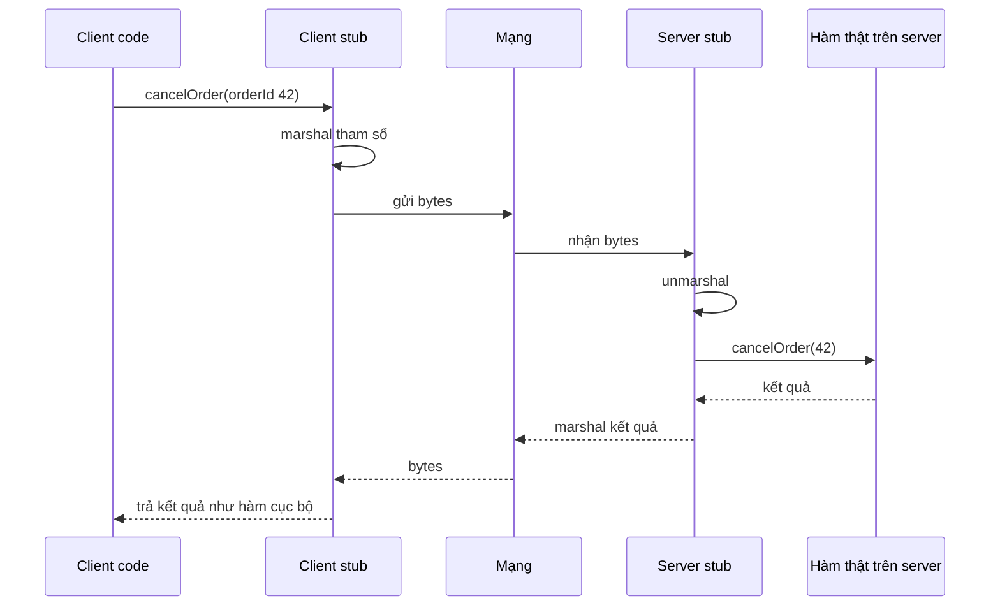
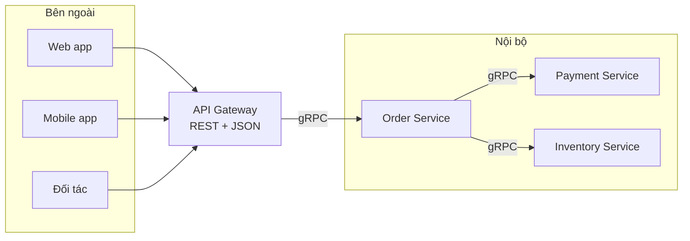
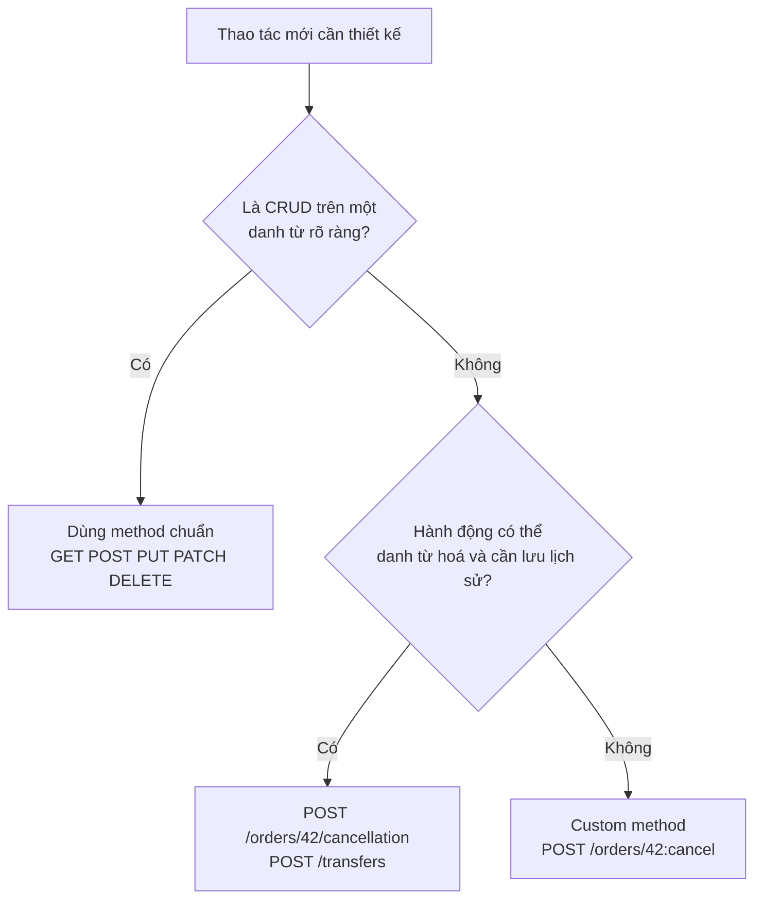

# RPC & REST

Khi hai service cần nói chuyện qua HTTP (hoặc giao thức khác), câu hỏi tiếp theo là: **API được tổ chức theo kiểu gì?** Hai trường phái lớn nhất là **RPC** (Remote Procedure Call -- gọi hàm từ xa: API là tập các **hành động**, kiểu `createOrder`, `cancelOrder`) và **REST** (Representational State Transfer -- API là tập các **tài nguyên** (resource) được thao tác qua một bộ động từ chuẩn của HTTP, kiểu `POST /orders`, `DELETE /orders/42`). Mỗi kiểu có triết lý, điểm mạnh và chỗ đứng riêng; hệ thống thực tế thường dùng cả hai.

**Tương tự đơn giản:** **RPC** giống gọi điện cho nhân viên và **ra lệnh** trực tiếp: "Hãy huỷ đơn số 42", "Hãy tính phí ship cho địa chỉ này". **REST** giống làm việc với một **tủ hồ sơ** có quy tắc chung: mọi ngăn (resource) đều có địa chỉ, và bạn chỉ dùng vài thao tác chuẩn -- xem, thêm, thay, xoá -- với bất kỳ ngăn nào.

---

:::note[Ghi nhớ nhanh]

- ⭐ **RPC tập trung vào hành động, REST tập trung vào tài nguyên** — RPC: `POST /cancelOrder`; REST: `DELETE /orders/42` hoặc `POST /orders/42/cancellation`.
- ⭐ **REST tận dụng HTTP** — method có ngữ nghĩa (safe, idempotent), status code, cache HTTP, URL dễ đọc; hợp với API public.
- **RPC gọn, nhanh, hợp nội bộ** — gọi như hàm cục bộ, thường dùng binary (gRPC, Thrift) và code generation; nhưng client và server gắn chặt hơn.
- **REST đúng nghĩa có 6 ràng buộc** (Fielding, 2000) — client-server, stateless, cacheable, uniform interface, layered system, code on demand (tuỳ chọn); HATEOAS thường bị bỏ qua.
- **Thiết kế endpoint REST:** danh từ số nhiều, lồng nhau tối đa 1--2 cấp, filter/sort/pagination qua query string, versioning, lỗi có cấu trúc.
- Nguyên tắc chọn (system-design-primer): **public API dùng REST**, **giao tiếp nội bộ cần hiệu năng dùng RPC**.

:::

---

## Mục lục

- [Vì sao cần RPC và REST?](#vì-sao-cần-rpc-và-rest)
- [1. RPC là gì?](#1-rpc-là-gì)
- [2. REST là gì?](#2-rest-là-gì)
- [3. So sánh RPC và REST](#3-so-sánh-rpc-và-rest)
- [4. Thiết kế endpoint REST](#4-thiết-kế-endpoint-rest)
- [5. Hành động không vừa CRUD](#5-hành-động-không-vừa-crud)
- [6. Chọn RPC hay REST?](#6-chọn-rpc-hay-rest)
- [Khi nào dùng?](#khi-nào-dùng)
- [Lỗi thường gặp](#lỗi-thường-gặp)
- [Câu hỏi phỏng vấn](#câu-hỏi-phỏng-vấn)

---

## Vì sao cần RPC và REST?

**Vấn đề:** Không có quy ước chung, mỗi team đặt API theo ý mình: `/getUser`, `/user/fetch`, `/api/v1/userInfo?id=`, trả lỗi lúc thì `200` kèm `{"ok": false}`, lúc thì `500`. Client khó đoán, khó cache, khó retry đúng, khó tài liệu hoá. Mặt khác, giữa hàng trăm microservice gọi nhau hàng triệu lần mỗi giây, JSON qua HTTP/1.1 có thể quá chậm và quá rườm rà.

**Giải pháp:** Chọn một **phong cách API** rõ ràng: **REST** để có giao diện đồng nhất, dễ hiểu, tận dụng hạ tầng HTTP (cache, proxy, CDN) -- phù hợp public API; **RPC** để có giao tiếp gọn, nhanh, kiểu dữ liệu chặt chẽ -- phù hợp nội bộ.

:::tip[Dùng thực tế]

- **REST public API:** GitHub REST API, Stripe API, Twilio -- URL theo resource, method HTTP chuẩn, status code chuẩn.
- **RPC nội bộ:** Google dùng Stubby (tiền thân của gRPC) cho giao tiếp nội bộ; Facebook tạo ra Thrift; Netflix, Uber, Dropbox dùng gRPC giữa các service.
- **RPC qua HTTP+JSON:** Slack Web API có dạng `POST /api/chat.postMessage` -- tên phương thức nằm ngay trên URL; JSON-RPC 2.0 dùng trong Ethereum node API.
- **Kết hợp:** nhiều công ty mở REST/GraphQL cho bên ngoài, còn bên trong là gRPC.

:::

---

## 1. RPC là gì?

**RPC** cho phép client gọi một **thủ tục (hàm) trên máy khác** như thể gọi hàm cục bộ. Thư viện RPC sinh ra **stub** (đại diện phía client) và **skeleton** (phía server) để che giấu chi tiết mạng:

1. Client gọi hàm trên **client stub**, ví dụ `orderService.cancelOrder({ orderId: 42 })`.
2. Stub **marshal** (tuần tự hoá) tên hàm và tham số thành bytes.
3. Thư viện RPC gửi qua mạng (TCP, HTTP/2...).
4. **Server stub** unmarshal, gọi hàm thật trên server.
5. Kết quả đi ngược lại và trả về như giá trị của lời gọi hàm.



Các framework/giao thức RPC phổ biến:

| Tên | Định dạng | Transport | Ghi chú |
| --- | --- | --- | --- |
| **gRPC** | Protocol Buffers (binary) | HTTP/2 | Streaming, codegen nhiều ngôn ngữ (xem bài gRPC & GraphQL) |
| **Apache Thrift** | Binary/compact | TCP, HTTP | Do Facebook tạo ra |
| **JSON-RPC 2.0** | JSON | HTTP, WebSocket | Rất đơn giản, dùng trong Ethereum, Language Server Protocol |
| **tRPC** | JSON | HTTP | RPC type-safe end-to-end cho TypeScript |
| **Java RMI, SOAP** | Java serialization, XML | TCP, HTTP | Thế hệ cũ |

Ví dụ JSON-RPC 2.0:

```json
// Request
{ "jsonrpc": "2.0", "method": "order.cancel", "params": { "orderId": 42, "reason": "customer_request" }, "id": 1 }

// Response
{ "jsonrpc": "2.0", "result": { "orderId": 42, "status": "cancelled" }, "id": 1 }
```

Ưu điểm RPC:

- **Tự nhiên với lập trình viên:** gọi hàm, có kiểu dữ liệu, IDE gợi ý (với codegen).
- **Hiệu năng cao** khi dùng binary + HTTP/2 (gRPC): payload nhỏ, ít parse.
- **Thoải mái đặt tên hành động** nghiệp vụ phức tạp, không phải ép vào CRUD.

Nhược điểm RPC (theo system-design-primer):

- **Client gắn chặt với implementation của service** -- đổi chữ ký hàm có thể làm vỡ client.
- Thường phải định nghĩa API mới cho mỗi thao tác/use case mới.
- **Khó debug** hơn (binary, không xem được bằng `curl` thuần).
- Không tận dụng được hạ tầng HTTP sẵn có: cache HTTP, CDN thường không hiểu (RPC qua `POST` không cache được).
- **"Ảo giác hàm cục bộ" nguy hiểm:** gọi qua mạng có thể chậm, timeout, lỗi một phần -- lập trình viên dễ quên xử lý (xem "Fallacies of distributed computing").

---

## 2. REST là gì?

**REST** là **phong cách kiến trúc** do Roy Fielding mô tả trong luận án tiến sĩ năm 2000. Ý tưởng: mọi thứ là **resource** có định danh (URI); client thao tác resource bằng cách trao đổi **representation** (biểu diễn, ví dụ JSON) qua một **uniform interface** (giao diện đồng nhất -- với HTTP là các method chuẩn).

Sáu ràng buộc của REST:

| Ràng buộc | Ý nghĩa | Lợi ích |
| --- | --- | --- |
| **Client-server** | Tách UI khỏi lưu trữ | Phát triển độc lập |
| **Stateless** | Mỗi request mang đủ thông tin, server không giữ session | Dễ scale ngang, retry, load balancing |
| **Cacheable** | Response tự đánh dấu cache được hay không | Giảm tải, giảm latency (CDN, browser) |
| **Uniform interface** | URI cho resource, method chuẩn, representation, HATEOAS | Dễ hiểu, công cụ chung |
| **Layered system** | Client không biết đang nói với server thật hay proxy | Chèn LB, cache, gateway thoải mái |
| **Code on demand** (tuỳ chọn) | Server có thể gửi code cho client chạy | Ít dùng trong API |

**HATEOAS** (Hypermedia As The Engine Of Application State): response chứa **link** tới các hành động tiếp theo, client "duyệt" API như duyệt web. Trên thực tế phần lớn API tự nhận là REST bỏ qua HATEOAS -- theo mô hình **Richardson Maturity Model**, đa số API dừng ở level 2 (resource + HTTP verbs).

```json
{
  "id": 42,
  "status": "pending",
  "total": 350000,
  "_links": {
    "self": { "href": "/orders/42" },
    "cancel": { "href": "/orders/42/cancellation", "method": "POST" },
    "payment": { "href": "/orders/42/payment", "method": "POST" }
  }
}
```

Ưu điểm REST:

- **Đồng nhất, dễ đoán:** biết resource là biết cách thao tác.
- **Tận dụng HTTP:** cache (`ETag`, `Cache-Control`), status code, method idempotent cho retry, CDN, proxy.
- **Client và server lỏng lẻo** hơn -- thêm field không làm vỡ client.
- **Dễ debug** bằng `curl`, trình duyệt; tài liệu hoá bằng **OpenAPI** (Swagger).

Nhược điểm REST:

- Hành động nghiệp vụ không khớp CRUD khó mô hình hoá (huỷ đơn, chuyển tiền, gửi lại OTP).
- **Over-fetching / under-fetching:** endpoint trả thừa dữ liệu, hoặc phải gọi nhiều endpoint cho một màn hình (đó là lý do GraphQL ra đời).
- Resource lồng nhau sâu làm URL rối.
- JSON text tốn băng thông và CPU parse hơn binary.

---

## 3. So sánh RPC và REST

Bảng tóm tắt theo system-design-primer (mở rộng):

| Thao tác | RPC | REST |
| --- | --- | --- |
| Đăng ký | `POST /signup` | `POST /persons` |
| Huỷ tài khoản | `POST /resign` với body `personid=1234` | `DELETE /persons/1234` |
| Đọc thông tin một người | `GET /readPerson?personid=1234` | `GET /persons/1234` |
| Đọc danh sách item của một người | `GET /readUsersItemsList?personid=1234` | `GET /persons/1234/items` |
| Thêm item | `POST /addItemToUsersItemsList` với body `personid=1234&itemid=456` | `POST /persons/1234/items` với body `itemid=456` |
| Cập nhật item | `POST /modifyItem` với body `itemid=456&key=value` | `PUT /items/456` với body `key=value` |
| Xoá item | `POST /removeItem` với body `itemid=456` | `DELETE /items/456` |

| Tiêu chí | RPC | REST |
| --- | --- | --- |
| Đơn vị thiết kế | Hành động (động từ) | Tài nguyên (danh từ) |
| Method HTTP | Thường chỉ `POST` (hoặc không dùng HTTP) | Dùng đủ GET/POST/PUT/PATCH/DELETE theo ngữ nghĩa |
| Định dạng | Binary (protobuf, Thrift) hoặc JSON | Thường JSON |
| Hợp đồng | IDL chặt (`.proto`, `.thrift`) + codegen | OpenAPI (tuỳ chọn) |
| Cache HTTP | Hầu như không | Có sẵn với GET |
| Coupling | Chặt hơn | Lỏng hơn |
| Hiệu năng | Cao (binary, HTTP/2) | Trung bình (JSON) |
| Debug | Cần công cụ riêng | `curl`, trình duyệt |
| Streaming | gRPC hỗ trợ 4 kiểu | Hạn chế (SSE, chunked) |
| Hợp với | Nội bộ, microservice, hiệu năng cao | Public API, web/mobile client, đối tác |



---

## 4. Thiết kế endpoint REST

### 4.1. Quy ước đặt URL

| Quy tắc | Tốt | Tránh |
| --- | --- | --- |
| Danh từ số nhiều | `GET /orders` | `GET /getOrders` |
| Định danh trong path | `GET /orders/42` | `GET /orders?id=42` (khi lấy đúng 1 resource) |
| Lồng tối đa 1--2 cấp | `GET /users/7/orders` | `GET /users/7/orders/42/items/3/reviews` |
| Chữ thường, gạch nối | `/shipping-addresses` | `/ShippingAddresses`, `/shipping_addresses` (tuỳ quy ước, nhưng nhất quán) |
| Method thể hiện hành động | `DELETE /orders/42` | `POST /orders/42/delete` |
| Filter, sort, phân trang qua query | `GET /orders?status=paid&sort=-createdAt&limit=20` | `GET /orders/paid/sorted-by-date` |

### 4.2. Bộ endpoint mẫu cho resource `orders`

| Method + URL | Ý nghĩa | Thành công |
| --- | --- | --- |
| `GET /v1/orders?status=paid&limit=20&cursor=abc` | Danh sách có lọc, phân trang | `200` |
| `GET /v1/orders/42` | Chi tiết | `200` / `404` |
| `POST /v1/orders` | Tạo mới (kèm `Idempotency-Key`) | `201` + header `Location` |
| `PATCH /v1/orders/42` | Cập nhật một phần | `200` |
| `PUT /v1/orders/42/shipping-address` | Thay toàn bộ địa chỉ giao | `200` |
| `DELETE /v1/orders/42` | Xoá (hoặc soft delete) | `204` |
| `POST /v1/orders/42/cancellation` | Hành động huỷ | `201` / `409` nếu đã giao |

### 4.3. Phân trang

| Kiểu | Ví dụ | Ưu | Nhược |
| --- | --- | --- | --- |
| **Offset** | `?limit=20&offset=40` | Đơn giản, nhảy trang | Chậm khi offset lớn (DB vẫn quét qua), lệch khi dữ liệu thay đổi |
| **Cursor / keyset** | `?limit=20&cursor=eyJpZCI6NDJ9` | Nhanh ổn định, không lệch | Không nhảy tới trang N |

```sql
-- Keyset pagination: dùng index (created_at, id), không quét bỏ OFFSET dòng
SELECT id, total, created_at
FROM orders
WHERE (created_at, id) < ($1, $2)   -- giá trị lấy từ cursor
ORDER BY created_at DESC, id DESC
LIMIT 20;
```

### 4.4. Versioning và lỗi

- **Versioning:** phổ biến nhất là trong URL (`/v1/...`) -- rõ ràng, dễ route; hoặc header (`Accept: application/vnd.example.v2+json`), hoặc theo ngày như Stripe (`Stripe-Version: 2024-06-20`). Nguyên tắc: thay đổi **thêm vào** (thêm field) không cần version mới; **xoá/đổi nghĩa** field thì cần.
- **Lỗi có cấu trúc** theo RFC 9457 (Problem Details):

```json
{
  "type": "https://api.example.com/problems/insufficient-stock",
  "title": "Không đủ hàng trong kho",
  "status": 409,
  "detail": "Sản phẩm 42 chỉ còn 1, yêu cầu 3",
  "instance": "/v1/orders",
  "traceId": "4bf92f3577b34da6a3ce929d0e0e4736"
}
```

### 4.5. Cài đặt mẫu với Express + Zod

```ts
import express from 'express';
import { z } from 'zod';

const router = express.Router();

const ListQuery = z.object({
  status: z.enum(['pending', 'paid', 'shipped', 'cancelled']).optional(),
  limit: z.coerce.number().int().min(1).max(100).default(20),
  cursor: z.string().optional(),
});

const CreateOrder = z.object({
  items: z.array(z.object({ productId: z.number().int(), quantity: z.number().int().min(1) })).min(1).max(50),
  addressId: z.number().int(),
});

router.get('/v1/orders', async (req, res) => {
  const parsed = ListQuery.safeParse(req.query);
  if (!parsed.success) return res.status(400).json({ title: 'Tham số không hợp lệ', errors: parsed.error.issues });
  const page = await orderRepo.list(req.user.id, parsed.data);
  return res.json({ data: page.items, nextCursor: page.nextCursor });
});

router.post('/v1/orders', async (req, res) => {
  const parsed = CreateOrder.safeParse(req.body);
  if (!parsed.success) return res.status(422).json({ title: 'Dữ liệu không hợp lệ', errors: parsed.error.issues });
  const order = await orderService.create(req.user.id, parsed.data, req.header('Idempotency-Key'));
  return res.status(201).location(`/v1/orders/${order.id}`).json(order);
});

router.post('/v1/orders/:id/cancellation', async (req, res) => {
  const result = await orderService.cancel(req.user.id, Number(req.params.id));
  if (result.kind === 'not_found') return res.status(404).end();
  if (result.kind === 'already_shipped') return res.status(409).json({ title: 'Đơn đã giao, không thể huỷ' });
  return res.status(201).json(result.cancellation);
});
```

---

## 5. Hành động không vừa CRUD

Đây là chỗ REST "khó chịu" nhất. Ba cách xử lý phổ biến:

1. **Biến hành động thành resource (danh từ hoá):** huỷ đơn thành tạo một `cancellation` -- `POST /orders/42/cancellation`; chuyển tiền thành tạo một `transfer` -- `POST /transfers`. Cách này giữ đúng tinh thần REST và cho phép lưu lịch sử hành động.
2. **Cập nhật trạng thái:** `PATCH /orders/42` với `{"status": "cancelled"}` -- đơn giản nhưng dồn logic chuyển trạng thái vào một endpoint chung, khó kiểm soát quyền.
3. **Sub-resource kiểu hành động (pragmatic):** `POST /orders/42/actions/cancel` hoặc kiểu của Google API Design Guide `POST /orders/42:cancel` (custom method). Đây thực chất là RPC đặt trong REST -- chấp nhận được khi nhất quán.



---

## 6. Chọn RPC hay REST?

Theo system-design-primer: *"REST is focused on exposing data. It minimizes the coupling between client/server and is often used for public HTTP APIs... RPC is focused on exposing behaviors. RPCs are often used for performance reasons with internal communications."*

Câu hỏi gợi ý khi quyết định:

- **Ai là client?** Bên ngoài, đa dạng, không kiểm soát được phiên bản → REST (hoặc GraphQL). Nội bộ, cùng tổ chức, deploy cùng nhịp → RPC.
- **Có cần cache HTTP/CDN không?** Có → REST với GET.
- **Lưu lượng và latency yêu cầu?** Hàng chục nghìn RPS giữa service, cần p99 thấp → gRPC.
- **Có cần streaming hai chiều không?** Có → gRPC (hoặc WebSocket).
- **Hợp đồng chặt và codegen có giá trị không?** Nhiều ngôn ngữ, nhiều team → IDL của RPC rất có ích.
- **Trình duyệt gọi trực tiếp?** gRPC cần gRPC-Web + proxy; REST thì gọi thẳng.

---

## Khi nào dùng?

| Tình huống | Nên dùng | Lý do |
| --- | --- | --- |
| Public API cho đối tác, developer bên ngoài | REST | Dễ hiểu, công cụ phổ biến, coupling thấp |
| Web/mobile app gọi backend | REST (hoặc GraphQL) | Tận dụng cache HTTP, debug dễ |
| Microservice nội bộ, lưu lượng lớn | RPC (gRPC) | Binary, HTTP/2, hợp đồng chặt |
| Monorepo TypeScript full-stack | tRPC | Type-safe end-to-end, không cần codegen |
| Hành động nghiệp vụ phức tạp, ít dữ liệu đọc | RPC hoặc custom method | Không phải ép vào CRUD |
| Dữ liệu đọc nhiều, cần CDN cache | REST GET | Cache theo URL |

---

## Lỗi thường gặp

### Lỗi 1: "REST" nhưng chỉ dùng POST và động từ trên URL

`POST /api/getUser`, `POST /api/deleteOrder` -- đây là RPC khoác áo REST, mất hết lợi ích cache, idempotent, status code. **Sửa:** hoặc làm REST đúng nghĩa, hoặc thừa nhận là RPC và dùng framework RPC cho nhất quán.

### Lỗi 2: Luôn trả 200 kể cả khi lỗi

`200 OK` với `{"success": false}` làm monitoring báo xanh khi hệ thống đang lỗi, client retry sai. **Sửa:** dùng đúng `4xx`/`5xx` và body Problem Details.

### Lỗi 3: Lồng resource quá sâu

`/companies/1/departments/2/teams/3/members/4/tasks/5` -- dài, khó cache, khó phân quyền. **Sửa:** resource có ID toàn cục thì truy cập trực tiếp `/tasks/5`; chỉ lồng khi resource con không tồn tại độc lập.

### Lỗi 4: Phá vỡ client khi đổi API

Đổi tên field, đổi kiểu dữ liệu, đổi chữ ký RPC mà không version. **Sửa:** chỉ thay đổi tương thích ngược (thêm field optional), version khi phá vỡ, deprecate có thời hạn; với protobuf không tái sử dụng số field.

### Lỗi 5: Quên rằng RPC là gọi qua mạng

Gọi RPC trong vòng lặp như hàm cục bộ (N lời gọi cho N item), không timeout, không retry. **Sửa:** API batch (`GetUsers(ids)`), deadline cho mỗi lời gọi, retry có backoff cho thao tác idempotent.

---

## Câu hỏi phỏng vấn

**1. RPC và REST khác nhau thế nào?**

<details className="qa">
<summary>Xem đáp án</summary>

RPC xoay quanh hành động (gọi hàm từ xa), thường dùng IDL + codegen, binary, chủ yếu POST hoặc giao thức riêng; hiệu năng cao, coupling chặt, hợp nội bộ. REST xoay quanh resource, dùng method HTTP theo ngữ nghĩa, status code, cache HTTP, stateless; coupling lỏng, dễ debug, hợp public API. Nhiều hệ thống dùng REST ở biên và gRPC bên trong.

</details>

**2. Nêu các ràng buộc của REST. Stateless có nghĩa là gì?**

<details className="qa">
<summary>Xem đáp án</summary>

Client-server, stateless, cacheable, uniform interface (định danh resource, thao tác qua representation, message tự mô tả, HATEOAS), layered system, code on demand (tuỳ chọn). Stateless: mỗi request mang đủ thông tin để xử lý (token, tham số), server không giữ session giữa các request -- nhờ vậy request nào cũng có thể vào server nào, dễ scale ngang và retry.

</details>

**3. Thiết kế API REST cho tính năng huỷ đơn hàng và chuyển tiền.**

<details className="qa">
<summary>Xem đáp án</summary>

Danh từ hoá hành động: `POST /orders/42/cancellation` (trả 201, hoặc 409 nếu đã giao, 404 nếu không tồn tại) và `POST /transfers` với body chứa tài khoản nguồn, đích, số tiền, kèm `Idempotency-Key`. Transfer là resource có trạng thái (`pending`, `completed`, `failed`) truy vấn qua `GET /transfers/{id}`. Cách khác: custom method `POST /orders/42:cancel`.

</details>

**4. Offset pagination và cursor pagination khác nhau ra sao?**

<details className="qa">
<summary>Xem đáp án</summary>

Offset (`limit`, `offset`): đơn giản, nhảy trang được, nhưng DB phải quét và bỏ qua offset dòng (chậm khi offset lớn) và kết quả lệch khi có bản ghi mới chèn vào. Cursor/keyset: dùng giá trị của bản ghi cuối (ví dụ `created_at`, `id`) làm điểm bắt đầu, truy vấn qua index nên nhanh ổn định, không lệch; nhược điểm là không nhảy thẳng tới trang N. Feed vô tận và API lớn nên dùng cursor.

</details>

**5. Khi nào bạn chọn RPC thay vì REST?**

<details className="qa">
<summary>Xem đáp án</summary>

Giao tiếp service-to-service nội bộ với lưu lượng lớn và yêu cầu latency thấp; cần hợp đồng chặt và codegen cho nhiều ngôn ngữ; cần streaming; thao tác chủ yếu là hành động nghiệp vụ hơn là CRUD. Ngược lại, API public, client đa dạng, cần cache HTTP và dễ tiếp cận thì REST.

</details>

**6. Làm sao versioning API mà không làm vỡ client cũ?**

<details className="qa">
<summary>Xem đáp án</summary>

Ưu tiên thay đổi tương thích ngược: thêm field optional, thêm endpoint mới, không đổi nghĩa field cũ. Khi buộc phải phá vỡ: version trong URL (`/v2`), header media type, hoặc version theo ngày như Stripe (mỗi tài khoản ghim một version, server chuyển đổi response). Thông báo deprecation (header `Deprecation`, `Sunset`), theo dõi client còn dùng bản cũ trước khi gỡ.

</details>
