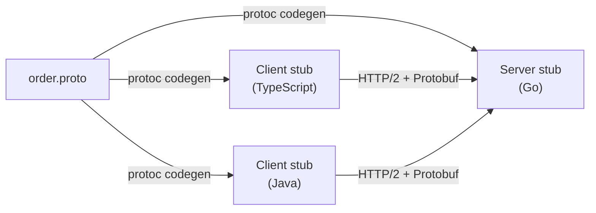
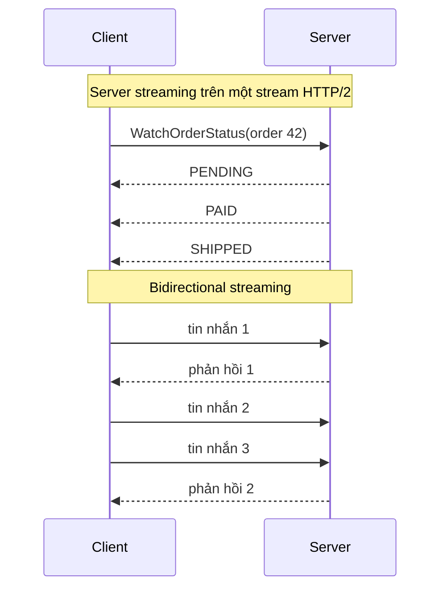
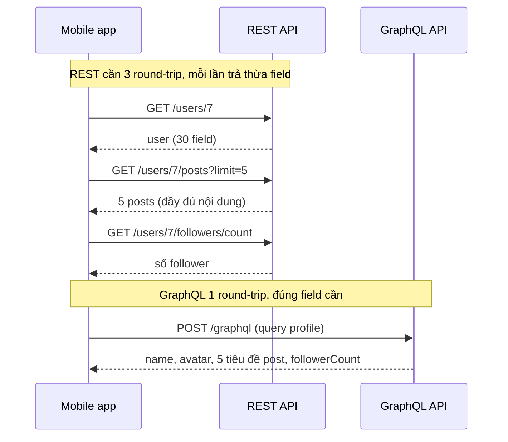
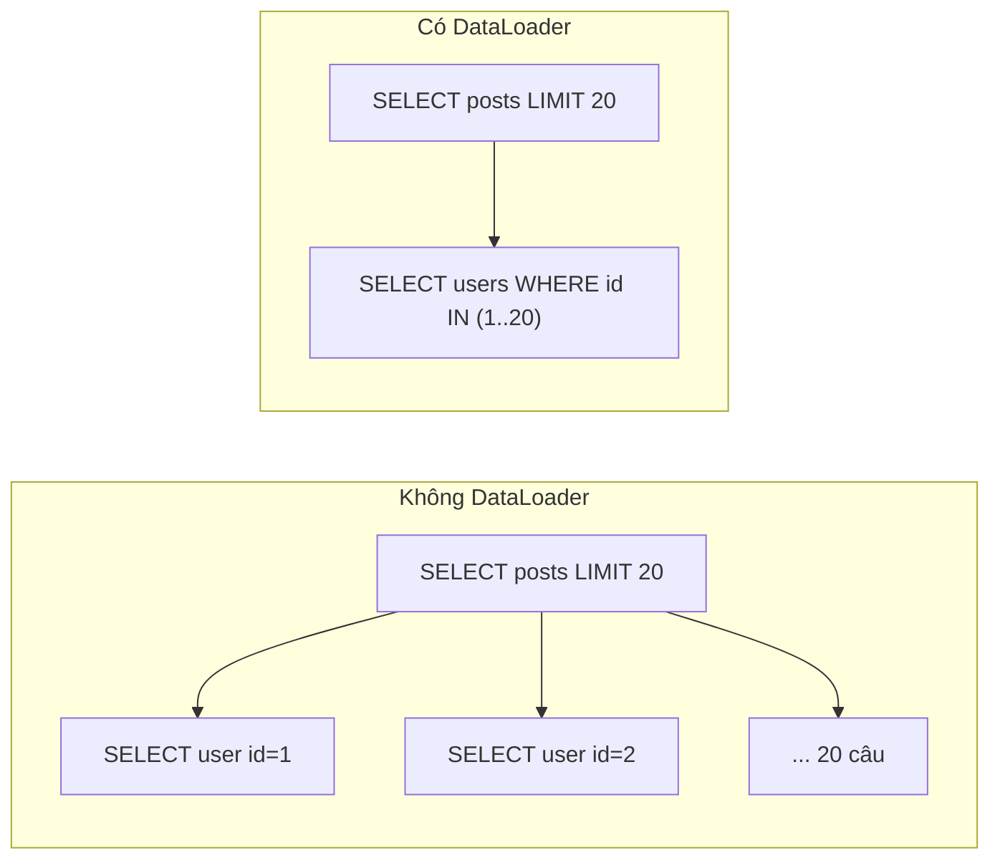
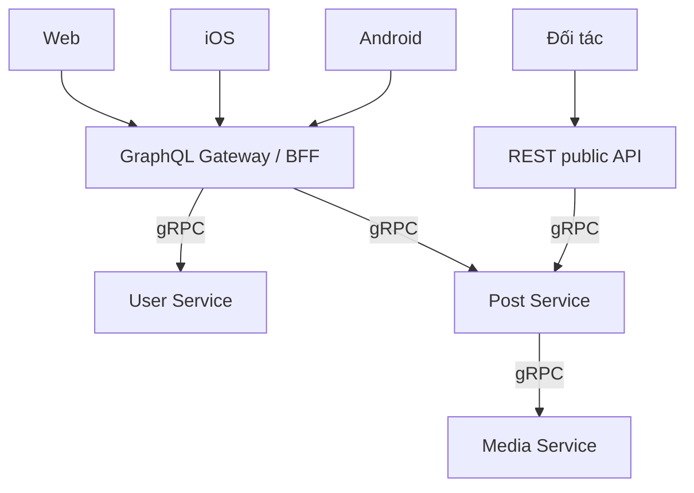

# gRPC & GraphQL

Bên cạnh REST, có hai cách giao tiếp hiện đại xuất hiện rất thường xuyên trong phỏng vấn system design: **gRPC** -- framework RPC hiệu năng cao do Google mã nguồn mở năm 2015, dùng **Protocol Buffers** (định dạng nhị phân có schema) chạy trên **HTTP/2**; và **GraphQL** -- ngôn ngữ truy vấn cho API do Facebook công bố năm 2015, cho phép **client tự mô tả chính xác dữ liệu cần lấy** trong một request. gRPC tối ưu cho **service nói chuyện với service**; GraphQL tối ưu cho **client (web, mobile) lấy dữ liệu linh hoạt**.

**Tương tự đơn giản:** **gRPC** giống đường **ống khí nén** trong bệnh viện: các khoa gửi hộp chuẩn hoá cho nhau cực nhanh, nhưng hộp phải đúng kích cỡ quy định (schema). **GraphQL** giống gọi món ở **quầy salad tự chọn**: thay vì nhận suất cơm cố định (REST endpoint trả sẵn), bạn chỉ định đúng thứ mình muốn -- "rau, gà, không hành" -- và nhận về đúng như vậy trong một lần.

---

:::note[Ghi nhớ nhanh]

- ⭐ **gRPC = Protobuf + HTTP/2 + codegen** — payload nhị phân nhỏ, multiplexing, 4 kiểu streaming, hợp đồng `.proto` chặt; lý tưởng cho microservice nội bộ.
- ⭐ **GraphQL giải quyết over-fetching và under-fetching** — một endpoint, client chọn field, lấy dữ liệu lồng nhau trong một round-trip; hợp với frontend đa dạng.
- **Bẫy lớn của GraphQL là N+1 query** — resolver chạy theo từng field; dùng **DataLoader** để gom (batch) và cache truy vấn trong một request.
- **gRPC trên trình duyệt cần gRPC-Web + proxy**; debug khó hơn REST vì binary.
- **GraphQL khó cache HTTP** (thường `POST` một endpoint) và cần giới hạn độ sâu, độ phức tạp truy vấn để chống query "khủng".
- Protobuf tiến hoá schema an toàn: **không đổi số field, không tái sử dụng số đã xoá**.

:::

---

## Mục lục

- [Vì sao gRPC và GraphQL ra đời?](#vì-sao-grpc-và-graphql-ra-đời)
- [1. gRPC là gì?](#1-grpc-là-gì)
- [2. Protocol Buffers và file .proto](#2-protocol-buffers-và-file-proto)
- [3. Bốn kiểu gọi và streaming trong gRPC](#3-bốn-kiểu-gọi-và-streaming-trong-grpc)
- [4. GraphQL là gì?](#4-graphql-là-gì)
- [5. Schema, query, mutation, subscription](#5-schema-query-mutation-subscription)
- [6. Vấn đề N+1 và DataLoader](#6-vấn-đề-n1-và-dataloader)
- [7. So sánh REST, gRPC và GraphQL](#7-so-sánh-rest-grpc-và-graphql)
- [Khi nào dùng?](#khi-nào-dùng)
- [Lỗi thường gặp](#lỗi-thường-gặp)
- [Câu hỏi phỏng vấn](#câu-hỏi-phỏng-vấn)

---

## Vì sao gRPC và GraphQL ra đời?

**Vấn đề:**

- **Bên trong:** Google có hàng tỷ lời gọi giữa các service mỗi giây. JSON qua HTTP/1.1 tốn băng thông, tốn CPU parse, mỗi kết nối chỉ xử lý một request tại một thời điểm; không có hợp đồng chặt nên mỗi team tự viết client cho từng ngôn ngữ.
- **Bên ngoài:** Facebook năm 2012 xây lại app mobile native. Màn hình News Feed cần dữ liệu từ nhiều nguồn (bài viết, tác giả, ảnh, comment, like). Với REST, app phải gọi **nhiều endpoint** (under-fetching) và mỗi endpoint lại trả **thừa field** (over-fetching) -- rất tệ trên mạng di động chậm.

**Giải pháp:**

- **gRPC** (mở mã từ hệ thống nội bộ Stubby của Google): IDL Protobuf, codegen cho hơn 10 ngôn ngữ, HTTP/2 multiplexing và streaming, deadline/cancellation lan truyền giữa các service.
- **GraphQL**: một schema có kiểu cho toàn bộ dữ liệu, client gửi query mô tả đúng "hình dạng" dữ liệu cần, server trả về đúng hình dạng đó.

:::tip[Dùng thực tế]

- **gRPC:** Netflix, Square, Dropbox, Uber dùng cho giao tiếp nội bộ; Kubernetes (CRI giữa kubelet và container runtime) và etcd v3 API dùng gRPC; Envoy proxy hỗ trợ gRPC native.
- **GraphQL:** Facebook (nguồn gốc), GitHub API v4, Shopify Storefront API, Netflix (Federated GraphQL cho studio), Airbnb.
- **Kết hợp:** GraphQL làm lớp **BFF** (Backend for Frontend) ở biên, phía sau gọi các microservice bằng gRPC.

:::

---

## 1. gRPC là gì?

gRPC là framework RPC mã nguồn mở (dự án CNCF). Bạn định nghĩa **service** và **message** trong file `.proto`, công cụ `protoc` sinh ra code client (stub) và server (interface cần implement) cho ngôn ngữ đích. Lời gọi được truyền qua **HTTP/2** dưới dạng frame nhị phân.



Vì sao gRPC nhanh:

- **Protobuf nhị phân:** field được mã hoá bằng số thứ tự + varint, không lặp lại tên field như JSON. Payload thường nhỏ hơn đáng kể và parse nhanh hơn JSON (mức chênh tuỳ dữ liệu).
- **HTTP/2:** multiplexing nhiều lời gọi trên một kết nối TCP lâu dài, nén header HPACK, không phải bắt tay lại.
- **Codegen:** không có lớp reflection/mapping thủ công.

Tính năng quan trọng cho hệ phân tán:

- **Deadline / timeout:** client đặt deadline, deadline được truyền qua các service tiếp theo -- service phía sau biết còn bao nhiêu thời gian và tự huỷ khi hết.
- **Cancellation:** client huỷ thì server nhận tín hiệu và dừng việc.
- **Status code riêng:** `OK`, `INVALID_ARGUMENT`, `NOT_FOUND`, `DEADLINE_EXCEEDED`, `UNAVAILABLE` (nên retry), `RESOURCE_EXHAUSTED`...
- **Metadata:** tương tự header (token xác thực, trace id).
- **Interceptor:** middleware cho logging, auth, retry, metrics.

Hạn chế:

- **Trình duyệt** không điều khiển được HTTP/2 frame ở mức gRPC cần → phải dùng **gRPC-Web** qua proxy (Envoy) hoặc giao thức Connect.
- **Không đọc được bằng mắt**; cần `grpcurl`, Postman, BloomRPC để debug.
- **Load balancing phức tạp hơn:** kết nối HTTP/2 sống lâu nên L4 load balancer chỉ cân bằng theo kết nối, không theo request -- cần L7 LB (Envoy, Linkerd) hoặc client-side load balancing.

---

## 2. Protocol Buffers và file .proto

File `.proto` mẫu cho Order Service:

```protobuf
syntax = "proto3";

package shop.order.v1;

import "google/protobuf/timestamp.proto";

// Dịch vụ quản lý đơn hàng
service OrderService {
  // Unary: một request, một response
  rpc GetOrder(GetOrderRequest) returns (Order);
  rpc CreateOrder(CreateOrderRequest) returns (Order);

  // Server streaming: server đẩy cập nhật trạng thái liên tục
  rpc WatchOrderStatus(WatchOrderStatusRequest) returns (stream OrderStatusEvent);

  // Client streaming: client gửi nhiều dòng, server trả một tổng kết
  rpc ImportOrders(stream CreateOrderRequest) returns (ImportSummary);

  // Bidirectional streaming: chat hỗ trợ đơn hàng
  rpc SupportChat(stream ChatMessage) returns (stream ChatMessage);
}

enum OrderStatus {
  ORDER_STATUS_UNSPECIFIED = 0; // proto3: giá trị 0 là mặc định
  ORDER_STATUS_PENDING = 1;
  ORDER_STATUS_PAID = 2;
  ORDER_STATUS_SHIPPED = 3;
  ORDER_STATUS_CANCELLED = 4;
}

message OrderItem {
  int64 product_id = 1;
  int32 quantity = 2;
  int64 unit_price = 3; // đơn vị nhỏ nhất (đồng), tránh số thực cho tiền
}

message Order {
  int64 id = 1;
  int64 customer_id = 2;
  repeated OrderItem items = 3;
  OrderStatus status = 4;
  google.protobuf.Timestamp created_at = 5;
  reserved 6;              // field 6 đã xoá, KHÔNG được tái sử dụng
  reserved "coupon_code";
  string note = 7;
}

message GetOrderRequest { int64 id = 1; }
message CreateOrderRequest {
  int64 customer_id = 1;
  repeated OrderItem items = 2;
  string idempotency_key = 3;
}
message WatchOrderStatusRequest { int64 order_id = 1; }
message OrderStatusEvent {
  int64 order_id = 1;
  OrderStatus status = 2;
  google.protobuf.Timestamp at = 3;
}
message ImportSummary { int32 created = 1; int32 failed = 2; }
message ChatMessage { string sender = 1; string text = 2; }
```

Quy tắc tiến hoá schema (backward/forward compatible):

| Được làm | Không được làm |
| --- | --- |
| Thêm field mới với số mới | Đổi **số** của field đã có |
| Xoá field và đánh dấu `reserved` | Tái sử dụng số hoặc tên field đã xoá |
| Đổi tên field (wire format dùng số) -- cẩn thận với JSON mapping | Đổi kiểu field sang kiểu không tương thích |
| Thêm giá trị enum mới | Đổi ý nghĩa giá trị enum cũ |

Client cũ gặp field mới sẽ **bỏ qua**; client mới gặp message cũ thiếu field sẽ nhận **giá trị mặc định** (0, chuỗi rỗng). Nhờ vậy client và server có thể deploy lệch phiên bản.

Server và client Node.js dùng `@grpc/grpc-js` + `@grpc/proto-loader`:

```ts
import * as grpc from '@grpc/grpc-js';
import * as protoLoader from '@grpc/proto-loader';

const definition = protoLoader.loadSync('order.proto', { keepCase: false, longs: String, defaults: true });
const proto = grpc.loadPackageDefinition(definition) as any;
const OrderService = proto.shop.order.v1.OrderService;

// --- Server ---
const server = new grpc.Server();
server.addService(OrderService.service, {
  getOrder: async (call: any, callback: grpc.sendUnaryData<unknown>) => {
    const order = await orderRepo.findById(call.request.id);
    if (!order) return callback({ code: grpc.status.NOT_FOUND, message: 'Không tìm thấy đơn' });
    return callback(null, order);
  },
  watchOrderStatus: (call: any) => {
    const unsubscribe = orderEvents.subscribe(call.request.orderId, (evt) => call.write(evt));
    call.on('cancelled', unsubscribe); // client huỷ thì dọn dẹp
  },
});
server.bindAsync('0.0.0.0:50051', grpc.ServerCredentials.createInsecure(), () => undefined);

// --- Client với deadline ---
const client = new OrderService('orders.internal:50051', grpc.credentials.createInsecure());
const deadline = new Date(Date.now() + 500); // tối đa 500ms
client.getOrder({ id: 42 }, { deadline }, (err: grpc.ServiceError | null, order: unknown) => {
  if (err?.code === grpc.status.DEADLINE_EXCEEDED) {
    // xử lý timeout: fallback hoặc báo lỗi
  }
});
```

(Trong production dùng TLS/mTLS thay cho `createInsecure`.)

---

## 3. Bốn kiểu gọi và streaming trong gRPC

| Kiểu | Mô tả | Ví dụ |
| --- | --- | --- |
| **Unary** | 1 request, 1 response | `GetOrder` |
| **Server streaming** | 1 request, nhiều response | Theo dõi trạng thái đơn, tải danh sách lớn từng phần |
| **Client streaming** | Nhiều request, 1 response | Upload file theo chunk, import hàng loạt |
| **Bidirectional streaming** | Hai chiều độc lập, đồng thời | Chat, đồng bộ vị trí tài xế real-time |



Streaming chạy trên **một stream HTTP/2** nên có **flow control** sẵn: nếu client đọc chậm, window của HTTP/2 đầy và server phải chờ -- back pressure tự nhiên.

---

## 4. GraphQL là gì?

**GraphQL** là **ngôn ngữ truy vấn cho API** và runtime để thực thi truy vấn dựa trên một **schema có kiểu**. Đặc điểm:

- **Một endpoint** (thường `POST /graphql`), thay vì hàng chục endpoint REST.
- **Client chọn field:** response có **đúng hình dạng** của query -- không thừa, không thiếu.
- **Lấy dữ liệu lồng nhau** (user → posts → comments → author) trong **một round-trip**.
- **Schema là hợp đồng** có kiểu, có **introspection** (client hỏi được schema) → công cụ mạnh như GraphiQL, codegen TypeScript.
- **Không versioning kiểu REST:** thêm field mới thoải mái, field cũ đánh dấu `@deprecated`.

So sánh REST với GraphQL cho màn hình "trang cá nhân":



---

## 5. Schema, query, mutation, subscription

Schema (SDL -- Schema Definition Language):

```graphql
type User {
  id: ID!
  name: String!
  avatarUrl: String
  posts(first: Int = 10, after: String): PostConnection!
  followerCount: Int!
}

type Post {
  id: ID!
  title: String!
  body: String!
  author: User!
  comments(first: Int = 10): [Comment!]!
  createdAt: String!
}

type Comment {
  id: ID!
  text: String!
  author: User!
}

type PostConnection {
  edges: [Post!]!
  endCursor: String
  hasNextPage: Boolean!
}

type Query {
  user(id: ID!): User
  feed(first: Int = 20, after: String): PostConnection!
}

input CreatePostInput {
  title: String!
  body: String!
}

type Mutation {
  createPost(input: CreatePostInput!): Post!
}

type Subscription {
  commentAdded(postId: ID!): Comment!
}
```

Query từ client -- chỉ lấy đúng cái cần:

```graphql
query Profile($id: ID!) {
  user(id: $id) {
    name
    avatarUrl
    followerCount
    posts(first: 5) {
      edges {
        title
        comments(first: 2) {
          text
          author { name }
        }
      }
    }
  }
}
```

Ba loại thao tác:

| Loại | Mục đích | Tương đương REST |
| --- | --- | --- |
| **Query** | Đọc dữ liệu | `GET` |
| **Mutation** | Ghi/thay đổi dữ liệu | `POST`, `PUT`, `PATCH`, `DELETE` |
| **Subscription** | Nhận sự kiện real-time (thường qua WebSocket) | SSE, WebSocket |

Server thực thi query bằng **resolver** -- mỗi field có một hàm trả dữ liệu cho field đó. Resolver của field con nhận object cha làm tham số đầu tiên.

---

## 6. Vấn đề N+1 và DataLoader

Vì resolver chạy **theo từng field, từng object**, query trên dễ sinh ra:

- 1 query lấy 20 post của feed, rồi
- **20 query** lấy `author` cho từng post (mỗi post gọi resolver `author` một lần).

Tổng **1 + N** query -- đó là **N+1 problem**. Lồng thêm comments và author của comment thì số query bùng nổ.

```ts
// SAI: mỗi Post gọi DB riêng để lấy author -> N+1
const resolvers = {
  Query: {
    feed: () => db.query('SELECT * FROM posts ORDER BY created_at DESC LIMIT 20'),
  },
  Post: {
    author: (post: { authorId: string }) => db.query('SELECT * FROM users WHERE id = $1', [post.authorId]),
  },
};
```

**DataLoader** (thư viện do Facebook mở mã) giải quyết bằng hai cơ chế:

1. **Batching:** gom mọi lời gọi `loader.load(id)` xảy ra trong **cùng một tick** của event loop, rồi gọi **một** hàm batch với toàn bộ danh sách id → một câu `WHERE id IN (...)` duy nhất.
2. **Caching theo request:** cùng một id được load nhiều lần trong một request chỉ truy vấn một lần.

```ts
import DataLoader from 'dataloader';

type User = { id: string; name: string };

// Tạo loader MỚI cho mỗi request để cache không rò rỉ giữa các user
export function createLoaders() {
  return {
    userById: new DataLoader<string, User | null>(async (ids) => {
      const { rows } = await db.query<User>('SELECT id, name FROM users WHERE id = ANY($1)', [ids]);
      const byId = new Map(rows.map((u) => [u.id, u]));
      return ids.map((id) => byId.get(id) ?? null); // PHẢI trả đúng thứ tự và số lượng như ids
    }),
  };
}

// ĐÚNG: resolver dùng loader từ context
const resolvers = {
  Post: {
    author: (post: { authorId: string }, _args: unknown, ctx: { loaders: ReturnType<typeof createLoaders> }) =>
      ctx.loaders.userById.load(post.authorId),
  },
};

// Khi khởi tạo server (ví dụ Apollo Server): context = () => ({ loaders: createLoaders() })
```



Kết quả: từ 21 query còn **2 query**.

Các vấn đề vận hành khác của GraphQL:

- **Query quá sâu / quá nặng:** client độc hại gửi query lồng 20 cấp (`friends { friends { friends ... } }`). Phòng: giới hạn **depth**, tính **query complexity/cost** (GitHub API tính điểm theo số node), timeout, rate limit theo cost.
- **Persisted queries:** client chỉ gửi hash của query đã đăng ký trước -- giảm payload, cho phép dùng `GET` để cache CDN, và chặn query lạ.
- **Caching:** không cache HTTP theo URL được như REST; dùng cache phía client (Apollo Client, Relay normalized cache), cache theo resolver/DataLoader, hoặc persisted query + `GET`.
- **Lỗi:** GraphQL thường trả `200` kèm mảng `errors` -- có thể vừa có `data` một phần vừa có lỗi. Monitoring phải đọc body, không chỉ status code.
- **Phân quyền theo field:** mỗi field có thể cần kiểm tra quyền -- đặt logic ở tầng business, không rải rác trong resolver.

---

## 7. So sánh REST, gRPC và GraphQL

| Tiêu chí | REST | gRPC | GraphQL |
| --- | --- | --- | --- |
| Đơn vị | Resource | Hành động (method) | Đồ thị dữ liệu, field |
| Transport | HTTP/1.1, 2, 3 | HTTP/2 | HTTP (thường POST), WebSocket cho subscription |
| Định dạng | JSON (thường) | Protobuf nhị phân | JSON |
| Hợp đồng | OpenAPI (tuỳ chọn) | `.proto` bắt buộc | Schema SDL bắt buộc |
| Over/under-fetching | Hay gặp | Theo message định sẵn | Giải quyết |
| Streaming | Hạn chế (SSE) | 4 kiểu, native | Subscription |
| Cache HTTP/CDN | Tốt | Không | Khó (cần persisted query) |
| Trình duyệt | Native | Cần gRPC-Web | Native |
| Hiệu năng truyền tải | Trung bình | Cao | Trung bình (có overhead parse/resolve) |
| Độ khó vận hành | Thấp | Trung bình (LB L7, tool) | Cao (N+1, cost limit, auth theo field) |
| Hợp nhất với | Public API, CRUD | Microservice nội bộ | Frontend đa dạng, BFF |



---

## Khi nào dùng?

**gRPC -- nên dùng:**

- Microservice nội bộ, lưu lượng lớn, cần latency thấp.
- Môi trường đa ngôn ngữ cần hợp đồng chặt và codegen.
- Cần streaming (real-time location, telemetry, chat giữa service).
- Kết nối mobile tới backend khi kiểm soát cả hai đầu và cần tiết kiệm băng thông.

**gRPC -- không nên dùng:**

- API public cho developer bên ngoài muốn dùng `curl`.
- Gọi trực tiếp từ trình duyệt mà không muốn thêm proxy.

**GraphQL -- nên dùng:**

- Nhiều loại client (web, iOS, Android) cần dữ liệu khác nhau từ cùng nguồn.
- Màn hình tổng hợp dữ liệu từ nhiều service (BFF/API gateway).
- Frontend thay đổi nhanh, không muốn chờ backend tạo endpoint mới.

**GraphQL -- không nên dùng:**

- API đơn giản kiểu CRUD, ít client -- REST đủ và rẻ hơn.
- Cần cache CDN mạnh cho dữ liệu công khai.
- Upload file lớn, streaming nhị phân.
- Team chưa sẵn sàng xử lý N+1, cost limit, phân quyền theo field.

---

## Lỗi thường gặp

### Lỗi 1: GraphQL không dùng DataLoader

Mọi thứ chạy nhanh khi dev với 5 bản ghi, production với feed 50 item sinh hàng trăm query mỗi request. **Sửa:** DataLoader cho mọi quan hệ, tạo loader mới mỗi request, theo dõi số query/request.

### Lỗi 2: Không giới hạn độ sâu và độ phức tạp query

Một query đệ quy có thể làm sập DB. **Sửa:** depth limit, cost analysis, timeout, persisted queries cho client chính thức.

### Lỗi 3: Tái sử dụng số field trong protobuf

Xoá field 6 rồi thêm field mới cũng dùng số 6 với kiểu khác -- client cũ đọc sai dữ liệu âm thầm. **Sửa:** luôn `reserved` số và tên đã xoá; dùng công cụ kiểm tra breaking change như `buf breaking` trong CI.

### Lỗi 4: Load balancing gRPC bằng L4

Kết nối HTTP/2 sống lâu nên L4 LB dồn mọi request của một client vào một pod; scale thêm pod cũng không đỡ tải. **Sửa:** L7 LB (Envoy, Istio, Linkerd), hoặc client-side LB với service discovery, hoặc giới hạn tuổi kết nối (`max connection age`).

### Lỗi 5: gRPC không đặt deadline

Mặc định không có deadline, một service treo kéo theo cả chuỗi. **Sửa:** mọi lời gọi có deadline, truyền deadline xuống service phía sau.

### Lỗi 6: Cache DataLoader dùng chung giữa các request

Tạo DataLoader một lần ở module level: dữ liệu user A có thể bị trả cho user B, và cache không bao giờ hết hạn. **Sửa:** khởi tạo trong context cho từng request.

---

## Câu hỏi phỏng vấn

**1. gRPC nhanh hơn REST+JSON nhờ đâu?**

<details className="qa">
<summary>Xem đáp án</summary>

Protobuf nhị phân (nhỏ, không lặp tên field, parse nhanh bằng code sinh sẵn); HTTP/2 multiplexing nhiều lời gọi trên một kết nối lâu dài, nén header; codegen loại bỏ mapping thủ công. Thêm streaming và deadline propagation giúp xây hệ phân tán hiệu quả. Đổi lại: khó debug, trình duyệt cần gRPC-Web, cần L7 load balancing.

</details>

**2. Bốn kiểu RPC của gRPC là gì? Cho ví dụ.**

<details className="qa">
<summary>Xem đáp án</summary>

Unary (lấy một đơn hàng), server streaming (theo dõi trạng thái đơn, tải danh sách lớn), client streaming (upload file theo chunk, import hàng loạt), bidirectional streaming (chat, đồng bộ vị trí tài xế). Streaming dựa trên HTTP/2 stream nên có flow control sẵn.

</details>

**3. N+1 problem trong GraphQL là gì và giải quyết thế nào?**

<details className="qa">
<summary>Xem đáp án</summary>

Resolver chạy theo từng object: 1 query lấy N post rồi N query lấy author cho từng post. Giải quyết bằng DataLoader: gom các `load(id)` trong cùng tick thành một truy vấn `WHERE id IN (...)`, và cache theo request. Ngoài ra có thể dùng join/lookahead (phân tích query để join trước) cho trường hợp đặc biệt.

</details>

**4. GraphQL khác REST thế nào? Khi nào không nên dùng GraphQL?**

<details className="qa">
<summary>Xem đáp án</summary>

GraphQL có một endpoint, schema có kiểu, client chọn đúng field, lấy dữ liệu lồng nhau trong một round-trip, không cần versioning. REST nhiều endpoint theo resource, tận dụng cache HTTP, đơn giản. Không nên dùng GraphQL cho API CRUD đơn giản, khi cần cache CDN mạnh, upload file lớn, hoặc team chưa sẵn sàng với N+1, cost limit, phân quyền theo field.

</details>

**5. Làm sao bảo vệ GraphQL server khỏi query độc hại?**

<details className="qa">
<summary>Xem đáp án</summary>

Giới hạn depth; tính cost/complexity theo số node dự kiến và từ chối query vượt ngưỡng; rate limit theo cost thay vì theo request; timeout thực thi; persisted queries (chỉ chấp nhận query đã đăng ký); tắt introspection ở production nếu là API nội bộ; giới hạn `first`/`limit` tối đa cho danh sách.

</details>

**6. Làm sao tiến hoá schema protobuf mà không làm vỡ client?**

<details className="qa">
<summary>Xem đáp án</summary>

Chỉ thêm field mới với số mới; không đổi số hay kiểu của field cũ; khi xoá thì `reserved` cả số và tên; enum luôn có giá trị 0 UNSPECIFIED và chỉ thêm giá trị mới. Client cũ bỏ qua field lạ, client mới nhận giá trị mặc định cho field thiếu. Kiểm tra tự động bằng `buf breaking` trong CI; thay đổi phá vỡ thì tạo package version mới (`v2`).

</details>
